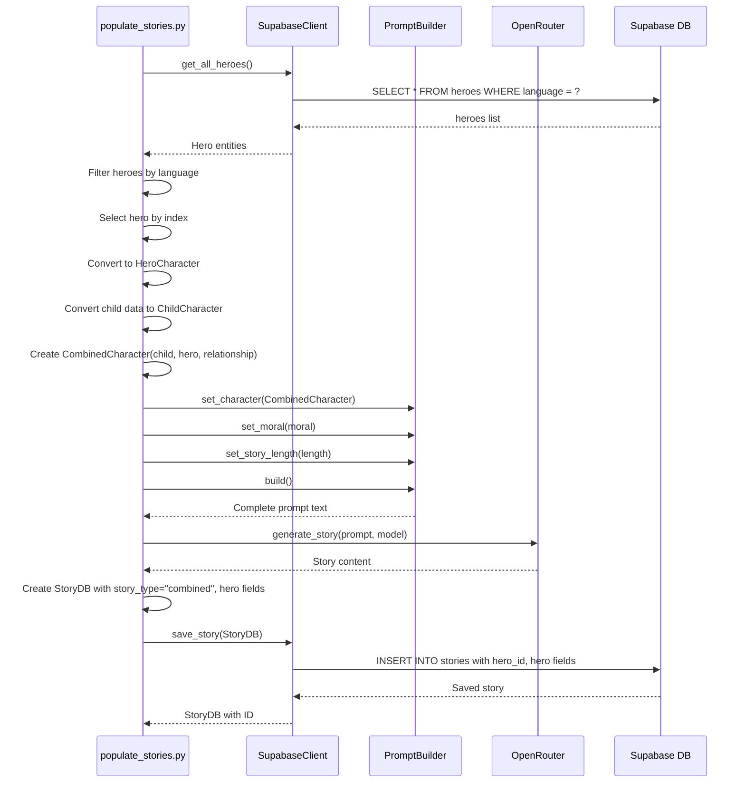
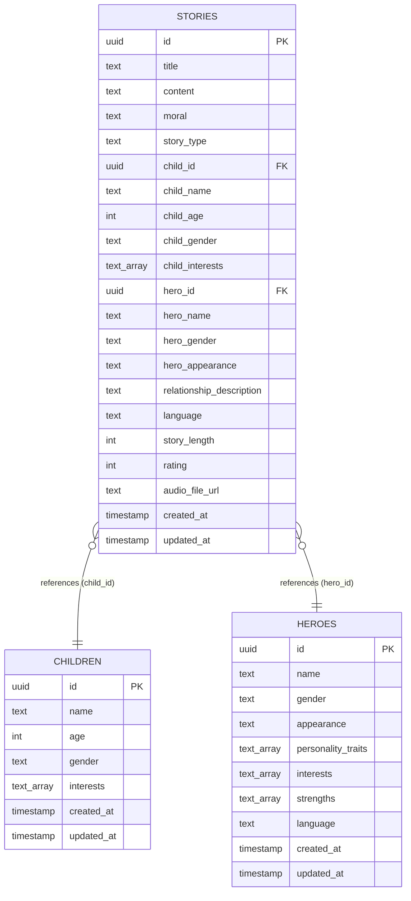

# Feature Design: Add Combined Story Type Support

## Overview

Enable the tale generator system to create and store stories featuring both a child and a hero character together in the same narrative. The `CombinedCharacter` class already exists in the prompt system, but the database schema, data models, and story generation scripts need to be extended to support this story type.

## Strategic Intent

This feature expands the narrative possibilities by allowing stories where children interact with heroes, creating mentor-mentee relationships, adventure partnerships, or learning experiences. This combines the personalization of child-based stories with the aspirational elements of hero-based stories.

## Requirements

### Functional Requirements

1. The system must support generating stories with story_type "combined" that feature both a child and a hero
2. The system must store hero_id and hero-related metadata in the stories table when story_type is "combined"
3. The populate_stories.py script must be able to generate combined stories using CombinedCharacter
4. The system must allow optional relationship descriptions between child and hero in combined stories
5. Combined stories must support all existing features: audio generation, rating, multi-language support

### Non-Functional Requirements

1. Database schema must maintain backward compatibility with existing child and hero story types
2. Combined stories must generate prompts in both English and Russian languages
3. Hero selection should rotate through available heroes filtered by language
4. The system must preserve all existing story generation functionality

## System Context

### Existing Architecture Components

The system follows a layered architecture with these relevant components:

- **Domain Layer**: Contains Hero and Child entities, CombinedCharacter already implemented in prompts module
- **Infrastructure Layer**: Supabase persistence with stories and heroes tables
- **Application Layer**: Story generation use cases and prompt building
- **Scripts**: populate_stories.py for generating sample data

### Current Story Type Support

The system currently supports two story types:
- **child**: Stories centered around a child character with personalized interests
- **hero**: Stories centered around a hero character with heroic attributes

The prompt system already supports CombinedCharacter, but this is not integrated with persistence or generation workflows.

## High-Level Design

### Data Model Extensions

The stories table must be extended to support combined story types:

| Field | Type | Nullability | Purpose |
|-------|------|-------------|---------|
| story_type | TEXT | NOT NULL | Discriminator field: "child", "hero", or "combined" |
| hero_id | UUID | NULL | Foreign key reference to heroes table, required when story_type is "combined" or "hero" |
| hero_name | TEXT | NULL | Denormalized hero name for performance, populated when story_type is "combined" or "hero" |
| hero_gender | TEXT | NULL | Denormalized hero gender, populated when story_type is "combined" or "hero" |
| hero_appearance | TEXT | NULL | Denormalized hero appearance, populated when story_type is "combined" or "hero" |
| relationship_description | TEXT | NULL | Optional description of child-hero relationship, used when story_type is "combined" |

**Design Rationale**: Denormalization of hero data follows the existing pattern for child data, optimizing read performance while maintaining referential integrity through hero_id foreign key.

### Database Migration Strategy

A new Supabase migration will be created to add the required fields:

**Migration Goals**:
- Add story_type column with default value "child" for backward compatibility
- Add hero-related columns (all nullable to support existing records)
- Create foreign key constraint from hero_id to heroes table
- Create indexes for query performance on story_type and hero_id
- Add check constraint to ensure hero_id is NOT NULL when story_type is "hero" or "combined"

**Backward Compatibility Approach**:
- Existing records will automatically receive story_type = "child"
- Hero-related fields remain NULL for child-only stories
- No changes required to existing child or hero story generation logic

### StoryDB Model Extensions

The StoryDB Pydantic model in src/models.py must be extended:

**New Fields**:
- story_type: Optional[str] with default "child"
- hero_id: Optional[str] for foreign key reference
- hero_name: Optional[str] for denormalized hero name
- hero_gender: Optional[str] for denormalized hero gender
- hero_appearance: Optional[str] for denormalized hero appearance
- relationship_description: Optional[str] for combined story relationship

**Validation Strategy**: The model should validate that when story_type is "combined" or "hero", the hero_id must be provided. This ensures data integrity at the application level.

### Supabase Client Extensions

The SupabaseClient class must be extended to handle hero-related fields:

**save_story Method Modifications**:
- Include story_type in field mapping
- Include all hero-related fields in the insert/update operations
- Map hero-related fields between Python and database naming conventions

**get_story Method Modifications**:
- Retrieve and map hero-related fields when reconstructing StoryDB objects
- Handle NULL hero fields gracefully for backward compatibility

**Query Methods**:
No new query methods are strictly required, but the system should support filtering stories by story_type in future iterations.

### Story Generation Workflow for Combined Type

The combined story generation process follows these steps:

1. **Character Selection Phase**:
   - Select a child from the saved children list
   - Retrieve all heroes from the database filtered by the target language
   - Select a hero by rotating through the language-filtered hero list

2. **Character Conversion Phase**:
   - Convert child data dictionary to ChildCharacter instance
   - Convert Hero domain entity to HeroCharacter instance
   - Create CombinedCharacter with both characters and optional relationship description

3. **Prompt Building Phase**:
   - Select appropriate prompt builder based on language (EnglishPromptBuilder or RussianPromptBuilder)
   - Set character to the CombinedCharacter instance
   - Set moral value and story length
   - Build the complete prompt

4. **Story Generation Phase**:
   - Generate story content using OpenRouterClient with the combined prompt
   - Extract title from generated content
   - Generate audio if GENERATE_AUDIO is enabled

5. **Story Persistence Phase**:
   - Create StoryDB instance with:
     - story_type = "combined"
     - child-related fields populated from child data
     - hero-related fields populated from hero entity
     - relationship_description populated if provided
   - Save to database using SupabaseClient

### populate_stories.py Modifications

**STORY_TYPES Constant Update**:
Extend the story types list to include "combined":
```
STORY_TYPES = ["child", "hero", "combined"]
```

**create_story_prompt Function Extension**:
Add a new branch to handle story_type "combined":
- Retrieve child data and convert to ChildCharacter
- Retrieve heroes from database filtered by language
- Select hero by index (rotating through list)
- Convert Hero entity to HeroCharacter
- Create CombinedCharacter with optional relationship description
- Build prompt using the language-appropriate builder

**Relationship Description Strategy**:
The relationship description should be dynamically generated or selected from a predefined set:
- Use generic templates like: "{child_name} meets {hero_name} and they embark on an adventure together"
- Language-specific templates for English and Russian
- Keep descriptions concise and age-appropriate

**generate_single_story Function Extension**:
When story_type is "combined":
- Store hero entity reference during story generation
- Populate hero-related fields in StoryDB instance
- Include relationship_description if generated

### Prompt Building with CombinedCharacter

The existing prompt builders already support CombinedCharacter through the character_description_component. The workflow is:

1. **CombinedCharacter Creation**:
   - Instantiate with ChildCharacter and HeroCharacter
   - Optionally provide relationship description
   - The class automatically merges interests from both characters

2. **Prompt Builder Configuration**:
   - Call set_character with CombinedCharacter instance
   - Set moral value, story length, and language
   - Build method generates prompt with both character descriptions

3. **Generated Prompt Structure**:
   - Includes separate sections for Child Character and Hero Character
   - Includes merged interests from both characters
   - Includes relationship description if provided
   - Instructs the LLM to feature both characters in the narrative

The ending_component already handles combined type by instructing the LLM to include both characters' names in the story conclusion.

## Data Flow

### Combined Story Generation Flow



### Database Relationships



## Migration Sequence

The implementation should follow this sequence:

1. **Database Schema Migration**:
   - Create migration file: 011_add_story_type_and_hero_fields.sql
   - Add story_type column with default "child"
   - Add hero-related columns (all nullable)
   - Add foreign key constraint to heroes table
   - Create indexes for performance
   - Add check constraint for hero_id when story_type requires it

2. **Data Model Updates**:
   - Extend StoryDB model in src/models.py
   - Extend StoryDB model in src/infrastructure/persistence/models.py if needed
   - Update Story domain entity if needed

3. **Repository Layer Updates**:
   - Update SupabaseClient.save_story method to handle hero fields
   - Update SupabaseClient.get_story method to map hero fields
   - Update field mapping dictionaries

4. **Script Updates**:
   - Update STORY_TYPES constant in populate_stories.py
   - Extend create_story_prompt function with "combined" branch
   - Extend generate_single_story function to populate hero fields
   - Add relationship description generation logic

5. **Testing and Validation**:
   - Run populate_stories.py to generate sample combined stories
   - Verify stories are saved with correct story_type and hero fields
   - Verify backward compatibility with existing child and hero stories
   - Verify multi-language support for combined stories

## Edge Cases and Considerations

### Language Consistency

**Requirement**: The hero selected for a combined story must match the story's language.

**Implementation Strategy**: Filter heroes by language before selection. If no heroes exist for the target language, raise an error or fall back to child-only story.

**Error Handling**: Log a warning and skip combined story generation if no heroes are available for the selected language.

### Hero Selection Rotation

**Goal**: Distribute hero usage evenly across generated stories.

**Strategy**: Use modulo arithmetic on the story index to rotate through the language-filtered hero list. This ensures each hero appears approximately equally in the generated sample data.

### Missing Hero Data

**Scenario**: What if the hero referenced by hero_id is deleted from the database?

**Mitigation**: Foreign key constraint should prevent hero deletion if stories reference it. Alternatively, use ON DELETE SET NULL to preserve story records but clear hero reference.

**Preferred Approach**: Use ON DELETE RESTRICT to prevent accidental hero deletion when stories reference them.

### Backward Compatibility

**Existing Stories**: All existing stories will receive story_type = "child" through the migration default value.

**Existing Queries**: Queries that don't filter by story_type will continue to work, returning all story types.

**API Compatibility**: If an API exists, it should handle missing hero fields gracefully and return them as NULL for child-only stories.

### Relationship Description

**When to Populate**: Only populate relationship_description when story_type is "combined".

**Default Behavior**: If no relationship is explicitly provided, generate a simple template-based description.

**Language Support**: Relationship descriptions should be generated in the target language of the story.

**Example Templates**:
- English: "{child_name} meets the legendary {hero_name}"
- Russian: "{child_name} встречает легендарного героя {hero_name}"

### Story Length and Complexity

**Consideration**: Combined stories may naturally be longer or more complex due to featuring two characters.

**Recommendation**: Consider increasing default story_length for combined stories (e.g., 5-7 minutes instead of 3).

**No Enforcement**: Do not enforce longer lengths programmatically; allow the LLM to determine appropriate length based on the prompt.

### Audio Generation for Combined Stories

**No Special Handling Required**: Audio generation for combined stories works the same as for other story types. The full story content is narrated regardless of character composition.

**Voice Selection**: Use the same voice selection logic based on language and child gender. Hero gender does not affect voice selection.

## Validation Rules

### Story Type and Hero Field Relationships

| story_type | hero_id | hero_name | relationship_description | Valid? |
|------------|---------|-----------|-------------------------|--------|
| child | NULL | NULL | NULL | Yes |
| hero | NOT NULL | NOT NULL | NULL | Yes |
| combined | NOT NULL | NOT NULL | Optional | Yes |
| combined | NULL | NULL | Any | No - Validation Error |
| hero | NULL | NULL | Any | No - Validation Error |

### Database Constraints

The database must enforce:
- hero_id must reference an existing hero in the heroes table (foreign key)
- story_type must be one of: "child", "hero", "combined"
- When story_type is "hero" or "combined", hero_id must NOT be NULL
- When hero_id is NOT NULL, hero_name must also NOT be NULL

### Application-Level Validation

The StoryDB model should validate:
- story_type is one of the allowed values
- hero_id is provided when story_type requires it
- child_id is always provided (existing behavior)

## Success Criteria

The feature is successfully implemented when:

1. Database migration executes without errors and creates all required fields
2. StoryDB model correctly stores and retrieves hero-related fields
3. populate_stories.py successfully generates combined stories with both child and hero
4. Generated combined stories use CombinedCharacter in prompts
5. Combined stories are persisted with story_type = "combined" and populated hero fields
6. Existing child and hero story generation continues to work without modification
7. Combined stories are generated in both English and Russian
8. Rating, audio generation, and other features work correctly for combined stories
9. No breaking changes to existing API or query interfaces

## Future Enhancements

While not part of this initial implementation, consider these future improvements:

1. **API Endpoints**: Add story_type filter to GET /stories endpoint
2. **Relationship Templates**: Build a library of pre-written relationship templates in multiple languages
3. **Multiple Heroes**: Allow stories with multiple heroes (not just one)
4. **Dynamic Relationship Generation**: Use LLM to generate creative relationship descriptions based on child and hero attributes
5. **Hero Recommendations**: Suggest heroes that pair well with specific child interests
6. **Analytics**: Track which hero-child combinations produce highest-rated stories

## Dependencies

This feature depends on:

1. **Existing Database Tables**: children table, heroes table with populated data
2. **Existing Prompt System**: CombinedCharacter, EnglishPromptBuilder, RussianPromptBuilder
3. **Existing Domain Entities**: Hero, Child entities
4. **Supabase Migration System**: Ability to execute SQL migrations on tales schema
5. **Hero Data**: At least one hero must exist for each supported language

No external service dependencies are introduced by this feature.

## Risk Assessment

**Low Risk Areas**:
- Prompt generation: CombinedCharacter is already tested and functional
- Backward compatibility: Default values and nullable fields prevent breaking changes

**Medium Risk Areas**:
- Database migration: Requires careful testing to ensure constraint logic is correct
- Data model validation: Must ensure hero_id/story_type relationships are properly validated

**Mitigation Strategies**:
- Test migration on a development database before production
- Add comprehensive validation in StoryDB model
- Test populate_stories.py with various configurations
- Verify foreign key constraints work as expected

## Technical Notes

### Hero Entity to HeroCharacter Conversion

When creating CombinedCharacter, the Hero domain entity must be converted to HeroCharacter:

**Mapping**:
- name: Hero.name
- age: Default to 25 (Hero entity doesn't have age field)
- gender: Hero.gender (convert enum to string if needed)
- appearance: Hero.appearance
- personality_traits: Hero.personality_traits
- strengths: Hero.strengths
- interests: Hero.interests
- language: Hero.language
- description: Set to None (optional field)

### Language Filtering for Heroes

Heroes must be filtered by language before selection to ensure consistency:

**Filter Logic**:
```
language_heroes = [h for h in all_heroes if h.language == target_language]
```

**Selection Logic**:
```
hero_index_in_list = story_index % len(language_heroes)
selected_hero = language_heroes[hero_index_in_list]
```

This ensures even distribution of heroes in the generated stories while respecting language constraints.

### Story Type Display in Logs

The logging output should clearly indicate story type:
- "Generating combined story X/Y for {child_name} with {hero_name}..."
- "Story saved with ID: {id}, Type: combined"

This helps with debugging and monitoring the generation process.
