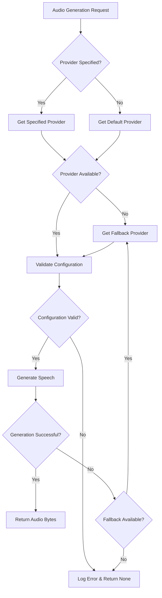

# Design: Multiple Voice-Over Provider Support

## Overview

This design establishes a flexible, extensible architecture to support multiple text-to-speech providers in the tale-generator application. Currently, the system is tightly coupled to ElevenLabs. The new architecture will enable seamless addition of alternative providers such as Google Cloud Text-to-Speech, Amazon Polly, Azure Speech, or OpenAI TTS while maintaining backward compatibility.

## Business Value

- **Flexibility**: Ability to switch between providers based on cost, quality, or availability
- **Resilience**: Fallback mechanisms when primary provider is unavailable
- **Cost Optimization**: Choose providers based on pricing tiers or usage quotas
- **Feature Diversity**: Access provider-specific features such as voice variety, language support, or audio quality
- **Vendor Independence**: Reduce lock-in to a single service provider

## Design Goals

1. Maintain existing ElevenLabs functionality without breaking changes
2. Enable easy addition of new providers through a common interface
3. Support provider selection at runtime via configuration
4. Allow provider-specific settings and capabilities
5. Implement graceful fallback when a provider fails
6. Keep the audio generation request interface unchanged for API consumers

## Architecture Strategy

### Provider Abstraction Layer

Introduce an abstract base interface that all voice-over providers must implement. This establishes a uniform contract for audio generation regardless of the underlying service.

#### Core Provider Interface

All providers must implement the following capabilities:

| Method | Purpose | Input Parameters | Return Value |
|--------|---------|-----------------|--------------|
| generate_speech | Convert text to audio | text (string), language (string), voice_options (dict) | audio_bytes or None |
| get_supported_languages | Query available languages | None | List of language codes |
| get_available_voices | Query available voices | language (optional string) | List of voice identifiers |
| validate_configuration | Verify provider setup | None | Boolean indicating readiness |

#### Provider Metadata

Each provider exposes metadata for discovery and selection:

| Property | Type | Description |
|----------|------|-------------|
| provider_name | string | Unique identifier for the provider |
| display_name | string | Human-readable name |
| supports_streaming | boolean | Whether provider can stream audio |
| max_text_length | integer | Maximum characters per request |
| supported_formats | list | Audio formats available |

### Provider Registry

A centralized registry manages available providers and handles provider discovery.

**Registry Responsibilities**:
- Register providers at application startup
- Query available providers
- Retrieve specific provider by name
- Return default provider when no preference specified
- Validate provider availability before usage

**Provider Selection Logic**:
1. Use explicitly requested provider if specified
2. Fall back to configured default provider
3. Fall back to first available registered provider
4. Return error if no providers available

### Configuration Management

Provider configuration will be managed through environment variables and optional configuration files.

#### Environment Variables

| Variable | Purpose | Example Value |
|----------|---------|---------------|
| DEFAULT_VOICE_PROVIDER | Primary provider to use | elevenlabs |
| VOICE_PROVIDER_FALLBACK | Comma-separated fallback list | google,azure |
| ELEVENLABS_API_KEY | ElevenLabs authentication | sk_... |
| GOOGLE_CLOUD_CREDENTIALS | Google Cloud credential path | /path/to/key.json |
| AZURE_SPEECH_KEY | Azure Speech service key | abc123... |
| AZURE_SPEECH_REGION | Azure service region | eastus |
| OPENAI_API_KEY | OpenAI API key | sk-proj-... |

#### Provider-Specific Configuration

Each provider may have unique settings that don't apply universally. These are encapsulated within provider-specific configuration objects.

**ElevenLabs Configuration Example**:
- Voice stability setting
- Similarity boost level
- Style parameter
- Speaker boost flag
- Model ID preference

**Google Cloud TTS Configuration Example**:
- Audio encoding format
- Speaking rate multiplier
- Pitch adjustment
- Volume gain

### API Request Model Extension

The existing StoryRequest model will be extended to support provider selection.

#### Additional Request Fields

| Field Name | Type | Required | Default | Description |
|------------|------|----------|---------|-------------|
| voice_provider | string | No | None | Specific provider to use |
| voice_options | dict | No | {} | Provider-specific voice settings |

When voice_provider is not specified, the system uses the configured default provider.

### Audio Generation Flow

The audio generation workflow orchestrates provider selection, execution, and error handling.

### Error Handling Strategy

The system implements multiple layers of error handling to ensure robustness:

**Provider-Level Errors**:
- Invalid API credentials → Log warning, try fallback provider
- Network timeout → Retry with exponential backoff, then fallback
- Rate limit exceeded → Wait and retry, or switch to fallback
- Unsupported language → Try fallback provider or return error

**System-Level Errors**:
- No providers available → Return None, log critical error
- Configuration invalid → Fail early at startup with clear message
- Audio upload failure → Return audio bytes but log warning

**Logging Requirements**:
- Log provider selection decisions at INFO level
- Log provider failures at WARNING level
- Log fallback usage at INFO level
- Log complete failure at ERROR level with full context

### Database Schema Considerations

The stories table should track which provider generated the audio to enable analytics and debugging.

#### Stories Table Extension

| Column Name | Type | Purpose |
|-------------|------|---------|
| audio_provider | string | Provider used for audio generation |
| audio_generation_metadata | jsonb | Provider-specific generation details |

This information enables:
- Cost analysis per provider
- Quality comparison between providers
- Debugging audio generation issues
- Usage pattern analysis

### Migration Path

The transition to multiple providers must not disrupt existing functionality.

**Phase 1: Abstraction Layer**
- Introduce provider interface
- Implement ElevenLabs provider as first concrete implementation
- Create provider registry
- Update configuration loading

**Phase 2: Integration**
- Modify audio generation calls to use registry
- Add provider selection logic to API routes
- Update database schema with provider tracking
- Deploy with ElevenLabs as only available provider

**Phase 3: Extension**
- Implement additional provider adapters
- Enable multi-provider configuration
- Add fallback logic
- Document provider-specific features

### Provider Implementation: ElevenLabs

The existing ElevenLabsClient will be refactored to implement the provider interface.

**Key Adaptations**:
- Implement all required interface methods
- Preserve existing voice selection logic
- Maintain current voice settings defaults
- Expose provider metadata
- Handle errors consistently with interface contract

**Voice Selection Strategy**:
- Language-based voice matching
- Fallback to multilingual model
- Voice caching for performance

### Provider Implementation: Future Providers

When adding new providers, the following structure should be followed:

**File Organization**:
- Each provider in separate module: `src/voice_providers/{provider_name}_provider.py`
- Provider-specific models in same module
- Registration in provider registry during startup

**Implementation Checklist**:
- Implement all required interface methods
- Handle provider-specific authentication
- Map generic parameters to provider-specific API
- Implement provider-specific error handling
- Document provider-specific features and limitations
- Add configuration validation
- Write provider-specific tests

### Testing Strategy

The architecture must be testable at multiple levels.

**Unit Testing**:
- Test each provider implementation independently
- Mock external API calls
- Verify error handling for each provider
- Test configuration validation

**Integration Testing**:
- Test provider registry functionality
- Verify fallback mechanisms
- Test end-to-end audio generation flow
- Validate database provider tracking

**Mock Provider**:
Create a test provider that returns synthetic audio data for testing without API costs.

### Performance Considerations

**Provider Initialization**:
- Lazy load providers to avoid startup delays
- Cache provider instances after first use
- Validate credentials asynchronously when possible

**Voice Discovery**:
- Cache available voices per provider
- Refresh cache periodically or on-demand
- Handle cache invalidation gracefully

**Concurrent Requests**:
- Providers should be thread-safe
- Support multiple concurrent audio generation requests
- Respect provider-specific rate limits

### Security Considerations

**API Key Management**:
- Store all provider credentials in environment variables
- Never log or expose API keys
- Validate credential format before usage
- Support credential rotation without code changes

**Audio Data Handling**:
- Ensure audio data is transmitted securely to storage
- Validate audio data before storage upload
- Handle sensitive text content appropriately
- Comply with provider terms of service regarding data usage

## Implementation Boundaries

**In Scope**:
- Provider abstraction interface
- Provider registry system
- ElevenLabs provider refactoring
- Configuration management updates
- Database schema extension
- API request model extension
- Fallback mechanism
- Error handling framework

**Out of Scope**:
- Specific implementation of additional providers beyond ElevenLabs
- Audio format conversion between providers
- Real-time streaming audio generation
- Voice cloning or custom voice training
- Audio post-processing or enhancement
- Cost tracking and billing analysis
- Provider performance monitoring dashboard

## Success Criteria

The implementation will be considered successful when:

1. ElevenLabs continues to function with no regression in existing features
2. New providers can be added by implementing a single interface without modifying core logic
3. Provider selection can be configured via environment variables
4. Fallback mechanism successfully switches providers on failure
5. Audio generation requests remain unchanged for API consumers
6. Provider information is properly tracked in the database
7. Comprehensive error messages guide troubleshooting
8. System gracefully handles missing or misconfigured providers

## Non-Functional Requirements

**Maintainability**:
- Clear separation between provider-specific code and core logic
- Consistent error handling patterns
- Comprehensive documentation for adding new providers

**Reliability**:
- Graceful degradation when providers are unavailable
- No silent failures in audio generation
- Proper cleanup of resources on errors

**Extensibility**:
- New providers addable with minimal code changes
- Provider-specific features accessible without breaking abstraction
- Configuration extensible for new provider parameters

**Performance**:
- Provider initialization adds no more than 500ms to startup time
- Audio generation latency unchanged compared to current implementation
- Fallback adds no more than 2 seconds overhead
