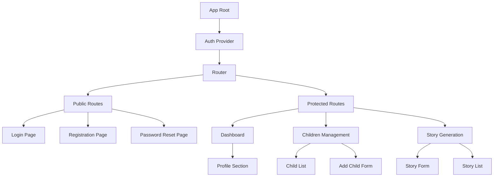
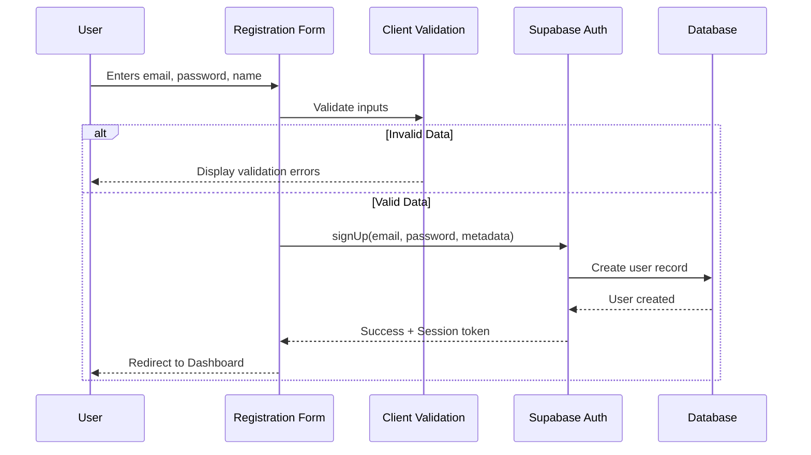
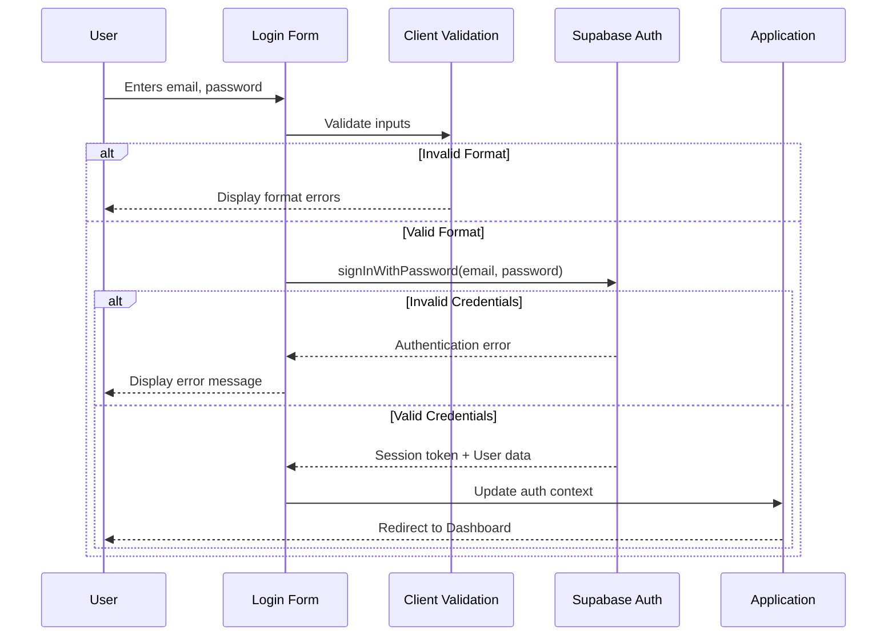
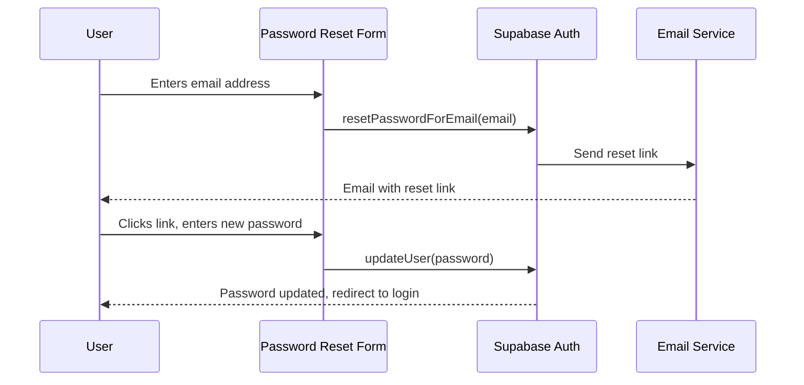

# Frontend Registration Design

## Purpose

This design document outlines the implementation of a user registration and authentication system for the Tale Generator application frontend. The system will leverage Supabase Authentication to provide secure user registration, login, and session management capabilities.

## Strategic Objectives

- Enable parents to create individual accounts to manage their children's profiles and stories
- Provide secure authentication using Supabase Auth
- Establish user session management for personalized experiences
- Create a foundation for multi-user access with proper data isolation
- Ensure seamless integration with the existing backend API

## System Context

The Tale Generator currently operates as a backend service with a basic admin interface that does not require authentication. This registration system will transform it into a multi-user application where:

- Each parent creates an account with email and password
- Authenticated users can manage their own children's profiles
- Stories and data are isolated by user account
- The existing backend API will be extended to support user context

## Scope

### In Scope

- User registration with email and password
- User login and logout
- Password recovery and reset flow
- Session persistence and management
- Protected routes requiring authentication
- Registration form with validation
- Login form with validation
- Basic user profile information storage
- Integration with Supabase Auth service

### Out of Scope

- OAuth social login providers (future enhancement)
- Multi-factor authentication
- Email verification (can be added later)
- Account deletion workflow
- User roles and permissions beyond basic authentication
- Admin vs regular user distinction
- Profile editing beyond registration

## Architecture Overview

### Frontend Technology Selection

The frontend will be implemented as a modern Single Page Application using:

- **Framework**: React with TypeScript for type safety and component-based architecture
- **Build Tool**: Vite for fast development and optimized production builds
- **Styling**: Tailwind CSS for responsive, utility-first design (consistent with modern web practices)
- **Routing**: React Router for client-side navigation
- **State Management**: React Context API for authentication state
- **Form Handling**: React Hook Form for declarative form validation
- **HTTP Client**: Supabase JavaScript client for authentication and API communication

### Component Architecture

## User Experience Flow

### Registration Flow

### Login Flow

### Password Reset Flow

## Data Models

### User Profile (Supabase Auth + Custom Metadata)

| Field | Type | Required | Description |
|-------|------|----------|-------------|
| id | UUID | Yes | Generated by Supabase (primary key) |
| email | String | Yes | User's email address (unique) |
| password | String | Yes | Hashed password (managed by Supabase) |
| name | String | Yes | Parent's full name |
| created_at | Timestamp | Yes | Account creation timestamp |
| updated_at | Timestamp | Yes | Last update timestamp |
| email_confirmed_at | Timestamp | No | Email confirmation timestamp |
| last_sign_in_at | Timestamp | No | Last login timestamp |

### Session Information

| Field | Type | Description |
|-------|------|-------------|
| access_token | String | JWT token for API authentication |
| refresh_token | String | Token for refreshing access token |
| expires_at | Timestamp | Token expiration time |
| user | Object | User profile data |

## Page Specifications

### Registration Page

**Purpose**: Allow new users to create an account

**URL Route**: `/register`

**Form Fields**:
- Full Name (text input, required, min 2 characters)
- Email Address (email input, required, valid email format)
- Password (password input, required, min 8 characters, must include uppercase, lowercase, number)
- Confirm Password (password input, required, must match password)
- Terms of Service acceptance (checkbox, required)

**Validation Rules**:
- Email must be unique (checked by Supabase)
- Password strength indicator displayed
- Real-time validation feedback
- Submit button disabled until all validations pass

**Success Behavior**:
- Display success message
- Automatically log in the user
- Redirect to dashboard or onboarding flow

**Error Handling**:
- Email already registered: Display message with link to login
- Network errors: Display retry option
- Validation errors: Inline field-level error messages

### Login Page

**Purpose**: Authenticate existing users

**URL Route**: `/login`

**Form Fields**:
- Email Address (email input, required)
- Password (password input, required)
- Remember Me (checkbox, optional)

**Additional Elements**:
- Link to Registration page
- Link to Password Reset page
- Social login placeholders (for future enhancement)

**Success Behavior**:
- Store session in local storage if "Remember Me" checked
- Redirect to intended page or dashboard
- Update authentication context

**Error Handling**:
- Invalid credentials: Generic error message for security
- Account locked: Display appropriate message
- Network errors: Display retry option

### Password Reset Request Page

**Purpose**: Initiate password recovery process

**URL Route**: `/reset-password`

**Form Fields**:
- Email Address (email input, required, valid format)

**Success Behavior**:
- Display confirmation message
- Provide link back to login page
- Do not reveal whether email exists (security)

### Password Reset Confirmation Page

**Purpose**: Complete password reset with new password

**URL Route**: `/reset-password/confirm`

**Form Fields**:
- New Password (password input, required, min 8 characters)
- Confirm New Password (password input, required, must match)

**Success Behavior**:
- Display success message
- Redirect to login page after 3 seconds
- Clear reset token

## Authentication Context

### Context Structure

The authentication state will be managed through React Context, providing centralized access to:

**State Properties**:
- user: Current user object or null
- session: Current session object or null
- loading: Boolean indicating authentication check in progress
- error: Authentication error message or null

**Methods**:
- signUp: Function to register new user
- signIn: Function to authenticate user
- signOut: Function to log out user
- resetPassword: Function to initiate password reset
- updatePassword: Function to update user password

### Context Provider Responsibilities

- Initialize Supabase client
- Check for existing session on mount
- Listen for authentication state changes
- Persist session to local storage
- Provide authentication methods to components
- Handle token refresh automatically
- Clear state on logout

## Protected Route Strategy

### Route Guard Implementation

All authenticated routes will be wrapped with a route guard that:

1. Checks for active session in auth context
2. Verifies token expiration
3. Redirects to login if unauthenticated
4. Stores intended destination for post-login redirect
5. Allows access if authenticated

### Public vs Protected Routes

**Public Routes** (accessible without authentication):
- `/login` - Login page
- `/register` - Registration page
- `/reset-password` - Password reset request
- `/reset-password/confirm` - Password reset confirmation

**Protected Routes** (require authentication):
- `/` - Dashboard/Home
- `/children` - Children management
- `/children/add` - Add new child
- `/children/:id` - Child details
- `/stories` - Story listing
- `/stories/generate` - Story generation
- `/stories/:id` - Story details
- `/profile` - User profile

## Supabase Integration

### Authentication Configuration

Supabase authentication will be configured with:

**Authentication Providers**:
- Email/Password authentication (primary)
- Password reset via email
- Session management with JWT tokens

**Security Settings**:
- Token expiration: 1 hour (access token)
- Refresh token expiration: 30 days
- Password requirements: Minimum 8 characters
- Rate limiting on authentication endpoints

### Database Schema Extension

A custom user profiles table will extend Supabase Auth:

**Table**: `user_profiles`

| Column | Type | Constraints | Description |
|--------|------|-------------|-------------|
| id | UUID | PRIMARY KEY, REFERENCES auth.users(id) | Links to Supabase auth user |
| name | TEXT | NOT NULL | User's full name |
| created_at | TIMESTAMPTZ | DEFAULT NOW() | Profile creation time |
| updated_at | TIMESTAMPTZ | DEFAULT NOW() | Last update time |

### Row Level Security Policies

Policies will ensure data isolation between users:

**Children Table**:
- Users can only read their own children
- Users can only create children for themselves
- Users can only update their own children
- Users can only delete their own children

**Stories Table**:
- Users can only read stories for their children
- Users can only create stories for their children
- Users can only update their own stories
- Users can only delete their own stories

**Policy Implementation Example**:

For the `children` table, a policy ensuring users only access their own data:
- Policy: "Users can only access their own children"
- Condition: `user_id` column matches authenticated user's ID
- Operations: SELECT, INSERT, UPDATE, DELETE

## Backend API Modifications

### Authentication Middleware

The existing FastAPI backend will be extended with:

**Middleware Responsibilities**:
- Extract JWT token from Authorization header
- Verify token with Supabase
- Extract user ID from token
- Attach user context to request
- Return 401 for invalid/missing tokens

### Endpoint Protection

Selected endpoints will require authentication:

**Public Endpoints** (no authentication):
- Health check
- API documentation

**Protected Endpoints** (require authentication):
- All children management endpoints
- All story generation endpoints
- All story retrieval endpoints
- User profile endpoints

### User Context Propagation

All protected endpoints will:
- Receive authenticated user ID from middleware
- Automatically filter data by user ID
- Include user ID when creating new records
- Validate user ownership before modifications

## Form Validation

### Client-Side Validation Rules

**Email Validation**:
- Required field
- Valid email format (RFC 5322)
- Maximum length: 255 characters

**Password Validation**:
- Required field
- Minimum length: 8 characters
- Must contain: uppercase letter, lowercase letter, number
- Maximum length: 128 characters
- No common passwords (optional enhancement)

**Name Validation**:
- Required field
- Minimum length: 2 characters
- Maximum length: 100 characters
- Letters, spaces, hyphens only

**Confirm Password Validation**:
- Required field
- Must match password field exactly

### Validation Feedback

**Real-time Validation**:
- Validate on blur for each field
- Show validation status icons
- Display inline error messages
- Disable submit until all fields valid

**Password Strength Indicator**:
- Visual meter showing strength
- Color-coded: red (weak), yellow (medium), green (strong)
- Criteria checklist display

## Error Handling Strategy

### Error Categories

**Network Errors**:
- Connection timeout
- Service unavailable
- No internet connection

**Validation Errors**:
- Invalid email format
- Weak password
- Email already registered

**Authentication Errors**:
- Invalid credentials
- Session expired
- Account locked

### Error Display

**User-Facing Messages**:
- Clear, non-technical language
- Actionable guidance
- Appropriate severity level

**Error Logging**:
- Client-side errors logged to console (development)
- Authentication errors tracked for security
- Network errors tracked for reliability

### Recovery Actions

**Automatic Recovery**:
- Retry failed requests (with exponential backoff)
- Refresh expired tokens
- Restore session from storage

**User-Initiated Recovery**:
- Retry button for network errors
- Clear form button for validation errors
- Support link for persistent issues

## Security Considerations

### Client-Side Security

**Token Storage**:
- Store access token in memory only
- Store refresh token in httpOnly cookie (if possible) or secure local storage
- Clear all tokens on logout

**XSS Prevention**:
- Sanitize all user inputs
- Use React's built-in XSS protection
- Set Content Security Policy headers

**CSRF Prevention**:
- Use Supabase's built-in CSRF protection
- Include CSRF tokens in state-changing requests

### Password Security

**Client-Side**:
- Never log passwords
- Clear password fields after submission
- Use password input type (masked display)

**Server-Side** (handled by Supabase):
- Bcrypt hashing with salt
- Secure password storage
- Rate limiting on authentication attempts

## Performance Considerations

### Loading States

**Authentication Check**:
- Display loading indicator during initial auth check
- Prevent route flicker with delayed redirect

**Form Submission**:
- Disable submit button during processing
- Show loading spinner in button
- Prevent double submission

### Session Management

**Token Refresh**:
- Automatic refresh before expiration
- Silent refresh without user interaction
- Fallback to logout on refresh failure

**Session Persistence**:
- Store session in local storage for persistence
- Check session validity on app initialization
- Clear expired sessions automatically

## Testing Strategy

### Unit Testing

**Components to Test**:
- Registration form validation logic
- Login form validation logic
- Auth context state management
- Route guard logic

**Test Scenarios**:
- Valid form submission
- Invalid input handling
- Error state rendering
- Success state rendering

### Integration Testing

**Flows to Test**:
- Complete registration process
- Complete login process
- Password reset flow
- Session persistence across page reloads

**Supabase Integration**:
- Mock Supabase client for tests
- Test authentication success scenarios
- Test authentication failure scenarios
- Test network error scenarios

### End-to-End Testing

**User Journeys**:
- New user registration and first login
- Existing user login
- Forgot password flow
- Logout and re-login

## Success Metrics

### Functional Success Criteria

- User can successfully register with valid credentials
- User can successfully log in with correct credentials
- User receives appropriate error messages for invalid inputs
- User session persists across page reloads
- User can successfully reset password
- Protected routes are inaccessible without authentication
- User can successfully log out

### Non-Functional Success Criteria

- Registration form loads in under 1 second
- Login authentication completes in under 2 seconds
- Form validation feedback appears within 100ms
- No client-side JavaScript errors in console
- Responsive design works on mobile, tablet, and desktop
- Accessibility score of 90+ on Lighthouse

## Future Enhancements

The following features are identified for future implementation:

- Email verification requirement
- OAuth social login (Google, Facebook)
- Multi-factor authentication
- Account deletion workflow
- User profile editing
- Avatar upload
- Password change from profile
- Account settings page
- Session management (view/revoke active sessions)
- Login activity history
- Remember me functionality with extended tokens

## Dependencies

### Frontend Dependencies

- react: UI framework
- react-dom: React rendering
- react-router-dom: Client-side routing
- @supabase/supabase-js: Supabase client
- react-hook-form: Form management
- tailwindcss: CSS framework
- vite: Build tool
- typescript: Type safety

### Backend Dependencies

- supabase: Already integrated
- fastapi: Existing framework
- pyjwt: JWT token verification (if needed beyond Supabase)

### External Services

- Supabase: Authentication and database hosting
- Email service: For password reset emails (Supabase built-in)

## Implementation Phases

### Phase 1: Foundation Setup

- Initialize React + Vite + TypeScript project
- Install and configure dependencies
- Set up Tailwind CSS
- Configure Supabase client
- Create project structure

### Phase 2: Authentication Core

- Implement Auth Context Provider
- Create Supabase authentication service
- Implement token storage and retrieval
- Set up session management

### Phase 3: UI Components

- Design and build Registration page
- Design and build Login page
- Design and build Password Reset pages
- Create form validation components
- Implement error display components

### Phase 4: Routing and Protection

- Set up React Router
- Implement route guard component
- Configure public and protected routes
- Add redirect logic

### Phase 5: Backend Integration

- Extend database schema for user profiles
- Implement Row Level Security policies
- Add authentication middleware to FastAPI
- Update existing endpoints to support user context

### Phase 6: Testing and Polish

- Write unit tests
- Perform integration testing
- Conduct end-to-end testing
- Fix bugs and refine UX
- Optimize performance

### Phase 7: Deployment

- Build production bundle
- Configure environment variables
- Deploy frontend application
- Deploy backend updates
- Perform smoke testing in production
