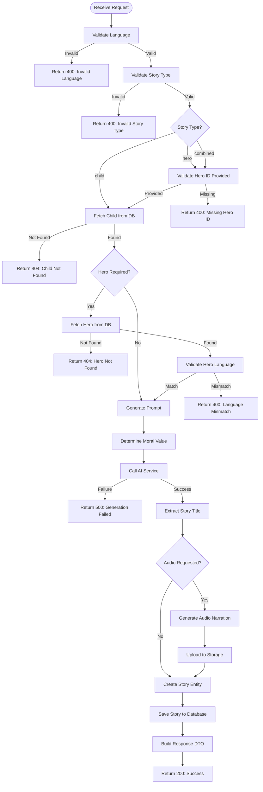

# Story Generation Endpoint Design

## Purpose

Design a REST API endpoint for generating personalized children's bedtime stories with support for three story types: child-only, hero-only, and combined (child + hero) narratives.

## Motivation

The existing `/api/v1/generate-story` endpoint only supports child-based stories. Users need the ability to specify different story types (child, hero, or combined) and provide appropriate parameters for each type to enable more flexible and varied story generation experiences.

## Requirements

### Functional Requirements

| ID | Requirement | Priority |
|----|-------------|----------|
| FR-1 | Accept language parameter (required) | Must Have |
| FR-2 | Accept child ID parameter (required) | Must Have |
| FR-3 | Accept story type parameter (child, hero, combined) | Must Have |
| FR-4 | Accept hero ID parameter (conditional on story type) | Must Have |
| FR-5 | Accept story length parameter (optional, default to 5 minutes) | Should Have |
| FR-6 | Accept moral parameter (optional) | Should Have |
| FR-7 | Validate hero ID is provided when story type is hero or combined | Must Have |
| FR-8 | Generate story content using appropriate prompt based on story type | Must Have |
| FR-9 | Return generated story with metadata | Must Have |
| FR-10 | Store generated story in database with proper story type | Must Have |

### Non-Functional Requirements

| ID | Requirement | Priority |
|----|-------------|----------|
| NFR-1 | Response time under 30 seconds for story generation | Should Have |
| NFR-2 | Consistent validation error messages | Must Have |
| NFR-3 | Support both English and Russian languages | Must Have |
| NFR-4 | Maintain backward compatibility with existing story retrieval endpoints | Must Have |

## Endpoint Specification

### HTTP Method and Path

```
POST /api/v1/stories/generate
```

### Request Schema

| Parameter | Type | Required | Constraints | Description |
|-----------|------|----------|-------------|-------------|
| language | string | Yes | "en" or "ru" | Story language |
| child_id | string | Yes | Valid UUID | Reference to existing child profile |
| story_type | string | No | "child", "hero", "combined" (default: "child") | Type of story to generate |
| hero_id | string | Conditional | Valid UUID | Required when story_type is "hero" or "combined" |
| story_length | integer | No | 1-30 minutes (default: 5) | Desired story duration |
| moral | string | No | - | Moral value (kindness, honesty, bravery, friendship, etc.) |
| custom_moral | string | No | - | Custom moral value if predefined options don't fit |
| generate_audio | boolean | No | default: false | Whether to generate audio narration |
| voice_provider | string | No | - | Voice provider name (e.g., "elevenlabs") |
| voice_options | object | No | - | Provider-specific voice configuration |

### Validation Rules

| Rule | Description |
|------|-------------|
| VR-1 | language must be either "en" or "ru" |
| VR-2 | child_id must reference an existing child in the database |
| VR-3 | story_type must be one of: "child", "hero", "combined" |
| VR-4 | When story_type is "hero" or "combined", hero_id is required |
| VR-5 | hero_id must reference an existing hero in the database |
| VR-6 | Hero language must match the requested story language |
| VR-7 | story_length must be between 1 and 30 minutes |
| VR-8 | Either moral or custom_moral can be provided, not both |

### Response Schema

#### Success Response (200 OK)

| Field | Type | Description |
|-------|------|-------------|
| id | string | Generated story UUID |
| title | string | Story title |
| content | string | Story narrative content |
| moral | string | Applied moral value |
| language | string | Story language code |
| story_type | string | Type of story (child, hero, combined) |
| story_length | integer | Story length in minutes |
| child | object | Child information (id, name, age, gender, interests) |
| hero | object | Hero information (id, name, gender, appearance) - only when applicable |
| relationship_description | string | Description of child-hero relationship - only for combined stories |
| audio_file_url | string | URL to generated audio file (if requested) |
| created_at | string | Timestamp of creation |

#### Error Responses

| HTTP Status | Error Code | Description |
|-------------|------------|-------------|
| 400 | INVALID_LANGUAGE | Unsupported language provided |
| 400 | INVALID_STORY_TYPE | Invalid story type provided |
| 400 | MISSING_HERO_ID | Hero ID required for hero/combined story types |
| 400 | HERO_LANGUAGE_MISMATCH | Hero language does not match requested language |
| 400 | INVALID_STORY_LENGTH | Story length outside valid range |
| 404 | CHILD_NOT_FOUND | Child with provided ID does not exist |
| 404 | HERO_NOT_FOUND | Hero with provided ID does not exist |
| 500 | GENERATION_FAILED | Story generation service failure |

## Processing Flow



## Prompt Generation Strategy

The system must generate appropriate prompts based on story type:

### Child Story Type

- Character: Use child profile (name, age, gender, interests)
- Prompt Builder: Select language-appropriate builder (EnglishPromptBuilder or RussianPromptBuilder)
- Character Type: Create ChildCharacter instance
- Prompt Assembly: Use character description, moral, and story length components

### Hero Story Type

- Character: Use hero profile (name, gender, appearance, personality traits, strengths, interests)
- Prompt Builder: Select language-appropriate builder matching hero language
- Character Type: Create HeroCharacter instance
- Prompt Assembly: Use hero description, moral, and story length components

### Combined Story Type

- Characters: Use both child and hero profiles
- Relationship: Generate language-specific relationship description
  - English: "{child_name} meets the legendary {hero_name}"
  - Russian: "{child_name} встречает легендарного героя {hero_name}"
- Character Type: Create CombinedCharacter instance with child, hero, and relationship
- Prompt Assembly: Include both character descriptions, relationship context, moral, and story length

## Data Model Impact

### Story Entity

The generated story must be persisted with the following attributes:

| Field | Source | Story Type Applicability |
|-------|--------|-------------------------|
| id | Auto-generated UUID | All |
| title | Extracted from AI response | All |
| content | AI-generated narrative | All |
| moral | Request parameter or default | All |
| story_type | Request parameter | All |
| language | Request parameter | All |
| story_length | Request parameter or default | All |
| child_id | Request parameter | All |
| child_name | From child entity | All |
| child_age | From child entity | All |
| child_gender | From child entity | All |
| child_interests | From child entity | All |
| hero_id | Request parameter | hero, combined |
| hero_name | From hero entity | hero, combined |
| hero_gender | From hero entity | hero, combined |
| hero_appearance | From hero entity | hero, combined |
| relationship_description | Generated | combined only |
| audio_file_url | From audio service | All (if requested) |
| audio_provider | From audio service | All (if requested) |
| model_used | From AI service response | All |
| created_at | Current timestamp | All |
| updated_at | Current timestamp | All |

## Business Logic Considerations

### Moral Value Resolution

The moral value for the story should be determined using the following priority:

1. If `custom_moral` is provided, use it
2. Else if `moral` (predefined enum) is provided, use its value
3. Else default to "kindness"

### Story Length Calculation

- Story length is specified in minutes
- Word count is calculated as: minutes × 150 words/minute (average reading speed for children)
- This word count is embedded in the AI prompt to guide content length

### Language Consistency

When story type requires a hero:
- The hero's language attribute must match the requested story language
- If mismatch occurs, reject the request with validation error
- This ensures culturally appropriate and linguistically consistent narratives

### Audio Generation

Audio generation is optional and controlled by the `generate_audio` flag:
- When enabled, the system generates speech from story content
- Audio provider can be specified (e.g., "elevenlabs")
- Generated audio is uploaded to Supabase Storage in the "tales" bucket
- Audio file URL is stored with the story record

## Integration Points

### Child Repository

- Responsible for: Retrieving child entity by ID
- Interface Method: `find_by_id(child_id: str) -> Optional[Child]`
- Error Handling: Return None if child not found

### Hero Repository

- Responsible for: Retrieving hero entity by ID
- Interface Method: `find_by_id(hero_id: str) -> Optional[Hero]`
- Error Handling: Return None if hero not found

### Prompt Service

- Responsible for: Generating language-specific prompts
- Interface Methods:
  - `generate_child_prompt(child: Child, moral: str, language: Language, story_length: StoryLength) -> str`
  - `generate_hero_prompt(hero: Hero, moral: str, language: Language, story_length: StoryLength) -> str`
  - `generate_combined_prompt(child: Child, hero: Hero, moral: str, language: Language, story_length: StoryLength) -> str`

### Story Service

- Responsible for: Story entity creation and validation
- Interface Methods:
  - `validate_story_request(child: Child, hero: Optional[Hero], moral: str, language: Language, story_length: int) -> None`
  - `create_story(...) -> Story`
  - `extract_title_from_content(content: str) -> str`
  - `attach_audio_to_story(story: Story, audio_url: str, provider: str, metadata: dict) -> None`

### AI Service

- Responsible for: Generating story content from prompt
- Interface Method: `generate_story(prompt: str) -> StoryGenerationResult`
- Result Contains: content, model_used, full_response, generation_info

### Audio Service

- Responsible for: Generating audio narration
- Interface Method: `generate_audio(text: str, language: str, provider_name: str, voice_options: dict) -> AudioResult`
- Result Contains: success, audio_data, provider_name, metadata, error_message

### Storage Service

- Responsible for: Uploading audio files to cloud storage
- Interface Method: `upload_audio_file(file_data: bytes, filename: str, story_id: str) -> str`
- Returns: Public URL of uploaded file

### Story Repository

- Responsible for: Persisting story entity
- Interface Method: `save(story: Story) -> Story`
- Returns: Saved story with generated ID

## Error Handling Strategy

### Client Errors (4xx)

| Scenario | HTTP Status | Response Structure |
|----------|-------------|-------------------|
| Invalid language code | 400 | error: "INVALID_LANGUAGE", message: "Unsupported language: {code}. Supported: en, ru" |
| Invalid story type | 400 | error: "INVALID_STORY_TYPE", message: "Invalid story type: {type}. Supported: child, hero, combined" |
| Missing hero ID | 400 | error: "MISSING_HERO_ID", message: "Hero ID is required for {story_type} stories" |
| Hero language mismatch | 400 | error: "HERO_LANGUAGE_MISMATCH", message: "Hero language {hero_lang} does not match requested language {req_lang}" |
| Invalid story length | 400 | error: "INVALID_STORY_LENGTH", message: "Story length must be between 1 and 30 minutes" |
| Child not found | 404 | error: "CHILD_NOT_FOUND", message: "Child with ID {child_id} not found" |
| Hero not found | 404 | error: "HERO_NOT_FOUND", message: "Hero with ID {hero_id} not found" |

### Server Errors (5xx)

| Scenario | HTTP Status | Response Structure |
|----------|-------------|-------------------|
| AI service failure | 500 | error: "GENERATION_FAILED", message: "Failed to generate story content" |
| Database error | 500 | error: "DATABASE_ERROR", message: "Failed to save story" |
| Audio generation failure | 500 | Logged but not blocking - story still saved without audio |

## Example Requests

### Child Story (Simple)

```
POST /api/v1/stories/generate
Content-Type: application/json

{
  "language": "en",
  "child_id": "123e4567-e89b-12d3-a456-426614174000",
  "story_type": "child",
  "moral": "kindness",
  "story_length": 5
}
```

### Hero Story

```
POST /api/v1/stories/generate
Content-Type: application/json

{
  "language": "ru",
  "child_id": "123e4567-e89b-12d3-a456-426614174000",
  "story_type": "hero",
  "hero_id": "987fcdeb-51a2-43f7-b123-9876543210ab",
  "moral": "bravery",
  "story_length": 7
}
```

### Combined Story with Audio

```
POST /api/v1/stories/generate
Content-Type: application/json

{
  "language": "en",
  "child_id": "123e4567-e89b-12d3-a456-426614174000",
  "story_type": "combined",
  "hero_id": "987fcdeb-51a2-43f7-b123-9876543210ab",
  "custom_moral": "overcoming challenges together",
  "story_length": 10,
  "generate_audio": true,
  "voice_provider": "elevenlabs"
}
```

## Success Criteria

| Criterion | Measurement |
|-----------|-------------|
| Correct story type generation | Stories generated with correct character combinations matching requested type |
| Language consistency | Hero language matches story language for hero/combined types |
| Data persistence | All story type variants stored correctly with appropriate fields populated |
| Validation accuracy | Invalid requests rejected with clear error messages |
| Backward compatibility | Existing story retrieval endpoints continue working without modification |
| Response completeness | Response includes all required metadata for story type |

## Open Questions

| Question | Impact | Resolution Needed By |
|----------|--------|---------------------|
| Should the endpoint validate that child and hero have compatible age ranges for combined stories? | Medium - affects story quality | Design review |
| What happens if audio generation is requested but provider is not configured? | Low - can fail gracefully | Implementation |
| Should we support multiple heroes in a single combined story? | High - significant scope change | Product decision |
| Do we need rate limiting for story generation to prevent abuse? | Medium - operational concern | Technical review |
