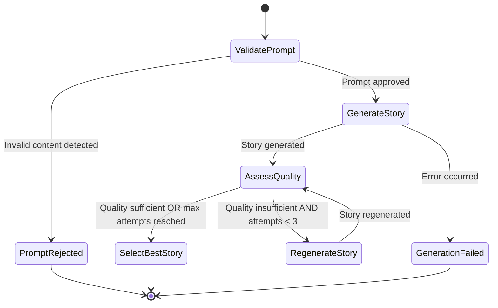
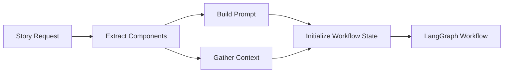
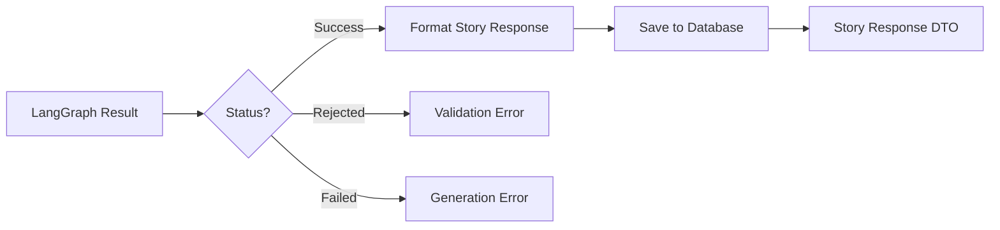

# LangGraph Story Generation Workflow Design

## Overview

This design describes the implementation of a LangGraph-based story generation workflow that replaces the current linear story generation process with a sophisticated graph-based state machine. The workflow includes prompt validation, story generation, quality assessment, and automatic regeneration with scoring to ensure high-quality content.

## Strategic Objectives

The primary goal is to implement a robust, self-improving story generation pipeline that:

- Validates prompts for appropriateness before generation
- Generates stories using LLM
- Evaluates story quality automatically
- Attempts regeneration when quality is insufficient
- Selects the best output from multiple attempts

This approach ensures higher quality stories while maintaining control over inappropriate content and licensed character usage.

## Current State Analysis

The existing system follows a simple linear workflow:

1. Prompt construction using modular builder pattern
2. Direct LLM call via OpenRouter client
3. Basic retry logic for network failures
4. No content validation or quality assessment
5. Single attempt without quality comparison

Key components in current architecture:
- `src/application/use_cases/generate_story.py` - orchestrates generation workflow
- `src/openrouter_client.py` - handles LLM API calls with retry logic
- `src/domain/services/prompt_service.py` - builds prompts using component system
- `src/domain/services/story_service.py` - manages story entities

## Target State Architecture

### Workflow State Machine

The new LangGraph-based workflow implements a directed graph with the following nodes and transitions:



### Node Descriptions

| Node Name | Purpose | Input | Output |
|-----------|---------|-------|--------|
| ValidatePrompt | Checks prompt for licensed characters, inappropriate content, and suitability for children | Prompt text, child context | Validation result (approved/rejected), rejection reasons |
| GenerateStory | Generates story content using LLM | Validated prompt, generation parameters | Story content, metadata |
| AssessQuality | Evaluates story quality using LLM-based assessment | Generated story, quality criteria | Quality score (1-10), assessment details |
| RegenerateStory | Triggers new generation attempt with adjusted parameters | Previous attempts, quality feedback | Updated generation request |
| SelectBestStory | Chooses highest-quality story from all attempts | All generation attempts with scores | Best story, selection metadata |

### State Structure

The workflow state maintains the following information throughout execution:

| Field | Type | Purpose |
|-------|------|---------|
| original_prompt | string | Input prompt from user |
| child_context | object | Child profile data |
| hero_context | object | Hero data (if applicable) |
| story_type | enum | child / hero / combined |
| language | enum | en / ru |
| validation_result | object | Prompt validation outcome |
| generation_attempts | array | List of all generation attempts |
| current_attempt | integer | Current attempt counter (1-3) |
| quality_assessments | array | Quality scores for each attempt |
| best_story | object | Selected final story |
| workflow_status | enum | pending / success / failed / rejected |
| error_messages | array | Error tracking |

## Functional Capabilities

### FR-1: Prompt Validation

The system validates prompts before story generation to ensure:

- No licensed characters referenced (Disney, Marvel, DC Comics, etc.)
- No inappropriate content for children
- Alignment with child's age and developmental stage
- Coherent and actionable story request

**Validation Criteria:**
- Scan for trademark/copyright terms
- Detect violent, scary, or age-inappropriate themes
- Verify logical consistency of prompt elements
- Check for harmful or discriminatory content

**Outcome:**
- Approved: workflow continues to generation
- Rejected: workflow terminates with detailed rejection reasons

### FR-2: Story Generation

Generate story content using the validated prompt with:

- Language-specific prompt formatting (English/Russian)
- Character type handling (child/hero/combined)
- Moral value integration
- Story length requirements
- Age-appropriate language and themes

**Generation Parameters:**
- Use existing OpenRouter client integration
- Support model fallback strategy
- Maintain metadata tracking (model used, tokens, timing)

### FR-3: Quality Assessment

Evaluate generated stories using LLM-based quality criteria:

| Criterion | Weight | Description |
|-----------|--------|-------------|
| Age appropriateness | High | Content suitable for target age |
| Moral clarity | High | Moral lesson clearly communicated |
| Narrative coherence | High | Logical story flow and structure |
| Character consistency | Medium | Characters behave consistently |
| Engagement level | Medium | Story maintains interest |
| Language quality | Medium | Grammar, vocabulary, style |
| Length compliance | Low | Meets word count target |

**Scoring:**
- Scale: 1-10 (integer)
- Threshold for acceptance: 7 or higher
- Assessment includes detailed feedback for each criterion

### FR-4: Regeneration Strategy

When quality score is below threshold:

1. Increment attempt counter
2. Analyze quality feedback to identify weaknesses
3. Adjust generation parameters (temperature, specific instructions)
4. Generate new story version
5. Assess quality of new version

**Attempt Limits:**
- Maximum attempts: 3
- After 3 attempts: select best available story regardless of score

### FR-5: Best Story Selection

After completion (quality sufficient OR max attempts reached):

1. Compare quality scores across all attempts
2. Select story with highest score
3. Record selection metadata
4. Return selected story with quality information

**Selection Metadata:**
- Total attempts made
- Score distribution across attempts
- Reasons for selection
- Quality improvement trajectory

## Non-Functional Requirements

### NFR-1: Response Time

- Total workflow duration should not exceed 90 seconds for 3 attempts
- Single generation attempt: under 30 seconds
- Validation: under 5 seconds
- Quality assessment: under 10 seconds

### NFR-2: Reliability

- Handle LLM API failures gracefully
- Retry transient errors within each node
- Maintain state persistence across node transitions
- Provide detailed error context for debugging

### NFR-3: Observability

- Log state transitions between nodes
- Track timing for each workflow stage
- Record all generation attempts and scores
- Enable workflow replay for debugging

### NFR-4: Backward Compatibility

- Maintain existing API contract for story generation endpoints
- Preserve current database schema
- Support gradual migration from old to new workflow
- Allow feature flag to switch between implementations

## Implementation Components

### Component 1: LangGraph Workflow Definition

**Responsibility:** Define the graph structure, nodes, and edges

**Structure:**

| Element | Description |
|---------|-------------|
| StateGraph | Main graph instance managing workflow |
| Node functions | Python functions for each workflow node |
| Conditional edges | Logic determining next node based on state |
| Entry point | ValidatePrompt node |
| End points | PromptRejected, SelectBestStory, GenerationFailed |

**Integration Point:** Replaces direct OpenRouter call in `GenerateStoryUseCase`

### Component 2: Prompt Validator Service

**Responsibility:** Validate prompt safety and appropriateness

**Validation Approach:**

Uses LLM to analyze prompt with structured output containing:
- Safety assessment (safe/unsafe)
- Licensed character detection (detected/not_detected)
- Age appropriateness check (appropriate/inappropriate)
- Content flags (violent, scary, discriminatory, etc.)
- Detailed reasoning for each assessment

**Decision Logic:**
- If any check fails: reject prompt
- If all checks pass: approve prompt

### Component 3: Quality Assessor Service

**Responsibility:** Evaluate story quality using structured criteria

**Assessment Approach:**

Uses LLM with structured output format:

| Field | Type | Description |
|-------|------|-------------|
| overall_score | integer | 1-10 overall quality |
| age_appropriateness_score | integer | 1-10 for age fit |
| moral_clarity_score | integer | 1-10 for moral teaching |
| narrative_coherence_score | integer | 1-10 for story flow |
| character_consistency_score | integer | 1-10 for character behavior |
| engagement_score | integer | 1-10 for interest level |
| language_quality_score | integer | 1-10 for language use |
| feedback | string | Detailed assessment notes |

**Scoring Logic:**
- Calculate weighted average
- Apply threshold (7 or higher = acceptable)
- Provide actionable feedback for improvement

### Component 4: Story Generation Coordinator

**Responsibility:** Orchestrate generation attempts with parameter adjustment

**Attempt Management:**

| Attempt | Temperature | Additional Instructions |
|---------|-------------|------------------------|
| 1st | 0.7 | Standard prompt |
| 2nd | 0.8 | Include previous feedback, emphasize weak areas |
| 3rd | 0.6 | More conservative, focus on quality over creativity |

**Context Preservation:**
- Track all previous attempts
- Pass quality feedback to subsequent attempts
- Maintain generation metadata

### Component 5: Best Story Selector

**Responsibility:** Select optimal story from all attempts

**Selection Algorithm:**
1. Retrieve all attempts with quality scores
2. Sort by overall quality score (descending)
3. Select highest-scoring story
4. If scores are tied, prefer later attempt (shows improvement)
5. Package with selection metadata

**Output Structure:**

| Field | Description |
|-------|-------------|
| story | Selected story entity |
| attempts_count | Total generation attempts |
| selected_attempt_number | Which attempt was chosen |
| quality_score | Score of selected story |
| all_scores | Array of all scores |
| selection_reason | Why this story was chosen |

## Data Flow

### Input to Workflow



**Input Parameters:**
- child_id (UUID)
- language (en/ru)
- story_type (child/hero/combined)
- hero_id (optional, required for hero/combined)
- moral (optional)
- story_length (optional)
- custom_prompt_additions (optional)

### State Transitions

The workflow state evolves through the following transitions:

1. **Initial State** → prompt text, context data, status=pending
2. **After Validation** → validation_result added, status updated
3. **After Each Generation** → attempt added to generation_attempts array
4. **After Each Assessment** → quality score added to quality_assessments array
5. **After Selection** → best_story populated, status=success

### Output from Workflow



**Success Output:**
- Selected story content
- Quality metadata
- Generation statistics
- Selection rationale

**Failure Output:**
- Error type (validation/generation)
- Error details
- Attempted actions
- Recommendations for user

## Integration Points

### Integration with Existing Use Case

**File:** `src/application/use_cases/generate_story.py`

**Modification Approach:**

Replace the linear generation flow (steps 4-6) with LangGraph workflow invocation:

**Current Flow:**
1. Get/create child
2. Determine moral and length
3. Validate request
4. Generate prompt ← **REPLACE FROM HERE**
5. Call AI service
6. Extract title
7. Create story entity
8. Generate audio (if requested)
9. Save story
10. Return response

**New Flow:**
1. Get/create child
2. Determine moral and length
3. Validate request
4. **Invoke LangGraph workflow** ← **NEW INTEGRATION POINT**
5. **Workflow returns best story with metadata**
6. Create story entity from workflow result
7. Generate audio (if requested)
8. Save story with quality metadata
9. Return response with quality information

### Integration with OpenRouter Client

**File:** `src/openrouter_client.py`

**Usage Pattern:**

LangGraph nodes will call OpenRouter client methods:
- Validation node: call with validation prompt
- Generation node: call with story generation prompt (existing method)
- Assessment node: call with quality assessment prompt

**No modifications required** - use existing async methods

### Integration with Prompt Service

**File:** `src/domain/services/prompt_service.py`

**Usage:**

- Continue using existing prompt builders for story generation
- Add new prompt templates for validation and assessment

**New Prompt Types:**

| Prompt Type | Purpose | Template Location |
|-------------|---------|-------------------|
| Validation | Check prompt safety | New method in PromptService |
| Assessment | Evaluate story quality | New method in PromptService |
| Regeneration | Adjusted generation with feedback | Enhanced existing method |

### Database Schema Extensions

**Table:** `stories`

**New Fields:**

| Field | Type | Purpose |
|-------|------|---------|
| quality_score | integer | Overall quality score (1-10) |
| generation_attempts_count | integer | Number of generation attempts |
| selected_attempt_number | integer | Which attempt was chosen |
| quality_metadata | jsonb | Detailed quality assessment data |
| validation_result | jsonb | Prompt validation outcome |
| workflow_metadata | jsonb | LangGraph execution metadata |

**Table:** `generation_attempts` (new)

| Field | Type | Purpose |
|-------|------|---------|
| id | uuid | Primary key |
| story_id | uuid | Foreign key to stories |
| attempt_number | integer | Attempt sequence (1-3) |
| generated_content | text | Story content for this attempt |
| quality_score | integer | Quality score for this attempt |
| quality_details | jsonb | Detailed quality breakdown |
| model_used | string | LLM model for this attempt |
| generation_metadata | jsonb | Timing, tokens, etc. |
| created_at | timestamp | When attempt was made |

## Prompt Templates

### Validation Prompt Template

**Purpose:** Analyze user prompt for safety and appropriateness

**Structure:**

```
System Role:
You are a content safety validator for children's stories. Analyze the provided story prompt for safety concerns.

Evaluation Criteria:
1. Licensed Characters: Check for trademarked characters from Disney, Marvel, DC, DreamWorks, etc.
2. Age Appropriateness: Ensure content is suitable for children aged {child_age}
3. Safety: No violence, horror, discrimination, or inappropriate themes
4. Coherence: Prompt is clear and actionable

Story Prompt:
{prompt_text}

Child Context:
- Name: {child_name}
- Age: {child_age}
- Interests: {child_interests}

Provide structured assessment with reasoning for each criterion.
```

**Expected Output Format:**

| Field | Description |
|-------|-------------|
| is_safe | boolean - overall safety verdict |
| has_licensed_characters | boolean - detected copyrighted content |
| is_age_appropriate | boolean - suitable for child's age |
| detected_issues | array - list of specific problems |
| reasoning | string - detailed explanation |
| recommendation | approved / rejected |

### Quality Assessment Prompt Template

**Purpose:** Evaluate generated story quality

**Structure:**

```
System Role:
You are a children's story quality evaluator. Assess the provided story across multiple dimensions.

Story to Evaluate:
{story_content}

Story Requirements:
- Target Age: {child_age}
- Moral: {moral}
- Language: {language}
- Expected Length: {expected_word_count} words

Evaluation Criteria (score each 1-10):
1. Age Appropriateness - language and themes fit the child's age
2. Moral Clarity - moral lesson is clear and well-integrated
3. Narrative Coherence - story has logical flow and structure
4. Character Consistency - characters behave believably
5. Engagement - story is interesting and maintains attention
6. Language Quality - grammar, vocabulary, and style
7. Length Compliance - meets word count expectations

Provide scores and detailed feedback.
```

**Expected Output Format:**

Structured JSON with:
- Individual scores for each criterion (1-10)
- Overall weighted score
- Detailed feedback explaining scores
- Specific improvement suggestions

### Regeneration Prompt Enhancement

**Purpose:** Improve story based on quality feedback

**Approach:**

Add feedback section to existing prompt:

```
Previous Attempt Feedback:
The previous story scored {previous_score}/10 with these weaknesses:
{quality_feedback}

Please generate an improved version addressing these specific points:
{improvement_suggestions}

[Rest of standard prompt...]
```

## Error Handling Strategy

### Validation Errors

| Error Type | Cause | Handler Response |
|------------|-------|------------------|
| Licensed Character Detected | Prompt contains copyrighted content | Reject with specific characters listed |
| Age Inappropriate | Content not suitable for child's age | Reject with age concern explanation |
| Safety Violation | Violent, scary, or harmful content | Reject with safety reasoning |
| LLM Validation Failure | API error during validation | Fail-safe: reject prompt with error context |

### Generation Errors

| Error Type | Cause | Handler Response |
|------------|-------|------------------|
| LLM API Failure | OpenRouter unavailable | Retry with exponential backoff, use fallback model |
| Empty Response | LLM returns no content | Mark attempt as failed, try again with different parameters |
| Content Violation | Generated story violates policies | Mark attempt as failed, regenerate with stricter guidelines |
| Timeout | Generation exceeds time limit | Mark attempt as failed, reduce story length for retry |

### Assessment Errors

| Error Type | Cause | Handler Response |
|------------|-------|---|
| LLM Assessment Failure | API error during quality check | Use default score of 5, allow continuation |
| Invalid Score Format | LLM returns malformed score | Parse best-effort, use median score if parse fails |
| Timeout | Assessment exceeds time limit | Assign default score, proceed to next step |

### Workflow-Level Errors

| Error Type | Cause | Handler Response |
|------------|-------|------------------|
| Max Attempts Reached | All 3 attempts completed | Select best available story even if score < 7 |
| State Corruption | Invalid state transition | Log error, return to last valid state or fail workflow |
| Critical Failure | Unrecoverable error | Abort workflow, return detailed error to user |

## Configuration and Feature Flags

### Feature Flag: Enable LangGraph Workflow

**Environment Variable:** `ENABLE_LANGGRAPH_WORKFLOW`

**Values:**
- `true` - Use new LangGraph workflow
- `false` - Use legacy direct generation (default)

**Implementation:**

Conditional logic in `GenerateStoryUseCase.execute()`:

```
if config.enable_langgraph_workflow:
    result = await langgraph_workflow_service.execute(workflow_input)
else:
    result = await legacy_generation_flow(prompt)
```

### Quality Threshold Configuration

**Environment Variable:** `STORY_QUALITY_THRESHOLD`

**Default:** 7
**Range:** 1-10

**Purpose:** Minimum acceptable quality score before triggering regeneration

### Maximum Attempts Configuration

**Environment Variable:** `MAX_GENERATION_ATTEMPTS`

**Default:** 3
**Range:** 1-5

**Purpose:** Maximum number of generation attempts before selecting best available

### LLM Model Configuration

**Validation Model:**
- Variable: `VALIDATION_LLM_MODEL`
- Default: `openai/gpt-4o-mini`
- Purpose: Fast, cost-effective validation

**Assessment Model:**
- Variable: `ASSESSMENT_LLM_MODEL`
- Default: `openai/gpt-4o-mini`
- Purpose: Reliable quality evaluation

**Generation Model:**
- Variable: `GENERATION_LLM_MODEL`
- Default: (use existing model selection logic)
- Purpose: Story content generation

## Migration Strategy

### Phase 1: Parallel Implementation

1. Add LangGraph dependency to `pyproject.toml`
2. Implement workflow components without modifying existing code
3. Create feature flag configuration
4. Build comprehensive test suite

**Duration:** Does not affect production

### Phase 2: Beta Testing

1. Enable LangGraph workflow for specific test users
2. Compare quality metrics between old and new workflows
3. Monitor performance and error rates
4. Collect user feedback on story quality

**Duration:** 1-2 weeks with controlled rollout

### Phase 3: Gradual Rollout

1. Enable for 10% of requests
2. Monitor metrics and adjust parameters
3. Increase to 50% after validation
4. Full rollout if metrics are positive

**Duration:** 2-3 weeks with monitoring

### Phase 4: Legacy Removal

1. Deprecate old workflow
2. Remove feature flag
3. Clean up legacy code
4. Update documentation

**Duration:** After new workflow proves stable

## Success Metrics

### Quality Metrics

| Metric | Target | Measurement |
|--------|--------|-------------|
| Average Quality Score | ≥ 7.5 | Mean score of selected stories |
| First-Attempt Success Rate | ≥ 60% | Percentage scoring ≥ 7 on first try |
| Rejection Rate | < 5% | Prompts rejected at validation |
| User Satisfaction | ≥ 4.5/5 | User ratings of generated stories |

### Performance Metrics

| Metric | Target | Measurement |
|--------|--------|-------------|
| Average Total Duration | ≤ 45 seconds | Mean workflow completion time |
| P95 Total Duration | ≤ 90 seconds | 95th percentile completion time |
| Validation Duration | ≤ 3 seconds | Mean validation time |
| Assessment Duration | ≤ 8 seconds | Mean quality assessment time |

### Reliability Metrics

| Metric | Target | Measurement |
|--------|--------|-------------|
| Workflow Success Rate | ≥ 95% | Percentage completing without errors |
| Error Recovery Rate | ≥ 90% | Percentage of errors successfully retried |
| Data Consistency | 100% | State integrity across transitions |

## Dependencies

### New Dependencies

| Package | Version | Purpose |
|---------|---------|---------|
| langgraph | ≥ 0.2.0 | State machine workflow framework |
| langchain-core | ≥ 0.3.0 | Core abstractions for LangChain ecosystem |
| langchain-openai | ≥ 0.2.0 | OpenAI integration for LangChain |

### Existing Dependencies

The implementation leverages:
- `openai` - LLM API client (already installed)
- `httpx` - Async HTTP client (already installed)
- `pydantic` - Data validation (already installed)
- `supabase` - Database client (already installed)

## Testing Strategy

### Unit Testing

**Test Coverage:**

| Component | Test Focus |
|-----------|------------|
| Prompt Validator | Safety detection, licensed character identification, edge cases |
| Quality Assessor | Score calculation, criteria evaluation, feedback generation |
| Story Generator | Generation parameter handling, retry logic, metadata tracking |
| Best Story Selector | Score comparison, tie-breaking, metadata assembly |

### Integration Testing

**Test Scenarios:**

1. **Happy Path:** Valid prompt → successful generation on first attempt → quality score ≥ 7
2. **Regeneration Path:** Valid prompt → low quality → 2nd attempt succeeds
3. **Max Attempts:** Valid prompt → 3 low-quality attempts → best selected
4. **Validation Rejection:** Prompt with licensed character → rejected at validation
5. **Generation Failure:** API error → retry → eventual success or graceful failure

### End-to-End Testing

**Workflow Tests:**

| Test Case | Input | Expected Outcome |
|-----------|-------|------------------|
| Child Story (English) | Valid child prompt | Story generated, quality ≥ 7 |
| Hero Story (Russian) | Valid hero prompt | Story generated in Russian, quality ≥ 7 |
| Combined Story | Valid combined prompt | Story with both characters, quality ≥ 7 |
| Licensed Character | Prompt with "Mickey Mouse" | Rejected at validation with reason |
| Age Inappropriate | Violent theme for age 5 | Rejected at validation |
| Low Quality Loop | Intentionally poor prompt | 3 attempts, best selected |

### Performance Testing

**Load Tests:**

- Concurrent workflow executions (10, 50, 100 simultaneous)
- Measure response time distribution
- Monitor resource utilization
- Verify state isolation between concurrent workflows

## Monitoring and Observability

### Logging Requirements

**Log Events:**

| Event | Level | Data Captured |
|-------|-------|---------------|
| Workflow Started | INFO | Request ID, user ID, story type, language |
| Validation Complete | INFO | Validation result, duration |
| Generation Attempt | INFO | Attempt number, model used, duration |
| Quality Assessment | INFO | Quality score, duration |
| Best Story Selected | INFO | Selected attempt, score, total attempts |
| Workflow Complete | INFO | Total duration, final status |
| Errors | ERROR | Error type, context, stack trace |

### Metrics Collection

**Tracking:**

- Workflow duration by stage
- Quality score distribution
- Attempt count distribution
- Rejection reasons frequency
- Error rates by type
- Model usage statistics

### Alerting

**Alert Conditions:**

| Condition | Severity | Action |
|-----------|----------|--------|
| Rejection rate > 10% | Warning | Review validation criteria |
| Error rate > 5% | Critical | Investigate LLM integration |
| P95 duration > 120s | Warning | Optimize workflow parameters |
| Quality score avg < 7.0 | Warning | Review quality criteria or generation prompts |

## Future Enhancements

### Potential Improvements

1. **Adaptive Quality Thresholds:** Adjust threshold based on historical user satisfaction
2. **Feedback Loop:** Use user ratings to fine-tune quality assessment criteria
3. **Smart Regeneration:** Analyze failure patterns to optimize regeneration strategy
4. **Multi-Model Ensemble:** Use different models for different attempts to diversify outputs
5. **Caching:** Cache validation results for similar prompts to reduce latency
6. **Human-in-the-Loop:** Optional manual review for edge cases
7. **A/B Testing Framework:** Built-in experimentation for workflow parameters

### Extensibility Points

The design supports extension for:

- Additional validation rules
- New quality criteria
- Alternative LLM providers
- Custom regeneration strategies
- Advanced selection algorithms
