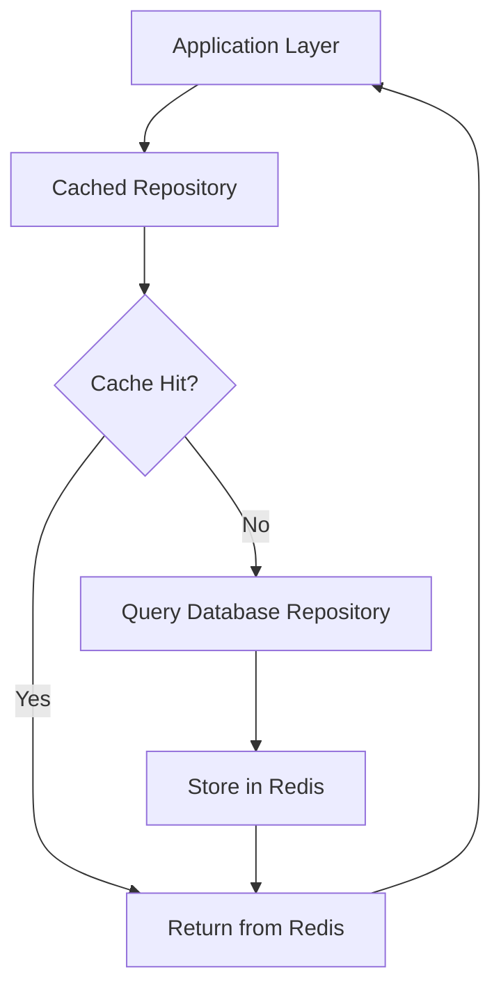
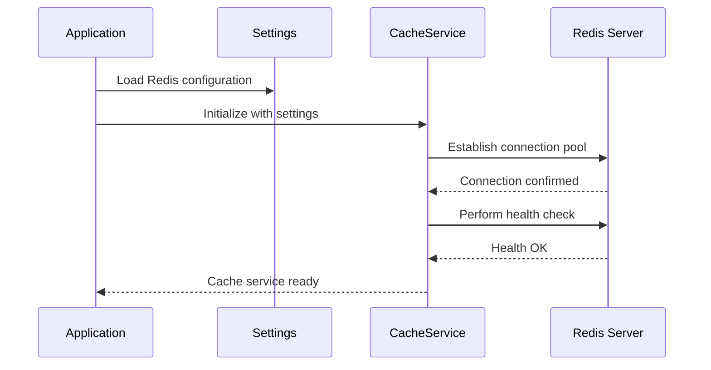
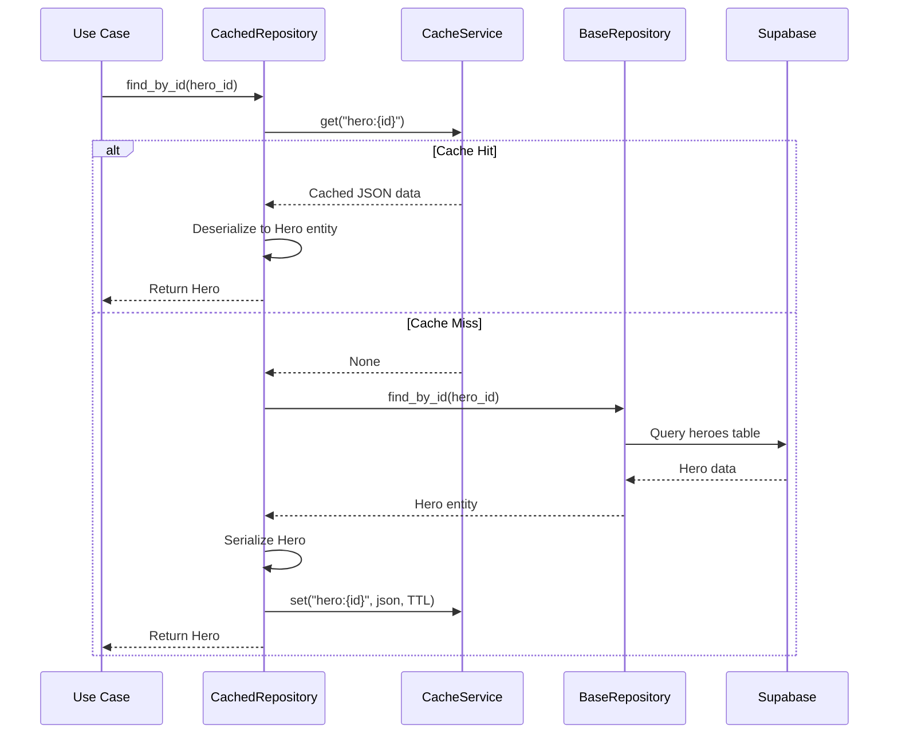
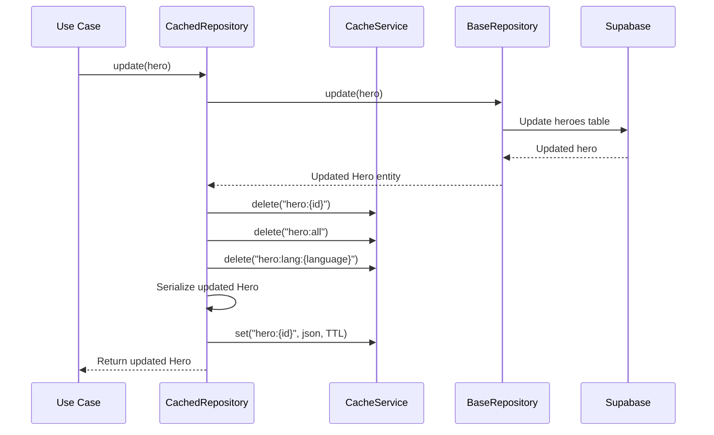

# Redis Cache Implementation

## Overview

This design introduces a Redis-based caching layer to optimize data retrieval performance for frequently accessed entities, starting with Hero data. The architecture is designed to be extensible, allowing other entity types (Child, Story) to benefit from caching with minimal code changes.

## Strategic Goals

- **Performance Optimization**: Reduce database query load by caching frequently accessed hero data
- **Scalability**: Build an extensible caching foundation that can accommodate future entities
- **Maintainability**: Maintain clean separation of concerns through a repository decorator pattern
- **Flexibility**: Support configurable cache strategies (TTL, eviction policies) per entity type

## Architecture Strategy

### Layered Caching Approach

The caching system integrates transparently into the existing repository pattern without modifying domain logic:



### Core Components

| Component | Responsibility | Location |
|-----------|----------------|----------|
| **CacheService** | Redis connection management and low-level operations | `src/infrastructure/cache/cache_service.py` |
| **CacheStrategy** | Define caching behavior per entity type | `src/infrastructure/cache/strategies.py` |
| **CachedRepository** | Repository decorator implementing cache-aside pattern | `src/infrastructure/cache/cached_repository.py` |
| **Cache Configuration** | Redis settings and cache policies | `src/infrastructure/config/settings.py` |

## Design Decisions

### 1. Cache-Aside Pattern

**Decision**: Implement cache-aside pattern where application code manages cache population and invalidation.

**Rationale**: 
- Provides explicit control over what gets cached and when
- Allows gradual adoption across entity types
- Simplifies cache invalidation logic
- Aligns with existing repository abstractions

### 2. Repository Decorator Pattern

**Decision**: Wrap existing repository implementations with a caching decorator rather than modifying repositories directly.

**Rationale**:
- Maintains single responsibility principle
- Allows caching to be enabled/disabled per repository
- No changes required to domain layer
- Testing remains isolated

### 3. Generic Serialization Strategy

**Decision**: Use JSON serialization with entity-specific serializers for complex types.

**Rationale**:
- Human-readable cache entries for debugging
- Supports all entity attribute types (dates, enums, lists)
- Language-agnostic format for potential future integrations
- Redis native string operations remain available

### 4. TTL-Based Expiration

**Decision**: Implement time-to-live expiration with configurable TTL per entity type.

**Rationale**:
- Heroes are relatively static data (low update frequency)
- Prevents stale data accumulation
- Balances memory usage with performance
- Allows different expiration strategies per entity

## Data Model

### Cache Key Structure

Standardized cache key format ensuring uniqueness and readability:

| Entity Type | Operation | Key Pattern | Example |
|-------------|-----------|-------------|---------|
| Hero | By ID | `hero:{id}` | `hero:550e8400-e29b-41d4-a716-446655440000` |
| Hero | By Language | `hero:lang:{language}` | `hero:lang:en` |
| Hero | All Heroes | `hero:all` | `hero:all` |
| Child | By ID | `child:{id}` | `child:123e4567-e89b-12d3-a456-426614174000` |
| Story | By ID | `story:{id}` | `story:789a0123-b45c-67d8-e901-234567890abc` |

### Cache Entry Structure

Each cached entity is stored as JSON with metadata:

```json
{
  "entity": {
    "id": "550e8400-e29b-41d4-a716-446655440000",
    "name": "Captain Wonder",
    "age": 12,
    "gender": "male",
    "appearance": "Wears a blue cape with a golden star",
    "personality_traits": ["brave", "kind", "curious"],
    "interests": ["exploring space", "helping others"],
    "strengths": ["flying", "super strength"],
    "language": "en",
    "created_at": "2024-01-15T10:30:00Z",
    "updated_at": "2024-01-15T10:30:00Z"
  },
  "cached_at": "2024-01-20T14:22:10Z",
  "ttl": 3600
}
```

## Component Specifications

### CacheService

**Purpose**: Abstract Redis operations and connection management

**Key Operations**:

| Method | Parameters | Return | Behavior |
|--------|------------|--------|----------|
| `get` | key: str | Optional[str] | Retrieve value by key |
| `set` | key: str, value: str, ttl: Optional[int] | bool | Store value with optional expiration |
| `delete` | key: str | bool | Remove key from cache |
| `delete_pattern` | pattern: str | int | Remove all keys matching pattern |
| `exists` | key: str | bool | Check if key exists |
| `health_check` | - | bool | Verify Redis connection |

**Configuration Requirements**:
- Redis connection URL
- Connection pool size
- Connection timeout
- Retry policy

### CacheStrategy

**Purpose**: Define entity-specific caching behavior

**Strategy Interface**:

| Property/Method | Type | Description |
|----------------|------|-------------|
| `entity_type` | str | Entity type identifier |
| `default_ttl` | int | Default time-to-live in seconds |
| `cache_on_read` | bool | Whether to cache on read operations |
| `cache_on_write` | bool | Whether to cache on write operations |
| `build_key` | (operation, params) → str | Generate cache key |
| `serialize` | (entity) → str | Convert entity to JSON |
| `deserialize` | (data) → Entity | Convert JSON to entity |

**Predefined Strategies**:

| Strategy | Entity | TTL | Notes |
|----------|--------|-----|-------|
| `HeroCacheStrategy` | Hero | 3600s (1 hour) | Heroes rarely change |
| `ChildCacheStrategy` | Child | 1800s (30 min) | Moderate update frequency |
| `StoryCacheStrategy` | Story | 600s (10 min) | Frequently updated with ratings |

### CachedRepository

**Purpose**: Transparent caching layer for repositories

**Initialization**:
```
CachedRepository(
    base_repository: Repository[T],
    cache_service: CacheService,
    cache_strategy: CacheStrategy[T]
)
```

**Cached Operations**:

| Repository Method | Cache Behavior |
|-------------------|----------------|
| `find_by_id` | Cache hit returns cached data; cache miss queries DB and populates cache |
| `list_all` | Caches entire collection under composite key |
| `find_by_language` | Caches language-filtered results separately |
| `save` | Invalidates related cache entries (by ID, language, all) |
| `update` | Invalidates specific entity cache and related collections |
| `delete` | Removes entity cache and invalidates collections |

**Cache Invalidation Rules**:

| Operation | Invalidated Keys |
|-----------|------------------|
| Save new hero | `hero:all`, `hero:lang:{language}` |
| Update hero | `hero:{id}`, `hero:all`, `hero:lang:{language}` |
| Delete hero | `hero:{id}`, `hero:all`, `hero:lang:{language}` |

## Configuration Schema

### Redis Settings Extension

Add to `src/infrastructure/config/settings.py`:

| Setting | Type | Default | Description |
|---------|------|---------|-------------|
| `REDIS_URL` | str | `redis://localhost:6379/0` | Redis connection string |
| `REDIS_PASSWORD` | Optional[str] | None | Redis authentication password |
| `REDIS_DB` | int | 0 | Redis database number |
| `REDIS_MAX_CONNECTIONS` | int | 10 | Connection pool size |
| `REDIS_SOCKET_TIMEOUT` | int | 5 | Socket timeout in seconds |
| `REDIS_ENABLED` | bool | True | Global cache enable/disable flag |
| `CACHE_DEFAULT_TTL` | int | 3600 | Default TTL for cached entries |
| `CACHE_HERO_TTL` | int | 3600 | TTL for hero entities |
| `CACHE_CHILD_TTL` | int | 1800 | TTL for child entities |
| `CACHE_STORY_TTL` | int | 600 | TTL for story entities |

## Integration Flow

### System Initialization



### Read Operation with Cache



### Write Operation with Cache Invalidation



## Extension Guidelines

### Adding Cache Support for New Entities

To enable caching for a new entity type (e.g., Child), follow these steps:

**Step 1**: Define Cache Strategy

Create entity-specific strategy with serialization logic handling entity-specific value objects and complex types.

**Step 2**: Configure TTL Settings

Add TTL configuration to settings with appropriate expiration based on update frequency.

**Step 3**: Wrap Repository

Instantiate CachedRepository wrapper around base repository implementation in dependency injection setup.

**Step 4**: Define Key Patterns

Document cache key patterns for all entity operations to prevent key collisions.

**Step 5**: Implement Invalidation Logic

Identify relationships requiring cache invalidation (e.g., when updating a Child, invalidate related Story caches if they contain denormalized Child data).

### Cache Invalidation Strategies

| Scenario | Strategy | Implementation |
|----------|----------|----------------|
| **Single Entity Update** | Invalidate entity key and collection keys | Delete specific key plus pattern-based deletion |
| **Bulk Operations** | Pattern-based invalidation | Use `delete_pattern` with wildcard matching |
| **Related Entity Changes** | Cross-entity invalidation | Strategy defines dependent cache keys |
| **Manual Flush** | Admin operation | Provide cache clear endpoint for specific entity types |

## Monitoring and Observability

### Cache Metrics

Track key performance indicators to measure cache effectiveness:

| Metric | Description | Target |
|--------|-------------|--------|
| **Hit Rate** | Percentage of cache hits vs total requests | >80% for heroes |
| **Miss Rate** | Percentage of cache misses | <20% |
| **Average Latency** | Time saved per cache hit vs database query | >50ms savings |
| **Memory Usage** | Redis memory consumption | Monitor for growth |
| **Eviction Count** | Number of keys evicted due to memory limits | Minimize |
| **Connection Pool Usage** | Active Redis connections | <80% of pool size |

### Logging Strategy

Log cache operations at appropriate levels:

| Event | Level | Information Included |
|-------|-------|---------------------|
| Cache initialization | INFO | Redis URL, pool size, health status |
| Cache hit | DEBUG | Entity type, key, TTL remaining |
| Cache miss | DEBUG | Entity type, key, reason |
| Cache write | DEBUG | Entity type, key, TTL set |
| Cache invalidation | INFO | Entity type, keys invalidated, reason |
| Connection errors | ERROR | Error details, retry attempts |
| Serialization errors | ERROR | Entity type, error message |

## Error Handling

### Failure Modes and Fallback Behavior

| Failure Scenario | Behavior | User Impact |
|------------------|----------|-------------|
| **Redis Connection Failure** | Fall through to database, log error | Degraded performance, no data loss |
| **Cache Timeout** | Return database result after timeout | Slight latency increase |
| **Serialization Error** | Skip caching, return database result | No caching for affected entity |
| **Deserialization Error** | Invalidate corrupted key, query database | Self-healing behavior |
| **Memory Limit Exceeded** | Redis LRU eviction, continue operation | Reduced hit rate |

### Graceful Degradation

The system must remain functional when Redis is unavailable:

- All cache operations wrapped in try-catch blocks
- Cache failures never propagate to application layer
- Automatic fallback to direct database queries
- Health check endpoint reports cache status separately

## Migration Strategy

### Phase 1: Infrastructure Setup

- Add Redis connection configuration to settings
- Implement CacheService with connection management
- Create health check endpoint for Redis
- Deploy Redis instance (development and production)

### Phase 2: Strategy and Decorator Implementation

- Implement base CacheStrategy interface
- Create HeroCacheStrategy with serialization logic
- Implement CachedRepository decorator
- Add unit tests for caching logic

### Phase 3: Hero Repository Integration

- Wrap HeroRepository with CachedRepository
- Update dependency injection to provide cached repository
- Deploy to development environment
- Monitor cache metrics and adjust TTL

### Phase 4: Validation and Tuning

- Measure cache hit rates and performance improvements
- Tune TTL values based on observed patterns
- Verify cache invalidation correctness
- Load testing with cache enabled

### Phase 5: Extension to Other Entities

- Implement ChildCacheStrategy and StoryCacheStrategy
- Wrap remaining repositories as needed
- Document best practices and guidelines
- Production deployment with gradual rollout

## Testing Strategy

### Unit Testing Requirements

| Component | Test Coverage |
|-----------|---------------|
| **CacheService** | Connection handling, CRUD operations, error scenarios |
| **CacheStrategy** | Key generation, serialization/deserialization, TTL logic |
| **CachedRepository** | Cache hit/miss paths, invalidation logic, fallback behavior |

### Integration Testing

- Redis integration tests with test containers
- Repository decorator integration with real Redis instance
- Cache invalidation across related entities
- Concurrent access scenarios

### Performance Testing

- Benchmark cache hit latency vs database query latency
- Measure cache memory consumption under load
- Test cache behavior under high concurrency
- Validate graceful degradation when Redis is down

## Security Considerations

| Aspect | Requirement | Implementation |
|--------|-------------|----------------|
| **Connection Security** | Encrypt Redis connections in production | Use `rediss://` protocol with TLS |
| **Authentication** | Require password authentication | Configure `REDIS_PASSWORD` |
| **Data Sensitivity** | Heroes contain no PII | No additional encryption needed |
| **Network Isolation** | Redis not exposed to public internet | Deploy in private network segment |
| **Access Control** | Application-only access to cache | Firewall rules, network policies |

## Performance Expectations

### Baseline Metrics

| Operation | Without Cache | With Cache (Hit) | Improvement |
|-----------|---------------|------------------|-------------|
| `find_by_id` | 50-100ms | <5ms | 90-95% |
| `find_by_language` | 80-150ms | <10ms | 85-93% |
| `list_all` | 100-200ms | <15ms | 85-92% |

### Scalability Targets

- Support 10,000+ requests per minute for hero queries
- Maintain <5ms cache response time under load
- Handle 100+ concurrent connections
- Cache memory usage <500MB for initial hero dataset

## Future Enhancements

### Potential Extensions

- **Cache Warming**: Pre-populate cache on application startup with frequently accessed entities
- **Multi-Level Caching**: Add in-memory LRU cache before Redis for ultra-low latency
- **Cache Analytics**: Track usage patterns to optimize TTL and identify caching opportunities
- **Distributed Cache Invalidation**: Pub/sub-based invalidation for multi-instance deployments
- **Smart Prefetching**: Predictive cache population based on access patterns
- **Cache Versioning**: Handle schema migrations without invalidating all cache entries
