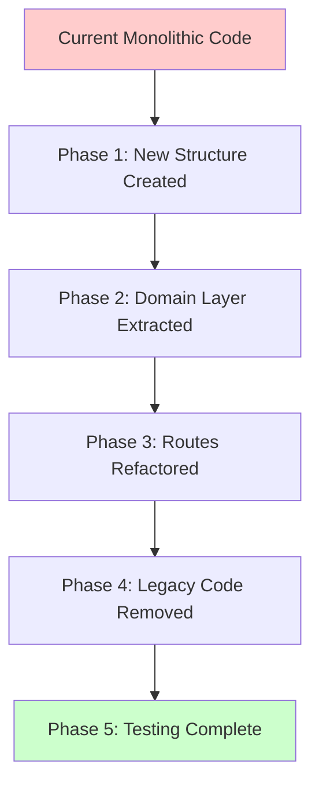
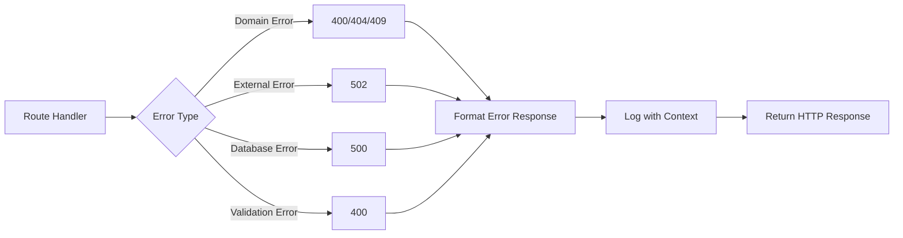
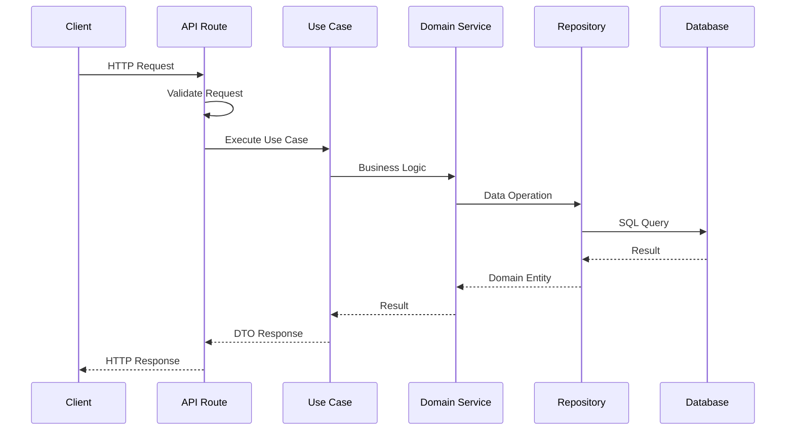

# Refactor Project into Modern Modular Architecture

## Objective

Transform the tale-generator application into a modern, well-structured Python application using contemporary architectural patterns and best practices. The refactoring will improve maintainability, testability, scalability, and code organization while preserving all existing functionality.

## Current Architecture Analysis

### Existing Structure Issues

| Issue | Current State | Impact |
|-------|--------------|--------|
| Tight Coupling | API routes directly instantiate clients and services at module level | Difficult to test, modify, or replace components |
| Global State | Clients initialized as module-level variables | Thread-safety concerns, testing difficulties |
| Mixed Responsibilities | Routes handle business logic, data transformation, and orchestration | Violates Single Responsibility Principle |
| Lack of Dependency Injection | Hard-coded dependencies throughout the codebase | Poor testability and flexibility |
| Inconsistent Error Handling | Exception handling scattered across layers | Difficult to maintain consistent error responses |
| No Clear Boundaries | Business logic mixed with infrastructure concerns | Difficult to understand and modify |
| Monolithic Files | Large files with multiple responsibilities | Poor maintainability |

### Current Component Inventory

| Component | Location | Responsibilities |
|-----------|----------|------------------|
| FastAPI Application | main.py | Application creation, middleware, static files |
| API Routes | src/api/routes.py | HTTP endpoints, request/response handling, business logic |
| Data Models | src/models.py | Pydantic models for API and database |
| OpenRouter Client | src/openrouter_client.py | AI story generation via OpenRouter API |
| Supabase Client | src/supabase_client.py | Database operations, storage operations |
| Voice Providers | src/voice_providers/ | Audio generation abstraction |
| Prompt Generation | src/prompts.py | Language-specific story prompts |
| Logging Config | src/logging_config.py | Application logging setup |
| Admin Interface | src/admin/ | Static frontend for story management |

## Target Architecture

### Architectural Principles

The refactored application will follow these principles:

- **Layered Architecture**: Clear separation between API, Business Logic, and Infrastructure layers
- **Dependency Injection**: Explicit dependency management using modern DI patterns
- **Domain-Driven Design**: Business logic organized around domain entities
- **Repository Pattern**: Abstract data access behind interfaces
- **Service Layer**: Encapsulate business logic in dedicated services
- **Factory Pattern**: Centralized object creation and configuration
- **Single Responsibility**: Each module has one clear purpose
- **Interface Segregation**: Small, focused interfaces

### Target Directory Structure

```
src/
├── domain/                     # Domain layer (business logic)
│   ├── __init__.py
│   ├── entities.py            # Domain entities (Child, Story, Hero)
│   ├── value_objects.py       # Value objects (Language, Gender, StoryMoral)
│   ├── repositories/          # Repository interfaces
│   │   ├── __init__.py
│   │   ├── base.py           # Base repository interface
│   │   ├── story_repository.py
│   │   ├── child_repository.py
│   │   └── hero_repository.py
│   └── services/              # Domain services
│       ├── __init__.py
│       ├── story_service.py   # Core story generation logic
│       ├── audio_service.py   # Audio generation orchestration
│       └── prompt_service.py  # Prompt generation logic
│
├── application/               # Application layer (use cases)
│   ├── __init__.py
│   ├── use_cases/            # Use case implementations
│   │   ├── __init__.py
│   │   ├── generate_story.py # Generate story use case
│   │   ├── manage_children.py # Child management use cases
│   │   └── manage_stories.py  # Story management use cases
│   ├── dto.py                # Data Transfer Objects for API
│   └── interfaces.py         # Application service interfaces
│
├── infrastructure/            # Infrastructure layer
│   ├── __init__.py
│   ├── api/                  # API layer
│   │   ├── __init__.py
│   │   ├── dependencies.py   # FastAPI dependencies
│   │   ├── middleware.py     # Custom middleware
│   │   ├── exception_handlers.py
│   │   └── routes/
│   │       ├── __init__.py
│   │       ├── story_routes.py
│   │       ├── child_routes.py
│   │       └── admin_routes.py
│   ├── persistence/          # Data persistence
│   │   ├── __init__.py
│   │   ├── supabase/
│   │   │   ├── __init__.py
│   │   │   ├── client.py     # Supabase client wrapper
│   │   │   ├── story_repository_impl.py
│   │   │   ├── child_repository_impl.py
│   │   │   └── hero_repository_impl.py
│   │   └── models.py         # Database models
│   ├── external/             # External service integrations
│   │   ├── __init__.py
│   │   ├── ai/
│   │   │   ├── __init__.py
│   │   │   ├── openrouter_client.py
│   │   │   └── ai_service_interface.py
│   │   └── voice/
│   │       ├── __init__.py
│   │       ├── base_provider.py
│   │       ├── elevenlabs_provider.py
│   │       ├── mock_provider.py
│   │       ├── provider_registry.py
│   │       └── voice_service.py
│   └── config/               # Configuration management
│       ├── __init__.py
│       ├── settings.py       # Pydantic settings
│       └── logging_config.py
│
├── presentation/             # Presentation layer
│   ├── __init__.py
│   └── admin/               # Admin UI
│       ├── static/
│       └── templates/
│
└── core/                    # Shared utilities
    ├── __init__.py
    ├── exceptions.py        # Custom exceptions
    ├── logging.py           # Logging utilities
    └── constants.py         # Application constants
```

## Refactoring Strategy

### Phase 1: Foundation Layer

Establish core infrastructure and configuration management.

#### Configuration Management

**Objective**: Centralize configuration using Pydantic Settings

Create a typed configuration system that:
- Loads environment variables with validation
- Provides type-safe access to configuration
- Supports multiple environments (dev, prod, test)
- Validates required settings at startup

Configuration categories:
- Application settings (host, port, environment)
- Database settings (Supabase URL, key, schema)
- External API settings (OpenRouter, ElevenLabs)
- Logging settings (level, format, file output)
- Feature flags (audio generation enabled, etc.)

#### Exception Hierarchy

**Objective**: Establish consistent error handling

Define custom exception hierarchy:

| Exception Type | Purpose | HTTP Status |
|---------------|---------|-------------|
| DomainException | Base for domain errors | 400 |
| ValidationError | Input validation failures | 400 |
| NotFoundError | Resource not found | 404 |
| ConflictError | Resource conflicts | 409 |
| ExternalServiceError | External API failures | 502 |
| DatabaseError | Database operation failures | 500 |
| AuthorizationError | Permission issues | 403 |

Each exception includes:
- User-friendly message
- Technical details for logging
- Error codes for client handling
- Contextual information

#### Logging System

**Objective**: Structured logging with context

Enhance logging to support:
- Structured logging with context injection
- Request ID tracking across layers
- Performance metrics logging
- Different log levels per module
- Sensitive data filtering
- JSON output option for production

### Phase 2: Domain Layer

Create pure business logic independent of frameworks.

#### Domain Entities

**Objective**: Represent core business concepts

Define domain entities with:
- Rich behavior methods (not just data containers)
- Business rule validation
- Domain events for state changes
- Immutability where appropriate

Entities:
- Child (with interests management, age validation)
- Story (with rating, language, audio attachment)
- Hero (with characteristics, language)
- AudioFile (with provider metadata, URL)

#### Value Objects

**Objective**: Type-safe value representations

Create value objects for:
- Language (with language-specific operations)
- Gender (with translation support)
- StoryMoral (with moral descriptions)
- Rating (with validation 1-10)
- StoryLength (with word count calculation)

#### Repository Interfaces

**Objective**: Abstract data access patterns

Define repository interfaces (following Repository Pattern):

```
StoryRepository interface:
- save(story) -> Story
- find_by_id(id) -> Optional[Story]
- find_by_child_id(child_id) -> List[Story]
- find_by_language(language) -> List[Story]
- update_rating(id, rating) -> Story
- delete(id) -> bool
- list_all() -> List[Story]

ChildRepository interface:
- save(child) -> Child
- find_by_id(id) -> Optional[Child]
- find_by_name(name) -> List[Child]
- find_exact_match(name, age, gender) -> Optional[Child]
- list_all() -> List[Child]
- delete(id) -> bool

HeroRepository interface:
- save(hero) -> Hero
- find_by_id(id) -> Optional[Hero]
- find_by_name(name) -> List[Hero]
- find_by_language(language) -> List[Hero]
- update(hero) -> Hero
- delete(id) -> bool
- list_all() -> List[Hero]
```

#### Domain Services

**Objective**: Encapsulate business logic that doesn't fit in entities

**StoryService responsibilities**:
- Orchestrate story generation workflow
- Apply business rules for story creation
- Coordinate between repositories and external services
- Handle story enrichment (title extraction, metadata)

**AudioService responsibilities**:
- Manage audio generation workflow
- Select appropriate voice provider
- Handle audio file upload
- Track audio generation metadata

**PromptService responsibilities**:
- Generate language-specific prompts
- Translate child/hero attributes
- Calculate story length parameters
- Apply prompt templates

### Phase 3: Application Layer

Implement use cases and application services.

#### Use Cases

**Objective**: Implement application-specific business workflows

Each use case represents a single user action:

**GenerateStoryUseCase**:
- Input: StoryRequest DTO
- Process:
  1. Validate input parameters
  2. Find or create child entity
  3. Generate story prompt
  4. Call AI service for story generation
  5. Extract title from content
  6. Generate audio (if requested)
  7. Save story to repository
  8. Return story response
- Output: StoryResponse DTO

**RateStoryUseCase**:
- Input: story_id, rating
- Process:
  1. Validate rating (1-10)
  2. Verify story exists
  3. Update rating
  4. Return updated story
- Output: Story entity

**ManageChildUseCase** (multiple operations):
- CreateChild
- GetChild
- ListChildren
- DeleteChild

**ManageStoryUseCase** (multiple operations):
- GetStory
- ListStoriesByChild
- ListStoriesByLanguage
- DeleteStory

#### Data Transfer Objects (DTOs)

**Objective**: Decouple API contracts from domain models

Define DTOs for:
- Request models (StoryRequest, ChildRequest, RatingRequest)
- Response models (StoryResponse, ChildResponse)
- List responses with pagination support
- Error responses with detailed information

DTOs include:
- Validation rules (using Pydantic)
- Example values for API documentation
- Field descriptions
- Default values

### Phase 4: Infrastructure Layer

Implement concrete infrastructure concerns.

#### Repository Implementations

**Objective**: Implement data persistence using Supabase

Create repository implementations:
- SupabaseStoryRepository
- SupabaseChildRepository
- SupabaseHeroRepository

Each implementation:
- Maps domain entities to database models
- Handles database-specific serialization
- Implements retry logic for transient failures
- Logs database operations
- Translates database errors to domain exceptions

#### External Service Clients

**Objective**: Isolate external dependencies

**AI Service Integration**:
- Define AIServiceInterface
- Implement OpenRouterAIService
- Support multiple models
- Implement retry logic with exponential backoff
- Track generation metadata
- Handle rate limiting

**Voice Service Integration**:
- Maintain existing provider architecture
- Improve provider registry with dependency injection
- Add provider health checks
- Support provider failover
- Track provider usage statistics

#### API Layer

**Objective**: Handle HTTP concerns separately from business logic

**API Routes**:
- Thin route handlers (delegate to use cases)
- Request validation using Pydantic
- Response formatting
- HTTP status code mapping

**Dependencies**:
- FastAPI dependency injection for services
- Request context injection
- Authentication/authorization hooks (future)

**Middleware**:
- Request ID generation and propagation
- Performance timing
- Error handling and formatting
- CORS configuration

**Exception Handlers**:
- Map domain exceptions to HTTP responses
- Format error responses consistently
- Log exceptions with context
- Return appropriate status codes

#### Configuration

**Objective**: Type-safe configuration management

Settings categories:
- DatabaseSettings (Supabase connection)
- AIServiceSettings (OpenRouter API key, models)
- VoiceServiceSettings (ElevenLabs API key)
- ApplicationSettings (host, port, environment)
- LoggingSettings (level, format)

Configuration loading:
- Environment variables (12-factor app)
- .env file support (development)
- Secret management integration (production)
- Validation at startup

### Phase 5: Dependency Injection

Implement dependency injection container.

#### Container Setup

**Objective**: Manage object lifecycle and dependencies

Use dependency injection framework approach:
- Container initialization at startup
- Singleton services (repositories, external clients)
- Scoped services (use cases per request)
- Factory functions for complex objects

#### FastAPI Integration

**Objective**: Integrate DI with FastAPI dependency system

- Create dependency provider functions
- Register dependencies in FastAPI app
- Support dependency overrides for testing
- Lazy initialization of expensive resources

#### Testing Support

**Objective**: Enable easy testing with mocks

- Support dependency replacement for tests
- Provide mock implementations of interfaces
- Enable integration test configurations
- Support test fixtures

### Phase 6: Migration Strategy

Implement incremental migration approach.

#### Migration Phases



#### Backward Compatibility

**Strategy**: Maintain existing API contracts

During migration:
- Keep existing endpoints functional
- Gradually migrate routes to new architecture
- Support both old and new implementations
- Test equivalence between implementations
- Remove old code only after validation

#### Testing Strategy

**Objective**: Ensure refactoring doesn't break functionality

Testing approach:
- Unit tests for domain services
- Integration tests for repositories
- API tests for endpoints
- Comparison tests (old vs new)
- Performance benchmarks

## Implementation Details

### Dependency Injection Pattern

Use FastAPI's built-in dependency injection with factory functions:

| Dependency Type | Lifecycle | Initialization |
|----------------|-----------|----------------|
| Settings | Singleton | At startup |
| Database Connection | Singleton | At startup |
| Repositories | Singleton | At startup |
| External Clients | Singleton | At startup |
| Use Cases | Per Request | On demand |
| Domain Services | Singleton | At startup |

### Error Flow



### Request Flow



### Configuration Loading

Configuration priority (highest to lowest):
1. Environment variables
2. .env file
3. Default values

Configuration validation:
- Validate all required settings at startup
- Fail fast if configuration is invalid
- Provide clear error messages
- Log configuration (excluding secrets)

### Logging Strategy

Logging levels by layer:

| Layer | Default Level | Context |
|-------|--------------|---------|
| API Routes | INFO | Request ID, endpoint, status |
| Use Cases | INFO | Use case name, user context |
| Domain Services | DEBUG | Operation details |
| Repositories | DEBUG | Query details |
| External Services | INFO | Service name, status, timing |

Log format:
- Timestamp (ISO 8601)
- Level
- Logger name
- Request ID (if available)
- Message
- Contextual data (structured)

## Benefits

### Maintainability

| Aspect | Current | After Refactoring |
|--------|---------|-------------------|
| Separation of Concerns | Mixed responsibilities | Clear layer boundaries |
| Code Organization | Monolithic files | Small, focused modules |
| Dependency Management | Implicit, global | Explicit, injected |
| Testing | Difficult due to coupling | Easy with mocks |

### Scalability

Improvements:
- Easy to add new features (extend without modifying)
- Simple to add new external services
- Support for multiple database backends
- Easy to add new API versions

### Testability

Testing improvements:
- Unit test domain logic in isolation
- Mock external dependencies easily
- Test API layer without database
- Integration tests with test doubles

### Code Quality

Quality improvements:
- Type safety with Pydantic models
- Consistent error handling
- Clear interfaces and contracts
- Self-documenting code structure
- Better IDE support and autocomplete

## Migration Checklist

### Preparation
- Review current functionality
- Document existing behavior
- Create comprehensive test suite for current code
- Set up feature flags for gradual rollout

### Phase 1 Tasks
- Create new directory structure
- Implement Settings with Pydantic Settings
- Create exception hierarchy
- Set up structured logging

### Phase 2 Tasks
- Define domain entities
- Create value objects
- Define repository interfaces
- Implement domain services

### Phase 3 Tasks
- Create DTOs for API
- Implement use cases
- Add application services

### Phase 4 Tasks
- Implement repository concrete classes
- Refactor external service clients
- Create new API route handlers
- Implement middleware and exception handlers

### Phase 5 Tasks
- Set up dependency injection
- Wire dependencies in FastAPI
- Add testing utilities

### Phase 6 Tasks
- Migrate routes one by one
- Run parallel testing
- Performance testing
- Remove legacy code
- Update documentation

## Risk Mitigation

### Risks and Mitigations

| Risk | Impact | Mitigation |
|------|--------|------------|
| Breaking existing functionality | High | Comprehensive testing, gradual migration |
| Performance degradation | Medium | Benchmarking, profiling, optimization |
| Over-engineering | Medium | Start simple, add complexity only when needed |
| Team learning curve | Medium | Documentation, pair programming, code reviews |
| Migration taking too long | Low | Incremental approach, defined phases |

## Success Criteria

### Technical Metrics

- All existing tests pass
- Code coverage above 80 percent
- No performance regression (response time within 10 percent)
- All API contracts maintained
- Zero production incidents during migration

### Code Quality Metrics

- Cyclomatic complexity below 10 per function
- File size below 500 lines
- Clear separation of concerns
- No circular dependencies
- Type hints on all public interfaces

### Documentation Requirements

- Architecture documentation updated
- API documentation complete
- Developer onboarding guide
- Migration guide for similar projects

## Future Enhancements

This refactoring enables:

### Short-term
- Add authentication and authorization
- Implement API versioning
- Add rate limiting
- Improve monitoring and observability

### Medium-term
- Support additional languages
- Add more AI providers
- Implement caching layer
- Add background job processing

### Long-term
- Microservices architecture option
- Event-driven architecture
- GraphQL API
- Real-time story generation with WebSockets

## Technical Debt Resolution

Existing technical debt addressed by this refactoring:

| Technical Debt | Current Impact | Resolution |
|----------------|----------------|------------|
| Global state | Testing difficulties | Dependency injection |
| Tight coupling | Hard to modify | Interfaces and DI |
| Large files | Poor readability | Module separation |
| Mixed concerns | Maintenance burden | Layered architecture |
| No error strategy | Inconsistent handling | Exception hierarchy |
| Hard-coded config | Environment management | Settings management |

## Notes

- All existing functionality must be preserved
- API contracts remain unchanged
- Migration should be transparent to users
- Performance must not degrade
- Focus on pragmatic improvements, not perfection
- Prioritize testability and maintainability
- Follow Python best practices (PEP 8, type hints)
- Use modern Python features (Python 3.12+)
- Maintain compatibility with UV package manager
- Keep Docker deployment working
