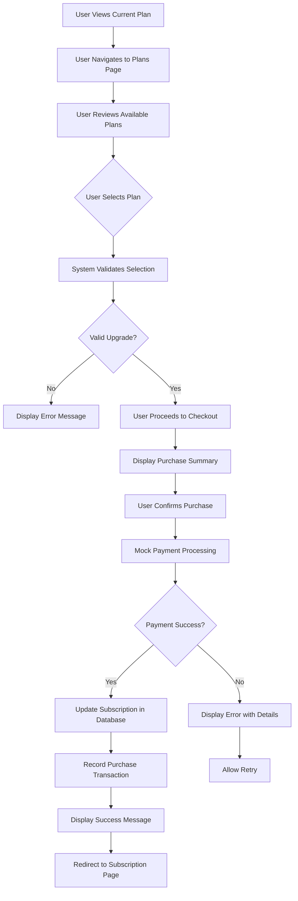
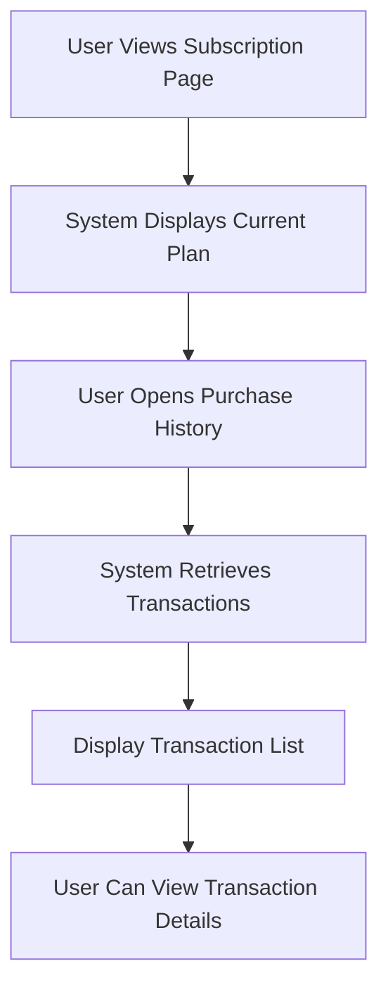
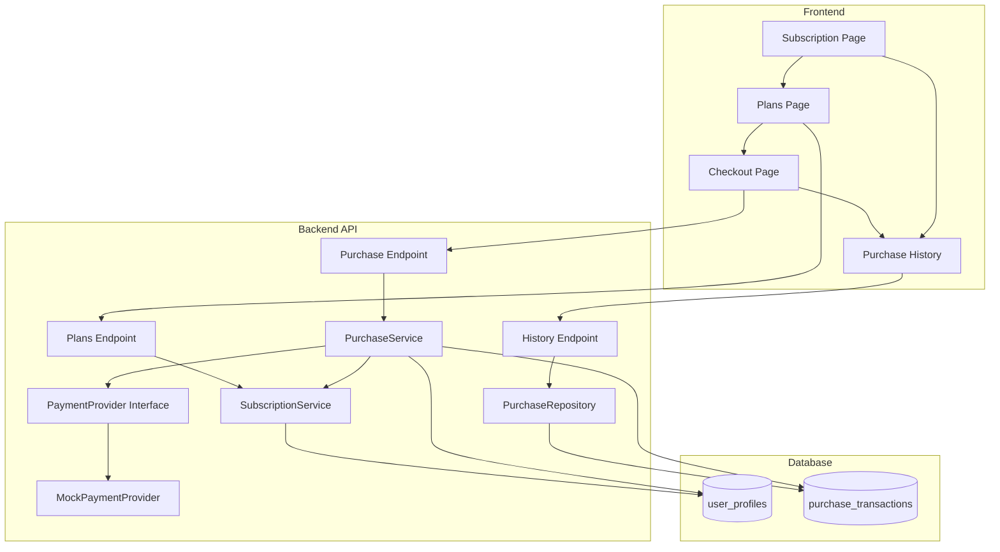

# Subscription Purchase Feature Design

## Overview

This design defines the subscription purchase functionality that enables users to upgrade from their current plan to a higher tier. Since payment integration is not yet available, this implementation uses a mock payment service to simulate the purchase flow while establishing the complete infrastructure for future real payment integration.

## Business Context

The application currently has a subscription system with four tiers (Free, Starter, Normal, Premium) that enforce usage limits. Users can view their current plan and limits but cannot self-service upgrade. This feature enables users to purchase higher-tier plans through a complete purchase workflow.

## Strategic Goals

- Enable users to upgrade their subscription plans independently
- Establish purchase workflow infrastructure ready for real payment integration
- Maintain clear separation between mock and production-ready payment logic
- Provide transparent feedback on purchase status and subscription changes
- Ensure data consistency across purchase transactions

## System Scope

### In Scope

- Plan selection and comparison interface
- Purchase workflow with mock payment processing
- Subscription upgrade logic and data persistence
- Purchase history tracking
- Success and failure feedback mechanisms
- Backend API endpoints for purchase operations
- Frontend pages and components for plan selection and checkout

### Out of Scope

- Real payment gateway integration (Stripe, Paddle, PayPal)
- Recurring billing and automatic renewals
- Downgrade functionality
- Refund processing
- Proration calculations
- Invoice generation
- Tax calculation
- Multi-currency support
- Payment method management

## User Workflows

### Primary Workflow: Plan Upgrade



### Supporting Workflow: View Purchase History



## Domain Model

### Core Entities

#### PurchaseTransaction

Represents a completed or attempted subscription purchase.

| Attribute | Type | Description | Constraints |
|-----------|------|-------------|-------------|
| id | UUID | Unique transaction identifier | Primary key, auto-generated |
| user_id | UUID | User who initiated purchase | Foreign key to auth.users, required |
| from_plan | Text | Plan before upgrade | One of: free, starter, normal, premium |
| to_plan | Text | Plan after upgrade | One of: starter, normal, premium |
| amount | Decimal | Purchase amount in USD | Positive number, 2 decimal places |
| currency | Text | Currency code | Fixed value: USD |
| payment_status | Text | Payment processing result | One of: pending, completed, failed, refunded |
| payment_method | Text | Payment method used | For mock: "mock_payment" |
| payment_provider | Text | Payment processor name | For mock: "mock" |
| transaction_reference | Text | External payment reference | Mock transaction ID |
| created_at | Timestamp | When transaction was created | Auto-generated, immutable |
| completed_at | Timestamp | When payment completed | Nullable, set on success |
| metadata | JSONB | Additional transaction data | Nullable, flexible storage |

#### PlanDefinition

Static configuration for subscription plan pricing.

| Attribute | Type | Description | Constraints |
|-----------|------|-------------|-------------|
| plan_tier | Text | Plan identifier | One of: starter, normal, premium |
| display_name | Text | Human-readable plan name | Required |
| monthly_price | Decimal | Monthly subscription cost | Positive number |
| annual_price | Decimal | Annual subscription cost | Positive number, discounted |
| features | List | Feature descriptions | Ordered list of strings |
| limits | Object | Plan limits configuration | References existing PlanLimits |
| is_purchasable | Boolean | Whether plan can be purchased | Default: true |

### Value Objects

#### PaymentRequest

Input for initiating a purchase.

| Field | Type | Description | Validation |
|-------|------|-------------|------------|
| plan_tier | Text | Target subscription plan | Must be valid upgrade |
| billing_cycle | Text | Monthly or annual | One of: monthly, annual |
| payment_method | Text | Mock payment method type | For mock: "mock_card" |

#### PaymentResponse

Result of payment processing.

| Field | Type | Description |
|-------|------|-------------|
| success | Boolean | Whether payment succeeded |
| transaction_id | UUID | Created transaction record ID |
| reference | Text | Payment provider reference |
| message | Text | Human-readable status message |
| error_code | Text | Error code if payment failed (nullable) |

## System Architecture

### Component Interaction Flow



### Backend Service Responsibilities

#### PurchaseService

Central orchestrator for purchase operations.

**Responsibilities:**
- Validate purchase eligibility based on current subscription
- Calculate pricing based on plan and billing cycle
- Coordinate payment processing through payment provider
- Update user subscription upon successful payment
- Create and persist purchase transaction records
- Handle transaction failures and rollback scenarios

**Key Methods:**
- validate_upgrade: Confirm user can upgrade to target plan
- calculate_price: Determine amount based on plan and cycle
- initiate_purchase: Begin purchase transaction
- complete_purchase: Finalize successful purchase
- handle_payment_failure: Process failed payment attempts

#### PaymentProvider Interface

Abstract interface for payment processing.

**Methods:**
- process_payment: Execute payment transaction
- validate_payment_method: Verify payment method is acceptable
- get_provider_name: Return provider identifier

**Implementation Strategy:**
- Define interface for all payment providers
- Create MockPaymentProvider for current implementation
- Ensure future providers (Stripe, Paddle) implement same interface
- Enable provider switching through configuration

#### MockPaymentProvider

Simulates payment processing for development and testing.

**Behavior:**
- Accept all payment requests as valid by default
- Generate random transaction references
- Support simulated failure scenarios via special input flags
- Simulate realistic processing delays
- Return structured success/failure responses

**Configuration Options:**
- Success rate: Percentage of transactions that succeed
- Processing delay: Artificial delay in milliseconds
- Failure scenarios: Specific test cases for error handling

### Frontend Component Structure

#### PlansPage

Displays available subscription plans for comparison and selection.

**Layout Sections:**
- Current plan indicator with visual badge
- Plan comparison grid showing all tiers side-by-side
- Feature comparison matrix
- Pricing display (monthly/annual toggle)
- Call-to-action buttons for each plan

**User Interactions:**
- Toggle between monthly and annual pricing
- View detailed feature lists
- Select plan to initiate purchase
- See visual indicators for current plan and recommended upgrades

**Data Requirements:**
- Current user subscription information
- All available plan definitions
- Feature limits for each tier
- Pricing for monthly and annual cycles

#### CheckoutPage

Facilitates purchase confirmation and payment processing.

**Form Elements:**
- Selected plan summary
- Pricing breakdown
- Billing cycle selection
- Mock payment method selector
- Terms and conditions acknowledgment
- Purchase confirmation button

**Validation Rules:**
- Confirm selected plan is valid upgrade
- Require billing cycle selection
- Require terms acceptance
- Prevent duplicate submissions
- Validate user authentication

**User Feedback:**
- Display processing indicator during payment
- Show success message with subscription details
- Display error messages with retry options
- Provide navigation to subscription page on success

#### PurchaseHistorySection

Shows user's purchase transaction history.

**Display Format:**
- Reverse chronological list of transactions
- Transaction date and time
- Plan upgrade details (from → to)
- Amount paid and currency
- Payment status badge
- Transaction reference number

**Filtering Options:**
- All transactions
- Successful purchases only
- Failed attempts

## Data Model

### Database Schema Extensions

#### purchase_transactions Table

```
Column                  | Type          | Constraints
------------------------|---------------|----------------------------------
id                      | UUID          | PRIMARY KEY, DEFAULT gen_random_uuid()
user_id                 | UUID          | NOT NULL, REFERENCES auth.users(id) ON DELETE CASCADE
from_plan               | TEXT          | NOT NULL, CHECK IN (free, starter, normal, premium)
to_plan                 | TEXT          | NOT NULL, CHECK IN (starter, normal, premium)
amount                  | DECIMAL(10,2) | NOT NULL, CHECK > 0
currency                | TEXT          | NOT NULL, DEFAULT 'USD'
payment_status          | TEXT          | NOT NULL, CHECK IN (pending, completed, failed, refunded)
payment_method          | TEXT          | NOT NULL
payment_provider        | TEXT          | NOT NULL
transaction_reference   | TEXT          | NOT NULL
created_at              | TIMESTAMPTZ   | NOT NULL, DEFAULT NOW()
completed_at            | TIMESTAMPTZ   | NULL
metadata                | JSONB         | NULL
```

**Indexes:**
- idx_purchase_transactions_user_id ON user_id
- idx_purchase_transactions_status ON payment_status
- idx_purchase_transactions_created ON created_at DESC

**Row Level Security:**
- Users can view only their own transactions
- Only authenticated users can create transactions
- No updates or deletes allowed (audit trail)

### Data Consistency Rules

**Purchase Transaction Creation:**
- Must validate current plan before creating transaction
- Must verify target plan is a valid upgrade
- Transaction record created before payment processing
- Initial status is "pending"

**Subscription Update:**
- Only update subscription if payment status is "completed"
- Update subscription_plan, subscription_start_date, subscription_end_date
- Reset monthly_story_count if new plan has different limits
- Preserve last_reset_date for usage tracking

**Atomicity Requirements:**
- Payment processing and subscription update must be transactional
- If subscription update fails, mark transaction as failed
- If payment fails, transaction remains pending/failed, no subscription change
- All database operations within purchase flow must succeed or rollback together

## API Contract

### Get Available Plans

**Endpoint:** GET /api/v1/subscription/plans

**Authentication:** Required

**Response:**

| Field | Type | Description |
|-------|------|-------------|
| plans | Array | List of PlanDefinition objects |
| current_plan | Text | User's current plan tier |

### Initiate Purchase

**Endpoint:** POST /api/v1/subscription/purchase

**Authentication:** Required

**Request Body:**

| Field | Type | Required | Description |
|-------|------|----------|-------------|
| plan_tier | Text | Yes | Target plan to purchase |
| billing_cycle | Text | Yes | "monthly" or "annual" |
| payment_method | Text | Yes | Payment method identifier |

**Response (Success - 200):**

| Field | Type | Description |
|-------|------|-------------|
| success | Boolean | Always true for success |
| transaction_id | UUID | Created transaction ID |
| subscription | Object | Updated subscription details |
| message | Text | Success confirmation message |

**Response (Error - 400/402/500):**

| Field | Type | Description |
|-------|------|-------------|
| error | Text | Error message |
| code | Text | Error code for client handling |
| details | Object | Additional error context (nullable) |

**Error Codes:**
- INVALID_UPGRADE: Target plan is not a valid upgrade
- PAYMENT_FAILED: Payment processing failed
- SUBSCRIPTION_UPDATE_FAILED: Payment succeeded but subscription update failed
- DUPLICATE_REQUEST: Purchase already in progress

### Get Purchase History

**Endpoint:** GET /api/v1/subscription/purchases

**Authentication:** Required

**Query Parameters:**

| Parameter | Type | Required | Description |
|-----------|------|----------|-------------|
| status | Text | No | Filter by payment_status |
| limit | Integer | No | Max results (default: 50, max: 100) |
| offset | Integer | No | Pagination offset (default: 0) |

**Response:**

| Field | Type | Description |
|-------|------|-------------|
| transactions | Array | List of PurchaseTransaction objects |
| total | Integer | Total matching transactions |
| has_more | Boolean | Whether more results exist |

## Business Rules

### Plan Upgrade Validation

**Valid Upgrade Paths:**
- Free → Starter, Normal, or Premium
- Starter → Normal or Premium
- Normal → Premium
- Premium → (no upgrades available)

**Invalid Operations:**
- Cannot purchase current plan
- Cannot downgrade to lower tier
- Cannot purchase Free plan
- Cannot upgrade if subscription status is "cancelled" or "expired"

### Pricing Rules

**Monthly Pricing:**
- Starter: $9.99/month
- Normal: $19.99/month
- Premium: $39.99/month

**Annual Pricing (with discount):**
- Starter: $99.99/year (equivalent to $8.33/month, 17% savings)
- Normal: $199.99/year (equivalent to $16.67/month, 17% savings)
- Premium: $399.99/year (equivalent to $33.33/month, 17% savings)

**Price Calculation:**
- Base price determined by plan tier and billing cycle
- No proration in current phase
- No taxes or additional fees
- Currency is always USD

### Subscription Activation

**Immediate Activation:**
- Subscription plan updated immediately upon payment success
- Start date set to current timestamp
- End date calculated based on billing cycle
- Monthly counter reset to 0
- User immediately gains access to new plan features

**End Date Calculation:**
- Monthly: Current date + 30 days
- Annual: Current date + 365 days

## Mock Payment Provider Specification

### Purpose

Simulate payment processing without actual financial transactions, enabling complete workflow testing and UI development.

### Behavior Modes

#### Default Mode (Success)

- All payment requests succeed
- Generate random transaction reference (format: MOCK-XXXXXXXXXXXX)
- Simulate 1-2 second processing delay
- Return success response with transaction details

#### Simulated Failure Mode

Triggered by special payment method values:

| Payment Method Value | Simulated Behavior | Error Code |
|---------------------|-------------------|------------|
| mock_card_declined | Insufficient funds | CARD_DECLINED |
| mock_card_expired | Expired payment method | CARD_EXPIRED |
| mock_network_error | Network timeout | NETWORK_ERROR |
| mock_fraud_detected | Fraud prevention trigger | FRAUD_DETECTED |

### Response Format

**Success Response:**

| Field | Value |
|-------|-------|
| success | true |
| reference | "MOCK-" + random 12-digit number |
| timestamp | Current ISO 8601 timestamp |
| amount | Requested amount |
| currency | "USD" |

**Failure Response:**

| Field | Value |
|-------|-------|
| success | false |
| error_code | Specific error code |
| error_message | Human-readable error description |
| timestamp | Current ISO 8601 timestamp |

## User Experience Considerations

### Purchase Flow Clarity

- Clearly indicate this is a mock payment system during development
- Show before/after comparison of plan features
- Display pricing prominently with currency
- Confirm subscription changes before finalizing
- Provide clear success confirmation with next steps

### Error Handling

- Display user-friendly error messages for payment failures
- Provide actionable guidance for resolution
- Offer retry option for failed transactions
- Maintain form state on errors to avoid re-entry
- Log detailed errors for developer troubleshooting

### Performance Expectations

- Plan loading: under 500ms
- Purchase processing: 1-3 seconds (including mock delay)
- History retrieval: under 1 second for 50 records
- Subscription update reflection: immediate after purchase

## Security Considerations

### Authentication

- All endpoints require valid JWT authentication
- Users can only purchase for their own account
- Transaction history accessible only to transaction owner

### Authorization

- Validate user owns the session for purchase requests
- Verify current subscription state before allowing purchase
- Prevent concurrent purchase attempts by same user

### Data Protection

- Encrypt sensitive transaction metadata
- Do not store real payment credentials (mock system only)
- Implement audit logging for all purchase attempts
- Ensure row-level security on purchase_transactions table

### Input Validation

- Validate plan tier against allowed values
- Validate billing cycle against allowed values
- Sanitize all user inputs before database operations
- Reject malformed payment requests

## Testing Strategy

### Mock Payment Provider Testing

- Verify all success scenarios return expected format
- Confirm each failure mode triggers correct error
- Validate transaction reference generation uniqueness
- Test processing delay timing
- Ensure provider isolation from real payment systems

### Purchase Workflow Testing

- Test all valid upgrade paths
- Verify invalid upgrade attempts are rejected
- Confirm subscription updates occur atomically
- Test transaction record creation and persistence
- Validate purchase history retrieval and filtering

### Integration Testing

- End-to-end flow from plan selection to subscription activation
- Verify frontend-backend data consistency
- Test concurrent purchase prevention
- Confirm error propagation through all layers

### Edge Cases

- User upgrades while at usage limit
- Purchase during monthly reset period
- Multiple rapid purchase attempts
- Network interruption during payment
- Database unavailability during purchase

## Migration Path to Real Payment Processing

### Interface Compatibility

The payment provider interface is designed to accommodate real payment processors with minimal changes:

- Abstract interface remains unchanged
- Configuration switch between mock and production providers
- Production provider implements same interface contract
- Response formats align with common payment API patterns

### Required Changes for Production

**Backend:**
- Implement StripePaymentProvider or PaddlePaymentProvider
- Add webhook handlers for payment confirmations
- Implement payment method persistence
- Add recurring billing subscription management
- Enable proration calculations

**Frontend:**
- Replace mock payment form with real payment widget
- Remove development-mode indicators
- Add SSL certificate validation
- Implement PCI compliance measures

**Database:**
- Add payment_method_token field (encrypted)
- Add webhook_events table
- Add subscription_items table for line items
- Enhance metadata field structure

**Configuration:**
- Add payment provider API credentials
- Configure webhook endpoints
- Set up fraud detection rules
- Enable production mode flag

### Data Preservation

All mock transactions remain in database when migrating to real payments:
- Historical record of development testing
- Clear distinction via payment_provider field ("mock" vs "stripe")
- Migration script to mark test data if needed

## Success Metrics

### Functional Metrics

- Users can complete upgrade purchase workflow
- All valid upgrade paths function correctly
- Invalid operations properly rejected with clear errors
- Purchase history accurately reflects all transactions
- Subscription updates activate immediately upon success

### Non-Functional Metrics

- Purchase completion time under 5 seconds
- Zero data inconsistencies between transactions and subscriptions
- 100% test coverage for purchase workflows
- Clear separation between mock and production-ready code
