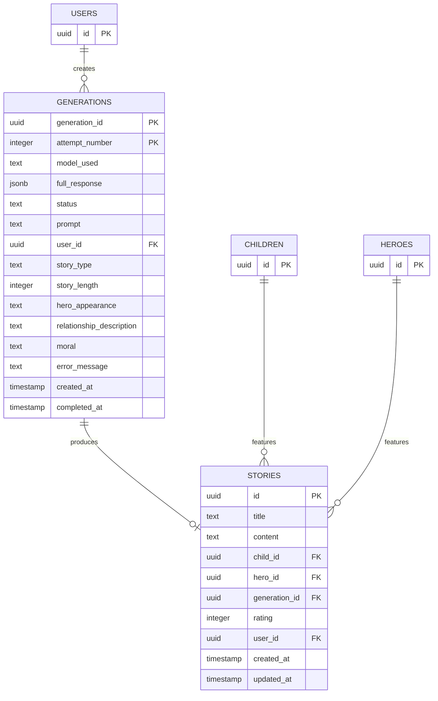

# Story Generations Table Design

## Purpose

Separate generation-specific metadata from the stories table to establish a clearer data model where:
- The **generations** table tracks API requests, attempts, and technical details
- The **stories** table focuses on the final story content and user-facing data

This separation improves data organization, enables better tracking of generation attempts, and simplifies future analytics on generation performance.

## Current State Analysis

### Existing Stories Table Structure

The stories table currently contains mixed concerns:

**Story Content Fields**:
- id, title, content
- child_id, hero_id
- created_at, updated_at
- rating, user_id

**Generation Metadata Fields** (to be moved):
- model_used
- full_response (JSONB - complete OpenRouter API response)
- generation_info (JSONB - additional generation metadata)
- story_type, story_length
- moral
- hero_appearance
- relationship_description

### Issues with Current Design

1. **Mixed Responsibilities**: Stories table handles both user content and technical generation data
2. **No Retry Tracking**: Cannot track multiple generation attempts for the same story
3. **Limited Analytics**: Difficult to analyze generation performance across attempts
4. **Data Duplication**: Generation parameters repeated for each successful story

## New Data Model

### Generations Table

New table to track all generation requests and attempts.

#### Table Schema

| Field Name | Data Type | Constraints | Description |
|------------|-----------|-------------|-------------|
| generation_id | UUID | PRIMARY KEY | Unique identifier created before OpenRouter request |
| attempt_number | INTEGER | NOT NULL | Retry attempt number (1, 2, 3, etc.) |
| model_used | TEXT | NOT NULL | AI model identifier (e.g., "openai/gpt-4o-mini") |
| full_response | JSONB | NULL | Complete OpenRouter API response |
| status | TEXT | NOT NULL, CHECK constraint | Execution status: 'pending', 'success', 'failed', 'timeout' |
| prompt | TEXT | NOT NULL | Complete prompt sent to OpenRouter |
| user_id | UUID | NOT NULL, FOREIGN KEY | Reference to auth.users |
| story_type | TEXT | NOT NULL, CHECK constraint | Type: 'child', 'hero', 'combined' |
| story_length | INTEGER | NULL | Requested length in minutes |
| hero_appearance | TEXT | NULL | Hero appearance description |
| relationship_description | TEXT | NULL | Child-hero relationship for combined stories |
| moral | TEXT | NOT NULL | Story moral/lesson |
| error_message | TEXT | NULL | Error details if status is 'failed' |
| created_at | TIMESTAMP WITH TIME ZONE | DEFAULT NOW() | Request timestamp |
| completed_at | TIMESTAMP WITH TIME ZONE | NULL | Completion timestamp |

#### Constraints and Indexes

**Primary Key**:
- Composite key: (generation_id, attempt_number)

**Check Constraints**:
- status IN ('pending', 'success', 'failed', 'timeout')
- story_type IN ('child', 'hero', 'combined')
- attempt_number >= 1
- story_length > 0 (if not NULL)

**Foreign Keys**:
- user_id → auth.users(id) ON DELETE CASCADE

**Indexes**:
- Primary index on (generation_id, attempt_number)
- Index on generation_id for lookups
- Index on user_id for user-specific queries
- Index on status for filtering
- Index on created_at for time-based queries
- Index on model_used for analytics

### Updated Stories Table

Simplified to focus on story content and user interaction.

#### Retained Fields

| Field Name | Data Type | Description |
|------------|-----------|-------------|
| id | UUID | Story identifier |
| title | TEXT | Story title |
| content | TEXT | Story text content |
| child_id | UUID | Reference to child profile |
| hero_id | UUID | Reference to hero profile (if applicable) |
| created_at | TIMESTAMP WITH TIME ZONE | Creation timestamp |
| updated_at | TIMESTAMP WITH TIME ZONE | Last update timestamp |
| rating | INTEGER | User rating (1-10) |
| user_id | UUID | Story owner |
| generation_id | UUID | **NEW** - Reference to generations table |

#### Removed Fields

These fields will be moved to the generations table:
- model_used
- full_response
- generation_info
- story_type
- story_length
- moral
- hero_appearance
- relationship_description

#### New Constraint

**Foreign Key**:
- generation_id → generations(generation_id) ON DELETE RESTRICT

**Index**:
- Index on generation_id for joining with generations

## Data Relationships

### Entity Relationship

### Relationship Rules

1. **One-to-Many: User → Generations**
   - Each user can create multiple generation requests
   - Each generation belongs to exactly one user

2. **One-to-Many: Generation → Attempts**
   - Each generation_id can have multiple attempts (retries)
   - Tracked via attempt_number in composite key

3. **One-to-One: Generation → Story**
   - Each successful generation produces at most one story
   - A generation without a story indicates all attempts failed

4. **Many-to-One: Story → Generation**
   - Each story references exactly one generation
   - Multiple stories cannot share the same generation_id

## Migration Strategy

### Migration Sequence

The migration will be executed in the following order to maintain data integrity:

1. Create generations table with full schema
2. Migrate existing data from stories to generations
3. Add generation_id column to stories table
4. Update stories records with corresponding generation_id values
5. Drop deprecated columns from stories table
6. Add foreign key constraint to stories.generation_id

### Data Migration Logic

#### Step 1: Generation ID Assignment

For existing stories without generation_id:
- Generate new UUID for each existing story
- Use this UUID as generation_id
- Set attempt_number = 1 (assume all were successful on first attempt)

#### Step 2: Field Mapping

Map data from stories to generations:

| Stories Field | Generations Field | Transformation |
|--------------|-------------------|----------------|
| model_used | model_used | Direct copy |
| full_response | full_response | Direct copy |
| story_type | story_type | Direct copy |
| story_length | story_length | Direct copy |
| moral | moral | Direct copy |
| hero_appearance | hero_appearance | Direct copy |
| relationship_description | relationship_description | Direct copy |
| user_id | user_id | Direct copy |
| created_at | created_at | Direct copy |
| - | generation_id | Generate new UUID |
| - | attempt_number | Set to 1 |
| - | status | Set to 'success' (existing stories are successful) |
| - | prompt | Set to NULL (not available for historical data) |
| - | completed_at | Copy from stories.created_at |
| - | error_message | Set to NULL |

#### Step 3: Stories Table Update

Update stories table with new structure:
- Add generation_id column (initially nullable)
- Populate generation_id from migration mapping
- Make generation_id NOT NULL after population
- Drop deprecated columns

### Rollback Strategy

If migration needs to be reversed:
1. Restore deprecated columns to stories table
2. Copy data back from generations to stories
3. Remove generation_id column from stories
4. Drop generations table

## Application Layer Impact

### Code Changes Required

#### Database Models

**New Model Required**:
- GenerationDB model in `src/infrastructure/persistence/models.py`

**Model Updates**:
- StoryDB model: Remove deprecated fields, add generation_id

#### Repository Layer

**New Repository**:
- GenerationRepository interface in `src/domain/repositories/`
- Implementation in Supabase client

**Updated Repositories**:
- StoryRepository: Update queries to join with generations when needed

#### Service Layer

**Story Generation Flow**:

Current flow:
1. Generate prompt
2. Call OpenRouter API
3. Save story with all metadata

New flow:
1. Generate prompt
2. Create generation record (status='pending')
3. For each retry attempt:
   - Update attempt_number
   - Call OpenRouter API
   - Update generation record with response
4. On success: Create story with generation_id
5. On failure: Update generation status to 'failed'

#### Use Cases

**Generate Story Use Case Changes**:
- Create generation record before API call
- Track each retry as separate attempt
- Link final story to generation_id

**Query Use Cases**:
- Update queries that need generation metadata to join tables
- Provide convenience methods to fetch story with generation details

### API Response Impact

API endpoints that currently return generation metadata will need updates:

**Story Detail Response**:
- Option 1: Include generation data inline (requires JOIN)
- Option 2: Provide separate generation_details field
- Option 3: Offer optional expansion parameter (?include=generation)

**Backward Compatibility**:
- Initially return both inline and referenced generation data
- Deprecate inline fields in API v2
- Remove inline fields in API v3

## Benefits

### Immediate Benefits

1. **Clear Separation of Concerns**
   - Story content vs technical metadata
   - User-facing data vs system data

2. **Retry Tracking**
   - Each retry attempt recorded separately
   - Complete audit trail of generation process

3. **Better Analytics**
   - Track success/failure rates by model
   - Analyze retry patterns
   - Monitor generation performance

### Future Capabilities

1. **Generation History**
   - View all attempts for a generation
   - Analyze why retries were needed
   - Debug generation issues

2. **Cost Tracking**
   - Calculate costs per generation
   - Analyze token usage patterns
   - Optimize model selection

3. **Performance Optimization**
   - Identify slow models
   - Track timeout patterns
   - Optimize retry strategies

4. **Prompt Engineering**
   - Store and analyze prompts
   - A/B test prompt variations
   - Track prompt effectiveness

## Migration File Structure

### Required Migration Files

**Migration 015: Create Generations Table**
- Create tales.generations table
- Add all constraints and indexes
- Enable RLS policies

**Migration 016: Migrate Data to Generations**
- Copy generation metadata from stories
- Generate generation_id for each story
- Insert records into generations table

**Migration 017: Update Stories Table**
- Add generation_id column to stories
- Populate generation_id from migration data
- Add NOT NULL constraint
- Add foreign key constraint
- Drop deprecated columns

### Migration Execution Order

Migrations must be executed sequentially:
1. 015_create_generations_table.sql
2. 016_migrate_story_generation_data.sql
3. 017_update_stories_table_structure.sql

## Security Considerations

### Row Level Security (RLS)

**Generations Table Policies**:
- Users can SELECT their own generations
- Users can INSERT new generations
- Users can UPDATE their own generations
- Users cannot DELETE generations (maintain audit trail)
- Admin role can SELECT all generations

**Stories Table Policy Updates**:
- No changes to existing RLS policies
- generation_id visible to story owner

### Data Privacy

**Prompt Storage**:
- Prompts may contain personal information (child name, details)
- Apply same RLS policies as stories
- Consider encryption for sensitive prompts

**Response Data**:
- full_response may contain model metadata
- No PII in full_response structure
- Safe to store without additional encryption

## Testing Requirements

### Data Integrity Tests

1. Verify all existing stories migrated successfully
2. Confirm generation_id links are correct
3. Validate no data loss during migration
4. Check constraint enforcement

### Application Tests

1. Story generation creates generation record first
2. Retry attempts recorded correctly
3. Story links to correct generation
4. Queries return correct joined data

### Performance Tests

1. Query performance with JOIN operations
2. Index effectiveness verification
3. Migration execution time on production data volume
1. Query performance with JOIN operations
2. Index effectiveness verification
3. Migration execution time on production data volume

