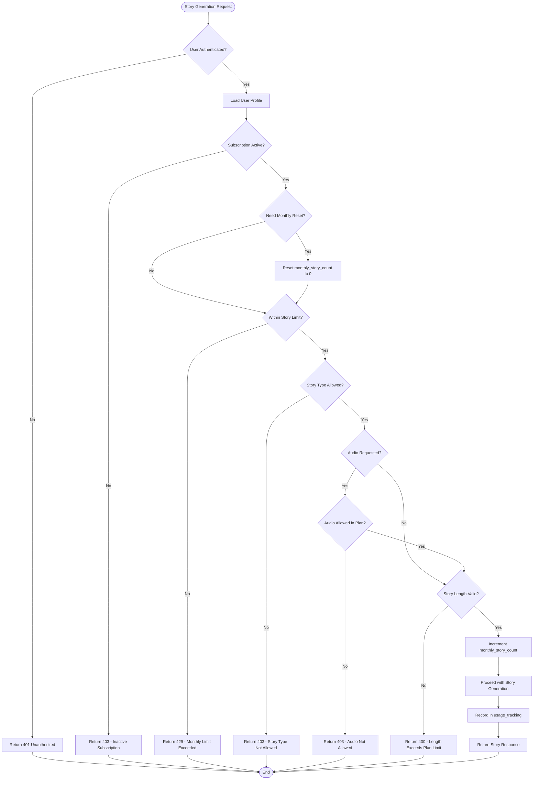

# Tariff Plan Limits System

## Overview

This design introduces a subscription-based tariff plan system that controls user access to story generation features based on their subscription tier. The system implements usage limits and validation to ensure users stay within their plan allowances.

## Business Context

The Tale Generator application currently allows unlimited story generation for all authenticated users. To support a sustainable business model, we need to introduce tiered subscription plans with different feature limits and capabilities.

## Goals

- Define clear subscription tiers with specific limits
- Track user subscription status and usage
- Enforce limits during story generation requests
- Provide clear feedback when limits are exceeded
- Enable future scalability for additional plan features

## Non-Goals

- Payment processing integration (future phase)
- Plan upgrade/downgrade UI (future phase)
- Usage analytics dashboard (future phase)
- Automated plan expiration handling (future phase)

## Subscription Plans

### Plan Tiers

| Plan | Monthly Stories | Audio Generation | Child Profiles | Hero Stories | Priority Support |
|------|----------------|------------------|----------------|--------------|------------------|
| **Free** | 5 | No | 2 | No | No |
| **Starter** | 25 | Yes | 5 | Yes | No |
| **Normal** | 100 | Yes | 10 | Yes | Email |
| **Premium** | Unlimited | Yes | Unlimited | Yes | Priority |

### Plan Limits Detail

#### Free Plan
- **Monthly Story Limit**: 5 stories per calendar month
- **Audio Generation**: Disabled
- **Child Profiles**: Maximum 2 profiles
- **Hero Stories**: Disabled (only child-only stories allowed)
- **Combined Stories**: Disabled
- **Story Length**: Maximum 5 minutes
- **Support**: Community support only

#### Starter Plan
- **Monthly Story Limit**: 25 stories per calendar month
- **Audio Generation**: Enabled
- **Child Profiles**: Maximum 5 profiles
- **Hero Stories**: Enabled
- **Combined Stories**: Enabled
- **Story Length**: Maximum 15 minutes
- **Support**: Email support

#### Normal Plan
- **Monthly Story Limit**: 100 stories per calendar month
- **Audio Generation**: Enabled
- **Child Profiles**: Maximum 10 profiles
- **Hero Stories**: Enabled
- **Combined Stories**: Enabled
- **Story Length**: Maximum 30 minutes
- **Support**: Email support with faster response

#### Premium Plan
- **Monthly Story Limit**: Unlimited
- **Audio Generation**: Enabled with premium voices
- **Child Profiles**: Unlimited
- **Hero Stories**: Enabled
- **Combined Stories**: Enabled
- **Story Length**: Maximum 30 minutes
- **Support**: Priority email and chat support

## Data Model

### User Subscription Schema

The existing `user_profiles` table will be extended with subscription information:

| Field | Type | Constraints | Description |
|-------|------|-------------|-------------|
| subscription_plan | TEXT | NOT NULL, DEFAULT 'free' | Plan tier: 'free', 'starter', 'normal', 'premium' |
| subscription_status | TEXT | NOT NULL, DEFAULT 'active' | Status: 'active', 'inactive', 'cancelled', 'expired' |
| subscription_start_date | TIMESTAMPTZ | NULL | When subscription started |
| subscription_end_date | TIMESTAMPTZ | NULL | When subscription expires (NULL for active recurring) |
| monthly_story_count | INTEGER | NOT NULL, DEFAULT 0 | Stories generated in current calendar month |
| last_reset_date | TIMESTAMPTZ | NOT NULL, DEFAULT NOW() | Last monthly counter reset date |

### Usage Tracking Schema

A new table `usage_tracking` will track detailed usage metrics:

| Field | Type | Constraints | Description |
|-------|------|-------------|-------------|
| id | UUID | PRIMARY KEY | Unique tracking record ID |
| user_id | UUID | NOT NULL, REFERENCES auth.users(id) | User reference |
| action_type | TEXT | NOT NULL | Type: 'story_generation', 'audio_generation', 'child_creation' |
| action_timestamp | TIMESTAMPTZ | NOT NULL, DEFAULT NOW() | When action occurred |
| resource_id | UUID | NULL | Reference to created resource (story_id, child_id, etc.) |
| metadata | JSONB | NULL | Additional context (plan at time of action, etc.) |

Index on `(user_id, action_timestamp)` for efficient monthly queries.

## Validation Logic

### Story Generation Validation Flow



### Child Profile Creation Validation

Before creating a new child profile:

1. Load user's subscription plan
2. Count existing child profiles for user
3. Compare count against plan limit
4. If at or over limit, return 403 error with message
5. If within limit, allow creation

### Monthly Counter Reset Logic

The monthly story counter resets automatically:

- Compare `last_reset_date` with current date
- If different calendar month, reset `monthly_story_count` to 0
- Update `last_reset_date` to current timestamp
- This happens transparently during limit checks

## Validation Rules

### Plan-Based Story Type Access

| Plan | Child-Only Stories | Hero Stories | Combined Stories |
|------|-------------------|--------------|------------------|
| Free | ✅ Allowed | ❌ Forbidden | ❌ Forbidden |
| Starter | ✅ Allowed | ✅ Allowed | ✅ Allowed |
| Normal | ✅ Allowed | ✅ Allowed | ✅ Allowed |
| Premium | ✅ Allowed | ✅ Allowed | ✅ Allowed |

### Plan-Based Story Length Limits

| Plan | Maximum Story Length |
|------|---------------------|
| Free | 5 minutes |
| Starter | 15 minutes |
| Normal | 30 minutes |
| Premium | 30 minutes |

### Plan-Based Audio Generation

| Plan | Audio Generation Allowed |
|------|-------------------------|
| Free | ❌ No |
| Starter | ✅ Yes - Standard voices |
| Normal | ✅ Yes - Standard voices |
| Premium | ✅ Yes - Premium voices |

## API Changes

### Modified Endpoints

#### POST /api/v1/stories/generate

Enhanced to include limit validation before story generation.

**Additional Error Responses:**

| Status Code | Error Code | Description |
|------------|------------|-------------|
| 403 | SUBSCRIPTION_INACTIVE | User subscription is not active |
| 403 | STORY_TYPE_NOT_ALLOWED | Story type not available in user's plan |
| 403 | AUDIO_NOT_ALLOWED | Audio generation not available in user's plan |
| 429 | MONTHLY_LIMIT_EXCEEDED | User has reached monthly story limit |
| 400 | STORY_LENGTH_EXCEEDED | Requested length exceeds plan limit |

**Error Response Format:**

```json
{
  "detail": "Monthly story limit exceeded",
  "error_code": "MONTHLY_LIMIT_EXCEEDED",
  "limit_info": {
    "current_plan": "free",
    "monthly_limit": 5,
    "stories_used": 5,
    "reset_date": "2025-01-01T00:00:00Z"
  }
}
```

#### POST /api/v1/children

Enhanced to validate child profile limit before creation.

**Additional Error Response:**

| Status Code | Error Code | Description |
|------------|------------|-------------|
| 403 | CHILD_LIMIT_EXCEEDED | User has reached maximum child profiles for their plan |

**Error Response Format:**

```json
{
  "detail": "Child profile limit exceeded for your plan",
  "error_code": "CHILD_LIMIT_EXCEEDED",
  "limit_info": {
    "current_plan": "free",
    "child_limit": 2,
    "children_count": 2
  }
}
```

### New Endpoints

#### GET /api/v1/users/subscription

Retrieve current user's subscription information and usage statistics.

**Response Schema:**

```json
{
  "subscription": {
    "plan": "free",
    "status": "active",
    "start_date": "2024-12-01T00:00:00Z",
    "end_date": null
  },
  "limits": {
    "monthly_stories": 5,
    "stories_used": 3,
    "stories_remaining": 2,
    "reset_date": "2025-01-01T00:00:00Z",
    "child_profiles_limit": 2,
    "child_profiles_count": 1,
    "audio_enabled": false,
    "hero_stories_enabled": false,
    "max_story_length": 5
  },
  "features": {
    "audio_generation": false,
    "hero_stories": false,
    "combined_stories": false,
    "priority_support": false
  }
}
```

## Implementation Components

### Backend Components

#### Subscription Service

A new domain service responsible for subscription logic:

- **Plan Definition Registry**: Static configuration of plan limits and features
- **Limit Validator**: Validates requests against plan limits
- **Usage Counter**: Tracks and resets monthly usage
- **Plan Checker**: Determines if feature is available for user's plan

#### Database Repository

Extensions to existing repositories:

- **User Profile Repository**: Methods to load subscription data
- **Usage Tracking Repository**: Record and query usage events

#### Middleware/Dependency

A validation dependency injected into protected endpoints:

- Loads user subscription data
- Performs limit checks before endpoint logic
- Raises appropriate HTTP exceptions on validation failure

### Frontend Components

#### Subscription Status Display

Visual indicators showing user's plan and usage:

- Current plan badge in navigation
- Usage progress bars in dashboard
- Limit warnings when approaching quota

#### Feature Gating

UI elements disabled or hidden based on plan:

- Audio generation toggle disabled for Free plan
- Hero story option disabled for Free plan
- Child profile creation disabled when limit reached
- Story length slider limited by plan

#### Upgrade Prompts

Contextual messages when limits are reached:

- "Upgrade to Starter to enable audio generation"
- "You've used 5/5 stories this month. Upgrade for more!"
- "Upgrade to create more child profiles"

## Migration Strategy

### Database Migration

Migration will execute in sequence:

1. Add new columns to `user_profiles` table with safe defaults
2. Create `usage_tracking` table with indexes
3. Backfill existing users with 'free' plan
4. Set `monthly_story_count` for existing users based on current month stories
5. Set `last_reset_date` to current timestamp
6. Create database function for automatic monthly reset check

### User Communication

Before deployment:

- Email notification to existing users about new plan system
- All existing users start with 'free' plan
- Grace period consideration for heavy users

### Gradual Rollout

1. Deploy database schema changes
2. Deploy backend validation logic (initially in warning mode)
3. Monitor logs for potential issues
4. Enable enforcement after validation period
5. Deploy frontend usage indicators

## Security Considerations

### Plan Tampering Prevention

- Subscription data stored server-side only
- All limit checks performed on backend
- No client-side plan information in JWT
- RLS policies ensure users cannot modify their own subscription_plan

### Usage Tracking Integrity

- Usage tracking records are append-only
- No DELETE policy on `usage_tracking` table
- Audit trail for compliance and dispute resolution

### Rate Limiting

- Additional rate limiting on subscription endpoint to prevent enumeration
- Throttle limit check requests to prevent DoS

## Error Handling

### User-Friendly Messages

All limit-related errors include:

- Clear explanation of what limit was exceeded
- Current usage vs. limit
- When limit will reset (for monthly limits)
- Suggestion to upgrade plan

### Logging

All limit enforcement events logged with:

- User ID
- Requested action
- Plan at time of request
- Limit that was exceeded
- Timestamp

### Monitoring

Key metrics to track:

- Number of users hitting limits by plan
- Most common limit type exceeded
- Conversion rate after hitting limits
- Usage patterns by plan tier

## Future Enhancements

### Phase 2 (Not in Current Scope)

- Payment integration (Stripe/Paddle)
- Self-service plan upgrades/downgrades
- Annual subscription discounts
- Custom enterprise plans
- Usage analytics dashboard for users

### Phase 3 (Not in Current Scope)

- Trial periods for paid plans
- Referral credits
- Gift subscriptions
- Family/team plans
- API access for Premium users

## Testing Considerations

### Unit Tests

- Plan limit calculation logic
- Monthly reset logic
- Feature availability checks
- Usage counter increment/reset

### Integration Tests

- Story generation with different plan limits
- Child creation with different plan limits
- Monthly counter reset across month boundary
- Subscription status checks

### End-to-End Tests

- Free user hitting monthly limit
- Starter user generating audio
- Free user attempting hero story
- Normal user creating 10th child profile

### Load Tests

- Concurrent limit checks
- Database performance with usage tracking
- Monthly reset performance at month boundary

## Open Questions

1. **Grace Period**: Should users get a grace period when their subscription expires before enforcement?
2. **Prorated Limits**: If user upgrades mid-month, do they get full new limit or prorated?
3. **Rollover**: Do unused stories roll over to next month (probably no, but worth deciding)?
4. **Admin Override**: Should admins be able to manually adjust limits for specific users?
5. **Trial Extension**: Mechanism for extending trials for marketing campaigns?

## Success Metrics

- All story generation requests validate against plan limits
- Users receive clear feedback when limits are exceeded
- Zero unauthorized access to premium features
- Subscription data accurately reflects user entitlements
- System supports future payment integration
