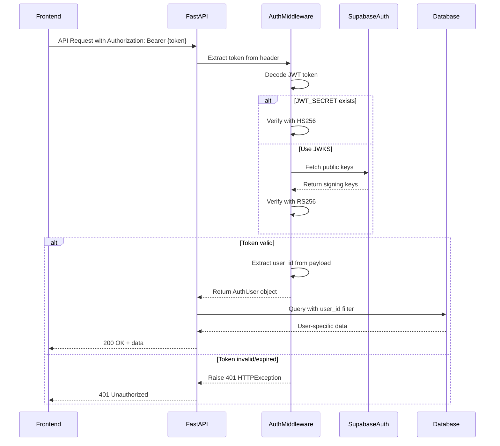

# Fix Authorization Between Frontend and Backend

## Problem Statement

The frontend receives a 401 Unauthorized error when attempting to generate stories through the backend API. Analysis reveals that while authentication middleware exists and the frontend correctly sends JWT tokens, most API endpoints are not protected with authentication requirements.

## Root Cause Analysis

### Current State

The backend has:
- Functional authentication middleware in `src/api/auth.py` with `get_current_user` dependency
- JWT token verification logic (supports both HS256 and RS256 algorithms)
- Two story generation endpoints, only one of which requires authentication

The frontend:
- Correctly sends JWT tokens via Authorization header: `Bearer ${session?.access_token}`
- Uses Supabase authentication with proper session management
- Has auto-refresh token configured in Supabase client

### Identified Issues

1. **Inconsistent Authentication Protection**: Only two endpoints use `get_current_user`:
   - `/generate-story` (line 66)
   - `/stories/generate` (line 232)
   
   All other endpoints lack authentication:
   - Story retrieval endpoints (`/stories/{story_id}`, `/stories`, etc.)
   - Child management endpoints (`/children`, `/children/{child_id}`)
   - Story rating and deletion endpoints

2. **Missing User Context**: Endpoints that do use authentication don't consistently filter data by user:
   - `/stories` returns all stories instead of user-specific stories
   - `/children` returns all children instead of filtering by `user_id`

3. **Security Gap**: Unauthenticated users could potentially:
   - Access stories belonging to other users
   - View all child profiles in the system
   - Modify or delete resources they don't own

## Solution Design

### Strategy

Apply role-based access control (RBAC) with two authentication levels:

1. **Required Authentication**: Endpoints that modify data or access user-specific resources
2. **Optional Authentication**: Public endpoints that may show different content based on authentication status

### Endpoint Protection Matrix

| Endpoint | Current Auth | Target Auth | User Filtering Required |
|----------|-------------|-------------|------------------------|
| POST `/generate-story` | Required | Required | Yes (child ownership) |
| POST `/stories/generate` | Required | Required | Yes (child ownership) |
| GET `/stories/{story_id}` | None | Required | Yes (story ownership) |
| GET `/stories` | None | Required | Yes (user's stories only) |
| GET `/stories/child/{child_name}` | None | Required | Yes (user's stories only) |
| GET `/stories/child-id/{child_id}` | None | Required | Yes (child ownership) |
| GET `/stories/language/{language}` | None | Required | Yes (user's stories only) |
| DELETE `/stories/{story_id}` | None | Required | Yes (story ownership) |
| PUT `/stories/{story_id}/rating` | None | Required | Yes (story ownership) |
| POST `/save-story` | None | Required | Yes (set user_id) |
| POST `/children` | None | Required | Yes (set user_id) |
| GET `/children/{child_id}` | None | Required | Yes (child ownership) |
| GET `/children` | None | Required | Yes (user's children only) |
| DELETE `/children/{child_id}` | None | Required | Yes (child ownership) |

### Authentication Flow

### Data Access Control Rules

#### Story Access Control

| Operation | Rule |
|-----------|------|
| Create Story | Story must be associated with authenticated user's `user_id` |
| Read Story | User can only read stories where `story.user_id == user.user_id` |
| Update Story Rating | User can only rate stories where `story.user_id == user.user_id` |
| Delete Story | User can only delete stories where `story.user_id == user.user_id` |
| List Stories | Filter results by `user_id == user.user_id` |

#### Child Profile Access Control

| Operation | Rule |
|-----------|------|
| Create Child | Child must be associated with authenticated user's `user_id` |
| Read Child | User can only read children where `child.user_id == user.user_id` |
| Update Child | User can only update children where `child.user_id == user.user_id` |
| Delete Child | User can only delete children where `child.user_id == user.user_id` |
| List Children | Filter results by `user_id == user.user_id` |

### Implementation Changes

#### Authentication Middleware Enhancement

No changes required to `src/api/auth.py` - the existing implementation is sufficient.

#### Route Protection Updates

For each endpoint in `src/api/routes.py`:

1. Add `user: AuthUser = Depends(get_current_user)` parameter
2. Filter database queries by `user.user_id`
3. Verify ownership before allowing modifications

#### Repository Layer Enhancement

The `SupabaseClient` methods need to support user-based filtering:

| Method | Enhancement |
|--------|-------------|
| `get_all_stories()` | Add optional `user_id` parameter to filter results |
| `get_stories_by_child()` | Add `user_id` verification |
| `get_stories_by_child_id()` | Add `user_id` verification |
| `get_stories_by_language()` | Add optional `user_id` parameter |
| `get_story()` | Add `user_id` verification |
| `delete_story()` | Add `user_id` verification |
| `update_story_rating()` | Add `user_id` verification |
| `get_all_children()` | Add optional `user_id` parameter to filter results |
| `get_child()` | Add `user_id` verification |
| `delete_child()` | Add `user_id` verification |

### Error Handling Strategy

| Scenario | HTTP Status | Response Detail |
|----------|-------------|-----------------|
| Missing token | 401 | "Authentication required" |
| Invalid token | 401 | "Invalid authentication token" |
| Expired token | 401 | "Token has expired" |
| Resource not found | 404 | "Resource not found" |
| Unauthorized access | 403 | "You don't have permission to access this resource" |
| Resource belongs to another user | 403 | "You don't have permission to access this resource" |

### Frontend Compatibility

No changes required to frontend code - it already:
- Sends JWT tokens in Authorization header
- Handles 401 errors appropriately
- Has auto-refresh token mechanism configured

### Testing Strategy

#### Unit Tests

Test scenarios for each protected endpoint:
- Request with valid token returns user-specific data
- Request with expired token returns 401
- Request with invalid token returns 401
- Request without token returns 401
- Request for resource owned by different user returns 403

#### Integration Tests

- Verify end-to-end story generation flow with authentication
- Verify child profile CRUD operations with user isolation
- Test token refresh workflow
- Verify multiple users cannot access each other's resources

### Database Schema Validation

Verify these columns exist and have proper indexes:

| Table | Column | Type | Index Required |
|-------|--------|------|----------------|
| stories | user_id | UUID | Yes |
| children | user_id | UUID | Yes |

These were added in migration `012_add_user_authentication.sql`.

### Security Considerations

1. **Token Validation**: Use either JWT_SECRET (HS256) or JWKS (RS256) - both methods are supported
2. **Token Expiration**: Rely on Supabase token expiration settings
3. **Token Refresh**: Frontend already handles automatic refresh
4. **CORS Configuration**: Currently allows all origins - maintain for development, restrict in production
5. **User ID Verification**: Always verify resource ownership using `user_id` from authenticated token
6. **SQL Injection**: Use parameterized queries (already handled by Supabase client)

### Configuration Requirements

Environment variables needed (already configured):
- `SUPABASE_URL`: Supabase project URL
- `SUPABASE_JWT_SECRET`: JWT secret for token verification (optional - falls back to JWKS)

### Rollback Plan

If authentication issues arise after implementation:

1. Authentication middleware can be temporarily bypassed by removing `Depends(get_current_user)` from critical endpoints
2. User filtering can be disabled by removing `user_id` filters from queries
3. Original state can be restored from version control

## Implementation Priority

### Phase 1: Critical Endpoints (High Priority)
- Story generation endpoints (already protected)
- Child profile creation endpoint
- Story deletion endpoint

### Phase 2: Data Access Endpoints (Medium Priority)
- Story retrieval endpoints with user filtering
- Children retrieval endpoints with user filtering
- Story rating endpoint

### Phase 3: Testing and Validation (High Priority)
- Add comprehensive tests for all protected endpoints
- Verify user isolation works correctly
- Test token expiration and refresh flows

## Success Criteria

1. All API endpoints require valid JWT authentication
2. Users can only access their own stories and child profiles
3. 401 errors are returned for missing or invalid tokens
4. 403 errors are returned when accessing resources owned by other users
5. Frontend story generation works without 401 errors
6. All existing functionality continues to work with authentication enabled
