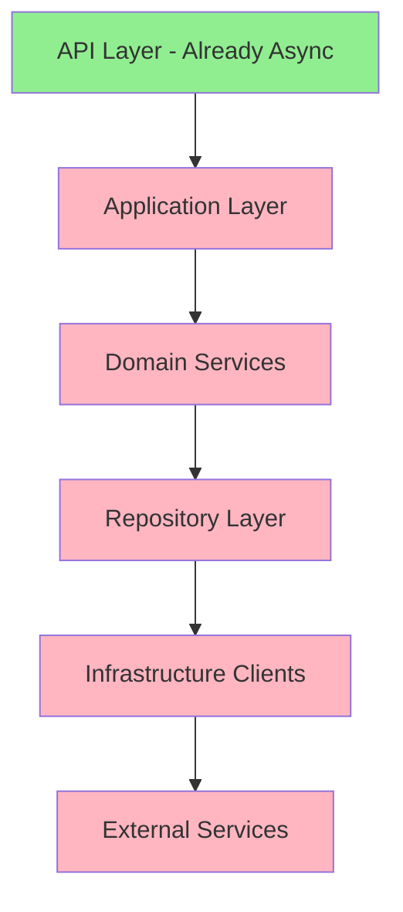
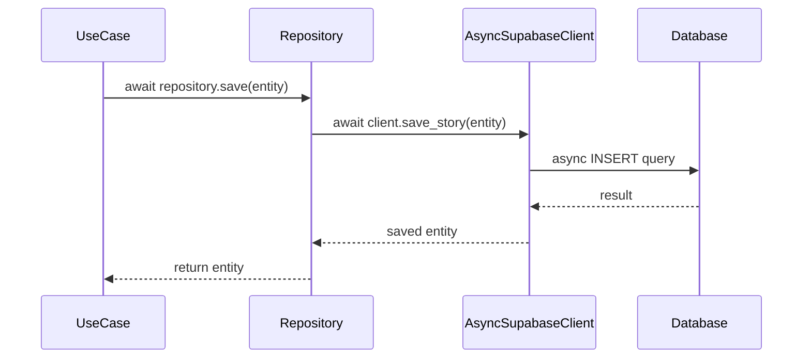
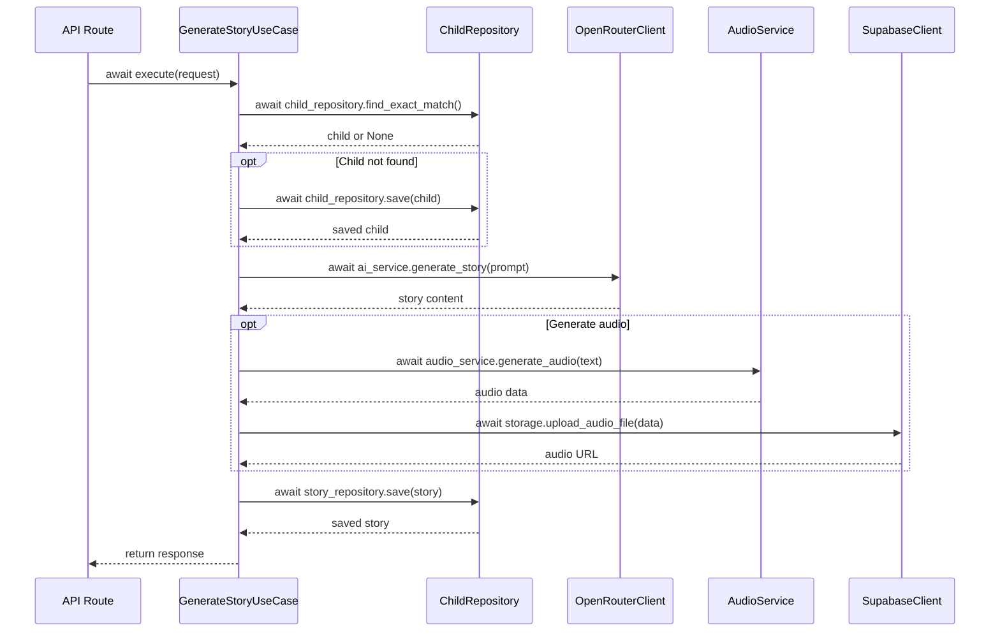
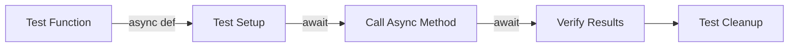

# Backend Asynchronous Transformation Design

## Overview

This design document outlines the comprehensive transformation of the tale-generator backend from a mixed synchronous/asynchronous architecture to a fully asynchronous implementation. The transformation will improve system performance, scalability, and resource utilization by enabling non-blocking I/O operations throughout the application stack.

## Current State Analysis

### Existing Asynchronous Components

The system currently has partial async support:

| Component | Current State | Async Implementation |
|-----------|---------------|---------------------|
| FastAPI Routes | Partial | Some routes use `async def`, but call synchronous clients |
| Database Client (Supabase) | Synchronous | All methods are blocking |
| OpenRouter Client | Synchronous | Uses synchronous OpenAI client with blocking HTTP |
| Voice Providers | Synchronous | ElevenLabs provider uses blocking operations |
| Storage Operations | Synchronous | File upload/download blocks execution |
| Repository Layer | Synchronous | All CRUD operations are blocking |
| Use Cases | Synchronous | Business logic executes synchronously |
| Domain Services | Synchronous | Story, Audio, Prompt services are blocking |

### Key Synchronous Bottlenecks

The following operations currently block execution threads:

1. **Database Operations**: All Supabase queries execute synchronously (children, heroes, stories)
2. **AI Story Generation**: OpenRouter API calls block until completion (can take several seconds)
3. **Audio Generation**: Voice synthesis operations block until audio is generated
4. **File Uploads**: Storage operations to Supabase block during transfer
5. **External API Calls**: Generation info retrieval uses synchronous HTTP

## Design Goals

### Primary Objectives

1. **Full Async Pipeline**: Convert all I/O-bound operations to async/await pattern
2. **Improved Concurrency**: Enable handling multiple requests simultaneously without thread blocking
3. **Better Resource Utilization**: Reduce memory footprint and CPU idle time
4. **Enhanced Performance**: Decrease response times for concurrent requests
5. **Scalability**: Support higher request throughput with the same resources

### Success Criteria

| Metric | Current | Target | Measurement Method |
|--------|---------|--------|--------------------|
| Concurrent Request Handling | Limited (blocking) | High (non-blocking) | Load testing with concurrent users |
| Database Query Latency | Blocks thread | Non-blocking | Query execution time under load |
| Story Generation Time | Single-threaded | Parallel capable | Multiple simultaneous generations |
| Memory Usage | Higher (thread-based) | Lower (async event loop) | Memory profiling |
| Request Throughput | Baseline | 2-3x improvement | Requests per second metrics |

### Non-Goals

- Rewriting business logic or domain rules
- Changing API contracts or response formats
- Modifying database schema or data models
- Altering frontend integration points
- Introducing new features beyond async transformation

## Architecture Transformation

### Layer-by-Layer Approach

The transformation will proceed from infrastructure upward through the application layers:



**Legend**: Green = Already Async, Pink = Needs Transformation

### Transformation Phases

| Phase | Component | Priority | Dependencies | Risk Level |
|-------|-----------|----------|--------------|------------|
| 1 | External Service Clients | High | None | Medium |
| 2 | Repository Implementations | High | Phase 1 | Low |
| 3 | Domain Services | Medium | Phase 2 | Low |
| 4 | Use Cases | Medium | Phase 3 | Low |
| 5 | API Routes Integration | Low | Phase 4 | Low |

## Component Design

### Phase 1: External Service Clients

#### Supabase Client Transformation

**Current Implementation Pattern**:

The current SupabaseClient uses synchronous operations that block on every database call.

**Target Async Pattern**:

All database operations will become asynchronous using the async Supabase client library.

**Key Changes**:

| Operation Category | Current Approach | Async Approach |
|-------------------|------------------|----------------|
| Database Queries | Synchronous select/insert/update/delete | Async await on all operations |
| Connection Management | Blocking connection | Async connection pooling |
| Transaction Handling | Synchronous commits | Async transaction context |
| Error Handling | Synchronous exception handling | Async error propagation |

**Transformation Checklist**:

- Replace `supabase` library with async-compatible alternative or use async wrapper
- Convert all database methods to async functions
- Update connection initialization to async pattern
- Implement async context managers for transactions
- Add async connection pooling configuration

**Methods Requiring Transformation**:

All SupabaseClient methods must become async:

- `save_child` → `async save_child`
- `get_child` → `async get_child`
- `get_all_children` → `async get_all_children`
- `save_hero` → `async save_hero`
- `get_hero` → `async get_hero`
- `get_all_heroes` → `async get_all_heroes`
- `update_hero` → `async update_hero`
- `delete_hero` → `async delete_hero`
- `save_story` → `async save_story`
- `get_story` → `async get_story`
- `get_stories_by_child` → `async get_stories_by_child`
- `get_stories_by_child_id` → `async get_stories_by_child_id`
- `get_all_stories` → `async get_all_stories`
- `update_story` → `async update_story`
- `delete_story` → `async delete_story`
- `rate_story` → `async rate_story`
- `upload_audio_file` → `async upload_audio_file`
- `get_audio_file_url` → `async get_audio_file_url`

**Implementation Strategy**:

Since the official Supabase Python library has limited async support, consider these approaches:

1. **Approach A - HTTPX Direct**: Use httpx async client to call Supabase REST API directly
2. **Approach B - AsyncPG**: For PostgreSQL operations, use asyncpg library directly
3. **Approach C - Thread Pool Wrapper**: Wrap synchronous operations with asyncio.to_thread as interim solution

**Recommended Approach**: Combination of Approach A for REST API operations and Approach B for complex queries.

#### OpenRouter Client Transformation

**Current Implementation Pattern**:

Uses OpenAI SDK synchronously for story generation and httpx synchronously for generation info.

**Target Async Pattern**:

Fully async HTTP operations for all OpenRouter API interactions.

**Key Changes**:

| Method | Current | Async Transformation |
|--------|---------|---------------------|
| `generate_story` | Synchronous OpenAI client | Async OpenAI client or direct httpx |
| `fetch_generation_info` | Synchronous httpx.get | async httpx.AsyncClient |
| Client Initialization | Synchronous | Async with connection pooling |
| Retry Logic | Synchronous sleep | async asyncio.sleep |

**Transformation Details**:

- Replace OpenAI client with AsyncOpenAI
- Use httpx.AsyncClient for all HTTP operations
- Convert retry delay from time.sleep to asyncio.sleep
- Implement async context manager for client lifecycle
- Add connection pooling for improved performance

**Error Handling Considerations**:

- Preserve existing retry logic but make it async
- Maintain exception hierarchy for compatibility
- Add timeout handling for async operations

#### Voice Provider Transformation

**Current State**:

ElevenLabs provider and voice service facade use synchronous operations.

**Target Async Pattern**:

Full async audio generation pipeline.

**Components Requiring Transformation**:

| Component | Current Method | Async Transformation |
|-----------|----------------|---------------------|
| ElevenLabsProvider | `generate_audio` | `async generate_audio` |
| VoiceService | `generate_audio` | `async generate_audio` |
| Provider Registry | Synchronous lookup | Async-compatible (no I/O, minimal change) |
| Audio Upload | Synchronous file I/O | Async file operations |

**Implementation Strategy**:

- Use httpx.AsyncClient for ElevenLabs API calls
- Convert audio generation to async workflow
- Implement async streaming for large audio files
- Update provider interface to async protocol

### Phase 2: Repository Layer

#### Repository Interface Updates

All repository interfaces must be updated to async:

**Base Repository Interface**:

Every CRUD method signature changes:

- `save(entity)` → `async save(entity)`
- `find_by_id(id)` → `async find_by_id(id)`
- `find_all()` → `async find_all()`
- `update(entity)` → `async update(entity)`
- `delete(id)` → `async delete(id)`

**Specific Repository Updates**:

| Repository | Methods to Transform | Complexity |
|------------|---------------------|------------|
| ChildRepository | save, find_by_id, find_exact_match, find_all | Low |
| HeroRepository | save, find_by_id, find_by_language, find_all, update, delete | Low |
| StoryRepository | save, find_by_id, find_by_child_id, find_by_language, find_all, update, delete, rate | Medium |

**Implementation Pattern**:

Repositories will delegate to the async SupabaseClient:



### Phase 3: Domain Services

#### Service Transformation

Domain services orchestrate business logic and will become async when they interact with repositories:

**StoryService**:

| Method | Current | Async Status | Reason |
|--------|---------|--------------|--------|
| `create_story` | Synchronous | **Remains Sync** | Pure business logic, no I/O |
| `extract_title_from_content` | Synchronous | **Remains Sync** | String processing only |
| `attach_audio_to_story` | Synchronous | **Remains Sync** | Entity mutation only |
| `rate_story` | Synchronous | **Remains Sync** | Entity mutation only |
| `validate_story_request` | Synchronous | **Remains Sync** | Validation logic only |

**Note**: StoryService methods remain synchronous as they contain no I/O operations. They manipulate domain entities in memory.

**AudioService**:

| Method | Transformation | Reason |
|--------|---------------|--------|
| `generate_audio` | → `async generate_audio` | Calls async voice providers |
| `validate_audio_request` | Remains sync | Pure validation |

**PromptService**:

| Method | Transformation | Reason |
|--------|---------------|--------|
| `generate_child_prompt` | Remains sync | String formatting only |
| `generate_hero_prompt` | Remains sync | String formatting only |
| `generate_combined_prompt` | Remains sync | String formatting only |

**Pattern**: Services become async only when they directly invoke I/O operations or call async dependencies.

### Phase 4: Application Layer (Use Cases)

#### Use Case Transformation

Use cases orchestrate the entire workflow and must become async to await on repositories and services:

**GenerateStoryUseCase**:

**Current Signature**:
```
def execute(request: StoryRequestDTO) -> StoryResponseDTO
```

**Async Signature**:
```
async def execute(request: StoryRequestDTO) -> StoryResponseDTO
```

**Internal Method Transformations**:

| Method | Current | Async Transformation | Reason |
|--------|---------|---------------------|--------|
| `_get_or_create_child` | Sync | `async _get_or_create_child` | Calls async repository |
| `_generate_and_upload_audio` | Sync | `async _generate_and_upload_audio` | Calls async audio service |

**Execution Flow Changes**:



**Other Use Cases**:

All use cases in the application layer must follow the same pattern:

| Use Case | Methods to Transform | Impact |
|----------|---------------------|--------|
| CreateChildUseCase | execute | Calls async repository |
| UpdateChildUseCase | execute | Calls async repository |
| DeleteChildUseCase | execute | Calls async repository |
| ListChildrenUseCase | execute | Calls async repository |
| CreateHeroUseCase | execute | Calls async repository |
| UpdateHeroUseCase | execute | Calls async repository |
| DeleteHeroUseCase | execute | Calls async repository |
| ListHeroesUseCase | execute | Calls async repository |
| GetStoryUseCase | execute | Calls async repository |
| ListStoriesUseCase | execute | Calls async repository |
| RateStoryUseCase | execute | Calls async repository |
| DeleteStoryUseCase | execute | Calls async repository |

### Phase 5: API Routes Integration

#### Route Handler Updates

**Current State**:

API routes are already declared as `async def` but call synchronous clients directly.

**Required Changes**:

Add `await` keywords when calling async dependencies:

**Before Pattern**:
```
async def generate_story(request: StoryRequest):
    child = supabase_client.get_child(id)  # Blocking call in async context!
    result = openrouter_client.generate_story(prompt)  # Blocking!
    return response
```

**After Pattern**:
```
async def generate_story(request: StoryRequest):
    child = await supabase_client.get_child(id)  # Non-blocking
    result = await openrouter_client.generate_story(prompt)  # Non-blocking
    return response
```

**Routes Requiring Updates**:

| Route | Path | Async Changes |
|-------|------|---------------|
| Generate Story (Legacy) | POST /api/v1/generate-story | Add await to all client calls |
| Generate Story (New) | POST /api/v1/stories/generate | Add await to all client calls |

**Dependency Injection Considerations**:

Async clients will require async initialization:

- Client initialization in route module may need async factory
- Consider using FastAPI lifespan events for async setup
- Connection pools should be initialized once at startup

## Implementation Strategy

### Migration Approach

**Big Bang vs Incremental**:

Given the tightly coupled nature of the async transformation, a **coordinated big bang** approach is recommended:

**Rationale**:
- Async/sync mixing adds complexity and technical debt
- Partial transformation provides limited benefits
- Complete transformation enables full async advantages
- Testing is easier with complete transformation

### Development Steps

#### Step 1: External Clients Foundation

**Duration Estimate**: 2-3 days

**Tasks**:

1. Create async version of SupabaseClient
   - Implement async connection management
   - Convert all database methods to async
   - Add async connection pooling
   - Test all database operations

2. Transform OpenRouterClient to async
   - Replace with AsyncOpenAI client
   - Convert HTTP operations to async
   - Update retry logic with asyncio.sleep
   - Test story generation

3. Update Voice Providers to async
   - Transform ElevenLabsProvider to async
   - Update VoiceService facade
   - Test audio generation pipeline

**Validation**:
- Unit tests for each client method
- Integration tests with actual services
- Performance benchmarks vs synchronous version

#### Step 2: Repository Layer

**Duration Estimate**: 1-2 days

**Tasks**:

1. Update repository interfaces
   - Add async to all abstract methods
   - Update type hints for async returns

2. Update repository implementations
   - Convert all methods to async
   - Add await for SupabaseClient calls
   - Update error handling for async context

**Validation**:
- Repository unit tests with mocked async client
- Integration tests with real database

#### Step 3: Domain Services

**Duration Estimate**: 1 day

**Tasks**:

1. Transform AudioService
   - Convert generate_audio to async
   - Update voice provider interactions

2. Keep other services synchronous
   - StoryService remains sync (no I/O)
   - PromptService remains sync (no I/O)

**Validation**:
- Unit tests for async audio generation
- Verify sync services still work correctly

#### Step 4: Use Cases

**Duration Estimate**: 2 days

**Tasks**:

1. Transform GenerateStoryUseCase
   - Convert execute to async
   - Add await for repository calls
   - Add await for AI service calls
   - Add await for audio generation

2. Transform all other use cases
   - Convert each execute method to async
   - Add await for all I/O operations

**Validation**:
- Use case unit tests with mocked async dependencies
- Integration tests for complete workflows

#### Step 5: API Integration

**Duration Estimate**: 1 day

**Tasks**:

1. Update route handlers
   - Add await keywords for all async calls
   - Update client initialization to async

2. Configure async application startup
   - Implement async lifespan for client initialization
   - Configure async connection pools

**Validation**:
- End-to-end API tests
- Load testing with concurrent requests
- Performance benchmarking

### Rollout Strategy

#### Pre-Deployment Validation

| Test Category | Description | Success Criteria |
|---------------|-------------|------------------|
| Unit Tests | All transformed components pass tests | 100% pass rate |
| Integration Tests | Cross-component async workflows work | No errors in test suite |
| Load Testing | System handles concurrent requests | No blocking, improved throughput |
| Performance Testing | Response times under load | Equal or better than sync version |

#### Deployment Plan

**Phase A: Development Environment**
- Deploy fully async version
- Run integration test suite
- Perform manual testing
- Monitor for async-related issues

**Phase B: Staging Environment**
- Deploy to staging
- Run full test suite
- Conduct load testing
- Monitor performance metrics
- Validate with sample production data

**Phase C: Production Deployment**
- Schedule maintenance window if needed
- Deploy async version
- Monitor application logs
- Watch performance metrics
- Have rollback plan ready

**Rollback Criteria**:
- Critical errors in production
- Performance degradation beyond acceptable threshold
- Database connection issues
- External service integration failures

## Technical Specifications

### Dependencies

#### New Libraries Required

| Library | Version | Purpose | Justification |
|---------|---------|---------|---------------|
| httpx | ≥0.27.0 | Async HTTP client | Replace synchronous HTTP, already in use |
| asyncpg | ≥0.29.0 | Async PostgreSQL driver | Direct async database access |
| openai | ≥1.54.0 | Already supports async | Use AsyncOpenAI instead of OpenAI |
| aiofiles | ≥24.0.0 | Async file operations | Audio file handling |

#### Existing Dependencies to Update

No version changes required for existing dependencies. The transformation uses capabilities already available in current libraries.

### Configuration Changes

#### Connection Pooling Configuration

**Database Connection Pool**:

New environment variables for async connection management:

| Variable | Default | Description |
|----------|---------|-------------|
| DB_POOL_MIN_SIZE | 10 | Minimum connections in pool |
| DB_POOL_MAX_SIZE | 50 | Maximum connections in pool |
| DB_POOL_TIMEOUT | 30 | Connection acquisition timeout (seconds) |

**HTTP Connection Pool**:

| Variable | Default | Description |
|----------|---------|-------------|
| HTTP_POOL_CONNECTIONS | 100 | Maximum parallel connections |
| HTTP_POOL_MAX_KEEPALIVE | 20 | Maximum keepalive connections |
| HTTP_TIMEOUT | 60 | Request timeout (seconds) |

### Error Handling

#### Async-Specific Error Scenarios

**Timeout Handling**:

All async operations must implement timeouts to prevent indefinite hanging:

| Operation Type | Timeout Strategy |
|----------------|------------------|
| Database Queries | Per-query timeout with asyncio.wait_for |
| AI Generation | Longer timeout for generation, shorter for API calls |
| Audio Generation | Variable timeout based on text length |
| File Upload | Timeout based on file size |

**Cancellation Handling**:

Async operations may be cancelled:

- Implement graceful cancellation in long-running operations
- Clean up resources on cancellation
- Log cancellation events for debugging

**Connection Pool Exhaustion**:

- Return meaningful error when pool is exhausted
- Implement connection pool monitoring
- Add metrics for pool utilization

### Performance Considerations

#### Expected Performance Improvements

| Scenario | Current Behavior | Async Behavior | Expected Improvement |
|----------|------------------|----------------|---------------------|
| Single Request | Fast | Similar | Minimal change |
| 10 Concurrent Requests | Serialized, slow | Parallel | 5-10x faster |
| 50 Concurrent Requests | Very slow/errors | Handles well | 10-20x faster |
| Mixed I/O Operations | Sequential blocking | Concurrent | 3-5x faster |

#### Resource Utilization

**Memory**:
- Lower memory footprint per request (no thread stack)
- More efficient memory usage under load
- Better garbage collection behavior

**CPU**:
- Lower CPU usage during I/O wait
- Better CPU utilization under concurrent load
- Event loop overhead is minimal

**Network**:
- Connection reuse through pooling
- Reduced connection overhead
- Better handling of slow network conditions

## Testing Strategy

### Unit Testing

#### Async Test Framework

Use pytest-asyncio for testing async code:

**Test Pattern for Async Methods**:

All async methods require async test functions with await:



#### Mocking Async Dependencies

**Mock Strategy**:

| Component | Mocking Approach |
|-----------|------------------|
| Async Database Client | Mock with AsyncMock returning coroutines |
| Async HTTP Client | Use aioresponses library for httpx mocking |
| Async File Operations | Mock aiofiles operations |
| Async External Services | AsyncMock with controlled responses |

### Integration Testing

#### Database Integration Tests

**Test Scenarios**:

- Async CRUD operations for all entities
- Concurrent database operations
- Transaction handling in async context
- Connection pool behavior under load
- Error recovery and retry logic

#### External Service Integration Tests

**Test Scenarios**:

- Async story generation with OpenRouter
- Async audio generation with ElevenLabs
- Concurrent API calls to external services
- Timeout and error handling
- Retry logic under failures

### Performance Testing

#### Load Testing Scenarios

| Test Name | Description | Concurrent Users | Duration | Success Criteria |
|-----------|-------------|------------------|----------|------------------|
| Baseline Load | Normal operation | 10 | 5 min | No errors, stable response time |
| High Load | Stress test | 50 | 10 min | <5% error rate, acceptable response time |
| Spike Test | Sudden traffic spike | 10→100→10 | 5 min | System recovers, no crashes |
| Sustained Load | Long-running test | 25 | 30 min | Stable performance, no memory leaks |

#### Performance Metrics to Collect

**Response Time Metrics**:
- Average response time
- 95th percentile response time
- 99th percentile response time
- Maximum response time

**Throughput Metrics**:
- Requests per second
- Concurrent request handling capacity
- Request queue length

**Resource Metrics**:
- CPU utilization percentage
- Memory usage (RSS, heap)
- Database connection pool utilization
- HTTP connection pool utilization

## Monitoring and Observability

### Async-Specific Metrics

#### Event Loop Monitoring

| Metric | Description | Alert Threshold |
|--------|-------------|----------------|
| Event Loop Lag | Time between iterations | >100ms |
| Pending Tasks | Number of queued tasks | >1000 |
| Blocked Event Loop | Synchronous operations blocking loop | >50ms block |

#### Connection Pool Metrics

| Metric | Description | Alert Threshold |
|--------|-------------|----------------|
| Active Connections | Current connections in use | >80% of max |
| Pool Wait Time | Time waiting for available connection | >1 second |
| Connection Errors | Failed connection attempts | >5% error rate |

### Logging Enhancements

#### Async Context Logging

Enhance logging to track async operations:

**Additional Log Fields**:

| Field | Description | Example |
|-------|-------------|----------|
| task_id | Unique async task identifier | task-abc123 |
| coroutine_name | Name of executing coroutine | generate_story_async |
| await_time | Time spent awaiting | 1.234s |
| concurrent_tasks | Number of concurrent tasks | 15 |

## Migration Checklist

### Pre-Migration Tasks

- [ ] Review all synchronous I/O operations
- [ ] Identify dependencies needing async versions
- [ ] Set up async testing framework (pytest-asyncio)
- [ ] Create performance baseline metrics
- [ ] Document current behavior for comparison
- [ ] Prepare rollback plan

### Phase 1: External Clients

- [ ] Transform SupabaseClient to async
  - [ ] Implement async connection management
  - [ ] Convert all query methods to async
  - [ ] Add connection pooling
  - [ ] Write unit tests
  - [ ] Write integration tests
- [ ] Transform OpenRouterClient to async
  - [ ] Switch to AsyncOpenAI client
  - [ ] Convert HTTP calls to async
  - [ ] Update retry logic
  - [ ] Write tests
- [ ] Transform Voice Providers to async
  - [ ] Update ElevenLabsProvider
  - [ ] Update VoiceService facade
  - [ ] Write tests

### Phase 2: Repository Layer

- [ ] Update repository interfaces to async
  - [ ] BaseRepository interface
  - [ ] ChildRepository interface
  - [ ] HeroRepository interface
  - [ ] StoryRepository interface
- [ ] Update repository implementations
  - [ ] ChildRepository implementation
  - [ ] HeroRepository implementation
  - [ ] StoryRepository implementation
- [ ] Write repository tests
  - [ ] Unit tests with mocked client
  - [ ] Integration tests with database

### Phase 3: Domain Services

- [ ] Transform AudioService to async
  - [ ] Update generate_audio method
  - [ ] Write tests
- [ ] Verify other services remain sync
  - [ ] StoryService (no changes)
  - [ ] PromptService (no changes)

### Phase 4: Use Cases

- [ ] Transform GenerateStoryUseCase
  - [ ] Convert execute to async
  - [ ] Update all internal async calls
  - [ ] Write tests
- [ ] Transform child management use cases
  - [ ] CreateChildUseCase
  - [ ] UpdateChildUseCase
  - [ ] DeleteChildUseCase
  - [ ] ListChildrenUseCase
- [ ] Transform hero management use cases
  - [ ] CreateHeroUseCase
  - [ ] UpdateHeroUseCase
  - [ ] DeleteHeroUseCase
  - [ ] ListHeroesUseCase
- [ ] Transform story management use cases
  - [ ] GetStoryUseCase
  - [ ] ListStoriesUseCase
  - [ ] RateStoryUseCase
  - [ ] DeleteStoryUseCase

### Phase 5: API Integration

- [ ] Update API route handlers
  - [ ] Add await to all async calls in generate-story endpoint
  - [ ] Add await to all async calls in stories/generate endpoint
- [ ] Configure async application startup
  - [ ] Implement async lifespan events
  - [ ] Initialize async clients on startup
  - [ ] Configure connection pools
- [ ] Update dependency injection
  - [ ] Ensure async client injection
  - [ ] Update FastAPI dependencies

### Testing and Validation

- [ ] Run complete unit test suite
- [ ] Run complete integration test suite
- [ ] Perform load testing
  - [ ] Baseline load test
  - [ ] High load test
  - [ ] Spike test
  - [ ] Sustained load test
- [ ] Compare performance metrics
  - [ ] Response times
  - [ ] Throughput
  - [ ] Resource utilization
- [ ] Validate error handling
- [ ] Test timeout scenarios
- [ ] Test connection pool behavior

### Deployment

- [ ] Deploy to development environment
- [ ] Validate in development
- [ ] Deploy to staging environment
- [ ] Run staging validation tests
- [ ] Prepare production deployment plan
- [ ] Deploy to production
- [ ] Monitor production metrics
- [ ] Validate production behavior

### Post-Migration

- [ ] Document async patterns used
- [ ] Update developer documentation
- [ ] Create async coding guidelines
- [ ] Remove old synchronous code
- [ ] Archive synchronous implementation
- [ ] Update README with async information

## Risk Management

### Identified Risks

| Risk | Probability | Impact | Mitigation Strategy |
|------|-------------|--------|--------------------|
| Supabase library lacks full async support | High | High | Use direct httpx or asyncpg as fallback |
| Performance regression in certain scenarios | Medium | High | Comprehensive performance testing before deployment |
| Async debugging complexity | Medium | Medium | Enhanced logging, async-aware debugging tools |
| Connection pool exhaustion | Low | High | Proper pool sizing, monitoring, alerts |
| Event loop blocking | Medium | Medium | Code review to identify blocking operations |
| Third-party async compatibility issues | Low | Medium | Wrapper implementations where needed |

### Rollback Plan

**Trigger Conditions**:
- Critical production errors not resolvable within 2 hours
- Performance degradation >30% compared to baseline
- Database connection failures
- External service integration breaking

**Rollback Steps**:
1. Stop accepting new traffic (maintenance mode)
2. Revert to previous synchronous deployment
3. Verify service restoration
4. Resume traffic
5. Analyze failure cause
6. Plan remediation

## Success Metrics

### Quantitative Metrics

| Metric | Baseline (Current) | Target (Post-Async) | Measurement Period |
|--------|-------------------|---------------------|--------------------|
| Average Response Time (single request) | Baseline | ≤ Baseline | First week |
| Average Response Time (10 concurrent) | Baseline | ≤50% of baseline | First week |
| Requests per Second | Baseline | ≥2x baseline | First week |
| Memory Usage per Request | Baseline | ≤80% of baseline | First week |
| CPU Utilization (under load) | Baseline | ≤70% of baseline | First week |
| Error Rate | <1% | <1% | Ongoing |
| 95th Percentile Response Time | Baseline | ≤60% of baseline | First week |

### Qualitative Metrics

- Code maintainability improved through consistent async patterns
- Developer experience improved with modern async/await syntax
- System reliability maintained or improved
- Monitoring and observability enhanced for async operations

## Conclusion

This design outlines a comprehensive transformation of the tale-generator backend to a fully asynchronous architecture. The phased approach ensures systematic migration from infrastructure through application layers, with each phase building on the previous one.

The transformation will yield significant performance improvements under concurrent load while maintaining code quality and system reliability. The detailed implementation plan, testing strategy, and risk management approach ensure a smooth transition with minimal disruption to users.

**Estimated Total Duration**: 7-10 days

**Primary Benefits**:
- Improved concurrent request handling
- Better resource utilization
- Enhanced scalability
- Modern, maintainable codebase
- Foundation for future async features