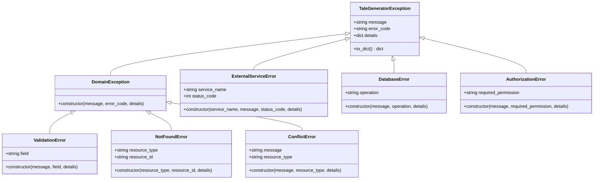

# API Reference

<cite>
**Referenced Files in This Document**
- [src/api/routes.py](file://src/api/routes.py)
- [src/application/dto.py](file://src/application/dto.py)
- [src/core/exceptions.py](file://src/core/exceptions.py)
- [src/models.py](file://src/models.py)
- [main.py](file://main.py)
- [README.md](file://README.md)
</cite>

## Table of Contents
1. [Introduction](#introduction)
2. [API Overview](#api-overview)
3. [Authentication](#authentication)
4. [Error Handling](#error-handling)
5. [Story Generation Endpoints](#story-generation-endpoints)
6. [Story Management Endpoints](#story-management-endpoints)
7. [Child Management Endpoints](#child-management-endpoints)
8. [Request/Response Schemas](#requestresponse-schemas)
9. [Common Use Cases](#common-use-cases)
10. [Rate Limiting](#rate-limiting)

## Introduction

The Tale Generator API is a RESTful service built with FastAPI for generating personalized children's bedtime stories using AI. The API provides comprehensive endpoints for story generation, management, and child profile administration.

### Key Features
- **Personalized Story Generation**: Create bedtime stories tailored to individual children's profiles
- **Multi-Language Support**: Generate stories in English and Russian
- **Audio Integration**: Optional audio narration generation
- **Story Rating System**: Rate stories on a 1-10 scale
- **Persistent Storage**: Stories and child profiles stored in Supabase database
- **Admin Interface**: Web-based administration panel for managing content

## API Overview

### Base URL
```
http://localhost:8000/api/v1
```

### Content Types
- **Request**: `application/json`
- **Response**: `application/json`

### Versioning
- **Current Version**: v1.0 (no versioning currently implemented)
- **URL Prefix**: `/api/v1`

### CORS Configuration
The API allows cross-origin requests from any origin with credentials enabled.

**Section sources**
- [main.py](file://main.py#L18-L35)

## Authentication

**No authentication is currently implemented** for the Tale Generator API. All endpoints are publicly accessible.

### Future Considerations
Rate limiting may be added in future versions to prevent abuse and ensure fair usage.

## Error Handling

The API uses HTTP status codes and structured error responses for error handling.

### Standard Error Response Schema
```json
{
  "error": "ERROR_CODE",
  "message": "Human-readable error description",
  "details": {
    // Additional error context
  }
}
```

### HTTP Status Codes

| Status Code | Description | Usage |
|-------------|-------------|-------|
| 200 | OK | Successful request |
| 400 | Bad Request | Invalid request parameters |
| 404 | Not Found | Resource not found |
| 500 | Internal Server Error | Server-side error |

### Exception Hierarchy

The API uses a comprehensive exception hierarchy defined in [`src/core/exceptions.py`](file://src/core/exceptions.py):



**Diagram sources**
- [src/core/exceptions.py](file://src/core/exceptions.py#L6-L237)

**Section sources**
- [src/core/exceptions.py](file://src/core/exceptions.py#L1-L237)

## Story Generation Endpoints

### Generate Story

Creates a personalized bedtime story for a child.

**Endpoint**: `POST /generate-story`

**Request Schema**:
```json
{
  "child": {
    "name": "string",
    "age": integer,
    "gender": "male" | "female" | "other",
    "interests": ["string", ...]
  },
  "moral": "kindness" | "honesty" | "bravery" | "friendship" | "perseverance" | "empathy" | "respect" | "responsibility",
  "custom_moral": "string",
  "language": "en" | "ru",
  "story_length": integer,
  "generate_audio": boolean,
  "voice_provider": "string",
  "voice_options": {
    "key": "value"
  }
}
```

**Response Schema**:
```json
{
  "title": "string",
  "content": "string",
  "moral": "string",
  "language": "en" | "ru",
  "story_length": integer,
  "audio_file_url": "string"
}
```

**Example Request**:
```bash
curl -X POST "http://localhost:8000/api/v1/generate-story" \
  -H "Content-Type: application/json" \
  -d '{
    "child": {
      "name": "Emma",
      "age": 7,
      "gender": "female",
      "interests": ["unicorns", "fairies", "princesses"]
    },
    "moral": "kindness",
    "language": "en",
    "story_length": 5,
    "generate_audio": false
  }'
```

**Example Response**:
```json
{
  "title": "Emma and the Magic Garden",
  "content": "Once upon a time, in a small village surrounded by lush forests...",
  "moral": "kindness",
  "language": "en",
  "story_length": 5,
  "audio_file_url": null
}
```

**Validation Rules**:
- **Child Profile**: Name required, age between 1-18, at least one interest
- **Moral Values**: Must be one of predefined morals or custom string
- **Language**: Must be "en" or "ru"
- **Story Length**: Optional, defaults to 5 minutes, max 30 minutes
- **Audio Generation**: Optional boolean flag

**Section sources**
- [src/api/routes.py](file://src/api/routes.py#L56-L216)
- [src/application/dto.py](file://src/application/dto.py#L18-L45)

## Story Management Endpoints

### Get All Stories

Retrieves all stories in the database.

**Endpoint**: `GET /stories`

**Response Schema**:
```json
[
  {
    "id": "string",
    "title": "string",
    "content": "string",
    "moral": "string",
    "language": "en" | "ru",
    "child_id": "string",
    "child_name": "string",
    "child_age": integer,
    "child_gender": "male" | "female" | "other",
    "child_interests": ["string", ...],
    "story_length": integer,
    "rating": integer,
    "audio_file_url": "string",
    "audio_provider": "string",
    "model_used": "string",
    "created_at": "string",
    "updated_at": "string"
  }
]
```

### Get Story by ID

Retrieves a specific story by its unique identifier.

**Endpoint**: `GET /stories/{story_id}`

**Path Parameters**:
- `story_id` (string): Unique story identifier

**Response Schema**: Same as above

### Rate Story

Rates a story with a score from 1 to 10.

**Endpoint**: `PUT /stories/{story_id}/rating`

**Path Parameters**:
- `story_id` (string): Unique story identifier

**Request Schema**:
```json
{
  "rating": integer
}
```

**Response Schema**: Updated story object with new rating

### Get Stories by Child Name

Retrieves all stories for a specific child by name.

**Endpoint**: `GET /stories/child/{child_name}`

**Path Parameters**:
- `child_name` (string): Child's name

**Response Schema**: Array of story objects

### Get Stories by Child ID

Retrieves all stories for a specific child by ID.

**Endpoint**: `GET /stories/child-id/{child_id}`

**Path Parameters**:
- `child_id` (string): Child's unique identifier

**Response Schema**: Array of story objects

### Get Stories by Language

Retrieves all stories in a specific language.

**Endpoint**: `GET /stories/language/{language}`

**Path Parameters**:
- `language` (string): Language code ("en" or "ru")

**Response Schema**: Array of story objects

### Delete Story

Deletes a story by its ID.

**Endpoint**: `DELETE /stories/{story_id}`

**Path Parameters**:
- `story_id` (string): Unique story identifier

**Response Schema**:
```json
{
  "message": "Story deleted successfully"
}
```

**Section sources**
- [src/api/routes.py](file://src/api/routes.py#L250-L434)

## Child Management Endpoints

### Create Child Profile

Creates a new child profile.

**Endpoint**: `POST /children`

**Request Schema**:
```json
{
  "name": "string",
  "age": integer,
  "gender": "male" | "female" | "other",
  "interests": ["string", ...]
}
```

**Response Schema**:
```json
{
  "id": "string",
  "name": "string",
  "age": integer,
  "gender": "male" | "female" | "other",
  "interests": ["string", ...],
  "created_at": "string",
  "updated_at": "string"
}
```

### Get Child by ID

Retrieves a child profile by ID.

**Endpoint**: `GET /children/{child_id}`

**Path Parameters**:
- `child_id` (string): Child's unique identifier

**Response Schema**: Child profile object

### Get Children by Name

Retrieves all children with a specific name.

**Endpoint**: `GET /children/name/{name}`

**Path Parameters**:
- `name` (string): Child's name

**Response Schema**: Array of child profile objects

### Get All Children

Retrieves all child profiles.

**Endpoint**: `GET /children`

**Response Schema**: Array of child profile objects

### Delete Child

Deletes a child profile by ID.

**Endpoint**: `DELETE /children/{child_id}`

**Path Parameters**:
- `child_id` (string): Child's unique identifier

**Response Schema**:
```json
{
  "message": "Child deleted successfully"
}
```

**Section sources**
- [src/api/routes.py](file://src/api/routes.py#L437-L570)

## Request/Response Schemas

### Core Data Types

#### ChildProfile
Represents a child's profile for story generation.

| Field | Type | Required | Description |
|-------|------|----------|-------------|
| name | string | Yes | Child's name |
| age | integer | Yes | Child's age (1-18) |
| gender | Gender | Yes | Child's gender |
| interests | array[string] | Yes | Child's interests (min 1) |

#### StoryMoral
Predefined moral values for stories.

| Value | Description |
|-------|-------------|
| kindness | Acts of kindness and compassion |
| honesty | Truthfulness and integrity |
| bravery | Courage and facing fears |
| friendship | Building and maintaining friendships |
| perseverance | Persistence and determination |
| empathy | Understanding others' feelings |
| respect | Valuing others and traditions |
| responsibility | Accountability and duty |

#### Language
Supported languages for story generation.

| Value | Description |
|-------|-------------|
| en | English |
| ru | Russian |

### Story Request Schema

Combines child profile, moral selection, and generation preferences.

| Field | Type | Default | Description |
|-------|------|---------|-------------|
| child | ChildProfile | Required | Child's profile |
| moral | StoryMoral | null | Predefined moral value |
| custom_moral | string | null | Custom moral value |
| language | Language | "en" | Story language |
| story_length | integer | 5 | Story length in minutes (1-30) |
| generate_audio | boolean | false | Generate audio narration |
| voice_provider | string | null | Voice provider name |
| voice_options | object | null | Voice provider configuration |

### Story Response Schema

Contains the generated story and metadata.

| Field | Type | Description |
|-------|------|-------------|
| title | string | Story title |
| content | string | Complete story text |
| moral | string | Moral value used |
| language | Language | Story language |
| story_length | integer | Story length in minutes |
| audio_file_url | string | Audio file URL (if generated) |

### Error Response Schema

Standardized error responses across all endpoints.

| Field | Type | Description |
|-------|------|-------------|
| error | string | Machine-readable error code |
| message | string | Human-readable error description |
| details | object | Additional error context |

**Section sources**
- [src/models.py](file://src/models.py#L1-117)
- [src/application/dto.py](file://src/application/dto.py#L1-123)

## Common Use Cases

### 1. Generate a Personalized Story

**Scenario**: A parent wants to generate a bedtime story for their 7-year-old daughter who loves unicorns and princesses.

**Request**:
```bash
curl -X POST "http://localhost:8000/api/v1/generate-story" \
  -H "Content-Type: application/json" \
  -d '{
    "child": {
      "name": "Sophia",
      "age": 7,
      "gender": "female",
      "interests": ["unicorns", "princesses", "magic"]
    },
    "moral": "kindness",
    "language": "en",
    "story_length": 7,
    "generate_audio": true,
    "voice_provider": "elevenlabs"
  }'
```

**Response**:
```json
{
  "title": "Sophia and the Enchanted Unicorn",
  "content": "In a magical forest filled with sparkling flowers...",
  "moral": "kindness",
  "language": "en",
  "story_length": 7,
  "audio_file_url": "https://storage.supabase.io/v1/object/public/stories/audio/uuid.mp3"
}
```

### 2. Manage Child Profiles

**Scenario**: Creating a new child profile for a 5-year-old boy.

**Request**:
```bash
curl -X POST "http://localhost:8000/api/v1/children" \
  -H "Content-Type: application/json" \
  -d '{
    "name": "Liam",
    "age": 5,
    "gender": "male",
    "interests": ["dinosaurs", "space", "robots"]
  }'
```

### 3. Story Rating System

**Scenario**: Rating a previously generated story.

**Request**:
```bash
curl -X PUT "http://localhost:8000/api/v1/stories/story-123/rating" \
  -H "Content-Type: application/json" \
  -d '{
    "rating": 9
  }'
```

### 4. Retrieve Stories by Child

**Scenario**: Getting all stories for a specific child.

**Request**:
```bash
curl -X GET "http://localhost:8000/api/v1/stories/child/Sophia"
```

### 5. Multi-Language Support

**Scenario**: Generating a story in Russian for a bilingual child.

**Request**:
```bash
curl -X POST "http://localhost:8000/api/v1/generate-story" \
  -H "Content-Type: application/json" \
  -d '{
    "child": {
      "name": "Иван",
      "age": 6,
      "gender": "male",
      "interests": ["волшебство", "приключения", "друзья"]
    },
    "moral": "дружба",
    "language": "ru",
    "story_length": 5
  }'
```

## Rate Limiting

**Currently Implemented**: No rate limiting

**Future Implementation**: Rate limiting may be added to prevent abuse and ensure fair usage across all endpoints.

### Recommended Practices
- Implement client-side caching for frequently accessed data
- Use appropriate story lengths to balance quality and API usage
- Monitor response times and implement retry logic for transient failures

**Section sources**
- [README.md](file://README.md#L113-L136)