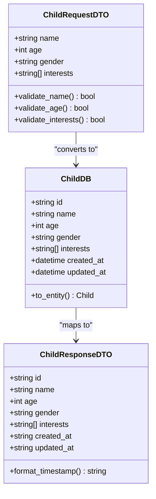
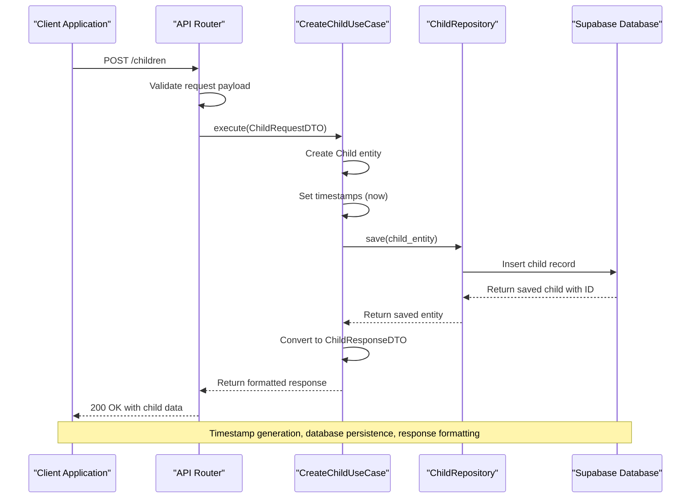
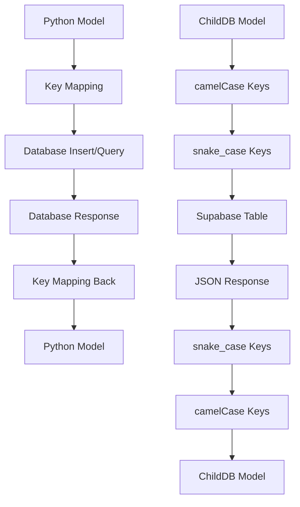
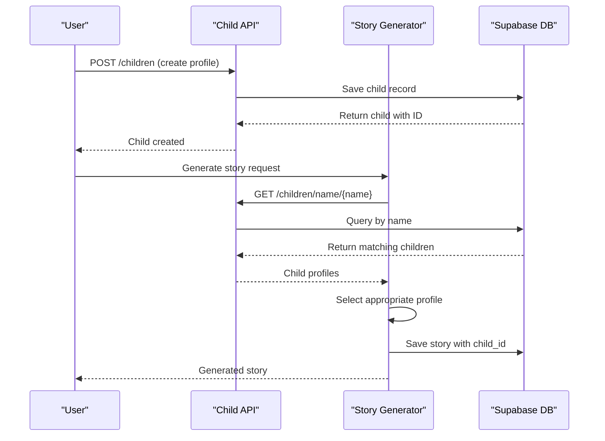

# Child Management API Documentation

<cite>
**Referenced Files in This Document**
- [routes.py](file://src/api/routes.py)
- [dto.py](file://src/application/dto.py)
- [entities.py](file://src/domain/entities.py)
- [child_repository.py](file://src/domain/repositories/child_repository.py)
- [manage_children.py](file://src/application/use_cases/manage_children.py)
- [models.py](file://src/models.py)
- [supabase_client.py](file://src/supabase_client.py)
- [exceptions.py](file://src/core/exceptions.py)
- [test_children.py](file://test_children.py)
- [test_populate_children.py](file://test_populate_children.py)
</cite>

## Table of Contents
1. [Introduction](#introduction)
2. [API Endpoints Overview](#api-endpoints-overview)
3. [Data Models](#data-models)
4. [Child Creation Workflow](#child-creation-workflow)
5. [Endpoint Specifications](#endpoint-specifications)
6. [Error Handling](#error-handling)
7. [Database Storage](#database-storage)
8. [Use Cases](#use-cases)
9. [Testing Examples](#testing-examples)
10. [Best Practices](#best-practices)

## Introduction

The Child Management API provides comprehensive functionality for managing child profiles within the Tale Generator system. This API enables creation, retrieval, listing, and deletion of child profiles while maintaining data consistency and supporting multi-language story generation capabilities.

The API follows RESTful principles and uses Pydantic models for data validation and serialization. All child records are stored in Supabase with automatic timestamp management and robust error handling.

## API Endpoints Overview

The Child Management API consists of five primary endpoints:

| Method | Endpoint | Description |
|--------|----------|-------------|
| POST | `/children` | Create a new child profile |
| GET | `/children/{child_id}` | Retrieve a specific child by ID |
| GET | `/children/name/{name}` | Retrieve children by name |
| GET | `/children` | Retrieve all children |
| DELETE | `/children/{child_id}` | Delete a child profile |

## Data Models

### ChildRequestDTO

The `ChildRequestDTO` serves as the request model for child creation and updates, containing essential profile information.



**Diagram sources**
- [dto.py](file://src/application/dto.py#L52-L58)
- [dto.py](file://src/application/dto.py#L85-L94)
- [models.py](file://src/models.py#L65-L74)

### Child Profile Structure

Each child profile contains the following mandatory fields:

| Field | Type | Constraints | Description |
|-------|------|-------------|-------------|
| `name` | string | Required, non-empty | Child's full name |
| `age` | integer | 1-18 years | Child's age within valid range |
| `gender` | string | Required | Child's gender identifier |
| `interests` | array | Min 1 item, non-empty | Child's hobbies and preferences |

**Section sources**
- [dto.py](file://src/application/dto.py#L52-L58)
- [entities.py](file://src/domain/entities.py#L10-L47)

## Child Creation Workflow

The child creation process follows a structured workflow ensuring data integrity and proper timestamp management.



**Diagram sources**
- [routes.py](file://src/api/routes.py#L437-L466)
- [manage_children.py](file://src/application/use_cases/manage_children.py#L16-L53)

### Workflow Details

1. **Request Validation**: The API validates incoming request data against `ChildRequestDTO` schema
2. **Timestamp Generation**: Automatic `created_at` and `updated_at` timestamps are set
3. **Entity Creation**: A `Child` domain entity is instantiated with validated data
4. **Database Persistence**: The entity is saved to Supabase with automatic ID generation
5. **Response Formatting**: The saved entity is converted to `ChildResponseDTO` for API response

**Section sources**
- [routes.py](file://src/api/routes.py#L437-L466)
- [manage_children.py](file://src/application/use_cases/manage_children.py#L16-L53)

## Endpoint Specifications

### POST /children (Create Child)

Creates a new child profile in the system.

**Request Format:**
```json
{
  "name": "Emma",
  "age": 7,
  "gender": "female",
  "interests": ["unicorns", "fairies", "princesses"]
}
```

**Response Format:**
```json
{
  "id": "uuid-string",
  "name": "Emma",
  "age": 7,
  "gender": "female",
  "interests": ["unicorns", "fairies", "princesses"],
  "created_at": "2024-01-15T10:30:00Z",
  "updated_at": "2024-01-15T10:30:00Z"
}
```

**HTTP Status Codes:**
- `200 OK`: Child created successfully
- `500 Internal Server Error`: Database error occurred

**Validation Rules:**
- `name`: Required, non-empty string
- `age`: Integer between 1 and 18
- `gender`: Must be valid gender identifier
- `interests`: Non-empty array with at least one item

**Section sources**
- [routes.py](file://src/api/routes.py#L437-L466)
- [dto.py](file://src/application/dto.py#L52-L58)

### GET /children/{child_id}

Retrieves a specific child profile by its unique identifier.

**Path Parameters:**
- `child_id` (string): UUID of the child to retrieve

**Response Format:**
```json
{
  "id": "uuid-string",
  "name": "Emma",
  "age": 7,
  "gender": "female",
  "interests": ["unicorns", "fairies", "princesses"],
  "created_at": "2024-01-15T10:30:00Z",
  "updated_at": "2024-01-15T10:30:00Z"
}
```

**HTTP Status Codes:**
- `200 OK`: Child retrieved successfully
- `404 Not Found`: Child with specified ID does not exist
- `500 Internal Server Error`: Database retrieval error

**Section sources**
- [routes.py](file://src/api/routes.py#L469-L495)

### GET /children/name/{name}

Retrieves all child profiles matching the specified name.

**Path Parameters:**
- `name` (string): Name to search for

**Response Format:**
```json
[
  {
    "id": "uuid-string-1",
    "name": "Emma",
    "age": 7,
    "gender": "female",
    "interests": ["unicorns", "fairies", "princesses"],
    "created_at": "2024-01-15T10:30:00Z",
    "updated_at": "2024-01-15T10:30:00Z"
  },
  {
    "id": "uuid-string-2", 
    "name": "Emma",
    "age": 8,
    "gender": "female",
    "interests": ["dolls", "crafts", "animals"],
    "created_at": "2024-01-15T11:15:00Z",
    "updated_at": "2024-01-15T11:15:00Z"
  }
]
```

**HTTP Status Codes:**
- `200 OK`: Children retrieved successfully
- `500 Internal Server Error`: Database retrieval error

**Use Case**: This endpoint is particularly valuable for story generation workflows where multiple children with the same name may exist, allowing the system to select appropriate profiles for story creation.

**Section sources**
- [routes.py](file://src/api/routes.py#L498-L518)

### GET /children (All Children)

Retrieves all child profiles in the system.

**Response Format:**
```json
[
  {
    "id": "uuid-string-1",
    "name": "Emma",
    "age": 7,
    "gender": "female",
    "interests": ["unicorns", "fairies", "princesses"],
    "created_at": "2024-01-15T10:30:00Z",
    "updated_at": "2024-01-15T10:30:00Z"
  },
  {
    "id": "uuid-string-2",
    "name": "Liam",
    "age": 7,
    "gender": "male", 
    "interests": ["dinosaurs", "trucks", "robots"],
    "created_at": "2024-01-15T11:15:00Z",
    "updated_at": "2024-01-15T11:15:00Z"
  }
]
```

**HTTP Status Codes:**
- `200 OK`: Children retrieved successfully
- `500 Internal Server Error`: Database retrieval error

**Section sources**
- [routes.py](file://src/api/routes.py#L521-L541)

### DELETE /children/{child_id}

Deletes a child profile from the system.

**Path Parameters:**
- `child_id` (string): UUID of the child to delete

**Response Format:**
```json
{
  "message": "Child deleted successfully"
}
```

**HTTP Status Codes:**
- `200 OK`: Child deleted successfully
- `404 Not Found`: Child with specified ID does not exist
- `500 Internal Server Error`: Database deletion error

**Section sources**
- [routes.py](file://src/api/routes.py#L544-L570)

## Error Handling

The API implements comprehensive error handling using custom exception classes from the `src/core/exceptions.py` module.

### Error Response Format

All error responses follow a consistent JSON structure:

```json
{
  "error": "ERROR_CODE",
  "message": "Human-readable error description",
  "details": {
    "additional_context": "value"
  }
}
```

### Error Types

| Error Type | HTTP Status | Description | Example Scenario |
|------------|-------------|-------------|------------------|
| `NotFoundError` | 404 | Resource not found | Child with ID not found |
| `DatabaseError` | 500 | Database operation failed | Connection timeout, constraint violation |
| `ValidationError` | 422 | Invalid input data | Age out of range, empty interests |

### Specific Error Scenarios

#### Child Not Found (404)
```json
{
  "error": "NOT_FOUND",
  "message": "Child with ID 'invalid-id' not found",
  "details": {
    "resource_type": "Child",
    "resource_id": "invalid-id"
  }
}
```

#### Database Error (500)
```json
{
  "error": "DATABASE_ERROR", 
  "message": "Database error: Failed to save child",
  "details": {
    "operation": "save_child"
  }
}
```

**Section sources**
- [exceptions.py](file://src/core/exceptions.py#L69-L98)
- [exceptions.py](file://src/core/exceptions.py#L158-L182)
- [routes.py](file://src/api/routes.py#L483-L487)
- [routes.py](file://src/api/routes.py#L558-L561)

## Database Storage

Child records are stored in Supabase using the `children` table with the following schema:

### Database Schema

| Column | Type | Constraints | Description |
|--------|------|-------------|-------------|
| `id` | UUID | Primary Key, Auto-generated | Unique identifier |
| `name` | Text | Not Null | Child's name |
| `age` | Integer | Not Null, Range 1-18 | Child's age |
| `gender` | Text | Not Null | Gender identifier |
| `interests` | JSON Array | Not Null | Child's interests |
| `created_at` | Timestamp | Not Null | Record creation time |
| `updated_at` | Timestamp | Not Null | Last modification time |

### Supabase Integration

The `SupabaseClient` handles all database operations with automatic key mapping between Python and database field names:



**Diagram sources**
- [supabase_client.py](file://src/supabase_client.py#L112-L155)
- [supabase_client.py](file://src/supabase_client.py#L160-L191)

**Section sources**
- [supabase_client.py](file://src/supabase_client.py#L102-L155)
- [supabase_client.py](file://src/supabase_client.py#L160-L191)

## Use Cases

### Story Generation Workflow

The child management API integrates seamlessly with the story generation system, enabling efficient profile management during story creation.



**Diagram sources**
- [routes.py](file://src/api/routes.py#L69-L104)
- [routes.py](file://src/api/routes.py#L498-L518)

### Retrieving Children by Name

The `/children/name/{name}` endpoint serves a critical use case in story generation workflows:

**Scenario**: A parent enters a child's name to generate a personalized story. The system needs to:
1. Check if the child profile exists
2. Handle multiple children with the same name
3. Select the appropriate profile based on age and interests
4. Generate a story using the selected profile

**Implementation**: The API returns all matching children, allowing the story generation logic to filter by age and gender criteria.

**Section sources**
- [routes.py](file://src/api/routes.py#L69-L104)
- [routes.py](file://src/api/routes.py#L498-L518)

## Testing Examples

### Basic Child Operations

The test scripts demonstrate typical usage patterns:

#### Creating a Child Profile
```python
# From test_children.py
test_child = ChildDB(
    name="Test Child",
    age=7,
    gender="male",
    interests=["testing", "programming", "games"],
    created_at=datetime.now(),
    updated_at=datetime.now()
)
saved_child = client.save_child(test_child)
```

#### Retrieving Child Profiles
```python
# From test_children.py
retrieved_child = client.get_child(saved_child.id)
children_by_name = client.get_children_by_name("Test Child")
all_children = client.get_all_children()
```

#### Population Test with Multiple Children
```python
# From test_populate_children.py
CHILDREN = [
    {
        "name": "Emma",
        "age": 6,
        "gender": "female",
        "interests": ["unicorns", "fairies", "princesses"]
    },
    {
        "name": "Liam", 
        "age": 7,
        "gender": "male",
        "interests": ["dinosaurs", "trucks", "robots"]
    }
]
```

**Section sources**
- [test_children.py](file://test_children.py#L14-L26)
- [test_populate_children.py](file://test_populate_children.py#L11-L24)

## Best Practices

### Data Validation
- Always validate child data before API submission
- Ensure age is within 1-18 range
- Require at least one interest
- Use proper gender identifiers

### Error Handling
- Implement proper exception handling for all API calls
- Check for 404 responses when retrieving specific children
- Handle database errors gracefully

### Performance Considerations
- Use pagination for large child datasets
- Cache frequently accessed child profiles
- Optimize queries for name-based searches

### Security
- Validate all input data
- Implement proper authentication for administrative operations
- Monitor API usage for unusual patterns

### Database Maintenance
- Regularly clean up orphaned child records
- Monitor database performance for large datasets
- Implement proper indexing for name-based queries