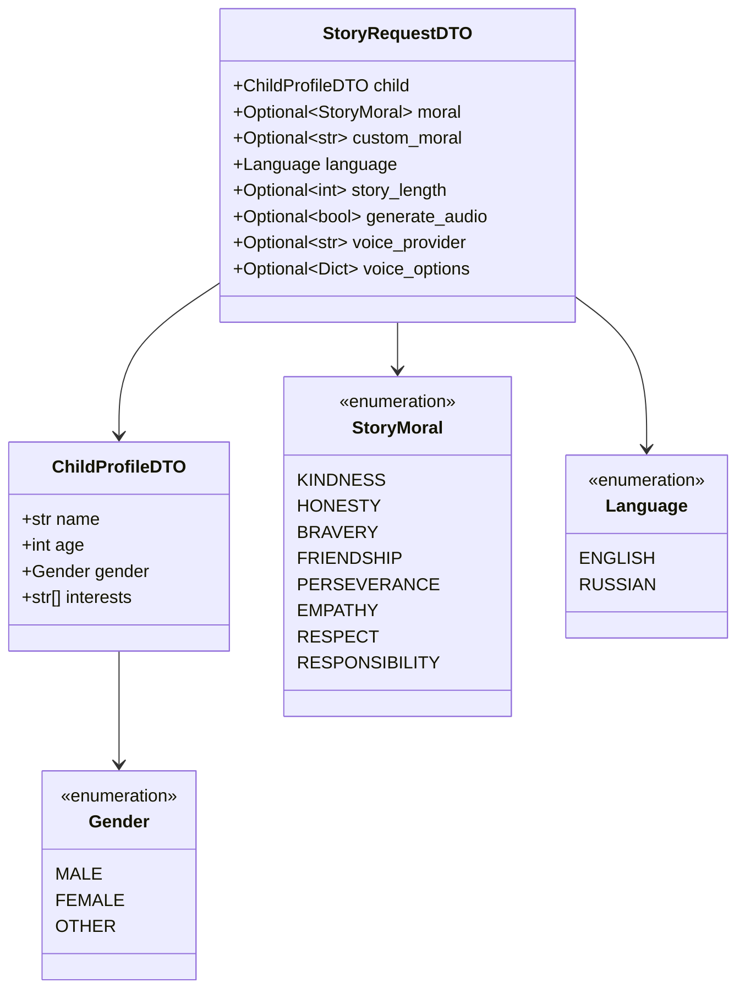
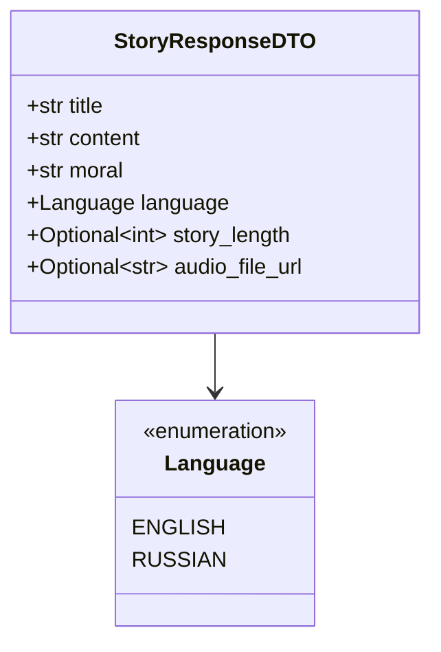
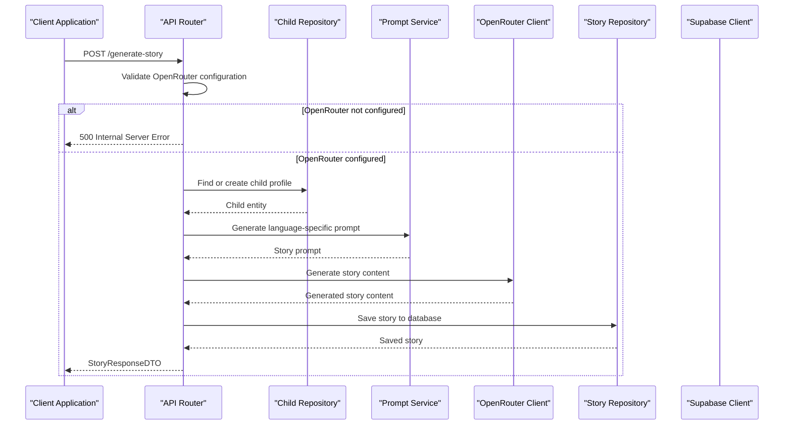
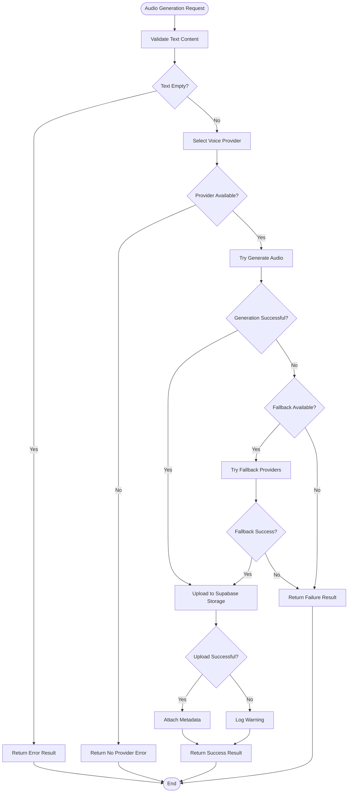

# Story Generation API

<cite>
**Referenced Files in This Document**
- [README.md](file://README.md)
- [src/api/routes.py](file://src/api/routes.py)
- [src/application/dto.py](file://src/application/dto.py)
- [src/application/use_cases/generate_story.py](file://src/application/use_cases/generate_story.py)
- [src/domain/services/prompt_service.py](file://src/domain/services/prompt_service.py)
- [src/voice_providers/voice_service.py](file://src/voice_providers/voice_service.py)
- [src/openrouter_client.py](file://src/openrouter_client.py)
- [src/supabase_client.py](file://src/supabase_client.py)
- [src/models.py](file://src/models.py)
- [src/domain/value_objects.py](file://src/domain/value_objects.py)
</cite>

## Table of Contents
1. [Introduction](#introduction)
2. [API Endpoint Overview](#api-endpoint-overview)
3. [Request Schema](#request-schema)
4. [Response Schema](#response-schema)
5. [Story Generation Workflow](#story-generation-workflow)
6. [Audio Generation Flow](#audio-generation-flow)
7. [Error Responses](#error-responses)
8. [Parameter Validation Rules](#parameter-validation-rules)
9. [Curl Example](#curl-example)
10. [Technical Implementation Details](#technical-implementation-details)

## Introduction

The Story Generation API provides a comprehensive solution for creating personalized children's bedtime stories using AI technology. This endpoint accepts detailed child profiles, moral values, and language preferences to generate customized stories with optional audio narration capabilities.

The API integrates multiple services including OpenRouter for AI story generation, Supabase for database persistence, and voice providers for audio synthesis, offering a complete end-to-end solution for bedtime story creation.

## API Endpoint Overview

### HTTP Method and URL Pattern

**Endpoint:** `POST /generate-story`

**Content-Type:** `application/json`

**Authentication:** No authentication required

**Rate Limiting:** Not explicitly documented, but subject to server capacity limits

## Request Schema

The story generation request follows the `StoryRequestDTO` schema with comprehensive validation rules:



**Diagram sources**
- [src/application/dto.py](file://src/application/dto.py#L8-L44)
- [src/models.py](file://src/models.py#L22-L51)

### Request Body Properties

| Property | Type | Required | Description | Validation Rules |
|----------|------|----------|-------------|------------------|
| `child` | ChildProfileDTO | Yes | Child profile information | Must include name, age (1-18), gender, and interests (min 1) |
| `moral` | StoryMoral | No | Predefined moral value | Must be one of predefined morals if provided |
| `custom_moral` | string | No | Custom moral value | Alternative to predefined morals |
| `language` | Language | No | Story language | Defaults to English ("en"), supports "en" or "ru" |
| `story_length` | integer | No | Story length in minutes | Defaults to 5, must be 1-30 minutes |
| `generate_audio` | boolean | No | Enable audio narration | Defaults to false |
| `voice_provider` | string | No | Voice provider name | Used when generate_audio is true |
| `voice_options` | object | No | Provider-specific voice options | Provider-dependent configuration |

**Section sources**
- [src/application/dto.py](file://src/application/dto.py#L18-L44)
- [src/models.py](file://src/models.py#L42-L51)

## Response Schema

The story generation response follows the `StoryResponseDTO` schema:



**Diagram sources**
- [src/application/dto.py](file://src/application/dto.py#L62-L81)

### Response Properties

| Property | Type | Description |
|----------|------|-------------|
| `title` | string | Generated story title extracted from content |
| `content` | string | Complete story text with formatting |
| `moral` | string | Moral value used for story generation |
| `language` | Language | Language of the generated story |
| `story_length` | integer | Actual story length in minutes |
| `audio_file_url` | string | URL to audio file if audio generation was requested |

**Section sources**
- [src/application/dto.py](file://src/application/dto.py#L62-L81)

## Story Generation Workflow

The story generation process follows a comprehensive workflow involving multiple components:



**Diagram sources**
- [src/api/routes.py](file://src/api/routes.py#L56-L216)
- [src/application/use_cases/generate_story.py](file://src/application/use_cases/generate_story.py#L53-L120)

### Step-by-Step Process

1. **Request Validation**: Verify OpenRouter API key availability
2. **Child Profile Management**: 
   - Check for existing child with exact match (name, age, gender)
   - Create new child profile if not found
3. **Moral Determination**: 
   - Use custom_moral if provided
   - Fall back to request.moral.value
   - Default to "kindness" if neither provided
4. **Prompt Generation**: 
   - Create language-specific prompt using `prompt_service`
   - Include child profile, moral, and story length
5. **AI Story Generation**: 
   - Call OpenRouter with generated prompt
   - Retry mechanism with exponential backoff
   - Extract title from story content
6. **Database Persistence**: 
   - Save story with metadata to Supabase
   - Include model information, generation details, and audio URLs

**Section sources**
- [src/api/routes.py](file://src/api/routes.py#L56-L216)
- [src/application/use_cases/generate_story.py](file://src/application/use_cases/generate_story.py#L53-L120)

## Audio Generation Flow

When audio generation is requested, the system follows a sophisticated workflow with provider selection and fallback mechanisms:



**Diagram sources**
- [src/voice_providers/voice_service.py](file://src/voice_providers/voice_service.py#L32-L134)

### Voice Provider Selection Process

1. **Primary Provider Selection**: Use specified provider or default
2. **Fallback Mechanism**: Try alternative providers if primary fails
3. **Audio Upload**: Store audio in Supabase storage bucket
4. **URL Generation**: Create public URL for audio file
5. **Metadata Attachment**: Include provider information and generation details

**Section sources**
- [src/voice_providers/voice_service.py](file://src/voice_providers/voice_service.py#L32-L134)

## Error Responses

The API handles various error scenarios with appropriate HTTP status codes and detailed error messages:

### Missing OpenRouter Configuration (500)

**Condition**: OpenRouter API key not configured in environment

**Response**:
```json
{
  "detail": "OpenRouter API key not configured"
}
```

### Internal Server Error (500)

**Conditions**:
- Story generation fails after all retries
- Database operations fail
- Audio generation encounters unexpected errors

**Response**:
```json
{
  "detail": "Error generating story: [detailed error message]"
}
```

### Parameter Validation Errors

While not explicitly shown in the API routes, the underlying DTOs enforce validation:

- **Age Validation**: Child age must be between 1 and 18
- **Interests Validation**: At least one interest required
- **Story Length**: Must be between 1 and 30 minutes
- **Rating**: Must be between 1 and 10

**Section sources**
- [src/api/routes.py](file://src/api/routes.py#L59-L64)
- [src/api/routes.py](file://src/api/routes.py#L211-L216)

## Parameter Validation Rules

The API enforces strict validation rules to ensure data quality and system stability:

### Child Profile Validation

| Parameter | Range/Requirements | Validation |
|-----------|-------------------|------------|
| `name` | String | Required, non-empty |
| `age` | 1-18 | Integer, inclusive bounds |
| `gender` | Enum | Must be MALE, FEMALE, or OTHER |
| `interests` | Array | Non-empty, minimum 1 item |

### Story Generation Validation

| Parameter | Range/Requirements | Validation |
|-----------|-------------------|------------|
| `language` | "en" or "ru" | Enum, defaults to "en" |
| `story_length` | 1-30 minutes | Integer, inclusive bounds |
| `generate_audio` | Boolean | Optional, defaults to false |
| `rating` | 1-10 | Integer, used for story rating |

### Moral Value Validation

The system supports both predefined morals and custom morals:

**Predefined Morals**:
- kindness, honesty, bravery, friendship
- perseverance, empathy, respect, responsibility

**Custom Morals**:
- Free-form string when `custom_moral` is provided

**Section sources**
- [src/application/dto.py](file://src/application/dto.py#L12-L15)
- [src/application/dto.py](file://src/application/dto.py#L21-L23)
- [src/domain/value_objects.py](file://src/domain/value_objects.py#L76-L131)

## Curl Example

The API documentation provides a comprehensive curl example for story generation:

```bash
curl -X POST "http://localhost:8000/generate-story" \
  -H "Content-Type: application/json" \
  -d '{
    "child": {
      "name": "Emma",
      "age": 7,
      "gender": "female",
      "interests": ["unicorns", "fairies", "princesses"]
    },
    "moral": "kindness",
    "language": "en",
    "story_length": 5,
    "generate_audio": false
  }'
```

**Key Parameters in Example**:
- **Child Profile**: Emma, 7 years old, female, interested in unicorns, fairies, princesses
- **Moral**: Kindness (predefined)
- **Language**: English
- **Story Length**: 5 minutes
- **Audio**: Disabled

**Section sources**
- [README.md](file://README.md#L113-L127)

## Technical Implementation Details

### OpenRouter Integration

The system uses OpenRouter as the primary AI service for story generation:

**Supported Models**:
- GPT-4o, GPT-4o-mini, Claude 3.5 Sonnet, Claude 3 Haiku
- Llama 3.1 variants, Gemma, Mixtral, Gemini 2.0 Flash

**Retry Mechanism**: Automatic retry with exponential backoff (max 3 attempts)

**Section sources**
- [src/openrouter_client.py](file://src/openrouter_client.py#L19-L31)
- [src/openrouter_client.py](file://src/openrouter_client.py#L99-L161)

### Database Architecture

Stories and child profiles are stored in Supabase with comprehensive metadata:

**Story Table Schema**:
- Title, content, moral, language, story length
- Child references (ID, name, age, gender, interests)
- Model information and generation details
- Audio file URLs and provider metadata
- Ratings and timestamps

**Child Table Schema**:
- Name, age, gender, interests
- Creation and update timestamps
- Relationship to stories

**Section sources**
- [src/supabase_client.py](file://src/supabase_client.py#L525-L594)
- [src/supabase_client.py](file://src/supabase_client.py#L102-L154)

### Multi-Language Support

The system provides comprehensive internationalization:

**Supported Languages**: English ("en"), Russian ("ru")
**Prompt Generation**: Language-specific prompts with cultural adaptations
**Audio Support**: Voice providers with language-specific voices
**Content Translation**: Automatic translation of morals and interests

**Section sources**
- [src/domain/services/prompt_service.py](file://src/domain/services/prompt_service.py#L14-L38)
- [src/domain/services/prompt_service.py](file://src/domain/services/prompt_service.py#L170-L207)

### Error Handling and Logging

The system implements comprehensive error handling and logging:

**Logging Levels**:
- DEBUG: Detailed operation logs
- INFO: Successful operation confirmations
- WARNING: Recoverable failures and fallbacks
- ERROR: Unrecoverable failures

**Error Recovery**:
- Automatic retry for transient failures
- Fallback provider selection for audio generation
- Graceful degradation for optional features

**Section sources**
- [src/api/routes.py](file://src/api/routes.py#L16-L17)
- [src/voice_providers/voice_service.py](file://src/voice_providers/voice_service.py#L11-L12)