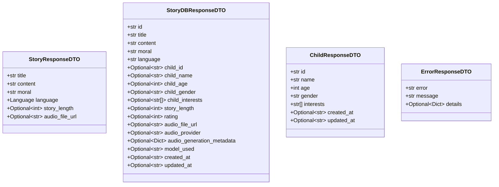

# Application Layer Architecture Documentation

<cite>
**Referenced Files in This Document**
- [src/application/dto.py](file://src/application/dto.py)
- [src/application/use_cases/generate_story.py](file://src/application/use_cases/generate_story.py)
- [src/application/use_cases/manage_children.py](file://src/application/use_cases/manage_children.py)
- [src/application/use_cases/manage_stories.py](file://src/application/use_cases/manage_stories.py)
- [src/api/routes.py](file://src/api/routes.py)
- [src/domain/entities.py](file://src/domain/entities.py)
- [src/domain/value_objects.py](file://src/domain/value_objects.py)
- [src/domain/repositories/base.py](file://src/domain/repositories/base.py)
- [src/domain/repositories/child_repository.py](file://src/domain/repositories/child_repository.py)
- [src/domain/repositories/story_repository.py](file://src/domain/repositories/story_repository.py)
- [src/domain/services/story_service.py](file://src/domain/services/story_service.py)
- [src/domain/services/prompt_service.py](file://src/domain/services/prompt_service.py)
- [src/domain/services/audio_service.py](file://src/domain/services/audio_service.py)
- [REFACTORING_PROGRESS.md](file://REFACTORING_PROGRESS.md)
- [REFACTORING_COMPLETE.md](file://REFACTORING_COMPLETE.md)
</cite>

## Table of Contents
1. [Introduction](#introduction)
2. [Architecture Overview](#architecture-overview)
3. [Data Transfer Objects (DTOs)](#data-transfer-objects-dtos)
4. [Use Case Orchestration](#use-case-orchestration)
5. [Dependency Flow and Loose Coupling](#dependency-flow-and-loose-coupling)
6. [Transaction Management](#transaction-management)
7. [Error Handling and Validation](#error-handling-and-validation)
8. [Implementation Patterns](#implementation-patterns)
9. [Testing and Testability](#testing-and-testability)
10. [Future Extension Guidelines](#future-extension-guidelines)
11. [Common Challenges and Solutions](#common-challenges-and-solutions)

## Introduction

The Application Layer serves as the critical bridge between the API layer and the Domain layer in the Tale Generator application. It functions as the use case orchestrator, responsible for coordinating business workflows, validating inputs, transforming data between layers, and maintaining loose coupling between architectural concerns.

This layer implements Domain-Driven Design principles by encapsulating specific application workflows through use cases, each representing a distinct business operation. The Application Layer ensures that domain logic remains pure and isolated from infrastructure concerns while providing a clean API for the presentation layer.

## Architecture Overview

The Application Layer follows a layered architecture pattern with clear separation of responsibilities:


**Diagram sources**
- [src/api/routes.py](file://src/api/routes.py#L1-L50)
- [src/application/dto.py](file://src/application/dto.py#L1-L50)
- [src/application/use_cases/generate_story.py](file://src/application/use_cases/generate_story.py#L1-L50)

The Application Layer consists of two primary components:

1. **Use Cases**: Application-specific business workflows that orchestrate domain logic
2. **DTOs**: Data Transfer Objects that decouple API contracts from internal domain models

**Section sources**
- [src/application/dto.py](file://src/application/dto.py#L1-L123)
- [src/application/use_cases/generate_story.py](file://src/application/use_cases/generate_story.py#L1-L208)

## Data Transfer Objects (DTOs)

DTOs serve as the primary mechanism for decoupling the API contract from internal domain models. They provide structured input validation, output formatting, and maintain backward compatibility with evolving domain models.

### Request DTOs

The Application Layer defines several request DTOs that encapsulate API input requirements:


**Diagram sources**
- [src/application/dto.py](file://src/application/dto.py#L10-L57)

### Response DTOs

Response DTOs ensure consistent API output formatting and provide controlled exposure of domain data:



**Diagram sources**
- [src/application/dto.py](file://src/application/dto.py#L62-L123)

### Pydantic Validation

All DTOs leverage Pydantic for comprehensive input validation:

- **Type Safety**: Automatic type coercion and validation
- **Field Constraints**: Range validation, length limits, and format requirements
- **Documentation**: Built-in schema generation for API documentation
- **Error Handling**: Structured validation error responses

**Section sources**
- [src/application/dto.py](file://src/application/dto.py#L1-L123)

## Use Case Orchestration

Use Cases represent the core business logic of the application, encapsulating specific workflows and coordinating interactions between domain entities, services, and repositories.

### GenerateStoryUseCase

The GenerateStoryUseCase demonstrates comprehensive use case implementation:


**Diagram sources**
- [src/application/use_cases/generate_story.py](file://src/application/use_cases/generate_story.py#L53-L120)

### ManageChildrenUseCase

Child management use cases demonstrate CRUD operations with consistent patterns:


**Diagram sources**
- [src/application/use_cases/manage_children.py](file://src/application/use_cases/manage_children.py#L16-L220)

### ManageStoriesUseCase

Story management encompasses complex workflows including rating and filtering:


**Diagram sources**
- [src/application/use_cases/manage_stories.py](file://src/application/use_cases/manage_stories.py#L15-L370)

**Section sources**
- [src/application/use_cases/generate_story.py](file://src/application/use_cases/generate_story.py#L1-L208)
- [src/application/use_cases/manage_children.py](file://src/application/use_cases/manage_children.py#L1-L220)
- [src/application/use_cases/manage_stories.py](file://src/application/use_cases/manage_stories.py#L1-L370)

## Dependency Flow and Loose Coupling

The Application Layer maintains strict separation between concerns through dependency injection and interface-based design.

### Dependency Injection Pattern


**Diagram sources**
- [src/application/use_cases/generate_story.py](file://src/application/use_cases/generate_story.py#L24-L51)

### Interface-Based Design

The Application Layer relies on abstract interfaces to maintain loose coupling:


**Diagram sources**
- [src/domain/repositories/base.py](file://src/domain/repositories/base.py#L9-L56)
- [src/domain/repositories/child_repository.py](file://src/domain/repositories/child_repository.py#L10-L38)
- [src/domain/repositories/story_repository.py](file://src/domain/repositories/story_repository.py#L10-L61)

**Section sources**
- [src/domain/repositories/base.py](file://src/domain/repositories/base.py#L1-L56)
- [src/domain/repositories/child_repository.py](file://src/domain/repositories/child_repository.py#L1-L38)
- [src/domain/repositories/story_repository.py](file://src/domain/repositories/story_repository.py#L1-L61)

## Transaction Management

The Application Layer coordinates transaction boundaries across multiple domain operations, ensuring consistency and rollback capabilities.

### Transaction Coordination


**Diagram sources**
- [src/application/use_cases/generate_story.py](file://src/application/use_cases/generate_story.py#L53-L120)

### Error Recovery Patterns

The Application Layer implements robust error recovery mechanisms:

1. **Graceful Degradation**: Audio generation failures don't prevent story creation
2. **Partial Success**: Repository operations can succeed partially
3. **Resource Cleanup**: Proper cleanup of temporary resources
4. **Compensation Actions**: Undo operations when possible

**Section sources**
- [src/application/use_cases/generate_story.py](file://src/application/use_cases/generate_story.py#L156-L208)

## Error Handling and Validation

The Application Layer provides comprehensive error handling and validation through multiple layers:

### Validation Pipeline


**Diagram sources**
- [src/application/dto.py](file://src/application/dto.py#L10-L57)
- [src/application/use_cases/generate_story.py](file://src/application/use_cases/generate_story.py#L74-L75)

### Error Response Standardization

All use cases return consistent error responses through the ErrorResponseDTO:

| Field | Purpose | Example |
|-------|---------|---------|
| `error` | Machine-readable error code | `"VALIDATION_ERROR"` |
| `message` | Human-readable description | `"Child name cannot be empty"` |
| `details` | Additional context | `{"field": "name", "value": ""}` |

**Section sources**
- [src/application/dto.py](file://src/application/dto.py#L118-L123)

## Implementation Patterns

### Constructor Injection

Use cases utilize constructor injection for dependency management:

```python
# Example from GenerateStoryUseCase
def __init__(
    self,
    story_repository: StoryRepository,
    child_repository: ChildRepository,
    story_service: StoryService,
    prompt_service: PromptService,
    audio_service: AudioService,
    ai_service,
    storage_service
):
    self.story_repository = story_repository
    self.child_repository = child_repository
    self.story_service = story_service
    self.prompt_service = prompt_service
    self.audio_service = audio_service
    self.ai_service = ai_service
    self.storage_service = storage_service
```

### Command Query Responsibility Segregation (CQRS) Pattern

The Application Layer separates read and write operations:

- **Queries**: Use cases that retrieve data (GetChildUseCase, ListStoriesUseCase)
- **Commands**: Use cases that modify data (CreateChildUseCase, RateStoryUseCase)

### Specification Pattern

Complex filtering logic is encapsulated in specification objects:

```python
# Example pattern for story filtering
class StoryLanguageSpecification:
    def __init__(self, language: Language):
        self.language = language
    
    def is_satisfied_by(self, story: Story) -> bool:
        return story.language == self.language
```

**Section sources**
- [src/application/use_cases/generate_story.py](file://src/application/use_cases/generate_story.py#L24-L51)
- [src/application/use_cases/manage_stories.py](file://src/application/use_cases/manage_stories.py#L15-L370)

## Testing and Testability

The Application Layer's design prioritizes testability through interface-based architecture and dependency injection.

### Unit Testing Patterns


### Mock Strategies

1. **Repository Mocks**: Simulate database operations
2. **Service Mocks**: Isolate domain service logic
3. **External Service Mocks**: Stub third-party integrations
4. **Configuration Mocks**: Control environment settings

### Test Coverage Areas

| Component | Coverage Strategy | Example |
|-----------|------------------|---------|
| Use Cases | Unit tests with mocks | Test business logic independently |
| DTOs | Validation tests | Test input validation scenarios |
| Error Handling | Exception tests | Test error conditions and responses |
| Integration | End-to-end tests | Test complete workflows |

**Section sources**
- [src/application/use_cases/generate_story.py](file://src/application/use_cases/generate_story.py#L1-L208)
- [src/application/use_cases/manage_children.py](file://src/application/use_cases/manage_children.py#L1-L220)

## Future Extension Guidelines

### Creating New Use Cases

To add new functionality, follow these established patterns:

1. **Define Use Case Class**: Create a new class in the appropriate module
2. **Implement Dependencies**: Specify required domain services and repositories
3. **Create Execute Method**: Implement the business workflow
4. **Add Response Transformation**: Convert domain entities to DTOs
5. **Implement Error Handling**: Handle domain exceptions appropriately

### Extending DTOs

When extending the API:

1. **Add New DTO**: Create appropriate request/response DTOs
2. **Update Validation**: Add Pydantic validation rules
3. **Maintain Backward Compatibility**: Ensure existing APIs remain functional
4. **Document Changes**: Update API documentation

### Adding New Workflows

For complex workflows:

1. **Break Down Complexity**: Decompose into smaller use cases
2. **Implement Saga Pattern**: Handle distributed transactions
3. **Add Event Publishing**: Enable event-driven architectures
4. **Consider CQRS**: Separate read and write models when appropriate

## Common Challenges and Solutions

### Challenge 1: Transaction Management Across Boundaries

**Problem**: Managing transactions across multiple domain operations

**Solution**: Use compensating transactions and idempotent operations

```python
# Example pattern for handling partial failures
try:
    # Step 1: Create story
    story = self.story_service.create_story(...)
    saved_story = self.story_repository.save(story)
    
    # Step 2: Generate audio (optional)
    if request.generate_audio:
        audio_result = self.audio_service.generate_audio(...)
        if audio_result.success:
            self.story_service.attach_audio_to_story(saved_story, ...)
    
    return self._to_response_dto(saved_story)
except Exception as e:
    # Cleanup on failure
    if 'saved_story' in locals():
        self.story_repository.delete(saved_story.id)
    raise
```

### Challenge 2: Maintaining Separation from Infrastructure

**Problem**: Use cases becoming aware of infrastructure concerns

**Solution**: Strict adherence to dependency inversion principle

- Use interfaces, not implementations
- Inject dependencies through constructors
- Keep infrastructure details in the infrastructure layer
- Use adapter patterns for external systems

### Challenge 3: Use Case Granularity

**Problem**: Too fine-grained or coarse-grained use cases

**Solution**: Follow Single Responsibility Principle

- One use case = One business operation
- Avoid "god objects"
- Break down complex workflows into smaller steps
- Use composition over inheritance

### Challenge 4: Error Propagation

**Problem**: Inconsistent error handling across use cases

**Solution**: Standardized error handling patterns

```python
# Consistent error handling pattern
def execute(self, request):
    try:
        # Business logic
        return self._transform_to_response(result)
    except ValidationError as e:
        raise ValidationError(str(e)) from e
    except NotFoundError as e:
        raise NotFoundError(str(e)) from e
    except Exception as e:
        logger.error(f"Unexpected error: {str(e)}")
        raise InternalServerError("Internal server error") from e
```

**Section sources**
- [src/application/use_cases/generate_story.py](file://src/application/use_cases/generate_story.py#L156-L208)
- [src/application/dto.py](file://src/application/dto.py#L118-L123)

## Conclusion

The Application Layer of the Tale Generator application successfully implements Domain-Driven Design principles through its use case orchestration, DTO-based data transfer, and strict separation of concerns. The layer provides:

- **Clear Business Logic Encapsulation**: Each use case represents a specific business workflow
- **Robust Data Validation**: Comprehensive input validation through Pydantic DTOs
- **Loose Coupling**: Interface-based design enables easy testing and maintenance
- **Consistent Error Handling**: Standardized error responses across all operations
- **Extensible Architecture**: Well-defined patterns for adding new functionality

The refactoring effort documented in REFACTORING_PROGRESS.md and REFACTORING_COMPLETE.md demonstrates the successful transformation from a monolithic architecture to a modern, maintainable, and scalable system. The Application Layer serves as the foundation for continued development and future enhancements while maintaining backward compatibility with existing functionality.