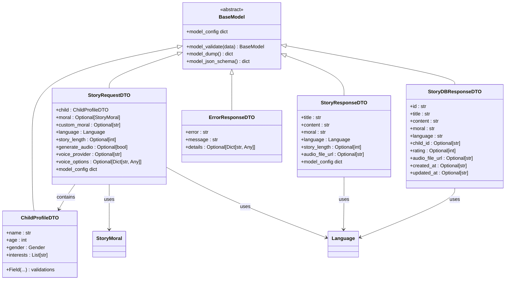
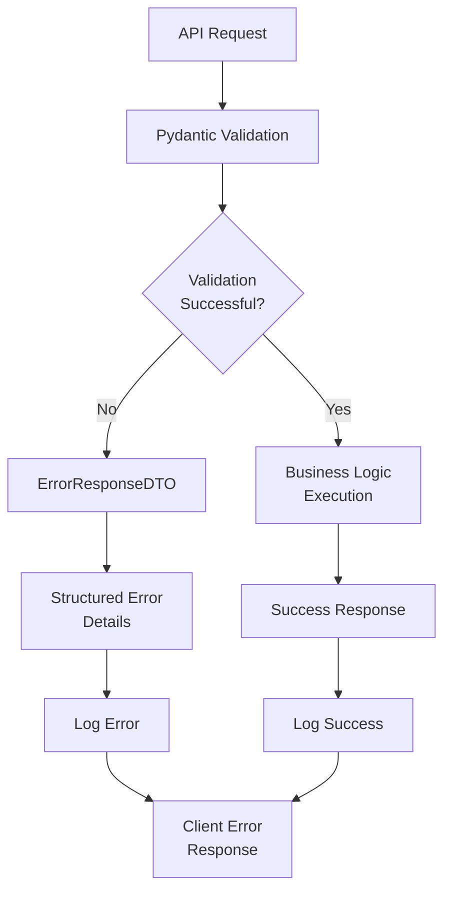

# Data Transfer Objects (DTOs)

<cite>
**Referenced Files in This Document**
- [dto.py](file://src/application/dto.py)
- [routes.py](file://src/api/routes.py)
- [value_objects.py](file://src/domain/value_objects.py)
- [models.py](file://src/models.py)
- [supabase_client.py](file://src/supabase_client.py)
- [test_api.py](file://test_api.py)
- [exceptions.py](file://src/core/exceptions.py)
</cite>

## Table of Contents
1. [Introduction](#introduction)
2. [Pydantic BaseModel Architecture](#pydantic-basemodel-architecture)
3. [Request DTOs](#request-dtos)
4. [Response DTOs](#response-dtos)
5. [Error Handling and Validation](#error-handling-and-validation)
6. [Integration with FastAPI](#integration-with-fastapi)
7. [Multi-Language Support](#multi-language-support)
8. [Audio Generation Features](#audio-generation-features)
9. [Performance Considerations](#performance-considerations)
10. [Best Practices](#best-practices)
11. [Troubleshooting Guide](#troubleshooting-guide)
12. [Conclusion](#conclusion)

## Introduction

The Tale Generator application employs a comprehensive Data Transfer Object (DTO) architecture built on Pydantic BaseModels to enforce strict schema contracts between the API layer and application services. These DTOs serve as the primary interface for request/response validation, ensuring type safety, data integrity, and automatic OpenAPI documentation generation.

The DTO system consists of six core classes that handle different aspects of the storytelling workflow: child profile management, story generation requests, story ratings, and response formatting. Each DTO is carefully designed with validation rules, default values, and JSON schema extras to support both development productivity and runtime reliability.

## Pydantic BaseModel Architecture

The DTOs leverage Pydantic's powerful validation capabilities to provide automatic type checking, data conversion, and schema enforcement. The architecture follows a layered approach where DTOs act as intermediaries between external API requests and internal domain models.

**Diagram sources**
- [dto.py](file://src/application/dto.py#L10-L122)
- [value_objects.py](file://src/domain/value_objects.py#L10-L189)

**Section sources**
- [dto.py](file://src/application/dto.py#L1-L123)

## Request DTOs

### ChildProfileDTO

The `ChildProfileDTO` serves as the foundational data structure for child profile information in story generation requests. It encapsulates essential child characteristics that influence story creation.

| Field | Type | Constraints | Description |
|-------|------|-------------|-------------|
| `name` | `str` | Required | Child's name for personalized story content |
| `age` | `int` | `ge=1, le=18` | Child's age (1-18) affecting story complexity |
| `gender` | `Gender` | Required | Child's gender from predefined enum options |
| `interests` | `List[str]` | `min_length=1` | Child's interests for theme selection |

The `Gender` enum provides type safety with predefined values: `"male"`, `"female"`, and `"other"`. The `interests` field ensures at least one interest is provided, enabling meaningful story customization.

### StoryRequestDTO

The `StoryRequestDTO` orchestrates the complete story generation process, combining child profile data with story preferences and multimedia options.

| Field | Type | Constraints | Default | Description |
|-------|------|-------------|---------|-------------|
| `child` | `ChildProfileDTO` | Required | - | Complete child profile for personalization |
| `moral` | `Optional[StoryMoral]` | - | `None` | Predefined moral value from enum |
| `custom_moral` | `Optional[str]` | - | `None` | Custom moral value for unique themes |
| `language` | `Language` | - | `"en"` | Story language from supported enum |
| `story_length` | `Optional[int]` | `ge=1, le=30` | `5` | Story length in minutes (1-30) |
| `generate_audio` | `Optional[bool]` | - | `False` | Enable audio narration generation |
| `voice_provider` | `Optional[str]` | - | `None` | Voice provider name for audio generation |
| `voice_options` | `Optional[Dict[str, Any]]` | - | `None` | Provider-specific voice configuration |

The DTO includes comprehensive validation rules enforced at runtime, ensuring data integrity throughout the story generation pipeline. The `model_config` section provides JSON schema examples for OpenAPI documentation.

### StoryRatingRequestDTO

The `StoryRatingRequestDTO` handles story rating submissions with strict validation to maintain data quality.

| Field | Type | Constraints | Description |
|-------|------|-------------|-------------|
| `rating` | `int` | `ge=1, le=10` | Story rating value from 1 to 10 |

This simple DTO ensures that all ratings fall within the acceptable range, supporting the application's feedback collection mechanism.

### ChildRequestDTO

The `ChildRequestDTO` manages child profile creation and updates in the database layer.

| Field | Type | Constraints | Description |
|-------|------|-------------|-------------|
| `name` | `str` | Required | Child's name |
| `age` | `int` | `ge=1, le=18` | Child's age |
| `gender` | `str` | Required | Child's gender |
| `interests` | `List[str]` | `min_length=1` | Child's interests |

Unlike the request DTOs, this version uses plain strings for gender to accommodate legacy data and external integrations.

**Section sources**
- [dto.py](file://src/application/dto.py#L10-L60)

## Response DTOs

### StoryResponseDTO

The `StoryResponseDTO` encapsulates the results of successful story generation, providing structured output for client consumption.

| Field | Type | Constraints | Description |
|-------|------|-------------|-------------|
| `title` | `str` | Required | Generated story title |
| `content` | `str` | Required | Complete story content |
| `moral` | `str` | Required | Moral value extracted or generated |
| `language` | `Language` | Required | Language of the story |
| `story_length` | `Optional[int]` | - | Actual story length in minutes |
| `audio_file_url` | `Optional[str]` | - | URL to generated audio file |

The DTO includes JSON schema examples that demonstrate typical response structures, aiding API documentation and client development.

### ChildResponseDTO

The `ChildResponseDTO` provides standardized child profile information for API responses.

| Field | Type | Constraints | Description |
|-------|------|-------------|-------------|
| `id` | `str` | Required | Unique child identifier |
| `name` | `str` | Required | Child's name |
| `age` | `int` | Required | Child's age |
| `gender` | `str` | Required | Child's gender |
| `interests` | `List[str]` | Required | Child's interests |
| `created_at` | `Optional[str]` | - | Creation timestamp |
| `updated_at` | `Optional[str]` | - | Last update timestamp |

### StoryDBResponseDTO

The `StoryDBResponseDTO` represents the comprehensive story data stored in the database, including metadata and AI generation information.

| Field | Type | Constraints | Description |
|-------|------|-------------|-------------|
| `id` | `str` | Required | Unique story identifier |
| `title` | `str` | Required | Story title |
| `content` | `str` | Required | Story content |
| `moral` | `str` | Required | Moral value |
| `language` | `str` | Required | Language code |
| `child_id` | `Optional[str]` | - | Associated child identifier |
| `child_name` | `Optional[str]` | - | Child's name |
| `child_age` | `Optional[int]` | - | Child's age |
| `child_gender` | `Optional[str]` | - | Child's gender |
| `child_interests` | `Optional[List[str]]` | - | Child's interests |
| `story_length` | `Optional[int]` | - | Story length in minutes |
| `rating` | `Optional[int]` | `ge=1, le=10` | Story rating (1-10) |
| `audio_file_url` | `Optional[str]` | - | Audio file URL |
| `audio_provider` | `Optional[str]` | - | Audio provider name |
| `audio_generation_metadata` | `Optional[Dict[str, Any]]` | - | Audio generation details |
| `model_used` | `Optional[str]` | - | AI model used for generation |
| `created_at` | `Optional[str` | - | Creation timestamp |
| `updated_at` | `Optional[str]` | - | Last update timestamp |

This comprehensive DTO captures all aspects of story generation, storage, and retrieval, supporting both immediate responses and historical data access.

### ErrorResponseDTO

The `ErrorResponseDTO` standardizes error communication across the API, providing structured error information.

| Field | Type | Constraints | Description |
|-------|------|-------------|-------------|
| `error` | `str` | Required | Error code or type |
| `message` | `str` | Required | Human-readable error message |
| `details` | `Optional[Dict[str, Any]]` | - | Additional error context |

**Section sources**
- [dto.py](file://src/application/dto.py#L62-L122)

## Error Handling and Validation

The DTO system implements comprehensive error handling through Pydantic's built-in validation mechanisms and custom exception handling. The validation occurs automatically during request parsing and can be customized for specific business logic requirements.

**Diagram sources**
- [dto.py](file://src/application/dto.py#L47-L51)
- [exceptions.py](file://src/core/exceptions.py#L36-L66)

The validation system provides detailed error messages with field-specific information, enabling precise debugging and user-friendly error reporting. Custom validation rules can be implemented through Pydantic's `field_validator` decorators or custom exception handling.

**Section sources**
- [exceptions.py](file://src/core/exceptions.py#L36-L66)
- [supabase_client.py](file://src/supabase_client.py#L823-L857)

## Integration with FastAPI

The DTOs integrate seamlessly with FastAPI's automatic request parsing and OpenAPI documentation generation. FastAPI automatically validates incoming requests against the DTO schemas and generates comprehensive API documentation.

### Automatic Request Parsing

FastAPI automatically parses JSON payloads into the appropriate DTO classes, performing type conversion and validation. The framework handles complex nested objects, optional fields, and default values transparently.

### OpenAPI/Swagger UI Generation

Each DTO includes `model_config` with `json_schema_extra` sections that provide examples and additional documentation for Swagger UI. This enables interactive API exploration and client SDK generation.

### Response Model Binding

FastAPI uses the response DTOs to validate outgoing responses, ensuring that only properly formatted data is sent to clients. This prevents data leakage and maintains API contract integrity.

**Section sources**
- [routes.py](file://src/api/routes.py#L56-L216)
- [models.py](file://src/models.py#L42-L117)

## Multi-Language Support

The DTO system provides robust internationalization support through the `Language` enum and related value objects. The system supports multiple languages with automatic translation capabilities and locale-aware validation.

### Language Enumeration

The `Language` enum defines supported languages with display names and translation capabilities:

- **English (`"en"`)**: Primary language with full feature support
- **Russian (`"ru"`)**: Secondary language with cultural adaptations

### Cultural Adaptations

The language system includes automatic translation capabilities for gender and moral values, ensuring culturally appropriate content across different locales. The translation system maintains consistency between request and response data.

### Validation Rules

Language-specific validation rules ensure that only supported languages are accepted, preventing invalid language codes from entering the system.

**Section sources**
- [value_objects.py](file://src/domain/value_objects.py#L10-L44)

## Audio Generation Features

The DTO system supports comprehensive audio generation capabilities through specialized fields and validation rules. The system integrates with multiple voice providers and supports custom audio configurations.

### Audio Configuration Fields

The `StoryRequestDTO` includes several fields for audio generation control:

- **`generate_audio`**: Boolean flag to enable/disable audio generation
- **`voice_provider`**: Specifies the voice provider to use
- **`voice_options`**: Dictionary of provider-specific configuration options

### Audio Response Integration

The `StoryResponseDTO` and `StoryDBResponseDTO` include audio-related fields:

- **`audio_file_url`**: URL to the generated audio file
- **`audio_provider`**: Name of the voice provider used
- **`audio_generation_metadata`**: Provider-specific generation details

### Quality Control

Audio generation includes quality validation and metadata tracking, ensuring reliable audio delivery and troubleshooting capabilities.

**Section sources**
- [dto.py](file://src/application/dto.py#L26-L27)
- [dto.py](file://src/application/dto.py#L68-L69)

## Performance Considerations

### Validation Performance

Pydantic's validation engine is highly optimized for performance, but large payloads require careful consideration. The validation system uses lazy evaluation and caching to minimize overhead.

### Memory Management

Large story content and audio metadata can consume significant memory. The DTO system uses optional fields and lazy loading to optimize memory usage.

### Batch Processing

For bulk operations, the system supports batch processing with individual DTO validation for each item, ensuring data integrity while maintaining performance.

### Caching Strategies

The validation system can benefit from caching frequently used validation rules and schemas, particularly for repeated child profiles and story templates.

## Best Practices

### Extending DTOs

When adding new fields to DTOs, follow these guidelines:

1. **Maintain Backward Compatibility**: Add optional fields with sensible defaults
2. **Use Type Annotations**: Always specify explicit types for clarity
3. **Add Validation Rules**: Include appropriate constraints for new fields
4. **Update Documentation**: Modify JSON schema examples and field descriptions
5. **Test Thoroughly**: Verify validation works correctly with new combinations

### Field Design Principles

- **Single Responsibility**: Each field should have a clear, specific purpose
- **Type Safety**: Use enums and typed collections for constrained values
- **Null Safety**: Prefer explicit optionals over implicit null handling
- **Documentation**: Include comprehensive field descriptions and examples

### Validation Strategy

- **Layered Validation**: Combine Pydantic validation with business logic validation
- **Error Clarity**: Provide meaningful error messages with field context
- **Performance**: Balance validation depth with response time requirements

## Troubleshooting Guide

### Common Serialization Errors

**Problem**: JSON deserialization failures
**Solution**: Verify field types match expected Pydantic types, check for missing required fields

**Problem**: Type conversion errors
**Solution**: Ensure data types align with field annotations, use appropriate default values

### Validation Failures

**Problem**: Field validation errors
**Solution**: Review constraint specifications, check data ranges and lengths

**Problem**: Nested object validation failures
**Solution**: Verify all nested DTOs are properly constructed and validated

### Performance Issues

**Problem**: Slow request processing
**Solution**: Profile validation performance, consider reducing payload size or optimizing validation rules

**Problem**: Memory usage spikes
**Solution**: Monitor large field sizes, implement streaming for large content

### Integration Problems

**Problem**: FastAPI route binding issues
**Solution**: Verify DTO imports and model configurations, check for circular dependencies

**Problem**: OpenAPI documentation generation failures
**Solution**: Review `model_config` settings, ensure JSON schema examples are valid

**Section sources**
- [test_api.py](file://test_api.py#L26-L46)

## Conclusion

The Tale Generator's DTO system demonstrates a mature approach to API design, combining type safety, validation, and documentation in a cohesive architecture. The Pydantic-based implementation provides robust data validation while maintaining flexibility for future enhancements.

The system's strength lies in its comprehensive coverage of the application's data flow, from initial request parsing through response generation. The integration with FastAPI ensures automatic documentation and client SDK generation, while the validation system provides reliable data integrity.

Key benefits of this architecture include:

- **Type Safety**: Compile-time and runtime type checking
- **Validation**: Comprehensive data validation with meaningful error messages
- **Documentation**: Automatic OpenAPI generation with examples
- **Flexibility**: Easy extension and modification of data structures
- **Performance**: Optimized validation with minimal overhead

The DTO system serves as a solid foundation for the application's API layer, supporting both current functionality and future growth requirements. Its design principles of simplicity, clarity, and maintainability make it an excellent example of effective API design patterns.