# Use Cases

<cite>
**Referenced Files in This Document**
- [generate_story.py](file://src/application/use_cases/generate_story.py)
- [manage_children.py](file://src/application/use_cases/manage_children.py)
- [manage_stories.py](file://src/application/use_cases/manage_stories.py)
- [dto.py](file://src/application/dto.py)
- [story_service.py](file://src/domain/services/story_service.py)
- [child_repository.py](file://src/domain/repositories/child_repository.py)
- [story_repository.py](file://src/domain/repositories/story_repository.py)
- [logging.py](file://src/core/logging.py)
- [exceptions.py](file://src/core/exceptions.py)
- [routes.py](file://src/api/routes.py)
- [main.py](file://main.py)
</cite>

## Table of Contents
1. [Introduction](#introduction)
2. [Architecture Overview](#architecture-overview)
3. [GenerateStoryUseCase](#generatestoryusecase)
4. [ManageChildrenUseCase](#managechildrenusecase)
5. [ManageStoriesUseCase](#managestoriesusecase)
6. [Input Validation and DTOs](#input-validation-and-dtos)
7. [Error Handling and Propagation](#error-handling-and-propagation)
8. [Integration with Infrastructure](#integration-with-infrastructure)
9. [Testing and Testability](#testing-and-testability)
10. [Common Issues and Solutions](#common-issues-and-solutions)
11. [Creating New Use Cases](#creating-new-use-cases)
12. [Refactoring Insights](#refactoring-insights)

## Introduction

The Use Cases sub-component of the Application Layer serves as the primary orchestrator of business workflows in the Tale Generator application. Each use case encapsulates a specific business operation, coordinating domain entities, services, and infrastructure components while maintaining strict separation of concerns. The use cases implement the Clean Architecture pattern, where they act as the boundary between the application layer and the domain layer.

The three core use cases demonstrate different patterns of business workflow orchestration:
- **GenerateStoryUseCase**: Complex workflow involving multiple external services and side effects
- **ManageChildrenUseCase**: CRUD operations with entity management
- **ManageStoriesUseCase**: Data retrieval and manipulation operations

## Architecture Overview

The use cases follow a consistent architectural pattern that emphasizes dependency injection, loose coupling, and clear separation of responsibilities.


**Diagram sources**
- [generate_story.py](file://src/application/use_cases/generate_story.py#L21-L52)
- [manage_children.py](file://src/application/use_cases/manage_children.py#L16-L26)
- [manage_stories.py](file://src/application/use_cases/manage_stories.py#L15-L26)

**Section sources**
- [generate_story.py](file://src/application/use_cases/generate_story.py#L21-L52)
- [manage_children.py](file://src/application/use_cases/manage_children.py#L16-L26)
- [manage_stories.py](file://src/application/use_cases/manage_stories.py#L15-L26)

## GenerateStoryUseCase

The GenerateStoryUseCase represents the most complex business workflow in the application, orchestrating multiple external services and handling sophisticated side effects including audio generation.

### Workflow Orchestration

The use case follows a structured 10-step workflow that demonstrates proper error handling and transaction-like behavior:


**Diagram sources**
- [generate_story.py](file://src/application/use_cases/generate_story.py#L53-L120)

### Dependency Injection Pattern

The use case demonstrates clean dependency injection with clearly defined interfaces:

| Dependency | Purpose | Interface |
|------------|---------|-----------|
| `story_repository` | Persist story entities | `StoryRepository` |
| `child_repository` | Manage child profiles | `ChildRepository` |
| `story_service` | Business logic coordination | `StoryService` |
| `prompt_service` | Generate AI prompts | Service interface |
| `audio_service` | Audio generation | `AudioService` |
| `ai_service` | AI content generation | External service |
| `storage_service` | File storage operations | Storage interface |

### Side Effect Management

The use case carefully manages side effects through dedicated helper methods:

#### Child Management
The `_get_or_create_child` method implements intelligent child profile management:
- **Exact Match Detection**: Searches for existing children with identical attributes
- **Automatic Creation**: Creates new child profiles when no match is found
- **Consistency**: Ensures child entities are properly managed throughout the workflow

#### Audio Generation Coordination
The `_generate_and_upload_audio` method handles complex audio generation workflow:
- **Service Integration**: Coordinates with multiple audio providers
- **Error Resilience**: Gracefully handles audio generation failures
- **Storage Integration**: Manages file uploads and metadata attachment
- **Transaction Safety**: Ensures atomicity of story and audio association

**Section sources**
- [generate_story.py](file://src/application/use_cases/generate_story.py#L53-L208)

## ManageChildrenUseCase

The ManageChildrenUseCase family provides comprehensive child profile management through specialized use cases for different operations.

### CRUD Operation Patterns

Each use case follows a consistent pattern for child profile management:


**Diagram sources**
- [manage_children.py](file://src/application/use_cases/manage_children.py#L16-L220)

### Entity Transformation Pattern

All use cases implement a consistent entity-to-response transformation pattern through the `_to_response_dto` method, ensuring proper data encapsulation and API contract adherence.

### Error Handling Strategy

The use cases implement consistent error handling:
- **NotFoundError**: Raised when requested resources don't exist
- **Logging**: Comprehensive logging at each step for debugging and monitoring
- **Type Safety**: Strong typing ensures compile-time validation of data flows

**Section sources**
- [manage_children.py](file://src/application/use_cases/manage_children.py#L16-L220)

## ManageStoriesUseCase

The ManageStoriesUseCase family provides comprehensive story management capabilities with sophisticated filtering and rating functionality.

### Query Pattern Implementation

The use cases demonstrate various query patterns for story retrieval:

```mermaid
classDiagram
class GetStoryUseCase {
+StoryRepository story_repository
+execute(story_id) StoryDBResponseDTO
+_to_response_dto(story) StoryDBResponseDTO
}
class ListAllStoriesUseCase {
+StoryRepository story_repository
+execute() StoryDBResponseDTO[]
+_to_response_dto(story) StoryDBResponseDTO
}
class ListStoriesByChildIdUseCase {
+StoryRepository story_repository
+execute(child_id) StoryDBResponseDTO[]
+_to_response_dto(story) StoryDBResponseDTO
}
class ListStoriesByChildNameUseCase {
+StoryRepository story_repository
+execute(child_name) StoryDBResponseDTO[]
+_to_response_dto(story) StoryDBResponseDTO
}
class ListStoriesByLanguageUseCase {
+StoryRepository story_repository
+execute(language_code) StoryDBResponseDTO[]
+_to_response_dto(story) StoryDBResponseDTO
}
class RateStoryUseCase {
+StoryRepository story_repository
+StoryService story_service
+execute(story_id, request) StoryDBResponseDTO
+_to_response_dto(story) StoryDBResponseDTO
}
class DeleteStoryUseCase {
+StoryRepository story_repository
+execute(story_id) bool
}
GetStoryUseCase --> StoryRepository
ListAllStoriesUseCase --> StoryRepository
ListStoriesByChildIdUseCase --> StoryRepository
ListStoriesByChildNameUseCase --> StoryRepository
ListStoriesByLanguageUseCase --> StoryRepository
RateStoryUseCase --> StoryRepository
RateStoryUseCase --> StoryService
DeleteStoryUseCase --> StoryRepository
```



**Diagram sources**
- [manage_stories.py](file://src/application/use_cases/manage_stories.py#L15-L370)

### Rating System Integration

The `RateStoryUseCase` demonstrates sophisticated rating management:
- **Value Object Validation**: Uses `Rating` value object for validation
- **Service Coordination**: Integrates with `StoryService` for business logic
- **Atomic Updates**: Ensures consistent rating updates

### Filtering Capabilities

The use cases provide comprehensive filtering options:
- **By Child**: Filter stories by child ID or name
- **By Language**: Filter stories by language code
- **All Stories**: Retrieve complete story catalog

**Section sources**
- [manage_stories.py](file://src/application/use_cases/manage_stories.py#L15-L370)

## Input Validation and DTOs

The Data Transfer Object (DTO) system provides comprehensive input validation and ensures type safety across the application boundary.

### DTO Architecture


**Diagram sources**
- [dto.py](file://src/application/dto.py#L8-L123)

### Validation Features

The DTO system provides multiple validation layers:

| Feature | Implementation | Benefit |
|---------|----------------|---------|
| **Field Validation** | Pydantic field validators | Automatic type conversion and validation |
| **Range Validation** | `ge`/`le` constraints | Numeric range enforcement |
| **Collection Validation** | `min_length` constraints | Minimum collection size enforcement |
| **Enum Validation** | Value object integration | Type-safe enumeration values |
| **Optional Fields** | `Optional` type hints | Flexible field handling |
| **Custom Validation** | Model configuration | Complex validation logic |

### Example Validation Scenarios

The DTO system handles various validation scenarios:
- **Child Profile**: Validates name, age (1-18), gender, and interests
- **Story Request**: Validates story length (1-30 minutes), language selection, and audio preferences
- **Rating Request**: Validates rating values (1-10) with automatic normalization

**Section sources**
- [dto.py](file://src/application/dto.py#L8-L123)

## Error Handling and Propagation

The application implements a comprehensive error handling strategy that ensures consistent error reporting and graceful degradation.

### Exception Hierarchy


**Diagram sources**
- [exceptions.py](file://src/core/exceptions.py#L6-L237)

### Error Propagation Patterns

Different use cases implement appropriate error handling patterns:

#### GenerateStoryUseCase Error Handling
- **Validation Errors**: Caught early in the workflow, logged with context
- **External Service Errors**: Wrapped in `ExternalServiceError` with service identification
- **Database Errors**: Converted to `DatabaseError` with operation context
- **Audio Generation Failures**: Graceful degradation with null audio URLs

#### ManageChildrenUseCase Error Handling
- **NotFoundErrors**: Raised when child profiles are not found
- **Validation Errors**: Caught during entity creation and transformation
- **Consistent Responses**: All use cases return consistent error responses

#### ManageStoriesUseCase Error Handling
- **NotFoundErrors**: Raised for missing stories
- **Rating Validation**: Uses `ValidationError` for invalid rating values
- **Deletion Safety**: Ensures proper error reporting for deletion operations

### Logging Integration

All use cases integrate comprehensive logging through the centralized logging system:


**Diagram sources**
- [logging.py](file://src/core/logging.py#L123-L180)

**Section sources**
- [exceptions.py](file://src/core/exceptions.py#L6-L237)
- [generate_story.py](file://src/application/use_cases/generate_story.py#L62-L208)

## Integration with Infrastructure

The use cases demonstrate seamless integration with infrastructure components while maintaining clean separation of concerns.

### Infrastructure Service Integration

#### External Service Integration
The GenerateStoryUseCase integrates with multiple external services:
- **AI Service**: Handles story content generation with retry logic
- **Audio Service**: Manages voice synthesis and audio processing
- **Storage Service**: Handles file uploads and cloud storage operations

#### Database Integration
All use cases coordinate with repository interfaces:
- **Child Repository**: Manages child profile persistence
- **Story Repository**: Handles story data operations
- **CRUD Operations**: Consistent CRUD patterns across all repositories

### Transaction Management

The use cases implement transaction-like behavior through careful orchestration:


**Diagram sources**
- [generate_story.py](file://src/application/use_cases/generate_story.py#L100-L109)

### Error Recovery Strategies

The use cases implement robust error recovery:
- **Graceful Degradation**: Audio generation failures don't prevent story creation
- **Retry Logic**: External service calls implement exponential backoff
- **Compensation Actions**: Cleanup operations for failed side effects

**Section sources**
- [generate_story.py](file://src/application/use_cases/generate_story.py#L156-L208)
- [routes.py](file://src/api/routes.py#L56-L200)

## Testing and Testability

The use case design prioritizes testability through dependency injection and interface abstraction.

### Mock-Based Testing Pattern

Each use case can be easily tested with mocks:

```python
# Example testing pattern
def test_generate_story_use_case():
    # Arrange
    mock_story_repo = Mock()
    mock_child_repo = Mock()
    mock_story_service = Mock()
    mock_prompt_service = Mock()
    mock_audio_service = Mock()
    mock_ai_service = Mock()
    mock_storage_service = Mock()
    
    use_case = GenerateStoryUseCase(
        story_repository=mock_story_repo,
        child_repository=mock_child_repo,
        story_service=mock_story_service,
        prompt_service=mock_prompt_service,
        audio_service=mock_audio_service,
        ai_service=mock_ai_service,
        storage_service=mock_storage_service
    )
    
    # Act
    result = use_case.execute(mock_request)
    
    # Assert
    assert result.title == expected_title
    mock_story_repo.assert_called_once()
```

### Test Coverage Areas

The use cases provide excellent test coverage opportunities:
- **Happy Path Testing**: Verify successful workflow completion
- **Error Path Testing**: Test exception handling and error propagation
- **Boundary Condition Testing**: Test edge cases and validation
- **Integration Testing**: Test with real repositories and services

### Isolation Benefits

The dependency injection pattern enables:
- **Unit Testing**: Individual use case logic testing
- **Integration Testing**: Repository and service integration testing
- **End-to-End Testing**: Complete workflow testing with mocks

**Section sources**
- [generate_story.py](file://src/application/use_cases/generate_story.py#L21-L52)
- [manage_children.py](file://src/application/use_cases/manage_children.py#L16-L26)
- [manage_stories.py](file://src/application/use_cases/manage_stories.py#L15-L26)

## Common Issues and Solutions

### Concurrent Updates

**Issue**: Multiple simultaneous requests for the same child profile
**Solution**: The `_get_or_create_child` method implements intelligent matching logic that prevents race conditions by:
- First attempting exact match detection
- Creating new profiles atomically
- Using repository-level locking where appropriate

### Audio Generation Failures

**Issue**: Audio generation service failures affecting story creation
**Solution**: The use case implements graceful degradation:
- Audio generation failures don't prevent story saving
- Null audio URLs are handled gracefully
- Error logging provides visibility into failures

### Idempotency Challenges

**Issue**: Duplicate story generation for the same child
**Solution**: The use case maintains idempotency through:
- Exact child matching logic
- Unique story generation identifiers
- Proper error handling for duplicate operations

### Memory Management

**Issue**: Large story content processing
**Solution**: The use cases handle memory efficiently by:
- Streaming audio generation where possible
- Efficient content extraction and processing
- Proper resource cleanup in error paths

### Performance Optimization

**Issue**: Slow response times for complex workflows
**Solution**: The use cases optimize performance through:
- Lazy loading of dependencies
- Efficient database queries
- Parallel execution of independent operations where possible

## Creating New Use Cases

### Design Principles

When creating new use cases, follow these established patterns:

#### Dependency Injection Pattern
```python
class NewUseCase:
    def __init__(self, dependency1, dependency2, dependency3):
        self.dependency1 = dependency1
        self.dependency2 = dependency2
        self.dependency3 = dependency3
    
    def execute(self, request):
        # Business logic here
        pass
```

#### Consistent Error Handling
```python
def execute(self, request):
    try:
        # Business logic
        return response
    except ValidationError as e:
        logger.warning(f"Validation failed: {e}")
        raise
    except Exception as e:
        logger.error(f"Unexpected error: {e}", exc_info=True)
        raise TaleGeneratorException("Operation failed") from e
```

#### Logging Integration
```python
logger = get_logger("application.new_use_case")

def execute(self, request):
    logger.info(f"Executing new use case with request: {request}")
    # Implementation
    logger.debug("Step completed successfully")
```

### Best Practices

1. **Single Responsibility**: Each use case should handle one specific business operation
2. **Interface Dependencies**: Depend on abstractions, not concrete implementations
3. **Consistent Naming**: Use clear, descriptive method names
4. **Proper Logging**: Include comprehensive logging at strategic points
5. **Error Documentation**: Document expected exceptions and their causes

### Example New Use Case Template

```python
class TemplateUseCase:
    """Template for new use cases following established patterns."""
    
    def __init__(self, repository, service, logger=None):
        self.repository = repository
        self.service = service
        self.logger = logger or get_logger("application.template_use_case")
    
    def execute(self, request):
        """Execute the use case operation.
        
        Args:
            request: Input request object
            
        Returns:
            Response object
            
        Raises:
            ValidationError: If input validation fails
            NotFoundError: If required resources are missing
            TaleGeneratorException: For unexpected errors
        """
        self.logger.info(f"Executing template use case with request: {request}")
        
        try:
            # 1. Validate input
            self._validate_input(request)
            
            # 2. Perform business logic
            result = self._perform_business_logic(request)
            
            # 3. Transform response
            response = self._transform_response(result)
            
            self.logger.info("Use case execution completed successfully")
            return response
            
        except ValidationError as e:
            self.logger.warning(f"Validation error: {e}")
            raise
        except Exception as e:
            self.logger.error(f"Unexpected error: {e}", exc_info=True)
            raise TaleGeneratorException("Template use case failed") from e
    
    def _validate_input(self, request):
        """Validate input parameters."""
        # Validation logic here
        pass
    
    def _perform_business_logic(self, request):
        """Perform the core business logic."""
        # Business logic here
        pass
    
    def _transform_response(self, result):
        """Transform internal result to response DTO."""
        # Transformation logic here
        pass
```

**Section sources**
- [generate_story.py](file://src/application/use_cases/generate_story.py#L21-L52)
- [logging.py](file://src/core/logging.py#L123-L180)

## Refactoring Insights

### Granularity Improvements

Based on the refactoring insights from REFACTORING_COMPLETE.md and REFACTORING_PROGRESS.md, several key improvements were made:

#### Layer Separation
The original monolithic code was refactored into distinct layers:
- **Core Layer**: Shared utilities and logging
- **Domain Layer**: Pure business logic and entities
- **Application Layer**: Use cases and orchestration
- **Infrastructure Layer**: External integrations

#### Interface Abstraction
Repositories and services were abstracted behind interfaces:
- **Repository Interfaces**: `ChildRepository`, `StoryRepository`
- **Service Interfaces**: `StoryService`, `AudioService`
- **External Service Contracts**: Standardized external service interfaces

#### Dependency Injection
The refactoring introduced comprehensive dependency injection:
- **Constructor Injection**: All dependencies injected via constructor
- **Interface Binding**: Concrete implementations bound to interfaces
- **Container Integration**: Ready for dependency injection container integration

### Production Stability Enhancements

#### Error Handling Standardization
- **Consistent Exception Hierarchy**: Unified error handling across all use cases
- **Comprehensive Logging**: Structured logging with request correlation
- **Graceful Degradation**: Robust error recovery mechanisms

#### Testing Infrastructure
- **Mock-Based Testing**: All use cases designed for easy mocking
- **Integration Testing**: Repository and service integration testing
- **End-to-End Testing**: Complete workflow testing capabilities

#### Monitoring and Observability
- **Structured Logging**: JSON-formatted logs with correlation IDs
- **Performance Metrics**: Built-in timing and performance tracking
- **Error Tracking**: Comprehensive error reporting and monitoring

### Lessons Learned

#### Complexity Management
- **Single Responsibility Principle**: Each use case handles one business operation
- **Interface Segregation**: Small, focused interfaces reduce coupling
- **Dependency Inversion**: High-level modules depend on abstractions

#### Maintainability Improvements
- **Reduced Coupling**: Clear boundaries between layers
- **Increased Cohesion**: Related functionality grouped together
- **Better Testability**: Mock-friendly design enables comprehensive testing

#### Scalability Considerations
- **Horizontal Scaling**: Stateless use cases enable easy scaling
- **Vertical Scaling**: Optimized resource usage patterns
- **Microservice Compatibility**: Architecture supports microservice decomposition

**Section sources**
- [REFACTORING_COMPLETE.md](file://REFACTORING_COMPLETE.md#L404-L421)
- [REFACTORING_EXECUTION_SUMMARY.md](file://REFACTORING_EXECUTION_SUMMARY.md#L155-L172)