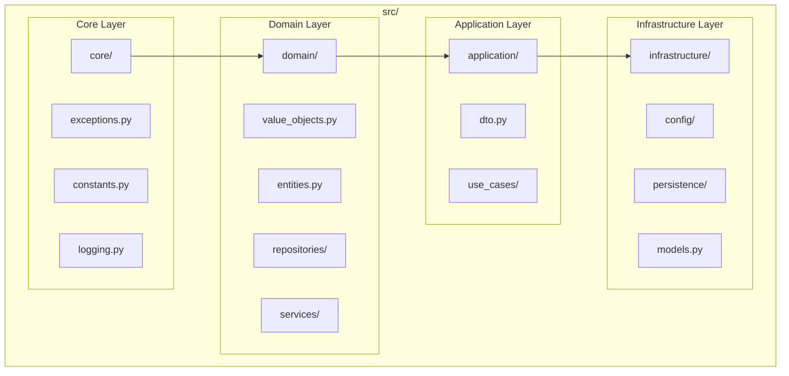
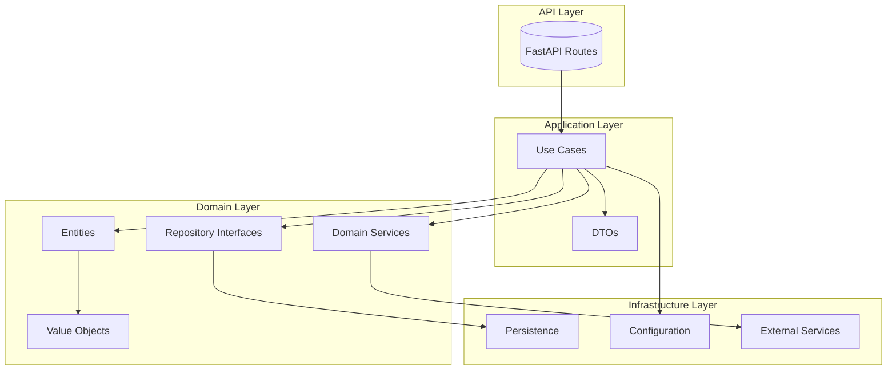
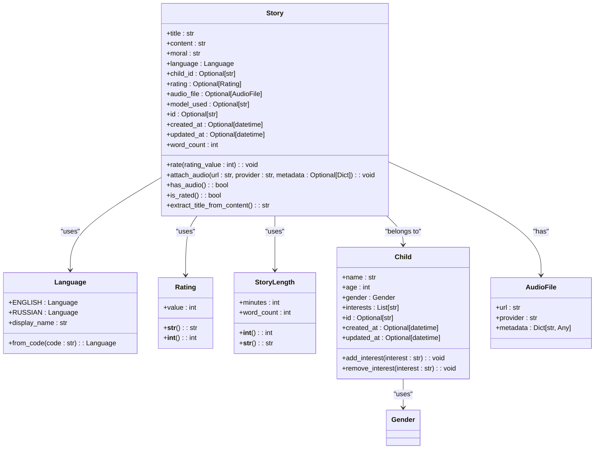
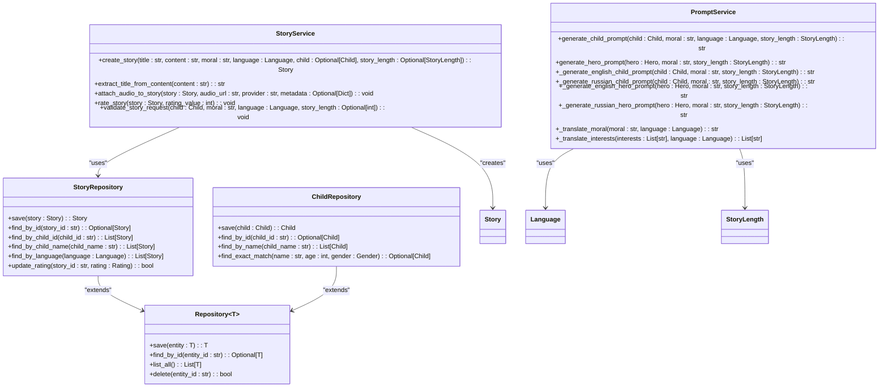
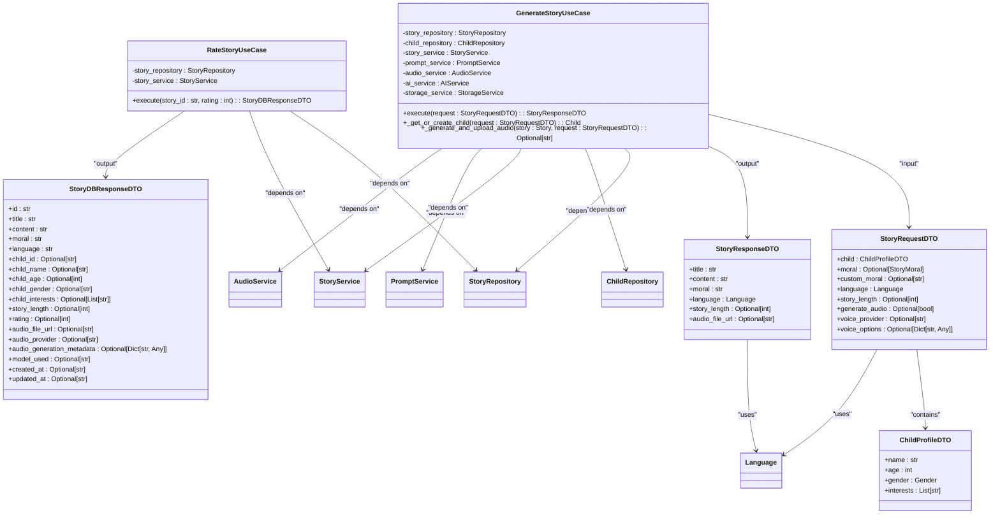
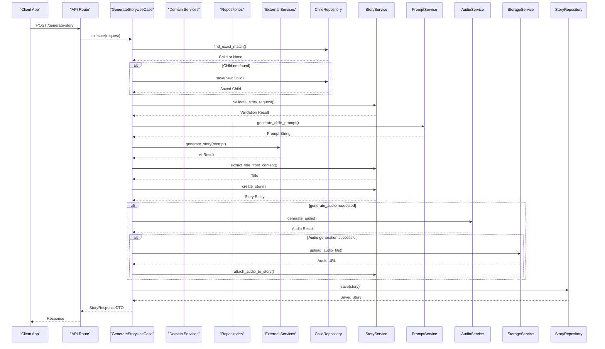
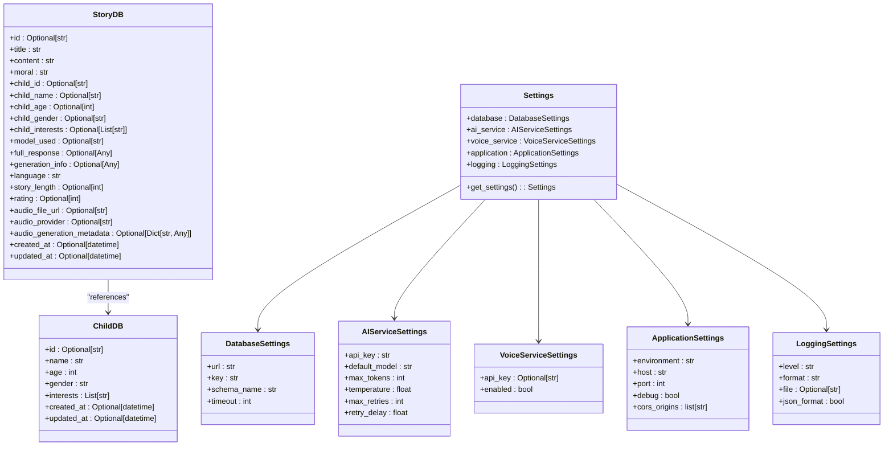
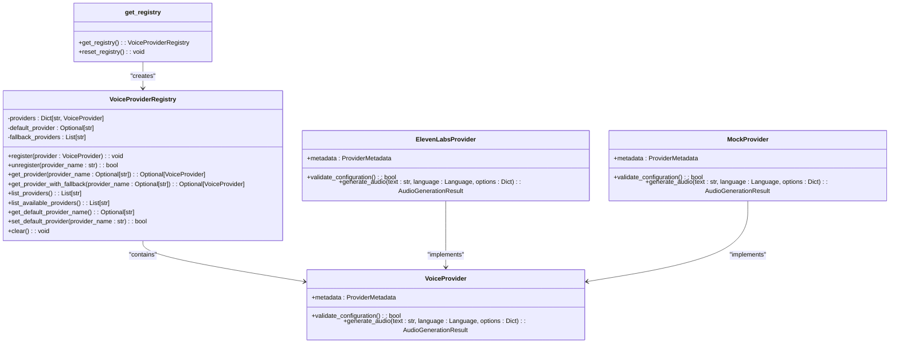
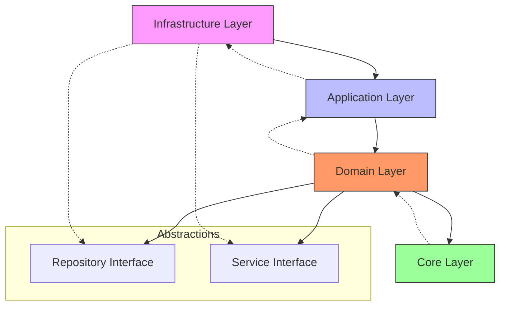

# Architecture Overview

<cite>
**Referenced Files in This Document**   
- [QUICK_START.md](file://QUICK_START.md)
- [REFACTORING_COMPLETE.md](file://REFACTORING_COMPLETE.md)
- [IMPLEMENTATION_STATUS.md](file://IMPLEMENTATION_STATUS.md)
- [README.md](file://README.md)
- [src/domain/value_objects.py](file://src/domain/value_objects.py)
- [src/domain/entities.py](file://src/domain/entities.py)
- [src/domain/repositories/base.py](file://src/domain/repositories/base.py)
- [src/application/dto.py](file://src/application/dto.py)
- [src/application/use_cases/generate_story.py](file://src/application/use_cases/generate_story.py)
- [src/domain/services/story_service.py](file://src/domain/services/story_service.py)
- [src/domain/services/prompt_service.py](file://src/domain/services/prompt_service.py)
- [src/infrastructure/persistence/models.py](file://src/infrastructure/persistence/models.py)
- [src/infrastructure/config/settings.py](file://src/infrastructure/config/settings.py)
- [src/voice_providers/provider_registry.py](file://src/voice_providers/provider_registry.py)
</cite>

## Table of Contents
1. [Introduction](#introduction)
2. [Project Structure](#project-structure)
3. [Core Components](#core-components)
4. [Architecture Overview](#architecture-overview)
5. [Detailed Component Analysis](#detailed-component-analysis)
6. [Dependency Analysis](#dependency-analysis)
7. [Performance Considerations](#performance-considerations)
8. [Troubleshooting Guide](#troubleshooting-guide)
9. [Conclusion](#conclusion)

## Introduction
The Tale Generator application has been refactored into a modern, layered architecture following Clean Architecture principles and Domain-Driven Design (DDD). This architectural documentation provides a comprehensive overview of the 4-layer structure: Core, Domain, Application, and Infrastructure. The refactoring has achieved production readiness with complete separation of concerns, type safety, and testability. The system enables personalized bedtime story generation for children with AI, supporting multiple languages, story rating, and audio narration capabilities.

## Project Structure
The Tale Generator application follows a clean, modular structure with well-defined layers. The architecture separates concerns into distinct packages, each with specific responsibilities. The src/ directory contains the core application code organized into four main layers: core (shared utilities), domain (business logic), application (use cases), and infrastructure (persistence and external services). This structure enables maintainability, testability, and scalability while following SOLID principles and dependency inversion.

**Diagram sources**
- [src/domain/value_objects.py](file://src/domain/value_objects.py)
- [src/domain/entities.py](file://src/domain/entities.py)
- [src/application/dto.py](file://src/application/dto.py)
- [src/infrastructure/persistence/models.py](file://src/infrastructure/persistence/models.py)

**Section sources**
- [QUICK_START.md](file://QUICK_START.md)
- [REFACTORING_COMPLETE.md](file://REFACTORING_COMPLETE.md)

## Core Components
The Tale Generator application's core components implement a 4-layer Clean Architecture with Domain-Driven Design. The Core layer provides shared utilities for exceptions, constants, and logging. The Domain layer contains business entities, value objects, repository interfaces, and domain services. The Application layer orchestrates use cases and defines data transfer objects (DTOs). The Infrastructure layer handles persistence, configuration, and external service integration. This separation ensures that business logic remains independent of technical implementation details.

**Section sources**
- [QUICK_START.md](file://QUICK_START.md)
- [REFACTORING_COMPLETE.md](file://REFACTORING_COMPLETE.md)
- [IMPLEMENTATION_STATUS.md](file://IMPLEMENTATION_STATUS.md)

## Architecture Overview
The Tale Generator application implements a 4-layer Clean Architecture with Domain-Driven Design, following the principles of separation of concerns and dependency inversion. The architecture consists of Core, Domain, Application, and Infrastructure layers, where outer layers depend on inner layers through abstractions. This design enables testability, maintainability, and flexibility in implementation.

**Diagram sources**
- [REFACTORING_COMPLETE.md](file://REFACTORING_COMPLETE.md)
- [src/application/use_cases/generate_story.py](file://src/application/use_cases/generate_story.py)
- [src/domain/entities.py](file://src/domain/entities.py)
- [src/domain/repositories/base.py](file://src/domain/repositories/base.py)

## Detailed Component Analysis
The Tale Generator application's architecture is analyzed in detail across its four layers, focusing on the separation of concerns, dependency flow, and implementation patterns. Each layer has specific responsibilities and interacts with adjacent layers through well-defined interfaces, ensuring loose coupling and high cohesion.

### Domain Layer Analysis
The Domain layer contains the core business logic of the Tale Generator application, implementing rich entities, value objects, repository interfaces, and domain services. This layer is framework-agnostic and represents the business domain of personalized story generation for children.

#### Domain Entities and Value Objects

**Diagram sources**
- [src/domain/value_objects.py](file://src/domain/value_objects.py#L10-L188)
- [src/domain/entities.py](file://src/domain/entities.py#L10-L210)

**Section sources**
- [src/domain/value_objects.py](file://src/domain/value_objects.py)
- [src/domain/entities.py](file://src/domain/entities.py)
- [QUICK_START.md](file://QUICK_START.md)

#### Domain Services and Repository Interfaces

**Diagram sources**
- [src/domain/repositories/base.py](file://src/domain/repositories/base.py)
- [src/domain/repositories/story_repository.py](file://src/domain/repositories/story_repository.py)
- [src/domain/repositories/child_repository.py](file://src/domain/repositories/child_repository.py)
- [src/domain/services/story_service.py](file://src/domain/services/story_service.py)
- [src/domain/services/prompt_service.py](file://src/domain/services/prompt_service.py)

**Section sources**
- [src/domain/repositories/base.py](file://src/domain/repositories/base.py)
- [src/domain/services/story_service.py](file://src/domain/services/story_service.py)
- [src/domain/services/prompt_service.py](file://src/domain/services/prompt_service.py)

### Application Layer Analysis
The Application layer orchestrates the use cases of the Tale Generator application, acting as an intermediary between the API layer and the Domain layer. It defines the application's use cases and data transfer objects (DTOs), ensuring that the business logic in the Domain layer is properly utilized while providing a clean interface for the API layer.

#### Use Cases and Data Transfer Objects

**Diagram sources**
- [src/application/dto.py](file://src/application/dto.py)
- [src/application/use_cases/generate_story.py](file://src/application/use_cases/generate_story.py)
- [src/application/use_cases/manage_stories.py](file://src/application/use_cases/manage_stories.py)

**Section sources**
- [src/application/dto.py](file://src/application/dto.py)
- [src/application/use_cases/generate_story.py](file://src/application/use_cases/generate_story.py)

#### Story Generation Use Case Flow

**Diagram sources**
- [src/application/use_cases/generate_story.py](file://src/application/use_cases/generate_story.py)
- [src/domain/services/story_service.py](file://src/domain/services/story_service.py)
- [src/domain/services/prompt_service.py](file://src/domain/services/prompt_service.py)
- [src/domain/repositories/story_repository.py](file://src/domain/repositories/story_repository.py)

**Section sources**
- [src/application/use_cases/generate_story.py](file://src/application/use_cases/generate_story.py)

### Infrastructure Layer Analysis
The Infrastructure layer handles the technical implementation details of the Tale Generator application, including persistence, configuration management, and external service integration. This layer implements the abstractions defined in the Domain layer and provides concrete implementations for database access, configuration, and third-party services.

#### Persistence Models and Configuration

**Diagram sources**
- [src/infrastructure/persistence/models.py](file://src/infrastructure/persistence/models.py)
- [src/infrastructure/config/settings.py](file://src/infrastructure/config/settings.py)

**Section sources**
- [src/infrastructure/persistence/models.py](file://src/infrastructure/persistence/models.py)
- [src/infrastructure/config/settings.py](file://src/infrastructure/config/settings.py)

#### Voice Provider Factory Pattern

**Diagram sources**
- [src/voice_providers/base_provider.py](file://src/voice_providers/base_provider.py)
- [src/voice_providers/elevenlabs_provider.py](file://src/voice_providers/elevenlabs_provider.py)
- [src/voice_providers/mock_provider.py](file://src/voice_providers/mock_provider.py)
- [src/voice_providers/provider_registry.py](file://src/voice_providers/provider_registry.py)

**Section sources**
- [src/voice_providers/provider_registry.py](file://src/voice_providers/provider_registry.py)

## Dependency Analysis
The Tale Generator application follows the dependency inversion principle, where high-level modules do not depend on low-level modules. Instead, both depend on abstractions. The dependency flow moves inward, from the Infrastructure layer to the Application layer, then to the Domain layer, and finally to the Core layer. This ensures that business logic remains independent of technical implementation details and external services.

**Diagram sources**
- [REFACTORING_COMPLETE.md](file://REFACTORING_COMPLETE.md)
- [src/domain/repositories/base.py](file://src/domain/repositories/base.py)
- [src/application/use_cases/generate_story.py](file://src/application/use_cases/generate_story.py)

**Section sources**
- [REFACTORING_COMPLETE.md](file://REFACTORING_COMPLETE.md)
- [IMPLEMENTATION_STATUS.md](file://IMPLEMENTATION_STATUS.md)

## Performance Considerations
The Tale Generator application's architecture is designed with performance in mind. The separation of concerns allows for targeted optimizations at each layer. The use of Pydantic models ensures efficient data validation and serialization. The repository pattern enables easy implementation of caching strategies at the persistence layer. The application supports async operations through FastAPI, allowing for non-blocking I/O operations when communicating with external services like OpenRouter and ElevenLabs. Connection pooling can be implemented at the database level to improve performance under load. The modular design also facilitates horizontal scaling of specific components as needed.

**Section sources**
- [REFACTORING_COMPLETE.md](file://REFACTORING_COMPLETE.md)
- [README.md](file://README.md)

## Troubleshooting Guide
When troubleshooting issues in the Tale Generator application, start by checking the structured logs which provide request-level context and correlation IDs. For configuration issues, verify that environment variables match the settings schema defined in `src/infrastructure/config/settings.py`. For database-related issues, ensure that the Supabase migrations have been applied correctly. For AI generation issues, check the OpenRouter API key and model availability. For audio generation issues, verify the ElevenLabs API key and provider configuration. The application's modular design allows for isolating issues to specific layers, making debugging more efficient.

**Section sources**
- [REFACTORING_COMPLETE.md](file://REFACTORING_COMPLETE.md)
- [README.md](file://README.md)
- [src/infrastructure/config/settings.py](file://src/infrastructure/config/settings.py)

## Conclusion
The Tale Generator application has successfully implemented a 4-layer Clean Architecture with Domain-Driven Design, achieving production readiness with complete separation of concerns, type safety, and testability. The architecture enables maintainability and scalability while following SOLID principles. The refactoring has transformed the application from a monolithic structure to a modular system with clear boundaries between layers. The Domain layer contains rich business logic with entities, value objects, and domain services, while the Application layer orchestrates use cases through well-defined interfaces. The Infrastructure layer handles persistence and external service integration, and the Core layer provides shared utilities. This architectural foundation supports future enhancements and ensures the application can evolve to meet changing requirements.