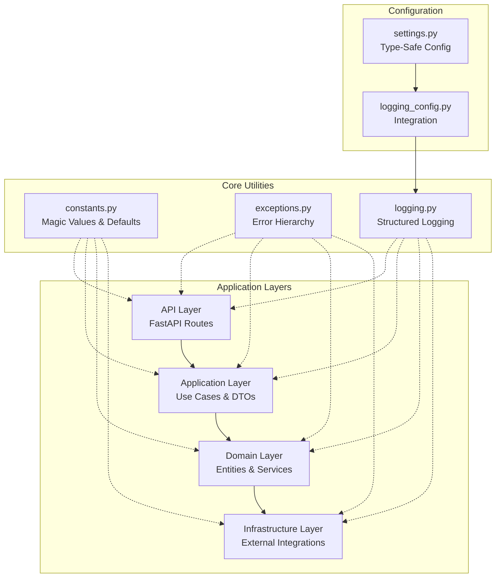
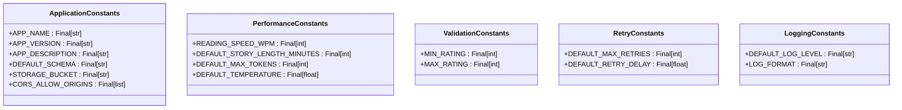
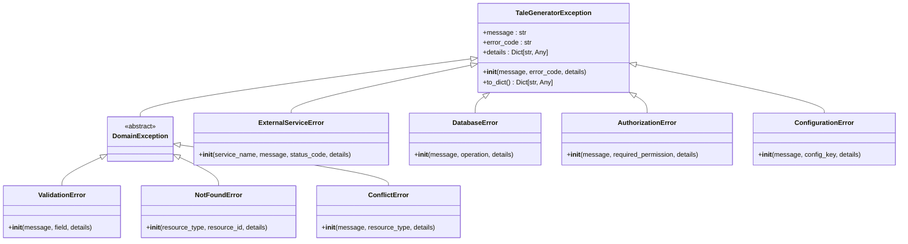
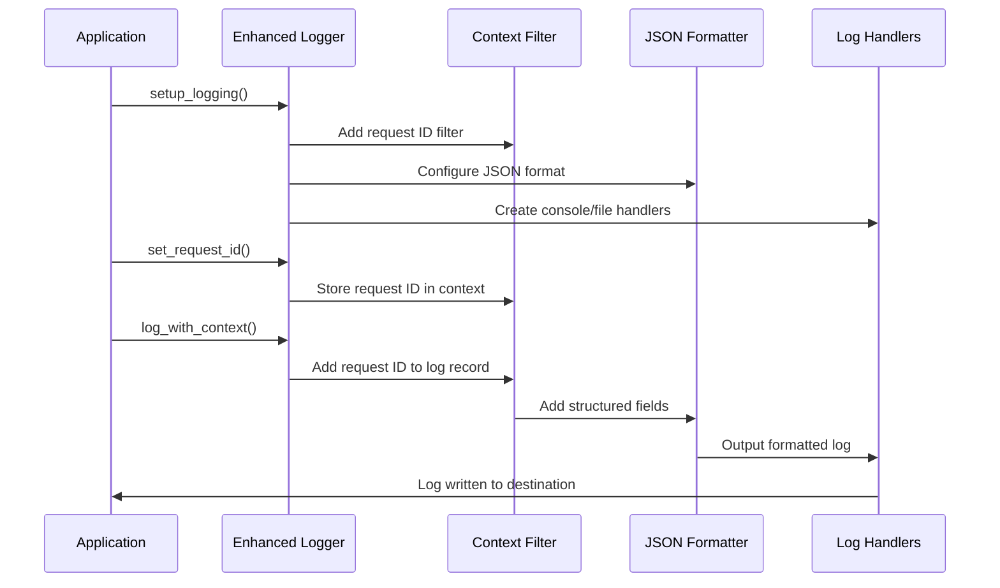
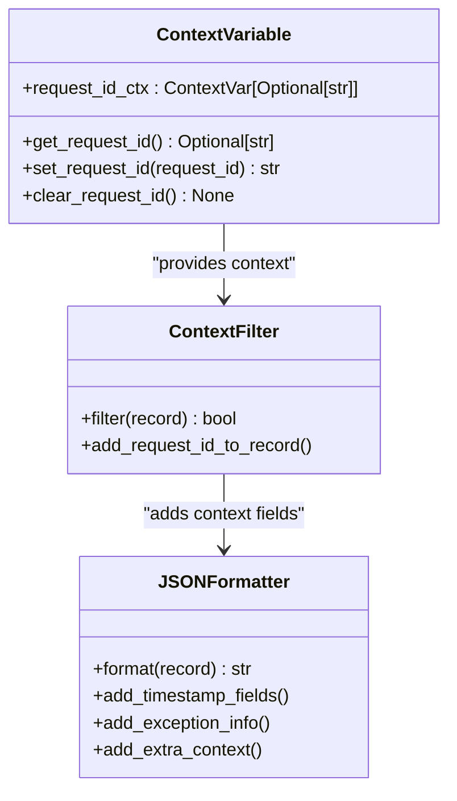
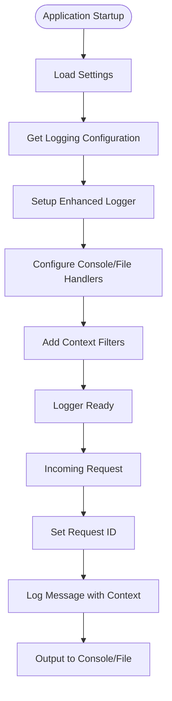
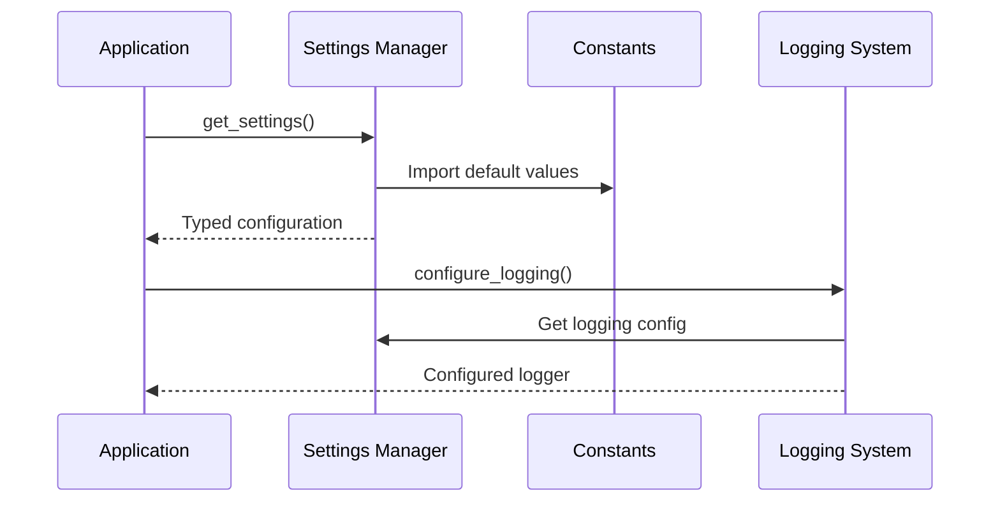

# Core Utilities

<cite>
**Referenced Files in This Document**
- [constants.py](file://src/core/constants.py)
- [exceptions.py](file://src/core/exceptions.py)
- [logging.py](file://src/core/logging.py)
- [logging_config.py](file://src/infrastructure/config/logging_config.py)
- [settings.py](file://src/infrastructure/config/settings.py)
- [test_logging.py](file://test_logging.py)
- [REFACTORING_COMPLETE.md](file://REFACTORING_COMPLETE.md)
</cite>

## Table of Contents
1. [Introduction](#introduction)
2. [Architecture Overview](#architecture-overview)
3. [Constants Module](#constants-module)
4. [Exception Hierarchy](#exception-hierarchy)
5. [Logging System](#logging-system)
6. [Integration Patterns](#integration-patterns)
7. [Best Practices](#best-practices)
8. [Common Issues and Solutions](#common-issues-and-solutions)
9. [Extension Guidelines](#extension-guidelines)
10. [Conclusion](#conclusion)

## Introduction

The Core Utilities module serves as the foundational layer of the Tale Generator application, providing essential cross-cutting concerns that enable consistent, maintainable, and observable code throughout the entire system. This module establishes the shared foundation across all architectural layers, ensuring uniformity in error handling, configuration management, and logging practices.

The module consists of three primary components: constants.py for centralized configuration values, exceptions.py for a comprehensive error handling hierarchy, and logging.py for structured, contextual logging capabilities. These utilities work together to provide the scaffolding that supports the application's layered architecture while maintaining clean separation of concerns.

**Section sources**
- [REFACTORING_COMPLETE.md](file://REFACTORING_COMPLETE.md#L28-L43)

## Architecture Overview

The Core Utilities module operates as a cross-cutting foundation that supports all other layers in the Tale Generator architecture. It follows the principle of being the lowest-level module, providing essential services without depending on higher-level abstractions.



**Diagram sources**
- [constants.py](file://src/core/constants.py#L1-L38)
- [exceptions.py](file://src/core/exceptions.py#L1-L237)
- [logging.py](file://src/core/logging.py#L1-L180)
- [settings.py](file://src/infrastructure/config/settings.py#L1-L169)

This architecture ensures that all layers can access these fundamental utilities without creating circular dependencies or violating the layered architecture principles.

**Section sources**
- [REFACTORING_COMPLETE.md](file://REFACTORING_COMPLETE.md#L107-L136)

## Constants Module

The constants.py module centralizes all magic values and configuration defaults used throughout the application, providing a single source of truth for system-wide parameters.

### Core Constants Structure



**Diagram sources**
- [constants.py](file://src/core/constants.py#L1-L38)

### Constant Categories

#### Application Metadata
- **APP_NAME**: "Tale Generator" - Application identifier
- **APP_VERSION**: "0.1.0" - Semantic versioning
- **APP_DESCRIPTION**: Descriptive text for API documentation
- **DEFAULT_SCHEMA**: "tales" - Database schema name
- **STORAGE_BUCKET**: "tales" - Cloud storage bucket identifier
- **CORS_ALLOW_ORIGINS**: ["*"] - Cross-origin request policies

#### Performance Configuration
- **READING_SPEED_WPM**: 150 - Words per minute for audio generation
- **DEFAULT_STORY_LENGTH_MINUTES**: 5 - Standard story duration
- **DEFAULT_MAX_TOKENS**: 1000 - Maximum tokens for AI generation
- **DEFAULT_TEMPERATURE**: 0.7 - AI creativity balance

#### Validation Rules
- **MIN_RATING**: 1 - Minimum story rating
- **MAX_RATING**: 10 - Maximum story rating

#### Retry Behavior
- **DEFAULT_MAX_RETRIES**: 3 - Maximum retry attempts
- **DEFAULT_RETRY_DELAY**: 1.0 - Initial delay between retries

#### Logging Configuration
- **DEFAULT_LOG_LEVEL**: "INFO" - Default logging verbosity
- **LOG_FORMAT**: Standard log format string

### Benefits of Centralized Constants

1. **Single Source of Truth**: Eliminates duplicated values across the codebase
2. **Consistency**: Ensures uniform behavior across all modules
3. **Maintainability**: Changes propagate automatically to all consumers
4. **Type Safety**: Uses Final types for compile-time validation
5. **Documentation**: Embedded in the module docstring

**Section sources**
- [constants.py](file://src/core/constants.py#L1-L38)

## Exception Hierarchy

The exceptions.py module implements a comprehensive, hierarchical exception system that enables consistent error handling and meaningful API responses throughout the application.

### Exception Hierarchy Architecture



**Diagram sources**
- [exceptions.py](file://src/core/exceptions.py#L6-L237)

### Exception Categories and Use Cases

#### Base Exception Classes

**TaleGeneratorException**
- **Purpose**: Root exception for all Tale Generator errors
- **Key Features**: Standardized error codes, detailed context, API-compatible serialization
- **Usage**: Base class for all custom exceptions

**DomainException**
- **Purpose**: Base class for business logic errors
- **Usage**: Domain-layer specific exceptions inherit from this

#### Business Logic Exceptions

**ValidationError**
- **Purpose**: Input validation failures
- **Fields**: `field` parameter for specific validation targets
- **Example**: Invalid child age, malformed story requests

**NotFoundError**
- **Purpose**: Resource not found scenarios
- **Fields**: `resource_type` and `resource_id` for context
- **Example**: Child not found, story not found by ID

**ConflictError**
- **Purpose**: Resource conflict scenarios
- **Fields**: `resource_type` for conflict identification
- **Example**: Duplicate child creation, concurrent updates

#### Infrastructure Exceptions

**ExternalServiceError**
- **Purpose**: Third-party service failures
- **Fields**: `service_name`, `status_code` for service context
- **Example**: OpenRouter API timeouts, ElevenLabs service unavailability

**DatabaseError**
- **Purpose**: Database operation failures
- **Fields**: `operation` for failure context
- **Example**: Connection timeouts, constraint violations

**AuthorizationError**
- **Purpose**: Access control failures
- **Fields**: `required_permission` for permission context
- **Example**: Insufficient privileges, unauthorized access

**ConfigurationError**
- **Purpose**: Application configuration issues
- **Fields**: `config_key` for problematic settings
- **Example**: Missing API keys, invalid database URLs

### Exception Serialization for APIs

Each exception provides a standardized `to_dict()` method that produces JSON-compatible error responses:

```python
{
    "error": "NOT_FOUND",
    "message": "Child with ID 'abc123' not found",
    "details": {
        "resource_type": "Child",
        "resource_id": "abc123"
    }
}
```

### Error Code Strategy

The exception system uses intelligent error code assignment:
- **Explicit Codes**: Manually specified error codes (e.g., "NOT_FOUND")
- **Automatic Codes**: Falls back to class name when not specified
- **Consistency**: Enables API clients to handle specific error types programmatically

**Section sources**
- [exceptions.py](file://src/core/exceptions.py#L1-L237)

## Logging System

The logging.py module provides an enhanced logging framework built on Python's standard logging library, featuring request context tracking, structured output, and flexible configuration options.

### Logging Architecture



**Diagram sources**
- [logging.py](file://src/core/logging.py#L1-L180)

### Core Logging Components

#### Context Variable Management
The logging system uses Python's `contextvars` to track request contexts across asynchronous operations:



**Diagram sources**
- [logging.py](file://src/core/logging.py#L10-L180)

#### Request Context Tracking
- **Automatic Generation**: Generates UUID v4 request IDs when not provided
- **Thread Safety**: Uses context variables for thread-local storage
- **Propagation**: Maintains context across async/await boundaries
- **Cleanup**: Provides explicit context clearing mechanisms

#### Structured Logging Formats
The system supports multiple output formats:

**JSON Format** (Production)
```json
{
    "timestamp": "2024-01-01T12:00:00.000Z",
    "level": "INFO",
    "logger": "tale_generator.domain.entities",
    "message": "Child created successfully",
    "request_id": "550e8400-e29b-41d4-a716-446655440000"
}
```

**Text Format** (Development)
```
2024-01-01 12:00:00,000 - tale_generator.domain.entities - INFO - [550e8400-e29b-41d4-a716-446655440000] - Child created successfully
```

### Logging Configuration Integration

The logging system integrates seamlessly with the application's configuration management:



**Diagram sources**
- [logging_config.py](file://src/infrastructure/config/logging_config.py#L1-L16)
- [settings.py](file://src/infrastructure/config/settings.py#L98-L115)

### Advanced Logging Features

#### Context-Aware Logging
The `log_with_context()` function enables adding arbitrary context to log messages:

```python
logger = get_logger("story_service")
log_with_context(logger, logging.INFO, "Processing story", 
                child_id="123", story_length=5, language="en")
```

#### Exception Handling
Built-in exception capture and structured reporting:
- Automatic exception traceback inclusion
- Structured exception data preservation
- Clean separation between error context and stack traces

#### Handler Management
- **Console Handler**: Standard output with configurable formatting
- **File Handler**: Optional file-based logging with rotation support
- **Multiple Destinations**: Simultaneous console and file output
- **Level Control**: Per-handler log level configuration

**Section sources**
- [logging.py](file://src/core/logging.py#L1-L180)
- [logging_config.py](file://src/infrastructure/config/logging_config.py#L1-L16)

## Integration Patterns

The Core Utilities integrate with the application through well-defined patterns that maintain architectural boundaries while providing maximum flexibility.

### Configuration Integration



**Diagram sources**
- [settings.py](file://src/infrastructure/config/settings.py#L5-L13)
- [logging_config.py](file://src/infrastructure/config/logging_config.py#L7-L15)

### Usage Patterns Across Layers

#### Domain Layer Integration
Domain entities and services import constants for validation and configuration:

```python
# From domain/entities.py
from src.core.constants import MIN_RATING, MAX_RATING, READING_SPEED_WPM
from src.core.exceptions import ValidationError
```

#### Application Layer Integration
Use cases leverage exceptions for business logic error handling:

```python
# From application/use_cases/generate_story.py
from src.core.exceptions import ExternalServiceError, ValidationError
from src.core.logging import get_logger
```

#### Infrastructure Layer Integration
Infrastructure components use logging for operational visibility:

```python
# From infrastructure/config/logging_config.py
from src.core.logging import setup_logging
from src.infrastructure.config.settings import get_settings
```

### Dependency Injection Compatibility

The utilities are designed to work seamlessly with dependency injection patterns:

- **Singleton Pattern**: Settings and logging configurations are managed as singletons
- **Factory Functions**: `setup_logging()` and `get_settings()` provide controlled instantiation
- **Interface Abstraction**: No direct dependencies on specific implementations

**Section sources**
- [settings.py](file://src/infrastructure/config/settings.py#L1-L169)
- [logging_config.py](file://src/infrastructure/config/logging_config.py#L1-L16)

## Best Practices

### Constants Management

#### Naming Conventions
- Use UPPER_CASE for all constant names
- Prefix related constants with category (e.g., `DEFAULT_`, `MAX_`, `MIN_`)
- Group related constants logically within categories

#### Type Safety
- Always use `Final` type annotations
- Provide comprehensive docstrings for each constant
- Use appropriate types (str, int, float, list, dict)

#### Usage Guidelines
- Import constants at the module level, not within functions
- Avoid hardcoding values outside the constants module
- Use constants for all configuration values, not just "magic numbers"

### Exception Handling

#### Exception Creation
- Use specific exception types for specific error conditions
- Provide meaningful error messages for end users
- Include relevant context in the `details` parameter
- Use error codes for programmatic error handling

#### Error Propagation
- Catch exceptions at appropriate boundaries
- Transform exceptions when crossing layer boundaries
- Preserve original exception information when wrapping
- Use exception chaining for context preservation

### Logging Practices

#### Log Level Selection
- **DEBUG**: Development-specific information
- **INFO**: General operational information
- **WARNING**: Potentially harmful situations
- **ERROR**: Error conditions requiring attention
- **CRITICAL**: System-wide catastrophic failures

#### Context Management
- Always set request IDs for web requests
- Include relevant business context in log messages
- Use structured logging for machine-readable logs
- Avoid logging sensitive information

#### Performance Considerations
- Use lazy evaluation for expensive log message construction
- Consider log level checks before expensive operations
- Use structured logging for production environments
- Implement log rotation for long-running applications

## Common Issues and Solutions

### Missing Error Codes

**Problem**: Exceptions without explicit error codes fall back to class names, which may not be ideal for API consumers.

**Solution**: Always specify meaningful error codes for public exceptions:
```python
# Good
raise ValidationError("Invalid age", error_code="INVALID_AGE")

# Avoid
raise ValidationError("Invalid age")  # Falls back to "ValidationError"
```

### Inconsistent Log Levels

**Problem**: Mixed log levels within the same context create confusion.

**Solution**: Establish clear log level guidelines:
- Use `DEBUG` for detailed development information
- Use `INFO` for operational milestones
- Use `WARNING` for recoverable issues
- Use `ERROR` for failed operations
- Use `CRITICAL` for system-wide failures

### Configuration Drift

**Problem**: Different parts of the application use different configuration values.

**Solution**: Centralize configuration through constants:
```python
# Instead of:
DEFAULT_TIMEOUT = 30
# Use:
from src.core.constants import DEFAULT_TIMEOUT
```

### Context Loss in Async Operations

**Problem**: Request context is lost in asynchronous code paths.

**Solution**: Properly propagate context using the logging utilities:
```python
# Set context at the beginning of async operations
from src.core.logging import set_request_id
request_id = set_request_id()

# Context is automatically propagated through async/await
```

### Memory Leaks in Long-Running Processes

**Problem**: Context variables accumulate over time in long-running applications.

**Solution**: Implement proper context cleanup:
```python
# Clear context when operations complete
from src.core.logging import clear_request_id
clear_request_id()
```

## Extension Guidelines

### Adding New Constants

When extending the constants module:

1. **Category Organization**: Add new constants to appropriate existing categories
2. **Type Annotations**: Always use `Final` type annotations
3. **Documentation**: Add comprehensive docstrings
4. **Validation**: Consider adding validation logic for complex values
5. **Testing**: Ensure new constants are tested in relevant contexts

### Extending the Exception Hierarchy

When adding new exception types:

1. **Hierarchy Placement**: Choose the appropriate base exception class
2. **Error Code Strategy**: Decide whether to use automatic or explicit error codes
3. **Serialization**: Ensure `to_dict()` provides meaningful information
4. **Usage Documentation**: Document when and how to use the new exception
5. **API Impact**: Consider the impact on API error responses

### Enhancing the Logging System

When extending logging capabilities:

1. **Backward Compatibility**: Maintain existing interfaces
2. **Performance**: Consider the impact on logging performance
3. **Configuration**: Provide sensible defaults for new features
4. **Documentation**: Document new logging features thoroughly
5. **Testing**: Ensure new features are well-tested

### Maintaining Layer Separation

To prevent layer coupling when extending utilities:

1. **Avoid Dependencies**: Core utilities should not depend on higher-level abstractions
2. **Interface Contracts**: Define clear interfaces for extension points
3. **Dependency Injection**: Use DI patterns for flexible configuration
4. **Testing Isolation**: Maintain test isolation across layers
5. **Documentation**: Clearly document extension points and their usage

## Conclusion

The Core Utilities module serves as the essential foundation that enables the Tale Generator application's architectural excellence. Through its carefully designed constants, exception hierarchy, and logging system, it provides the consistency, maintainability, and observability required for a production-ready system.

The module's cross-cutting nature ensures that all architectural layers benefit from unified approaches to configuration, error handling, and monitoring. Its integration with the application's configuration management and dependency injection patterns demonstrates how foundational utilities can support complex architectural requirements while remaining simple and focused.

The comprehensive exception hierarchy provides developers with clear, typed error handling options that translate directly to meaningful API responses. The enhanced logging system offers both human-readable and machine-readable log formats, enabling effective debugging and monitoring in development and production environments.

Through careful adherence to best practices and thoughtful extension guidelines, the Core Utilities module continues to serve as a reliable foundation for the Tale Generator application's ongoing evolution and growth.

**Section sources**
- [REFACTORING_COMPLETE.md](file://REFACTORING_COMPLETE.md#L1-L421)