# Domain Layer

<cite>
**Referenced Files in This Document**
- [entities.py](file://src/domain/entities.py)
- [value_objects.py](file://src/domain/value_objects.py)
- [base.py](file://src/domain/repositories/base.py)
- [story_repository.py](file://src/domain/repositories/story_repository.py)
- [child_repository.py](file://src/domain/repositories/child_repository.py)
- [hero_repository.py](file://src/domain/repositories/hero_repository.py)
- [story_service.py](file://src/domain/services/story_service.py)
- [audio_service.py](file://src/domain/services/audio_service.py)
- [prompt_service.py](file://src/domain/services/prompt_service.py)
- [constants.py](file://src/core/constants.py)
- [exceptions.py](file://src/core/exceptions.py)
- [REFACTORING_COMPLETE.md](file://REFACTORING_COMPLETE.md)
</cite>

## Table of Contents
1. [Introduction](#introduction)
2. [Domain Layer Architecture](#domain-layer-architecture)
3. [Core Entities](#core-entities)
4. [Value Objects](#value-objects)
5. [Domain Services](#domain-services)
6. [Repository Interfaces](#repository-interfaces)
7. [Business Rules and Invariants](#business-rules-and-invariants)
8. [Error Handling](#error-handling)
9. [Testing Strategy](#testing-strategy)
10. [Best Practices](#best-practices)
11. [Common Issues and Solutions](#common-issues-and-solutions)
12. [Extending Domain Logic](#extending-domain-logic)

## Introduction

The Domain Layer serves as the heart of the Tale Generator application's Clean Architecture, encapsulating the core business logic and domain knowledge. It represents the purest form of the application's functionality, free from external concerns like databases, APIs, or infrastructure concerns. This layer defines the fundamental business rules, enforces invariants, and maintains the integrity of the domain model through well-defined entities, value objects, and domain services.

The Domain Layer follows Domain-Driven Design (DDD) principles, ensuring that the software structure reflects the business domain accurately. It establishes clear boundaries between different concerns and provides a stable foundation for the entire application architecture.

## Domain Layer Architecture

The Domain Layer is structured around four primary building blocks that work together to create a cohesive business logic container:

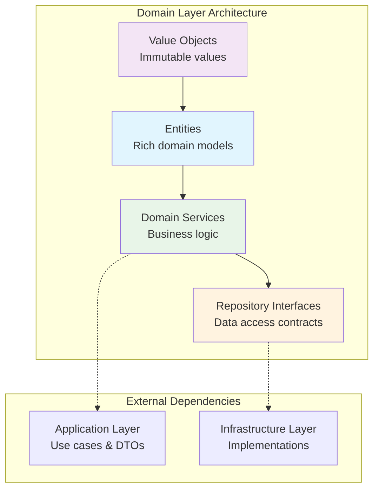

**Diagram sources**
- [entities.py](file://src/domain/entities.py#L1-L210)
- [value_objects.py](file://src/domain/value_objects.py#L1-L189)
- [story_service.py](file://src/domain/services/story_service.py#L1-L146)
- [base.py](file://src/domain/repositories/base.py#L1-L56)

**Section sources**
- [REFACTORING_COMPLETE.md](file://REFACTORING_COMPLETE.md#L108-L136)

## Core Entities

Entities represent the core domain objects that carry identity and maintain state throughout their lifecycle. They encapsulate both data and behavior, enforcing business rules and maintaining invariants.

### Story Entity

The Story entity is the central domain object, representing a complete generated story with rich behavior and comprehensive metadata.

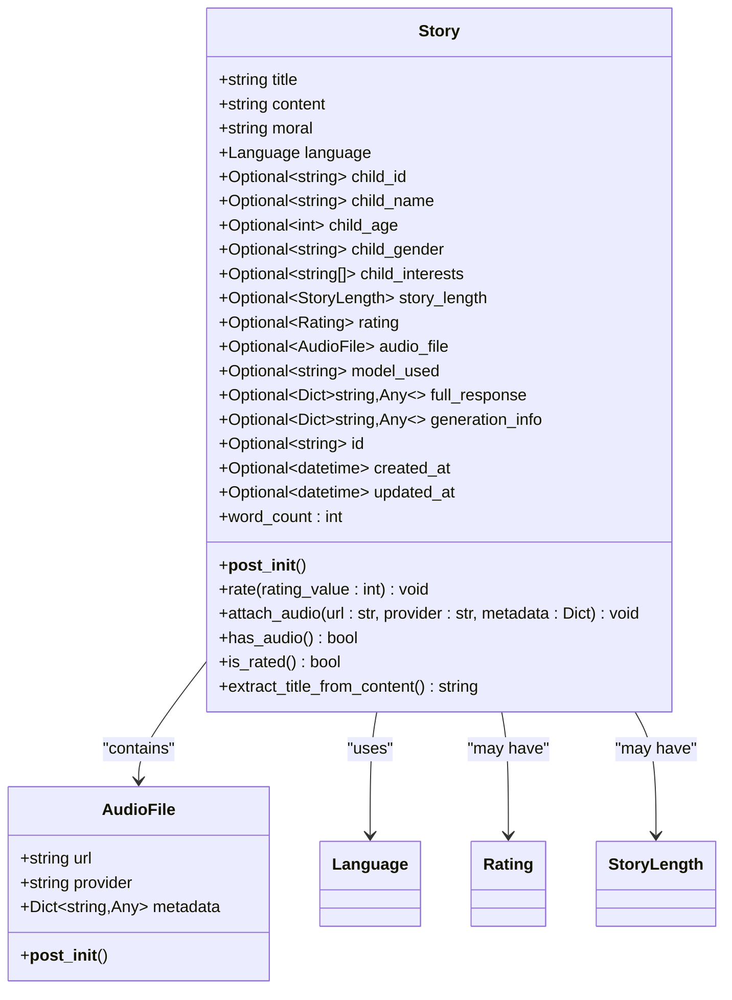

**Diagram sources**
- [entities.py](file://src/domain/entities.py#L114-L210)

Key characteristics of the Story entity:
- **Rich Behavior**: Methods like `rate()`, `attach_audio()`, and `has_audio()` encapsulate business logic
- **Validation**: Built-in validation through `__post_init__()` ensures data integrity
- **State Management**: Tracks creation and modification timestamps
- **Composition**: Contains an AudioFile entity for narrative audio attachments

### Child Entity

The Child entity represents a child profile with behavioral methods for managing interests and validation rules.

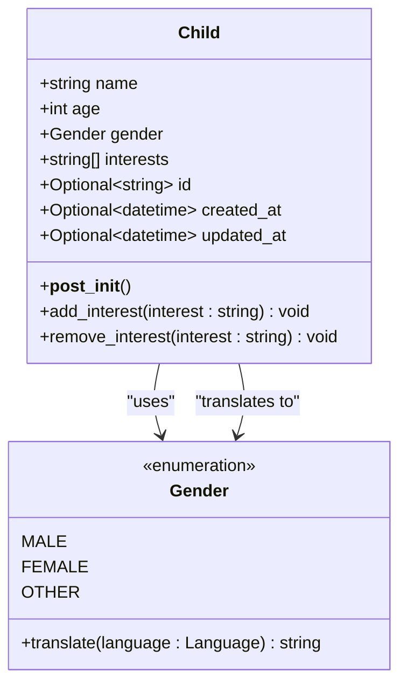

**Diagram sources**
- [entities.py](file://src/domain/entities.py#L10-L58)
- [value_objects.py](file://src/domain/value_objects.py#L46-L74)

### Hero Entity

The Hero entity represents a story hero character with comprehensive attributes and language-specific behavior.

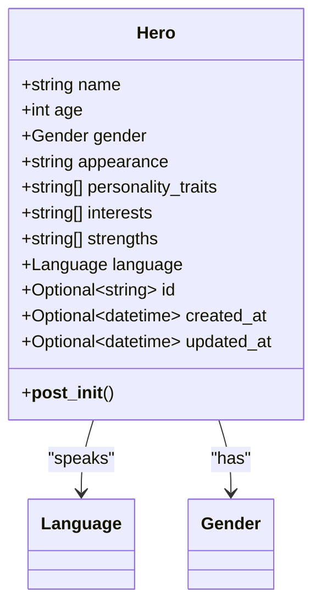

**Diagram sources**
- [entities.py](file://src/domain/entities.py#L60-L95)

**Section sources**
- [entities.py](file://src/domain/entities.py#L1-L210)

## Value Objects

Value Objects represent immutable values that describe entities without identity. They encapsulate business logic and provide type safety while ensuring immutability.

### Language Value Object

The Language value object provides multi-language support with translation capabilities and validation.

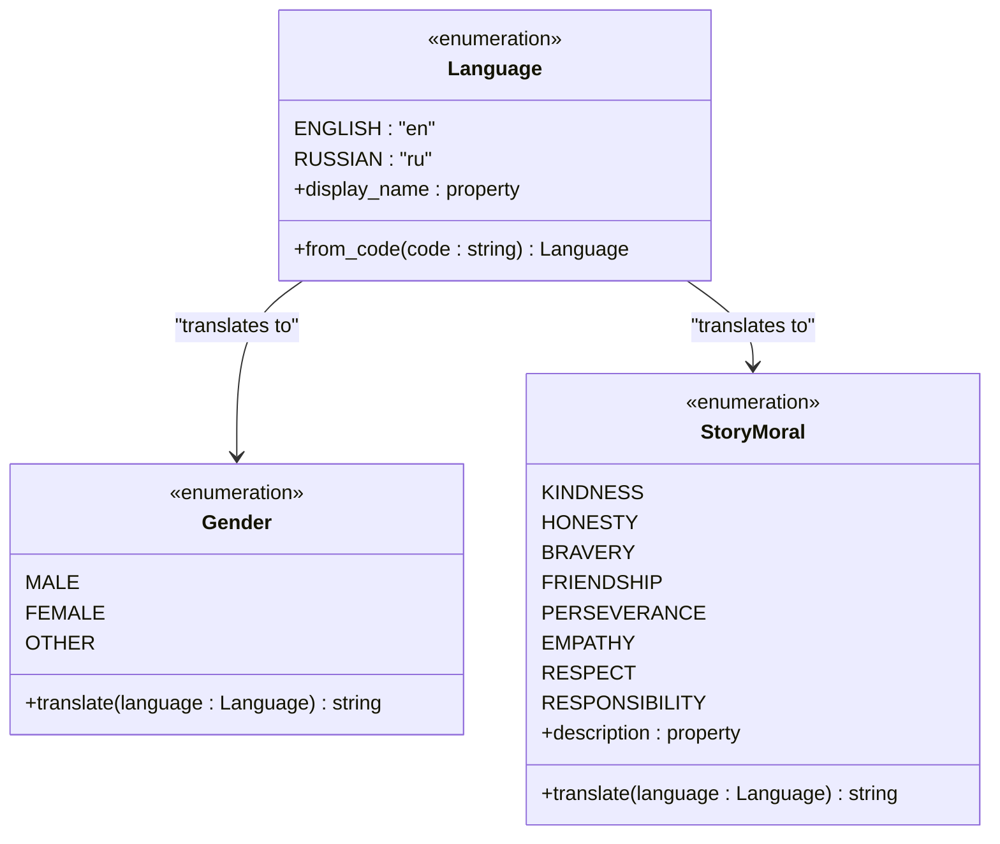

**Diagram sources**
- [value_objects.py](file://src/domain/value_objects.py#L10-L44)
- [value_objects.py](file://src/domain/value_objects.py#L46-L74)
- [value_objects.py](file://src/domain/value_objects.py#L76-L134)

### Rating Value Object

The Rating value object ensures valid rating values between 1 and 10 with immutability guarantees.

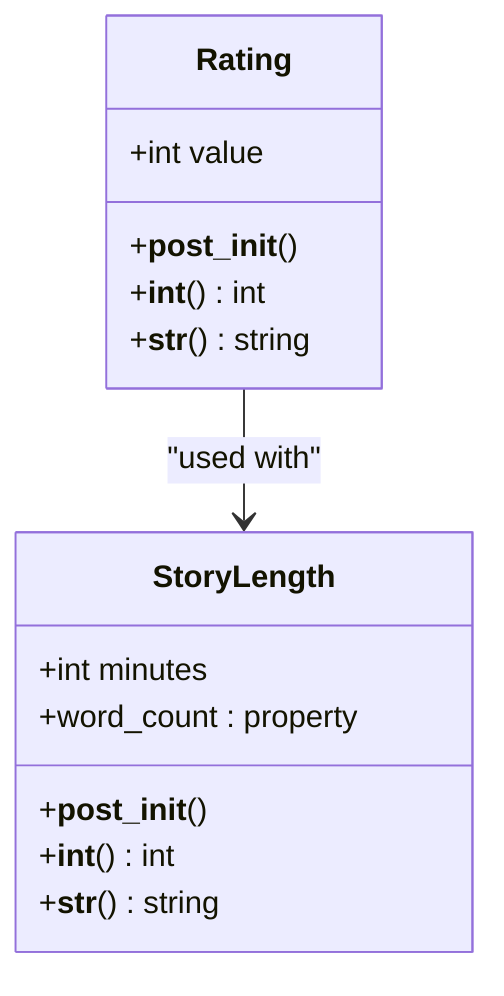

**Diagram sources**
- [value_objects.py](file://src/domain/value_objects.py#L136-L189)

### Key Characteristics of Value Objects

1. **Immutability**: All value objects are frozen with `@dataclass(frozen=True)`
2. **Validation**: Built-in validation through `__post_init__()` methods
3. **Translation**: Language-aware translation capabilities
4. **Type Safety**: Strong typing prevents invalid values
5. **Behavior**: Encapsulated business logic (e.g., word count calculation)

**Section sources**
- [value_objects.py](file://src/domain/value_objects.py#L1-L189)

## Domain Services

Domain Services orchestrate complex business logic that doesn't naturally fit within entities or value objects. They coordinate multiple domain objects and implement cross-cutting concerns.

### StoryService

The StoryService manages the complete story lifecycle, from creation to rating and audio attachment.

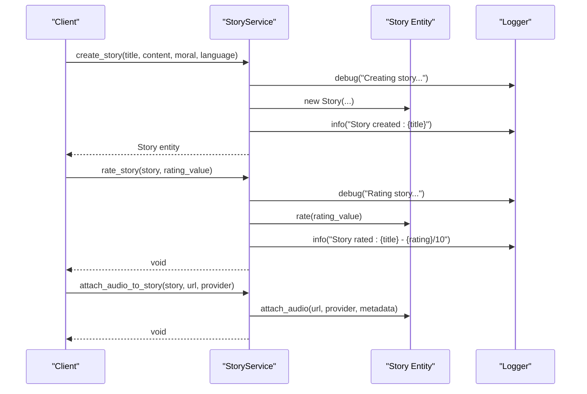

**Diagram sources**
- [story_service.py](file://src/domain/services/story_service.py#L13-L146)

### AudioService

The AudioService handles audio generation workflows, coordinating with voice providers and managing audio file entities.

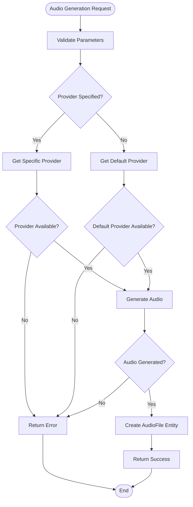

**Diagram sources**
- [audio_service.py](file://src/domain/services/audio_service.py#L35-L98)

### PromptService

The PromptService generates language-specific story prompts with sophisticated translation capabilities.

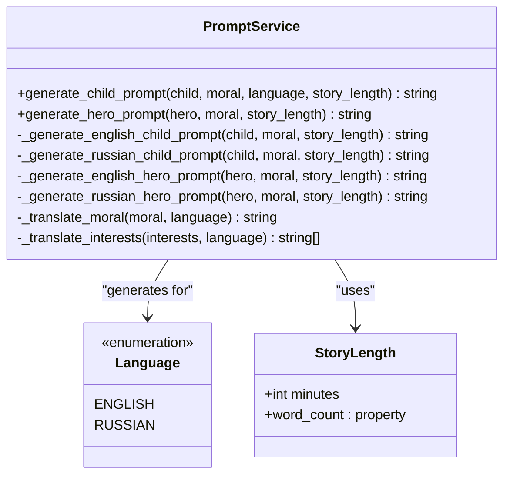

**Diagram sources**
- [prompt_service.py](file://src/domain/services/prompt_service.py#L11-L207)

**Section sources**
- [story_service.py](file://src/domain/services/story_service.py#L1-L146)
- [audio_service.py](file://src/domain/services/audio_service.py#L1-L127)
- [prompt_service.py](file://src/domain/services/prompt_service.py#L1-L207)

## Repository Interfaces

Repository interfaces define abstract contracts for data access operations without revealing implementation details. They enable dependency inversion and facilitate testing through interface-based design.

### Base Repository Interface

The generic Repository interface provides a foundation for all domain-specific repositories.

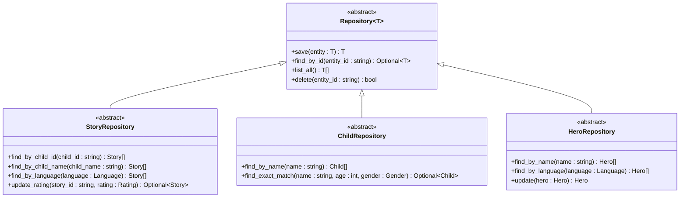

**Diagram sources**
- [base.py](file://src/domain/repositories/base.py#L9-L56)
- [story_repository.py](file://src/domain/repositories/story_repository.py#L10-L61)
- [child_repository.py](file://src/domain/repositories/child_repository.py#L10-L38)
- [hero_repository.py](file://src/domain/repositories/hero_repository.py#L10-L48)

### Repository Contract Specifications

Each repository defines specific operations relevant to its domain entity:

| Repository | Primary Operations | Purpose |
|------------|-------------------|---------|
| **StoryRepository** | `find_by_child_id`, `find_by_child_name`, `find_by_language`, `update_rating` | Story-centric queries and updates |
| **ChildRepository** | `find_by_name`, `find_exact_match` | Child profile management |
| **HeroRepository** | `find_by_name`, `find_by_language`, `update` | Hero character management |

**Section sources**
- [base.py](file://src/domain/repositories/base.py#L1-L56)
- [story_repository.py](file://src/domain/repositories/story_repository.py#L1-L61)
- [child_repository.py](file://src/domain/repositories/child_repository.py#L1-L38)
- [hero_repository.py](file://src/domain/repositories/hero_repository.py#L1-L48)

## Business Rules and Invariants

The Domain Layer enforces critical business rules and maintains data integrity through comprehensive validation and invariant enforcement.

### Entity Validation Patterns

Each entity implements validation through `__post_init__()` methods, ensuring data integrity at creation time:

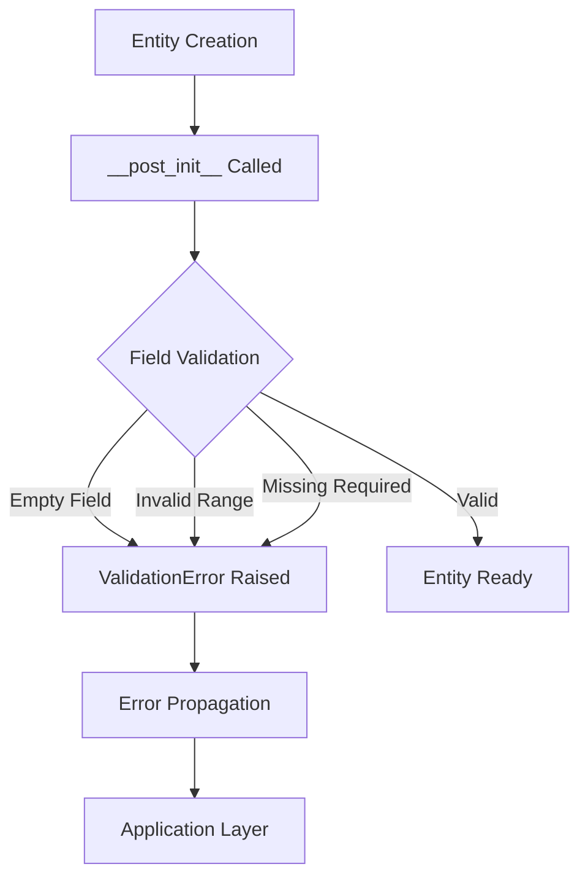

**Diagram sources**
- [entities.py](file://src/domain/entities.py#L22-L36)
- [entities.py](file://src/domain/entities.py#L76-L95)
- [entities.py](file://src/domain/entities.py#L137-L147)

### Validation Examples

**Child Entity Validation**:
- Name cannot be empty or whitespace
- Age must be between 1 and 18
- Must have at least one interest

**Story Entity Validation**:
- Title cannot be empty
- Content cannot be empty
- Moral cannot be empty

**Rating Validation**:
- Value must be between 1 and 10
- Immutable once set

### State Consistency Guarantees

The Domain Layer ensures state consistency through several mechanisms:

1. **Immutable Value Objects**: Prevent accidental state changes
2. **Validation on Creation**: Fail-fast validation during entity construction
3. **Behavioral Encapsulation**: Business logic enforced through methods
4. **Timestamp Management**: Automatic tracking of creation and modification times

**Section sources**
- [entities.py](file://src/domain/entities.py#L22-L36)
- [entities.py](file://src/domain/entities.py#L76-L95)
- [entities.py](file://src/domain/entities.py#L137-L147)
- [value_objects.py](file://src/domain/value_objects.py#L141-L148)

## Error Handling

The Domain Layer implements a comprehensive exception hierarchy that provides meaningful error information while maintaining clean separation of concerns.

### Exception Hierarchy

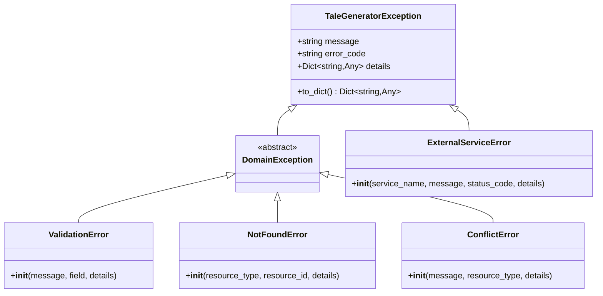

**Diagram sources**
- [exceptions.py](file://src/core/exceptions.py#L6-L237)

### Error Handling Patterns

**Validation Errors**: Specific field-level validation with detailed context
**Not Found Errors**: Resource identification with type information
**Conflict Errors**: Resource conflicts with type and context details
**External Service Errors**: Service-specific errors with status codes

### Error Propagation Strategy

Errors flow upward through the architecture layers, maintaining domain purity while providing rich error information for higher-level handling.

**Section sources**
- [exceptions.py](file://src/core/exceptions.py#L1-L237)

## Testing Strategy

The Domain Layer's interface-based design enables comprehensive testing strategies that promote maintainability and reliability.

### Testing Approaches

**Unit Testing**: Individual domain objects tested in isolation
**Integration Testing**: Domain services tested with mocked repositories
**Behavioral Testing**: Entity behavior verified through method calls
**Validation Testing**: Edge cases and boundary conditions tested

### Testability Benefits

1. **Interface-Based Design**: Enables easy mocking and dependency injection
2. **Pure Functions**: Business logic separated from side effects
3. **Deterministic Behavior**: Consistent results for given inputs
4. **Comprehensive Coverage**: All domain logic paths testable

### Testing Best Practices

- Test entity validation logic independently
- Verify domain service orchestration
- Mock external dependencies completely
- Test error conditions thoroughly

## Best Practices

### Domain Logic Encapsulation

1. **Single Responsibility**: Each entity and service has a clear, focused purpose
2. **Behavioral Encapsulation**: Business logic embedded within entities
3. **Immutable Values**: Value objects prevent accidental mutations
4. **Validation First**: Fail-fast validation at creation time

### Extension Guidelines

1. **Interface Preservation**: New features extend interfaces, don't modify them
2. **Backward Compatibility**: Changes don't break existing functionality
3. **Incremental Enhancement**: New capabilities added through composition
4. **Domain Purity**: External concerns kept separate from domain logic

### Code Organization Principles

- **Logical Grouping**: Related functionality grouped together
- **Clear Boundaries**: Well-defined interfaces between components
- **Consistent Naming**: Predictable naming conventions
- **Documentation**: Comprehensive docstrings and examples

## Common Issues and Solutions

### Domain State Consistency

**Issue**: Inconsistent entity state after operations
**Solution**: Implement comprehensive validation and use immutable value objects

**Issue**: Race conditions in concurrent operations
**Solution**: Use optimistic locking or transactional operations at the repository level

### Validation Failures

**Issue**: Complex validation logic spread across use cases
**Solution**: Move validation to entity constructors and value object initialization

**Issue**: Inconsistent error messages
**Solution**: Use the centralized exception hierarchy for consistent error reporting

### Performance Considerations

**Issue**: N+1 query problems in domain services
**Solution**: Implement batch operations and caching strategies

**Issue**: Memory usage with large datasets
**Solution**: Use lazy loading and pagination in repository implementations

## Extending Domain Logic

### Adding New Entities

When adding new domain entities:

1. **Define Entity Structure**: Create dataclass with appropriate fields
2. **Implement Validation**: Add `__post_init__()` validation logic
3. **Add Behavioral Methods**: Encapsulate business logic within the entity
4. **Create Repository Interface**: Define data access contract
5. **Update Domain Services**: Coordinate new entity behavior

### Enhancing Value Objects

To extend value objects:

1. **Maintain Immutability**: Preserve `frozen=True` decorator
2. **Add Validation**: Implement comprehensive validation logic
3. **Extend Behavior**: Add domain-specific methods
4. **Ensure Translation**: Support multi-language scenarios

### Expanding Domain Services

When enhancing domain services:

1. **Coordinate Entities**: Orchestrate complex business workflows
2. **Maintain Purity**: Keep business logic separate from infrastructure
3. **Handle Errors**: Use appropriate exception types
4. **Support Composition**: Enable service combinations

### Repository Interface Evolution

Repository interfaces should evolve through:

1. **Interface Addition**: New methods for additional queries
2. **Generic Enhancement**: Improved type safety and flexibility
3. **Contract Expansion**: Broader functionality without breaking changes
4. **Performance Optimization**: Efficient query patterns

The Domain Layer's design ensures that extensions maintain the architectural integrity while providing the flexibility needed for evolving business requirements. The clear separation of concerns, comprehensive validation, and robust error handling create a solid foundation for application growth and maintenance.