# Audio Service

<cite>
**Referenced Files in This Document**
- [audio_service.py](file://src/domain/services/audio_service.py)
- [voice_service.py](file://src/voice_providers/voice_service.py)
- [provider_registry.py](file://src/voice_providers/provider_registry.py)
- [base_provider.py](file://src/voice_providers/base_provider.py)
- [elevenlabs_provider.py](file://src/voice_providers/elevenlabs_provider.py)
- [mock_provider.py](file://src/voice_providers/mock_provider.py)
- [generate_story.py](file://src/application/use_cases/generate_story.py)
- [entities.py](file://src/domain/entities.py)
- [value_objects.py](file://src/domain/value_objects.py)
- [logging.py](file://src/core/logging.py)
- [test_voice_providers.py](file://test_voice_providers.py)
</cite>

## Table of Contents
1. [Introduction](#introduction)
2. [System Architecture](#system-architecture)
3. [Core Components](#core-components)
4. [Audio Generation Workflow](#audio-generation-workflow)
5. [Provider Management](#provider-management)
6. [Error Handling Strategies](#error-handling-strategies)
7. [Configuration and Integration](#configuration-and-integration)
8. [Practical Examples](#practical-examples)
9. [Troubleshooting Guide](#troubleshooting-guide)
10. [Performance Considerations](#performance-considerations)

## Introduction

The AudioService domain service is a sophisticated audio generation orchestration system responsible for converting text content into spoken word audio. Built on a modular provider architecture, it seamlessly coordinates between multiple voice synthesis providers to deliver high-quality audio generation capabilities for bedtime stories.

The service implements a robust workflow that includes provider selection via VoiceProviderRegistry, speech synthesis coordination, result encapsulation in AudioGenerationResult, and comprehensive error handling for various failure scenarios including provider failures and network issues.

## System Architecture

The audio generation system follows a layered architecture with clear separation of concerns:

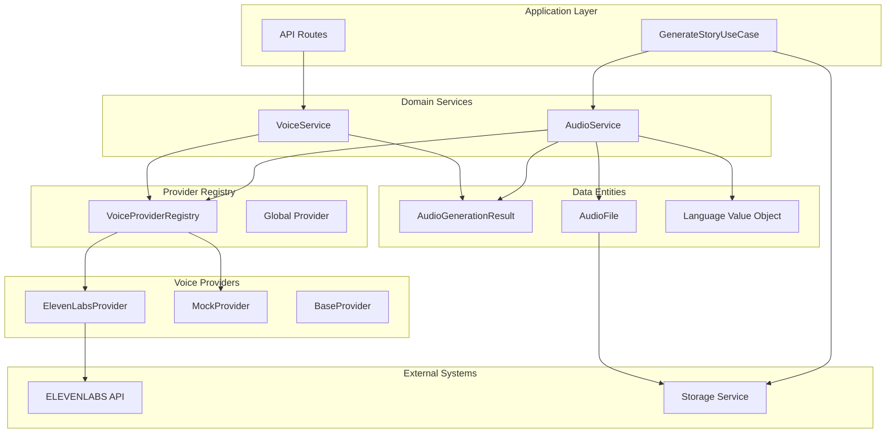

**Diagram sources**
- [audio_service.py](file://src/domain/services/audio_service.py#L23-L127)
- [voice_service.py](file://src/voice_providers/voice_service.py#L25-L236)
- [provider_registry.py](file://src/voice_providers/provider_registry.py#L12-L212)

## Core Components

### AudioService Class

The AudioService serves as the primary domain service for audio generation orchestration, implementing the core business logic for text-to-speech conversion.

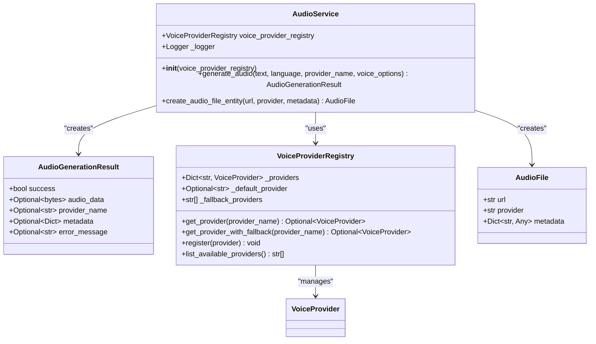

**Diagram sources**
- [audio_service.py](file://src/domain/services/audio_service.py#L23-L127)
- [provider_registry.py](file://src/voice_providers/provider_registry.py#L12-L212)
- [entities.py](file://src/domain/entities.py#L98-L112)

### VoiceService Facade

The VoiceService provides a simplified facade interface for voice generation with automatic provider selection and fallback mechanisms.

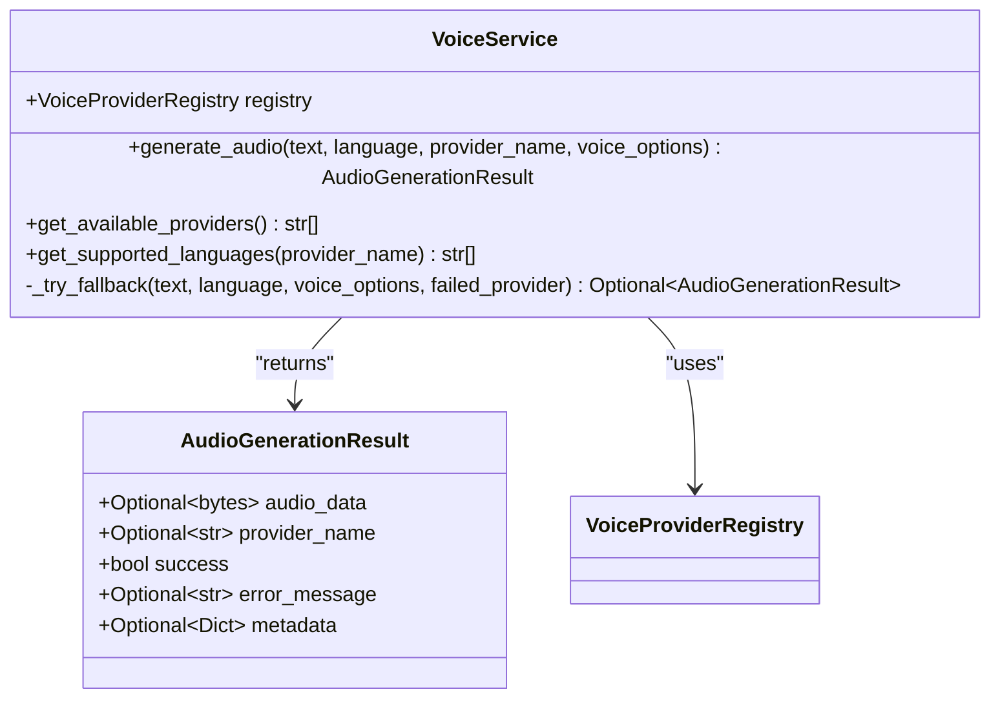

**Diagram sources**
- [voice_service.py](file://src/voice_providers/voice_service.py#L25-L236)

**Section sources**
- [audio_service.py](file://src/domain/services/audio_service.py#L23-L127)
- [voice_service.py](file://src/voice_providers/voice_service.py#L25-L236)

## Audio Generation Workflow

### generate_audio() Method Workflow

The generate_audio() method implements a comprehensive workflow for audio generation with multiple stages of validation, provider selection, and error handling.

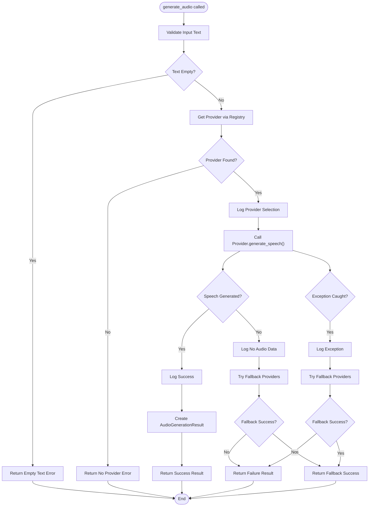

**Diagram sources**
- [audio_service.py](file://src/domain/services/audio_service.py#L35-L104)

### Provider Selection Process

The provider selection process follows a hierarchical approach with fallback mechanisms:

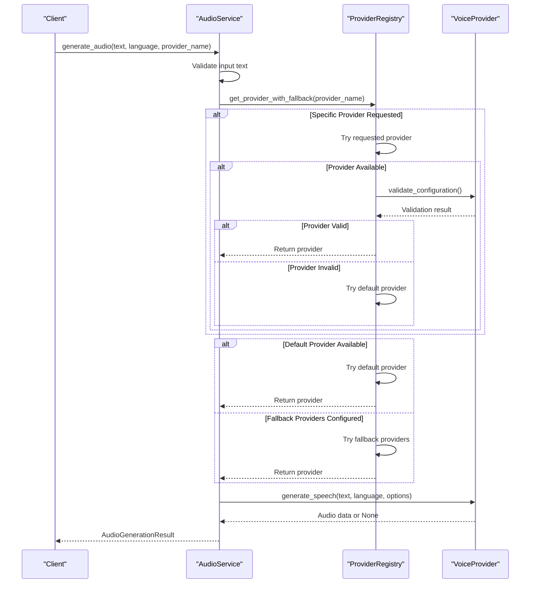

**Diagram sources**
- [audio_service.py](file://src/domain/services/audio_service.py#L56-L71)
- [provider_registry.py](file://src/voice_providers/provider_registry.py#L100-L140)

**Section sources**
- [audio_service.py](file://src/domain/services/audio_service.py#L35-L104)
- [provider_registry.py](file://src/voice_providers/provider_registry.py#L100-L140)

## Provider Management

### VoiceProviderRegistry Architecture

The VoiceProviderRegistry manages multiple voice synthesis providers with sophisticated fallback mechanisms and configuration validation.

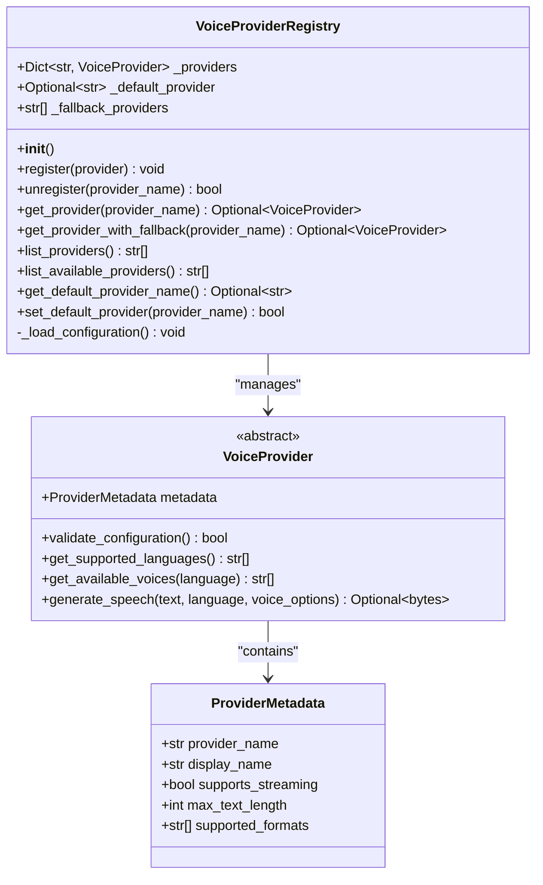

**Diagram sources**
- [provider_registry.py](file://src/voice_providers/provider_registry.py#L12-L212)
- [base_provider.py](file://src/voice_providers/base_provider.py#L28-L97)

### Provider Configuration and Environment Variables

The system supports flexible configuration through environment variables:

| Environment Variable | Purpose | Default Value | Description |
|---------------------|---------|---------------|-------------|
| `DEFAULT_VOICE_PROVIDER` | Primary Provider | `"elevenlabs"` | Default voice provider to use |
| `VOICE_PROVIDER_FALLBACK` | Fallback Providers | `""` | Comma-separated fallback providers |
| `ELEVENLABS_API_KEY` | ElevenLabs API | Required | API key for ElevenLabs service |

### Voice Provider Implementation

Each voice provider implements the VoiceProvider abstract base class with specific capabilities:

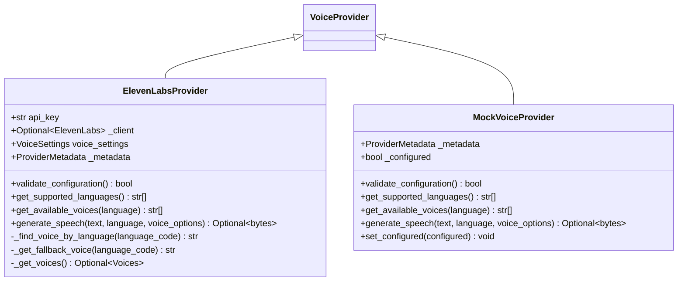

**Diagram sources**
- [elevenlabs_provider.py](file://src/voice_providers/elevenlabs_provider.py#L18-L220)
- [mock_provider.py](file://src/voice_providers/mock_provider.py#L13-L98)

**Section sources**
- [provider_registry.py](file://src/voice_providers/provider_registry.py#L12-L212)
- [base_provider.py](file://src/voice_providers/base_provider.py#L28-L97)
- [elevenlabs_provider.py](file://src/voice_providers/elevenlabs_provider.py#L18-L220)

## Error Handling Strategies

### Structured Error Responses

The system implements comprehensive error handling with structured error responses through AudioGenerationResult:

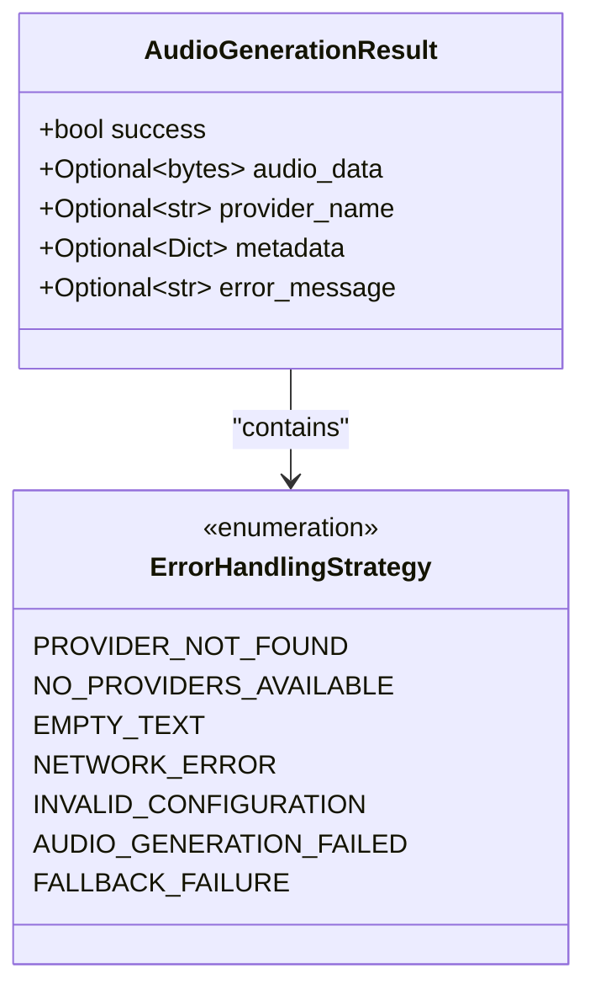

**Diagram sources**
- [audio_service.py](file://src/domain/services/audio_service.py#L13-L21)

### Error Categories and Handling Patterns

The system handles multiple categories of errors with specific strategies:

| Error Category | Handling Strategy | Recovery Mechanism | Logging Level |
|---------------|------------------|-------------------|---------------|
| **Provider Not Found** | Immediate failure | None | Warning |
| **No Providers Available** | Graceful degradation | Fallback providers | Error |
| **Network Issues** | Retry with fallback | Alternative providers | Error |
| **Invalid Configuration** | Validation failure | Provider replacement | Warning |
| **Audio Generation Failure** | Fallback attempt | Alternative providers | Warning |
| **Empty Text** | Early validation | Return error immediately | Warning |

### Exception Propagation and Logging

The system implements comprehensive logging with structured error information:

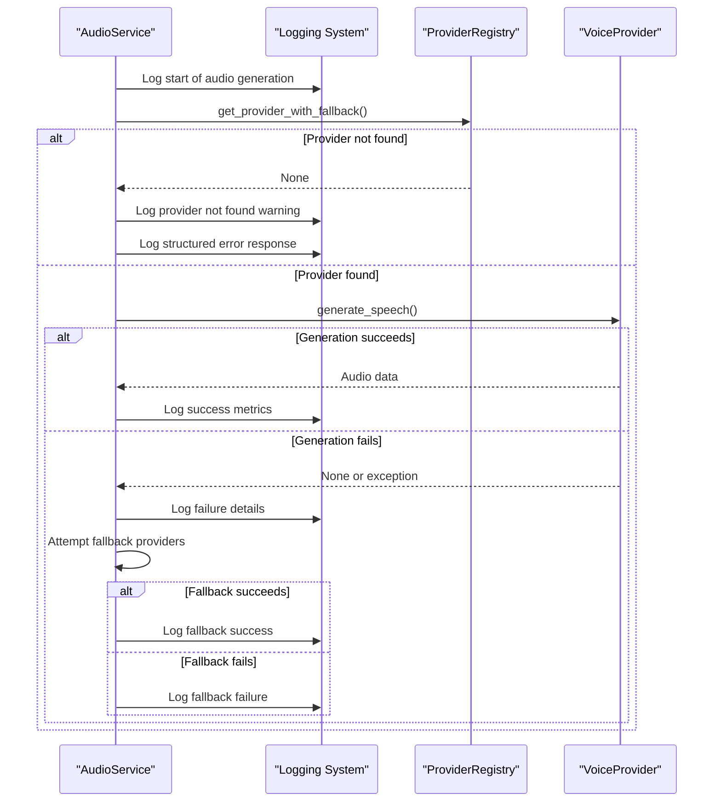

**Diagram sources**
- [audio_service.py](file://src/domain/services/audio_service.py#L99-L104)
- [voice_service.py](file://src/voice_providers/voice_service.py#L115-L134)

**Section sources**
- [audio_service.py](file://src/domain/services/audio_service.py#L99-L104)
- [voice_service.py](file://src/voice_providers/voice_service.py#L115-L134)

## Configuration and Integration

### Language-Specific Processing

The system supports multiple languages with language-specific processing capabilities:

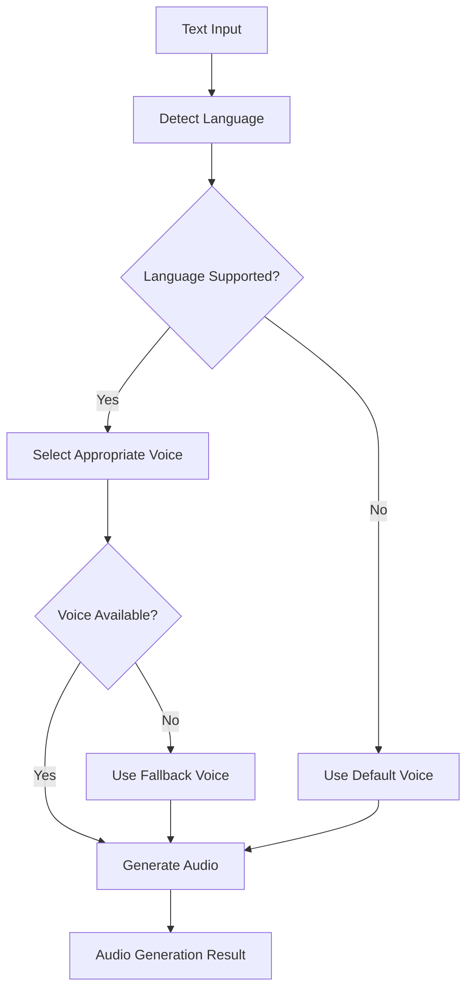

**Diagram sources**
- [value_objects.py](file://src/domain/value_objects.py#L10-L44)
- [elevenlabs_provider.py](file://src/voice_providers/elevenlabs_provider.py#L128-L155)

### Voice Options Configuration

The system supports provider-specific voice configuration through voice_options parameter:

| Parameter | Type | Purpose | Example Values |
|-----------|------|---------|----------------|
| `voice_id` | string | Specific voice identifier | `"21m00Tcm4TlvDq8ikWAM"` |
| `model_id` | string | Model variant selection | `"eleven_multilingual_v2"` |
| `voice_settings` | dict | Voice characteristics | Stability, similarity, style |
| `language` | string | Target language code | `"en"`, `"ru"`, `"es"` |

### External Voice Provider Integration

The system integrates with external voice providers through standardized interfaces:

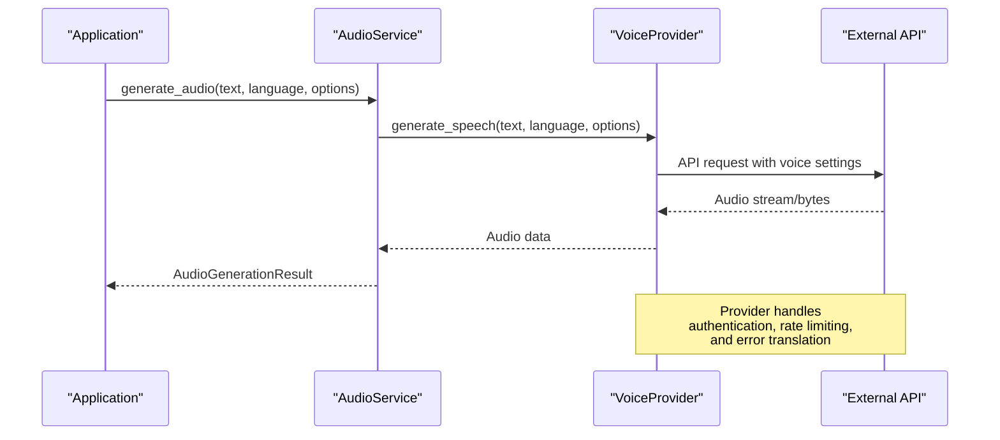

**Diagram sources**
- [elevenlabs_provider.py](file://src/voice_providers/elevenlabs_provider.py#L165-L219)

**Section sources**
- [audio_service.py](file://src/domain/services/audio_service.py#L35-L41)
- [elevenlabs_provider.py](file://src/voice_providers/elevenlabs_provider.py#L165-L219)

## Practical Examples

### GenerateStoryUseCase Integration

The GenerateStoryUseCase demonstrates practical audio generation usage post-story generation:

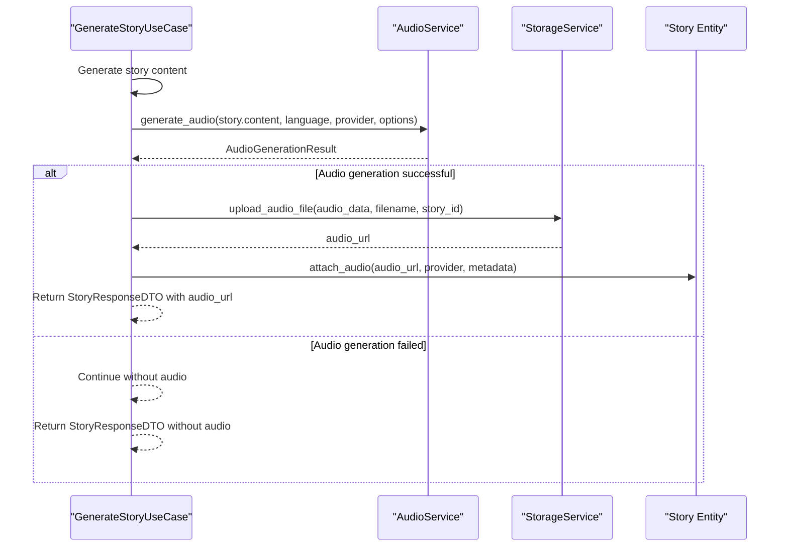

**Diagram sources**
- [generate_story.py](file://src/application/use_cases/generate_story.py#L156-L207)

### Audio File Entity Creation

The create_audio_file_entity() method constructs AudioFile value objects from generated audio metadata:

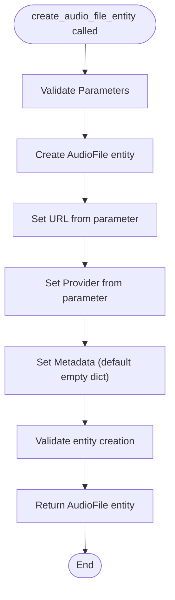

**Diagram sources**
- [audio_service.py](file://src/domain/services/audio_service.py#L106-L126)

### Voice Provider Registration Example

```python
# Example: Registering voice providers
from src.voice_providers import VoiceProviderRegistry, ElevenLabsProvider, MockVoiceProvider

# Initialize registry
registry = VoiceProviderRegistry()

# Register providers
eleven_labs = ElevenLabsProvider()
mock_provider = MockVoiceProvider()

registry.register(eleven_labs)
registry.register(mock_provider)

# Set default provider
registry.set_default_provider("elevenlabs")

# Get available providers
available_providers = registry.list_available_providers()
```

**Section sources**
- [generate_story.py](file://src/application/use_cases/generate_story.py#L156-L207)
- [audio_service.py](file://src/domain/services/audio_service.py#L106-L126)

## Troubleshooting Guide

### Common Audio Generation Failures

#### Provider Not Found Error
**Symptoms:** `Provider 'provider_name' not found`
**Causes:** 
- Incorrect provider name specified
- Provider not registered in registry
- Typographical errors in provider configuration

**Solutions:**
1. Verify provider name spelling against registered providers
2. Check provider registration: `registry.list_providers()`
3. Ensure provider is properly configured: `registry.list_available_providers()`

#### No Voice Providers Available
**Symptoms:** `No voice providers available`
**Causes:**
- No providers registered
- All providers misconfigured
- Network connectivity issues

**Solutions:**
1. Register at least one provider: `registry.register(provider)`
2. Check provider configurations: `provider.validate_configuration()`
3. Verify network connectivity to external APIs

#### Empty Text Error
**Symptoms:** `Empty text provided`
**Causes:**
- Empty string passed to generate_audio
- Story content generation failed
- Text preprocessing removed all content

**Solutions:**
1. Validate input text before calling generate_audio
2. Check story generation process for content issues
3. Implement text validation in application layer

#### Audio Generation Failed
**Symptoms:** Provider returned no audio data
**Causes:**
- Provider API limitations exceeded
- Invalid text format for provider
- Provider-specific configuration issues

**Solutions:**
1. Check provider-specific limits (text length, format)
2. Validate text format compliance
3. Review provider configuration and credentials

### Network and Connectivity Issues

#### API Authentication Failures
**Symptoms:** Provider validation fails with authentication errors
**Solutions:**
1. Verify API keys are correctly set in environment variables
2. Check API key permissions and quotas
3. Test API key validity independently

#### Rate Limiting and Quotas
**Symptoms:** Intermittent audio generation failures
**Solutions:**
1. Implement exponential backoff retry logic
2. Monitor API usage against quota limits
3. Consider multiple provider redundancy

### Performance Troubleshooting

#### Memory Usage with Large Audio Files
**Symptoms:** High memory consumption during audio generation
**Solutions:**
1. Implement streaming audio generation where supported
2. Process audio in chunks for large texts
3. Monitor memory usage during text-to-speech conversion

#### Slow Audio Generation Response Times
**Symptoms:** Long delays in audio generation
**Solutions:**
1. Profile provider-specific bottlenecks
2. Implement provider caching for repeated requests
3. Consider asynchronous audio generation workflows

### Debugging and Monitoring

#### Enable Detailed Logging
```python
import logging
from src.core.logging import setup_logging

# Setup detailed logging for audio service
setup_logging(level="DEBUG", json_format=True)

# Monitor specific loggers
logging.getLogger("domain.audio_service").setLevel(logging.DEBUG)
logging.getLogger("tale_generator.voice_provider").setLevel(logging.DEBUG)
```

#### Provider Health Monitoring
```python
# Check provider availability
registry = get_registry()
available_providers = registry.list_available_providers()
print(f"Available providers: {available_providers}")

# Test individual provider
provider = registry.get_provider("elevenlabs")
if provider:
    print(f"Provider configuration valid: {provider.validate_configuration()}")
```

**Section sources**
- [audio_service.py](file://src/domain/services/audio_service.py#L58-L71)
- [provider_registry.py](file://src/voice_providers/provider_registry.py#L36-L55)

## Performance Considerations

### Binary Audio Data Handling

The system efficiently handles binary audio data with several optimization strategies:

#### Memory Management
- **Streaming Approach:** Providers return generators that yield audio chunks
- **Buffer Management:** Audio data is processed in manageable chunks
- **Garbage Collection:** Proper cleanup of temporary audio buffers

#### Audio Format Optimization
- **Compression:** MP3 format provides optimal balance of quality and file size
- **Quality Settings:** Adjustable voice settings for different use cases
- **Format Validation:** Automatic format detection and conversion

### Scalability Considerations

#### Concurrent Audio Generation
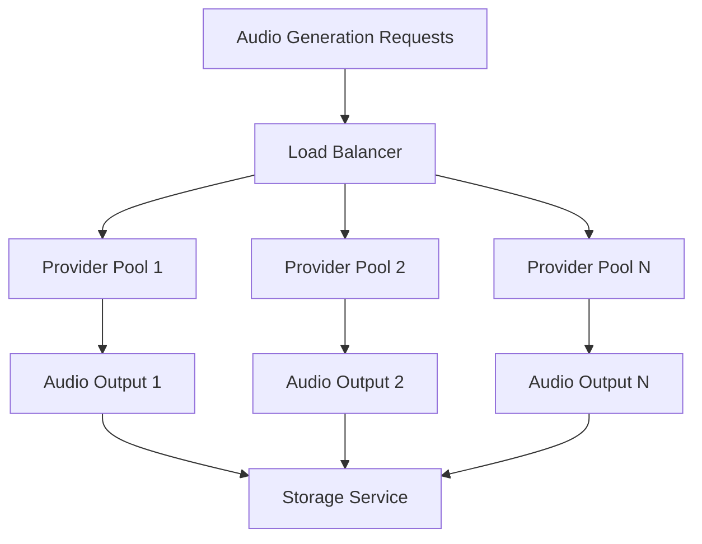

#### Caching Strategies
- **Provider Cache:** Store provider instances to avoid reinitialization
- **Voice Cache:** Cache frequently used voice configurations
- **Audio Cache:** Store generated audio for identical text requests

### Resource Optimization

#### Provider Selection Optimization
- **Load Balancing:** Distribute requests across multiple providers
- **Health Checks:** Regular health monitoring of providers
- **Circuit Breaker:** Automatic failover for failing providers

#### Network Optimization
- **Connection Pooling:** Reuse HTTP connections for external APIs
- **Timeout Management:** Configurable timeouts for provider requests
- **Retry Logic:** Exponential backoff for transient failures

### Monitoring and Metrics

#### Key Performance Indicators
- **Generation Latency:** Time from request to audio completion
- **Success Rate:** Percentage of successful audio generations
- **Provider Utilization:** Usage distribution across providers
- **Error Rates:** Frequency and types of audio generation failures

#### Performance Monitoring Implementation
```python
# Example performance monitoring setup
import time
from src.core.logging import get_logger

logger = get_logger("audio_performance")

def monitor_audio_generation(func):
    def wrapper(*args, **kwargs):
        start_time = time.time()
        result = func(*args, **kwargs)
        duration = time.time() - start_time
        
        logger.info(f"Audio generation completed in {duration:.2f}s",
                   extra={"generation_time": duration,
                         "success": result.success,
                         "provider": result.provider_name})
        return result
    return wrapper
```

**Section sources**
- [audio_service.py](file://src/domain/services/audio_service.py#L75-L97)
- [voice_service.py](file://src/voice_providers/voice_service.py#L75-L83)