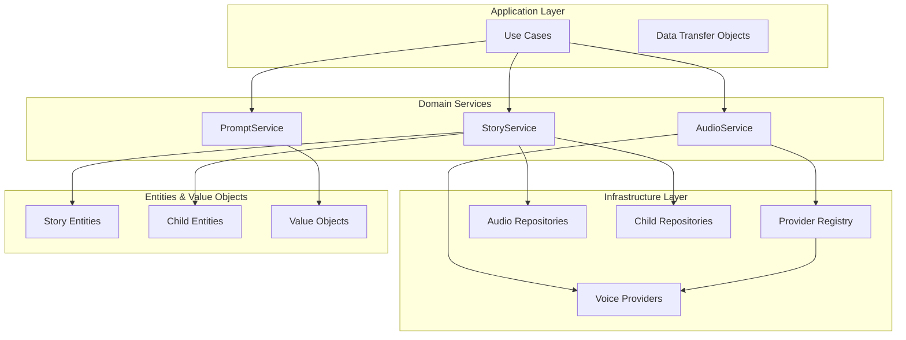
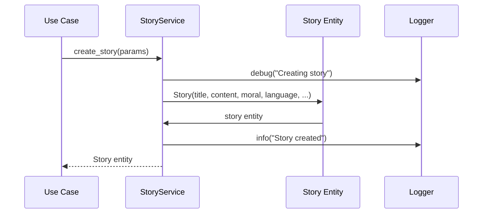
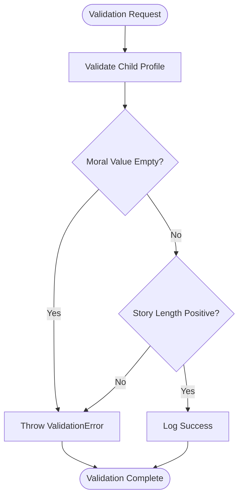
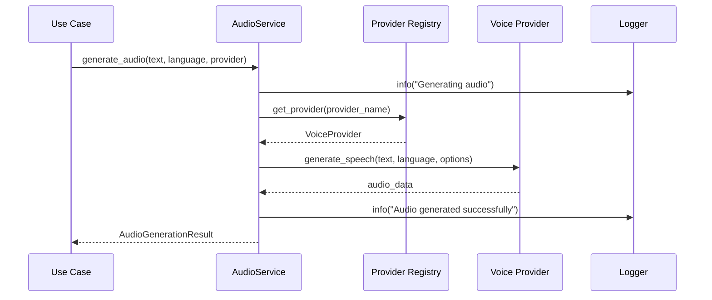
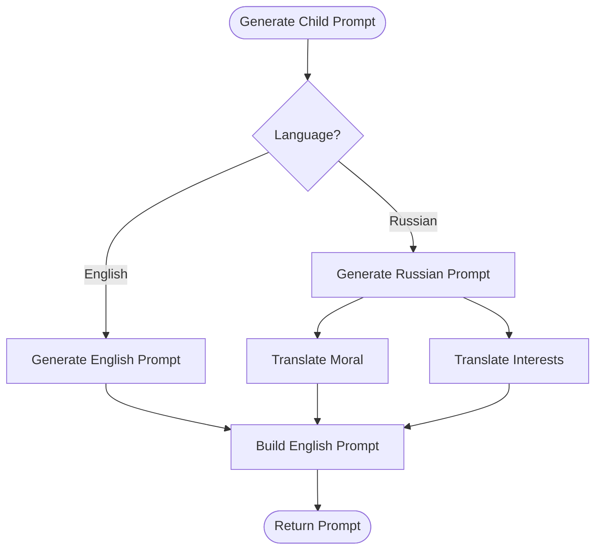
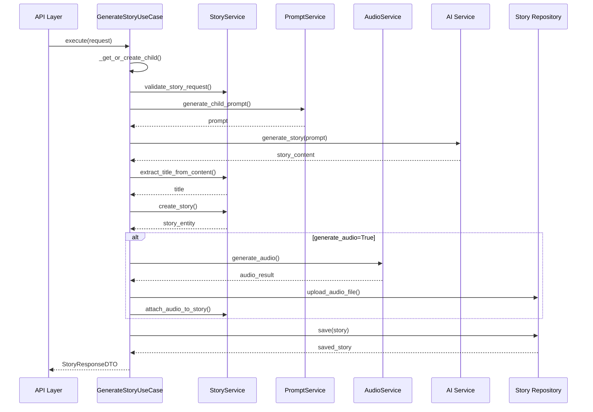
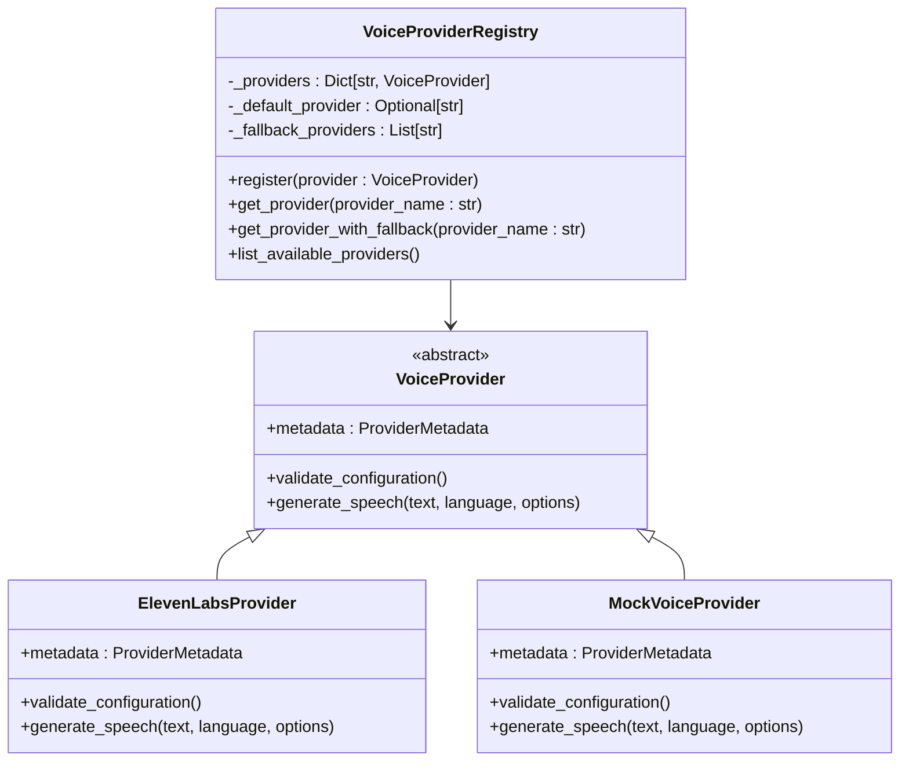
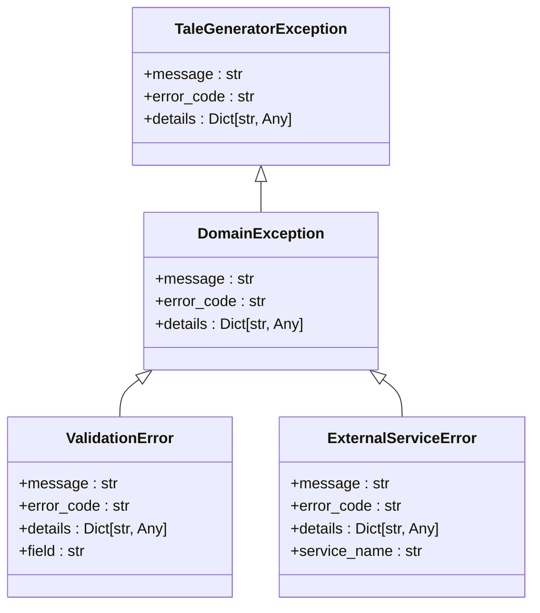

# Domain Services

<cite>
**Referenced Files in This Document**
- [story_service.py](file://src/domain/services/story_service.py)
- [audio_service.py](file://src/domain/services/audio_service.py)
- [prompt_service.py](file://src/domain/services/prompt_service.py)
- [generate_story.py](file://src/application/use_cases/generate_story.py)
- [provider_registry.py](file://src/voice_providers/provider_registry.py)
- [base_provider.py](file://src/voice_providers/base_provider.py)
- [entities.py](file://src/domain/entities.py)
- [value_objects.py](file://src/domain/value_objects.py)
- [exceptions.py](file://src/core/exceptions.py)
- [settings.py](file://src/infrastructure/config/settings.py)
- [test_integration_voice.py](file://test_integration_voice.py)
- [test_voice_providers.py](file://test_voice_providers.py)
</cite>

## Table of Contents
1. [Introduction](#introduction)
2. [Service Architecture Overview](#service-architecture-overview)
3. [StoryService](#storyservice)
4. [AudioService](#audioservice)
5. [PromptService](#promptservice)
6. [Service Orchestration](#service-orchestration)
7. [Dependency Management](#dependency-management)
8. [Error Handling and Validation](#error-handling-and-validation)
9. [Best Practices](#best-practices)
10. [Common Issues and Solutions](#common-issues-and-solutions)

## Introduction

The Tale Generator application employs a sophisticated domain services architecture that orchestrates business logic while maintaining strict separation of concerns. These services act as coordinators that orchestrate entity behavior without holding state, following Domain-Driven Design principles. The three primary domain services—StoryService, AudioService, and PromptService—work together to provide a seamless storytelling experience with multilingual support and audio generation capabilities.

Domain services in this architecture serve as stateless orchestrators that:
- Coordinate complex business workflows
- Manage cross-cutting concerns
- Handle external integrations
- Enforce business rules
- Maintain loose coupling between components

## Service Architecture Overview

The domain services architecture follows a layered approach with clear boundaries and responsibilities:



**Diagram sources**
- [generate_story.py](file://src/application/use_cases/generate_story.py#L21-L52)
- [story_service.py](file://src/domain/services/story_service.py#L13-L146)
- [audio_service.py](file://src/domain/services/audio_service.py#L23-L127)
- [prompt_service.py](file://src/domain/services/prompt_service.py#L11-L207)

Each service operates independently while collaborating through well-defined interfaces, ensuring maintainability and testability.

**Section sources**
- [generate_story.py](file://src/application/use_cases/generate_story.py#L21-L52)
- [story_service.py](file://src/domain/services/story_service.py#L13-L146)
- [audio_service.py](file://src/domain/services/audio_service.py#L23-L127)
- [prompt_service.py](file://src/domain/services/prompt_service.py#L11-L207)

## StoryService

The StoryService serves as the central orchestrator for story-related business logic, managing the complete story lifecycle from creation to rating. It maintains statelessness while coordinating complex workflows involving multiple entities and external systems.

### Core Methods and Responsibilities

#### create_story()
Creates a new Story entity with comprehensive metadata and child association:



**Diagram sources**
- [story_service.py](file://src/domain/services/story_service.py#L16-L66)

#### extract_title_from_content()
Intelligently extracts titles from story content using markdown parsing:

The method analyzes the first few lines of content, removing markdown formatting and handling edge cases where no title is present.

#### attach_audio_to_story()
Links audio files to story entities with metadata tracking:

This method demonstrates the service's role in managing relationships between entities while maintaining audit trails and metadata consistency.

#### rate_story()
Provides story rating functionality with validation:

The service ensures rating values fall within acceptable ranges and maintains audit trails for rating changes.

#### validate_story_request()
Enforces comprehensive validation rules for story generation requests:



**Diagram sources**
- [story_service.py](file://src/domain/services/story_service.py#L113-L146)

**Section sources**
- [story_service.py](file://src/domain/services/story_service.py#L16-L146)

## AudioService

The AudioService manages the complex workflow of audio generation, coordinating voice provider selection, speech synthesis, and audio file management. It implements robust fallback mechanisms and comprehensive error handling.

### Core Method: generate_audio()

The primary method orchestrates the complete audio generation pipeline:



**Diagram sources**
- [audio_service.py](file://src/domain/services/audio_service.py#L35-L104)
- [provider_registry.py](file://src/voice_providers/provider_registry.py#L72-L140)

### Advanced Features

#### Provider Selection and Fallback
The service implements intelligent provider selection with fallback mechanisms:

1. **Explicit Provider Selection**: Uses specified provider if available
2. **Default Provider**: Falls back to configured default provider
3. **Fallback Providers**: Tries configured fallback providers in order
4. **Any Available Provider**: Last resort uses any working provider

#### Error Handling and Result Tracking
The service returns structured results through the AudioGenerationResult dataclass:

| Field | Type | Purpose |
|-------|------|---------|
| success | bool | Indicates generation success |
| audio_data | Optional[bytes] | Generated audio data |
| provider_name | Optional[str] | Used provider name |
| metadata | Optional[Dict[str, Any]] | Generation metadata |
| error_message | Optional[str] | Error description |

#### create_audio_file_entity()
Creates AudioFile entities for persistent storage:

This method demonstrates the service's role in creating value objects that represent persisted audio resources with provider tracking and metadata.

**Section sources**
- [audio_service.py](file://src/domain/services/audio_service.py#L35-L127)

## PromptService

The PromptService generates language-specific story prompts, handling both child-based and hero-based storytelling scenarios with sophisticated internationalization support.

### Core Methods

#### generate_child_prompt()
Creates personalized story prompts based on child characteristics:



**Diagram sources**
- [prompt_service.py](file://src/domain/services/prompt_service.py#L14-L38)

#### generate_hero_prompt()
Creates story prompts featuring heroic characters:

The method handles both English and Russian contexts with appropriate cultural adaptations and language-specific formatting.

### Internationalization Features

#### Translation Logic
The service implements comprehensive translation capabilities:

| Feature | Implementation | Languages |
|---------|---------------|-----------|
| Moral Values | Predefined translations | English ↔ Russian |
| Child Interests | Extensive interest mapping | English ↔ Russian |
| Cultural Adaptations | Context-aware formatting | English ↔ Russian |

#### Language-Specific Prompts
Each language variant includes culturally appropriate elements:

- **English Prompts**: Standard narrative structure with clear moral framing
- **Russian Prompts**: Traditional "once upon a time" structure with cultural nuances

**Section sources**
- [prompt_service.py](file://src/domain/services/prompt_service.py#L14-L207)

## Service Orchestration

The domain services work together through the GenerateStoryUseCase to provide a cohesive storytelling experience:



**Diagram sources**
- [generate_story.py](file://src/application/use_cases/generate_story.py#L53-L208)

**Section sources**
- [generate_story.py](file://src/application/use_cases/generate_story.py#L53-L208)

## Dependency Management

The application employs a sophisticated dependency injection system managed through configuration and service registries:

### Provider Registry Pattern

The voice provider system demonstrates advanced dependency management:



**Diagram sources**
- [provider_registry.py](file://src/voice_providers/provider_registry.py#L12-L212)
- [base_provider.py](file://src/voice_providers/base_provider.py#L28-L97)

### Configuration-Driven Dependencies

Services receive their dependencies through constructor injection, enabling:

- **Testability**: Easy mocking and dependency substitution
- **Flexibility**: Runtime configuration changes
- **Maintainability**: Clear dependency relationships
- **Scalability**: Modular service composition

**Section sources**
- [provider_registry.py](file://src/voice_providers/provider_registry.py#L12-L212)
- [base_provider.py](file://src/voice_providers/base_provider.py#L28-L97)

## Error Handling and Validation

The domain services implement comprehensive error handling following a hierarchical exception structure:

### Exception Hierarchy



**Diagram sources**
- [exceptions.py](file://src/core/exceptions.py#L36-L125)

### Validation Patterns

#### Input Validation
Services implement comprehensive input validation:

- **StoryService**: Validates child profiles, moral values, and story lengths
- **AudioService**: Validates text content, provider availability, and configuration
- **PromptService**: Validates language compatibility and content appropriateness

#### Error Recovery
Services implement graceful degradation:

- **AudioService**: Provides fallback provider selection
- **StoryService**: Handles validation failures with meaningful error messages
- **PromptService**: Supports multiple language variants with graceful fallback

**Section sources**
- [exceptions.py](file://src/core/exceptions.py#L36-L125)
- [story_service.py](file://src/domain/services/story_service.py#L113-L146)
- [audio_service.py](file://src/domain/services/audio_service.py#L56-L104)

## Best Practices

### Service Composition Guidelines

1. **Single Responsibility**: Each service focuses on a specific domain concern
2. **Statelessness**: Services maintain no internal state between operations
3. **Dependency Injection**: Services receive dependencies through constructors
4. **Interface Segregation**: Services depend on abstractions, not concrete implementations

### Error Handling Best Practices

1. **Specific Exceptions**: Use domain-specific exception types
2. **Meaningful Messages**: Provide clear error descriptions with context
3. **Graceful Degradation**: Implement fallback mechanisms where possible
4. **Comprehensive Logging**: Log errors with sufficient context for debugging

### Performance Optimization

1. **Lazy Loading**: Load dependencies only when needed
2. **Caching**: Cache expensive operations where appropriate
3. **Async Operations**: Use asynchronous patterns for I/O-bound operations
4. **Resource Management**: Properly dispose of resources and connections

### Testing Strategies

1. **Mock Dependencies**: Use mocks for external services and repositories
2. **Integration Tests**: Test service interactions end-to-end
3. **Boundary Testing**: Test edge cases and error conditions
4. **Performance Testing**: Validate service performance under load

## Common Issues and Solutions

### Service Dependency Conflicts

**Issue**: Circular dependencies between services
**Solution**: Implement proper abstraction layers and dependency inversion

**Example Solution Path**:
- Define clear interfaces for service interactions
- Use dependency injection containers
- Implement service locator patterns where appropriate

### Provider Availability Issues

**Issue**: Voice providers become unavailable during runtime
**Solution**: Implement robust fallback mechanisms

**Implementation Approach**:
```python
# Example fallback logic from provider_registry.py
def get_provider_with_fallback(self, provider_name=None):
    # Try requested provider first
    provider = self.get_provider(provider_name)
    if provider:
        return provider
    
    # Try default provider
    if provider_name and provider_name != self._default_provider:
        provider = self.get_provider(self._default_provider)
        if provider:
            return provider
    
    # Try fallback providers
    for fallback_name in self._fallback_providers:
        provider = self.get_provider(fallback_name)
        if provider:
            return provider
    
    # Last resort: any available provider
    for name, provider in self._providers.items():
        if provider.validate_configuration():
            return provider
```

### Configuration Management Challenges

**Issue**: Environment-specific configurations causing runtime errors
**Solution**: Implement comprehensive configuration validation

**Best Practice**:
- Validate all configuration parameters at startup
- Provide meaningful error messages for missing or invalid configurations
- Use type-safe configuration classes with validation

### Memory Management Concerns

**Issue**: Large audio files consuming excessive memory
**Solution**: Implement streaming and chunked processing

**Implementation Strategy**:
- Process audio data in chunks for large files
- Implement proper resource cleanup
- Use generators for large dataset processing

### Logging and Monitoring

**Issue**: Insufficient visibility into service operations
**Solution**: Implement comprehensive logging with structured data

**Recommended Logging Practices**:
- Use structured logging with consistent fields
- Implement correlation IDs for request tracing
- Monitor service health and performance metrics
- Log both successful operations and error conditions

**Section sources**
- [provider_registry.py](file://src/voice_providers/provider_registry.py#L72-L140)
- [audio_service.py](file://src/domain/services/audio_service.py#L56-L104)
- [exceptions.py](file://src/core/exceptions.py#L36-L125)