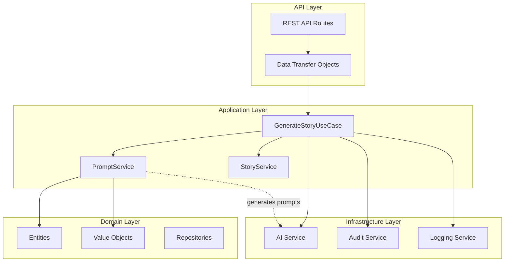
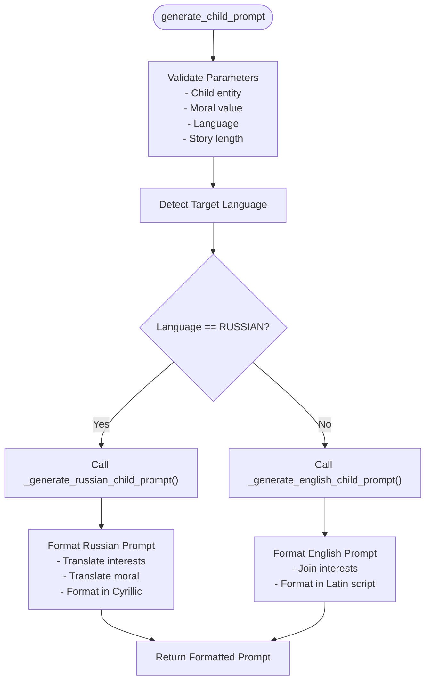
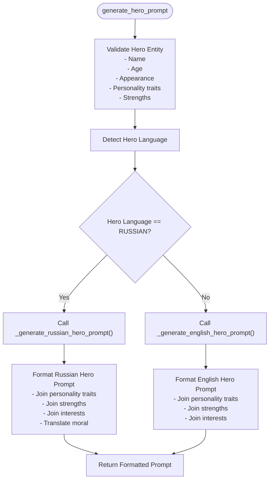
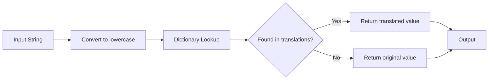
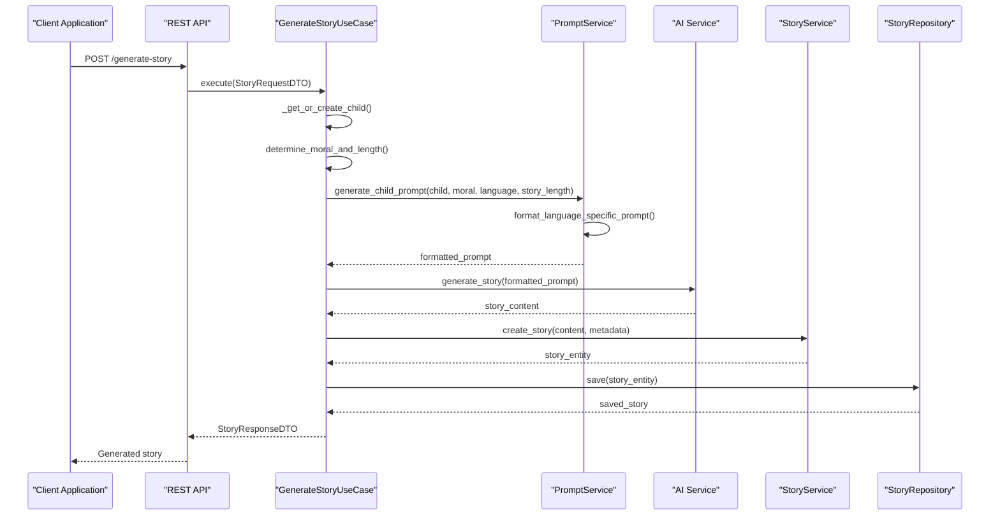

# Prompt Service

<cite>
**Referenced Files in This Document**
- [prompt_service.py](file://src/domain/services/prompt_service.py)
- [generate_story.py](file://src/application/use_cases/generate_story.py)
- [entities.py](file://src/domain/entities.py)
- [value_objects.py](file://src/domain/value_objects.py)
- [dto.py](file://src/application/dto.py)
- [routes.py](file://src/api/routes.py)
- [test_language_support.py](file://test_language_support.py)
- [test_russian_story.py](file://test_russian_story.py)
</cite>

## Table of Contents
1. [Introduction](#introduction)
2. [System Architecture](#system-architecture)
3. [Core Components](#core-components)
4. [Prompt Generation Methods](#prompt-generation-methods)
5. [Translation Infrastructure](#translation-infrastructure)
6. [Integration with GenerateStoryUseCase](#integration-with-generatestoryusecase)
7. [Data Models and Value Objects](#data-models-and-value-objects)
8. [Usage Examples](#usage-examples)
9. [Extending Translation Support](#extending-translation-support)
10. [Performance Considerations](#performance-considerations)
11. [Best Practices](#best-practices)
12. [Troubleshooting Guide](#troubleshooting-guide)

## Introduction

The PromptService domain service is a core component of the Tale Generator system responsible for creating context-rich, language-specific prompts for AI-powered story generation. It serves as the bridge between user-defined child and hero profiles, moral values, and target languages, transforming this information into structured prompts that guide AI models in generating personalized bedtime stories.

The service specializes in creating prompts that incorporate dynamic variables such as child names, ages, genders, interests, and moral values while maintaining cultural and linguistic appropriateness for different target languages. Its sophisticated translation infrastructure enables seamless localization support, currently focusing on English and Russian languages.

## System Architecture

The PromptService operates within a layered architecture that separates concerns between domain logic, application use cases, and infrastructure services:



**Diagram sources**
- [routes.py](file://src/api/routes.py#L114-L216)
- [generate_story.py](file://src/application/use_cases/generate_story.py#L21-L125)
- [prompt_service.py](file://src/domain/services/prompt_service.py#L11-L207)

**Section sources**
- [routes.py](file://src/api/routes.py#L114-L216)
- [generate_story.py](file://src/application/use_cases/generate_story.py#L21-L125)

## Core Components

The PromptService consists of several specialized components that work together to generate high-quality, localized prompts:

### Primary Prompt Generation Methods

The service provides two main entry points for prompt generation:

1. **generate_child_prompt()**: Creates prompts based on child profiles with interests and demographic information
2. **generate_hero_prompt()**: Generates prompts featuring heroic characters with detailed personality traits

Both methods automatically detect the target language and delegate to language-specific internal methods, ensuring appropriate formatting and cultural adaptation.

### Internal Language-Specific Methods

Each language variant has dedicated internal methods that handle:
- Proper sentence structure and grammar
- Cultural appropriateness for bedtime storytelling
- Word count calculations based on reading speed
- Moral value translation and contextualization

### Translation Infrastructure

The service includes robust translation capabilities for:
- Moral values (8 predefined values: kindness, honesty, bravery, friendship, perseverance, empathy, respect, responsibility)
- Child interests (12 common interests: dinosaurs, space, robots, unicorns, fairies, princesses, cats, flowers, dancing, aliens, planets, trucks)
- Gender pronouns and descriptors

**Section sources**
- [prompt_service.py](file://src/domain/services/prompt_service.py#L11-L207)

## Prompt Generation Methods

### generate_child_prompt() Method

The primary method for creating child-focused story prompts handles the complete workflow from profile analysis to prompt construction:



**Diagram sources**
- [prompt_service.py](file://src/domain/services/prompt_service.py#L14-L38)

The method accepts four parameters:
- **child**: Child entity containing name, age, gender, and interests
- **moral**: Moral value guiding the story's theme
- **language**: Target language for the story
- **story_length**: Desired story length in minutes

### generate_hero_prompt() Method

Similar to the child prompt method, but tailored for heroic character-based stories:



**Diagram sources**
- [prompt_service.py](file://src/domain/services/prompt_service.py#L39-L60)

**Section sources**
- [prompt_service.py](file://src/domain/services/prompt_service.py#L14-L60)

## Translation Infrastructure

### Moral Value Translation

The `_translate_moral()` method provides comprehensive translation of moral values to Russian, ensuring cultural appropriateness and educational relevance:

| English Moral | Russian Translation | Educational Context |
|---------------|-------------------|-------------------|
| kindness | доброта | Teaching compassion and empathy |
| honesty | честность | Emphasizing truthfulness and integrity |
| bravery | храбрость | Encouraging courage and facing fears |
| friendship | дружба | Celebrating loyalty and companionship |
| perseverance | настойчивость | Promoting determination and persistence |
| empathy | сочувствие | Developing understanding and care |
| respect | уважение | Fostering mutual respect and consideration |
| responsibility | ответственность | Teaching accountability and duty |

### Interest Translation

The `_translate_interests()` method handles translation of common child interests to Russian, covering modern themes that resonate with young audiences:

| English Interest | Russian Translation | Cultural Relevance |
|------------------|-------------------|-------------------|
| dinosaurs | динозавры | Popular in children's media worldwide |
| space | космос | Inspires curiosity about science |
| robots | роботы | Appeals to tech-savvy children |
| unicorns | единороги | Magical creatures in global folklore |
| fairies | феи | Universal mythical beings |
| princesses | принцессы | Classic fairy tale archetypes |
| cats | кошки | Familiar pets worldwide |
| flowers | цветы | Nature appreciation |
| dancing | танцы | Physical activity and creativity |
| aliens | пришельцы | Space exploration fascination |
| planets | планеты | Astronomy education |
| trucks | грузовики | Transportation and engineering |

### Translation Implementation Pattern

The translation infrastructure follows a consistent pattern using dictionary-based lookups:



**Diagram sources**
- [prompt_service.py](file://src/domain/services/prompt_service.py#L170-L206)

**Section sources**
- [prompt_service.py](file://src/domain/services/prompt_service.py#L170-L206)

## Integration with GenerateStoryUseCase

The PromptService integrates seamlessly with the GenerateStoryUseCase, forming a cohesive story generation pipeline:



**Diagram sources**
- [generate_story.py](file://src/application/use_cases/generate_story.py#L53-L120)
- [prompt_service.py](file://src/domain/services/prompt_service.py#L14-L38)

### Key Integration Points

1. **Parameter Validation**: The GenerateStoryUseCase validates input parameters before passing them to the PromptService
2. **Prompt Generation**: The PromptService creates language-appropriate prompts based on validated parameters
3. **AI Integration**: Generated prompts are passed directly to AI services for content generation
4. **Story Creation**: Results are processed through the StoryService for entity creation and validation

**Section sources**
- [generate_story.py](file://src/application/use_cases/generate_story.py#L53-L120)

## Data Models and Value Objects

### Child Entity Structure

The Child entity provides the foundation for child-focused story generation:

| Field | Type | Description | Validation |
|-------|------|-------------|------------|
| name | str | Child's name | Cannot be empty |
| age | int | Child's age (1-18) | Must be between 1 and 18 |
| gender | Gender | Child's gender | Enum validation |
| interests | List[str] | Child's interests | At least one required |
| id | Optional[str] | Unique identifier | Auto-generated |
| created_at | Optional[datetime] | Creation timestamp | Auto-set |
| updated_at | Optional[datetime] | Last update timestamp | Auto-updated |

### Hero Entity Structure

The Hero entity supports more complex character-based story generation:

| Field | Type | Description | Validation |
|-------|------|-------------|------------|
| name | str | Hero's name | Cannot be empty |
| age | int | Hero's age | Must be positive |
| gender | Gender | Hero's gender | Enum validation |
| appearance | str | Hero's physical description | Cannot be empty |
| personality_traits | List[str] | Hero's personality characteristics | At least one required |
| interests | List[str] | Hero's interests | At least one required |
| strengths | List[str] | Hero's abilities | At least one required |
| language | Language | Hero's language | Enum validation |
| id | Optional[str] | Unique identifier | Auto-generated |
| created_at | Optional[datetime] | Creation timestamp | Auto-set |
| updated_at | Optional[datetime] | Last update timestamp | Auto-updated |

### Value Objects

#### Language Enum
Supports English (en) and Russian (ru) languages with display name conversion and validation.

#### StoryLength Value Object
Calculates word counts based on reading speed (200 WPM) and provides duration in minutes.

#### Gender Enum
Provides gender translation capabilities for both English and Russian contexts.

**Section sources**
- [entities.py](file://src/domain/entities.py#L10-L210)
- [value_objects.py](file://src/domain/value_objects.py#L10-L189)

## Usage Examples

### Basic Child Prompt Generation

```python
# Example: Creating a prompt for an English-speaking child
from src.domain.services.prompt_service import PromptService
from src.domain.entities import Child
from src.domain.value_objects import Language, StoryLength

# Initialize service
prompt_service = PromptService()

# Create child entity
child = Child(
    name="Emma",
    age=7,
    gender=Gender.FEMALE,
    interests=["unicorns", "fairies", "princesses"]
)

# Generate prompt
prompt = prompt_service.generate_child_prompt(
    child=child,
    moral="kindness",
    language=Language.ENGLISH,
    story_length=StoryLength(minutes=5)
)

# Result includes:
# - Child's name as main character
# - Interests incorporated naturally
# - Moral value emphasized
# - English language specification
```

### Russian Language Localization

```python
# Example: Creating a Russian prompt for a child
from src.domain.services.prompt_service import PromptService
from src.domain.entities import Child
from src.domain.value_objects import Language, StoryLength

# Create Russian-speaking child
child = Child(
    name="Алекс",
    age=8,
    gender=Gender.MALE,
    interests=["динозавры", "космос", "роботы"]
)

# Generate Russian prompt
prompt = prompt_service.generate_child_prompt(
    child=child,
    moral="храбрость",
    language=Language.RUSSIAN,
    story_length=StoryLength(minutes=5)
)

# Result includes:
# - Russian translations of interests
# - Russian moral value
# - Cyrillic script formatting
# - Russian language specification
```

### Hero-Based Story Generation

```python
# Example: Creating a hero-based prompt
from src.domain.services.prompt_service import PromptService
from src.domain.entities import Hero
from src.domain.value_objects import Language, StoryLength

# Create hero entity
hero = Hero(
    name="Иван",
    age=10,
    gender=Gender.MALE,
    appearance="высокий и смелый",
    personality_traits=["добродушный", "смелый"],
    interests=["охота", "путешествия"],
    strengths=["сильный", "ловкий"],
    language=Language.RUSSIAN
)

# Generate hero prompt
prompt = prompt_service.generate_hero_prompt(
    hero=hero,
    moral="дружба",
    story_length=StoryLength(minutes=7)
)

# Result includes:
# - Hero's detailed characteristics
# - Personality traits and strengths
# - Russian cultural context
```

**Section sources**
- [test_language_support.py](file://test_language_support.py#L1-L51)
- [test_russian_story.py](file://test_russian_story.py#L1-L34)

## Extending Translation Support

### Adding New Languages

To extend translation support to additional languages, follow this pattern:

1. **Update Language Enum**: Add new language codes to the Language enum
2. **Extend Value Objects**: Update Gender and StoryMoral translation methods
3. **Add Translation Dictionaries**: Create new entries in translation methods
4. **Update Prompt Methods**: Modify internal methods to handle new language variants

### Translation Dictionary Structure

```python
# Example pattern for adding Spanish support
translations = {
    Language.SPANISH: {
        "kindness": "amabilidad",
        "honesty": "honestidad",
        "bravery": "valentía",
        # ... additional translations
    }
}

# Update method signature
def _translate_moral(self, moral: str, language: Language) -> str:
    return translations.get(language, {}).get(moral.lower(), moral)
```

### Best Practices for Translation Extension

1. **Cultural Sensitivity**: Ensure translations align with cultural storytelling traditions
2. **Technical Accuracy**: Maintain consistency in technical terminology
3. **Testing Coverage**: Create comprehensive test suites for new language variants
4. **Fallback Strategy**: Implement robust fallback mechanisms for missing translations

**Section sources**
- [prompt_service.py](file://src/domain/services/prompt_service.py#L170-L206)

## Performance Considerations

### Optimization Strategies

1. **Lazy Loading**: Translation dictionaries are loaded on-demand to minimize memory footprint
2. **String Formatting**: Uses efficient f-string formatting for prompt construction
3. **Validation Caching**: Input validation occurs once in the GenerateStoryUseCase
4. **Minimal Dependencies**: Service has minimal external dependencies for fast execution

### Memory Management

- Translation dictionaries are stored as class attributes for memory efficiency
- String concatenation uses f-strings for optimal performance
- No caching mechanism is implemented to avoid memory leaks in long-running applications

### Scalability Factors

- Stateless design allows for easy horizontal scaling
- Thread-safe operations support concurrent prompt generation
- Minimal I/O dependencies reduce latency

## Best Practices

### Prompt Construction Guidelines

1. **Context Preservation**: Always include child/hero names as main characters
2. **Natural Language**: Use conversational tone appropriate for bedtime stories
3. **Cultural Appropriateness**: Adapt content to target cultural norms
4. **Educational Value**: Emphasize moral lessons clearly and positively

### Error Handling

1. **Input Validation**: Rely on GenerateStoryUseCase for parameter validation
2. **Graceful Degradation**: Use original values when translations are unavailable
3. **Logging**: Comprehensive logging for debugging and monitoring
4. **Type Safety**: Strong typing ensures runtime error prevention

### Testing Strategies

1. **Unit Testing**: Test individual prompt generation methods
2. **Integration Testing**: Verify end-to-end prompt-to-story workflow
3. **Localization Testing**: Validate translations across different languages
4. **Performance Testing**: Monitor prompt generation latency under load

## Troubleshooting Guide

### Common Issues and Solutions

#### Missing Translations
**Problem**: Some words appear untranslated in generated prompts
**Solution**: Verify that the term exists in the translation dictionaries and that the language parameter is correctly set

#### Incorrect Language Detection
**Problem**: Prompts appear in wrong language despite specifying target language
**Solution**: Check that Language enum values match expected language codes and that translation dictionaries are properly configured

#### Malformed Prompts
**Problem**: Generated prompts contain formatting errors or missing information
**Solution**: Validate input entities (Child, Hero) before passing to prompt service and check for null values

#### Performance Issues
**Problem**: Prompt generation takes excessive time
**Solution**: Profile the service to identify bottlenecks, ensure adequate memory allocation, and consider implementing caching for frequently used translations

### Debugging Techniques

1. **Enable Logging**: Use the service's built-in logging to trace prompt generation steps
2. **Parameter Inspection**: Verify input parameters are correctly formatted and validated
3. **Translation Verification**: Test individual translation methods independently
4. **Prompt Analysis**: Examine generated prompts for structural consistency

**Section sources**
- [prompt_service.py](file://src/domain/services/prompt_service.py#L11-L207)