# Story Service

<cite>
**Referenced Files in This Document**
- [story_service.py](file://src/domain/services/story_service.py)
- [generate_story.py](file://src/application/use_cases/generate_story.py)
- [manage_stories.py](file://src/application/use_cases/manage_stories.py)
- [entities.py](file://src/domain/entities.py)
- [value_objects.py](file://src/domain/value_objects.py)
- [dto.py](file://src/application/dto.py)
- [constants.py](file://src/core/constants.py)
- [logging.py](file://src/core/logging.py)
- [exceptions.py](file://src/core/exceptions.py)
- [story_repository.py](file://src/domain/repositories/story_repository.py)
</cite>

## Table of Contents
1. [Introduction](#introduction)
2. [Service Architecture](#service-architecture)
3. [Core Methods Overview](#core-methods-overview)
4. [Detailed Method Analysis](#detailed-method-analysis)
5. [Integration Patterns](#integration-patterns)
6. [Error Handling and Validation](#error-handling-and-validation)
7. [Logging and Monitoring](#logging-and-monitoring)
8. [Usage Examples](#usage-examples)
9. [Common Pitfalls and Best Practices](#common-pitfalls-and-best-practices)
10. [Testing Strategies](#testing-strategies)

## Introduction

The StoryService is a core domain service in the Tale Generator application responsible for orchestrating the complete story lifecycle operations. It serves as a central coordinator for story-related business logic, ensuring proper validation, transformation, and persistence of story entities throughout the application's workflow.

This service acts as a bridge between the application layer use cases and the domain entities, providing a clean interface for story creation, manipulation, and management while maintaining strict adherence to business rules and validation requirements.

## Service Architecture

The StoryService follows the Domain-Driven Design (DDD) principles, encapsulating story-specific business logic within a dedicated service layer. It maintains loose coupling with other components through dependency injection and adheres to the Single Responsibility Principle.

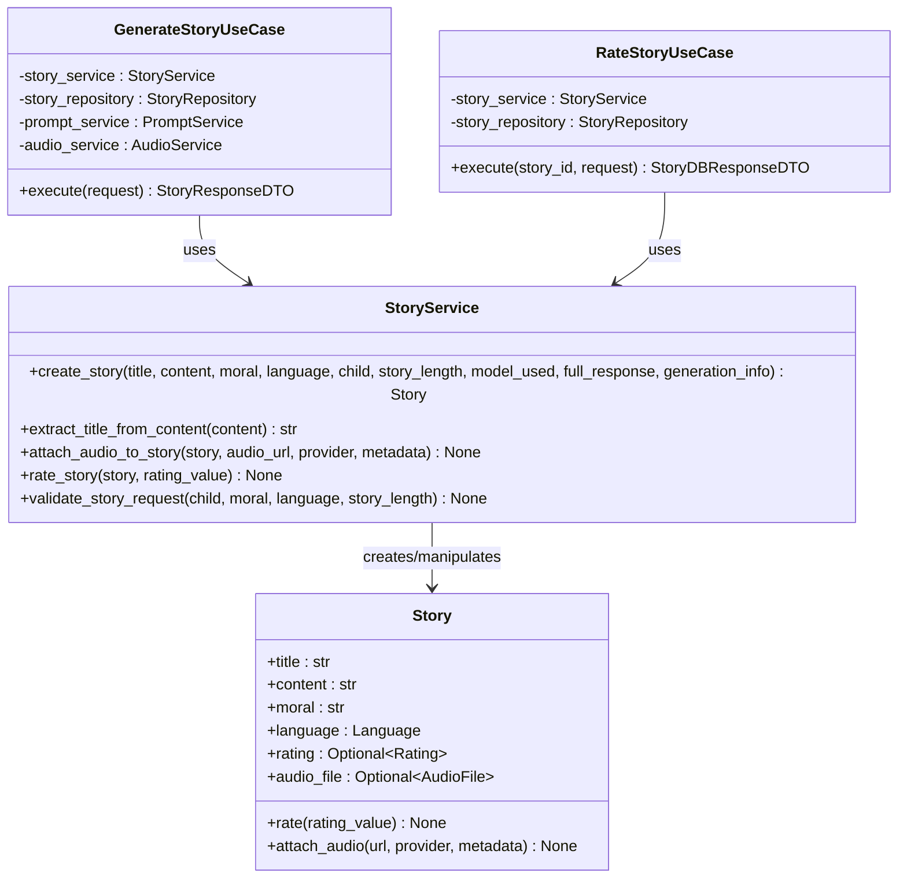

**Diagram sources**
- [story_service.py](file://src/domain/services/story_service.py#L13-L146)
- [generate_story.py](file://src/application/use_cases/generate_story.py#L21-L208)
- [manage_stories.py](file://src/application/use_cases/manage_stories.py#L272-L315)
- [entities.py](file://src/domain/entities.py#L115-L210)

**Section sources**
- [story_service.py](file://src/domain/services/story_service.py#L1-L146)

## Core Methods Overview

The StoryService provides five primary methods, each serving a specific aspect of story lifecycle management:

| Method | Purpose | Input Parameters | Output | Business Rule Enforced |
|--------|---------|------------------|--------|----------------------|
| `create_story` | Instantiate Story entities with child context and metadata | Title, content, moral, language, child, story_length, model_used, full_response, generation_info | Story entity | Validates all input parameters, sets timestamps |
| `extract_title_from_content` | Parse titles from AI-generated content | Story content | Extracted title | Handles empty content, returns default title |
| `attach_audio_to_story` | Link generated audio to stories | Story entity, audio URL, provider, metadata | None | Updates story entity with audio information |
| `rate_story` | Apply validated ratings to stories | Story entity, rating value (1-10) | None | Validates rating range, updates story rating |
| `validate_story_request` | Enforce business rules on input data | Child, moral, language, story_length | None | Validates moral presence, story length positivity |

## Detailed Method Analysis

### create_story()

The `create_story()` method serves as the primary factory for Story entities, encapsulating the complex process of story instantiation with comprehensive metadata and child context.

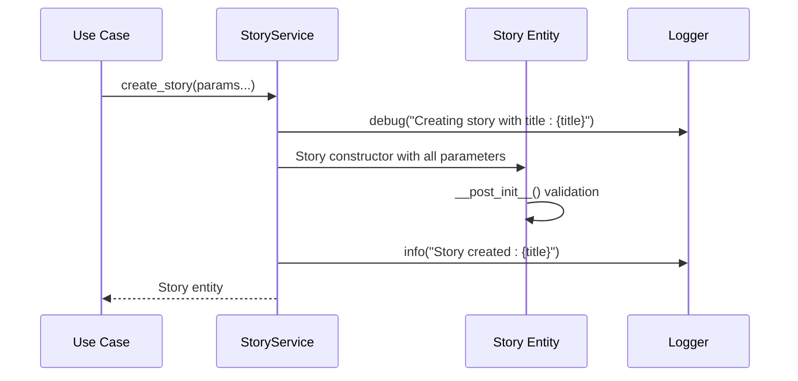

**Diagram sources**
- [story_service.py](file://src/domain/services/story_service.py#L16-L66)
- [entities.py](file://src/domain/entities.py#L117-L147)

Key responsibilities:
- **Parameter Validation**: Ensures all required parameters are provided and valid
- **Entity Instantiation**: Creates Story entity with comprehensive metadata
- **Context Population**: Automatically populates child-related fields from Child entity
- **Timestamp Management**: Sets both created_at and updated_at timestamps
- **Metadata Integration**: Incorporates AI model information and generation details

**Section sources**
- [story_service.py](file://src/domain/services/story_service.py#L16-L66)

### extract_title_from_content()

This method implements intelligent title extraction from AI-generated story content, handling various formatting scenarios and providing fallback mechanisms.

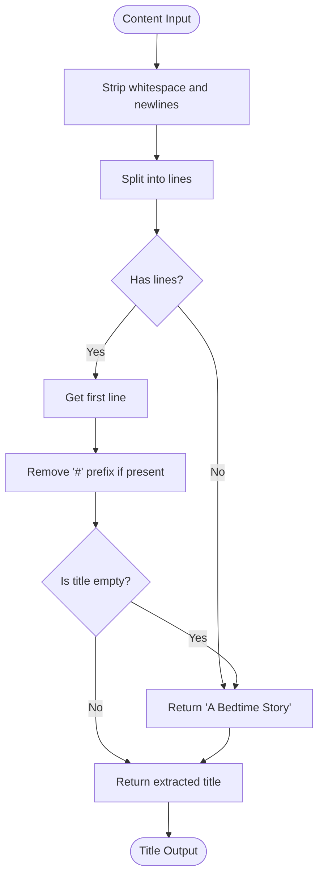

**Diagram sources**
- [story_service.py](file://src/domain/services/story_service.py#L68-L81)

Implementation highlights:
- **Robust Parsing**: Handles Markdown-style headers (# title)
- **Fallback Strategy**: Returns default title when content is empty
- **Whitespace Normalization**: Removes leading/trailing whitespace
- **Minimal Validation**: Returns whatever is found in the first line

**Section sources**
- [story_service.py](file://src/domain/services/story_service.py#L68-L81)

### attach_audio_to_story()

This method manages the association of audio files with story entities, maintaining referential integrity and audit trails.

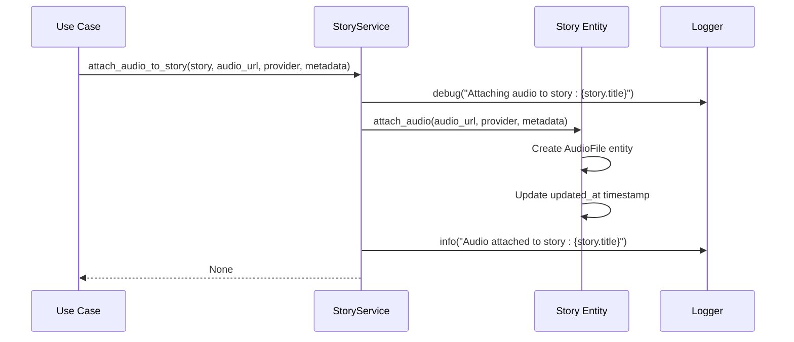

**Diagram sources**
- [story_service.py](file://src/domain/services/story_service.py#L83-L100)
- [entities.py](file://src/domain/entities.py#L158-L172)

Business logic enforcement:
- **Entity Mutation**: Directly modifies the Story entity
- **Audit Trail**: Maintains updated_at timestamp for change tracking
- **Metadata Preservation**: Stores additional audio metadata
- **Provider Tracking**: Records the audio provider for future reference

**Section sources**
- [story_service.py](file://src/domain/services/story_service.py#L83-L100)

### rate_story()

The rating method applies validated ratings to stories, integrating with the Rating value object for type safety and validation.

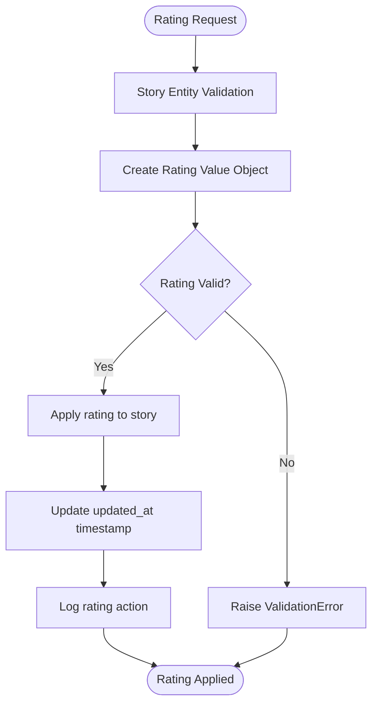

**Diagram sources**
- [story_service.py](file://src/domain/services/story_service.py#L102-L111)
- [value_objects.py](file://src/domain/value_objects.py#L136-L157)

Validation features:
- **Range Enforcement**: Ensures ratings are between 1-10
- **Type Safety**: Uses Rating value object for consistent handling
- **Entity Mutation**: Directly modifies story entity with rating
- **Timestamp Management**: Updates last modification timestamp

**Section sources**
- [story_service.py](file://src/domain/services/story_service.py#L102-L111)

### validate_story_request()

This method enforces comprehensive business rules on story generation requests, preventing invalid data from propagating through the system.

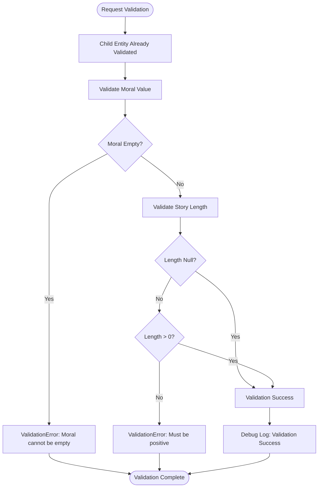

**Diagram sources**
- [story_service.py](file://src/domain/services/story_service.py#L113-L145)

Business rules enforced:
- **Moral Validation**: Ensures moral value is present and non-empty
- **Story Length Validation**: Validates that story length is positive when provided
- **Child Validation**: Leverages existing Child entity validation
- **Field-Specific Error Reporting**: Provides detailed error context

**Section sources**
- [story_service.py](file://src/domain/services/story_service.py#L113-L145)

## Integration Patterns

### Dependency Injection Pattern

The StoryService follows the dependency injection pattern, allowing for flexible composition and testing:

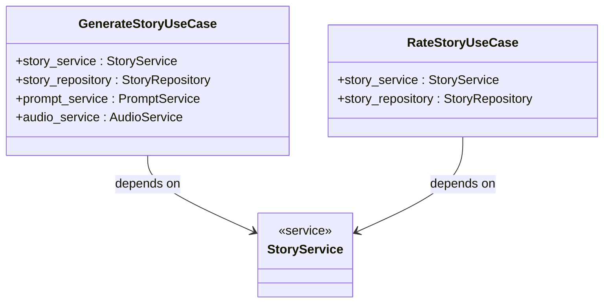

**Diagram sources**
- [generate_story.py](file://src/application/use_cases/generate_story.py#L24-L51)
- [manage_stories.py](file://src/application/use_cases/manage_stories.py#L275-L287)

### Repository Pattern Integration

The service integrates seamlessly with the repository pattern for persistence operations:

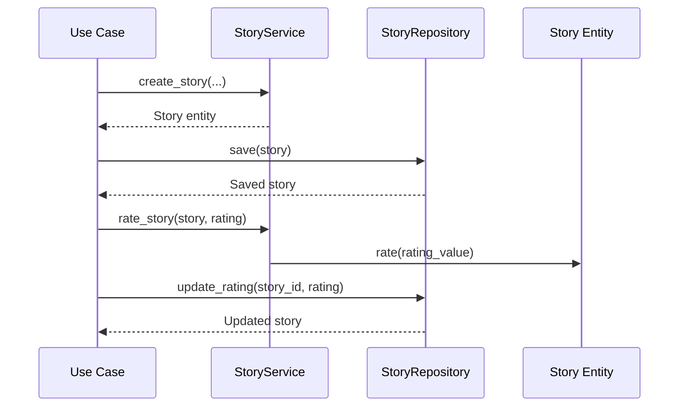

**Diagram sources**
- [story_service.py](file://src/domain/services/story_service.py#L16-L66)
- [story_repository.py](file://src/domain/repositories/story_repository.py#L10-L61)

**Section sources**
- [generate_story.py](file://src/application/use_cases/generate_story.py#L24-L51)
- [manage_stories.py](file://src/application/use_cases/manage_stories.py#L275-L287)

## Error Handling and Validation

### Exception Hierarchy

The StoryService leverages a comprehensive exception hierarchy for robust error handling:

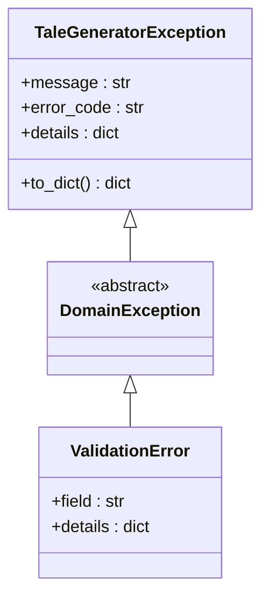

**Diagram sources**
- [exceptions.py](file://src/core/exceptions.py#L6-L237)

### Validation Patterns

The service implements multiple validation patterns:

| Validation Type | Implementation | Example |
|----------------|----------------|---------|
| Parameter Validation | Explicit checks in service methods | Moral value emptiness check |
| Entity Validation | Leveraging entity post-init | Story content validation |
| Business Rule Validation | Custom validation logic | Positive story length requirement |
| Type Validation | Python type hints and runtime checks | Language enumeration validation |

**Section sources**
- [exceptions.py](file://src/core/exceptions.py#L41-L67)
- [story_service.py](file://src/domain/services/story_service.py#L133-L145)

## Logging and Monitoring

### Structured Logging

The StoryService implements comprehensive structured logging using the application's logging framework:

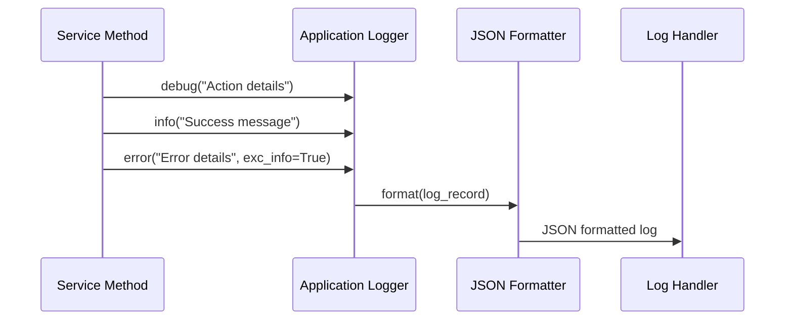

**Diagram sources**
- [logging.py](file://src/core/logging.py#L31-L59)
- [story_service.py](file://src/domain/services/story_service.py#L10-L11)

### Log Categories

The service generates logs across multiple categories:

| Log Level | Purpose | Example Message |
|-----------|---------|----------------|
| DEBUG | Detailed operation tracing | "Creating story with title: {title}" |
| INFO | Successful operation completion | "Story created: {title}" |
| WARNING | Non-critical issues | "Audio generation failed" |
| ERROR | Exception handling | "Error generating/uploading audio" |

**Section sources**
- [logging.py](file://src/core/logging.py#L1-L180)
- [story_service.py](file://src/domain/services/story_service.py#L10-L11)

## Usage Examples

### GenerateStoryUseCase Integration

The GenerateStoryUseCase demonstrates proper StoryService usage within a comprehensive story generation workflow:

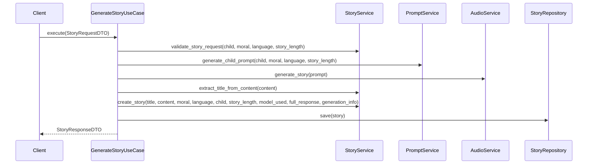

**Diagram sources**
- [generate_story.py](file://src/application/use_cases/generate_story.py#L53-L120)

### RateStoryUseCase Integration

The RateStoryUseCase shows rating workflow integration:

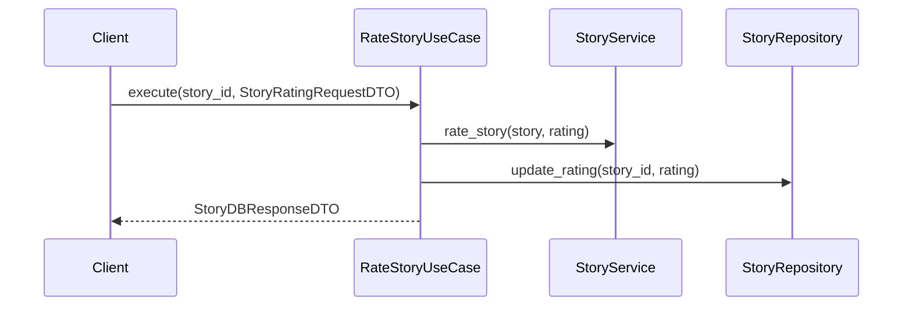

**Diagram sources**
- [manage_stories.py](file://src/application/use_cases/manage_stories.py#L289-L313)

**Section sources**
- [generate_story.py](file://src/application/use_cases/generate_story.py#L53-L120)
- [manage_stories.py](file://src/application/use_cases/manage_stories.py#L289-L313)

## Common Pitfalls and Best Practices

### Common Pitfalls

1. **Invalid Moral Values**
   - **Problem**: Passing empty or null moral values
   - **Solution**: Always validate moral values before calling `validate_story_request()`
   - **Example**: Use predefined StoryMoral enums or validate custom morals

2. **Negative Story Lengths**
   - **Problem**: Providing negative or zero story lengths
   - **Solution**: Validate story length before calling validation methods
   - **Example**: Use StoryLength value object for type safety

3. **Missing Child Context**
   - **Problem**: Attempting to create stories without proper child context
   - **Solution**: Ensure child entities are properly validated and persisted
   - **Example**: Use ChildRepository to find or create child entities

4. **Audio Attachment Failures**
   - **Problem**: Attaching audio without proper URL validation
   - **Solution**: Validate audio URLs before calling `attach_audio_to_story()`
   - **Example**: Check URL format and accessibility

### Best Practices

1. **Service Composition**
   - Inject StoryService into use cases rather than instantiating directly
   - Maintain loose coupling between components

2. **Validation Order**
   - Call `validate_story_request()` before attempting story creation
   - Validate all inputs comprehensively before business operations

3. **Error Handling**
   - Catch and handle ValidationError exceptions appropriately
   - Provide meaningful error messages to clients

4. **Logging Integration**
   - Utilize structured logging for better observability
   - Include relevant context in log messages

5. **Entity State Management**
   - Understand that some methods mutate entities directly
   - Ensure proper persistence after service method calls

**Section sources**
- [story_service.py](file://src/domain/services/story_service.py#L133-L145)
- [value_objects.py](file://src/domain/value_objects.py#L136-L157)

## Testing Strategies

### Unit Testing Approach

The StoryService should be tested using comprehensive unit tests that cover:

1. **Happy Path Scenarios**: Successful method executions
2. **Edge Cases**: Boundary conditions and unusual inputs
3. **Error Conditions**: Validation failures and exception handling
4. **Integration Tests**: Service method combinations

### Test Coverage Areas

| Method | Test Focus | Expected Outcomes |
|--------|------------|-------------------|
| `create_story()` | Entity creation, parameter validation, timestamp setting | Proper entity instantiation, validation errors |
| `extract_title_from_content()` | Content parsing, fallback handling | Title extraction, default values |
| `attach_audio_to_story()` | Audio attachment, entity mutation | Successful attachment, error handling |
| `rate_story()` | Rating application, validation | Valid ratings, invalid ratings |
| `validate_story_request()` | Business rule enforcement | Valid requests, validation failures |

### Mock Dependencies

For effective testing, mock the following dependencies:

- **StoryRepository**: For persistence operations
- **AudioService**: For audio generation operations  
- **PromptService**: For prompt generation operations
- **External Services**: For AI and storage service calls

**Section sources**
- [story_service.py](file://src/domain/services/story_service.py#L1-L146)