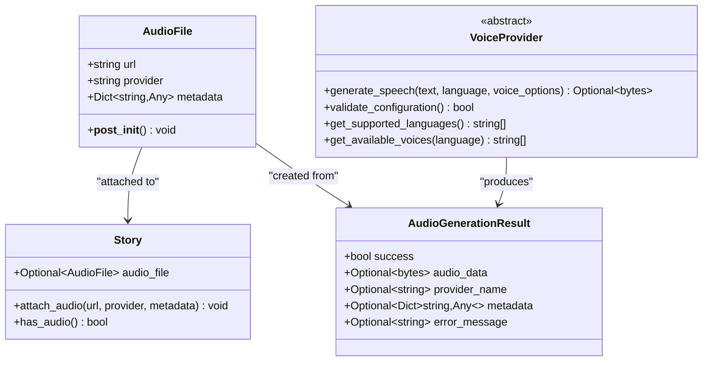
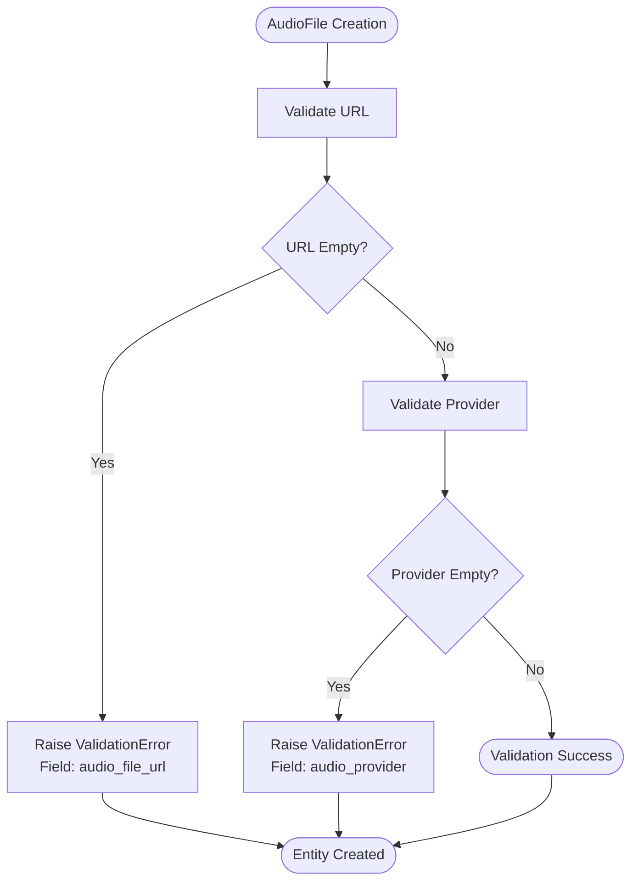
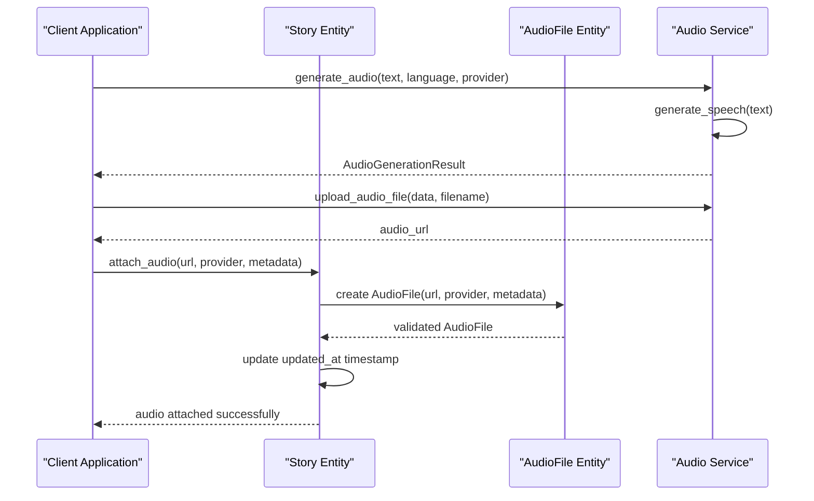
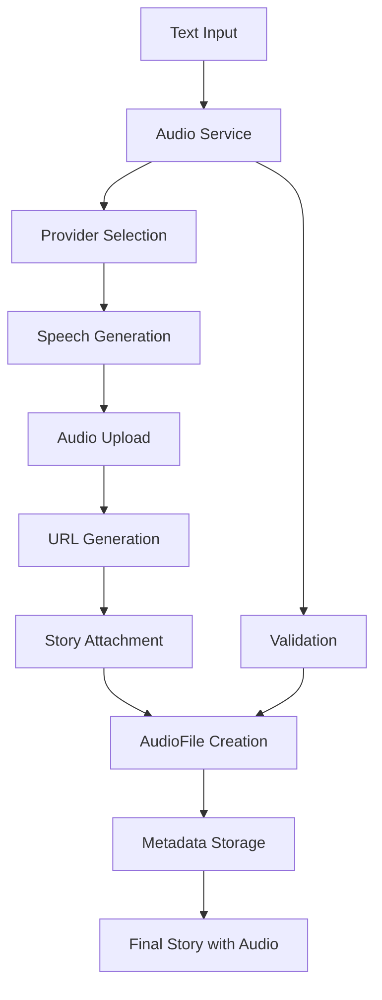
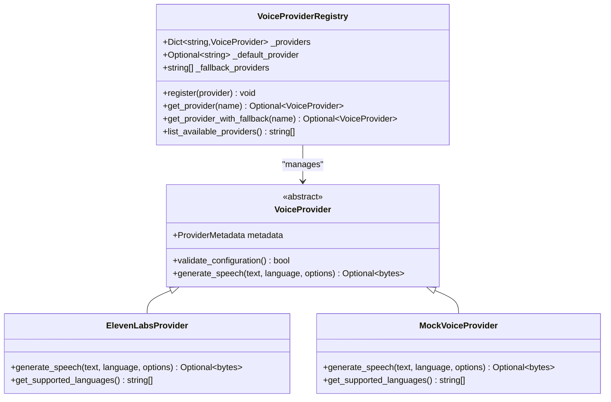

# AudioFile Entity

<cite>
**Referenced Files in This Document**
- [src/domain/entities.py](file://src/domain/entities.py)
- [src/domain/services/audio_service.py](file://src/domain/services/audio_service.py)
- [src/domain/services/story_service.py](file://src/domain/services/story_service.py)
- [src/application/use_cases/generate_story.py](file://src/application/use_cases/generate_story.py)
- [src/application/use_cases/manage_stories.py](file://src/application/use_cases/manage_stories.py)
- [src/voice_providers/base_provider.py](file://src/voice_providers/base_provider.py)
- [src/voice_providers/provider_registry.py](file://src/voice_providers/provider_registry.py)
- [src/voice_providers/mock_provider.py](file://src/voice_providers/mock_provider.py)
- [src/supabase_client.py](file://src/supabase_client.py)
- [src/application/dto.py](file://src/application/dto.py)
</cite>

## Table of Contents
1. [Introduction](#introduction)
2. [Entity Structure](#entity-structure)
3. [Core Attributes](#core-attributes)
4. [Validation Logic](#validation-logic)
5. [Integration with Story Entity](#integration-with-story-entity)
6. [Audio Generation Workflow](#audio-generation-workflow)
7. [Multiple Voice Providers Support](#multiple-voice-providers-support)
8. [Flexible Metadata Storage](#flexible-metadata-storage)
9. [Practical Usage Examples](#practical-usage-examples)
10. [Common Issues and Solutions](#common-issues-and-solutions)
11. [Best Practices](#best-practices)
12. [Troubleshooting Guide](#troubleshooting-guide)

## Introduction

The AudioFile entity serves as a fundamental component in the Tale Generator's audio narration functionality, providing a structured way to represent and manage audio resources associated with stories. This entity encapsulates essential information about generated audio files, including their location, the voice provider used, and additional metadata for tracking and management purposes.

The AudioFile entity is designed to support multiple voice generation services while maintaining consistency and reliability across different audio sources. It plays a crucial role in the story creation pipeline, enabling seamless integration of text-to-speech functionality with story management.

## Entity Structure

The AudioFile entity is implemented as a dataclass within the domain layer, following the principles of immutable value objects and comprehensive validation:



**Diagram sources**
- [src/domain/entities.py](file://src/domain/entities.py#L97-L111)
- [src/domain/services/audio_service.py](file://src/domain/services/audio_service.py#L13-L20)
- [src/voice_providers/base_provider.py](file://src/voice_providers/base_provider.py#L28-L97)

**Section sources**
- [src/domain/entities.py](file://src/domain/entities.py#L97-L111)

## Core Attributes

### url
The `url` attribute represents the publicly accessible location of the audio file. This string contains the complete URL where the audio resource can be accessed, typically pointing to a cloud storage service or CDN endpoint.

**Characteristics:**
- **Type**: `str`
- **Required**: Yes
- **Format**: Valid URL string
- **Purpose**: Provides direct access to the audio file
- **Constraints**: Must be non-empty and properly formatted

### provider
The `provider` attribute identifies the voice generation service used to create the audio. This string specifies which external service or provider was responsible for generating the speech audio.

**Characteristics:**
- **Type**: `str`
- **Required**: Yes
- **Format**: Provider identifier string
- **Purpose**: Tracks the source of audio generation
- **Constraints**: Must be non-empty and match registered provider names

### metadata
The `metadata` attribute stores additional information about the audio generation process. This dictionary allows for flexible storage of provider-specific data, generation parameters, and tracking information.

**Characteristics:**
- **Type**: `Dict[str, Any]`
- **Default**: Empty dictionary (`{}`)
- **Purpose**: Stores provider-specific metadata and generation details
- **Flexibility**: Supports any key-value pairs relevant to audio generation

**Section sources**
- [src/domain/entities.py](file://src/domain/entities.py#L101-L103)

## Validation Logic

The AudioFile entity implements robust validation through the `__post_init__` method to ensure data integrity and prevent invalid audio file references:



**Diagram sources**
- [src/domain/entities.py](file://src/domain/entities.py#L105-L111)

### Validation Rules

1. **URL Validation**: Ensures the audio file URL is present and contains meaningful content
   - Checks for empty strings after stripping whitespace
   - Prevents null or invalid URL references
   - Maintains accessibility of audio resources

2. **Provider Validation**: Verifies the presence of a valid voice provider identifier
   - Confirms the provider name is non-empty
   - Ensures proper attribution of audio generation source
   - Supports provider-specific processing and fallback mechanisms

**Section sources**
- [src/domain/entities.py](file://src/domain/entities.py#L105-L111)

## Integration with Story Entity

The AudioFile entity is tightly integrated with the Story entity through the `attach_audio()` method, providing a clean interface for associating audio resources with stories:



**Diagram sources**
- [src/domain/entities.py](file://src/domain/entities.py#L158-L172)
- [src/domain/services/audio_service.py](file://src/domain/services/audio_service.py#L106-L126)

### Attachment Process

The `attach_audio()` method provides a streamlined approach to linking audio files with stories:

1. **Parameter Validation**: Receives URL, provider, and optional metadata
2. **Entity Creation**: Instantiates AudioFile with validated parameters
3. **Association**: Links the AudioFile to the Story's `audio_file` attribute
4. **Timestamp Update**: Updates the story's `updated_at` field to reflect changes

**Section sources**
- [src/domain/entities.py](file://src/domain/entities.py#L158-L172)

## Audio Generation Workflow

The AudioFile entity participates in a comprehensive audio generation workflow that spans multiple service layers:



**Diagram sources**
- [src/application/use_cases/generate_story.py](file://src/application/use_cases/generate_story.py#L162-L207)
- [src/domain/services/audio_service.py](file://src/domain/services/audio_service.py#L40-L104)

### Workflow Stages

1. **Text Processing**: Input text is prepared for audio generation
2. **Provider Selection**: Voice provider is chosen based on configuration
3. **Speech Generation**: Audio data is produced by the selected provider
4. **File Upload**: Generated audio is uploaded to storage service
5. **URL Management**: Public URL is created for the audio file
6. **Story Integration**: AudioFile is attached to the story entity

**Section sources**
- [src/application/use_cases/generate_story.py](file://src/application/use_cases/generate_story.py#L162-L207)

## Multiple Voice Providers Support

The AudioFile entity is designed to work seamlessly with multiple voice generation providers, supporting a flexible architecture for audio production:

### Provider Registry Integration

The system maintains a registry of available voice providers, enabling dynamic selection and fallback mechanisms:



**Diagram sources**
- [src/voice_providers/provider_registry.py](file://src/voice_providers/provider_registry.py#L12-L212)
- [src/voice_providers/base_provider.py](file://src/voice_providers/base_provider.py#L28-L97)

### Provider Features

Each voice provider contributes specific capabilities and metadata:

- **ElevenLabs Provider**: Production-ready commercial service with extensive language support
- **Mock Provider**: Testing utility for development and testing scenarios
- **Custom Providers**: Extensible architecture for additional voice services

**Section sources**
- [src/voice_providers/provider_registry.py](file://src/voice_providers/provider_registry.py#L12-L212)
- [src/voice_providers/base_provider.py](file://src/voice_providers/base_provider.py#L28-L97)

## Flexible Metadata Storage

The AudioFile entity supports comprehensive metadata storage to track various aspects of audio generation and enable advanced functionality:

### Metadata Categories

1. **Generation Information**: Parameters used during audio creation
   - Voice selection and configuration
   - Language and dialect settings
   - Audio quality and format specifications

2. **Performance Metrics**: Technical characteristics of generated audio
   - Duration and timing information
   - File size and compression metrics
   - Processing timestamps

3. **Provider-Specific Data**: Custom information from voice services
   - Voice model identifiers
   - Provider-specific parameters
   - Error codes and diagnostic information

### Metadata Usage Patterns

The metadata dictionary enables sophisticated tracking and analysis:

- **Audit Trail**: Complete history of audio generation processes
- **Optimization**: Performance monitoring and improvement
- **Debugging**: Troubleshooting and issue resolution
- **Analytics**: Usage patterns and provider effectiveness

**Section sources**
- [src/domain/entities.py](file://src/domain/entities.py#L103)
- [src/domain/services/audio_service.py](file://src/domain/services/audio_service.py#L106-L126)

## Practical Usage Examples

### Basic AudioFile Creation

```python
# Creating an AudioFile with minimal information
audio_file = AudioFile(
    url="https://storage.example.com/stories/123/audio.mp3",
    provider="elevenlabs"
)

# Creating an AudioFile with metadata
audio_file = AudioFile(
    url="https://storage.example.com/stories/123/audio.mp3",
    provider="elevenlabs",
    metadata={
        "voice_id": "voice_123",
        "language": "en",
        "duration_seconds": 120.5,
        "quality": "high",
        "timestamp": "2024-01-15T10:30:00Z"
    }
)
```

### Story Attachment Example

```python
# Attach audio to story using Story entity method
story.attach_audio(
    url="https://storage.example.com/stories/123/audio.mp3",
    provider="elevenlabs",
    metadata={
        "voice_model": "english_male",
        "processing_time_ms": 2500,
        "provider_version": "1.2.3"
    }
)
```

### Audio Service Integration

```python
# Using audio service to create AudioFile entities
audio_service = AudioService()

# Create AudioFile from generation result
audio_file = audio_service.create_audio_file_entity(
    url="https://storage.example.com/stories/123/audio.mp3",
    provider="elevenlabs",
    metadata={
        "generated_by": "text_to_speech",
        "input_text_hash": "abc123def456",
        "processing_duration": 3.2
    }
)
```

**Section sources**
- [src/domain/entities.py](file://src/domain/entities.py#L158-L172)
- [src/domain/services/audio_service.py](file://src/domain/services/audio_service.py#L106-L126)

## Common Issues and Solutions

### Invalid URL Issues

**Problem**: Audio file URL is empty or malformed
**Symptoms**: ValidationError during AudioFile creation
**Solution**: Ensure proper URL generation and validation

```python
# Problematic code
audio_file = AudioFile(url="", provider="elevenlabs")

# Solution - validate URL before creation
if not audio_url or not audio_url.strip():
    raise ValidationError("Audio URL cannot be empty")
audio_file = AudioFile(url=audio_url, provider="elevenlabs")
```

### Missing Provider Information

**Problem**: Empty or null provider identifier
**Symptoms**: ValidationError during AudioFile creation
**Solution**: Always specify a valid provider name

```python
# Problematic code
audio_file = AudioFile(url="https://example.com/audio.mp3", provider="")

# Solution - validate provider before creation
if not provider or not provider.strip():
    raise ValidationError("Provider cannot be empty")
audio_file = AudioFile(url=audio_url, provider=provider)
```

### Storage Upload Failures

**Problem**: Audio file upload to storage service fails
**Symptoms**: Null audio URL returned from upload operation
**Solution**: Implement retry logic and fallback mechanisms

```python
# Robust upload implementation
try:
    audio_url = storage_service.upload_audio_file(
        file_data=audio_result.audio_data,
        filename=f"{uuid.uuid4()}.mp3",
        story_id=story.id or "pending"
    )
    
    if not audio_url:
        logger.warning("Audio upload failed, attempting fallback")
        # Implement fallback storage mechanism
except Exception as e:
    logger.error(f"Audio upload failed: {str(e)}")
    # Handle upload failure gracefully
```

### Provider Configuration Issues

**Problem**: Voice provider is not properly configured
**Symptoms**: Audio generation failures despite valid parameters
**Solution**: Validate provider configuration before use

```python
# Provider validation
provider = provider_registry.get_provider("elevenlabs")
if not provider or not provider.validate_configuration():
    logger.warning("ElevenLabs provider not available, using fallback")
    provider = provider_registry.get_provider_with_fallback()
```

**Section sources**
- [src/domain/entities.py](file://src/domain/entities.py#L105-L111)
- [src/domain/services/audio_service.py](file://src/domain/services/audio_service.py#L40-L104)

## Best Practices

### URL Management

1. **Use Secure URLs**: Ensure audio files are served over HTTPS
2. **Implement Expiration**: Use signed URLs with appropriate expiration times
3. **CDN Optimization**: Leverage content delivery networks for performance
4. **Accessibility**: Verify URL accessibility before story publication

### Provider Selection

1. **Fallback Strategy**: Always implement provider fallback mechanisms
2. **Configuration Validation**: Regularly validate provider configurations
3. **Performance Monitoring**: Track provider performance and reliability
4. **Cost Management**: Monitor usage across different providers

### Metadata Organization

1. **Consistent Structure**: Maintain consistent metadata schemas across providers
2. **Version Control**: Track metadata schema versions for backward compatibility
3. **Documentation**: Document custom metadata fields and their meanings
4. **Security**: Avoid storing sensitive information in metadata

### Error Handling

1. **Graceful Degradation**: Handle audio generation failures gracefully
2. **Retry Logic**: Implement exponential backoff for transient failures
3. **Monitoring**: Log audio generation metrics and errors
4. **User Feedback**: Provide meaningful error messages to users

### Storage Integration

1. **File Naming**: Use consistent, unique filenames for audio files
2. **Bucket Organization**: Organize files in logical directory structures
3. **Access Control**: Implement appropriate access controls for audio files
4. **Backup Strategy**: Ensure audio files are backed up appropriately

## Troubleshooting Guide

### Audio File Not Accessible

**Issue**: Audio file URL returns 404 or access denied
**Diagnosis Steps**:
1. Verify storage service connectivity
2. Check file existence in storage bucket
3. Validate URL format and encoding
4. Confirm access permissions

**Resolution**:
```python
# Verify URL accessibility
import requests
response = requests.head(audio_url)
if response.status_code != 200:
    logger.error(f"Audio file not accessible: {response.status_code}")
    # Implement URL regeneration or fallback
```

### Provider Communication Failures

**Issue**: Voice provider API calls fail or timeout
**Diagnosis Steps**:
1. Check provider service status
2. Verify API credentials and configuration
3. Review network connectivity
4. Examine provider logs for errors

**Resolution**:
```python
# Implement provider health checks
def check_provider_health(provider):
    try:
        # Test provider configuration
        if not provider.validate_configuration():
            return False
        
        # Test basic functionality
        test_audio = provider.generate_speech("Test", "en")
        return test_audio is not None
    except Exception as e:
        logger.error(f"Provider health check failed: {str(e)}")
        return False
```

### Metadata Corruption

**Issue**: AudioFile metadata becomes corrupted or inconsistent
**Diagnosis Steps**:
1. Validate metadata structure against expected schema
2. Check for serialization/deserialization issues
3. Review metadata modification history
4. Verify database constraints and indexing

**Resolution**:
```python
# Validate metadata structure
def validate_metadata(metadata):
    required_fields = ["provider", "url"]
    for field in required_fields:
        if field not in metadata:
            raise ValidationError(f"Missing required metadata field: {field}")
    
    # Additional validation logic
    if "duration_seconds" in metadata and metadata["duration_seconds"] <= 0:
        raise ValidationError("Duration must be positive")
```

### Performance Issues

**Issue**: Audio generation or retrieval is slow
**Diagnosis Steps**:
1. Profile audio generation pipeline
2. Monitor provider response times
3. Analyze storage service performance
4. Check concurrent request limits

**Resolution**:
```python
# Implement performance monitoring
import time

def timed_audio_generation(text, provider):
    start_time = time.time()
    try:
        audio_data = provider.generate_speech(text, "en")
        duration = time.time() - start_time
        logger.info(f"Audio generation took {duration:.2f} seconds")
        return audio_data
    except Exception as e:
        logger.error(f"Audio generation failed: {str(e)}")
        return None
```

**Section sources**
- [src/domain/entities.py](file://src/domain/entities.py#L105-L111)
- [src/domain/services/audio_service.py](file://src/domain/services/audio_service.py#L40-L104)
- [src/supabase_client.py](file://src/supabase_client.py#L58-L100)