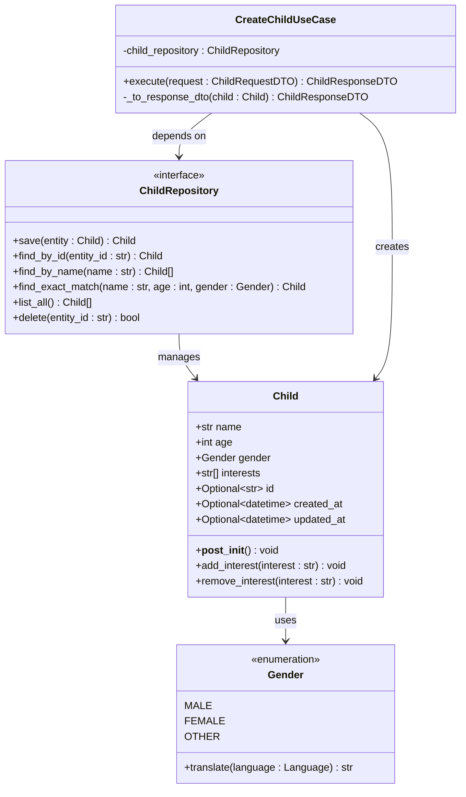
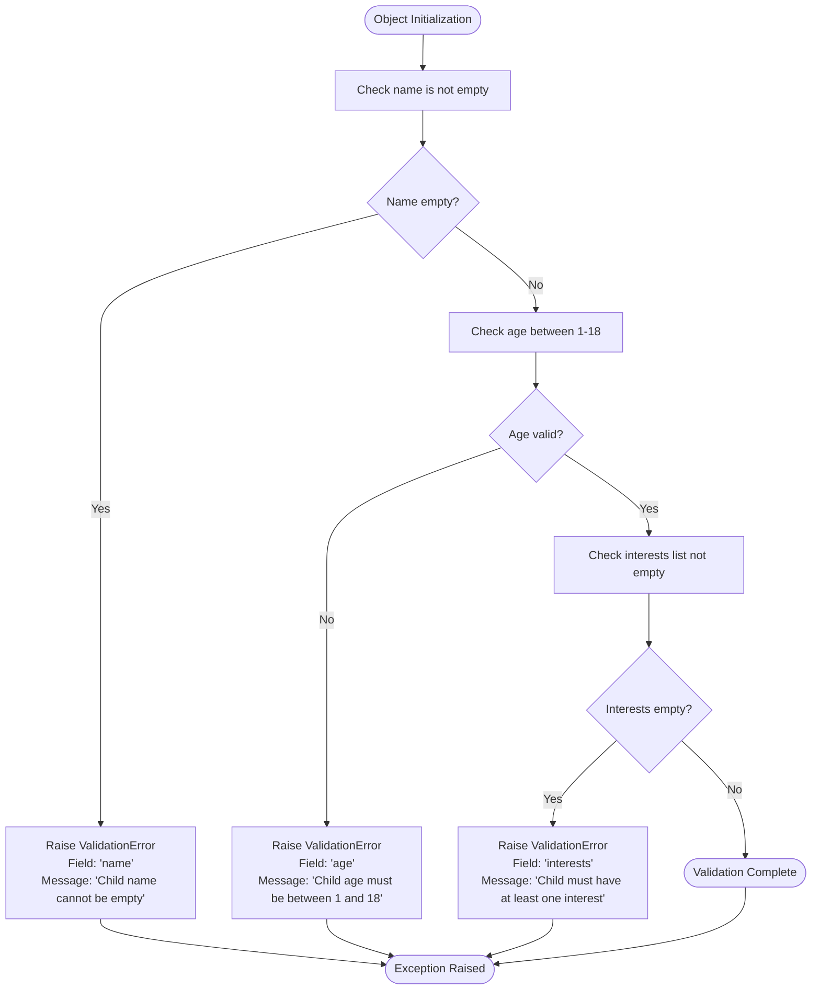
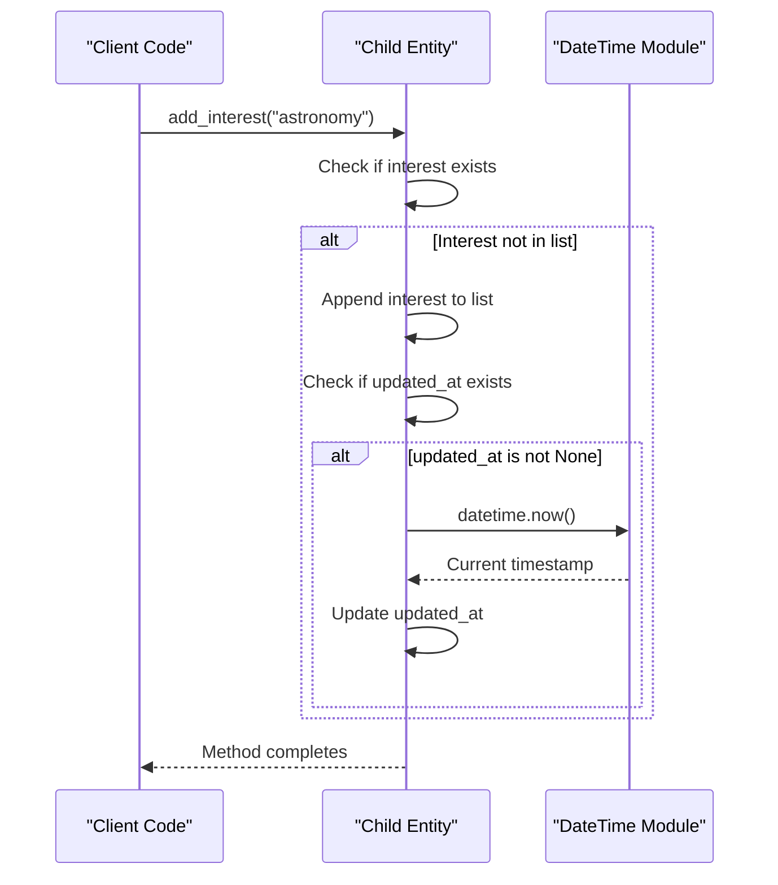
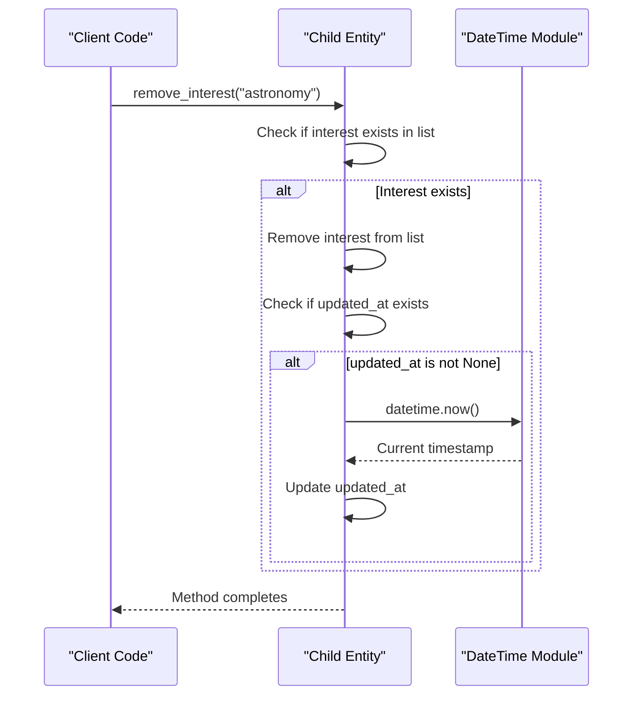
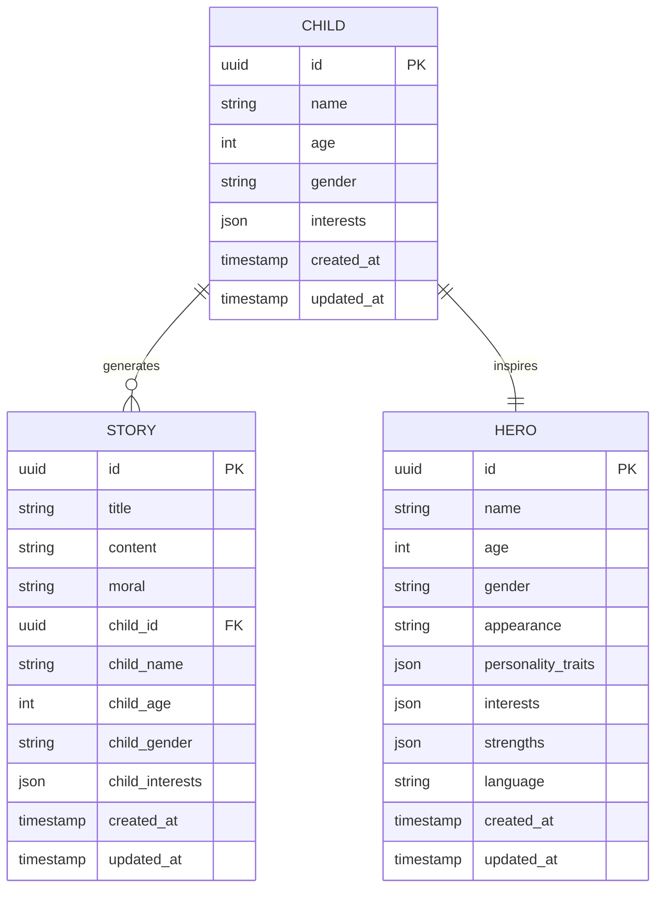
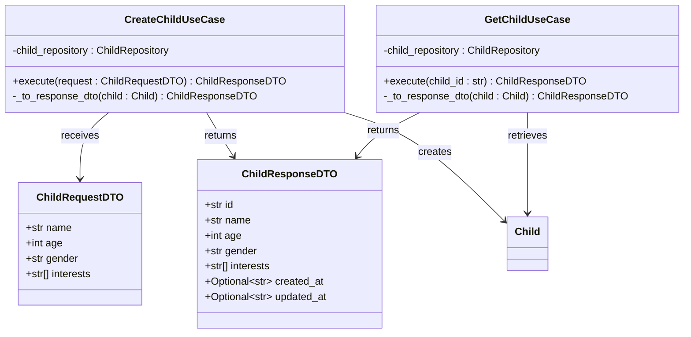
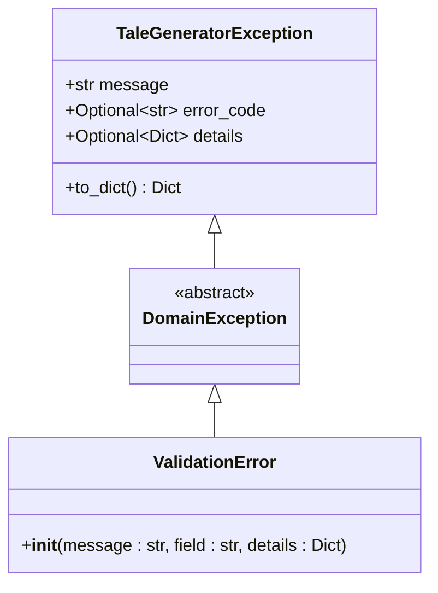

# Child Entity

<cite>
**Referenced Files in This Document**
- [src/domain/entities.py](file://src/domain/entities.py)
- [src/domain/value_objects.py](file://src/domain/value_objects.py)
- [src/application/dto.py](file://src/application/dto.py)
- [src/models.py](file://src/models.py)
- [src/domain/repositories/base.py](file://src/domain/repositories/base.py)
- [src/domain/repositories/child_repository.py](file://src/domain/repositories/child_repository.py)
- [src/application/use_cases/manage_children.py](file://src/application/use_cases/manage_children.py)
- [src/supabase_client.py](file://src/supabase_client.py)
- [src/core/exceptions.py](file://src/core/exceptions.py)
- [test_children_models.py](file://test_children_models.py)
- [test_children.py](file://test_children.py)
- [test_populate_children.py](file://test_populate_children.py)
</cite>

## Table of Contents
1. [Introduction](#introduction)
2. [Entity Structure](#entity-structure)
3. [Attributes and Validation](#attributes-and-validation)
4. [Methods and Behavior](#methods-and-behavior)
5. [Data Integrity and Constraints](#data-integrity-and-constraints)
6. [Integration with Application Layer](#integration-with-application-layer)
7. [Practical Examples](#practical-examples)
8. [Error Handling and Validation](#error-handling-and-validation)
9. [Best Practices](#best-practices)
10. [Common Issues and Solutions](#common-issues-and-solutions)

## Introduction

The Child entity is a core domain model in the Tale Generator application that represents a child profile used for personalized story generation. It serves as the foundation for creating tailored narratives by capturing essential child characteristics including name, age, gender, and interests. The entity enforces strict validation rules to ensure data integrity and supports dynamic interest management through specialized methods.

## Entity Structure

The Child entity is implemented as a Python dataclass with comprehensive type annotations and validation logic. It follows the domain-driven design principles by encapsulating business rules within the entity itself.



**Diagram sources**
- [src/domain/entities.py](file://src/domain/entities.py#L10-L58)
- [src/domain/value_objects.py](file://src/domain/value_objects.py#L46-L74)
- [src/domain/repositories/child_repository.py](file://src/domain/repositories/child_repository.py#L10-L38)
- [src/application/use_cases/manage_children.py](file://src/application/use_cases/manage_children.py#L16-L109)

**Section sources**
- [src/domain/entities.py](file://src/domain/entities.py#L10-L58)
- [src/domain/value_objects.py](file://src/domain/value_objects.py#L46-L74)

## Attributes and Validation

### Core Attributes

The Child entity contains seven primary attributes that define a complete child profile:

| Attribute | Type | Description | Constraints |
|-----------|------|-------------|-------------|
| `name` | `str` | Child's full name | Cannot be empty or whitespace-only |
| `age` | `int` | Child's age in years | Must be between 1 and 18 (inclusive) |
| `gender` | `Gender` | Child's gender identity | Must be one of MALE, FEMALE, or OTHER |
| `interests` | `List[str]` | Child's hobbies and preferences | Must contain at least one interest |
| `id` | `Optional[str]` | Unique identifier | Auto-generated for new records |
| `created_at` | `Optional[datetime]` | Creation timestamp | Automatically set on creation |
| `updated_at` | `Optional[datetime]` | Last modification timestamp | Updated automatically on changes |

### Validation Rules in `__post_init__`

The entity implements comprehensive validation through the `__post_init__` method, which is automatically called after object initialization:



**Diagram sources**
- [src/domain/entities.py](file://src/domain/entities.py#L22-L35)

**Section sources**
- [src/domain/entities.py](file://src/domain/entities.py#L22-L35)

## Methods and Behavior

### Interest Management Methods

The Child entity provides two key methods for managing interests dynamically:

#### `add_interest(interest: str) -> None`

Adds a new interest to the child's profile while maintaining data integrity:



**Diagram sources**
- [src/domain/entities.py](file://src/domain/entities.py#L37-L47)

#### `remove_interest(interest: str) -> None`

Removes an existing interest from the child's profile:



**Diagram sources**
- [src/domain/entities.py](file://src/domain/entities.py#L48-L58)

### Timestamp Management

Both interest management methods automatically update the `updated_at` timestamp when modifications occur, ensuring accurate change tracking and supporting audit requirements.

**Section sources**
- [src/domain/entities.py](file://src/domain/entities.py#L37-L58)

## Data Integrity and Constraints

### Business Rules Enforcement

The Child entity enforces several critical business rules to maintain data quality:

| Rule | Enforcement Point | Validation Logic |
|------|------------------|------------------|
| Non-empty Name | `__post_init__` | `not self.name or not self.name.strip()` |
| Age Range | `__post_init__` | `self.age < 1 or self.age > 18` |
| Minimum Interests | `__post_init__` | `not self.interests` |
| Interest Uniqueness | `add_interest` | `interest and interest not in self.interests` |
| Interest Existence | `remove_interest` | `interest in self.interests` |

### Relationship with Other Entities

The Child entity serves as a foundational component for several other domain entities:



**Diagram sources**
- [src/domain/entities.py](file://src/domain/entities.py#L10-L21)
- [src/models.py](file://src/models.py#L65-L74)

**Section sources**
- [src/domain/entities.py](file://src/domain/entities.py#L22-L35)

## Integration with Application Layer

### Use Case Implementation

The Child entity integrates seamlessly with the application layer through use cases and repositories:



**Diagram sources**
- [src/application/use_cases/manage_children.py](file://src/application/use_cases/manage_children.py#L16-L109)
- [src/application/dto.py](file://src/application/dto.py#L52-L94)

### Repository Pattern

The Child entity works with the repository pattern for persistence operations:

| Operation | Repository Method | Purpose |
|-----------|------------------|---------|
| Create | `save(entity: Child)` | Persist new child profile |
| Read | `find_by_id(entity_id: str)` | Retrieve child by ID |
| List | `list_all()` | Get all child profiles |
| Delete | `delete(entity_id: str)` | Remove child profile |

**Section sources**
- [src/application/use_cases/manage_children.py](file://src/application/use_cases/manage_children.py#L16-L109)
- [src/domain/repositories/child_repository.py](file://src/domain/repositories/child_repository.py#L10-L38)

## Practical Examples

### Valid Child Profile Creation

Here are examples of valid Child entity instantiations:

**Example 1: Basic Child Profile**
```python
# Valid instantiation with all required fields
child = Child(
    name="Emma",
    age=7,
    gender=Gender.FEMALE,
    interests=["unicorns", "fairies", "princesses"],
    created_at=datetime.now(),
    updated_at=datetime.now()
)
```

**Example 2: Minimal Child Profile**
```python
# Valid instantiation with minimal required fields
child = Child(
    name="Liam",
    age=8,
    gender=Gender.MALE,
    interests=["dinosaurs", "trucks", "robots"]
)
```

### Interest Management Workflows

**Adding Interests:**
```python
# Add new interest
child.add_interest("space exploration")
# updated_at timestamp automatically updated

# Attempt to add duplicate interest (no effect)
child.add_interest("dinosaurs")  # No change to interests list
```

**Removing Interests:**
```python
# Remove existing interest
child.remove_interest("robots")
# updated_at timestamp automatically updated

# Attempt to remove non-existent interest (no effect)
child.remove_interest("magic wands")  # No change
```

### Error Cases and Validation Failures

**Invalid Age Example:**
```python
# This will raise ValidationError
try:
    child = Child(
        name="Sophia",
        age=25,  # Invalid age
        gender=Gender.FEMALE,
        interests=["books", "puzzles"]
    )
except ValidationError as e:
    print(f"Validation failed: {e.message}")
    # Output: "Child age must be between 1 and 18"
```

**Empty Interests Example:**
```python
# This will raise ValidationError
try:
    child = Child(
        name="Alex",
        age=10,
        gender=Gender.OTHER,
        interests=[]  # Empty interests list
    )
except ValidationError as e:
    print(f"Validation failed: {e.message}")
    # Output: "Child must have at least one interest"
```

**Empty Name Example:**
```python
# This will raise ValidationError
try:
    child = Child(
        name="",  # Empty name
        age=5,
        gender=Gender.MALE,
        interests=["drawing", "music"]
    )
except ValidationError as e:
    print(f"Validation failed: {e.message}")
    # Output: "Child name cannot be empty"
```

**Section sources**
- [test_children_models.py](file://test_children_models.py#L10-L30)
- [src/domain/entities.py](file://src/domain/entities.py#L24-L35)

## Error Handling and Validation

### Exception Hierarchy

The Child entity participates in a comprehensive exception hierarchy that provides structured error handling:



**Diagram sources**
- [src/core/exceptions.py](file://src/core/exceptions.py#L6-L237)

### Validation Error Details

Each validation error provides structured information for error handling:

| Error Type | Field | Message | Details |
|------------|-------|---------|---------|
| Name Validation | `"name"` | `"Child name cannot be empty"` | `{}` |
| Age Validation | `"age"` | `"Child age must be between 1 and 18"` | `{"value": actual_age}` |
| Interests Validation | `"interests"` | `"Child must have at least one interest"` | `{}` |

### Error Handling Best Practices

**Try-Catch Pattern:**
```python
from src.core.exceptions import ValidationError

try:
    child = Child(
        name="Emma",
        age=7,
        gender=Gender.FEMALE,
        interests=["unicorns", "fairies"]
    )
except ValidationError as e:
    error_response = {
        "error": e.error_code,
        "message": e.message,
        "field": e.details.get("field"),
        "details": e.details
    }
    # Handle validation error appropriately
```

**Section sources**
- [src/core/exceptions.py](file://src/core/exceptions.py#L41-L66)
- [src/domain/entities.py](file://src/domain/entities.py#L24-L35)

## Best Practices

### Profile Completeness Guidelines

To ensure optimal story generation quality, follow these best practices:

1. **Minimum Interests Requirement**: Always provide at least one genuine interest
2. **Realistic Age Range**: Use ages between 1 and 18 for authentic character development
3. **Meaningful Names**: Choose names that reflect cultural or linguistic appropriateness
4. **Accurate Gender Representation**: Select the most appropriate gender identity option

### Interest Management Best Practices

1. **Diverse Interests**: Include a variety of interests to enable richer story generation
2. **Age-Appropriate Interests**: Ensure interests align with the child's developmental stage
3. **Regular Updates**: Periodically review and update interests to maintain relevance
4. **Quality Over Quantity**: Focus on meaningful interests rather than superficial ones

### Data Integrity Maintenance

1. **Validation First**: Always validate data before creating Child entities
2. **Timestamp Management**: Allow automatic timestamp updates rather than manual setting
3. **Consistent Formatting**: Maintain consistent interest categorization
4. **Regular Audits**: Periodically audit child profiles for completeness

## Common Issues and Solutions

### Validation Errors During Instantiation

**Issue**: `ValidationError` when creating Child instances
**Causes**:
- Empty or whitespace-only name
- Age outside 1-18 range
- Empty interests list
- Invalid gender value

**Solutions**:
```python
# Solution: Validate data before instantiation
def create_valid_child(name: str, age: int, gender: str, interests: List[str]) -> Child:
    # Validate name
    if not name or not name.strip():
        raise ValueError("Name cannot be empty")
    
    # Validate age
    if age < 1 or age > 18:
        raise ValueError("Age must be between 1 and 18")
    
    # Validate interests
    if not interests:
        raise ValueError("At least one interest is required")
    
    # Convert gender string to Gender enum
    gender_enum = Gender(gender.lower())
    
    return Child(
        name=name,
        age=age,
        gender=gender_enum,
        interests=interests
    )
```

### Interest Management Edge Cases

**Issue**: Duplicate interests or empty interest removal
**Solution**: The entity handles these gracefully through built-in checks

**Issue**: Performance concerns with large interest lists
**Solution**: The entity uses efficient list operations and maintains O(1) lookup for existence checks

### Persistence Integration Issues

**Issue**: Timestamp synchronization between entity and repository
**Solution**: The entity automatically manages timestamps, but ensure proper serialization/deserialization in persistence layer

**Issue**: Gender translation inconsistencies
**Solution**: Use the Gender enum consistently and leverage the built-in translation methods for multi-language support

### Memory and Performance Considerations

1. **Interest List Size**: Monitor interest list sizes to prevent memory bloat
2. **Timestamp Precision**: Use UTC timestamps for consistency across deployments
3. **Entity Cloning**: Be mindful of copying large interest lists when duplicating entities

**Section sources**
- [src/domain/entities.py](file://src/domain/entities.py#L37-L58)
- [src/core/exceptions.py](file://src/core/exceptions.py#L41-L66)