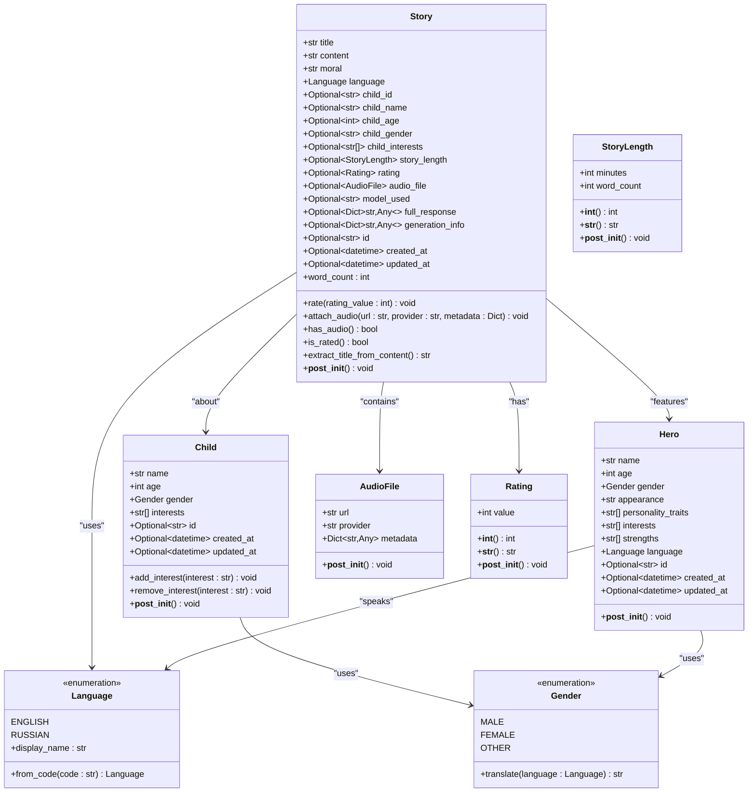
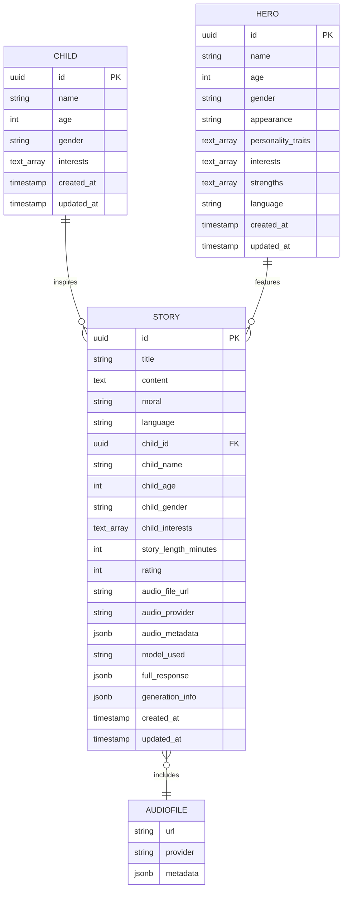
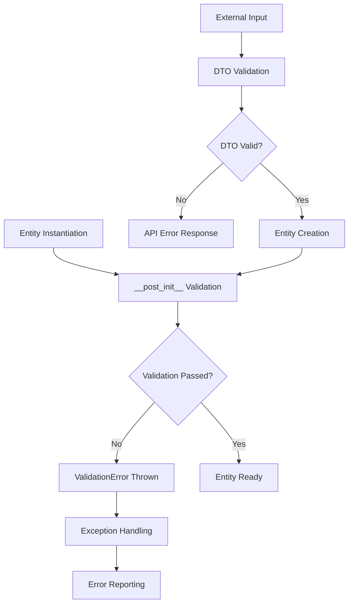

# Entities

<cite>
**Referenced Files in This Document**
- [entities.py](file://src/domain/entities.py)
- [value_objects.py](file://src/domain/value_objects.py)
- [dto.py](file://src/application/dto.py)
- [exceptions.py](file://src/core/exceptions.py)
- [manage_children.py](file://src/application/use_cases/manage_children.py)
- [prompts.py](file://src/prompts.py)
- [models.py](file://src/models.py)
- [test_children_models.py](file://test_children_models.py)
- [test_children.py](file://test_children.py)
</cite>

## Table of Contents
1. [Introduction](#introduction)
2. [Entity Architecture Overview](#entity-architecture-overview)
3. [Core Business Entities](#core-business-entities)
4. [Value Objects](#value-objects)
5. [Entity Relationships](#entity-relationships)
6. [Validation and Business Rules](#validation-and-business-rules)
7. [Behavioral Methods](#behavioral-methods)
8. [Practical Usage Examples](#practical-usage-examples)
9. [Best Practices and Extension Guidelines](#best-practices-and-extension-guidelines)
10. [Common Issues and Troubleshooting](#common-issues-and-troubleshooting)

## Introduction

The Tale Generator domain layer implements a robust entity system that encapsulates core business objects and enforces data integrity through comprehensive validation rules. The entity design follows Domain-Driven Design (DDD) principles, providing clear separation between business logic and infrastructure concerns.

The system consists of four primary entities: **Story**, **Child**, **Hero**, and **AudioFile**, each representing distinct business concepts with rich behavioral methods and strict validation rules. These entities serve as the foundation for the entire storytelling platform, ensuring data consistency and business rule enforcement throughout the application lifecycle.

## Entity Architecture Overview

The entity system is built on Python's `dataclass` decorator, providing immutable data structures with automatic method generation. Each entity encapsulates both data and behavior, following the principle of encapsulation while maintaining clean interfaces for external access.



**Diagram sources**
- [entities.py](file://src/domain/entities.py#L10-L210)
- [value_objects.py](file://src/domain/value_objects.py#L10-L189)

## Core Business Entities

### Story Entity

The **Story** entity represents a complete generated story with comprehensive metadata, rating capabilities, and audio attachment functionality. It serves as the central business object that ties together child profiles, hero characters, and narrative content.

#### Key Attributes and Their Business Significance

| Attribute | Type | Purpose | Business Impact |
|-----------|------|---------|-----------------|
| `title` | str | Story identifier | Essential for story discovery and organization |
| `content` | str | Narrative text | Core storytelling medium with validation |
| `moral` | str | Ethical lesson | Ensures educational value and compliance |
| `language` | Language | Localization support | Enables multilingual storytelling |
| `child_id` | Optional[str] | Relationship reference | Maintains family tree connections |
| `rating` | Optional[Rating] | Quality assessment | Drives content improvement |
| `audio_file` | Optional[AudioFile] | Audio narration | Enhances accessibility and engagement |
| `story_length` | Optional[StoryLength] | Duration specification | Controls content pacing |

#### Behavioral Methods

The Story entity provides several behavioral methods that encapsulate business logic:

- **Rating Management**: [`rate()`](file://src/domain/entities.py#L148-L157) method enables story evaluation with automatic timestamp updates
- **Audio Integration**: [`attach_audio()`](file://src/domain/entities.py#L158-L172) method handles audio file attachment with metadata support
- **Status Checking**: [`has_audio()`](file://src/domain/entities.py#L174-L180) and [`is_rated()`](file://src/domain/entities.py#L182-L188) provide quick status verification
- **Content Analysis**: [`word_count`](file://src/domain/entities.py#L190-L197) property calculates approximate word count
- **Title Extraction**: [`extract_title_from_content()`](file://src/domain/entities.py#L199-L209) automatically extracts titles from story content

**Section sources**
- [entities.py](file://src/domain/entities.py#L115-L210)

### Child Entity

The **Child** entity represents a child profile with comprehensive interest management capabilities and validation rules ensuring data quality.

#### Validation Rules and Business Significance

The Child entity implements strict validation to maintain data integrity:

- **Name Validation**: Non-empty name requirement ensures identification capability
- **Age Range**: 1-18 year constraint aligns with target audience demographics
- **Interest Requirement**: Minimum one interest ensures personalized content generation

#### Interest Management Features

The Child entity provides dynamic interest management through:
- [`add_interest()`](file://src/domain/entities.py#L37-L46) method for expanding child preferences
- [`remove_interest()`](file://src/domain/entities.py#L48-L57) method for refining interests
- Automatic timestamp updates on modifications

**Section sources**
- [entities.py](file://src/domain/entities.py#L10-L58)

### Hero Entity

The **Hero** entity represents a story protagonist with comprehensive character attributes designed to support diverse storytelling scenarios.

#### Comprehensive Character Attributes

| Category | Attributes | Business Purpose |
|----------|------------|------------------|
| **Basic Info** | name, age, gender | Character identification and demographic targeting |
| **Appearance** | appearance description | Visual storytelling and character design |
| **Personality** | personality_traits | Character development and relatability |
| **Strengths** | strengths list | Conflict resolution and problem-solving |
| **Interests** | interests list | Personalization and engagement |
| **Language** | language preference | Localization and cultural relevance |

#### Validation Requirements

The Hero entity enforces comprehensive validation:
- **Name and Appearance**: Non-empty requirements ensure character development
- **Personality Traits**: Minimum one trait requirement maintains character depth
- **Strengths**: Minimum one strength requirement ensures conflict resolution capability

**Section sources**
- [entities.py](file://src/domain/entities.py#L60-L95)

### AudioFile Entity

The **AudioFile** entity encapsulates audio file metadata for story narration, supporting multiple voice providers and audio formats.

#### Metadata Management

The AudioFile entity supports flexible metadata storage through:
- **URL Storage**: Secure audio file references
- **Provider Information**: Voice service identification
- **Custom Metadata**: Additional audio-specific information

**Section sources**
- [entities.py](file://src/domain/entities.py#L97-L112)

## Value Objects

Value objects provide immutable, equality-based data structures that support the entities with specialized business logic.

### Language Enumeration

The Language value object supports multilingual functionality with:
- **ENGLISH** and **RUSSIAN** support
- **Display Name Translation**: Human-readable language names
- **Code Validation**: Safe language code conversion with error handling

### Gender Enumeration

The Gender value object provides:
- **Standard Options**: Male, Female, Other
- **Translation Capabilities**: Cross-language gender representation
- **Cultural Sensitivity**: Support for diverse gender identities

### StoryMoral Enumeration

The StoryMoral value object defines educational themes:
- **Kindness, Honesty, Bravery**: Core ethical lessons
- **Friendship, Perseverance, Empathy**: Social and personal development themes
- **Responsibility, Respect**: Moral and civic education

### Rating Value Object

The Rating value object enforces:
- **1-10 Scale**: Standardized quality assessment
- **Immutable Design**: Prevents accidental modification
- **Rich Representation**: String and integer conversion support

### StoryLength Value Object

The StoryLength value object provides:
- **Duration Specification**: Minute-based story length
- **Word Count Calculation**: Based on average reading speed
- **Automatic Conversion**: Seamless integration with other systems

**Section sources**
- [value_objects.py](file://src/domain/value_objects.py#L10-L189)

## Entity Relationships

The entity system establishes clear relationships that reflect real-world business scenarios:



**Diagram sources**
- [entities.py](file://src/domain/entities.py#L10-L210)
- [models.py](file://src/models.py#L65-L117)

## Validation and Business Rules

The entity system implements comprehensive validation through `__post_init__` methods and custom validation logic.

### Validation Architecture



**Diagram sources**
- [exceptions.py](file://src/core/exceptions.py#L41-L66)
- [entities.py](file://src/domain/entities.py#L22-L95)

### Validation Rules by Entity

| Entity | Validation Rules | Error Handling |
|--------|------------------|----------------|
| **Story** | Title/content/moral non-empty | ValidationError with field details |
| **Child** | Name non-empty, age 1-18, interests present | ValidationError with age details |
| **Hero** | Name/appearance non-empty, traits/strengths present | ValidationError with field context |
| **AudioFile** | URL/provider non-empty | ValidationError with field identification |

### Business Rule Enforcement

The validation system enforces critical business rules:
- **Content Integrity**: Non-empty story elements ensure complete narratives
- **Audience Appropriateness**: Age validation maintains appropriate content
- **Character Development**: Minimum traits/strengths ensure engaging characters
- **Data Completeness**: Required fields prevent incomplete records

**Section sources**
- [entities.py](file://src/domain/entities.py#L22-L95)
- [exceptions.py](file://src/core/exceptions.py#L41-L66)

## Behavioral Methods

Entities encapsulate business logic through carefully designed behavioral methods that maintain data integrity while providing convenient functionality.

### Story Entity Methods

#### Rating System
The [`rate()`](file://src/domain/entities.py#L148-L157) method implements a comprehensive rating system:
- **Parameter Validation**: Automatic rating value checking
- **Timestamp Updates**: Automatic last-modified timestamp
- **Type Safety**: Rating value object integration

#### Audio Management
The [`attach_audio()`](file://src/domain/entities.py#L158-L172) method provides:
- **Atomic Operations**: Complete audio attachment in single method
- **Metadata Support**: Flexible audio metadata handling
- **Consistency Maintenance**: Automatic timestamp updates

#### Status Verification
The [`has_audio()`](file://src/domain/entities.py#L174-L180) and [`is_rated()`](file://src/domain/entities.py#L182-L188) methods offer:
- **Quick Status Checks**: Efficient boolean status verification
- **Null Safety**: Robust null handling for optional relationships

#### Content Analysis
The [`word_count`](file://src/domain/entities.py#L190-L197) property and [`extract_title_from_content()`](file://src/domain/entities.py#L199-L209) method provide:
- **Automated Metrics**: Word count calculation from content
- **Intelligent Extraction**: Title extraction with fallback handling
- **Performance Optimization**: Cached calculations where appropriate

### Child Entity Methods

#### Interest Management
The [`add_interest()`](file://src/domain/entities.py#L37-L46) and [`remove_interest()`](file://src/domain/entities.py#L48-L57) methods implement:
- **Duplicate Prevention**: Automatic duplicate detection
- **Timestamp Synchronization**: Consistent update tracking
- **Null Safety**: Robust handling of optional timestamps

**Section sources**
- [entities.py](file://src/domain/entities.py#L148-L209)

## Practical Usage Examples

### Entity Instantiation Patterns

#### Child Entity Creation
```python
# Basic child creation with validation
child = Child(
    name="Emma",
    age=7,
    gender=Gender.FEMALE,
    interests=["unicorns", "fairies", "princesses"],
    created_at=datetime.now(),
    updated_at=datetime.now()
)

# Interest management
child.add_interest("dragons")  # Add new interest
child.remove_interest("fairies")  # Remove existing interest
```

#### Story Entity Creation and Management
```python
# Story creation with child reference
story = Story(
    title="Magic Garden Adventure",
    content="# Once upon a time...\n\nIn a magical garden...",
    moral="kindness",
    language=Language.ENGLISH,
    child_id=child.id,
    child_name=child.name,
    child_age=child.age,
    child_gender=child.gender.value,
    child_interests=child.interests,
    created_at=datetime.now(),
    updated_at=datetime.now()
)

# Rating and audio attachment
story.rate(9)  # Rate the story
story.attach_audio(
    url="https://voice-provider.com/audio/123",
    provider="ElevenLabs",
    metadata={"voice": "female", "style": "whisper"}
)
```

#### Hero Entity Creation
```python
# Hero creation with comprehensive attributes
hero = Hero(
    name="Captain Wonder",
    age=12,
    gender=Gender.MALE,
    appearance="Wears a blue cape with a golden star",
    personality_traits=["brave", "kind", "curious", "determined"],
    interests=["exploring space", "helping others", "solving mysteries"],
    strengths=["flying", "super strength", "problem-solving"],
    language=Language.ENGLISH
)
```

### Method Usage Patterns

#### Story Content Analysis
```python
# Extract title from content
title = story.extract_title_from_content()
print(f"Extracted title: {title}")

# Calculate word count
words = story.word_count
print(f"Story contains approximately {words} words")
```

#### Status Checking
```python
# Check story status
if story.is_rated():
    print(f"Rated {story.rating}")
    
if story.has_audio():
    print(f"Audio available: {story.audio_file.url}")
```

**Section sources**
- [manage_children.py](file://src/application/use_cases/manage_children.py#L39-L46)
- [test_children_models.py](file://test_children_models.py#L11-L56)
- [prompts.py](file://src/prompts.py#L497-L558)

## Best Practices and Extension Guidelines

### Entity Extension Strategies

When extending entities, follow these principles to maintain encapsulation and data integrity:

#### 1. Preserve Immutable Design
```python
# Good: Extend through composition
@dataclass(frozen=True)
class EnhancedStory(Story):
    tags: List[str] = field(default_factory=list)
    
    def add_tag(self, tag: str) -> 'EnhancedStory':
        return EnhancedStory(
            **self.__dict__,
            tags=self.tags + [tag]
        )

# Avoid: Modifying original entity
@dataclass
class MutableStory(Story):
    tags: List[str] = field(default_factory=list)
    # Risk of breaking immutability
```

#### 2. Maintain Validation Integrity
```python
# Good: Delegate validation to parent entity
@dataclass
class ValidatedChild(Child):
    def __post_init__(self):
        super().__post_init__()
        # Additional validation logic
        if len(self.interests) > 10:
            raise ValidationError("Too many interests", field="interests")
```

#### 3. Use Composition Over Inheritance
```python
# Preferred approach
@dataclass
class StoryWithAnalytics:
    story: Story
    analytics: Dict[str, Any]
    
    @property
    def engagement_score(self) -> float:
        # Calculate based on story and analytics
        return calculate_engagement_score(self.story, self.analytics)
```

### Encapsulation Preservation

#### Internal State Protection
- **Frozen Dataclasses**: Use `@dataclass(frozen=True)` for immutable entities
- **Private Attributes**: Prefix internal attributes with underscore
- **Controlled Access**: Provide controlled access through methods

#### External Interface Design
- **Clean APIs**: Expose only necessary methods and properties
- **Type Safety**: Use proper type hints for all interfaces
- **Documentation**: Document all public methods and their contracts

### Testing Entity Extensions

#### Unit Testing Strategies
```python
def test_enhanced_entity():
    # Test original entity behavior
    story = Story(...)
    assert story.title == "expected"
    
    # Test extended functionality
    enhanced = EnhancedStory(story, tags=["fantasy"])
    assert "fantasy" in enhanced.tags
    
    # Test immutability
    with pytest.raises(dataclasses.FrozenInstanceError):
        enhanced.tags.append("new")
```

## Common Issues and Troubleshooting

### Validation Failures

#### Child Entity Validation Issues
```python
# Problem: Empty name
try:
    child = Child(name="", age=7, gender=Gender.FEMALE, interests=["games"])
except ValidationError as e:
    print(f"Validation failed: {e.message}")
    # Output: "Child name cannot be empty"

# Problem: Invalid age
try:
    child = Child(name="Emma", age=20, gender=Gender.FEMALE, interests=["games"])
except ValidationError as e:
    print(f"Validation failed: {e.message}")
    # Output: "Child age must be between 1 and 18"
```

#### Story Entity Validation Issues
```python
# Problem: Empty content
try:
    story = Story(title="Test", content="", moral="kindness", language=Language.ENGLISH)
except ValidationError as e:
    print(f"Validation failed: {e.message}")
    # Output: "Story content cannot be empty"
```

### Entity State Management

#### Timestamp Synchronization Issues
```python
# Problem: Manual timestamp management
child = Child(...)  # created_at and updated_at set manually
child.add_interest("new interest")  # updated_at not updated automatically

# Solution: Use behavioral methods
child.add_interest("new interest")  # updated_at updated automatically
```

#### Relationship Integrity Issues
```python
# Problem: Orphaned relationships
story = Story(child_id=None, ...)  # Child reference lost

# Solution: Maintain referential integrity
story = Story(
    child_id=child.id,
    child_name=child.name,
    child_age=child.age,
    child_gender=child.gender.value,
    child_interests=child.interests,
    ...
)
```

### Performance Considerations

#### Memory Usage Optimization
- **Lazy Loading**: Load optional attributes only when needed
- **Property Caching**: Cache expensive calculations in properties
- **Batch Operations**: Group related operations for efficiency

#### Validation Performance
```python
# Efficient validation pattern
@dataclass
class OptimizedStory(Story):
    def __post_init__(self):
        # Minimal validation overhead
        super().__post_init__()
        self._validate_content_length()
    
    def _validate_content_length(self):
        if len(self.content) > MAX_CONTENT_LENGTH:
            raise ValidationError("Content too long", field="content")
```

### Error Handling Patterns

#### Graceful Degradation
```python
def safe_story_creation(data: Dict) -> Optional[Story]:
    try:
        return Story(**data)
    except ValidationError as e:
        logger.warning(f"Story creation failed: {e.message}")
        # Return partial data or default values
        return None
```

#### Recovery Strategies
```python
def recover_from_validation_error(entity: Entity, error: ValidationError) -> Entity:
    # Attempt to fix common validation issues
    if error.field == "age" and error.details.get("value", 0) > 18:
        entity.age = 18  # Clamp to valid range
    elif error.field == "interests" and not entity.interests:
        entity.interests = ["default interest"]  # Provide default value
    
    return entity
```

**Section sources**
- [exceptions.py](file://src/core/exceptions.py#L41-L125)
- [test_children.py](file://test_children.py#L1-L50)