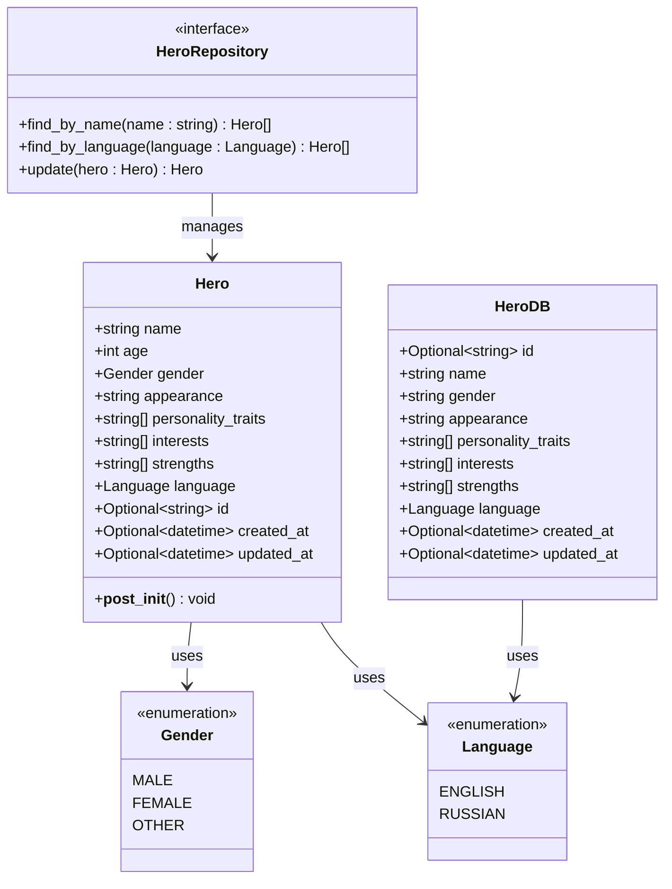
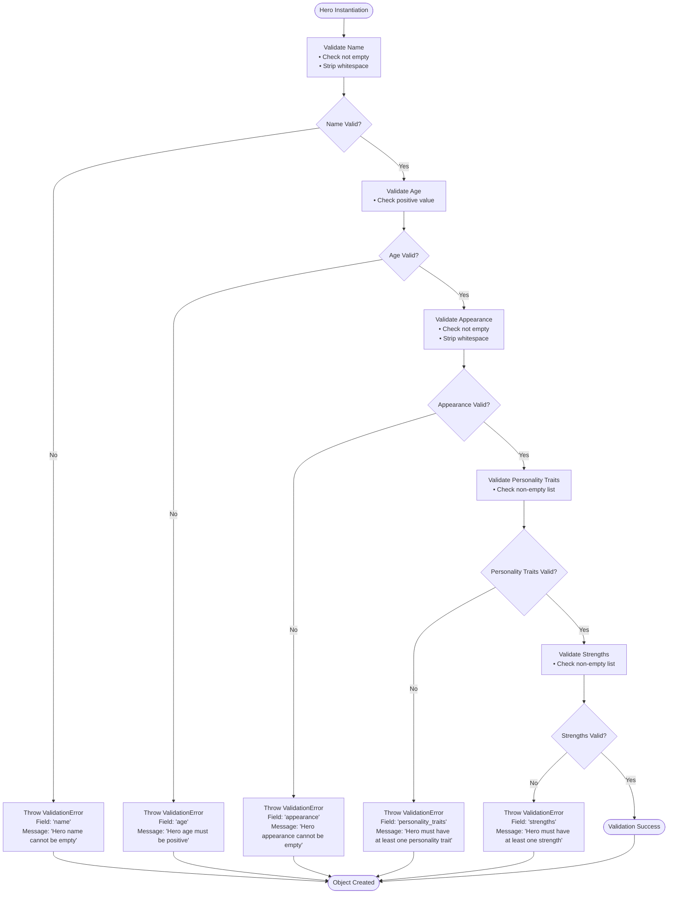
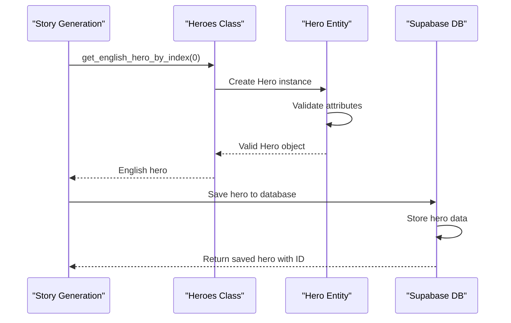
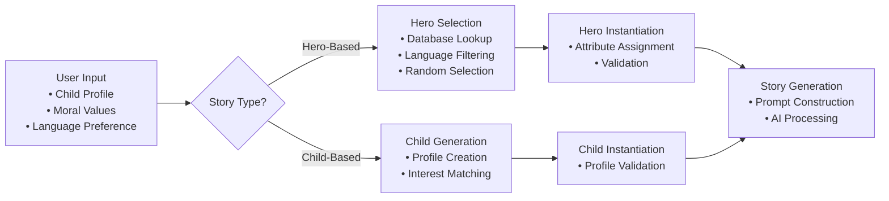
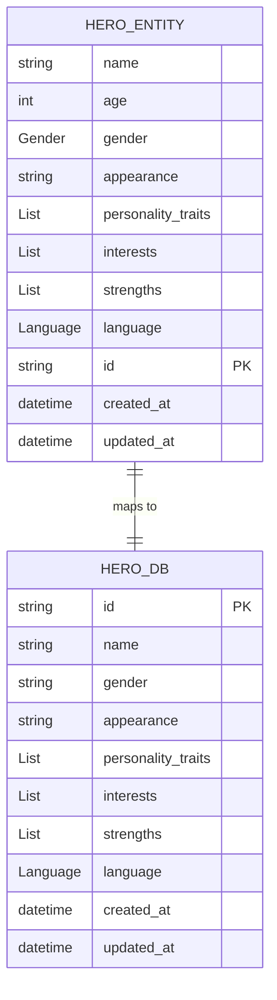
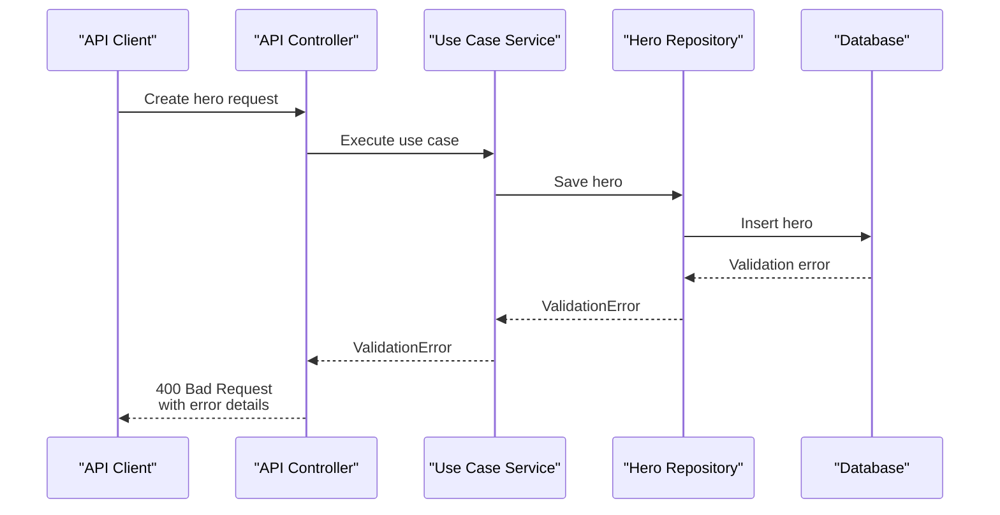

# Hero Entity

<cite>
**Referenced Files in This Document**
- [src/domain/entities.py](file://src/domain/entities.py)
- [src/domain/value_objects.py](file://src/domain/value_objects.py)
- [src/domain/repositories/hero_repository.py](file://src/domain/repositories/hero_repository.py)
- [src/models.py](file://src/models.py)
- [src/prompts.py](file://src/prompts.py)
- [src/core/exceptions.py](file://src/core/exceptions.py)
- [src/supabase_client.py](file://src/supabase_client.py)
- [populate_heroes_db.py](file://populate_heroes_db.py)
- [populate_stories.py](file://populate_stories.py)
</cite>

## Table of Contents
1. [Introduction](#introduction)
2. [Hero Entity Architecture](#hero-entity-architecture)
3. [Core Attributes](#core-attributes)
4. [Validation Logic](#validation-logic)
5. [Data Consistency and Integrity](#data-consistency-and-integrity)
6. [Usage Patterns](#usage-patterns)
7. [Database Integration](#database-integration)
8. [Error Handling](#error-handling)
9. [Best Practices](#best-practices)
10. [Common Issues and Solutions](#common-issues-and-solutions)

## Introduction

The Hero entity is a fundamental component of the Tale Generator domain layer, representing a story hero with rich character attributes that support narrative generation and storytelling quality enhancement. This entity serves as the backbone for creating compelling fictional characters that drive story development and maintain consistency across different languages and cultural contexts.

The Hero entity embodies the principle of rich domain modeling by encapsulating all essential character attributes within a single, cohesive data structure. It leverages Python's dataclasses for automatic attribute generation and validation, ensuring data integrity while maintaining flexibility for various storytelling scenarios.

## Hero Entity Architecture

The Hero entity follows a clean domain-driven design pattern with clear separation of concerns between data representation and business logic validation.

**Diagram sources**
- [src/domain/entities.py](file://src/domain/entities.py#L60-L94)
- [src/models.py](file://src/models.py#L76-L87)
- [src/domain/repositories/hero_repository.py](file://src/domain/repositories/hero_repository.py#L10-L48)
- [src/domain/value_objects.py](file://src/domain/value_objects.py#L46-L74)

**Section sources**
- [src/domain/entities.py](file://src/domain/entities.py#L60-L94)
- [src/models.py](file://src/models.py#L76-L87)

## Core Attributes

The Hero entity contains eight primary attributes that comprehensively define a character's identity and narrative potential:

### Essential Character Attributes

| Attribute | Type | Description | Validation Rules |
|-----------|------|-------------|------------------|
| `name` | `str` | Hero's name for identification | Cannot be empty or whitespace |
| `age` | `int` | Hero's age in years | Must be positive (> 0) |
| `gender` | `Gender` | Hero's gender identity | Enum validation required |
| `appearance` | `str` | Physical description | Cannot be empty or whitespace |

### Personality and Behavioral Attributes

| Attribute | Type | Description | Validation Rules |
|-----------|------|-------------|------------------|
| `personality_traits` | `List[str]` | Character personality traits | Must contain at least one element |
| `interests` | `List[str]` | Hero's interests and hobbies | No minimum requirement |
| `strengths` | `List[str]` | Hero's abilities and strengths | Must contain at least one element |

### Contextual Attributes

| Attribute | Type | Description | Validation Rules |
|-----------|------|-------------|------------------|
| `language` | `Language` | Supported language for the hero | Enum validation required |
| `id` | `Optional[str]` | Unique identifier | Auto-generated in database |
| `created_at` | `Optional[datetime]` | Creation timestamp | Auto-generated |
| `updated_at` | `Optional[datetime]` | Last update timestamp | Auto-updated |

**Section sources**
- [src/domain/entities.py](file://src/domain/entities.py#L64-L74)
- [src/domain/value_objects.py](file://src/domain/value_objects.py#L10-L44)

## Validation Logic

The Hero entity implements comprehensive validation through the `__post_init__` method, ensuring data integrity at instantiation time. This validation mechanism prevents invalid hero configurations from entering the system.

**Diagram sources**
- [src/domain/entities.py](file://src/domain/entities.py#L76-L94)

### Validation Implementation Details

The validation logic employs specific criteria for each attribute:

1. **Name Validation**: Ensures the hero has a meaningful identifier with proper whitespace handling
2. **Age Validation**: Prevents negative or zero ages that would be nonsensical for character ages
3. **Appearance Validation**: Requires a descriptive physical characteristic for character visualization
4. **Personality Traits Validation**: Mandates at least one trait to establish character depth
5. **Strengths Validation**: Requires at least one ability to enable character agency in stories

**Section sources**
- [src/domain/entities.py](file://src/domain/entities.py#L76-L94)

## Data Consistency and Integrity

The Hero entity maintains data consistency through multiple layers of protection:

### Domain-Level Validation
The primary validation occurs within the entity itself, preventing invalid instances from being created. This approach follows the fail-fast principle, catching errors early in the application lifecycle.

### Value Object Integration
The entity leverages strongly-typed value objects (`Gender` and `Language`) to ensure consistent data representation across the system. These enums provide type safety and prevent invalid values from being introduced.

### Timestamp Management
Automatic timestamp management ensures proper audit trail maintenance with `created_at` and `updated_at` fields that track entity lifecycle events.

### Database Schema Alignment
The HeroDB model mirrors the domain entity while accommodating database-specific requirements, maintaining consistency between domain and persistence layers.

**Section sources**
- [src/domain/entities.py](file://src/domain/entities.py#L60-L94)
- [src/models.py](file://src/models.py#L76-L87)

## Usage Patterns

The Hero entity supports various usage patterns across the Tale Generator application, demonstrating its versatility and integration capabilities.

### Predefined Hero Creation

The system includes predefined heroes for immediate use in story generation:

**Diagram sources**
- [src/prompts.py](file://src/prompts.py#L497-L579)
- [populate_heroes_db.py](file://populate_heroes_db.py#L18-L82)

### Dynamic Hero Generation

The system can dynamically generate heroes based on user preferences and story requirements:

**Diagram sources**
- [populate_stories.py](file://populate_stories.py#L88-L146)

### Database Integration Patterns

The Hero entity integrates seamlessly with the database layer through the HeroDB model:

| Operation | Method | Purpose | Validation |
|-----------|--------|---------|------------|
| Create | `save_hero()` | Persist new hero | Domain validation + DB constraints |
| Retrieve | `get_all_heroes()` | Fetch all heroes | Basic filtering + type conversion |
| Update | `update()` | Modify existing hero | Full validation cycle |
| Search | `find_by_name()` | Name-based lookup | String matching + filtering |

**Section sources**
- [src/supabase_client.py](file://src/supabase_client.py#L266-L443)
- [populate_stories.py](file://populate_stories.py#L88-L146)

## Database Integration

The Hero entity demonstrates sophisticated database integration through the HeroDB model, which bridges the gap between domain entities and persistent storage.

### Model Mapping Strategy

The system employs a dual-model approach where domain entities coexist with database-specific models:

**Diagram sources**
- [src/domain/entities.py](file://src/domain/entities.py#L60-L94)
- [src/models.py](file://src/models.py#L76-L87)

### Serialization and Deserialization

The database integration handles complex serialization challenges:

1. **Enum Serialization**: Language and Gender enums are converted to string representations for database storage
2. **DateTime Handling**: Timestamps are serialized using ISO format for cross-platform compatibility
3. **Array Storage**: Lists are stored as JSON arrays, maintaining data structure integrity
4. **Null Handling**: Optional fields are properly managed during insertion and updates

### Transaction Management

Database operations maintain transactional integrity through careful error handling and rollback mechanisms, ensuring data consistency even in failure scenarios.

**Section sources**
- [src/supabase_client.py](file://src/supabase_client.py#L266-L443)

## Error Handling

The Hero entity participates in a comprehensive error handling strategy that provides clear feedback and maintains system stability.

### Validation Error Types

The system defines specific error categories for different validation failures:

| Error Type | Cause | Recovery Strategy |
|------------|-------|-------------------|
| `ValidationError` | Invalid attribute values | User correction required |
| `NotFoundError` | Non-existent hero references | Alternative hero selection |
| `ConflictError` | Duplicate hero creation | Merge or rename operation |
| `DatabaseError` | Persistence failures | Retry with exponential backoff |

### Error Propagation Patterns

Errors propagate through the system according to established patterns:

**Diagram sources**
- [src/core/exceptions.py](file://src/core/exceptions.py#L41-L66)

### Error Response Formatting

The system provides structured error responses that include:
- Human-readable error messages
- Machine-parsable error codes
- Field-specific validation details
- Suggested corrective actions

**Section sources**
- [src/core/exceptions.py](file://src/core/exceptions.py#L41-L66)

## Best Practices

Creating comprehensive hero profiles requires adherence to established best practices that enhance storytelling quality and maintain system reliability.

### Character Development Guidelines

1. **Balanced Personality Traits**: Include a mix of positive and potentially challenging traits for realistic character development
2. **Diverse Strengths**: Ensure strengths complement personality traits and enable character agency
3. **Cultural Sensitivity**: Consider cultural appropriateness when designing characters for international audiences
4. **Age Appropriateness**: Align character traits with typical developmental stages for target audience

### Data Quality Standards

1. **Consistent Naming Conventions**: Use clear, descriptive names that reflect character identity
2. **Descriptive Appearances**: Provide vivid, memorable physical descriptions
3. **Meaningful Interests**: Choose interests that reveal character personality and motivations
4. **Language Consistency**: Ensure all attributes align with the specified language context

### Performance Optimization

1. **Lazy Loading**: Load hero data only when needed for story generation
2. **Caching Strategies**: Implement caching for frequently accessed hero profiles
3. **Batch Operations**: Use batch operations for bulk hero management tasks
4. **Index Optimization**: Ensure database indexes support efficient hero retrieval

### Internationalization Considerations

1. **Language-Specific Attributes**: Maintain separate hero collections for different languages
2. **Cultural Adaptation**: Adapt character traits to resonate with local cultural contexts
3. **Translation Validation**: Verify translated attributes maintain original meaning and impact
4. **Localization Testing**: Test hero profiles across different cultural contexts

## Common Issues and Solutions

Understanding common issues helps developers create robust solutions and avoid frequent pitfalls in hero entity usage.

### Missing Required Fields

**Problem**: Attempting to create a Hero without mandatory attributes
**Solution**: Ensure all required fields are provided during instantiation
**Example**: `Hero(name="Alice", age=12, gender=Gender.FEMALE, appearance="Blonde hair", personality_traits=["brave"], interests=["adventure"], strengths=["courage"], language=Language.ENGLISH)`

### Invalid Data Types

**Problem**: Providing incorrect data types for attributes
**Solution**: Use appropriate value objects and validate types before instantiation
**Example**: Use `Gender.MALE` instead of string "male", and `Language.ENGLISH` instead of string "en"

### Validation Failures

**Problem**: Hero instantiation throws ValidationError
**Solution**: Review validation rules and ensure data meets all requirements
**Common Causes**:
- Empty name or appearance fields
- Negative age values
- Empty personality traits or strengths lists
- Invalid language or gender values

### Database Persistence Issues

**Problem**: Saving heroes to database fails
**Solution**: Implement proper error handling and retry logic
**Common Causes**:
- Network connectivity issues
- Database constraint violations
- Authentication failures
- Rate limiting

### Memory Management

**Problem**: Large hero collections consuming excessive memory
**Solution**: Implement pagination and lazy loading strategies
**Optimization Techniques**:
- Load heroes on-demand
- Implement hero caching with LRU eviction
- Use streaming for large dataset operations

### Internationalization Challenges

**Problem**: Hero attributes not properly localized
**Solution**: Implement comprehensive translation and localization strategies
**Best Practices**:
- Maintain separate attribute collections for each language
- Use translation services for dynamic content
- Test localization with native speakers
- Implement fallback mechanisms for missing translations

**Section sources**
- [src/domain/entities.py](file://src/domain/entities.py#L76-L94)
- [src/core/exceptions.py](file://src/core/exceptions.py#L41-L66)