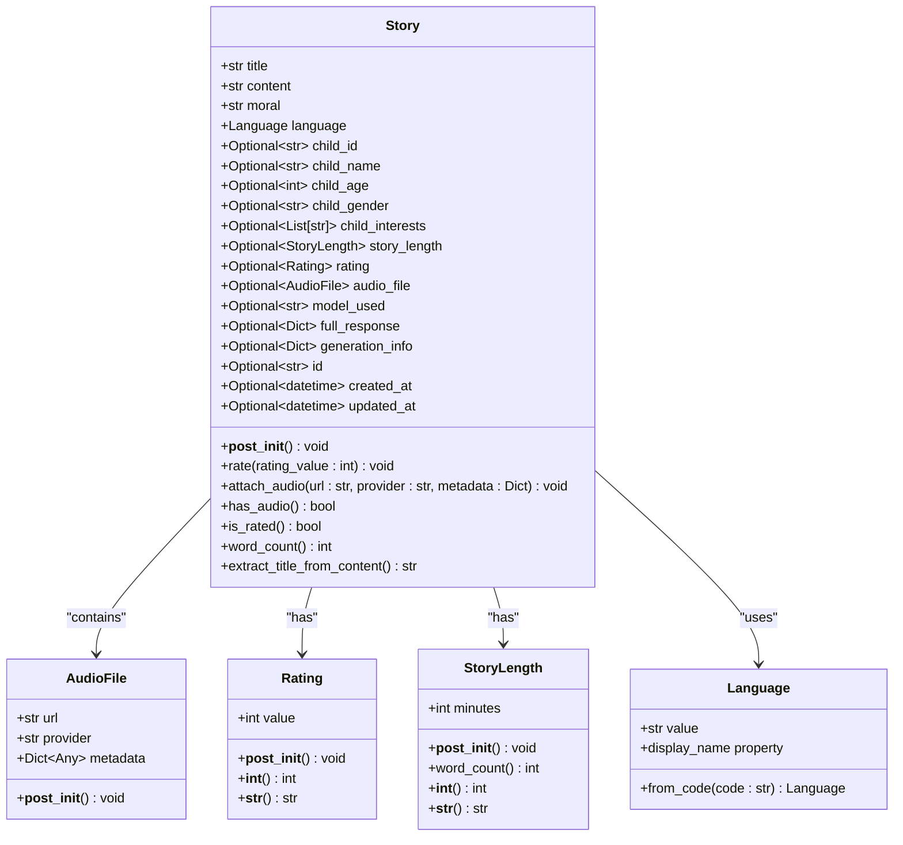
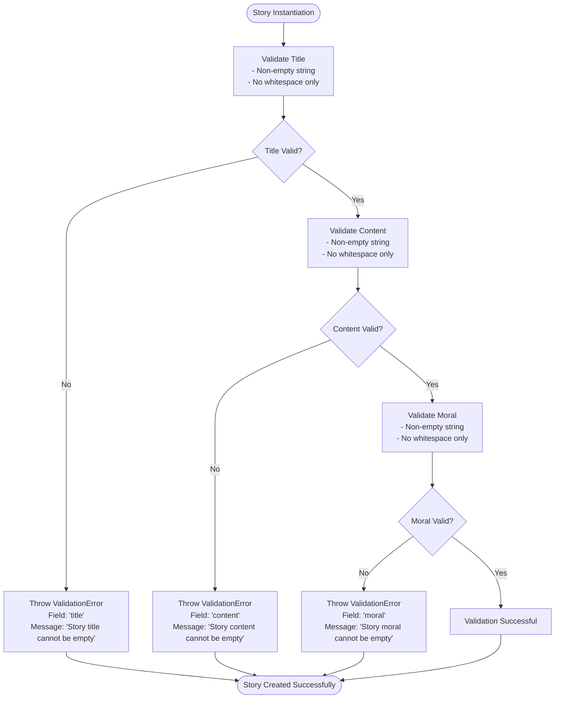
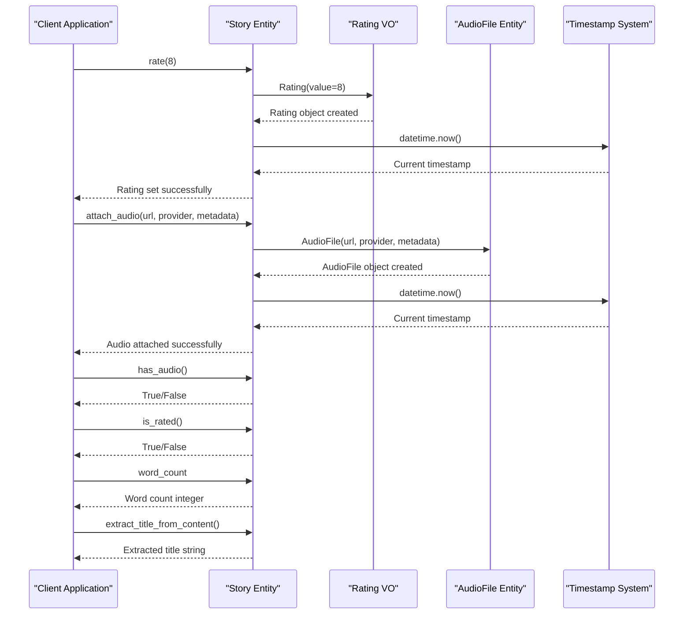
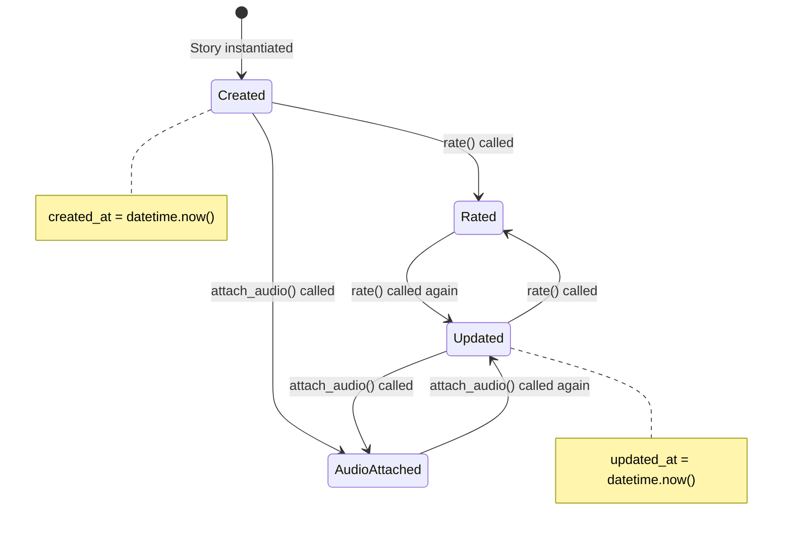
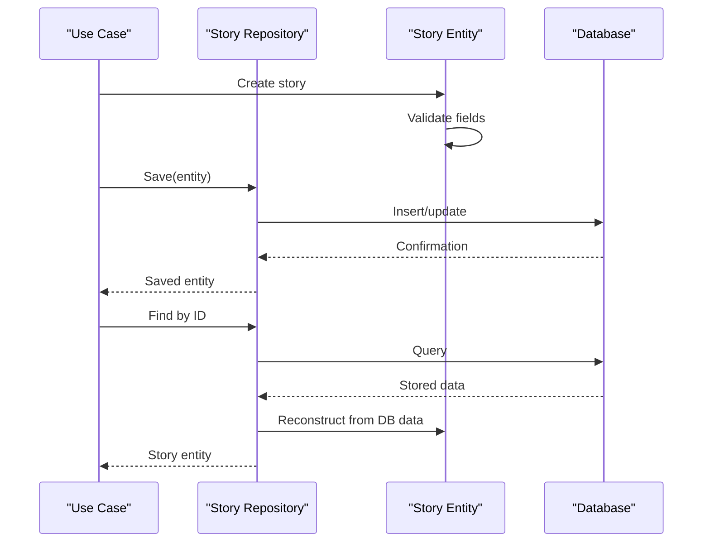

# Story Entity

<cite>
**Referenced Files in This Document**
- [entities.py](file://src/domain/entities.py)
- [value_objects.py](file://src/domain/value_objects.py)
- [story_service.py](file://src/domain/services/story_service.py)
- [generate_story.py](file://src/application/use_cases/generate_story.py)
- [manage_stories.py](file://src/application/use_cases/manage_stories.py)
- [models.py](file://src/models.py)
- [supabase_client.py](file://src/supabase_client.py)
- [test_rating.py](file://test_rating.py)
- [test_russian_story.py](file://test_russian_story.py)
</cite>

## Table of Contents
1. [Introduction](#introduction)
2. [Entity Structure](#entity-structure)
3. [Core Attributes](#core-attributes)
4. [Validation Logic](#validation-logic)
5. [Behavioral Methods](#behavioral-methods)
6. [Value Objects Integration](#value-objects-integration)
7. [Lifecycle Management](#lifecycle-management)
8. [Practical Usage Examples](#practical-usage-examples)
9. [Common Issues and Best Practices](#common-issues-and-best-practices)
10. [Integration Patterns](#integration-patterns)

## Introduction

The Story entity is the central domain object in the Tale Generator application, representing a complete bedtime story with all associated metadata, child information, and multimedia attachments. It encapsulates business rules around content integrity, lifecycle management, and provides a rich set of behavioral methods for story manipulation and analysis.

The entity follows Domain-Driven Design principles with strong validation, immutability where appropriate, and clear separation of concerns between data storage and business logic. It serves as the primary container for story data throughout the application lifecycle, from generation through rating and audio attachment.

## Entity Structure

The Story entity is implemented as a Python dataclass with comprehensive field definitions and validation logic. It maintains relationships with child entities, audio files, and various value objects while ensuring data integrity through post-initialization validation.



**Diagram sources**
- [entities.py](file://src/domain/entities.py#L115-L210)
- [value_objects.py](file://src/domain/value_objects.py#L136-L189)

**Section sources**
- [entities.py](file://src/domain/entities.py#L115-L210)

## Core Attributes

The Story entity contains numerous attributes that capture all aspects of a bedtime story, organized into logical categories for clarity and maintainability.

### Essential Content Attributes

| Attribute | Type | Description | Business Significance |
|-----------|------|-------------|----------------------|
| `title` | `str` | Story title | Primary identifier for story retrieval and display |
| `content` | `str` | Complete story text | Core narrative content with formatting |
| `moral` | `str` | Moral lesson value | Educational content and categorization |
| `language` | `Language` | Story language | Localization and content filtering |

### Child Relationship Metadata

| Attribute | Type | Description | Use Case |
|-----------|------|-------------|----------|
| `child_id` | `Optional[str]` | Reference to child entity | Relationship tracking and analytics |
| `child_name` | `Optional[str]` | Child's name | Personalized story identification |
| `child_age` | `Optional[int]` | Child's age | Age-appropriate content filtering |
| `child_gender` | `Optional[str]` | Child's gender | Personalization and demographic analysis |
| `child_interests` | `Optional[List[str]]` | Child's interests | Content customization and recommendation |

### Technical and Generation Information

| Attribute | Type | Description | Technical Purpose |
|-----------|------|-------------|-------------------|
| `model_used` | `Optional[str]` | AI model identifier | Model tracking and performance analysis |
| `full_response` | `Optional[Dict[Any]]` | Complete API response | Debugging and audit trails |
| `generation_info` | `Optional[Dict[Any]]` | Generation metadata | Performance metrics and optimization |
| `story_length` | `Optional[StoryLength]` | Story duration | Content length analysis and pacing |

### Multimedia and Rating Features

| Attribute | Type | Description | Feature Impact |
|-----------|------|-------------|----------------|
| `audio_file` | `Optional[AudioFile]` | Attached audio file | Audio playback capability |
| `rating` | `Optional[Rating]` | User rating (1-10) | Quality assessment and recommendations |

### Timestamp and Identity

| Attribute | Type | Description | Administrative Use |
|-----------|------|-------------|-------------------|
| `id` | `Optional[str]` | Unique identifier | Database operations and API responses |
| `created_at` | `Optional[datetime]` | Creation timestamp | Audit trails and sorting |
| `updated_at` | `Optional[datetime]` | Last modification timestamp | Change detection and caching |

**Section sources**
- [entities.py](file://src/domain/entities.py#L118-L135)

## Validation Logic

The Story entity implements comprehensive validation through the `__post_init__` method, ensuring data integrity and business rule compliance at instantiation time.

### Core Validation Rules

The validation logic enforces strict requirements on essential story attributes:



**Diagram sources**
- [entities.py](file://src/domain/entities.py#L137-L147)

### Validation Implementation Details

The validation logic specifically checks for:
- **Empty strings**: Ensures the field contains meaningful content
- **Whitespace-only strings**: Prevents stories with only spaces or newlines
- **Required fields**: Enforces presence of essential story components
- **Field-specific messages**: Provides clear error guidance for debugging

### Error Handling and Recovery

When validation fails, the system raises a `ValidationError` with structured error information:
- **Field name**: Identifies the problematic attribute
- **Error message**: Descriptive problem description
- **Details**: Additional context for troubleshooting

**Section sources**
- [entities.py](file://src/domain/entities.py#L137-L147)

## Behavioral Methods

The Story entity provides a comprehensive set of behavioral methods that encapsulate business logic and maintain data consistency through side effects.

### Rating Management

#### `rate(rating_value: int) -> None`

Sets a user rating for the story with validation and timestamp updates.

**Business Significance**: Enables user feedback collection and story quality assessment.

**Side Effects**:
- Creates a new `Rating` value object with the provided value
- Updates the `updated_at` timestamp if available
- Stores the rating in the `rating` field

**Validation**: Automatically handled by the `Rating` value object constructor.

#### `is_rated() -> bool`

Checks whether the story has received a user rating.

**Returns**: Boolean indicating rating status

**Business Significance**: Supports recommendation algorithms and user engagement metrics.

### Audio Management

#### `attach_audio(url: str, provider: str, metadata: Optional[Dict[str, Any]] = None) -> None`

Attaches an audio file to the story with comprehensive metadata support.

**Parameters**:
- `url`: Public URL of the audio file
- `provider`: Audio service provider name
- `metadata`: Optional provider-specific information

**Side Effects**:
- Creates a new `AudioFile` entity
- Updates the `updated_at` timestamp if available
- Establishes relationship with the audio file

**Business Significance**: Enables multimedia storytelling capabilities and enhances user experience.

#### `has_audio() -> bool`

Determines if the story has an audio attachment.

**Returns**: Boolean indicating audio availability

**Technical Implementation**: Checks if `audio_file` is not `None`

### Content Analysis

#### `word_count -> int`

Calculates the approximate word count of the story content.

**Implementation**: Splits content by whitespace and counts resulting tokens

**Returns**: Integer word count approximation

**Business Significance**: Supports content length analysis and reading level estimation.

#### `extract_title_from_content() -> str`

Derives a title from the story's first line, removing Markdown formatting.

**Algorithm**:
1. Splits content by newline characters
2. Takes the first line
3. Removes '#' character if present
4. Returns cleaned title or default "Untitled Story"

**Returns**: Extracted or default title string

**Business Significance**: Provides fallback title generation when title is not explicitly provided.

### Method Interaction Patterns



**Diagram sources**
- [entities.py](file://src/domain/entities.py#L148-L209)

**Section sources**
- [entities.py](file://src/domain/entities.py#L148-L209)

## Value Objects Integration

The Story entity seamlessly integrates with various value objects to enforce type safety and business rule compliance.

### Language Support

The `Language` value object provides type-safe language specification with internationalization support:

| Property/Method | Purpose | Usage |
|----------------|---------|-------|
| `value` | Language code (en/ru) | Database storage and API communication |
| `display_name` | Human-readable name | UI presentation |
| `from_code()` | Factory method | Language parsing from user input |

### Rating System

The `Rating` value object ensures valid rating values (1-10) with comprehensive validation:

| Method | Purpose | Side Effects |
|--------|---------|--------------|
| `__post_init__()` | Validate rating range | Throws ValidationError for invalid values |
| `__int__()` | Convert to integer | Enables numeric operations |
| `__str__()` | String representation | Formats as "X/10" |

### Story Length Management

The `StoryLength` value object manages story duration with word count calculations:

| Property | Purpose | Calculation |
|----------|---------|-------------|
| `minutes` | Duration in minutes | User-specified story length |
| `word_count` | Approximate word count | Based on reading speed (150 WPM) |

**Section sources**
- [value_objects.py](file://src/domain/value_objects.py#L10-L189)

## Lifecycle Management

The Story entity implements comprehensive lifecycle management through timestamp handling and state transitions.

### Timestamp Management

The entity automatically manages creation and update timestamps:



### State Transitions

The entity supports various state combinations:
- **Unrated, No Audio**: Freshly generated stories
- **Rated, No Audio**: Stories with user feedback
- **Unrated, With Audio**: Stories with multimedia attachment
- **Rated, With Audio**: Fully enriched stories

### Persistence Integration

The entity integrates with the persistence layer through DTO transformations:

| Source | Target | Transformation | Purpose |
|--------|--------|----------------|---------|
| `Story` | `StoryDBResponseDTO` | Field mapping with optional handling | API response preparation |
| `Story` | `StoryDB` | Database model conversion | Data persistence |
| `Story` | `StoryResponseDTO` | Simplified response model | Client communication |

**Section sources**
- [entities.py](file://src/domain/entities.py#L134-L135)
- [manage_stories.py](file://src/application/use_cases/manage_stories.py#L315-L336)

## Practical Usage Examples

### Valid Story Creation

Successful story instantiation demonstrates proper field usage and validation:

```python
# Example: Creating a valid story with all required fields
story = Story(
    title="The Brave Little Mouse",
    content="# The Brave Little Mouse\nOnce upon a time...",
    moral="bravery",
    language=Language.ENGLISH,
    child_id="child-123",
    child_name="Emma",
    child_age=7,
    child_gender="female",
    child_interests=["animals", "adventure"],
    story_length=StoryLength(minutes=5),
    model_used="gpt-4",
    created_at=datetime.now(),
    updated_at=datetime.now()
)
```

### Rating Workflow Example

Complete rating process with error handling:

```python
# Example: Story rating workflow
try:
    story.rate(9)  # Valid rating (1-10)
    assert story.is_rated() == True
    assert story.rating.value == 9
except ValidationError as e:
    logger.error(f"Rating validation failed: {e}")
```

### Audio Attachment Pattern

Multi-step audio attachment with metadata:

```python
# Example: Audio attachment with metadata
audio_metadata = {
    "provider": "elevenlabs",
    "voice_id": "english_male",
    "duration_ms": 120000,
    "quality": "high"
}

story.attach_audio(
    url="https://storage.example.com/stories/123/audio.mp3",
    provider="elevenlabs",
    metadata=audio_metadata
)

assert story.has_audio() == True
assert story.audio_file.url == "https://storage.example.com/stories/123/audio.mp3"
```

### Title Extraction Example

Automatic title derivation from content:

```python
# Example: Title extraction from content
content_with_title = "# The Magical Forest Adventure\nOnce upon a time..."
story = Story(title="", content=content_with_title, moral="kindness", language=Language.ENGLISH)

extracted_title = story.extract_title_from_content()
# Returns: "The Magical Forest Adventure"

# Alternative content without title
content_without_title = "Once upon a time...\nChapter 1: The Beginning"
story = Story(title="", content=content_without_title, moral="kindness", language=Language.ENGLISH)

extracted_title = story.extract_title_from_content()
# Returns: "Untitled Story"
```

### Error Handling Examples

Common validation failure scenarios:

```python
# Example: Validation failures
try:
    # Empty title
    Story(title="", content="Some content", moral="kindness", language=Language.ENGLISH)
except ValidationError as e:
    assert e.field == "title"
    assert "cannot be empty" in str(e)

try:
    # Invalid rating
    story = Story(title="Test", content="Content", moral="kindness", language=Language.ENGLISH)
    story.rate(11)  # Invalid rating
except ValidationError as e:
    assert e.field == "rating"
    assert "must be between 1 and 10" in str(e)
```

**Section sources**
- [entities.py](file://src/domain/entities.py#L115-L210)
- [story_service.py](file://src/domain/services/story_service.py#L16-L66)
- [test_rating.py](file://test_rating.py#L15-L56)

## Common Issues and Best Practices

### Validation Failures During Instantiation

**Problem**: Story creation fails due to empty required fields.

**Solution**: Always validate required fields before instantiation:

```python
# Recommended approach
def create_story_safely(title: str, content: str, moral: str, language: Language) -> Story:
    if not title or not title.strip():
        raise ValueError("Title cannot be empty")
    if not content or not content.strip():
        raise ValueError("Content cannot be empty")
    if not moral or not moral.strip():
        raise ValueError("Moral cannot be empty")
    
    return Story(title=title, content=content, moral=moral, language=language)
```

### Optional Field Handling

**Best Practice**: Use explicit None values for optional fields rather than empty containers:

```python
# Good: Explicit None
story = Story(
    title="My Story",
    content="Content",
    moral="kindness",
    language=Language.ENGLISH,
    child_interests=None  # Explicitly optional
)

# Avoid: Empty lists/dicts
story = Story(
    title="My Story",
    content="Content",
    moral="kindness",
    language=Language.ENGLISH,
    child_interests=[]  # May cause confusion
)
```

### Timestamp Management

**Best Practice**: Let the entity handle timestamp updates automatically:

```python
# Good: Entity manages timestamps
story = Story(title="New Story", content="Content", moral="kindness", language=Language.ENGLISH)
# created_at and updated_at handled internally

# Bad: Manual timestamp management
story = Story(
    title="New Story", 
    content="Content", 
    moral="kindness", 
    language=Language.ENGLISH,
    created_at=datetime.now(),  # May conflict with internal logic
    updated_at=datetime.now()   # May conflict with internal logic
)
```

### Audio File Management

**Best Practice**: Validate audio URLs before attachment:

```python
def attach_audio_safely(story: Story, url: str, provider: str) -> bool:
    if not url or not url.startswith(("http://", "https://")):
        logger.warning(f"Invalid audio URL: {url}")
        return False
    
    try:
        story.attach_audio(url, provider)
        return True
    except ValidationError as e:
        logger.error(f"Audio attachment failed: {e}")
        return False
```

### Memory Management

**Consideration**: Large story content may impact memory usage:

```python
# Monitor word count for large stories
large_story_word_count = story.word_count
if large_story_word_count > 1000:
    logger.warning(f"Large story detected: {large_story_word_count} words")
```

### Thread Safety

**Consideration**: The entity is mutable and not thread-safe:

```python
# Thread-safe approach for concurrent access
import threading

class ThreadSafeStory:
    def __init__(self, story: Story):
        self.story = story
        self.lock = threading.Lock()
    
    def rate(self, rating_value: int):
        with self.lock:
            self.story.rate(rating_value)
```

## Integration Patterns

### Repository Pattern Integration

The Story entity integrates with repositories through standardized interfaces:



**Diagram sources**
- [generate_story.py](file://src/application/use_cases/generate_story.py#L108-L110)
- [supabase_client.py](file://src/supabase_client.py#L559-L593)

### Service Layer Integration

Story service coordinates complex workflows:

```python
# Example: Story generation workflow
class StoryGenerationWorkflow:
    def execute(self, request: StoryRequestDTO) -> StoryResponseDTO:
        # 1. Validate request
        self.story_service.validate_story_request(child, moral, language, story_length)
        
        # 2. Generate content
        ai_result = self.ai_service.generate_story(prompt)
        
        # 3. Create story entity
        story = self.story_service.create_story(
            title=title,
            content=ai_result.content,
            moral=moral,
            language=language,
            child=child,
            story_length=story_length
        )
        
        # 4. Attach audio if requested
        if request.generate_audio:
            audio_url = self._generate_audio(story, request)
            story.attach_audio(audio_url, provider, metadata)
        
        # 5. Save and return
        saved_story = self.story_repository.save(story)
        return self._to_response_dto(saved_story)
```

### DTO Transformation Patterns

Multiple DTO transformations support different use cases:

| DTO Type | Purpose | Fields Included |
|----------|---------|----------------|
| `StoryDBResponseDTO` | API responses | All story fields with optional handling |
| `StoryDB` | Database persistence | Database-compatible field mapping |
| `StoryResponseDTO` | Client communication | Simplified response model |

**Section sources**
- [generate_story.py](file://src/application/use_cases/generate_story.py#L53-L121)
- [story_service.py](file://src/domain/services/story_service.py#L13-L66)
- [manage_stories.py](file://src/application/use_cases/manage_stories.py#L315-L336)