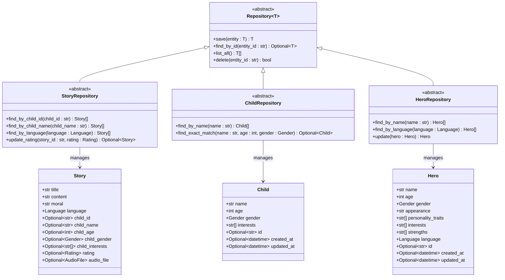
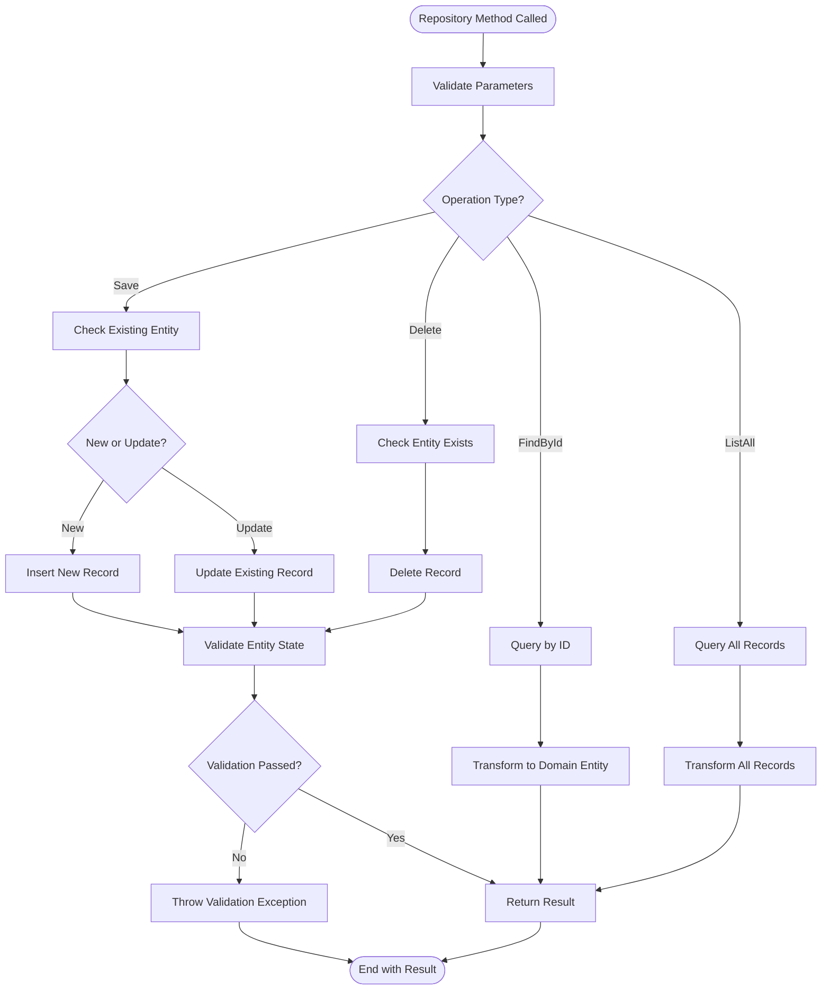

# Base Repository Interface

<cite>
**Referenced Files in This Document**
- [base.py](file://src/domain/repositories/base.py)
- [story_repository.py](file://src/domain/repositories/story_repository.py)
- [child_repository.py](file://src/domain/repositories/child_repository.py)
- [hero_repository.py](file://src/domain/repositories/hero_repository.py)
- [entities.py](file://src/domain/entities.py)
- [value_objects.py](file://src/domain/value_objects.py)
- [models.py](file://src/infrastructure/persistence/models.py)
</cite>

## Table of Contents
1. [Introduction](#introduction)
2. [Generic Repository Architecture](#generic-repository-architecture)
3. [Core CRUD Operations](#core-crud-operations)
4. [Entity-Specific Repository Interfaces](#entity-specific-repository-interfaces)
5. [Type Safety and Generics](#type-safety-and-generics)
6. [Implementation Patterns](#implementation-patterns)
7. [Common Implementation Challenges](#common-implementation-challenges)
8. [Best Practices](#best-practices)
9. [Architecture Benefits](#architecture-benefits)
10. [Conclusion](#conclusion)

## Introduction

The Tale Generator application employs a sophisticated domain-driven architecture with a robust repository pattern implementation. At the heart of this architecture lies the generic `Repository[T]` abstract base class, which establishes a standardized foundation for all data access operations across the domain layer. This interface ensures type safety, consistency, and maintainability while providing flexibility for entity-specific requirements.

The repository pattern serves as a crucial abstraction layer between the domain logic and the persistence infrastructure, enabling clean separation of concerns and facilitating testing, maintenance, and future extensibility of the system.

## Generic Repository Architecture

The foundation of the repository system is built upon Python's type system and generics, providing compile-time type safety and runtime flexibility. The architecture follows a hierarchical design where the base repository defines common operations, while specialized repositories extend these capabilities for specific entity types.



**Diagram sources**
- [base.py](file://src/domain/repositories/base.py#L9-L56)
- [story_repository.py](file://src/domain/repositories/story_repository.py#L10-L61)
- [child_repository.py](file://src/domain/repositories/child_repository.py#L10-L38)
- [hero_repository.py](file://src/domain/repositories/hero_repository.py#L10-L48)
- [entities.py](file://src/domain/entities.py#L10-L210)

**Section sources**
- [base.py](file://src/domain/repositories/base.py#L1-L56)
- [entities.py](file://src/domain/entities.py#L1-L210)

## Core CRUD Operations

The `Repository[T]` base class defines four fundamental CRUD (Create, Read, Update, Delete) operations that form the backbone of all data access patterns in the application. These operations are designed to be simple, consistent, and type-safe across all repository implementations.

### Save Operation

The `save()` method handles both creation and updating of entities, determining the appropriate action based on the presence of an identifier. This operation ensures that entities are persisted with their current state and returns the saved entity with any generated identifiers.

**Method Signature:** `save(entity: T) -> T`

**Parameters:**
- `entity: T` - The entity to be saved, typed to the specific repository's entity type

**Return Value:** `T` - The saved entity with any generated identifiers populated

**Expected Behavior:**
- Creates new records when entity ID is None or not present
- Updates existing records when entity ID is present
- Returns the entity with all identifiers populated
- Validates entity state before saving
- Handles concurrent modification scenarios

### Find By ID Operation

The `find_by_id()` method retrieves a single entity by its unique identifier, returning an optional result to handle the case where the entity does not exist.

**Method Signature:** `find_by_id(entity_id: str) -> Optional[T]`

**Parameters:**
- `entity_id: str` - The unique identifier of the entity to retrieve

**Return Value:** `Optional[T]` - The entity if found, None otherwise

**Expected Behavior:**
- Performs efficient lookup by primary key
- Returns None for non-existent entities
- Handles various ID formats consistently
- May implement caching strategies for frequently accessed entities

### List All Operation

The `list_all()` method provides access to all entities managed by the repository, enabling enumeration and bulk operations.

**Method Signature:** `list_all() -> List[T]`

**Return Value:** `List[T]` - A list containing all entities managed by the repository

**Expected Behavior:**
- Returns all entities in the repository
- May implement pagination for large datasets
- Maintains consistent ordering when applicable
- Could support filtering and sorting parameters

### Delete Operation

The `delete()` method removes entities from the persistent storage by their identifier, returning a boolean indicating the success of the operation.

**Method Signature:** `delete(entity_id: str) -> bool`

**Parameters:**
- `entity_id: str` - The unique identifier of the entity to delete

**Return Value:** `bool` - True if deletion was successful, False otherwise

**Expected Behavior:**
- Removes the entity if it exists
- Returns False for non-existent entities
- Handles cascading deletions appropriately
- May implement soft deletion strategies

**Section sources**
- [base.py](file://src/domain/repositories/base.py#L12-L55)

## Entity-Specific Repository Interfaces

Each entity type in the domain layer extends the base repository interface with specialized methods tailored to their specific requirements and business logic. This approach maintains consistency while allowing for entity-specific functionality.

### Story Repository

The `StoryRepository` extends the base repository with methods specific to story management, including child-based queries, language filtering, and rating updates.

**Specialized Methods:**
- `find_by_child_id(child_id: str) -> List[Story]` - Retrieves stories associated with a specific child
- `find_by_child_name(child_name: str) -> List[Story]` - Finds stories by child name
- `find_by_language(language: Language) -> List[Story]` - Filters stories by language
- `update_rating(story_id: str, rating: Rating) -> Optional[Story]` - Updates story ratings

**Business Logic Integration:**
The StoryRepository integrates closely with the story generation and rating systems, providing specialized queries that support the application's core functionality of associating stories with child profiles and managing user feedback.

### Child Repository

The `ChildRepository` focuses on child profile management with methods for name-based queries and exact profile matching.

**Specialized Methods:**
- `find_by_name(name: str) -> List[Child]` - Retrieves children by name
- `find_exact_match(name: str, age: int, gender: Gender) -> Optional[Child]` - Finds exact profile matches

**Profile Management Features:**
The ChildRepository supports the application's requirement to manage multiple child profiles and find exact matches for story generation, ensuring that stories are personalized according to specific child characteristics.

### Hero Repository

The `HeroRepository` manages hero entities with methods for name and language-based queries, plus specialized update operations.

**Specialized Methods:**
- `find_by_name(name: str) -> List[Hero]` - Finds heroes by name
- `find_by_language(language: Language) -> List[Hero]` - Filters heroes by language
- `update(hero: Hero) -> Hero` - Updates hero entities

**Localization Support:**
The HeroRepository includes language-specific queries to support the application's multilingual capabilities, ensuring that heroes are matched according to the target language of story generation.

**Section sources**
- [story_repository.py](file://src/domain/repositories/story_repository.py#L1-L61)
- [child_repository.py](file://src/domain/repositories/child_repository.py#L1-L38)
- [hero_repository.py](file://src/domain/repositories/hero_repository.py#L1-L48)

## Type Safety and Generics

The repository architecture leverages Python's type system and generics to ensure compile-time type safety while maintaining runtime flexibility. This approach prevents common data access errors and improves developer productivity through better IDE support and static analysis.

### Generic Type Parameter

The `Repository[T]` class uses a type variable `T` that represents the entity type managed by the repository. This generic parameter enables type-safe operations across all repository implementations.

**Type Variable Declaration:**
```python
T = TypeVar('T')
```

**Generic Base Class:**
```python
class Repository(ABC, Generic[T]):
```

### Type Safety Benefits

**Compile-Time Validation:**
- Ensures correct entity types are passed to repository methods
- Prevents accidental mixing of different entity types
- Provides better IDE autocompletion and error detection

**Runtime Flexibility:**
- Maintains polymorphic behavior for different entity types
- Enables consistent interface across all repository implementations
- Supports dynamic dispatch based on entity type

### Entity Type Binding

Each specialized repository binds the generic type parameter to its specific entity type:

**Story Repository Type Binding:**
```python
class StoryRepository(Repository[Story]):
```

**Child Repository Type Binding:**
```python
class ChildRepository(Repository[Child]):
```

**Hero Repository Type Binding:**
```python
class HeroRepository(Repository[Hero]):
```

This binding ensures that:
- Repository methods accept and return the correct entity types
- Type hints provide accurate information to developers
- Static analysis tools can validate type correctness

**Section sources**
- [base.py](file://src/domain/repositories/base.py#L6-L7)
- [story_repository.py](file://src/domain/repositories/story_repository.py#L10)
- [child_repository.py](file://src/domain/repositories/child_repository.py#L10)
- [hero_repository.py](file://src/domain/repositories/hero_repository.py#L10)

## Implementation Patterns

The repository interface establishes several implementation patterns that guide concrete repository implementations while maintaining flexibility for different persistence technologies and strategies.

### Standard CRUD Pattern

All repositories follow a consistent pattern for implementing the core CRUD operations:



**Diagram sources**
- [base.py](file://src/domain/repositories/base.py#L12-L55)

### Entity Transformation Pattern

Repositories implement a consistent pattern for transforming between domain entities and persistence models:

**Domain to Persistence Transformation:**
- Convert domain entities to database models
- Handle type conversions and validations
- Apply any necessary transformations

**Persistence to Domain Transformation:**
- Convert database models to domain entities
- Reconstruct entity relationships
- Apply any necessary post-processing

### Error Handling Pattern

Repositories implement consistent error handling patterns:

**Validation Errors:**
- Validate entity state before persistence operations
- Throw appropriate validation exceptions
- Provide meaningful error messages

**Infrastructure Errors:**
- Catch and wrap infrastructure exceptions
- Provide consistent error responses
- Log errors appropriately

**Business Logic Errors:**
- Handle business rule violations
- Return appropriate error responses
- Maintain transaction boundaries

## Common Implementation Challenges

Implementing repository interfaces presents several common challenges that require careful consideration and thoughtful solutions to maintain system reliability and performance.

### Error Handling Strategies

**Validation Error Management:**
Repositories must distinguish between different types of validation errors and handle them appropriately. This includes validating entity state, checking business rules, and ensuring data integrity.

**Infrastructure Error Recovery:**
Network failures, database connectivity issues, and resource constraints require robust error handling and recovery mechanisms. Repositories should implement retry logic, circuit breakers, and graceful degradation strategies.

**Transaction Management:**
Maintaining data consistency across multiple operations requires careful transaction management. Repositories must handle transaction boundaries, rollback scenarios, and concurrent access properly.

### Transaction Management

**ACID Properties:**
Repositories must ensure Atomicity, Consistency, Isolation, and Durability for all operations. This includes handling distributed transactions, managing foreign key constraints, and maintaining referential integrity.

**Optimistic vs. Pessimistic Locking:**
Different use cases require different locking strategies. Repositories must implement appropriate concurrency control mechanisms to prevent race conditions and ensure data consistency.

**Batch Operations:**
Efficient batch operations require special consideration for transaction boundaries, memory usage, and performance optimization. Repositories must balance throughput with consistency guarantees.

### Performance Considerations

**Query Optimization:**
Repositories must implement efficient queries that minimize database load and maximize response times. This includes proper indexing, query planning, and avoiding N+1 query problems.

**Caching Strategies:**
Implementing appropriate caching mechanisms can significantly improve performance. Repositories must decide what to cache, how long to cache it, and when to invalidate cached data.

**Connection Pooling:**
Managing database connections efficiently requires proper connection pooling, connection lifecycle management, and resource cleanup strategies.

**Pagination and Filtering:**
Large datasets require pagination and filtering capabilities. Repositories must implement efficient pagination strategies and support complex filtering criteria.

### Data Consistency Issues

**Eventual Consistency:**
Distributed systems may require eventual consistency models. Repositories must handle scenarios where immediate consistency cannot be guaranteed.

**Cross-Repository Dependencies:**
Operations spanning multiple repositories require careful coordination to maintain consistency. Repositories must implement appropriate synchronization mechanisms.

**Audit Trails:**
Maintaining audit trails for data modifications requires careful design. Repositories must track changes, maintain history, and support audit queries.

## Best Practices

Effective repository implementation requires adherence to established best practices that ensure maintainability, reliability, and performance across the application lifecycle.

### Consistency Across Implementations

**Interface Compliance:**
All repository implementations must strictly adhere to the defined interface contract. This includes parameter validation, return value formats, and error handling patterns.

**Naming Conventions:**
Consistent naming conventions across all repositories improve code readability and maintainability. Method names should clearly indicate their purpose and behavior.

**Documentation Standards:**
Comprehensive documentation for all repository methods ensures that developers understand their intended use and behavior. Documentation should include parameter descriptions, return value specifications, and expected exceptions.

### Loose Coupling Principles

**Dependency Injection:**
Repositories should be injectable dependencies rather than tightly coupled to specific implementations. This enables testing, mocking, and future refactoring.

**Interface Segregation:**
Repositories should implement focused interfaces that provide only the necessary functionality. This reduces coupling and improves maintainability.

**Abstraction Layers:**
Maintain clear abstraction layers between repositories and persistence technology. This enables technology switching and reduces vendor lock-in.

### Testing and Quality Assurance

**Unit Testing:**
Repositories should be thoroughly unit tested with comprehensive test coverage. Tests should verify all interface methods, edge cases, and error conditions.

**Integration Testing:**
Integration tests should verify repository behavior with actual persistence technology. This includes testing database interactions, transaction handling, and performance characteristics.

**Mock Repository Implementation:**
Implementing mock repository variants enables isolated testing of business logic without persistence dependencies.

### Monitoring and Observability

**Performance Metrics:**
Implement monitoring for repository performance metrics including query execution times, error rates, and resource utilization.

**Logging Standards:**
Establish consistent logging standards for repository operations including successful operations, errors, and performance warnings.

**Health Checks:**
Implement health checks for repository dependencies to enable proactive issue detection and resolution.

## Architecture Benefits

The generic repository interface provides numerous benefits that contribute to the overall quality and maintainability of the Tale Generator application.

### Scalability and Extensibility

**Easy Entity Addition:**
Adding new entity types requires minimal boilerplate code. New repositories simply extend the base interface and implement specialized methods as needed.

**Technology Agnostic:**
The repository pattern enables easy switching between persistence technologies without affecting domain logic. This supports future technology upgrades and experimentation.

**Modular Design:**
Repositories can be developed, tested, and deployed independently, enabling parallel development and reducing integration complexity.

### Maintainability and Reliability

**Consistent Interface:**
All repositories provide a consistent interface, reducing cognitive load for developers and minimizing integration errors.

**Type Safety:**
Generic type parameters ensure compile-time type checking, preventing common data access errors and improving code quality.

**Separation of Concerns:**
Clear separation between domain logic and persistence concerns improves maintainability and enables focused testing.

### Development Productivity

**Reduced Boilerplate:**
The base repository eliminates repetitive CRUD code, allowing developers to focus on business logic rather than infrastructure concerns.

**Better Tooling Support:**
Type hints and consistent interfaces improve IDE support, enabling better autocompletion, refactoring, and static analysis.

**Rapid Prototyping:**
The flexible architecture enables rapid prototyping and iteration without compromising code quality or future maintainability.

## Conclusion

The Base Repository interface in the Tale Generator application represents a well-designed architectural pattern that balances flexibility, type safety, and maintainability. Through its generic design, standardized CRUD operations, and entity-specific extensions, it provides a robust foundation for data access operations while maintaining clean separation of concerns.

The implementation demonstrates several key architectural principles:

**Type Safety Through Generics:** The use of Python generics ensures compile-time type checking while maintaining runtime flexibility, preventing common data access errors and improving developer productivity.

**Consistent Interface Design:** All repository implementations follow a consistent pattern for CRUD operations, making the codebase easier to understand, maintain, and extend.

**Entity-Specific Specialization:** While maintaining consistency, repositories can implement specialized methods tailored to specific entity requirements, supporting the application's diverse business logic needs.

**Future-Proof Architecture:** The design enables easy technology switching, new entity addition, and performance optimization without affecting domain logic or requiring extensive code changes.

The repository pattern, as implemented in this codebase, serves as an excellent example of domain-driven design principles applied to real-world application architecture. It demonstrates how thoughtful abstraction can lead to more maintainable, scalable, and reliable software systems while preserving the flexibility needed for evolving business requirements.

This architecture provides a solid foundation for the Tale Generator application's data access layer and sets the stage for future enhancements, technology upgrades, and scaling efforts. The clear separation between domain logic and persistence concerns ensures that the application can evolve while maintaining its core architectural integrity.