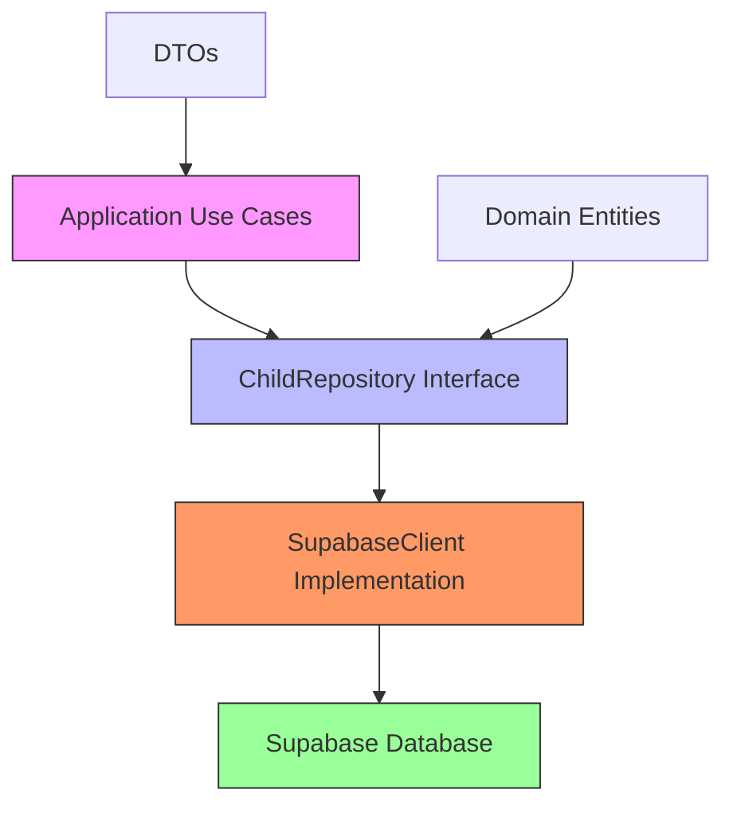
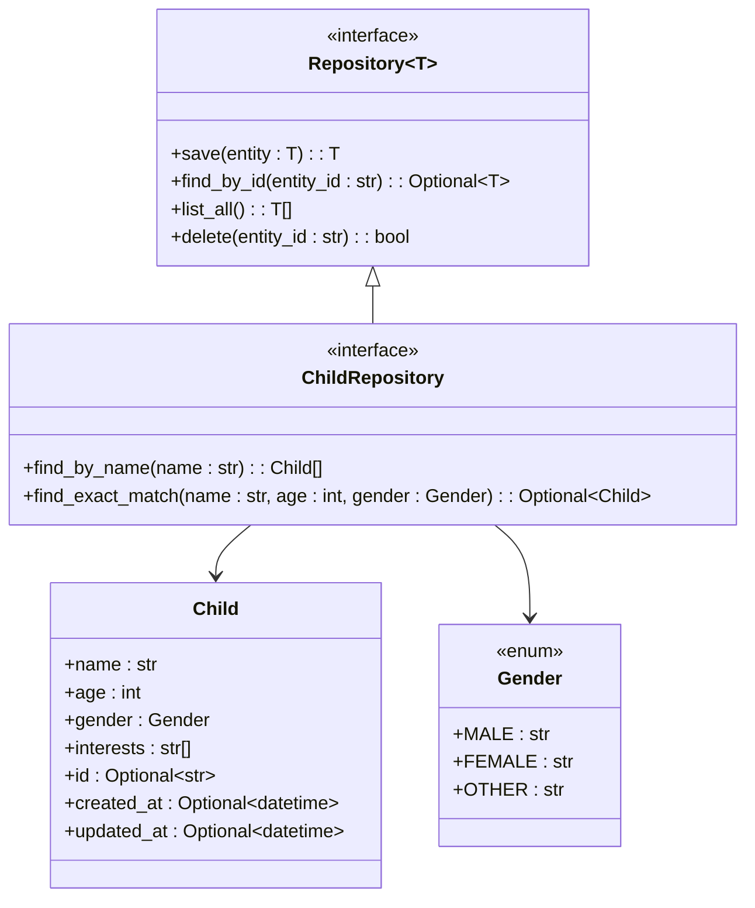
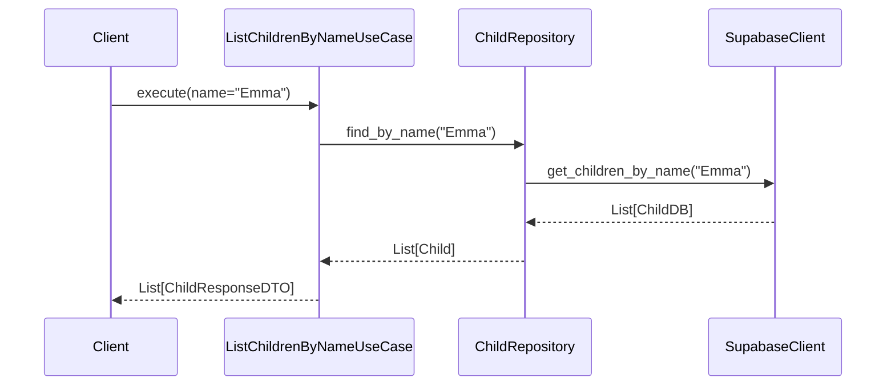
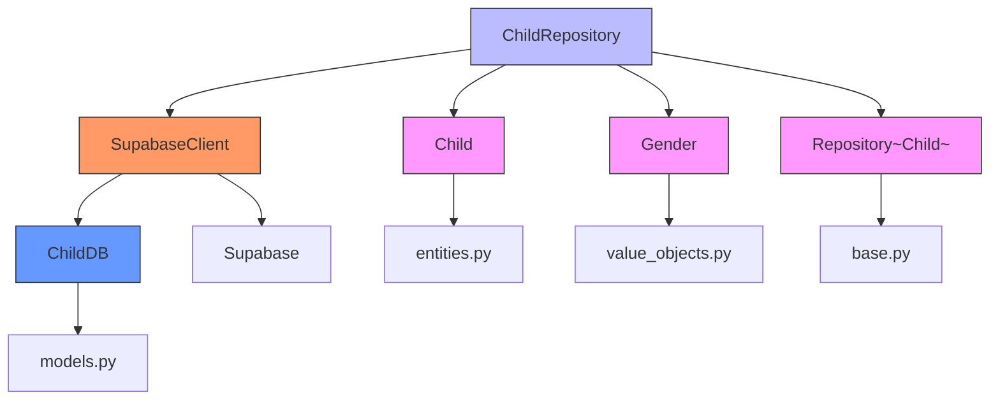

# ChildRepository

<cite>
**Referenced Files in This Document**   
- [child_repository.py](file://src/domain/repositories/child_repository.py)
- [manage_children.py](file://src/application/use_cases/manage_children.py)
- [entities.py](file://src/domain/entities.py)
- [value_objects.py](file://src/domain/value_objects.py)
- [dto.py](file://src/application/dto.py)
- [supabase_client.py](file://src/supabase_client.py)
- [models.py](file://src/models.py)
</cite>

## Table of Contents
1. [Introduction](#introduction)
2. [Core Components](#core-components)
3. [Architecture Overview](#architecture-overview)
4. [Detailed Component Analysis](#detailed-component-analysis)
5. [Dependency Analysis](#dependency-analysis)
6. [Performance Considerations](#performance-considerations)
7. [Troubleshooting Guide](#troubleshooting-guide)
8. [Conclusion](#conclusion)

## Introduction
The ChildRepository interface is a domain layer component in the Tale Generator application that provides specialized data access operations for child profiles. It extends the base Repository interface to include domain-specific methods for retrieving children by name and finding exact matches based on name, age, and gender attributes. This documentation details the interface design, implementation patterns, business rationale, and best practices for using this repository in personalization workflows that support consistent story generation.

## Core Components

The ChildRepository interface defines two key domain-specific methods beyond the standard CRUD operations inherited from the base Repository: find_by_name() for retrieving children by name, and find_exact_match() for locating a child based on name, age, and gender attributes. These methods support the application's personalization workflows by enabling precise child profile retrieval for story generation. The interface is implemented through dependency injection in various use cases, with the actual data access handled by the SupabaseClient which interacts with the underlying database.

**Section sources**
- [child_repository.py](file://src/domain/repositories/child_repository.py#L1-L37)
- [manage_children.py](file://src/application/use_cases/manage_children.py#L1-L220)

## Architecture Overview

The ChildRepository follows a clean architecture pattern where the domain layer defines the interface, and infrastructure components provide the implementation. The interface is used by application use cases through dependency injection, maintaining separation of concerns. The SupabaseClient acts as the concrete implementation, translating domain entities to database models and handling the actual data persistence operations.



**Diagram sources **
- [child_repository.py](file://src/domain/repositories/child_repository.py#L10-L37)
- [supabase_client.py](file://src/supabase_client.py#L19-L43)

## Detailed Component Analysis

### ChildRepository Interface Analysis
The ChildRepository interface extends the generic Repository[Child] to provide child-specific query methods that support the tale generation domain. The find_by_name() method returns a list of children matching a given name, while find_exact_match() returns a single child that matches name, age, and gender criteria.

#### ChildRepository Class Diagram


**Diagram sources **
- [child_repository.py](file://src/domain/repositories/child_repository.py#L10-L37)
- [entities.py](file://src/domain/entities.py#L10-L20)
- [value_objects.py](file://src/domain/value_objects.py#L46-L50)

### Use Case Implementation Analysis
The manage_children.py module demonstrates how the ChildRepository is used through dependency injection in various use cases. The ListChildrenByNameUseCase and GetChildUseCase show patterns for invoking the repository methods to support child profile management.

#### Child Management Use Case Sequence


**Diagram sources **
- [manage_children.py](file://src/application/use_cases/manage_children.py#L149-L186)
- [supabase_client.py](file://src/supabase_client.py#L195-L229)

### Data Model and Persistence Analysis
The data flow from domain entities to database models involves translation between the Child entity in the domain layer and the ChildDB model used by Supabase. The SupabaseClient handles the mapping between these representations and executes the actual database queries.

#### Child Data Flow Diagram
```mermaid
flowchart TD
A[Child Entity] --> |Domain Layer| B[ChildRepository]
B --> |Interface| C[SupabaseClient]
C --> |Mapping| D[ChildDB Model]
D --> |Database| E[Supabase children Table]
E --> |Query| F[find_by_name]
E --> |Query| G[find_exact_match]
F --> |Results| D
G --> |Result| D
D --> |Mapping| C
C --> |Results| B
B --> |List[Child]| A
style A fill:#f9f,stroke:#333
style B fill:#bbf,stroke:#333
style C fill:#f96,stroke:#333
style D fill:#69f,stroke:#333
style E fill:#9f9,stroke:#333
```

**Diagram sources **
- [entities.py](file://src/domain/entities.py#L10-L20)
- [models.py](file://src/models.py#L64-L73)
- [supabase_client.py](file://src/supabase_client.py#L102-L229)

## Dependency Analysis

The ChildRepository has dependencies on several key components in the application architecture. It depends on the Child entity from the domain layer, the Gender value object for type safety, and the base Repository interface for CRUD operations. The implementation depends on the SupabaseClient for database access, which in turn depends on the ChildDB model for data persistence.



**Diagram sources **
- [child_repository.py](file://src/domain/repositories/child_repository.py#L1-L37)
- [entities.py](file://src/domain/entities.py#L10-L20)
- [value_objects.py](file://src/domain/value_objects.py#L46-L50)
- [base.py](file://src/domain/repositories/base.py#L9-L56)
- [supabase_client.py](file://src/supabase_client.py#L19-L43)
- [models.py](file://src/models.py#L64-L73)

## Performance Considerations

For optimal performance when querying child profiles, the underlying database should have appropriate indexes on the name, age, and gender fields used in the find_by_name and find_exact_match queries. The find_by_name method may return multiple results, so pagination should be considered for large datasets. The find_exact_match method is designed for precise retrieval and should leverage composite indexing for the name, age, and gender combination to ensure fast lookups in personalization workflows.

When multiple children share the same name, the application should implement disambiguation strategies such as displaying additional profile information (age, gender) to help users identify the correct child. For exact matching in story generation workflows, the combination of name, age, and gender provides sufficient uniqueness in most cases, but the system should handle the rare case where multiple children have identical profiles by returning one result or implementing additional disambiguation.

## Troubleshooting Guide

Common issues with the ChildRepository typically involve data consistency and query performance. When find_exact_match returns None despite expecting a match, verify that the name, age, and gender values exactly match a stored profile, paying attention to case sensitivity and data types. For find_by_name returning unexpected results, check for data entry inconsistencies in child names.

Performance issues with child queries can often be resolved by ensuring proper database indexing. Monitor query execution times and add indexes on the name field for find_by_name operations and a composite index on name, age, and gender for find_exact_match operations. When debugging, enable detailed logging in the SupabaseClient to trace the data flow from repository call to database query and response.

**Section sources**
- [supabase_client.py](file://src/supabase_client.py#L102-L229)
- [child_repository.py](file://src/domain/repositories/child_repository.py#L14-L36)

## Conclusion

The ChildRepository interface provides essential functionality for managing child profiles in the Tale Generator application. By extending the base Repository with domain-specific methods like find_by_name and find_exact_match, it supports personalized story generation workflows while maintaining clean architectural boundaries. The implementation through the SupabaseClient demonstrates effective separation of concerns, with proper translation between domain entities and database models. Following best practices for indexing and query optimization ensures efficient data access, while the dependency injection pattern enables testability and flexibility in the application architecture.