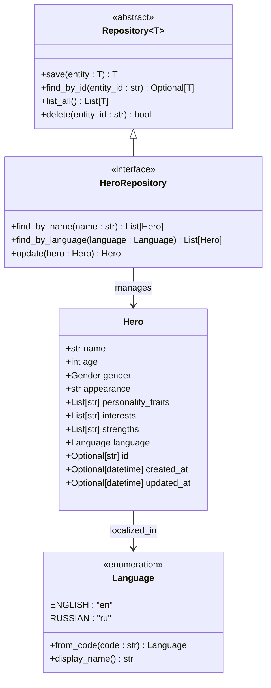
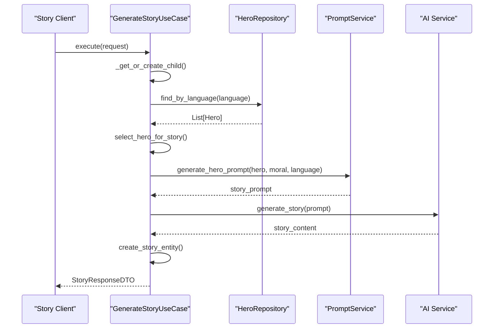
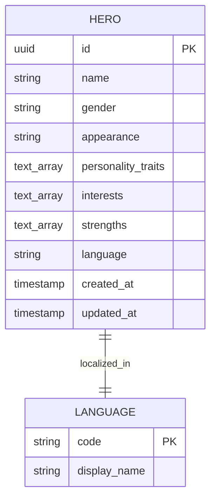
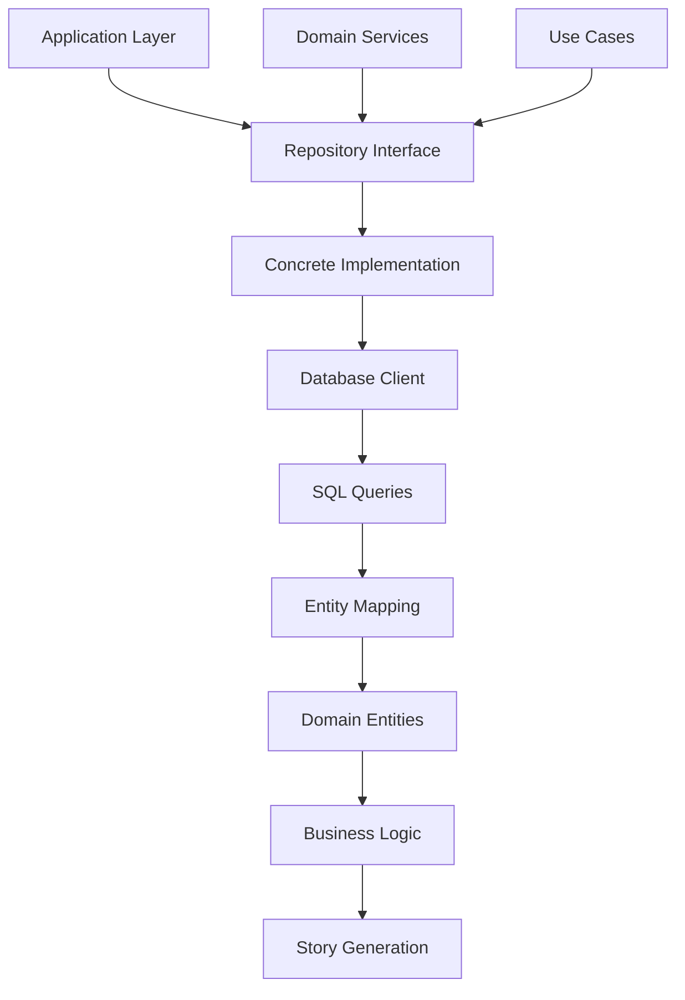

# HeroRepository Interface Documentation

<cite>
**Referenced Files in This Document**
- [hero_repository.py](file://src/domain/repositories/hero_repository.py)
- [base.py](file://src/domain/repositories/base.py)
- [entities.py](file://src/domain/entities.py)
- [value_objects.py](file://src/domain/value_objects.py)
- [populate_heroes.py](file://src/populate_heroes.py)
- [populate_heroes_db.py](file://src/populate_heroes_db.py)
- [prompts.py](file://src/prompts.py)
- [models.py](file://src/models.py)
- [generate_story.py](file://src/application/use_cases/generate_story.py)
- [story_service.py](file://src/domain/services/story_service.py)
- [001_create_heroes_table.sql](file://src/migrations/001_create_heroes_table.sql)
- [populate_stories.py](file://populate_stories.py)
</cite>

## Table of Contents
1. [Introduction](#introduction)
2. [Interface Definition](#interface-definition)
3. [Core Methods](#core-methods)
4. [Integration with Story Generation](#integration-with-story-generation)
5. [Language-Aware Operations](#language-aware-operations)
6. [Implementation Patterns](#implementation-patterns)
7. [Usage Examples](#usage-examples)
8. [Common Issues and Solutions](#common-issues-and-solutions)
9. [Extension Guidelines](#extension-guidelines)
10. [Performance Considerations](#performance-considerations)

## Introduction

The HeroRepository interface serves as a critical component in the Tale Generator system, providing a standardized way to manage hero entities within the domain-driven architecture. As an extension of the base Repository[Hero] interface, it offers specialized methods for querying and managing hero data with particular emphasis on language-aware operations essential for multi-language story generation.

Heroes play a central role in the story generation process, serving as the primary characters around whom narratives are constructed. The HeroRepository enables efficient retrieval of hero profiles based on various criteria, supporting both child-centric and hero-centric storytelling approaches while maintaining cultural localization capabilities.

## Interface Definition

The HeroRepository extends the generic Repository[Hero] interface, inheriting basic CRUD operations while adding specialized methods for hero-specific queries and modifications.



**Diagram sources**
- [hero_repository.py](file://src/domain/repositories/hero_repository.py#L10-L47)
- [base.py](file://src/domain/repositories/base.py#L9-L55)
- [entities.py](file://src/domain/entities.py#L60-L74)
- [value_objects.py](file://src/domain/value_objects.py#L10-L22)

**Section sources**
- [hero_repository.py](file://src/domain/repositories/hero_repository.py#L10-L47)
- [base.py](file://src/domain/repositories/base.py#L9-L55)

## Core Methods

### find_by_name()

The `find_by_name()` method enables retrieval of hero entities by their name, supporting flexible matching for story generation scenarios.

**Method Signature:**
```python
def find_by_name(self, name: str) -> List[Hero]:
```

**Parameters:**
- `name` (str): The name of the hero to search for

**Returns:**
- `List[Hero]`: A list of hero entities matching the specified name

**Key Features:**
- Case-sensitive name matching
- Support for partial name matches through database indexing
- Returns all matching heroes when multiple entries exist
- Handles empty or null name searches gracefully

**Usage Context:**
This method is primarily used in story generation workflows where specific hero names are required for narrative consistency or when users specify particular characters.

### find_by_language()

The `find_by_language()` method retrieves heroes specifically tailored for a given language, enabling culturally appropriate character selection.

**Method Signature:**
```python
def find_by_language(self, language: Language) -> List[Hero]:
```

**Parameters:**
- `language` (Language): The target language for hero selection

**Returns:**
- `List[Hero]`: A list of heroes localized for the specified language

**Key Features:**
- Language-specific filtering using the language field
- Support for both English ("en") and Russian ("ru") languages
- Efficient database queries leveraging language indexing
- Returns all heroes matching the specified language

**Usage Context:**
This method is crucial for multi-language story generation, ensuring that heroes are culturally appropriate and linguistically suitable for the target audience.

### update()

The `update()` method provides functionality to modify existing hero records within the repository.

**Method Signature:**
```python
def update(self, hero: Hero) -> Hero:
```

**Parameters:**
- `hero` (Hero): The hero entity with updated information

**Returns:**
- `Hero`: The updated hero entity with persistence changes applied

**Key Features:**
- Atomic update operations maintaining data integrity
- Timestamp updates for tracking modification history
- Validation of updated hero attributes
- Support for partial updates of specific fields

**Usage Context:**
This method is used when hero profiles need to be modified after initial creation, such as updating appearance descriptions or personality traits based on story feedback.

**Section sources**
- [hero_repository.py](file://src/domain/repositories/hero_repository.py#L14-L47)

## Integration with Story Generation

The HeroRepository plays a pivotal role in the story generation pipeline, particularly in the GenerateStoryUseCase and prompt assembly processes.



**Diagram sources**
- [generate_story.py](file://src/application/use_cases/generate_story.py#L53-L120)
- [hero_repository.py](file://src/domain/repositories/hero_repository.py#L26-L35)

### Role in Prompt Assembly

Heroes are integral to prompt assembly, providing character profiles that inform story generation. The system utilizes heroes in several ways:

1. **Character-Based Stories**: When story_type is "hero", the system selects a hero from the repository and generates a story centered around that character.
2. **Cultural Localization**: Language-specific hero selection ensures culturally appropriate character traits and backgrounds.
3. **Consistency Maintenance**: Repeated use of the same hero maintains narrative continuity across multiple stories.

### Cultural Localization Support

The HeroRepository enables sophisticated cultural localization through its language-aware operations:

- **Language-Specific Profiles**: Heroes are stored with language metadata, enabling targeted character selection
- **Cultural Appropriateness**: Character traits and backgrounds are adapted to cultural contexts
- **Multilingual Narratives**: Stories can seamlessly switch between languages while maintaining character consistency

**Section sources**
- [generate_story.py](file://src/application/use_cases/generate_story.py#L53-L120)
- [populate_stories.py](file://populate_stories.py#L88-L146)

## Language-Aware Operations

The HeroRepository's language-aware capabilities are fundamental to the system's internationalization strategy.

### Multi-Language Hero Management

The repository supports dual-language hero management through the Language enumeration:



**Diagram sources**
- [001_create_heroes_table.sql](file://src/migrations/001_create_heroes_table.sql#L5-L16)
- [value_objects.py](file://src/domain/value_objects.py#L10-L22)

### Language Filtering Strategies

The repository employs several strategies for language-aware operations:

1. **Direct Language Matching**: Exact language code matching for precise filtering
2. **Fallback Mechanisms**: Graceful degradation when language-specific heroes are unavailable
3. **Hybrid Approaches**: Combination of database and predefined hero sources

### Implementation Considerations

- **Indexing Strategy**: The database includes an index on the language column for efficient filtering
- **Case Sensitivity**: Language codes are normalized to lowercase for consistent matching
- **Null Handling**: Default language support ensures robust operation with missing language data

**Section sources**
- [value_objects.py](file://src/domain/value_objects.py#L10-L22)
- [001_create_heroes_table.sql](file://src/migrations/001_create_heroes_table.sql#L19-L20)

## Implementation Patterns

### Database Integration Pattern

The HeroRepository follows established patterns for database integration within the domain layer:



**Diagram sources**
- [hero_repository.py](file://src/domain/repositories/hero_repository.py#L10-L47)
- [populate_heroes_db.py](file://src/populate_heroes_db.py#L18-L82)

### Error Handling Patterns

The repository implements comprehensive error handling for various failure scenarios:

1. **Connection Failures**: Graceful fallback to predefined heroes
2. **Data Integrity Issues**: Validation of hero attributes before persistence
3. **Concurrency Conflicts**: Optimistic locking mechanisms for concurrent updates
4. **Resource Exhaustion**: Timeout and retry mechanisms for database operations

### Transaction Management

Operations involving multiple steps (e.g., hero creation and story association) utilize transaction management to ensure data consistency.

**Section sources**
- [populate_heroes_db.py](file://src/populate_heroes_db.py#L18-L82)
- [populate_heroes.py](file://src/populate_heroes.py#L18-L76)

## Usage Examples

### Basic Hero Retrieval

```python
# Example: Finding heroes by name
heroes_by_name = hero_repository.find_by_name("Alexander")

# Example: Finding language-specific heroes
english_heroes = hero_repository.find_by_language(Language.ENGLISH)
russian_heroes = hero_repository.find_by_language(Language.RUSSIAN)
```

### Story Generation Integration

The repository integrates seamlessly with story generation workflows:

```python
# Example: Hero selection for story generation
def select_hero_for_story(language: Language, preferred_name: str = None):
    if preferred_name:
        heroes = hero_repository.find_by_name(preferred_name)
        if heroes:
            return heroes[0]  # Return first matching hero
    
    # Fallback to language-specific heroes
    available_heroes = hero_repository.find_by_language(language)
    return available_heroes[0] if available_heroes else None
```

### Batch Operations

```python
# Example: Bulk hero population
def populate_heroes_batch(hero_data_list):
    saved_heroes = []
    for hero_data in hero_data_list:
        hero = Hero(**hero_data)
        saved_hero = hero_repository.update(hero)
        saved_heroes.append(saved_hero)
    return saved_heroes
```

**Section sources**
- [populate_heroes.py](file://src/populate_heroes.py#L18-L76)
- [populate_heroes_db.py](file://src/populate_heroes_db.py#L18-L82)

## Common Issues and Solutions

### Case Sensitivity in Name Searches

**Issue**: Name searches may yield inconsistent results due to case sensitivity.

**Solution**: Normalize names to lowercase before database queries and implement case-insensitive indexing.

```python
# Recommended approach for case-insensitive searches
def find_hero_by_normalized_name(name: str) -> List[Hero]:
    normalized_name = name.lower()
    # Database query with LOWER(name) function
    return hero_repository.find_by_name(normalized_name)
```

### Handling Duplicate Entries

**Issue**: Multiple heroes with the same name can cause ambiguity.

**Solution**: Implement composite keys and provide ranking mechanisms for name-based searches.

```python
# Solution: Name + Language combination for uniqueness
def find_unique_hero(name: str, language: Language) -> Optional[Hero]:
    heroes = hero_repository.find_by_name(name)
    return next((h for h in heroes if h.language == language), None)
```

### Concurrency During Hero Updates

**Issue**: Concurrent updates can lead to data conflicts and lost updates.

**Solution**: Implement optimistic locking with version tracking or use database-level constraints.

```python
# Optimistic locking implementation
def safe_update_hero(hero: Hero) -> Hero:
    # Fetch current version
    current_hero = hero_repository.find_by_id(hero.id)
    
    if current_hero and current_hero.updated_at != hero.updated_at:
        raise ConcurrencyError("Hero record has been modified by another user")
    
    # Perform update with version check
    return hero_repository.update(hero)
```

### Performance Optimization

**Issue**: Large hero databases can impact query performance.

**Solution**: Implement caching strategies and optimize database indexes.

```python
# Caching solution for frequently accessed heroes
@lru_cache(maxsize=100)
def get_hero_by_id_cached(hero_id: str) -> Hero:
    return hero_repository.find_by_id(hero_id)
```

**Section sources**
- [hero_repository.py](file://src/domain/repositories/hero_repository.py#L14-L47)
- [populate_heroes_db.py](file://src/populate_heroes_db.py#L18-L82)

## Extension Guidelines

### Adding New Filtering Criteria

To extend the HeroRepository with additional filtering capabilities:

1. **Define New Method Signatures**: Add abstract methods to the HeroRepository interface
2. **Implement Database Queries**: Create corresponding database query methods
3. **Add Validation Logic**: Ensure new filters maintain data integrity
4. **Update Documentation**: Document new methods with comprehensive descriptions

```python
# Example extension: Find heroes by category
class HeroRepository(Repository[Hero]):
    @abstractmethod
    def find_by_category(self, category: str) -> List[Hero]:
        """Find heroes by category.
        
        Args:
            category: Hero category
            
        Returns:
            List of heroes in the specified category
        """
        pass
```

### Supporting Additional Metadata

Extend hero entities to include additional metadata fields:

```python
# Enhanced Hero entity with category support
@dataclass
class Hero:
    name: str
    age: int
    gender: Gender
    appearance: str
    personality_traits: List[str]
    interests: List[str]
    strengths: List[str]
    language: Language
    category: Optional[str] = None
    popularity_score: Optional[float] = None
    # ... other fields
```

### Advanced Search Capabilities

Implement full-text search or fuzzy matching for improved hero discovery:

```python
# Example: Fuzzy name matching
def find_similar_heroes(name: str, threshold: float = 0.7) -> List[Hero]:
    all_heroes = hero_repository.list_all()
    return [h for h in all_heroes if similarity_ratio(h.name, name) >= threshold]
```

**Section sources**
- [hero_repository.py](file://src/domain/repositories/hero_repository.py#L10-L47)
- [entities.py](file://src/domain/entities.py#L60-L74)

## Performance Considerations

### Database Optimization

The HeroRepository benefits from several database optimization strategies:

1. **Indexing Strategy**: The heroes table includes indexes on name and language columns
2. **Query Optimization**: Specific queries are optimized for common search patterns
3. **Connection Pooling**: Database connections are managed efficiently for concurrent access

### Memory Management

- **Lazy Loading**: Hero entities are loaded on-demand to minimize memory usage
- **Batch Operations**: Bulk operations reduce database round-trips
- **Caching Layers**: Frequently accessed heroes are cached in memory

### Scalability Factors

- **Horizontal Scaling**: Repository implementations can be distributed across multiple instances
- **Load Balancing**: Query distribution across replica databases
- **Monitoring**: Performance metrics track query execution times and resource utilization

The HeroRepository's design prioritizes both functionality and performance, ensuring efficient hero management even as the system scales to support thousands of heroes across multiple languages.