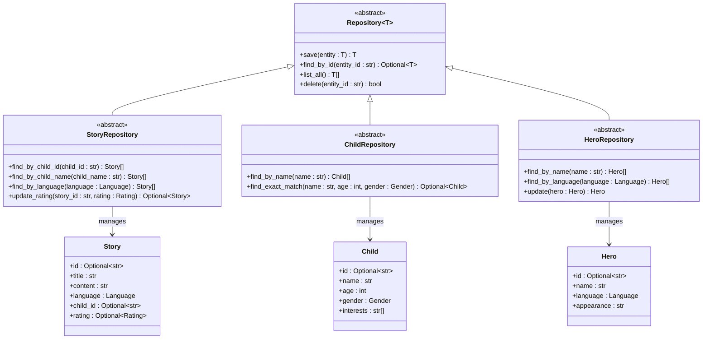
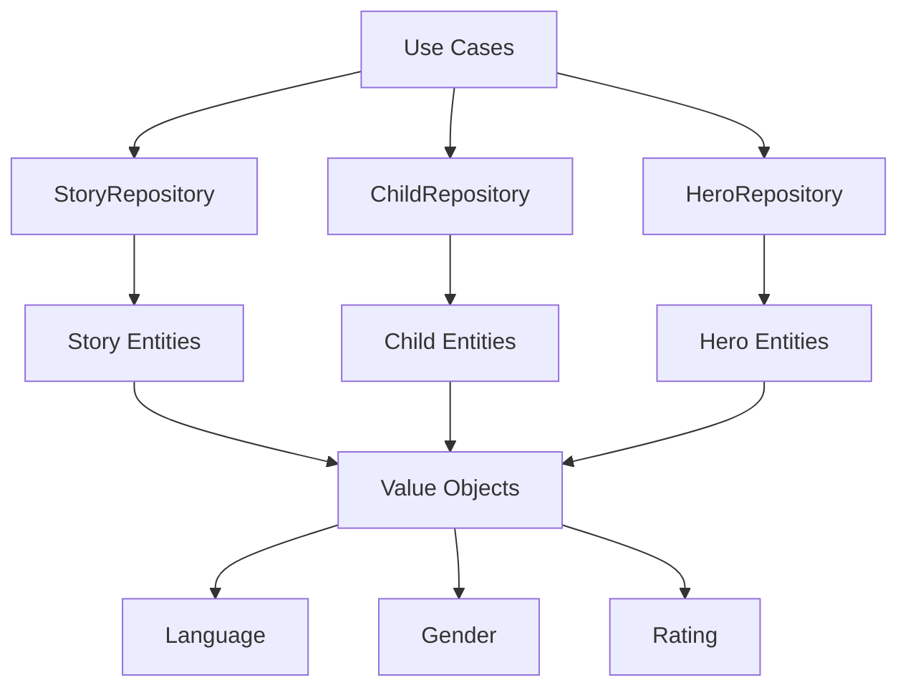
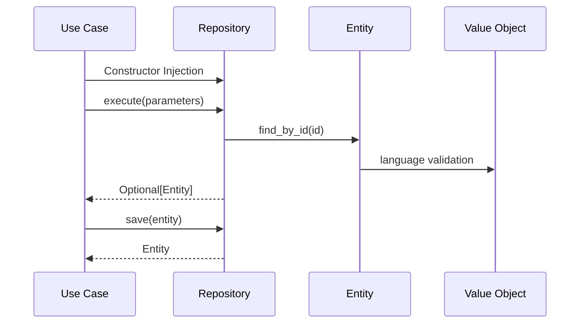

# Repository Interfaces

<cite>
**Referenced Files in This Document**
- [base.py](file://src/domain/repositories/base.py)
- [story_repository.py](file://src/domain/repositories/story_repository.py)
- [child_repository.py](file://src/domain/repositories/child_repository.py)
- [hero_repository.py](file://src/domain/repositories/hero_repository.py)
- [manage_stories.py](file://src/application/use_cases/manage_stories.py)
- [manage_children.py](file://src/application/use_cases/manage_children.py)
- [entities.py](file://src/domain/entities.py)
- [value_objects.py](file://src/domain/value_objects.py)
- [test_children.py](file://test_children.py)
</cite>

## Table of Contents
1. [Introduction](#introduction)
2. [Repository Pattern Architecture](#repository-pattern-architecture)
3. [Base Repository Interface](#base-repository-interface)
4. [Specialized Repository Interfaces](#specialized-repository-interfaces)
5. [Implementation Dependencies](#implementation-dependencies)
6. [Use Case Integration](#use-case-integration)
7. [Query Method Design Patterns](#query-method-design-patterns)
8. [Best Practices and Extension Guidelines](#best-practices-and-extension-guidelines)
9. [Common Issues and Solutions](#common-issues-and-solutions)
10. [Testing Strategies](#testing-strategies)

## Introduction

The Tale Generator application employs a sophisticated repository pattern architecture that defines abstract data access contracts between business logic and persistence implementation. This architectural approach enables clean separation of concerns, facilitates testing through dependency injection, and provides flexibility for multiple persistence backends.

The repository interfaces serve as the primary abstraction layer for data access operations, allowing the domain layer to remain agnostic of specific persistence technologies while maintaining strong typing and comprehensive functionality through specialized interfaces.

## Repository Pattern Architecture

The repository pattern in the Tale Generator follows a hierarchical design with a base generic interface and specialized implementations for each domain entity type. This design promotes code reuse, maintains type safety, and provides clear contracts for data access operations.



**Diagram sources**
- [base.py](file://src/domain/repositories/base.py#L9-L56)
- [story_repository.py](file://src/domain/repositories/story_repository.py#L10-L61)
- [child_repository.py](file://src/domain/repositories/child_repository.py#L10-L38)
- [hero_repository.py](file://src/domain/repositories/hero_repository.py#L10-L48)

## Base Repository Interface

The base `Repository[T]` interface establishes the fundamental contract for all data access operations, providing a standardized set of CRUD (Create, Read, Update, Delete) operations through a generic type system.

### Generic Type System

The base repository utilizes Python's `TypeVar` and `Generic` typing constructs to provide compile-time type safety and code completion support. The generic type parameter `T` represents the entity type that the repository manages.

### Core CRUD Operations

#### Save Operation
The `save()` method handles both creation and updates of entities, returning the saved entity with any generated identifiers populated.

**Method Signature:** `save(entity: T) -> T`

**Key Characteristics:**
- Accepts any entity type `T` as defined by the generic constraint
- Returns the saved entity with ID populated (for newly created entities)
- Handles both insert and update scenarios transparently
- Maintains transaction boundaries at the persistence layer

#### Find By ID Operation
The `find_by_id()` method retrieves entities by their unique identifier, returning an optional result to handle missing entities gracefully.

**Method Signature:** `find_by_id(entity_id: str) -> Optional[T]`

**Key Characteristics:**
- Uses string identifiers for universal compatibility
- Returns `Optional[T]` to distinguish between "not found" and "found but null"
- Enables lazy loading patterns when appropriate
- Supports caching strategies for frequently accessed entities

#### List All Operation
The `list_all()` method provides comprehensive access to all entities of a given type, supporting pagination and filtering at the persistence level.

**Method Signature:** `list_all() -> List[T]`

**Key Characteristics:**
- Returns complete collections for read-heavy operations
- Enables bulk operations and analytics queries
- Supports streaming for large datasets when implemented
- Facilitates cache warming and preloading strategies

#### Delete Operation
The `delete()` method removes entities by identifier, returning a boolean status to indicate operation success.

**Method Signature:** `delete(entity_id: str) -> bool`

**Key Characteristics:**
- Idempotent design allows safe retry mechanisms
- Returns status for conditional logic in business processes
- Supports soft deletion patterns when implemented
- Enables audit trail generation for compliance requirements

**Section sources**
- [base.py](file://src/domain/repositories/base.py#L9-L56)

## Specialized Repository Interfaces

Each specialized repository extends the base interface with domain-specific query methods that reflect the business requirements and data access patterns of individual entity types.

### StoryRepository

The `StoryRepository` interface specializes in managing story entities with complex querying requirements that span multiple business domains.

#### Query Methods

##### find_by_child_id()
Retrieves all stories associated with a specific child through their unique identifier.

**Method Signature:** `find_by_child_id(child_id: str) -> List[Story]`

**Use Cases:**
- Child profile pages displaying story history
- Analytics reporting on child engagement patterns
- Personalized recommendation systems
- Parental monitoring dashboards

##### find_by_child_name()
Provides story retrieval by child name, supporting flexible matching for user-friendly interfaces.

**Method Signature:** `find_by_child_name(child_name: str) -> List[Story]`

**Implementation Considerations:**
- May require case-insensitive matching
- Could support partial name matching for autocomplete features
- Needs efficient indexing on the child_name field
- Should handle special characters and international names appropriately

##### find_by_language()
Filters stories by language preference, enabling multilingual content delivery.

**Method Signature:** `find_by_language(language: Language) -> List[Story]`

**Language Support Features:**
- Enum-based language validation ensures type safety
- Supports future language expansion through enum extension
- Enables content localization and regional preferences
- Facilitates analytics by language demographics

##### update_rating()
Manages story rating updates with atomic operations to prevent race conditions.

**Method Signature:** `update_rating(story_id: str, rating: Rating) -> Optional[Story]`

**Atomic Operation Benefits:**
- Prevents concurrent rating conflicts
- Ensures data consistency during simultaneous updates
- Provides optimistic locking mechanisms
- Supports audit trails for rating modifications

**Section sources**
- [story_repository.py](file://src/domain/repositories/story_repository.py#L10-L61)

### ChildRepository

The `ChildRepository` interface focuses on child profile management with specialized methods for identity verification and profile matching.

#### Query Methods

##### find_by_name()
Retrieves child profiles by name, supporting administrative and user-facing search operations.

**Method Signature:** `find_by_name(name: str) -> List[Child]`

**Search Capabilities:**
- Case-insensitive name matching for user convenience
- Partial name support for autocomplete functionality
- Sorting by relevance or recency for optimal user experience
- Pagination support for large result sets

##### find_exact_match()
Provides precise child profile identification through demographic matching.

**Method Signature:** `find_exact_match(name: str, age: int, gender: Gender) -> Optional[Child]`

**Identity Verification Features:**
- Multi-field matching ensures accurate profile identification
- Gender enumeration provides type-safe gender validation
- Age range validation prevents accidental matches
- Returns single result to avoid ambiguity in profile selection

**Section sources**
- [child_repository.py](file://src/domain/repositories/child_repository.py#L10-L38)

### HeroRepository

The `HeroRepository` interface manages story hero entities with specialized methods for character management and localization.

#### Query Methods

##### find_by_name()
Retrieves hero entities by name, supporting character discovery and story generation.

**Method Signature:** `find_by_name(name: str) -> List[Hero]`

**Character Management Features:**
- Flexible name matching supports character variations
- Returns multiple results for characters with multiple entries
- Enables character popularity tracking and analytics
- Supports character comparison and selection workflows

##### find_by_language()
Filters heroes by language, enabling localized character experiences.

**Method Signature:** `find_by_language(language: Language) -> List[Hero]`

**Localization Benefits:**
- Language-specific character traits and appearances
- Cultural context preservation in character development
- Multilingual story generation capabilities
- Character database maintenance across languages

##### update()
Handles comprehensive hero entity updates with full entity replacement semantics.

**Method Signature:** `update(hero: Hero) -> Hero`

**Update Strategy:**
- Full entity replacement ensures data consistency
- Atomic operations prevent partial updates
- Validation occurs at the repository boundary
- Audit trail generation for character modifications

**Section sources**
- [hero_repository.py](file://src/domain/repositories/hero_repository.py#L10-L48)

## Implementation Dependencies

The repository interfaces establish clear dependencies between the domain layer and infrastructure components, enabling modular architecture and testability.

### Domain Layer Dependencies



**Diagram sources**
- [manage_stories.py](file://src/application/use_cases/manage_stories.py#L1-L10)
- [manage_children.py](file://src/application/use_cases/manage_children.py#L1-L10)

### Entity Type Dependencies

The repositories maintain strong typing through entity-specific interfaces, ensuring compile-time validation and IDE support.

**Entity Relationships:**
- Story entities reference Child entities through child_id relationships
- Hero entities contain language-specific attributes
- All repositories utilize shared value objects for type safety
- Generic constraints ensure type consistency across the domain

**Section sources**
- [entities.py](file://src/domain/entities.py#L1-L200)
- [value_objects.py](file://src/domain/value_objects.py#L1-L189)

## Use Case Integration

Repository interfaces integrate seamlessly with use cases through dependency injection, enabling clean separation of business logic and data access concerns.

### Dependency Injection Pattern

Use cases receive repository dependencies through constructor injection, promoting testability and flexibility.



**Diagram sources**
- [manage_stories.py](file://src/application/use_cases/manage_stories.py#L15-L50)
- [manage_children.py](file://src/application/use_cases/manage_children.py#L16-L50)

### Practical Implementation Examples

#### Story Retrieval Use Case
The `GetStoryUseCase` demonstrates repository integration for simple entity retrieval with error handling.

**Key Implementation Aspects:**
- Repository dependency injection through constructor
- Null checking and error propagation
- Entity-to-DTO conversion for presentation layer
- Logging integration for observability

#### Child Management Use Case
The `CreateChildUseCase` showcases repository integration for entity creation and persistence.

**Creation Workflow:**
- Entity construction with validation
- Repository save operation with ID population
- Response DTO generation for API consumption
- Transaction boundary management

**Section sources**
- [manage_stories.py](file://src/application/use_cases/manage_stories.py#L15-L200)
- [manage_children.py](file://src/application/use_cases/manage_children.py#L16-L200)

## Query Method Design Patterns

Repository query methods follow established design patterns that balance functionality, performance, and maintainability.

### Method Naming Conventions

Query methods adhere to consistent naming patterns that clearly communicate their purpose and parameters.

**Naming Standards:**
- `find_by_*` for single-entity retrieval by identifier
- `list_*` for collection retrieval with optional filtering
- `find_*` for complex queries requiring multiple parameters
- `update_*` for modification operations with specific parameters

### Parameter Design Patterns

#### Type Safety Through Value Objects
Repository methods utilize value objects for type-safe parameter passing, preventing runtime errors and improving code clarity.

**Value Object Benefits:**
- Compile-time validation of parameter constraints
- Semantic meaning through typed parameters
- Centralized validation logic in value object constructors
- Enhanced IDE support and documentation

#### Optional Parameters and Filtering
Methods support optional parameters for flexible querying while maintaining type safety.

**Filtering Strategies:**
- Mandatory parameters for primary identification
- Optional parameters for secondary filtering
- Composite filters for complex query scenarios
- Pagination parameters for large result sets

### Return Type Design

#### Optional Types for Absence Handling
Methods returning single entities use `Optional[T]` to distinguish between "not found" and "found but null" scenarios.

**Benefits of Optional Types:**
- Clear distinction between absence and null values
- Prevents NullPointerException in business logic
- Enables graceful degradation in user interfaces
- Supports caching strategies with null values

#### Collection Types for Multiple Results
Methods returning collections use `List[T]` to provide consistent interfaces regardless of result size.

**Collection Handling:**
- Empty lists for zero results
- Consistent iteration patterns
- Support for functional programming approaches
- Compatibility with ORM and database results

## Best Practices and Extension Guidelines

Extending repository interfaces requires careful consideration of design principles and architectural consistency.

### Adding New Query Methods

#### Method Design Principles

**Single Responsibility Principle:**
Each query method should have a single, well-defined purpose. Avoid creating methods that perform multiple distinct operations.

**Parameter Minimization:**
Limit the number of parameters to essential requirements. Use composite objects for related parameters when appropriate.

**Type Safety Priority:**
Always prefer strongly-typed parameters over generic types like `Any` or `dict`.

#### Extension Example Pattern

When extending repositories with new query methods, follow the established patterns:

```python
# Example extension pattern for StoryRepository
@abstractmethod
def find_by_complex_criteria(self, 
                           child_id: str,
                           language: Language,
                           min_rating: Optional[int] = None) -> List[Story]:
    """Find stories matching complex criteria."""
    pass
```

### Performance Considerations

#### Indexing Strategy
Repository implementations should ensure proper database indexing for all query parameters to maintain performance at scale.

**Indexing Guidelines:**
- Single-column indexes for frequently queried fields
- Composite indexes for multi-parameter queries
- Covering indexes for complex queries with projections
- Regular index maintenance and monitoring

#### Query Optimization
Implement query optimization techniques to handle large datasets efficiently.

**Optimization Techniques:**
- Lazy loading for expensive associations
- Batch operations for bulk processing
- Connection pooling for database efficiency
- Query result caching for frequently accessed data

### Error Handling Patterns

#### Exception Strategy
Repositories should implement consistent exception handling that propagates meaningful errors to use cases.

**Exception Categories:**
- `NotFoundError` for missing entities
- `ValidationException` for parameter validation failures
- `DatabaseException` for persistence layer errors
- `TimeoutException` for query timeout scenarios

#### Retry Mechanisms
Implement retry logic for transient failures while avoiding infinite loops.

**Retry Strategy:**
- Exponential backoff for network timeouts
- Circuit breaker pattern for persistent failures
- Maximum retry limits to prevent resource exhaustion
- Logging and monitoring for retry failures

## Common Issues and Solutions

Repository interface implementation often encounters common challenges that require thoughtful solutions.

### Query Method Design Challenges

#### Overloading vs. Specialization
Determining when to overload methods versus create specialized methods can be challenging.

**Solution Approach:**
- Use method overloading sparingly for parameter variations
- Prefer specialized methods for fundamentally different queries
- Maintain consistent parameter ordering across overloaded methods
- Document differences clearly in method documentation

#### Performance vs. Flexibility Trade-offs
Balancing query flexibility with performance requirements often presents challenges.

**Trade-off Strategies:**
- Profile queries under realistic load conditions
- Implement caching for frequently accessed data
- Use database-specific optimizations when appropriate
- Monitor query performance and adjust indexes as needed

### Type Safety Issues

#### Generic Type Constraints
Ensuring proper type constraints in generic repositories can be complex.

**Constraint Solutions:**
- Use `Protocol` interfaces for complex entity requirements
- Implement `TypeGuard` functions for runtime type checking
- Leverage `TypedDict` for structured parameter objects
- Consider `NewType` for domain-specific primitive types

#### Value Object Integration
Integrating value objects with repository methods requires careful design.

**Integration Patterns:**
- Value object validation in repository methods
- Conversion utilities between value objects and database types
- Serialization/deserialization for persistence layer
- Type checking for cross-module compatibility

### Testing Challenges

#### Mock Repository Implementation
Creating effective mocks for repository interfaces requires comprehensive coverage.

**Mocking Strategies:**
- Use property-based testing for parameter validation
- Implement repository-specific test fixtures
- Mock external dependencies consistently across tests
- Verify repository method calls and parameters

#### Integration Testing
Testing repository implementations with real databases requires careful setup.

**Integration Testing Approaches:**
- Use test containers for isolated database environments
- Implement database migration testing
- Create realistic test data sets
- Monitor database performance during tests

## Testing Strategies

Effective testing of repository interfaces requires comprehensive strategies that cover unit testing, integration testing, and performance testing.

### Unit Testing Patterns

#### Mock Repository Testing
Repository interfaces enable comprehensive unit testing through mock implementations.

**Testing Scenarios:**
- Verify method calls with correct parameters
- Test error condition handling
- Validate return value transformations
- Check exception propagation

#### Test Data Management
Effective test data management ensures reliable and repeatable tests.

**Data Management Strategies:**
- Use factory patterns for test data creation
- Implement data builders for complex entity construction
- Maintain test data isolation between test cases
- Clean up test data after each test execution

### Integration Testing Approaches

#### Database Integration Testing
Testing repository implementations with actual database connections requires careful orchestration.

**Integration Testing Benefits:**
- Validates database schema compatibility
- Tests actual query performance
- Verifies transaction handling
- Confirms data type conversions

#### End-to-End Repository Testing
Complete end-to-end testing validates the entire data access pipeline.

**End-to-End Testing Scope:**
- Repository to use case integration
- Entity validation and transformation
- Business logic integration
- Error handling validation

### Performance Testing

#### Load Testing Strategies
Repository interfaces should be tested under realistic load conditions to ensure scalability.

**Load Testing Metrics:**
- Query response times under varying loads
- Concurrent access handling
- Memory usage patterns
- Database connection pool utilization

#### Benchmarking Approaches
Establish baseline performance metrics for repository operations.

**Benchmarking Focus Areas:**
- CRUD operation performance
- Complex query execution times
- Bulk operation throughput
- Connection establishment overhead

**Section sources**
- [test_children.py](file://test_children.py#L1-L50)