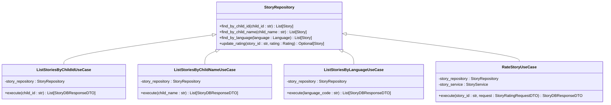

# StoryRepository

<cite>
**Referenced Files in This Document**   
- [story_repository.py](file://src/domain/repositories/story_repository.py)
- [generate_story.py](file://src/application/use_cases/generate_story.py)
- [manage_stories.py](file://src/application/use_cases/manage_stories.py)
- [entities.py](file://src/domain/entities.py)
- [base.py](file://src/domain/repositories/base.py)
- [supabase_client.py](file://src/supabase_client.py)
</cite>

## Table of Contents
1. [Introduction](#introduction)
2. [Core Methods](#core-methods)
3. [Usage in Use Cases](#usage-in-use-cases)
4. [Integration with Infrastructure](#integration-with-infrastructure)
5. [Query Performance and Filtering](#query-performance-and-filtering)
6. [Extending the Interface](#extending-the-interface)
7. [Conclusion](#conclusion)

## Introduction

The StoryRepository interface is a specialized repository for managing Story entities in the Tale Generator application. It extends the base Repository[Story] interface to provide domain-specific query methods tailored to story management functionality. This interface defines the contract for persistence operations on Story entities, enabling separation between domain logic and infrastructure concerns.

The StoryRepository interface is implemented through the SupabaseClient class, which provides concrete implementations for all abstract methods defined in the interface. This implementation connects to a Supabase database instance to perform CRUD operations and specialized queries on story data.

**Section sources**
- [story_repository.py](file://src/domain/repositories/story_repository.py#L1-L61)
- [base.py](file://src/domain/repositories/base.py#L1-L56)

## Core Methods

The StoryRepository interface defines four specialized query methods beyond the basic CRUD operations inherited from the base Repository interface. These methods enable targeted retrieval of stories based on specific criteria relevant to the application's use cases.

### find_by_child_id()

This method retrieves all stories associated with a specific child using their unique identifier. The method takes a child_id parameter of type string and returns a list of Story entities. This query is optimized for exact matches on the child_id field, which is indexed in the database for performance.

**Diagram sources**
- [story_repository.py](file://src/domain/repositories/story_repository.py#L13-L23)
- [supabase_client.py](file://src/supabase_client.py#L688-L732)

### find_by_child_name()

This method retrieves stories based on a child's name. Unlike find_by_child_id(), this method performs a text-based search that may return multiple results if multiple children share the same name. The method accepts a child_name parameter and returns a list of Story entities associated with children matching that name.

**Diagram sources**
- [story_repository.py](file://src/domain/repositories/story_repository.py#L25-L35)
- [supabase_client.py](file://src/supabase_client.py#L642-L687)

### find_by_language()

This method retrieves all stories written in a specific language. It accepts a Language value object parameter and returns a list of Story entities that match the specified language. The Language type is an enumeration that supports multiple language codes, currently including English (en) and Russian (ru).

**Diagram sources**
- [story_repository.py](file://src/domain/repositories/story_repository.py#L37-L47)
- [supabase_client.py](file://src/supabase_client.py#L777-L821)

### update_rating()

This method updates the rating of a specific story. It takes a story_id parameter to identify the target story and a Rating value object containing the new rating value. The method returns the updated Story entity if successful, or None if the story was not found. This method handles validation of the rating value (ensuring it's between 1 and 10) and updates the story's updated_at timestamp.

**Diagram sources**
- [story_repository.py](file://src/domain/repositories/story_repository.py#L49-L59)
- [supabase_client.py](file://src/supabase_client.py#L823-L884)

**Section sources**
- [story_repository.py](file://src/domain/repositories/story_repository.py#L13-L59)
- [entities.py](file://src/domain/entities.py#L114-L210)

## Usage in Use Cases

The StoryRepository interface is consumed by various use cases in the application, particularly in the GenerateStory and ManageStories use case modules. These use cases leverage the specialized query methods to support specific functionality.

### GenerateStory Use Case

In the GenerateStoryUseCase, the StoryRepository is used to save newly generated stories to persistent storage. After a story is created through AI generation, the use case calls the save() method (inherited from the base Repository) to persist the story. The repository also supports retrieving existing child profiles through related repositories, ensuring that story metadata is properly associated with the correct child.

**Diagram sources**
- [generate_story.py](file://src/application/use_cases/generate_story.py#L21-L208)
- [story_repository.py](file://src/domain/repositories/story_repository.py#L10-L61)

### ManageStories Use Case

The ManageStories module contains several use cases that directly utilize the specialized query methods of StoryRepository. These include:

- **ListStoriesByChildIdUseCase**: Uses find_by_child_id() to retrieve all stories for a specific child
- **ListStoriesByChildNameUseCase**: Uses find_by_child_name() to retrieve stories by child name
- **ListStoriesByLanguageUseCase**: Uses find_by_language() to retrieve stories by language
- **RateStoryUseCase**: Uses update_rating() to update a story's rating

These use cases demonstrate how the specialized query methods enable focused data retrieval for specific application features.

**Diagram sources**
- [manage_stories.py](file://src/application/use_cases/manage_stories.py#L1-L370)
- [story_repository.py](file://src/domain/repositories/story_repository.py#L10-L61)

**Section sources**
- [generate_story.py](file://src/application/use_cases/generate_story.py#L21-L208)
- [manage_stories.py](file://src/application/use_cases/manage_stories.py#L1-L370)

## Integration with Infrastructure

The StoryRepository interface is implemented by the SupabaseClient class, which provides the concrete implementation for all repository methods. This implementation handles the translation between domain entities and database records, managing the mapping between camelCase attributes used in the application and snake_case column names used in the database.

The SupabaseClient connects to a Supabase database instance using environment variables for authentication. It uses the Supabase Python client library to perform database operations, with all queries executed against the "stories" table in the "tales" schema.

Key aspects of the infrastructure integration include:

- **Data Mapping**: Conversion between Story domain entities and StoryDB Pydantic models
- **Key Translation**: Mapping camelCase attribute names to snake_case database column names
- **Timestamp Handling**: Automatic management of created_at and updated_at timestamps
- **Error Handling**: Translation of database errors into application-specific exceptions

**Diagram sources**
- [supabase_client.py](file://src/supabase_client.py#L1-L914)
- [story_repository.py](file://src/domain/repositories/story_repository.py#L10-L61)

**Section sources**
- [supabase_client.py](file://src/supabase_client.py#L1-L914)
- [models.py](file://src/models.py#L1-L117)

## Query Performance and Filtering

The StoryRepository implementation includes several optimizations to ensure efficient query performance. Database indexes are created on key fields used in queries, including child_id, child_name, and language. These indexes enable fast lookups and filtering, particularly important for the find_by_child_id() and find_by_language() methods which are likely to be frequently used.

For child-based queries, there is a distinction between exact ID matching and name-based searching. The find_by_child_id() method performs an exact match on a unique identifier, making it highly efficient. In contrast, find_by_child_name() performs a text search that may return multiple results, which is less efficient but necessary for certain use cases.

The implementation also includes validation and error handling to prevent invalid queries. For example, the update_rating() method validates that rating values are within the acceptable range (1-10) before attempting to update the database.

**Diagram sources**
- [supabase_client.py](file://src/supabase_client.py#L688-L884)
- [story_repository.py](file://src/domain/repositories/story_repository.py#L13-L59)

**Section sources**
- [supabase_client.py](file://src/supabase_client.py#L688-L884)
- [supabase/migrations/004_add_language_to_stories.sql](file://supabase/migrations/004_add_language_to_stories.sql#L1-L11)

## Extending the Interface

The StoryRepository interface can be extended to support additional query capabilities while maintaining separation of concerns. New methods should follow the existing pattern of accepting domain-specific parameters and returning domain entities.

Potential extensions could include:

- **find_by_date_range()**: Retrieve stories created within a specific date range
- **find_by_moral()**: Find stories with a specific moral theme
- **find_by_model()**: Retrieve stories generated by a specific AI model
- **find_rated_stories()**: Find all stories that have been rated (or unrated)

When adding new methods, it's important to consider database indexing strategies to maintain query performance. Any new query fields should have appropriate indexes created in the database schema.

The interface design follows the Repository pattern, which allows for easy substitution of different persistence implementations. This means that the same interface could potentially be implemented with different database technologies (e.g., PostgreSQL, MongoDB) without changing the consuming use cases.

**Section sources**
- [story_repository.py](file://src/domain/repositories/story_repository.py#L10-L61)
- [supabase_client.py](file://src/supabase_client.py#L1-L914)

## Conclusion

The StoryRepository interface provides a well-defined contract for story persistence operations in the Tale Generator application. By extending the base Repository interface with specialized query methods, it enables efficient and focused data retrieval for key application features. The implementation through SupabaseClient demonstrates proper separation of concerns, with the interface defining what operations are available and the implementation handling how those operations are performed.

The interface is effectively used by various use cases, particularly in story generation and management functionality. Its design supports the application's requirements for retrieving stories by child, language, and other criteria, while also supporting updates to story ratings. The integration with Supabase infrastructure is robust, with proper error handling and data mapping between domain and persistence layers.

Future extensions to the interface should maintain the existing patterns and consider performance implications, particularly regarding database indexing for new query capabilities.