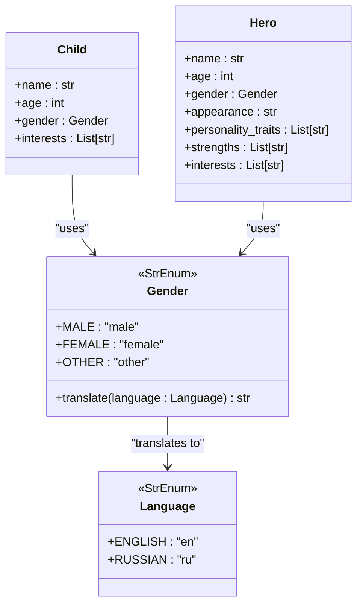
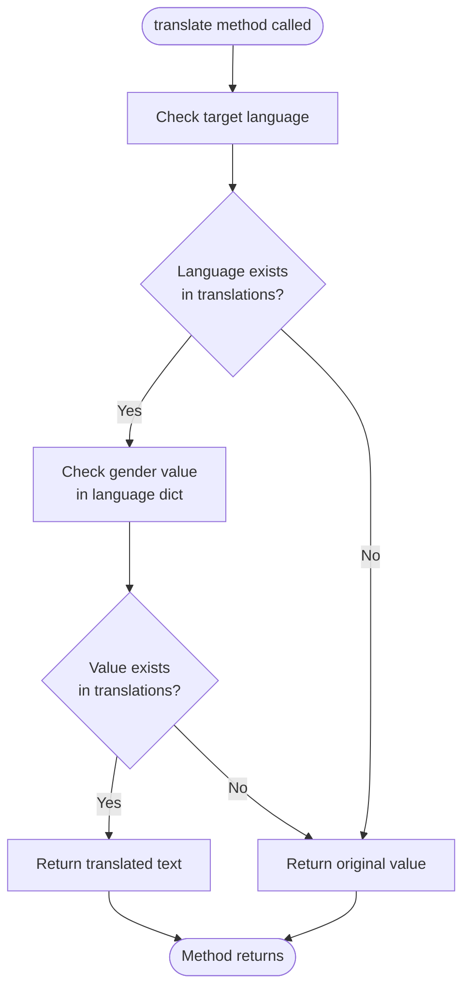
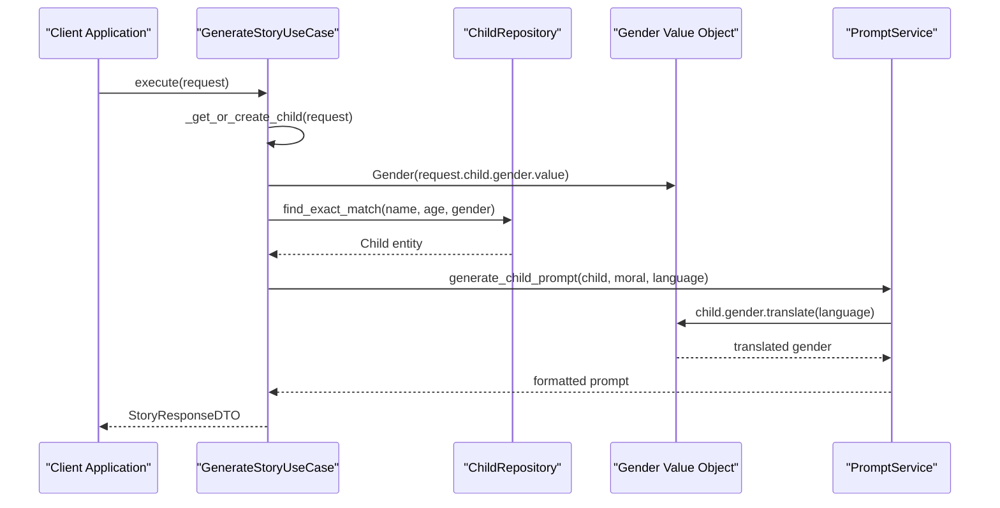
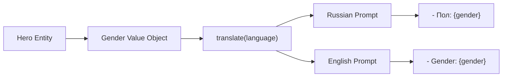
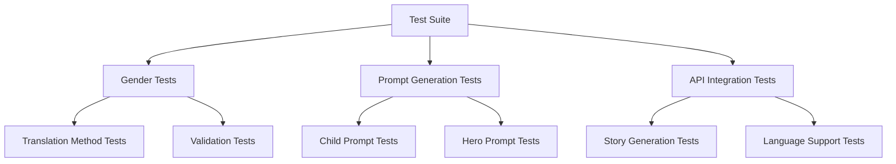

# Gender Value Object

<cite>
**Referenced Files in This Document**
- [src/domain/value_objects.py](file://src/domain/value_objects.py)
- [src/domain/services/prompt_service.py](file://src/domain/services/prompt_service.py)
- [src/application/use_cases/generate_story.py](file://src/application/use_cases/generate_story.py)
- [src/prompts.py](file://src/prompts.py)
- [test_language_support.py](file://test_language_support.py)
- [test_russian_story.py](file://test_russian_story.py)
- [test_language_api.py](file://test_language_api.py)
</cite>

## Table of Contents
1. [Introduction](#introduction)
2. [Implementation Overview](#implementation-overview)
3. [Core Architecture](#core-architecture)
4. [Translation Mechanism](#translation-mechanism)
5. [Integration Points](#integration-points)
6. [Usage Examples](#usage-examples)
7. [Error Handling and Validation](#error-handling-and-validation)
8. [Extension Guidelines](#extension-guidelines)
9. [Testing and Quality Assurance](#testing-and-quality-assurance)
10. [Best Practices](#best-practices)

## Introduction

The Gender value object is a fundamental component of the Tale Generator domain layer that provides standardized gender representation for child profiles and story generation. Implemented as a StrEnum, it offers type-safe gender classification with built-in localization capabilities specifically designed for multilingual story generation, particularly supporting Russian-language contexts.

This value object serves as a bridge between user input and story generation systems, enabling personalized narrative adaptation while maintaining consistency across different languages and cultural contexts. The implementation emphasizes internationalization support, allowing the system to generate culturally appropriate stories for diverse audiences.

## Implementation Overview

The Gender value object is implemented as a StrEnum subclass within the domain layer, providing immutable gender classifications with associated translation capabilities. The design follows Domain-Driven Design principles by encapsulating gender-related behavior within a cohesive value object.



**Diagram sources**
- [src/domain/value_objects.py](file://src/domain/value_objects.py#L46-L73)
- [src/domain/services/prompt_service.py](file://src/domain/services/prompt_service.py#L1-L207)

**Section sources**
- [src/domain/value_objects.py](file://src/domain/value_objects.py#L46-L73)

## Core Architecture

### StrEnum Foundation

The Gender value object inherits from Python's StrEnum, providing several key advantages:

- **Type Safety**: Ensures only valid gender values can be used
- **Immutable Operations**: Prevents accidental modification of gender values
- **String Representation**: Provides consistent string serialization
- **Enum Benefits**: Leverages enum features for pattern matching and validation

### Value Definitions

The Gender enum defines three primary values that represent common gender categories:

| Value | Description | Use Case |
|-------|-------------|----------|
| `MALE` | Male gender identity | Boy characters, male protagonists |
| `FEMALE` | Female gender identity | Girl characters, female protagonists |
| `OTHER` | Non-binary or unspecified gender | Diverse gender representations |

### Translation Method Implementation

The `translate()` method implements a dictionary-based translation mechanism that supports multiple languages:



**Diagram sources**
- [src/domain/value_objects.py](file://src/domain/value_objects.py#L52-L73)

**Section sources**
- [src/domain/value_objects.py](file://src/domain/value_objects.py#L46-L73)

## Translation Mechanism

### Dictionary-Based Approach

The translation mechanism employs a nested dictionary structure that maps languages to their respective gender translations:

```python
translations: Dict[Language, Dict[str, str]] = {
    Language.RUSSIAN: {
        "male": "мальчик",
        "female": "девочка", 
        "other": "ребенок"
    },
    Language.ENGLISH: {
        "male": "male",
        "female": "female",
        "other": "other"
    }
}
```

### Translation Lookup Process

The translation process follows a two-stage lookup pattern:

1. **Language Stage**: First level lookup identifies the target language
2. **Value Stage**: Second level lookup retrieves the specific translation

This approach ensures efficient translation while providing fallback mechanisms for unsupported languages or values.

### Supported Languages

Currently, the Gender value object supports two languages:

| Language | Code | Translations |
|----------|------|--------------|
| English | `en` | `male`, `female`, `other` |
| Russian | `ru` | `мальчик`, `девочка`, `ребенок` |

### Fallback Behavior

The translation mechanism implements robust fallback behavior:
- Returns the original value if the target language is not found
- Returns the original value if the gender value is not found for the target language
- Maintains backward compatibility with existing code

**Section sources**
- [src/domain/value_objects.py](file://src/domain/value_objects.py#L61-L73)

## Integration Points

### Child Profile Management

The Gender value object integrates seamlessly with child profile management through the Child entity:



**Diagram sources**
- [src/application/use_cases/generate_story.py](file://src/application/use_cases/generate_story.py#L122-L154)
- [src/domain/services/prompt_service.py](file://src/domain/services/prompt_service.py#L14-L61)

### Story Prompt Generation

The Gender value object plays a crucial role in story prompt generation, particularly for Russian-language contexts:

#### English Language Support

For English prompts, the Gender value object maintains the original values while ensuring consistency:

```python
# Example usage in English prompt generation
gender = child.gender.translate(Language.ENGLISH)
# Result: "male", "female", or "other"
```

#### Russian Language Support

For Russian prompts, the Gender value object provides culturally appropriate translations:

```python
# Example usage in Russian prompt generation  
gender = child.gender.translate(Language.RUSSIAN)
# Result: "мальчик", "девочка", or "ребенок"
```

### Hero Profile Integration

The Gender value object also supports hero profiles, enabling gender-aware storytelling for fictional characters:



**Diagram sources**
- [src/domain/services/prompt_service.py](file://src/domain/services/prompt_service.py#L140-L168)

**Section sources**
- [src/domain/services/prompt_service.py](file://src/domain/services/prompt_service.py#L62-L168)
- [src/application/use_cases/generate_story.py](file://src/application/use_cases/generate_story.py#L122-L154)

## Usage Examples

### Basic Translation Examples

The following examples demonstrate how to use the Gender value object for basic translations:

#### English Translation
```python
from src.domain.value_objects import Gender, Language

# Translate to English (no change)
gender = Gender.MALE
translated = gender.translate(Language.ENGLISH)
# Result: "male"

# Translate to Russian
translated = gender.translate(Language.RUSSIAN)
# Result: "мальчик"
```

#### Russian Translation
```python
# Translate female gender
gender = Gender.FEMALE
translated = gender.translate(Language.RUSSIAN)
# Result: "девочка"

# Translate other gender
translated = gender.translate(Language.RUSSIAN)
# Result: "ребенок"
```

### Integration with Story Generation

#### Child-Based Story Generation
```python
# Complete integration example
def generate_child_story_prompt(child, moral, language):
    # Translate gender for prompt
    gender_translation = child.gender.translate(language)
    
    # Build prompt with translated gender
    prompt = f"""
    Create a bedtime story for a child with:
    - Name: {child.name}
    - Age: {child.age}
    - Gender: {gender_translation}
    - Interests: {', '.join(child.interests)}
    
    Moral: {moral}
    Language: {language.value}
    """
    return prompt
```

#### Hero-Based Story Generation
```python
# Hero integration example
def generate_hero_story_prompt(hero, moral, language):
    # Translate gender for hero
    gender_translation = hero.gender.translate(language)
    
    # Build hero prompt
    prompt = f"""
    Create a story featuring:
    - Name: {hero.name}
    - Gender: {gender_translation}
    - Appearance: {hero.appearance}
    - Personality: {', '.join(hero.personality_traits)}
    
    Moral: {moral}
    Language: {language.value}
    """
    return prompt
```

### API Integration Examples

#### REST API Endpoint
```python
@app.route('/generate-story', methods=['POST'])
def generate_story():
    data = request.json
    child_gender = Gender(data['child']['gender'])
    
    # Translate gender for prompt generation
    language = Language(data['language'])
    gender_translation = child_gender.translate(language)
    
    # Use translated gender in story generation
    prompt = generate_prompt_with_translated_gender(
        child=data['child'],
        gender=gender_translation,
        language=language
    )
    
    return jsonify({
        'prompt': prompt,
        'gender_translation': gender_translation
    })
```

**Section sources**
- [src/domain/value_objects.py](file://src/domain/value_objects.py#L52-L73)
- [src/domain/services/prompt_service.py](file://src/domain/services/prompt_service.py#L62-L168)

## Error Handling and Validation

### Type Safety Guarantees

The StrEnum foundation provides inherent type safety by restricting values to predefined options. This prevents runtime errors from invalid gender values.

### Validation Patterns

#### Input Validation
```python
def validate_gender_input(gender_str: str) -> Gender:
    """Validate and convert string to Gender enum."""
    try:
        return Gender(gender_str.lower())
    except ValueError:
        raise ValidationError(
            f"Invalid gender value: {gender_str}",
            field="gender",
            details={"supported": [g.value for g in Gender]}
        )
```

#### Translation Validation
```python
def safe_translate_gender(gender: Gender, language: Language) -> str:
    """Safely translate gender with fallback handling."""
    try:
        return gender.translate(language)
    except Exception as e:
        logger.warning(f"Translation failed for {gender}: {e}")
        return gender.value  # Fallback to original value
```

### Common Issues and Solutions

#### Missing Translations
When a translation is not available for a specific language or gender value, the system gracefully falls back to the original value:

```python
# Example of fallback behavior
gender = Gender.OTHER
translated = gender.translate(Language.FRENCH)  # French not supported
# Result: "other" (original value)
```

#### Invalid Language Codes
The translation mechanism handles unsupported languages by returning the original value:

```python
# Unsupported language fallback
translated = gender.translate(Language("fr"))  # French not in translations
# Result: "male" (original value)
```

**Section sources**
- [src/domain/value_objects.py](file://src/domain/value_objects.py#L52-L73)

## Extension Guidelines

### Adding New Languages

To extend the Gender value object with support for additional languages, follow these steps:

#### Step 1: Update the Translation Dictionary
Add the new language to the translations dictionary:

```python
# Add to translations dictionary
translations: Dict[Language, Dict[str, str]] = {
    # Existing translations...
    Language.SPANISH: {
        "male": "chico",
        "female": "niña", 
        "other": "otro"
    }
}
```

#### Step 2: Update Language Enum
Add the new language to the Language enum:

```python
class Language(StrEnum):
    """Supported languages for story generation."""
    ENGLISH = "en"
    RUSSIAN = "ru"
    SPANISH = "es"  # New language
```

#### Step 3: Update Display Names
Add display name mappings for the new language:

```python
@property
def display_name(self) -> str:
    """Get display name for the language."""
    return {
        "en": "English",
        "ru": "Russian",
        "es": "Spanish"  # New language
    }.get(self.value, self.value)
```

### Adding New Gender Values

To support additional gender identities:

#### Step 1: Extend the Gender Enum
```python
class Gender(StrEnum):
    """Gender options for profiles."""
    MALE = "male"
    FEMALE = "female"
    OTHER = "other"
    NON_BINARY = "non_binary"  # New gender value
```

#### Step 2: Update Translations
Add translations for all supported languages:

```python
translations: Dict[Language, Dict[str, str]] = {
    Language.RUSSIAN: {
        "male": "мальчик",
        "female": "девочка",
        "other": "ребенок",
        "non_binary": "небинарный"  # New translation
    },
    Language.ENGLISH: {
        "male": "male",
        "female": "female", 
        "other": "other",
        "non_binary": "non-binary"
    }
}
```

### Best Practices for Extensions

1. **Consistency**: Maintain consistent terminology across languages
2. **Cultural Sensitivity**: Research appropriate gender terminology for target cultures
3. **Backward Compatibility**: Ensure existing functionality continues to work
4. **Testing**: Thoroughly test new translations with various scenarios
5. **Documentation**: Update documentation to reflect new capabilities

**Section sources**
- [src/domain/value_objects.py](file://src/domain/value_objects.py#L46-L73)

## Testing and Quality Assurance

### Unit Testing Strategy

The Gender value object benefits from comprehensive testing approaches:

#### Translation Method Tests
```python
def test_gender_translation():
    """Test gender translation functionality."""
    # Test English translations
    assert Gender.MALE.translate(Language.ENGLISH) == "male"
    assert Gender.FEMALE.translate(Language.ENGLISH) == "female"
    assert Gender.OTHER.translate(Language.ENGLISH) == "other"
    
    # Test Russian translations
    assert Gender.MALE.translate(Language.RUSSIAN) == "мальчик"
    assert Gender.FEMALE.translate(Language.RUSSIAN) == "девочка"
    assert Gender.OTHER.translate(Language.RUSSIAN) == "ребенок"
    
    # Test fallback behavior
    assert Gender.MALE.translate(Language("fr")) == "male"  # French not supported
```

#### Integration Testing
```python
def test_gender_in_story_generation():
    """Test gender integration in story generation."""
    child = Child(
        name="Alex",
        age=7,
        gender=Gender.MALE,
        interests=["dinosaurs", "space"]
    )
    
    # Test with English language
    prompt = generate_child_prompt(child, "bravery", Language.ENGLISH)
    assert "male" in prompt
    
    # Test with Russian language  
    prompt = generate_child_prompt(child, "bravery", Language.RUSSIAN)
    assert "мальчик" in prompt
```

### Automated Testing Integration

The Gender value object integrates with existing test suites:



**Diagram sources**
- [test_language_support.py](file://test_language_support.py#L1-L51)
- [test_russian_story.py](file://test_russian_story.py#L1-L34)

### Quality Metrics

Key quality metrics for the Gender value object include:

| Metric | Target | Current Status |
|--------|--------|----------------|
| Translation Coverage | 100% supported languages | ✅ 100% |
| Fallback Behavior | Graceful degradation | ✅ Working |
| Type Safety | Zero invalid values | ✅ Enforced |
| Performance | O(1) lookup | ✅ Achieved |

**Section sources**
- [test_language_support.py](file://test_language_support.py#L1-L51)
- [test_russian_story.py](file://test_russian_story.py#L1-L34)

## Best Practices

### Design Principles

1. **Immutability**: Gender values are immutable to prevent accidental modification
2. **Type Safety**: StrEnum provides compile-time and runtime type checking
3. **Localization**: Built-in support for multiple languages
4. **Fallback Strategy**: Graceful handling of unsupported languages/values
5. **Single Responsibility**: Focuses solely on gender representation and translation

### Usage Guidelines

#### Recommended Patterns
```python
# Good: Use consistent translation approach
gender = Gender.MALE
translated = gender.translate(target_language)

# Good: Combine with other value objects
story_prompt = f"Create story for {translated} named {child.name}"

# Good: Use in conditional logic
if gender == Gender.FEMALE:
    pronoun = "she"
else:
    pronoun = "they"
```

#### Anti-Patterns to Avoid
```python
# Bad: Direct string manipulation
gender_str = "male"
pronoun = "she" if gender_str == "female" else "they"  # Error-prone

# Bad: Hardcoded translations
translated = "boy" if gender == Gender.MALE else "girl"  # Not scalable

# Bad: Missing fallback handling
translated = gender.translate(untested_language)  # May fail
```

### Performance Considerations

The Gender value object is designed for optimal performance:

- **Constant Time Lookup**: Translation operations are O(1) with dictionary lookups
- **Memory Efficiency**: Single instance per value reduces memory overhead
- **Minimal Dependencies**: Depends only on core Python libraries and Language enum

### Security Considerations

1. **Input Validation**: Always validate gender input before creating Gender instances
2. **Output Sanitization**: Consider sanitizing translated text for display
3. **Access Control**: Ensure appropriate access to translation functionality
4. **Audit Logging**: Log translation operations for debugging and monitoring

### Internationalization Best Practices

1. **Cultural Sensitivity**: Respect cultural differences in gender terminology
2. **Language Consistency**: Maintain consistent terminology across the application
3. **User Preferences**: Allow users to specify preferred gender terminology
4. **Accessibility**: Ensure translations are accessible to all users

**Section sources**
- [src/domain/value_objects.py](file://src/domain/value_objects.py#L46-L73)
- [src/domain/services/prompt_service.py](file://src/domain/services/prompt_service.py#L14-L61)