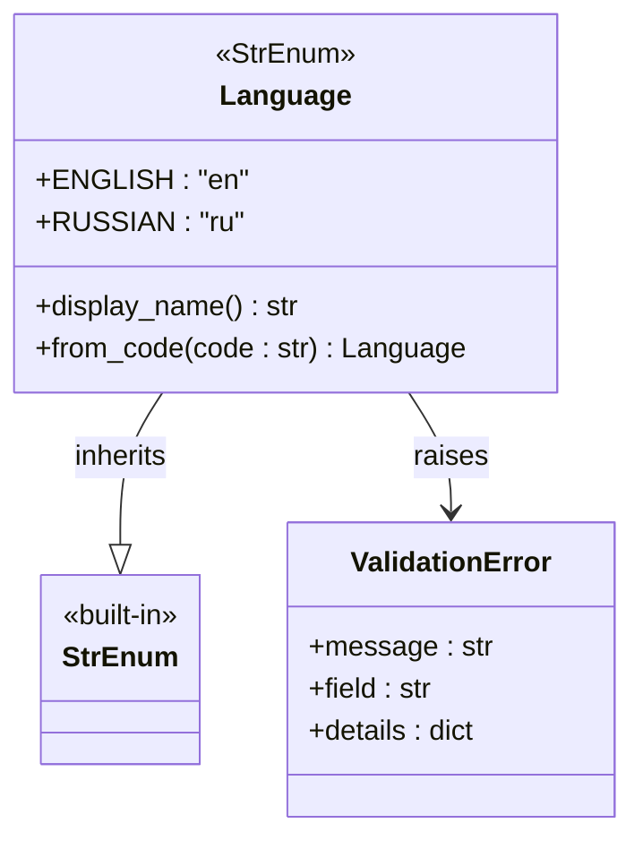
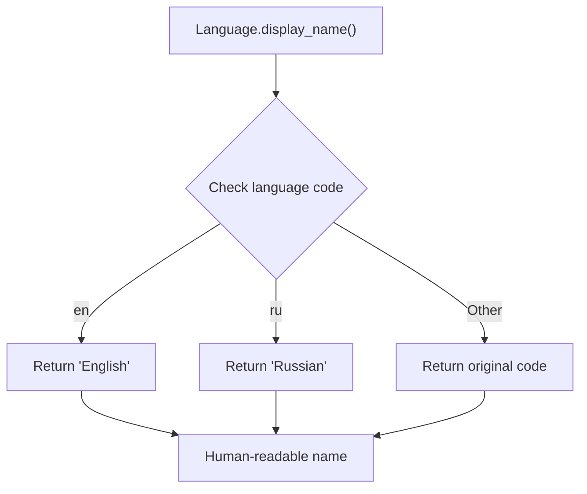
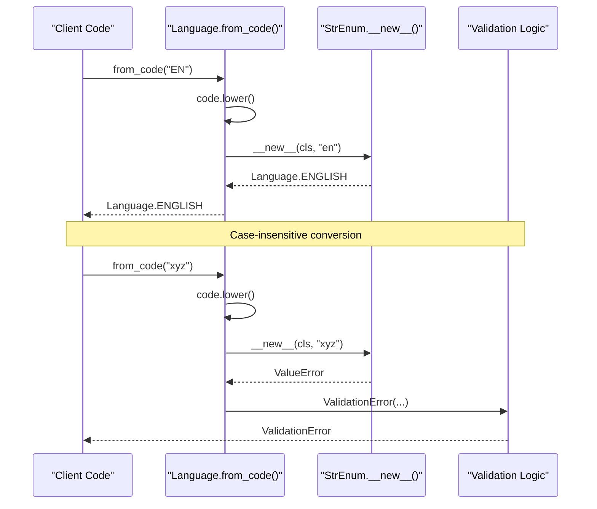
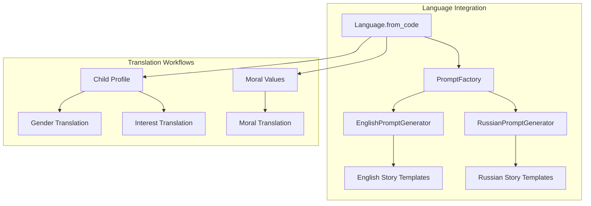
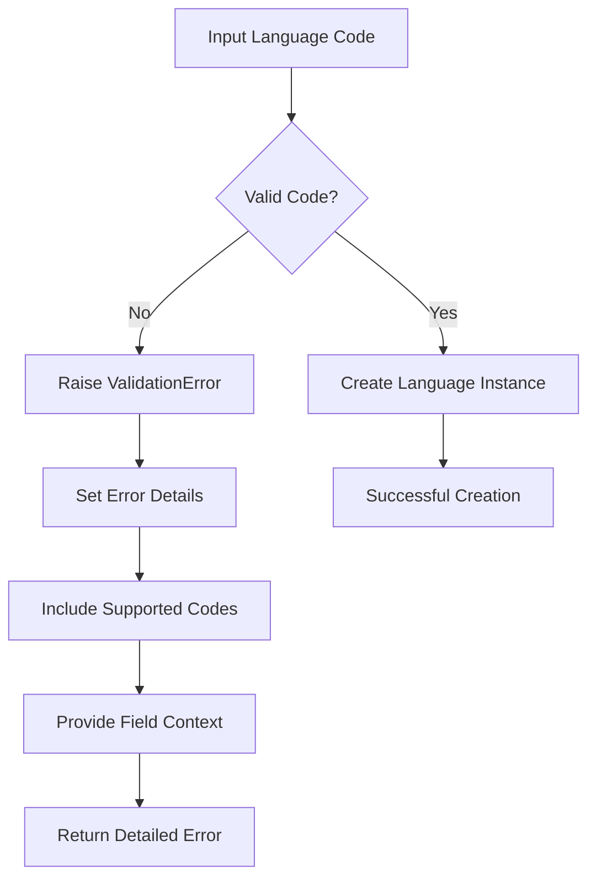

# Language Value Object

<cite>
**Referenced Files in This Document**
- [src/domain/value_objects.py](file://src/domain/value_objects.py)
- [src/models.py](file://src/models.py)
- [src/application/dto.py](file://src/application/dto.py)
- [src/domain/services/prompt_service.py](file://src/domain/services/prompt_service.py)
- [src/prompts.py](file://src/prompts.py)
- [src/api/routes.py](file://src/api/routes.py)
- [test_language_support.py](file://test_language_support.py)
- [test_russian_story.py](file://test_russian_story.py)
- [src/core/exceptions.py](file://src/core/exceptions.py)
</cite>

## Table of Contents
1. [Introduction](#introduction)
2. [Implementation Details](#implementation-details)
3. [Core Properties and Methods](#core-properties-and-methods)
4. [Integration with Multi-Language Workflows](#integration-with-multi-language-workflows)
5. [Error Handling and Validation](#error-handling-and-validation)
6. [Practical Usage Examples](#practical-usage-examples)
7. [Best Practices and Extension Guidelines](#best-practices-and-extension-guidelines)
8. [Common Issues and Solutions](#common-issues-and-solutions)
9. [Testing and Quality Assurance](#testing-and-quality-assurance)
10. [Conclusion](#conclusion)

## Introduction

The Language value object serves as a fundamental component in the Tale Generator domain layer, providing type-safe and validated support for multi-language story generation. Implemented as a StrEnum, it encapsulates the concept of supported languages within the application, primarily focusing on English and Russian languages for bedtime story generation.

This value object plays a crucial role in maintaining consistency across the entire application, ensuring that language-related operations are handled uniformly and safely. It integrates seamlessly with various components including prompt generation, story translation workflows, and API request validation.

## Implementation Details

The Language value object is implemented as a StrEnum subclass, inheriting from Python's native enum.StrEnum class. This design choice provides several advantages:



**Diagram sources**
- [src/domain/value_objects.py](file://src/domain/value_objects.py#L10-L43)

The implementation defines two primary language constants:
- **ENGLISH** (`"en"`): Represents English language support
- **RUSSIAN** (`"ru"`): Represents Russian language support

**Section sources**
- [src/domain/value_objects.py](file://src/domain/value_objects.py#L10-L13)

## Core Properties and Methods

### display_name Property

The `display_name` property provides human-readable language names for user interfaces and logging purposes:



**Diagram sources**
- [src/domain/value_objects.py](file://src/domain/value_objects.py#L15-L21)

The property uses a dictionary-based lookup mechanism to map internal language codes to their corresponding human-readable names, ensuring consistent presentation across the application.

**Section sources**
- [src/domain/value_objects.py](file://src/domain/value_objects.py#L15-L21)

### from_code Class Method

The `from_code` class method serves as the primary constructor for creating Language instances from string codes:



**Diagram sources**
- [src/domain/value_objects.py](file://src/domain/value_objects.py#L23-L43)

The method implements case-insensitive validation by converting input codes to lowercase before attempting instantiation. This approach handles common input variations gracefully while maintaining strict validation standards.

**Section sources**
- [src/domain/value_objects.py](file://src/domain/value_objects.py#L23-L43)

## Integration with Multi-Language Workflows

The Language value object integrates deeply with various components of the Tale Generator system, particularly in prompt generation and story translation workflows.

### Prompt Generation Integration

The Language object coordinates with the prompt generation system to create language-specific story templates:



**Diagram sources**
- [src/domain/services/prompt_service.py](file://src/domain/services/prompt_service.py#L11-L60)
- [src/prompts.py](file://src/prompts.py#L295-L434)

### Russian-Language Story Generation

The Language object specifically enables Russian-language story generation through specialized translation mechanisms:

**Section sources**
- [src/domain/services/prompt_service.py](file://src/domain/services/prompt_service.py#L166-L206)
- [src/prompts.py](file://src/prompts.py#L207-L293)

## Error Handling and Validation

The Language value object implements robust error handling through the ValidationError exception, providing detailed feedback for invalid language codes:



**Diagram sources**
- [src/domain/value_objects.py](file://src/domain/value_objects.py#L36-L43)
- [src/core/exceptions.py](file://src/core/exceptions.py#L41-L66)

The validation system provides comprehensive error context including:
- **Error Message**: Descriptive message about the invalid code
- **Field Information**: Specifies that the error relates to the "language" field
- **Supported Codes**: Lists all valid language codes for user guidance

**Section sources**
- [src/domain/value_objects.py](file://src/domain/value_objects.py#L36-L43)
- [src/core/exceptions.py](file://src/core/exceptions.py#L41-L66)

## Practical Usage Examples

### Basic Language Creation

The Language object supports multiple creation patterns:

```python
# Direct instantiation
english_lang = Language.ENGLISH
russian_lang = Language.RUSSIAN

# From string code with validation
try:
    language = Language.from_code("en")
    print(language.display_name)  # Output: English
except ValidationError as e:
    print(f"Validation error: {e.message}")
```

### Integration with API Requests

The Language object integrates seamlessly with API request validation:

**Section sources**
- [src/application/dto.py](file://src/application/dto.py#L22-L24)
- [src/api/routes.py](file://src/api/routes.py#L116-L118)

### Story Generation Workflow

The Language object coordinates with the story generation pipeline:

**Section sources**
- [src/api/routes.py](file://src/api/routes.py#L116-L118)
- [test_language_support.py](file://test_language_support.py#L8-L47)

## Best Practices and Extension Guidelines

### Adding New Language Support

To extend the Language value object with new languages while maintaining backward compatibility:

1. **Add New Language Constant**: Append new language codes to the Language enum
2. **Update Translation Mappings**: Extend translation dictionaries in relevant components
3. **Maintain Backward Compatibility**: Ensure existing functionality continues to work
4. **Update Validation Logic**: Modify validation methods if necessary

### Design Principles

The Language value object follows several key design principles:

- **Immutability**: Once created, Language instances cannot be modified
- **Type Safety**: Strong typing prevents invalid language assignments
- **Consistency**: Uniform handling of language codes across the application
- **Extensibility**: Clear patterns for adding new language support

### Extension Pattern

```python
# Example extension pattern (not implemented in current codebase)
class ExtendedLanguage(StrEnum):
    ENGLISH = "en"
    RUSSIAN = "ru"
    SPANISH = "es"  # New language
    FRENCH = "fr"   # New language
    
    @property
    def display_name(self) -> str:
        return {
            "en": "English",
            "ru": "Russian", 
            "es": "Spanish",
            "fr": "French"
        }.get(self.value, self.value)
```

## Common Issues and Solutions

### Case Sensitivity Issues

**Problem**: Users may input language codes in inconsistent case formats (e.g., "EN", "En", "en")

**Solution**: The `from_code` method automatically converts input to lowercase, handling case variations transparently.

### Invalid Language Codes

**Problem**: Attempting to create Language instances with unsupported codes

**Solution**: The validation system catches invalid codes and provides detailed error messages with supported options.

### Integration Conflicts

**Problem**: Conflicting language representations across different modules

**Solution**: Centralized Language value object ensures consistent language handling throughout the application.

**Section sources**
- [src/domain/value_objects.py](file://src/domain/value_objects.py#L36-L43)

## Testing and Quality Assurance

The Language value object includes comprehensive testing coverage:

### Unit Tests

The test suite verifies core functionality including:
- Valid language code creation
- Case-insensitive validation
- Error handling for invalid codes
- Display name functionality

### Integration Tests

Integration tests validate Language usage in:
- Prompt generation workflows
- Story creation processes
- API request handling
- Translation systems

**Section sources**
- [test_language_support.py](file://test_language_support.py#L1-L51)
- [test_russian_story.py](file://test_russian_story.py#L1-L34)

## Conclusion

The Language value object represents a well-designed, type-safe solution for managing multi-language support in the Tale Generator application. Its implementation as a StrEnum provides both type safety and extensibility, while the comprehensive validation system ensures robust error handling.

Key strengths of the implementation include:
- **Type Safety**: Strong typing prevents invalid language assignments
- **Validation**: Comprehensive error handling with detailed feedback
- **Extensibility**: Clear patterns for adding new language support
- **Integration**: Seamless coordination with other system components
- **Consistency**: Uniform language handling across all application layers

The Language value object successfully fulfills its role as a foundational component in the Tale Generator domain layer, enabling reliable multi-language story generation while maintaining code quality and user experience standards.