# Rating Value Object

<cite>
**Referenced Files in This Document**
- [src/domain/value_objects.py](file://src/domain/value_objects.py)
- [src/core/constants.py](file://src/core/constants.py)
- [src/core/exceptions.py](file://src/core/exceptions.py)
- [src/models.py](file://src/models.py)
- [src/api/routes.py](file://src/api/routes.py)
- [src/application/use_cases/manage_stories.py](file://src/application/use_cases/manage_stories.py)
- [src/domain/entities.py](file://src/domain/entities.py)
- [test_rating.py](file://test_rating.py)
</cite>

## Table of Contents
1. [Introduction](#introduction)
2. [Implementation Overview](#implementation-overview)
3. [Core Architecture](#core-architecture)
4. [Validation Mechanism](#validation-mechanism)
5. [Integration with Story System](#integration-with-story-system)
6. [API Endpoint Implementation](#api-endpoint-implementation)
7. [Error Handling](#error-handling)
8. [Best Practices](#best-practices)
9. [Common Issues and Solutions](#common-issues-and-solutions)
10. [Testing and Validation](#testing-and-validation)

## Introduction

The Rating value object is a fundamental component of the Tale Generator domain layer that encapsulates story ratings within the 1-10 scale. As an immutable dataclass, it enforces strict validation rules and provides consistent behavior across the application. This value object serves as the foundation for the story feedback system, enabling users to rate stories and facilitating statistical calculations for quality assessment.

The Rating value object demonstrates Domain-Driven Design principles by modeling a bounded context concept with explicit boundaries and validation rules. It ensures data integrity by preventing invalid rating values and provides a clean interface for rating-related operations throughout the application.

## Implementation Overview

The Rating value object is implemented as a frozen dataclass that represents a story rating with the following characteristics:

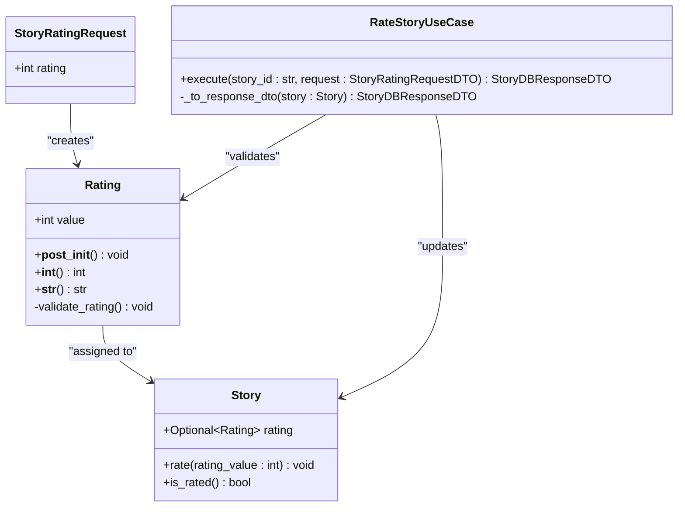

**Diagram sources**
- [src/domain/value_objects.py](file://src/domain/value_objects.py#L136-L156)
- [src/domain/entities.py](file://src/domain/entities.py#L114-L157)
- [src/models.py](file://src/models.py#L115-L117)
- [src/application/use_cases/manage_stories.py](file://src/application/use_cases/manage_stories.py#L272-L315)

**Section sources**
- [src/domain/value_objects.py](file://src/domain/value_objects.py#L136-L156)

## Core Architecture

### Dataclass Definition

The Rating value object is defined as a frozen dataclass with the following structure:

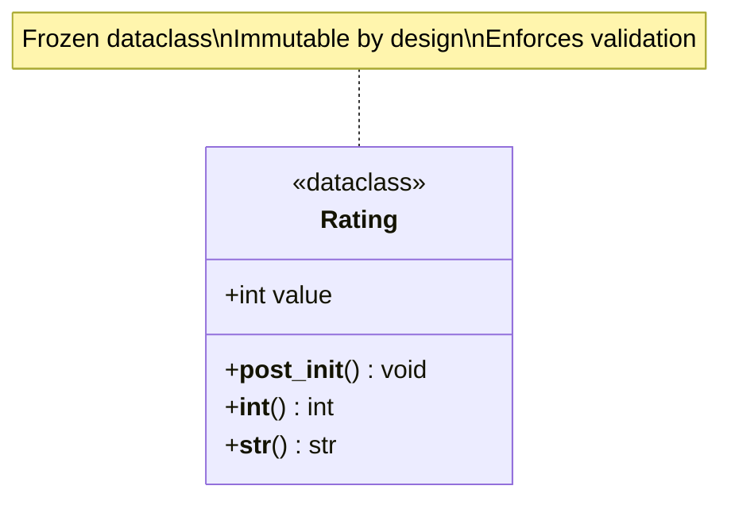

**Diagram sources**
- [src/domain/value_objects.py](file://src/domain/value_objects.py#L136-L156)

The implementation leverages Python's `dataclasses` module with the `frozen=True` parameter, ensuring immutability and preventing accidental modifications after creation. The value object contains a single field `value` of type `int` that stores the rating score.

### Constants and Boundaries

The rating boundaries are defined using constants from the application configuration:

| Constant | Value | Purpose |
|----------|-------|---------|
| `MIN_RATING` | 1 | Minimum valid rating value |
| `MAX_RATING` | 10 | Maximum valid rating value |

These constants are centralized in the [`src/core/constants.py`](file://src/core/constants.py#L14-L15) file, ensuring consistency across the application and making boundary adjustments straightforward.

**Section sources**
- [src/domain/value_objects.py](file://src/domain/value_objects.py#L136-L156)
- [src/core/constants.py](file://src/core/constants.py#L14-L15)

## Validation Mechanism

### Post-Initialization Validation

The Rating value object implements validation logic in the `__post_init__` method, which is automatically called after object instantiation. This validation ensures that the rating value falls within the acceptable range:

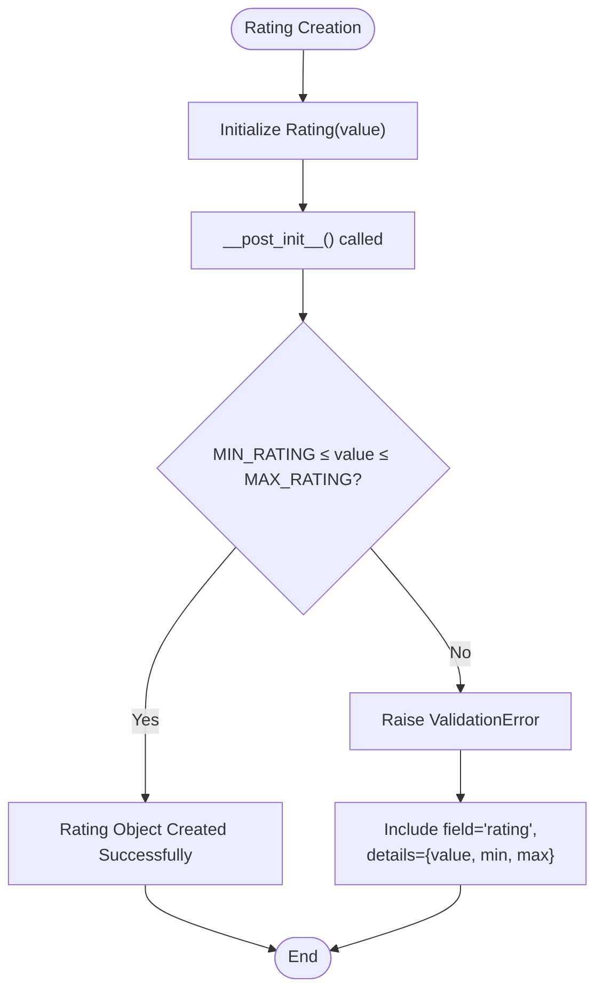

**Diagram sources**
- [src/domain/value_objects.py](file://src/domain/value_objects.py#L141-L148)

### Validation Logic

The validation process checks if the provided rating value satisfies the condition `MIN_RATING <= value <= MAX_RATING`. If validation fails, a `ValidationError` is raised with detailed information about the failure:

- **Error Message**: "Rating must be between {MIN_RATING} and {MAX_RATING}"
- **Field**: "rating" (identifies the problematic field)
- **Details**: Contains the actual value, minimum, and maximum values for debugging

### Integer Conversion Methods

The Rating value object provides two conversion methods for flexibility:

#### Integer Conversion (`__int__`)
The `__int__` method enables implicit conversion to integers, allowing the rating to be used in mathematical operations while maintaining the original value:

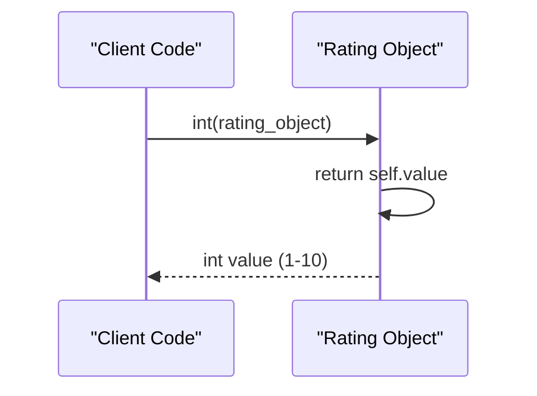

**Diagram sources**
- [src/domain/value_objects.py](file://src/domain/value_objects.py#L150-L152)

#### String Representation (`__str__`)
The `__str__` method provides a human-readable representation formatted as "{value}/10", making it suitable for display purposes:

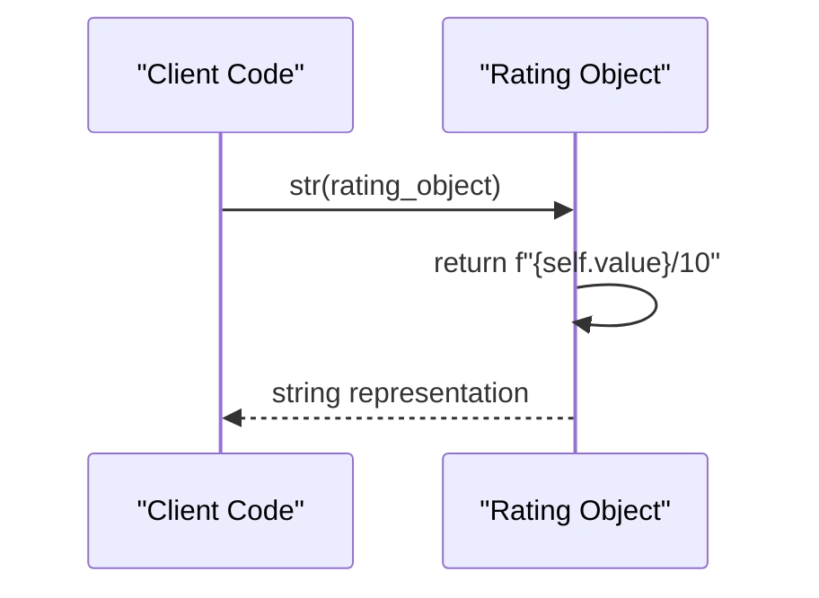

**Diagram sources**
- [src/domain/value_objects.py](file://src/domain/value_objects.py#L154-L156)

**Section sources**
- [src/domain/value_objects.py](file://src/domain/value_objects.py#L141-L156)

## Integration with Story System

### Story Entity Integration

The Rating value object is integrated with the Story entity through the `rating` field, which is optional and can be set using the `rate()` method:

```mermaid
classDiagram
class Story {
+Optional~Rating~ rating
+rate(rating_value : int) void
+is_rated() bool
+has_audio() bool
+word_count() int
}
class Rating {
+int value
+__int__() int
+__str__() str
}
Story --> Rating : "contains optional"
Story : +rate(rating_value : int)
Story : +is_rated() bool
```

**Diagram sources**
- [src/domain/entities.py](file://src/domain/entities.py#L114-L157)
- [src/domain/value_objects.py](file://src/domain/value_objects.py#L136-L156)

### Rating Workflow

The rating process follows a structured workflow that ensures data integrity:

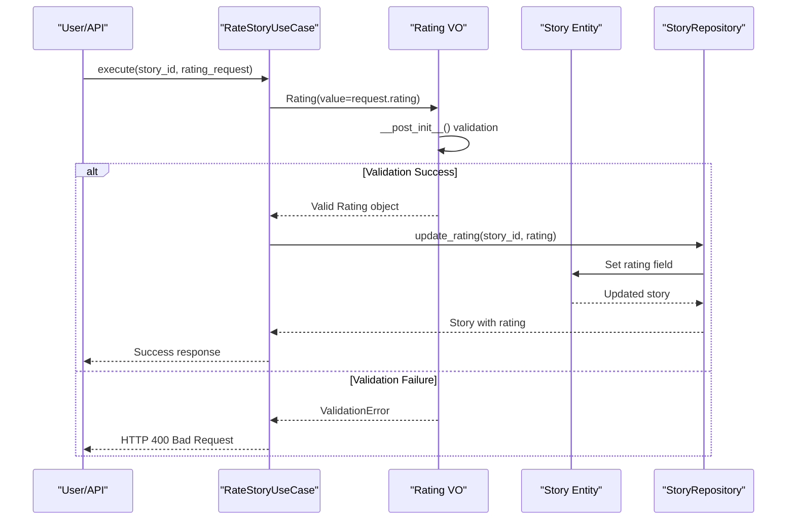

**Diagram sources**
- [src/application/use_cases/manage_stories.py](file://src/application/use_cases/manage_stories.py#L289-L313)

### Story Rating Methods

The Story entity provides several methods for rating management:

| Method | Purpose | Return Type |
|--------|---------|-------------|
| `rate(rating_value: int)` | Assign a rating to the story | `void` |
| `is_rated()` | Check if story has a rating | `bool` |
| `has_audio()` | Check if story has audio attachment | `bool` |

**Section sources**
- [src/domain/entities.py](file://src/domain/entities.py#L148-L188)
- [src/application/use_cases/manage_stories.py](file://src/application/use_cases/manage_stories.py#L289-L313)

## API Endpoint Implementation

### RESTful API Route

The Rating value object integrates with the RESTful API through the `/stories/{story_id}/rating` endpoint, which handles story rating requests:

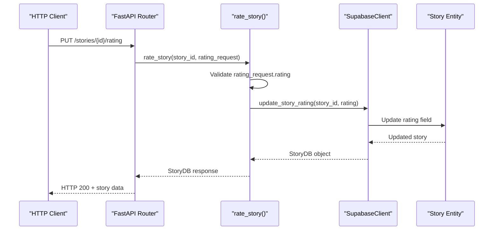

**Diagram sources**
- [src/api/routes.py](file://src/api/routes.py#L279-L305)

### Request Model Validation

The API uses Pydantic's `Field` validation to ensure rating values fall within the valid range:

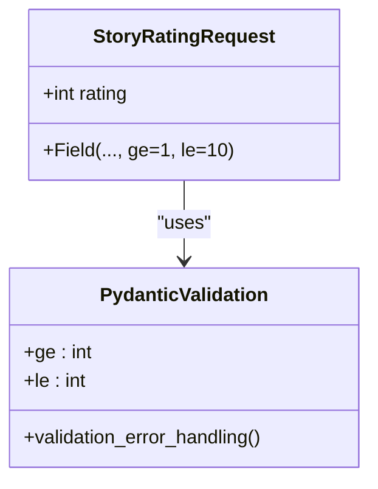

**Diagram sources**
- [src/models.py](file://src/models.py#L115-L117)

### Error Response Handling

The API endpoint implements comprehensive error handling for various scenarios:

| Scenario | HTTP Status | Error Response |
|----------|-------------|----------------|
| Supabase not configured | 500 | "Supabase not configured" |
| Story not found | 404 | "Story not found" |
| Validation error | 400 | Detailed validation message |
| Internal server error | 500 | Generic error message |

**Section sources**
- [src/api/routes.py](file://src/api/routes.py#L279-L305)
- [src/models.py](file://src/models.py#L115-L117)

## Error Handling

### ValidationError Structure

The Rating value object raises `ValidationError` exceptions when validation fails, following the application's exception hierarchy:

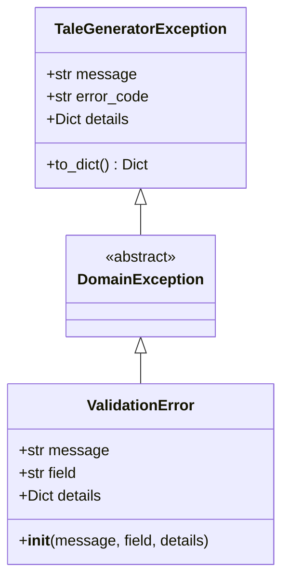

**Diagram sources**
- [src/core/exceptions.py](file://src/core/exceptions.py#L6-L67)

### Validation Error Details

When a Rating validation fails, the error includes comprehensive details:

- **Message**: Descriptive error message indicating the validation constraint
- **Field**: Identifies the problematic field ("rating")
- **Details**: Contains the actual value, minimum, and maximum values for debugging

### Error Propagation

Errors propagate through the application layers with appropriate handling:

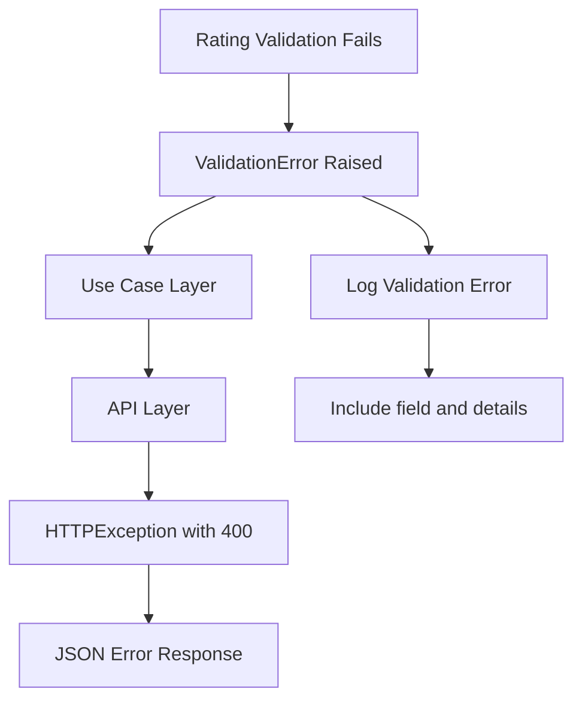

**Diagram sources**
- [src/core/exceptions.py](file://src/core/exceptions.py#L41-L67)

**Section sources**
- [src/core/exceptions.py](file://src/core/exceptions.py#L41-L67)
- [src/domain/value_objects.py](file://src/domain/value_objects.py#L143-L148)

## Best Practices

### Immutable Design Benefits

The Rating value object's immutable design provides several benefits:

1. **Thread Safety**: Immutable objects are inherently thread-safe
2. **Predictable Behavior**: Once created, rating values cannot be changed
3. **Defensive Programming**: Prevents accidental modifications
4. **Consistency**: Ensures uniform behavior across the application

### Validation Strategy

The validation strategy combines multiple layers of protection:

1. **Pydantic Validation**: API-level validation using `Field` constraints
2. **Domain Validation**: Business logic validation in `__post_init__`
3. **Type Safety**: Strong typing with `int` type hints

### Error Handling Guidelines

When working with Rating value objects, follow these guidelines:

1. **Always Validate Input**: Use Pydantic models for API requests
2. **Handle Validation Errors Gracefully**: Provide meaningful error messages
3. **Log Validation Failures**: Include context for debugging
4. **Use Consistent Error Formats**: Follow the application's exception structure

### Integration Patterns

Recommended patterns for integrating Rating value objects:

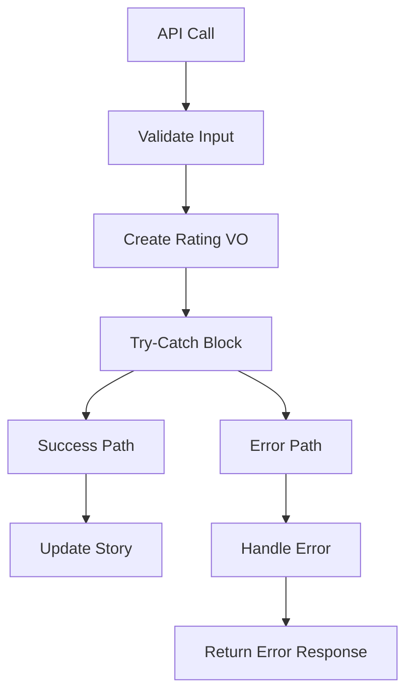

## Common Issues and Solutions

### Issue 1: Invalid Rating Values

**Problem**: Users attempt to create ratings outside the 1-10 range.

**Solution**: The Rating value object prevents this through validation:

```python
# This will raise ValidationError
try:
    rating = Rating(value=11)
except ValidationError as e:
    print(f"Validation failed: {e.message}")
    # Output: Validation failed: Rating must be between 1 and 10
```

### Issue 2: Type Mismatch

**Problem**: Non-integer values are passed to the Rating constructor.

**Solution**: The dataclass enforces type safety, but Pydantic validation provides additional protection at the API level.

### Issue 3: Missing Validation in Use Cases

**Problem**: Rating validation bypassed in business logic.

**Solution**: Always create Rating objects through the constructor to ensure validation:

```python
# Correct - triggers validation
rating = Rating(value=8)

# Incorrect - bypasses validation
rating = Rating.__new__(Rating, value=8)  # Not recommended
```

### Issue 4: Error Handling in API Endpoints

**Problem**: Poor error responses for invalid ratings.

**Solution**: Implement comprehensive error handling:

```python
@router.put("/stories/{story_id}/rating")
async def rate_story(story_id: str, rating_request: StoryRatingRequest):
    try:
        # Validation happens here
        updated_story = supabase_client.update_story_rating(story_id, rating_request.rating)
        return updated_story
    except ValidationError as e:
        raise HTTPException(
            status_code=400,
            detail={
                "error": "VALIDATION_ERROR",
                "message": e.message,
                "details": e.details
            }
        )
```

### Issue 5: Inconsistent Rating Display

**Problem**: Ratings displayed inconsistently across the application.

**Solution**: Use the `__str__` method for consistent formatting:

```python
rating = Rating(value=7)
print(str(rating))  # Output: "7/10"
```

## Testing and Validation

### Unit Testing

The Rating value object includes comprehensive unit tests that verify:

1. **Valid Rating Creation**: Ratings within the 1-10 range
2. **Invalid Rating Detection**: Ratings outside the valid range
3. **String Representation**: Proper formatting of rating values
4. **Integer Conversion**: Correct conversion to integers

### Integration Testing

Integration tests verify the Rating value object's behavior within the complete system:

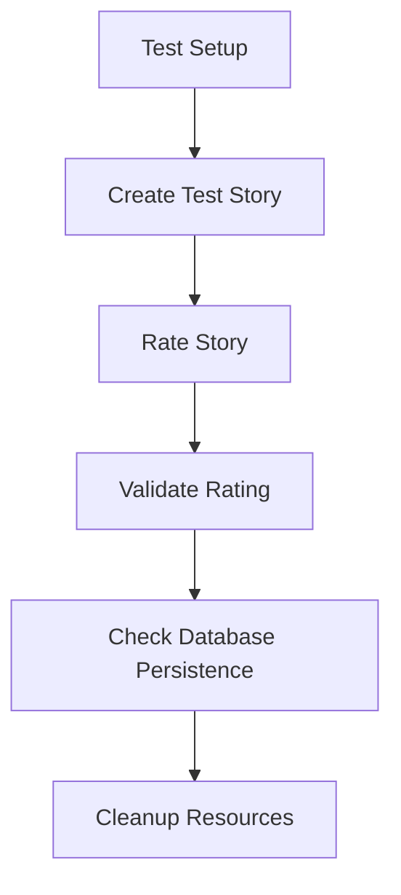

**Diagram sources**
- [test_rating.py](file://test_rating.py#L15-L56)

### Test Coverage Areas

Key areas covered in testing:

| Test Category | Coverage |
|---------------|----------|
| Valid Ratings | 1-10 range |
| Invalid Ratings | < 1 and > 10 |
| String Formatting | "X/10" format |
| Integer Conversion | Type preservation |
| API Integration | Endpoint validation |
| Error Handling | Exception propagation |

**Section sources**
- [test_rating.py](file://test_rating.py#L15-L56)

## Conclusion

The Rating value object exemplifies effective Domain-Driven Design implementation in the Tale Generator application. Its combination of immutability, comprehensive validation, and clean integration patterns ensures data integrity while providing a robust foundation for the story rating system.

The value object's design promotes consistency across the application, prevents invalid data states, and provides clear error handling mechanisms. By leveraging Python's dataclass features and following established patterns for validation and error handling, the Rating value object demonstrates best practices for domain modeling in Python applications.

Through its integration with the Story entity, API endpoints, and use cases, the Rating value object contributes to a cohesive and maintainable architecture that supports the application's core functionality of story rating and feedback collection.