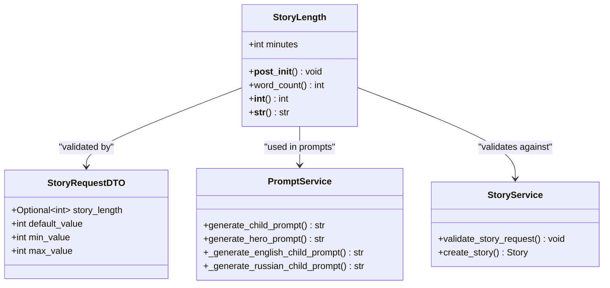
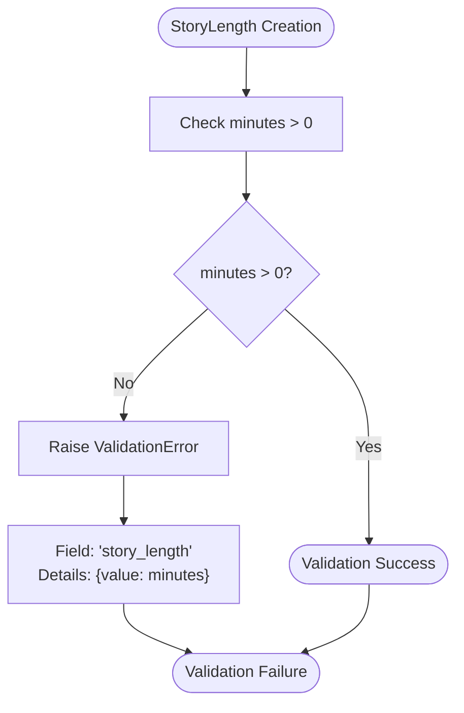
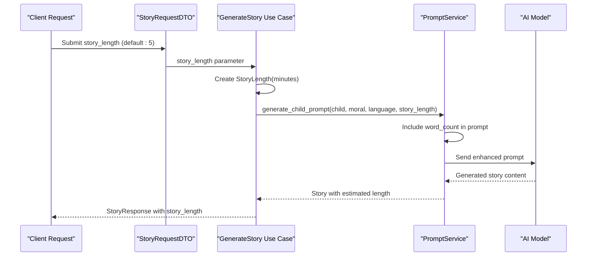

# StoryLength Value Object

<cite>
**Referenced Files in This Document**
- [src/domain/value_objects.py](file://src/domain/value_objects.py)
- [src/core/constants.py](file://src/core/constants.py)
- [src/application/dto.py](file://src/application/dto.py)
- [src/domain/services/prompt_service.py](file://src/domain/services/prompt_service.py)
- [src/domain/services/story_service.py](file://src/domain/services/story_service.py)
- [src/application/use_cases/generate_story.py](file://src/application/use_cases/generate_story.py)
- [src/api/routes.py](file://src/api/routes.py)
- [QUICK_START.md](file://QUICK_START.md)
</cite>

## Table of Contents
1. [Introduction](#introduction)
2. [Implementation Overview](#implementation-overview)
3. [Core Architecture](#core-architecture)
4. [Validation and Constraints](#validation-and-constraints)
5. [Word Count Calculation](#word-count-calculation)
6. [Integration with Story Generation](#integration-with-story-generation)
7. [String Representation](#string-representation)
8. [Usage Examples](#usage-examples)
9. [Common Issues and Solutions](#common-issues-and-solutions)
10. [Best Practices](#best-practices)
11. [Extending StoryLength](#extending-storylength)
12. [Testing and Quality Assurance](#testing-and-quality-assurance)

## Introduction

The StoryLength value object is a fundamental component in the Tale Generator domain layer that represents story duration in minutes and provides intelligent word count estimation based on reading speed. As an immutable dataclass, it encapsulates the concept of story length while ensuring data integrity through validation and providing meaningful representations for both programmatic and user-facing contexts.

This value object serves as a bridge between user preferences for story duration and the AI-generated content creation process, influencing prompt engineering, content length estimation, and overall story quality metrics.

## Implementation Overview

The StoryLength value object is implemented as a frozen dataclass that provides immutability guarantees and efficient memory usage. It leverages Python's dataclasses module with the `frozen=True` parameter to ensure that once created, the story length cannot be modified, maintaining referential integrity throughout the application lifecycle.



**Diagram sources**
- [src/domain/value_objects.py](file://src/domain/value_objects.py#L159-L188)
- [src/application/dto.py](file://src/application/dto.py#L23-L24)
- [src/domain/services/prompt_service.py](file://src/domain/services/prompt_service.py#L14-L60)

**Section sources**
- [src/domain/value_objects.py](file://src/domain/value_objects.py#L159-L188)

## Core Architecture

### Data Structure Design

The StoryLength value object maintains a single essential field: `minutes`, which stores the duration in minutes. This design follows the principle of simplicity, focusing on the core concept of story length without unnecessary complexity.

### Immutability and Thread Safety

As a frozen dataclass, StoryLength provides several benefits:

- **Thread Safety**: Immutable instances can be safely shared across threads without synchronization concerns
- **Hashability**: Frozen dataclasses are hashable, enabling their use as dictionary keys or set members
- **Predictability**: Once created, the story length remains constant throughout its lifetime
- **Memory Efficiency**: Dataclasses with frozen=True optimize memory usage compared to mutable alternatives

### Type Safety and Validation

The implementation enforces strict type checking and validation through Python's type hints and runtime validation mechanisms, ensuring that only valid story lengths are processed throughout the system.

**Section sources**
- [src/domain/value_objects.py](file://src/domain/value_objects.py#L159-L188)

## Validation and Constraints

### Post-Initialization Validation

The `__post_init__` method implements critical validation logic that ensures story length meets business requirements:



**Diagram sources**
- [src/domain/value_objects.py](file://src/domain/value_objects.py#L164-L171)

### Validation Logic Details

The validation mechanism performs the following checks:

1. **Positive Duration Requirement**: Ensures story length is greater than zero minutes
2. **Error Reporting**: Provides detailed error information including the invalid value
3. **Field Specification**: Identifies the specific field causing validation failure
4. **Business Context**: Maintains consistency with business requirements for story generation

### Integration with Validation Systems

The validation error handling integrates seamlessly with the application's exception handling system, allowing for centralized error management and user-friendly error messages.

**Section sources**
- [src/domain/value_objects.py](file://src/domain/value_objects.py#L164-L171)

## Word Count Calculation

### Reading Speed Constant

The word count calculation relies on the `READING_SPEED_WPM` constant defined in the application constants module. This constant represents the average reading speed in words per minute, currently set to 150 WPM.

### Mathematical Foundation

The word count calculation follows a simple mathematical formula:
```
word_count = minutes × READING_SPEED_WPM
```

This approach provides a reasonable estimate of content length based on standard reading speeds, accounting for typical adult reading comprehension rates.

### Estimation Accuracy

The calculation provides an approximate word count that serves several purposes:

- **AI Prompt Engineering**: Guides the AI model to generate content of appropriate length
- **User Expectations**: Helps users understand the expected story length
- **Resource Planning**: Assists in estimating computational resources for story generation

**Section sources**
- [src/domain/value_objects.py](file://src/domain/value_objects.py#L173-L181)
- [src/core/constants.py](file://src/core/constants.py#L11)

## Integration with Story Generation

### Story Length in Use Cases

The StoryLength value object plays a central role in the story generation workflow, particularly in the generate_story use case:



**Diagram sources**
- [src/application/use_cases/generate_story.py](file://src/application/use_cases/generate_story.py#L70-L71)
- [src/domain/services/prompt_service.py](file://src/domain/services/prompt_service.py#L16-L37)

### Prompt Engineering Integration

StoryLength integrates deeply with the prompt generation system, providing context for AI model training:

- **English Prompts**: Include word count estimates in English prompts
- **Russian Prompts**: Provide equivalent word count information in Russian prompts
- **Contextual Information**: Supplies story length context to maintain narrative coherence

### Service Layer Validation

The StoryService validates story length during the story creation process, ensuring consistency between user input and internal representation.

**Section sources**
- [src/application/use_cases/generate_story.py](file://src/application/use_cases/generate_story.py#L70-L71)
- [src/domain/services/prompt_service.py](file://src/domain/services/prompt_service.py#L16-L37)
- [src/domain/services/story_service.py](file://src/domain/services/story_service.py#L137-L144)

## String Representation

### Human-Friendly Output

The `__str__` method provides a user-friendly string representation that combines both the raw minutes value and the calculated word count:

```
"{minutes} minutes (~{word_count} words)"
```

This representation serves multiple purposes:

- **Debugging**: Provides clear output for logging and debugging
- **User Communication**: Presents information in an understandable format
- **Consistency**: Maintains uniform formatting across the application

### Formatting Strategy

The string representation uses a consistent format that includes:
- The exact minutes value
- An approximate word count indicator
- Clear separation between duration and word count
- Internationalization considerations for different languages

**Section sources**
- [src/domain/value_objects.py](file://src/domain/value_objects.py#L186-L188)

## Usage Examples

### Basic Instantiation

The most common usage pattern involves creating StoryLength instances with specific duration values:

```python
# Standard usage with explicit duration
short_story = StoryLength(minutes=5)
medium_story = StoryLength(minutes=10)
long_story = StoryLength(minutes=15)

# Default usage with fallback
story_length = StoryLength(minutes=request.story_length or 5)
```

### Integration with DTOs

StoryLength integrates naturally with Data Transfer Objects, providing type safety and validation:

```python
# From API requests with default values
story_length: Optional[int] = Field(default=5, ge=1, le=30)

# Automatic conversion in use cases
story_length = StoryLength(minutes=request.story_length or 5)
```

### Prompt Generation Context

In prompt generation scenarios, StoryLength provides contextual information:

```python
# English prompt context
prompt = f"Make the story engaging, imaginative, and approximately {story_length.word_count} words long."

# Russian prompt context  
prompt = f"Сделай сказку увлекательной, воображаемой и приблизительно {story_length.word_count} слов длинной."
```

**Section sources**
- [src/application/dto.py](file://src/application/dto.py#L23-L24)
- [src/application/use_cases/generate_story.py](file://src/application/use_cases/generate_story.py#L70-L71)

## Common Issues and Solutions

### Zero or Negative Durations

**Problem**: Attempting to create a StoryLength with zero or negative values

**Solution**: The validation in `__post_init__` prevents this scenario by raising a ValidationError with descriptive error messages.

**Example Error**:
```
ValidationError: "Story length must be positive" with details {"value": -5}
```

### Integer Conversion Issues

**Problem**: Converting StoryLength to integer values for database storage or API responses

**Solution**: The `__int__` method provides seamless conversion to integers, returning the minutes value.

### Word Count Precision

**Problem**: Need for more precise word count calculations

**Solution**: While the current implementation uses a simple multiplication, the architecture allows for more sophisticated calculations if needed.

### Default Value Handling

**Problem**: Handling missing story_length values in API requests

**Solution**: The system provides sensible defaults (5 minutes) while maintaining validation consistency.

**Section sources**
- [src/domain/value_objects.py](file://src/domain/value_objects.py#L164-L171)
- [src/application/dto.py](file://src/application/dto.py#L23-L24)

## Best Practices

### Configuration Management

**Reading Speed Configuration**: The `READING_SPEED_WPM` constant should be configurable based on target audience demographics:

```python
# For younger audiences (children)
READING_SPEED_WPM: Final[int] = 120  # Children's reading speed

# For older audiences (adults)  
READING_SPEED_WPM: Final[int] = 200  # Adult reading speed
```

### Validation Consistency

Maintain consistent validation patterns across the application:

```python
# Centralized validation method
def validate_story_length(length: Optional[int]) -> Optional[StoryLength]:
    if length is None:
        return None
    return StoryLength(minutes=length)
```

### Error Handling Patterns

Implement robust error handling for StoryLength-related errors:

```python
try:
    story_length = StoryLength(minutes=user_input)
except ValidationError as e:
    # Handle validation errors gracefully
    logger.warning(f"Invalid story length: {e}")
    story_length = StoryLength(minutes=DEFAULT_LENGTH)
```

### Performance Considerations

Since StoryLength is a lightweight value object, consider caching frequently used instances or using weak references for temporary calculations.

### Testing Strategies

Implement comprehensive tests covering:

- Valid duration values (positive integers)
- Invalid duration values (zero, negative)
- Edge cases (maximum allowed duration)
- String representation consistency
- Integration with prompt generation

**Section sources**
- [src/core/constants.py](file://src/core/constants.py#L11)
- [src/domain/value_objects.py](file://src/domain/value_objects.py#L164-L171)

## Extending StoryLength

### Advanced Length Calculations

The current implementation can be extended for more sophisticated length calculations:

```python
@dataclass(frozen=True)
class AdvancedStoryLength(StoryLength):
    """Extended story length with dynamic reading speed."""
    reading_speed_adjustment: float = 1.0
    
    @property
    def adjusted_word_count(self) -> int:
        """Calculate word count with reading speed adjustment."""
        base_count = super().word_count
        return int(base_count * self.reading_speed_adjustment)
```

### Multi-Language Support

Enhance internationalization capabilities:

```python
@dataclass(frozen=True)
class LocalizedStoryLength(StoryLength):
    """Story length with locale-specific formatting."""
    locale: str = "en_US"
    
    def localized_string(self) -> str:
        """Return localized string representation."""
        word_count = self.word_count
        if self.locale == "en_US":
            return f"{self.minutes} minutes (~{word_count} words)"
        elif self.locale == "fr_FR":
            return f"{self.minutes} minutes (~{word_count} mots)"
        # Add more locales as needed
```

### Content Complexity Integration

Integrate with content complexity metrics:

```python
@dataclass(frozen=True)
class SmartStoryLength(StoryLength):
    """Story length with content complexity awareness."""
    complexity_factor: float = 1.0
    
    @property
    def effective_word_count(self) -> int:
        """Calculate effective word count considering complexity."""
        return int(self.word_count * self.complexity_factor)
```

### Database Persistence Extensions

Add serialization capabilities for database storage:

```python
@dataclass(frozen=True)
class PersistableStoryLength(StoryLength):
    """Story length with database persistence support."""
    
    def to_dict(self) -> Dict[str, Any]:
        """Convert to dictionary for database storage."""
        return {
            "minutes": self.minutes,
            "word_count": self.word_count,
            "created_at": datetime.utcnow()
        }
    
    @classmethod
    def from_dict(cls, data: Dict[str, Any]) -> "PersistableStoryLength":
        """Create from database dictionary."""
        return cls(minutes=data["minutes"])
```

## Testing and Quality Assurance

### Unit Testing Patterns

Implement comprehensive unit tests for StoryLength functionality:

```python
def test_story_length_validation():
    """Test StoryLength validation logic."""
    # Valid cases
    assert StoryLength(minutes=1).minutes == 1
    assert StoryLength(minutes=30).minutes == 30
    
    # Invalid cases
    with pytest.raises(ValidationError):
        StoryLength(minutes=0)
    with pytest.raises(ValidationError):
        StoryLength(minutes=-5)

def test_word_count_calculation():
    """Test word count calculation accuracy."""
    length = StoryLength(minutes=5)
    assert length.word_count == 750  # 5 * 150 WPM
    
    length = StoryLength(minutes=10)
    assert length.word_count == 1500  # 10 * 150 WPM
```

### Integration Testing

Test StoryLength integration with the broader system:

```python
def test_story_length_in_prompt_generation():
    """Test StoryLength integration with prompt generation."""
    child = create_test_child()
    moral = "kindness"
    language = Language.ENGLISH
    story_length = StoryLength(minutes=5)
    
    prompt = prompt_service.generate_child_prompt(child, moral, language, story_length)
    
    # Verify word count appears in prompt
    assert str(story_length.word_count) in prompt
    assert "approximately" in prompt
```

### Performance Testing

Measure performance characteristics:

```python
def test_story_length_performance():
    """Test StoryLength performance under load."""
    import timeit
    
    # Measure instantiation time
    setup = "from src.domain.value_objects import StoryLength"
    stmt = "StoryLength(minutes=5)"
    time_taken = timeit.timeit(stmt, setup=setup, number=10000)
    
    assert time_taken < 0.1  # Should be fast
```

### Validation Testing

Ensure comprehensive validation coverage:

```python
def test_story_length_error_messages():
    """Test error message consistency."""
    try:
        StoryLength(minutes=0)
        pytest.fail("Should have raised ValidationError")
    except ValidationError as e:
        assert "story_length" in str(e)
        assert "positive" in str(e)
        assert "0" in str(e)
```

**Section sources**
- [src/domain/value_objects.py](file://src/domain/value_objects.py#L164-L171)