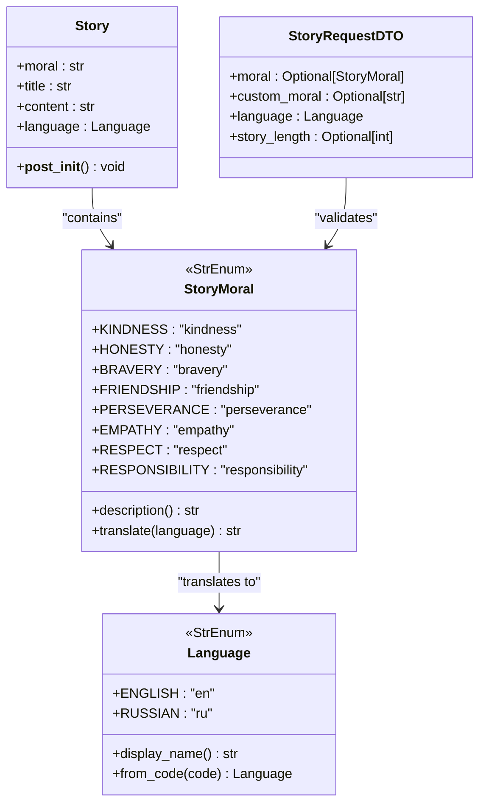
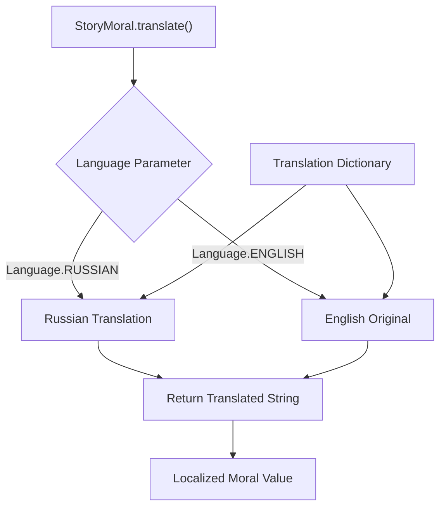
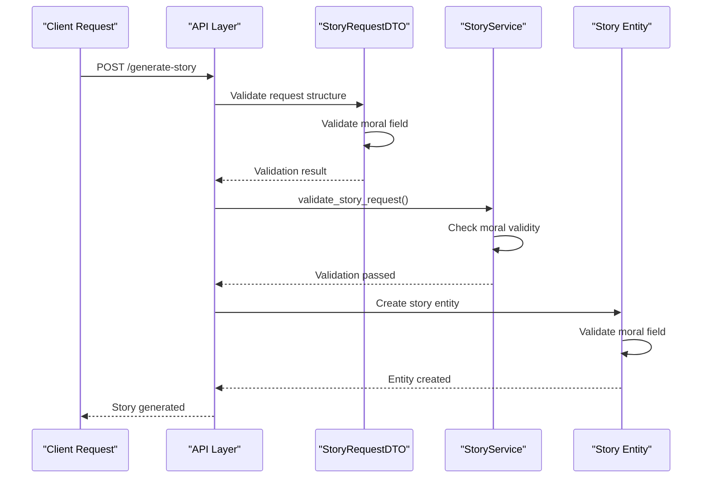

# StoryMoral Value Object

<cite>
**Referenced Files in This Document**
- [src/domain/value_objects.py](file://src/domain/value_objects.py)
- [src/application/dto.py](file://src/application/dto.py)
- [src/application/use_cases/generate_story.py](file://src/application/use_cases/generate_story.py)
- [src/api/routes.py](file://src/api/routes.py)
- [src/domain/entities.py](file://src/domain/entities.py)
- [src/domain/services/story_service.py](file://src/domain/services/story_service.py)
- [src/domain/services/prompt_service.py](file://src/domain/services/prompt_service.py)
- [populate_stories.py](file://populate_stories.py)
</cite>

## Table of Contents
1. [Introduction](#introduction)
2. [Core Design and Architecture](#core-design-and-architecture)
3. [Predefined Moral Values](#predefined-moral-values)
4. [Key Properties and Methods](#key-properties-and-methods)
5. [Localization and Translation](#localization-and-translation)
6. [Validation Mechanisms](#validation-mechanisms)
7. [Integration with Story Generation](#integration-with-story-generation)
8. [Prompt Engineering and Moral Emphasis](#prompt-engineering-and-moral-emphasis)
9. [Common Issues and Best Practices](#common-issues-and-best-practices)
10. [Usage Examples](#usage-examples)
11. [Testing and Quality Assurance](#testing-and-quality-assurance)

## Introduction

The StoryMoral value object is a fundamental component of the Tale Generator domain layer that encapsulates predefined moral values essential for educational storytelling. As a StrEnum-based enumeration, it provides a type-safe, immutable collection of eight core moral principles that serve as the foundation for generating meaningful bedtime stories with embedded educational value.

This value object serves multiple critical functions in the storytelling ecosystem: it ensures consistency in moral selection, enables localization support, provides descriptive explanations for each moral concept, and integrates seamlessly with the broader domain model to maintain data integrity throughout the story generation pipeline.

## Core Design and Architecture

The StoryMoral value object follows the Domain-Driven Design (DDD) principles by implementing a value object pattern that emphasizes immutability, equality based on value rather than identity, and clear semantic meaning. Built on Python's StrEnum base class, it inherits robust type safety while maintaining string-like interoperability.

**Diagram sources**
- [src/domain/value_objects.py](file://src/domain/value_objects.py#L76-L133)
- [src/application/dto.py](file://src/application/dto.py#L20-L22)
- [src/domain/entities.py](file://src/domain/entities.py#L115-L147)

**Section sources**
- [src/domain/value_objects.py](file://src/domain/value_objects.py#L76-L133)

## Predefined Moral Values

The StoryMoral enumeration defines eight core moral values that form the educational backbone of the storytelling system. Each value represents a fundamental ethical principle that can be woven into narrative contexts to teach children valuable life lessons.

### KINDNESS (Доброта)
**Description**: Teaching kindness and compassion through acts of generosity, empathy, and caring for others. Stories featuring kindness demonstrate how small gestures can create ripples of positivity and build stronger communities.

**Educational Impact**: Children learn to recognize opportunities for helping others, develop emotional intelligence, and understand the importance of treating everyone with warmth and consideration.

### HONESTY (Честность)
**Description**: Emphasizing truthfulness and integrity in actions and words. Honesty stories teach children the value of being truthful, even when it's difficult, and the consequences of dishonesty.

**Educational Impact**: Promotes ethical decision-making, builds trust in relationships, and teaches children that honesty creates stronger, more authentic connections.

### BRAVERY (Храбрость)
**Description**: Encouraging courage and facing fears head-on. Brave characters confront challenges, overcome obstacles, and demonstrate resilience in the face of adversity.

**Educational Impact**: Helps children develop confidence, learn to manage fear, and understand that bravery often involves taking calculated risks and standing up for what's right.

### FRIENDSHIP (Дружба)
**Description**: Celebrating friendship and loyalty through supportive relationships. Friendship stories highlight teamwork, mutual respect, and the value of having trusted companions.

**Educational Impact**: Teaches children about building healthy relationships, resolving conflicts, and understanding the importance of community and belonging.

### PERSEVERANCE (Настойчивость)
**Description**: Promoting determination and persistence in achieving goals despite setbacks. Perseverance stories show that effort and persistence can lead to success.

**Educational Impact**: Instills grit and resilience, teaches children that failure is part of learning, and encourages them to keep trying even when things get tough.

### EMPATHY (Сочувствие)
**Description**: Developing understanding and compassion for others' feelings and perspectives. Empathy stories help children see situations from different viewpoints.

**Educational Impact**: Enhances emotional intelligence, promotes social awareness, and teaches children to consider others' emotions and experiences.

### RESPECT (Уважение)
**Description**: Fostering respect for others regardless of differences. Respect stories teach children to value diversity and treat everyone with dignity.

**Educational Impact**: Builds cultural awareness, promotes inclusivity, and teaches children to appreciate individuality while maintaining courteous behavior.

### RESPONSIBILITY (Ответственность)
**Description**: Teaching accountability and duty in fulfilling obligations. Responsible characters take ownership of their actions and learn from their mistakes.

**Educational Impact**: Instills a sense of duty, teaches children about consequences, and helps them understand the importance of reliability and commitment.

**Section sources**
- [src/domain/value_objects.py](file://src/domain/value_objects.py#L77-L85)
- [src/domain/value_objects.py](file://src/domain/value_objects.py#L90-L99)

## Key Properties and Methods

### Description Property
The `description` property provides English-language explanations of each moral value, serving as documentation and educational guidance for developers and users. These descriptions are carefully crafted to capture the essence of each moral principle while remaining accessible to children.

### Translate Method
The `translate()` method enables seamless localization of moral values into different languages, primarily supporting Russian translation. This method maintains consistency across the internationalization framework while preserving the semantic meaning of each moral concept.

**Diagram sources**
- [src/domain/value_objects.py](file://src/domain/value_objects.py#L102-L133)

**Section sources**
- [src/domain/value_objects.py](file://src/domain/value_objects.py#L87-L133)

## Localization and Translation

The StoryMoral value object implements a sophisticated localization system that supports multiple languages while maintaining semantic consistency. The translation mechanism operates through a centralized dictionary approach that maps moral values to their localized equivalents.

### Russian Localization Support
The primary localization target is Russian, with comprehensive translations for all eight moral values. This enables the system to generate stories in Russian while maintaining the educational integrity of each moral lesson.

### Integration with Language Enum
The translation system integrates seamlessly with the Language StrEnum, ensuring type safety and preventing runtime errors from invalid language codes. The method accepts Language enum instances and returns appropriately translated strings.

### Translation Dictionary Structure
The translation dictionaries are structured as nested dictionaries, allowing for easy expansion to additional languages and moral values. This design pattern supports future internationalization efforts while maintaining backward compatibility.

**Section sources**
- [src/domain/value_objects.py](file://src/domain/value_objects.py#L102-L133)
- [src/domain/services/prompt_service.py](file://src/domain/services/prompt_service.py#L170-L184)

## Validation Mechanisms

The StoryMoral value object participates in a multi-layered validation system that ensures data integrity and prevents invalid moral values from propagating through the system. Validation occurs at multiple levels, from API input validation to domain entity constraints.

### API Layer Validation
The StoryRequestDTO validates that either a predefined StoryMoral enum value or a custom moral string is provided. This ensures that every story generation request contains a moral component.

### Domain Service Validation
The StoryService performs additional validation during story request processing, checking that the moral value is not empty and meets business requirements.

### Entity-Level Validation
The Story entity validates that the moral field contains a non-empty value, preventing stories from being created without moral content.

**Diagram sources**
- [src/application/dto.py](file://src/application/dto.py#L20-L22)
- [src/domain/services/story_service.py](file://src/domain/services/story_service.py#L113-L145)
- [src/domain/entities.py](file://src/domain/entities.py#L137-L147)

**Section sources**
- [src/application/dto.py](file://src/application/dto.py#L20-L22)
- [src/domain/services/story_service.py](file://src/domain/services/story_service.py#L113-L145)
- [src/domain/entities.py](file://src/domain/entities.py#L137-L147)

## Integration with Story Generation

The StoryMoral value object integrates deeply with the story generation workflow, influencing prompt creation, narrative development, and final story composition. This integration ensures that moral lessons are consistently embedded throughout the storytelling process.

### Moral Selection Workflow
The story generation process begins with moral selection, where either a predefined StoryMoral enum value or a custom moral string is chosen. This selection determines the narrative focus and influences subsequent prompt engineering.

### Prompt Engineering Integration
The selected moral value is incorporated into prompts for both English and Russian story generation, ensuring that the moral lesson is emphasized in the narrative structure and character development.

### Story Content Alignment
During story creation, the moral value serves as a guiding principle for plot development, character motivations, and resolution outcomes, ensuring that the moral lesson is naturally integrated into the story.

**Section sources**
- [src/application/use_cases/generate_story.py](file://src/application/use_cases/generate_story.py#L67-L70)
- [src/api/routes.py](file://src/api/routes.py#L106-L111)
- [src/domain/services/prompt_service.py](file://src/domain/services/prompt_service.py#L142-L168)

## Prompt Engineering and Moral Emphasis

The StoryMoral value object plays a crucial role in prompt engineering, where moral values are embedded into AI-generated story prompts to ensure consistent moral emphasis. The system employs sophisticated prompt templates that incorporate moral lessons while maintaining narrative quality.

### English Prompt Integration
English prompts include explicit references to the selected moral value, ensuring that AI models understand the educational focus and incorporate appropriate themes and resolutions.

### Russian Prompt Adaptation
Russian prompts utilize the `_translate_moral()` method to convert moral values into Russian equivalents, maintaining linguistic and cultural appropriateness while preserving the educational intent.

### Narrative Structure Influence
Moral values influence story structure by determining character challenges, conflict resolution patterns, and thematic conclusions, ensuring that each story reinforces its designated moral lesson.

**Section sources**
- [src/domain/services/prompt_service.py](file://src/domain/services/prompt_service.py#L142-L168)
- [src/domain/services/prompt_service.py](file://src/domain/services/prompt_service.py#L170-L184)

## Common Issues and Best Practices

### Invalid Moral Values
Common issues arise when invalid moral values are provided, either through malformed input or missing validation. The system implements multiple validation layers to prevent these issues.

### Moral Consistency Maintenance
Maintaining moral consistency across generated stories requires careful attention to prompt engineering and story review processes. Best practices include:

- **Explicit Moral References**: Always include the moral value in prompts to ensure AI models understand the educational focus
- **Narrative Integration**: Embed moral lessons naturally within story plots rather than forcing them
- **Character Development**: Design characters whose actions and decisions reflect the chosen moral value
- **Resolution Patterns**: Ensure story endings reinforce the intended moral lesson

### Performance Considerations
The StoryMoral value object is designed for optimal performance with minimal memory footprint and efficient lookup operations. The StrEnum base class provides fast equality comparisons and iteration capabilities.

### Testing Strategies
Effective testing of StoryMoral functionality requires comprehensive coverage of validation scenarios, translation accuracy, and integration points with the broader system.

**Section sources**
- [src/domain/services/story_service.py](file://src/domain/services/story_service.py#L134-L145)

## Usage Examples

### Basic Moral Selection
The simplest usage involves selecting a predefined moral value for story generation, with the system defaulting to kindness when no specific moral is provided.

### Custom Moral Values
The system supports custom moral values through the custom_moral field, allowing for specialized educational content while maintaining validation standards.

### International Story Generation
Stories can be generated in multiple languages, with automatic moral translation ensuring cultural appropriateness and educational effectiveness.

### Programmatic Integration
The StoryMoral value object integrates seamlessly with programmatic story generation workflows, supporting automated content creation and batch processing scenarios.

**Section sources**
- [src/application/use_cases/generate_story.py](file://src/application/use_cases/generate_story.py#L67-L70)
- [populate_stories.py](file://populate_stories.py#L186-L187)

## Testing and Quality Assurance

The StoryMoral value object undergoes comprehensive testing to ensure reliability and correctness across all integration points. Testing covers validation scenarios, translation accuracy, and integration with story generation workflows.

### Unit Testing Coverage
Unit tests verify that all moral values are correctly defined, that translation methods return accurate results, and that validation mechanisms catch invalid inputs.

### Integration Testing
Integration tests ensure that StoryMoral values work correctly with the broader system, including API endpoints, story generation workflows, and database persistence.

### Performance Testing
Performance tests verify that moral value operations remain efficient under high-load conditions, particularly important for concurrent story generation scenarios.

The StoryMoral value object represents a critical component of the Tale Generator's educational mission, providing a robust foundation for creating meaningful, morally-rich bedtime stories that educate and inspire young readers worldwide.