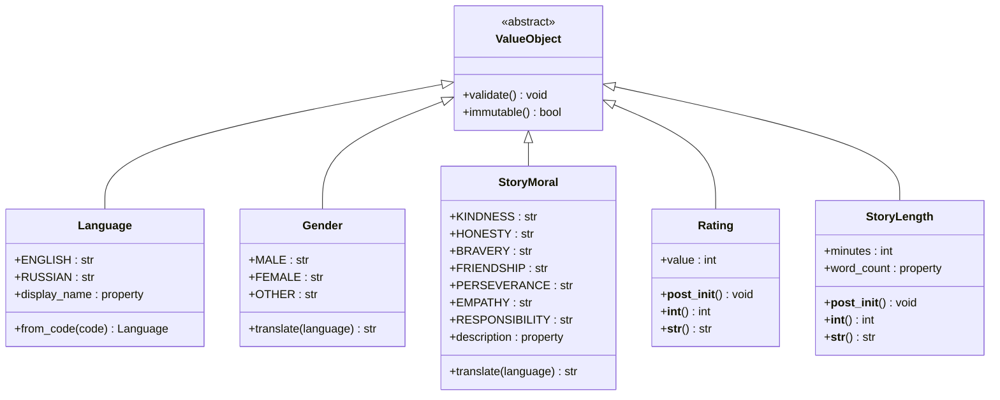
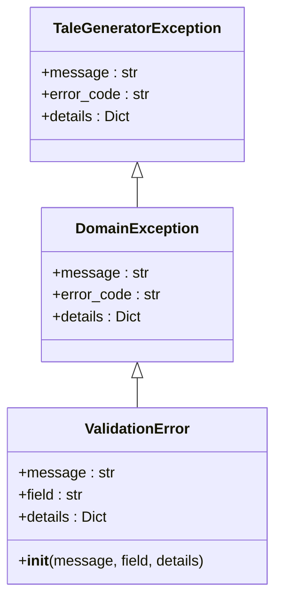

# Value Objects

<cite>
**Referenced Files in This Document**
- [src/domain/value_objects.py](file://src/domain/value_objects.py)
- [src/application/dto.py](file://src/application/dto.py)
- [src/domain/entities.py](file://src/domain/entities.py)
- [src/core/constants.py](file://src/core/constants.py)
- [src/domain/services/prompt_service.py](file://src/domain/services/prompt_service.py)
- [src/core/exceptions.py](file://src/core/exceptions.py)
- [test_language_support.py](file://test_language_support.py)
- [test_rating.py](file://test_rating.py)
- [test_language_api.py](file://test_language_api.py)
</cite>

## Table of Contents
1. [Introduction](#introduction)
2. [Value Object Architecture](#value-object-architecture)
3. [Language Value Object](#language-value-object)
4. [Gender Value Object](#gender-value-object)
5. [StoryMoral Value Object](#storymoral-value-object)
6. [Rating Value Object](#rating-value-object)
7. [StoryLength Value Object](#storylength-value-object)
8. [Validation and Error Handling](#validation-and-error-handling)
9. [Usage Patterns and Examples](#usage-patterns-and-examples)
10. [Best Practices and Extension Guidelines](#best-practices-and-extension-guidelines)
11. [Common Issues and Troubleshooting](#common-issues-and-troubleshooting)

## Introduction

The Tale Generator domain layer implements a comprehensive set of value objects that enforce business rules and maintain data integrity through immutable, validated types. These value objects serve as the foundation for type-safe operations throughout the application, ensuring that all data conforms to predefined business constraints and validation rules.

Value objects in this system provide several key benefits:
- **Immutability**: Once created, value objects cannot be modified, ensuring data consistency
- **Validation**: Automatic validation at creation time prevents invalid data from entering the system
- **Type Safety**: Strong typing prevents runtime errors and improves code reliability
- **Business Rules**: Embedded business logic ensures consistent enforcement of domain constraints
- **Translation Capabilities**: Built-in localization support for internationalization

## Value Object Architecture

The value object system follows a consistent architectural pattern across all types:



**Diagram sources**
- [src/domain/value_objects.py](file://src/domain/value_objects.py#L10-L189)

Each value object implements the following common patterns:
- **Immutable Design**: Uses `@dataclass(frozen=True)` for immutability
- **Post-Initialization Validation**: Implements `__post_init__()` for constraint checking
- **Type-Safe Construction**: Provides factory methods for controlled instantiation
- **String Representation**: Implements `__str__()` for readable output
- **Conversion Methods**: Provides `__int__()` for numeric conversion when appropriate

**Section sources**
- [src/domain/value_objects.py](file://src/domain/value_objects.py#L10-L189)

## Language Value Object

The `Language` value object represents supported languages for story generation and provides comprehensive internationalization capabilities.

### Supported Languages

The Language value object supports two primary languages:

| Language | Code | Display Name |
|----------|------|--------------|
| English | `en` | English |
| Russian | `ru` | Russian |

### Implementation Details

The Language value object extends `StrEnum` and provides the following features:

#### Factory Method
- **`from_code(code: str)`**: Creates a Language instance from a language code string
- Validates the code against supported values
- Raises `ValidationError` for invalid codes
- Automatically converts to lowercase for case-insensitive matching

#### Display Properties
- **`display_name`**: Returns human-readable language names
- Supports localization through the internal translation dictionary

#### Validation Behavior
The Language value object enforces strict validation during creation:

```python
# Valid creation
language = Language.from_code("en")  # Creates Language.ENGLISH
language = Language.from_code("RU")  # Creates Language.ENGLISH (case insensitive)

# Invalid creation raises ValidationError
try:
    invalid_lang = Language.from_code("fr")
except ValidationError as e:
    # Error message: "Invalid language code: fr"
    # Details: {"supported": ["en", "ru"]}
```

### Translation Capabilities

The Language value object integrates seamlessly with other value objects that require language-specific translations, particularly the Gender and StoryMoral value objects.

**Section sources**
- [src/domain/value_objects.py](file://src/domain/value_objects.py#L10-L44)

## Gender Value Object

The `Gender` value object represents gender options for child profiles and provides language-specific translation capabilities.

### Enumeration Values

The Gender value object defines three primary gender categories:

| Gender Value | Description |
|--------------|-------------|
| `MALE` | Male gender identity |
| `FEMALE` | Female gender identity |
| `OTHER` | Non-binary or unspecified gender |

### Translation System

The Gender value object implements sophisticated translation capabilities through the `translate()` method:

#### Translation Dictionary Structure
The translation system uses a nested dictionary structure organized by target language:

```python
translations: Dict[Language, Dict[str, str]] = {
    Language.RUSSIAN: {
        "male": "мальчик",
        "female": "девочка", 
        "other": "ребенок"
    },
    Language.ENGLISH: {
        "male": "male",
        "female": "female",
        "other": "other"
    }
}
```

#### Translation Behavior
- **Language-Specific Output**: Returns appropriate gender terms for the target language
- **Fallback Mechanism**: Returns original value if translation is unavailable
- **Case Preservation**: Maintains the original case of the gender value

#### Usage Examples

```python
# English to Russian translation
gender = Gender.MALE
russian_term = gender.translate(Language.RUSSIAN)  # Returns "мальчик"

# Russian to English translation  
gender = Gender.FEMALE
english_term = gender.translate(Language.ENGLISH)  # Returns "female"

# Fallback for unsupported translations
unknown_gender = Gender.OTHER
fallback = unknown_gender.translate(Language.RUSSIAN)  # Returns "ребенок"
```

### Integration with Prompts

The Gender value object plays a crucial role in story generation prompts, automatically translating gender terms to match the target language of the story.

**Section sources**
- [src/domain/value_objects.py](file://src/domain/value_objects.py#L46-L74)

## StoryMoral Value Object

The `StoryMoral` value object encapsulates predefined moral values for stories and provides comprehensive descriptions and translation capabilities.

### Supported Moral Values

The StoryMoral value object defines eight fundamental moral values, each with associated descriptions:

| Moral Value | Description |
|-------------|-------------|
| `KINDNESS` | Teaching kindness and compassion |
| `HONESTY` | Emphasizing truthfulness and integrity |
| `BRAVERY` | Encouraging courage and facing fears |
| `FRIENDSHIP` | Celebrating friendship and loyalty |
| `PERSEVERANCE` | Promoting determination and persistence |
| `EMPATHY` | Developing understanding and compassion |
| `RESPONSIBILITY` | Teaching accountability and duty |
| `RESPECT` | Fostering respect for others |

### Implementation Features

#### Descriptive Properties
- **`description`**: Provides a human-readable description of each moral value
- Used for educational purposes and user interface displays

#### Translation System
Similar to the Gender value object, StoryMoral implements comprehensive translation capabilities:

```python
# Translation dictionary structure
translations: Dict[Language, Dict[str, str]] = {
    Language.RUSSIAN: {
        "kindness": "доброта",
        "honesty": "честность",
        "bravery": "храбрость",
        "friendship": "дружба",
        "perseverance": "настойчивость",
        "empathy": "сочувствие",
        "respect": "уважение",
        "responsibility": "ответственность"
    },
    Language.ENGLISH: {
        "kindness": "kindness",
        "honesty": "honesty",
        "bravery": "bravery",
        "friendship": "friendship",
        "perseverance": "perseverance",
        "empathy": "empathy",
        "respect": "respect",
        "responsibility": "responsibility"
    }
}
```

#### Usage Patterns
The StoryMoral value object is used extensively in story generation to:
- Define the central theme and educational focus of stories
- Guide AI prompt generation for consistent moral messaging
- Support multilingual story creation with culturally appropriate moral values

**Section sources**
- [src/domain/value_objects.py](file://src/domain/value_objects.py#L76-L134)

## Rating Value Object

The `Rating` value object represents story ratings with strict validation constraints and immutability guarantees.

### Validation Constraints

The Rating value object enforces the following business rules:

| Constraint | Value | Description |
|------------|-------|-------------|
| Minimum Value | 1 | Lowest possible rating |
| Maximum Value | 10 | Highest possible rating |
| Range | 1-10 | Integer values only |

### Implementation Details

#### Immutable Design
- Uses `@dataclass(frozen=True)` for immutability
- Prevents modification after creation
- Ensures data consistency across the application

#### Post-Initialization Validation
The Rating value object implements comprehensive validation in the `__post_init__()` method:

```python
def __post_init__(self):
    if not MIN_RATING <= self.value <= MAX_RATING:
        raise ValidationError(
            f"Rating must be between {MIN_RATING} and {MAX_RATING}",
            field="rating",
            details={"value": self.value, "min": MIN_RATING, "max": MAX_RATING}
        )
```

#### Conversion Methods
- **`__int__()`**: Converts the rating to an integer value
- **`__str__()`**: Provides a formatted string representation (e.g., "7/10")

#### Usage Examples

```python
# Valid rating creation
valid_rating = Rating(value=8)  # Creates a valid rating
print(valid_rating)  # Outputs: "8/10"

# Invalid rating raises ValidationError
try:
    invalid_rating = Rating(value=15)
except ValidationError as e:
    # Error message: "Rating must be between 1 and 10"
```

### Integration with Story Entities

The Rating value object is integrated with the Story entity to track user feedback and story quality metrics.

**Section sources**
- [src/domain/value_objects.py](file://src/domain/value_objects.py#L136-L157)

## StoryLength Value Object

The `StoryLength` value object manages story duration and calculates approximate word counts based on reading speed.

### Configuration Constants

The StoryLength value object relies on the following configuration constants:

| Constant | Value | Description |
|----------|-------|-------------|
| `READING_SPEED_WPM` | 150 | Words per minute reading speed |
| Minimum Length | 1 minute | Smallest valid story duration |
| Maximum Length | Unlimited | No upper bound enforced |

### Word Count Calculation

The StoryLength value object calculates approximate word counts using the formula:
```
word_count = minutes × READING_SPEED_WPM
```

Where `READING_SPEED_WPM` is configured as 150 words per minute.

### Implementation Features

#### Validation Behavior
- Validates that story length is positive (> 0)
- Raises `ValidationError` for invalid durations
- Supports any positive integer value

#### Property Methods
- **`word_count`**: Calculates approximate word count based on reading speed
- **`__int__()`**: Converts to integer minutes
- **`__str__()`**: Provides formatted string with both minutes and word count

#### Usage Examples

```python
# Create a 5-minute story
story_length = StoryLength(minutes=5)
print(story_length)  # Outputs: "5 minutes (~750 words)"

# Access calculated word count
word_count = story_length.word_count  # Returns 750

# Convert to minutes
minutes = int(story_length)  # Returns 5
```

### Integration with Story Generation

The StoryLength value object is used throughout the story generation pipeline to:
- Determine story complexity and narrative depth
- Calculate appropriate story lengths for different age groups
- Guide AI prompt generation for content estimation

**Section sources**
- [src/domain/value_objects.py](file://src/domain/value_objects.py#L159-L189)
- [src/core/constants.py](file://src/core/constants.py#L10-L16)

## Validation and Error Handling

The value object system implements comprehensive validation and error handling through a centralized exception framework.

### Exception Hierarchy



**Diagram sources**
- [src/core/exceptions.py](file://src/core/exceptions.py#L36-L66)

### Validation Patterns

#### Language Validation
```python
try:
    language = Language.from_code("invalid")
except ValidationError as e:
    # Error details: {"supported": ["en", "ru"]}
```

#### Rating Validation
```python
try:
    rating = Rating(value=0)
except ValidationError as e:
    # Error details: {"value": 0, "min": 1, "max": 10}
```

#### StoryLength Validation
```python
try:
    length = StoryLength(minutes=-5)
except ValidationError as e:
    # Error details: {"value": -5}
```

### Error Handling Best Practices

1. **Field-Specific Validation**: Each value object specifies the field causing the error
2. **Contextual Details**: Provides additional context for debugging
3. **Consistent Error Format**: Standardized error structure across all value objects
4. **Graceful Degradation**: Validation failures prevent invalid state creation

**Section sources**
- [src/core/exceptions.py](file://src/core/exceptions.py#L36-L66)
- [src/domain/value_objects.py](file://src/domain/value_objects.py#L37-L43)

## Usage Patterns and Examples

### Basic Value Object Creation

#### Language and Gender Usage
```python
# Creating Language instances
english = Language.ENGLISH
russian = Language.RUSSIAN

# Using factory method
try:
    french = Language.from_code("fr")  # Raises ValidationError
except ValidationError:
    pass

# Gender translation
child_gender = Gender.FEMALE
translated_gender = child_gender.translate(Language.RUSSIAN)  # "девочка"
```

#### StoryMoral and Rating Usage
```python
# Creating moral values
moral = StoryMoral.KINDNESS
print(moral.description)  # "Teaching kindness and compassion"

# Translating morals
moral_ru = moral.translate(Language.RUSSIAN)  # "доброта"

# Creating ratings
rating = Rating(value=9)
print(rating)  # "9/10"
```

#### StoryLength Usage
```python
# Creating story lengths
short_story = StoryLength(minutes=3)
medium_story = StoryLength(minutes=10)
long_story = StoryLength(minutes=20)

print(short_story.word_count)  # 450 words
print(medium_story)  # "10 minutes (~1500 words)"
```

### Integration with DTOs and Entities

#### StoryRequestDTO Usage
```python
from src.application.dto import StoryRequestDTO, ChildProfileDTO
from src.domain.value_objects import Language, Gender, StoryMoral

# Create a story request with value objects
request = StoryRequestDTO(
    child=ChildProfileDTO(
        name="Emma",
        age=7,
        gender=Gender.FEMALE,
        interests=["unicorns", "fairies", "princesses"]
    ),
    moral=StoryMoral.KINDNESS,
    language=Language.ENGLISH,
    story_length=5,
    generate_audio=False
)
```

#### Entity Integration
```python
from src.domain.entities import Story, Child, AudioFile
from src.domain.value_objects import Rating, StoryLength

# Create a story with value objects
story = Story(
    title="Emma's Magical Adventure",
    content="Once upon a time...",
    moral="kindness",
    language=Language.ENGLISH,
    story_length=StoryLength(minutes=5),
    rating=Rating(value=8)
)

# Rate the story
story.rate(9)  # Creates a new Rating value object
```

### Prompt Generation Integration

#### Language-Specific Prompts
```python
from src.domain.services.prompt_service import PromptService
from src.domain.entities import Child

prompt_service = PromptService()

# Generate English prompt
english_prompt = prompt_service.generate_child_prompt(
    child=child_entity,
    moral="kindness",
    language=Language.ENGLISH,
    story_length=StoryLength(minutes=5)
)

# Generate Russian prompt
russian_prompt = prompt_service.generate_child_prompt(
    child=child_entity,
    moral="kindness",
    language=Language.RUSSIAN,
    story_length=StoryLength(minutes=5)
)
```

**Section sources**
- [src/application/dto.py](file://src/application/dto.py#L18-L49)
- [src/domain/entities.py](file://src/domain/entities.py#L115-L157)
- [src/domain/services/prompt_service.py](file://src/domain/services/prompt_service.py#L14-L61)

## Best Practices and Extension Guidelines

### Creating New Value Objects

When extending the value object system with new types, follow these established patterns:

#### 1. Inherit from Appropriate Base Classes
```python
@dataclass(frozen=True)
class NewValueObject:
    value: Any
    
    def __post_init__(self):
        # Validation logic here
        if not self.is_valid():
            raise ValidationError("Invalid value", field="new_field")
    
    def is_valid(self) -> bool:
        # Implement validation logic
        return True
```

#### 2. Implement Consistent Validation Patterns
- Use `__post_init__()` for constraint validation
- Raise `ValidationError` with descriptive messages
- Include field names and contextual details in error messages

#### 3. Add Translation Capabilities
For multilingual support, implement translation dictionaries:
```python
def translate(self, language: Language) -> str:
    translations = {
        Language.ENGLISH: {"key": "English value"},
        Language.RUSSIAN: {"key": "Russian value"}
    }
    return translations.get(language, {}).get(self.value, self.value)
```

#### 4. Provide String Representations
Implement `__str__()` and `__int__()` methods for consistent behavior:
```python
def __str__(self) -> str:
    return f"{self.value}"

def __int__(self) -> int:
    return self.value
```

### Extending Existing Value Objects

#### Adding New Languages
To add support for additional languages:

1. Update translation dictionaries in relevant value objects
2. Add language constants to the Language enum
3. Update validation logic to recognize new codes
4. Add corresponding test cases

#### Expanding Moral Values
To add new moral values:

1. Add new enum values to StoryMoral
2. Update descriptions and translations
3. Modify prompt generation logic to handle new values
4. Update validation and testing

### Performance Considerations

#### Immutable Design Benefits
- **Thread Safety**: Immutable value objects are inherently thread-safe
- **Memory Efficiency**: Reduced object copying and garbage collection
- **Cache-Friendly**: Stable memory layout for frequently accessed values

#### Validation Optimization
- Perform validation once during object creation
- Cache expensive calculations (e.g., word counts)
- Use efficient data structures for translations

### Testing Strategies

#### Unit Testing Value Objects
```python
def test_language_creation():
    # Test valid creation
    assert Language.from_code("en") == Language.ENGLISH
    
    # Test invalid creation
    with pytest.raises(ValidationError):
        Language.from_code("invalid")
```

#### Integration Testing
- Test value object usage in DTOs and entities
- Verify translation functionality across different contexts
- Validate error handling in various scenarios

**Section sources**
- [src/domain/value_objects.py](file://src/domain/value_objects.py#L10-L189)

## Common Issues and Troubleshooting

### Invalid Value Assignment

#### Problem: Attempting to Modify Immutable Value Objects
```python
# ❌ Incorrect - trying to modify immutable value
rating = Rating(value=8)
rating.value = 9  # Raises AttributeError
```

#### Solution: Create New Instances Instead
```python
# ✅ Correct - create new value object
new_rating = Rating(value=9)
```

### Language Code Validation Failures

#### Problem: Unsupported Language Codes
```python
# ❌ Incorrect - using unsupported language code
try:
    language = Language.from_code("de")  # German not supported
except ValidationError as e:
    print(e.details)  # {"supported": ["en", "ru"]}
```

#### Solution: Use Supported Language Codes
```python
# ✅ Correct - use supported language codes
language = Language.from_code("en")  # English
language = Language.from_code("ru")  # Russian
```

### Rating Validation Issues

#### Problem: Out-of-Range Ratings
```python
# ❌ Incorrect - rating outside valid range
try:
    rating = Rating(value=15)  # Too high
except ValidationError as e:
    print(e.message)  # "Rating must be between 1 and 10"
```

#### Solution: Use Valid Rating Range
```python
# ✅ Correct - use valid rating range
rating = Rating(value=7)  # Valid rating
```

### StoryLength Validation Problems

#### Problem: Negative or Zero Story Lengths
```python
# ❌ Incorrect - negative story length
try:
    length = StoryLength(minutes=-5)
except ValidationError as e:
    print(e.message)  # "Story length must be positive"
```

#### Solution: Use Positive Values Only
```python
# ✅ Correct - use positive story lengths
length = StoryLength(minutes=10)  # Valid length
```

### Translation Failures

#### Problem: Missing Translations
```python
# ❌ Incorrect - accessing unsupported translation
gender = Gender.OTHER
translation = gender.translate(Language.RUSSIAN)  # May return fallback
```

#### Solution: Handle Fallback Cases Gracefully
```python
# ✅ Correct - handle potential fallbacks
translation = gender.translate(Language.RUSSIAN)
if translation == gender.value:
    # Handle missing translation case
    translation = "Unknown"
```

### Integration Issues

#### Problem: Mixing Different Value Object Types
```python
# ❌ Incorrect - mixing incompatible types
story_length = StoryLength(minutes=5)
rating = Rating(value=8)
combined = story_length + rating  # TypeError
```

#### Solution: Use Appropriate Composition
```python
# ✅ Correct - compose related value objects
class StoryConfig:
    def __init__(self, story_length: StoryLength, rating: Rating):
        self.story_length = story_length
        self.rating = rating
```

### Debugging Tips

#### Enable Detailed Error Messages
```python
# Configure logging for detailed validation errors
import logging
logging.basicConfig(level=logging.DEBUG)
```

#### Use Type Checking
```python
from typing import Any

def validate_value_object(obj: Any, expected_type: type) -> bool:
    return isinstance(obj, expected_type)
```

#### Test Edge Cases
- Boundary values (minimum/maximum ratings)
- Empty or null inputs
- Internationalization edge cases
- Performance under load

**Section sources**
- [src/domain/value_objects.py](file://src/domain/value_objects.py#L37-L43)
- [src/core/exceptions.py](file://src/core/exceptions.py#L41-L66)