# Configuration Management

<cite>
**Referenced Files in This Document**
- [settings.py](file://src/infrastructure/config/settings.py)
- [logging_config.py](file://src/infrastructure/config/logging_config.py)
- [constants.py](file://src/core/constants.py)
- [main.py](file://main.py)
- [logging.py](file://src/core/logging.py)
- [voice_service.py](file://src/voice_providers/voice_service.py)
- [story_service.py](file://src/domain/services/story_service.py)
- [test_logging.py](file://test_logging.py)
- [logging_config.py](file://src/logging_config.py)
</cite>

## Table of Contents
1. [Introduction](#introduction)
2. [System Architecture](#system-architecture)
3. [Pydantic Settings Classes](#pydantic-settings-classes)
4. [Configuration Composition](#configuration-composition)
5. [Singleton Pattern Implementation](#singleton-pattern-implementation)
6. [Type Safety and Validation](#type-safety-and-validation)
7. [Environment-Specific Configuration](#environment-specific-configuration)
8. [Logging Configuration System](#logging-configuration-system)
9. [Secret Management](#secret-management)
10. [Common Issues and Troubleshooting](#common-issues-and-troubleshooting)
11. [Testing Considerations](#testing-considerations)
12. [Best Practices](#best-practices)

## Introduction

The Tale Generator application employs a sophisticated configuration management system built around Pydantic Settings classes, providing structured, type-safe, and environment-aware configuration management. This system enables seamless deployment across different environments while maintaining strict validation and clear separation of concerns.

The configuration architecture follows a hierarchical composition pattern where individual service configurations (Database, AI Service, Voice Service, Application, Logging) are encapsulated within a central Settings class. This design ensures type safety, validation, and easy maintenance while supporting environment-specific overrides and secret management.

## System Architecture

The configuration management system consists of several interconnected components that work together to provide comprehensive application configuration:

```mermaid
graph TB
subgraph "Configuration Layer"
Settings[Settings Class<br/>Central Configuration]
DatabaseSettings[DatabaseSettings<br/>Supabase Config]
AISettings[AIServiceSettings<br/>AI Service Config]
VoiceSettings[VoiceServiceSettings<br/>Voice Provider Config]
AppSettings[ApplicationSettings<br/>App Config]
LogSettings[LoggingSettings<br/>Logging Config]
end
subgraph "Runtime Layer"
Singleton[get_settings()<br/>Singleton Access]
Reset[reset_settings()<br/>Testing Reset]
end
subgraph "Integration Layer"
LoggingConfig[Logging Config<br/>setup_logging]
MainApp[Main Application<br/>create_app]
end
subgraph "External Dependencies"
EnvFile[.env File<br/>Environment Variables]
Constants[Constants Module<br/>Default Values]
end
Settings --> DatabaseSettings
Settings --> AISettings
Settings --> VoiceSettings
Settings --> AppSettings
Settings --> LogSettings
Singleton --> Settings
Reset --> Singleton
LoggingConfig --> LogSettings
MainApp --> Singleton
DatabaseSettings -.-> EnvFile
AISettings -.-> EnvFile
VoiceSettings -.-> EnvFile
AppSettings -.-> EnvFile
LogSettings -.-> EnvFile
DatabaseSettings -.-> Constants
AISettings -.-> Constants
VoiceSettings -.-> Constants
AppSettings -.-> Constants
LogSettings -.-> Constants
```

**Diagram sources**
- [settings.py](file://src/infrastructure/config/settings.py#L117-L168)
- [logging_config.py](file://src/infrastructure/config/logging_config.py#L1-L15)
- [main.py](file://main.py#L13-L14)

**Section sources**
- [settings.py](file://src/infrastructure/config/settings.py#L1-L169)
- [logging_config.py](file://src/infrastructure/config/logging_config.py#L1-L16)

## Pydantic Settings Classes

The configuration system is built around specialized Pydantic Settings classes, each responsible for managing a specific aspect of the application's configuration. These classes leverage Pydantic's powerful validation and type conversion capabilities.

### DatabaseSettings

Manages database connectivity and configuration:

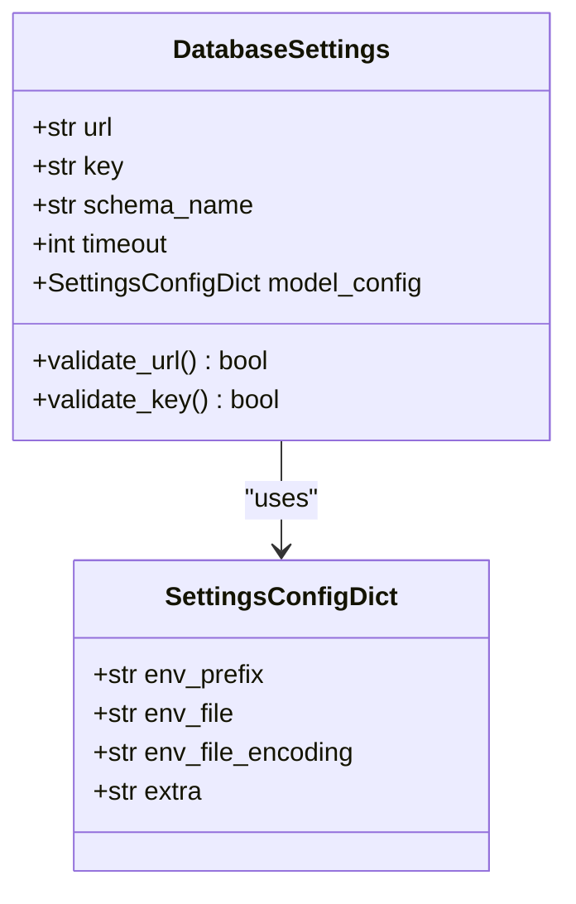

**Diagram sources**
- [settings.py](file://src/infrastructure/config/settings/settings.py#L16-L29)

### AIServiceSettings

Handles AI service configuration with OpenRouter integration:

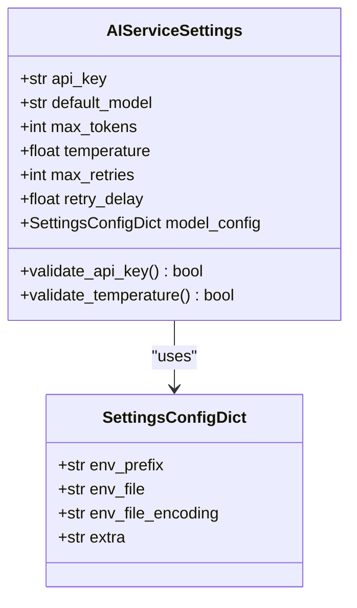

**Diagram sources**
- [settings.py](file://src/infrastructure/config/settings/settings.py#L32-L62)

### VoiceServiceSettings

Controls voice generation service configuration:

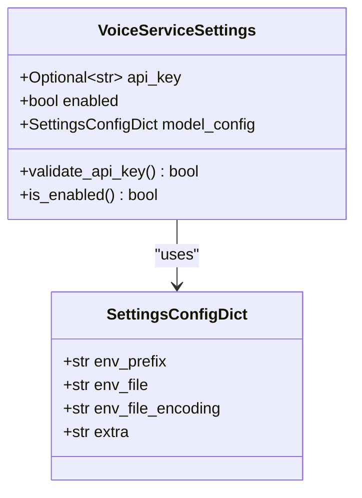

**Diagram sources**
- [settings.py](file://src/infrastructure/config/settings/settings.py#L65-L77)

### ApplicationSettings

Manages application-wide settings:

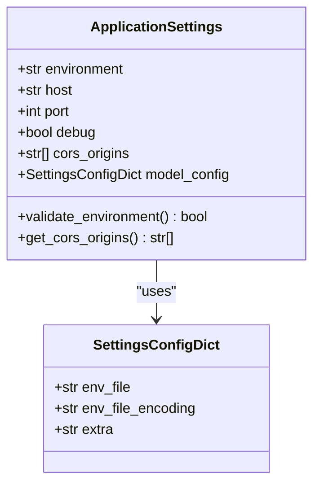

**Diagram sources**
- [settings.py](file://src/infrastructure/config/settings/settings.py#L79-L96)

### LoggingSettings

Provides comprehensive logging configuration:

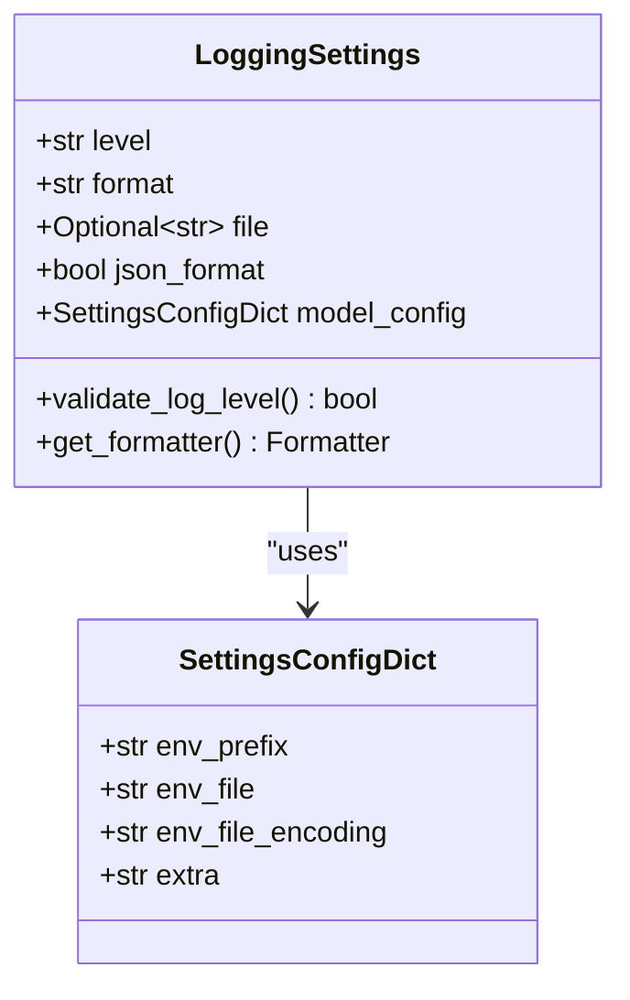

**Diagram sources**
- [settings.py](file://src/infrastructure/config/settings/settings.py#L98-L115)

**Section sources**
- [settings.py](file://src/infrastructure/config/settings/settings.py#L16-L115)
- [constants.py](file://src/core/constants.py#L1-L38)

## Configuration Composition

The Settings class serves as the central composition point, aggregating all individual configuration domains into a cohesive configuration object:

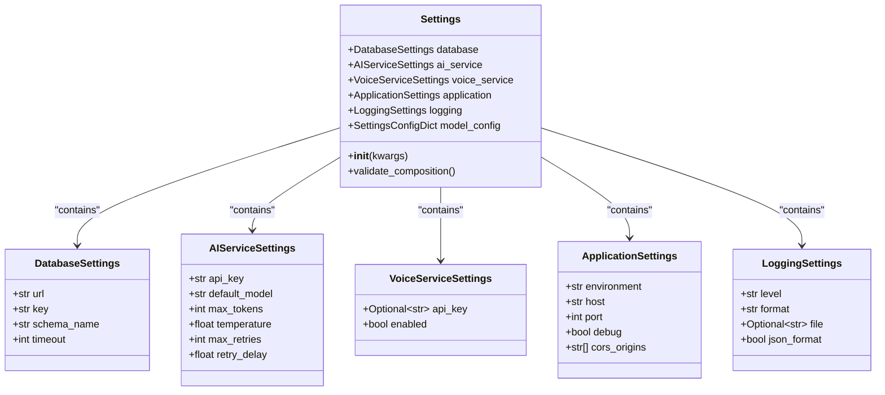

**Diagram sources**
- [settings.py](file://src/infrastructure/config/settings/settings.py#L117-L147)

The composition pattern ensures that each configuration domain remains focused and manageable while providing a unified interface for accessing all configuration values. The Settings class automatically initializes each component using factory functions, ensuring proper validation and default value application.

**Section sources**
- [settings.py](file://src/infrastructure/config/settings/settings.py#L117-L147)

## Singleton Pattern Implementation

The configuration system implements a thread-safe singleton pattern through the `get_settings()` function, ensuring that configuration is loaded once and shared throughout the application:

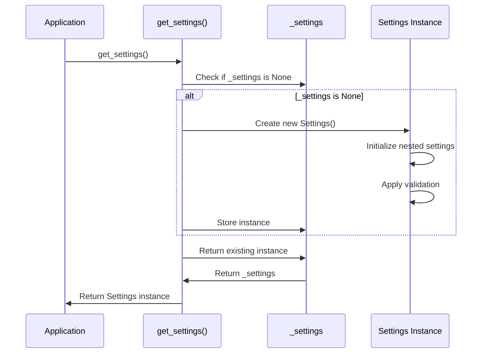

**Diagram sources**
- [settings.py](file://src/infrastructure/config/settings/settings.py#L153-L162)

The singleton pattern provides several benefits:
- **Memory Efficiency**: Configuration is loaded only once
- **Consistency**: All parts of the application access the same configuration
- **Performance**: Eliminates repeated parsing and validation overhead
- **Thread Safety**: Global variable ensures consistent state across threads

The `reset_settings()` function provides a mechanism for testing by allowing the singleton to be cleared and reinitialized, enabling clean test environments.

**Section sources**
- [settings.py](file://src/infrastructure/config/settings/settings.py#L149-L168)

## Type Safety and Validation

The configuration system leverages Pydantic's robust type validation and constraint mechanisms to ensure configuration integrity:

### Field Constraints and Defaults

Each configuration field uses Pydantic's Field function to define:
- **Required vs Optional**: Fields marked with `...` are required
- **Default Values**: Safe defaults prevent undefined behavior
- **Type Validation**: Automatic type conversion and validation
- **Custom Descriptions**: Clear documentation for each setting

### Environment Variable Binding

The `env_prefix` configuration allows for organized environment variable management:

| Setting Class | Environment Prefix | Example Variables |
|---------------|-------------------|-------------------|
| DatabaseSettings | SUPABASE_ | `SUPABASE_URL`, `SUPABASE_KEY` |
| AIServiceSettings | OPENROUTER_ | `OPENROUTER_API_KEY` |
| VoiceServiceSettings | ELEVENLABS_ | `ELEVENLABS_API_KEY` |
| LoggingSettings | LOG_ | `LOG_LEVEL`, `LOG_FORMAT` |

### Validation Pipeline

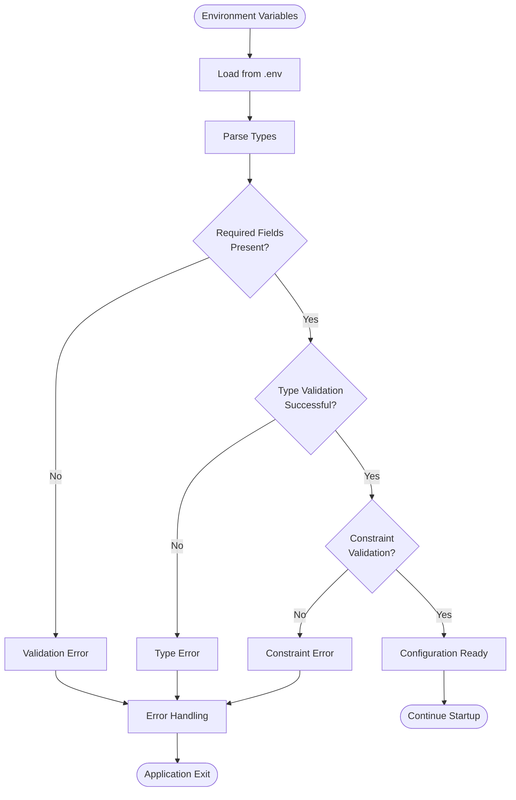

**Diagram sources**
- [settings.py](file://src/infrastructure/config/settings/settings.py#L133-L147)

**Section sources**
- [settings.py](file://src/infrastructure/config/settings/settings.py#L16-L115)
- [constants.py](file://src/core/constants.py#L1-L38)

## Environment-Specific Configuration

The configuration system supports environment-specific behavior through the `environment` setting, which influences various aspects of application behavior:

### Environment Impact Matrix

| Environment | Behavior Changes | Configuration Impact |
|-------------|------------------|---------------------|
| development | Debug mode enabled, relaxed validation | Enhanced logging, detailed error messages |
| staging | Production-like behavior with monitoring | Standard validation, production logging |
| production | Strict validation, minimal logging | Optimized performance, security-focused |

### Environment Detection

The system automatically detects the environment through the `environment` field, which can be overridden via environment variables:

```bash
# Environment-specific configuration
export ENVIRONMENT=production
export DEBUG=false
export LOG_LEVEL=WARNING
```

### Configuration Overrides

Environment-specific settings can be managed through:
- **Environment Variables**: Direct runtime overrides
- **.env Files**: Development and deployment configurations
- **Command Line Arguments**: Runtime parameterization
- **Configuration Files**: Structured overrides

**Section sources**
- [settings.py](file://src/infrastructure/config/settings/settings.py#L88-L96)

## Logging Configuration System

The logging system integrates seamlessly with the configuration management, providing flexible and configurable logging behavior:

### Logging Architecture

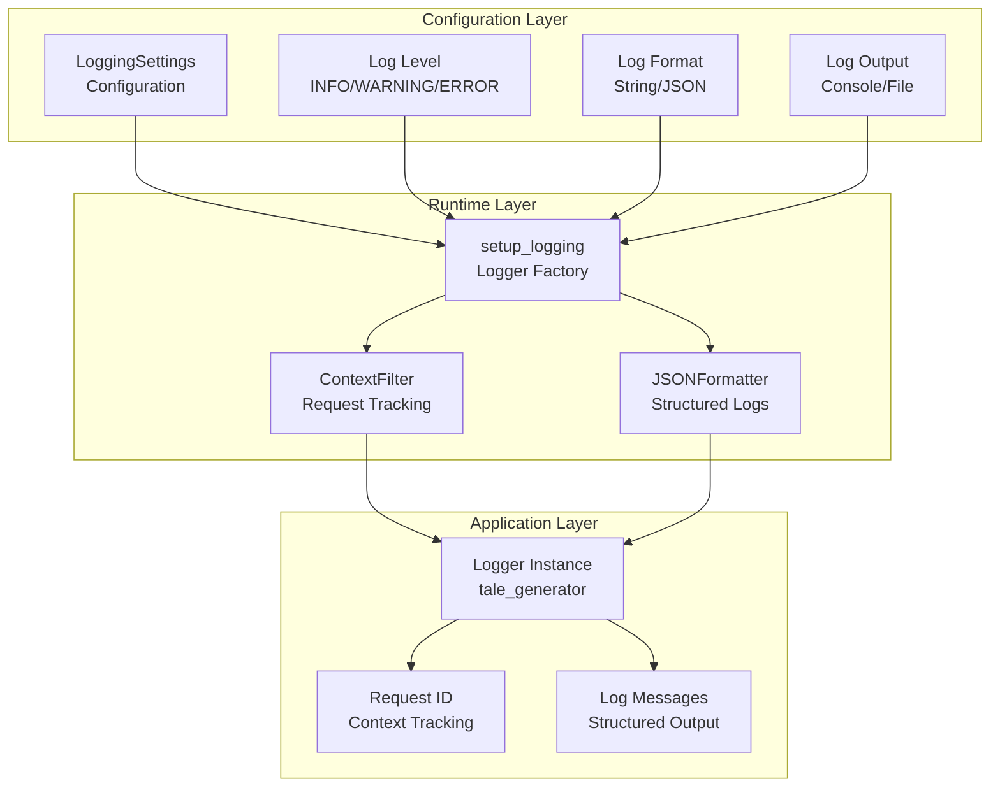

**Diagram sources**
- [logging_config.py](file://src/infrastructure/config/logging_config.py#L7-L15)
- [logging.py](file://src/core/logging.py#L62-L120)

### Context-Aware Logging

The logging system includes advanced context tracking capabilities:

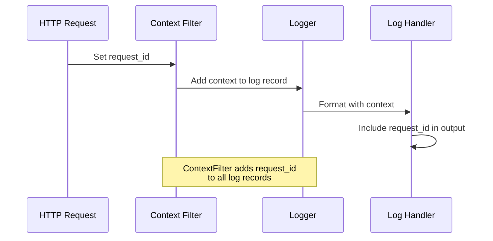

**Diagram sources**
- [logging.py](file://src/core/logging.py#L14-L28)

### JSON Logging Support

The system supports structured JSON logging for modern observability platforms:

| Feature | Configuration | Output Format |
|---------|---------------|---------------|
| JSON Format | `json_format: true` | `{ "timestamp": "...", "level": "...", "message": "..." }` |
| Context Fields | Automatic injection | Includes `request_id`, `logger`, `level` |
| Exception Details | Automatic capture | `exception` field with stack traces |
| Custom Metadata | Extra fields | User-defined log context |

**Section sources**
- [logging_config.py](file://src/infrastructure/config/logging_config.py#L1-L16)
- [logging.py](file://src/core/logging.py#L1-L180)

## Secret Management

The configuration system provides secure handling of sensitive information through environment variable binding and proper secret management practices:

### Secret Categories

| Category | Example Secrets | Security Level | Management Method |
|----------|----------------|----------------|-------------------|
| API Keys | OpenRouter API, ElevenLabs API | High | Environment Variables |
| Database Credentials | Supabase URL, Key | High | Encrypted Environment Variables |
| Service URLs | External API endpoints | Medium | Environment Variables |
| Feature Flags | Voice service enabled/disabled | Low | Environment Variables |

### Secret Protection Strategies

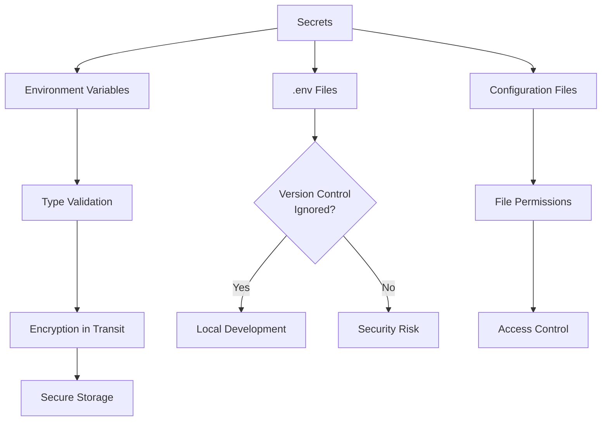

### Best Practices for Secret Management

1. **Never commit secrets to version control**
2. **Use environment-specific .env files**
3. **Implement proper file permissions**
4. **Rotate secrets regularly**
5. **Monitor access to secrets**
6. **Use secret management services in production**

**Section sources**
- [settings.py](file://src/infrastructure/config/settings/settings.py#L16-L77)

## Common Issues and Troubleshooting

### Missing Environment Variables

**Problem**: Application fails to start due to missing required configuration.

**Symptoms**:
- Pydantic validation errors during startup
- Application crashes with configuration exceptions
- Missing API keys or database credentials

**Solution**:
1. Verify `.env` file exists in project root
2. Check environment variable names match prefixes
3. Ensure required fields are populated
4. Use default values for optional fields

### Type Conversion Errors

**Problem**: Environment variables cannot be converted to expected types.

**Symptoms**:
- Integer fields expect strings
- Boolean fields fail to parse
- Float values cause precision issues

**Solution**:
1. Ensure environment variables match expected types
2. Use proper string formatting for complex types
3. Validate type conversion in development
4. Provide clear error messages for type mismatches

### Configuration Loading Order

**Problem**: Configuration values not applying correctly.

**Symptoms**:
- Default values overriding environment variables
- Configuration changes not taking effect
- Unexpected behavior in different environments

**Solution**:
1. Understand Pydantic's configuration precedence
2. Use `reset_settings()` for testing
3. Verify environment variable loading order
4. Check for conflicting configuration sources

### Testing Configuration Issues

**Problem**: Tests fail due to configuration state.

**Solution**:
- Use `reset_settings()` between tests
- Mock configuration for isolated testing
- Use separate test configuration files
- Clear global state in test teardown

**Section sources**
- [settings.py](file://src/infrastructure/config/settings/settings.py#L165-L168)

## Testing Considerations

The configuration system provides several mechanisms for effective testing:

### Test Configuration Patterns

```mermaid
flowchart TD
TestSuite[Test Suite] --> Isolation[Configuration Isolation]
Isolation --> Reset[reset_settings()]
Reset --> MockConfig[Mock Configuration]
MockConfig --> TestExecution[Test Execution]
TestSuite --> Environment[Environment Testing]
Environment --> DevConfig[Development Config]
Environment --> ProdConfig[Production Config]
Environment --> TestConfig[Test Config]
TestSuite --> Validation[Configuration Validation]
Validation --> UnitTests[Unit Tests]
Validation --> IntegrationTests[Integration Tests]
```

### Testing Utilities

The system provides dedicated utilities for testing:

| Function | Purpose | Usage Pattern |
|----------|---------|---------------|
| `reset_settings()` | Clear singleton state | Test teardown |
| Environment isolation | Separate test configs | Different test suites |
| Mock configuration | Override specific values | Unit test fixtures |
| Validation testing | Test configuration constraints | Configuration tests |

### Testing Best Practices

1. **Always reset configuration between tests**
2. **Use separate configuration for each test suite**
3. **Mock external dependencies in configuration tests**
4. **Test configuration validation thoroughly**
5. **Verify environment-specific behavior**

**Section sources**
- [settings.py](file://src/infrastructure/config/settings/settings.py#L165-L168)
- [test_logging.py](file://test_logging.py#L1-L32)

## Best Practices

### Configuration Design Principles

1. **Single Responsibility**: Each Settings class handles one domain
2. **Composition Over Inheritance**: Use nested classes for organization
3. **Fail Fast**: Validate configuration early in application startup
4. **Clear Separation**: Different prefixes for different services
5. **Environment Awareness**: Support multiple deployment environments

### Development Guidelines

1. **Use Typed Fields**: Leverage Pydantic's type system
2. **Provide Defaults**: Never leave fields undefined
3. **Document Constraints**: Use Field descriptions effectively
4. **Validate Early**: Catch configuration issues before runtime
5. **Test Thoroughly**: Verify all configuration scenarios

### Deployment Considerations

1. **Environment Variables**: Use for all sensitive data
2. **Configuration Validation**: Validate in CI/CD pipeline
3. **Documentation**: Keep .env.example files updated
4. **Monitoring**: Log configuration loading for debugging
5. **Backup**: Maintain configuration backups

### Security Recommendations

1. **Secret Rotation**: Regularly update API keys and passwords
2. **Access Control**: Limit access to configuration files
3. **Audit Logging**: Track configuration changes
4. **Environment Isolation**: Separate configs for different environments
5. **Validation**: Verify all configuration inputs

The configuration management system in the Tale Generator application demonstrates enterprise-grade configuration handling with Pydantic, providing type safety, validation, and flexibility while maintaining simplicity and ease of use.