# ElevenLabs Client Implementation

<cite>
**Referenced Files in This Document**
- [elevenlabs_client.py](file://src/elevenlabs_client.py)
- [elevenlabs_provider.py](file://src/voice_providers/elevenlabs_provider.py)
- [voice_service.py](file://src/voice_providers/voice_service.py)
- [supabase_client.py](file://src/supabase_client.py)
- [routes.py](file://src/api/routes.py)
- [settings.py](file://src/infrastructure/config/settings.py)
- [value_objects.py](file://src/domain/value_objects.py)
- [generate_story.py](file://src/application/use_cases/generate_story.py)
- [populate_stories.py](file://populate_stories.py)
- [test_voice_providers.py](file://test_voice_providers.py)
</cite>

## Table of Contents
1. [Introduction](#introduction)
2. [Architecture Overview](#architecture-overview)
3. [ElevenLabsClient Class](#elevenlabsclient-class)
4. [ElevenLabsProvider Implementation](#elevenlabsprovider-implementation)
5. [Voice Selection Strategy](#voice-selection-strategy)
6. [Speech Generation Process](#speech-generation-process)
7. [Integration with Supabase](#integration-with-supabase)
8. [Configuration Management](#configuration-management)
9. [Error Handling and Fallback Mechanisms](#error-handling-and-fallback-mechanisms)
10. [Performance Optimization](#performance-optimization)
11. [Testing and Validation](#testing-and-validation)
12. [Common Issues and Solutions](#common-issues-and-solutions)

## Introduction

The ElevenLabs client implementation in the Tale Generator application provides a sophisticated text-to-speech solution for children's stories. It integrates with the ElevenLabs API to convert written narratives into high-quality audio, supporting multiple languages and offering configurable voice settings optimized for storytelling scenarios.

The implementation follows a layered architecture with clear separation of concerns, featuring lazy loading, caching mechanisms, and robust fallback strategies to ensure reliable audio generation across different languages and usage scenarios.

## Architecture Overview

The ElevenLabs integration consists of several interconnected components that work together to provide seamless text-to-speech functionality:

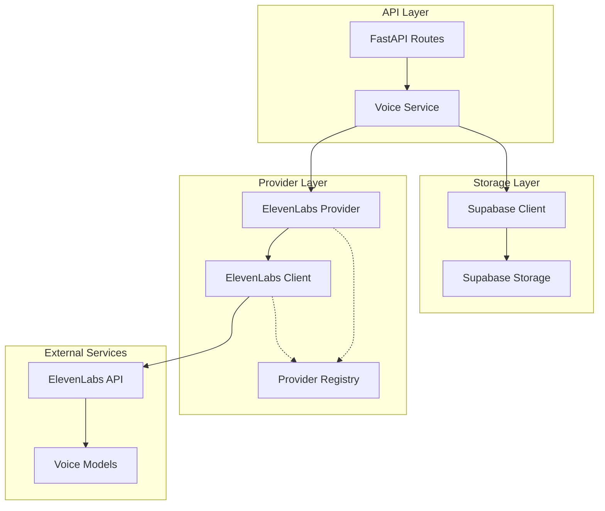

**Diagram sources**
- [routes.py](file://src/api/routes.py#L138-L170)
- [voice_service.py](file://src/voice_providers/voice_service.py#L25-L85)
- [elevenlabs_provider.py](file://src/voice_providers/elevenlabs_provider.py#L18-L60)

## ElevenLabsClient Class

The `ElevenLabsClient` serves as the foundational component for direct ElevenLabs API interactions, providing essential functionality for voice management and speech generation.

### Initialization and Authentication

The client initializes with comprehensive API key validation and environment configuration:

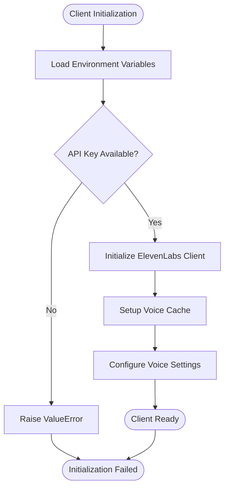

**Diagram sources**
- [elevenlabs_client.py](file://src/elevenlabs_client.py#L19-L42)

### Voice Settings Configuration

The client employs carefully tuned voice settings optimized for children's stories:

| Setting | Value | Purpose |
|---------|-------|---------|
| Stability | 0.5 | Balanced speech consistency |
| Similarity Boost | 0.75 | Enhanced voice resemblance |
| Style | 0.0 | Natural speaking style |
| Use Speaker Boost | True | Improved audio quality |

These settings ensure clear, engaging narration suitable for young audiences while maintaining consistent voice characteristics.

**Section sources**
- [elevenlabs_client.py](file://src/elevenlabs_client.py#L19-L42)

## ElevenLabsProvider Implementation

The `ElevenLabsProvider` extends the base provider interface, offering advanced features like lazy loading, comprehensive language support, and flexible voice configuration.

### Provider Metadata and Capabilities

The provider defines extensive capabilities and supported languages:

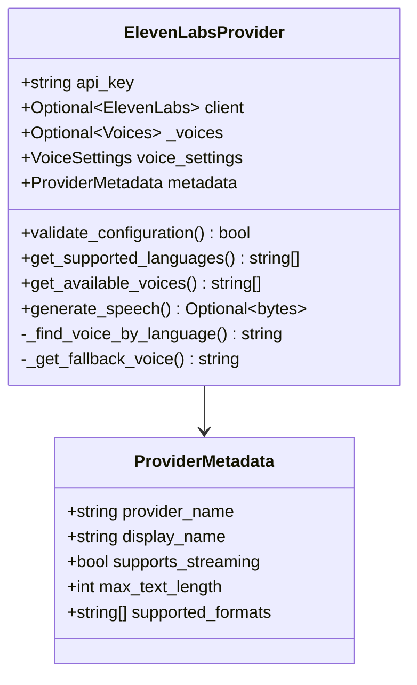

**Diagram sources**
- [elevenlabs_provider.py](file://src/voice_providers/elevenlabs_provider.py#L18-L47)

### Lazy Loading Architecture

The provider implements intelligent lazy loading to optimize resource usage:

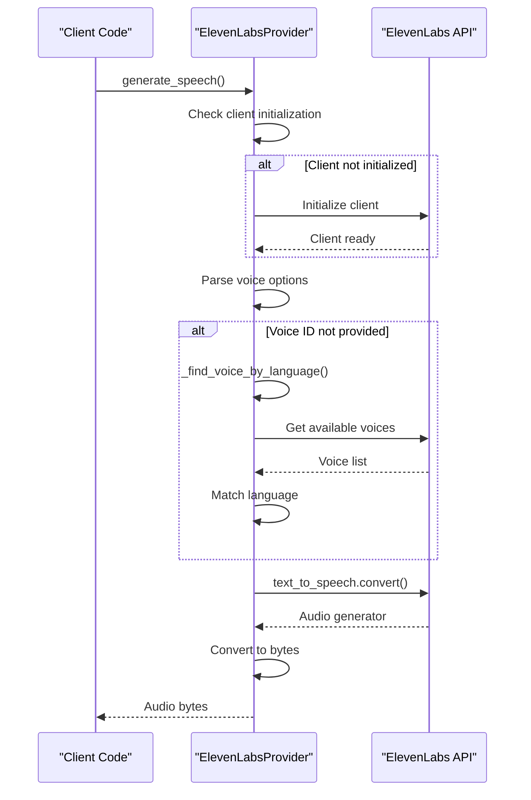

**Diagram sources**
- [elevenlabs_provider.py](file://src/voice_providers/elevenlabs_provider.py#L165-L220)

**Section sources**
- [elevenlabs_provider.py](file://src/voice_providers/elevenlabs_provider.py#L18-L220)

## Voice Selection Strategy

The voice selection mechanism employs a sophisticated multi-stage approach to find optimal voices for different languages and contexts.

### Language-Based Voice Matching

The `_find_voice_by_language` method implements a comprehensive search strategy:

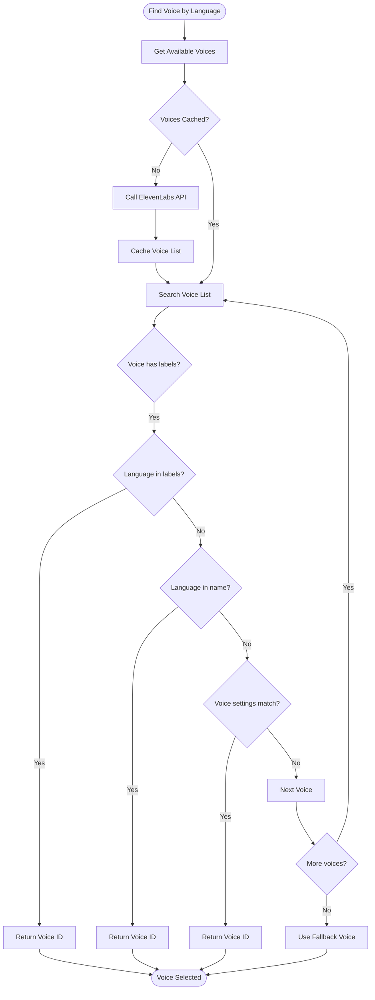

**Diagram sources**
- [elevenlabs_client.py](file://src/elevenlabs_client.py#L54-L85)
- [elevenlabs_provider.py](file://src/voice_providers/elevenlabs_provider.py#L128-L155)

### Fallback Mechanism

The system implements a robust fallback strategy using predefined voice mappings:

| Language | Voice ID | Purpose |
|----------|----------|---------|
| en | 21m00Tcm4TlvDq8ikWAM | Rachel - Clear and calm English voice |
| ru | 21m00Tcm4TlvDq8ikWAM | Rachel - Multilingual Russian support |

This ensures consistent audio quality across languages, particularly leveraging the multilingual capabilities of the eleven_multilingual_v2 model.

**Section sources**
- [elevenlabs_client.py](file://src/elevenlabs_client.py#L54-L96)
- [elevenlabs_provider.py](file://src/voice_providers/elevenlabs_provider.py#L128-L163)

## Speech Generation Process

The speech generation process transforms text into high-quality audio through a streamlined pipeline with comprehensive error handling.

### Text-to-Speech Pipeline

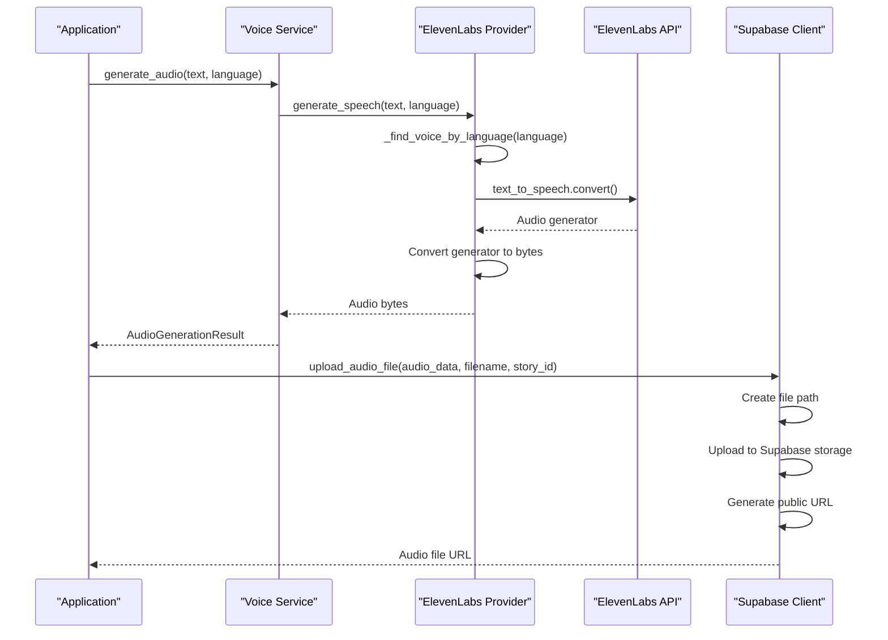

**Diagram sources**
- [voice_service.py](file://src/voice_providers/voice_service.py#L32-L113)
- [elevenlabs_provider.py](file://src/voice_providers/elevenlabs_provider.py#L165-L220)
- [supabase_client.py](file://src/supabase_client.py#L44-L81)

### Audio Data Processing

The system handles audio data as raw bytes, enabling efficient storage and transmission:

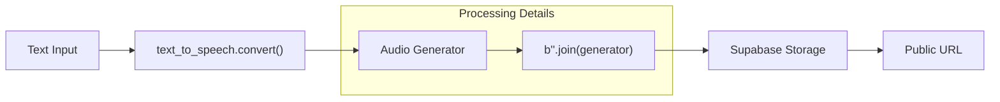

**Diagram sources**
- [elevenlabs_provider.py](file://src/voice_providers/elevenlabs_provider.py#L210-L213)

**Section sources**
- [elevenlabs_provider.py](file://src/voice_providers/elevenlabs_provider.py#L165-L220)
- [voice_service.py](file://src/voice_providers/voice_service.py#L32-L113)

## Integration with Supabase

The integration with Supabase provides robust audio storage and retrieval capabilities, ensuring persistent access to generated audio files.

### Audio Storage Architecture

```mermaid
graph TB
subgraph "Supabase Storage"
Bucket[tales Bucket]
Path[stories/{story_id}/{filename}]
PublicURL[Public Access URL]
end
subgraph "File Organization"
StoriesDir[stories/]
StoryID[story_id/]
AudioFiles[*.mp3]
end
AudioBytes[Audio Bytes] --> Bucket
Bucket --> Path
Path --> PublicURL
StoriesDir --> StoryID
StoryID --> AudioFiles
```

**Diagram sources**
- [supabase_client.py](file://src/supabase_client.py#L60-L73)

### Storage Operations

The Supabase client provides comprehensive audio file management:

| Operation | Method | Purpose |
|-----------|--------|---------|
| Upload | `upload_audio_file()` | Store audio bytes with metadata |
| Retrieve | `get_audio_file_url()` | Get public access URL |
| Organization | Directory structure | Logical file grouping |

The storage system uses a hierarchical structure (`stories/{story_id}/{filename}`) for efficient organization and retrieval.

**Section sources**
- [supabase_client.py](file://src/supabase_client.py#L44-L100)

## Configuration Management

The configuration system provides flexible management of ElevenLabs integration settings through environment variables and structured configuration classes.

### Environment Configuration

The system supports multiple configuration approaches:

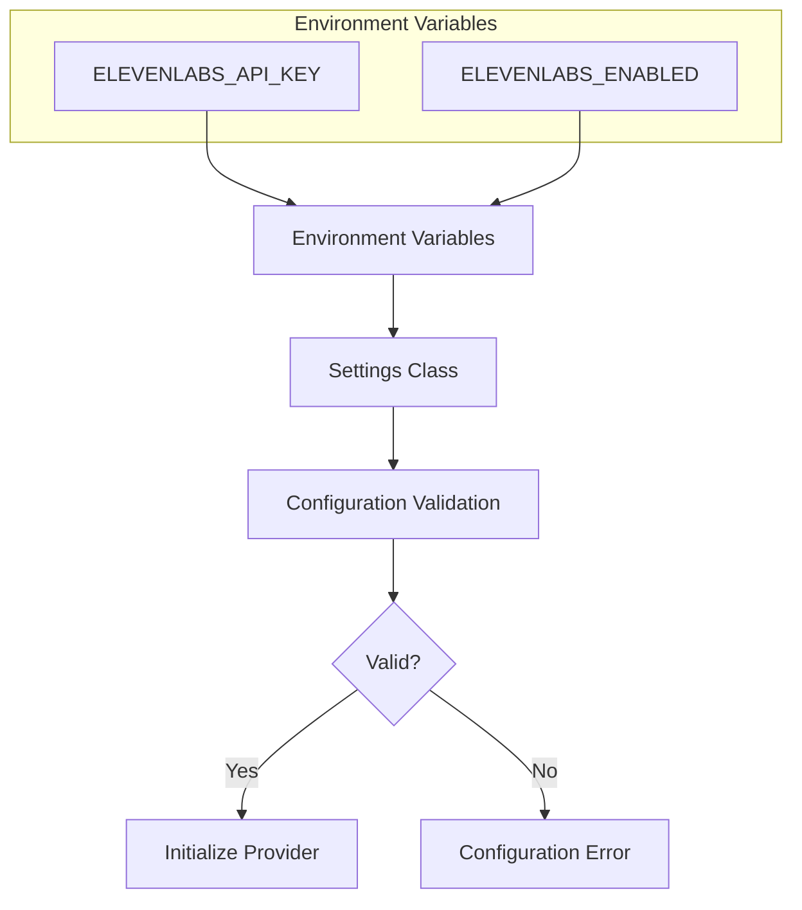

**Diagram sources**
- [settings.py](file://src/infrastructure/config/settings.py#L65-L76)

### Configuration Classes

The configuration system uses Pydantic models for type safety and validation:

| Setting | Type | Purpose |
|---------|------|---------|
| api_key | Optional[str] | ElevenLabs API authentication |
| enabled | bool | Feature toggle for voice generation |

**Section sources**
- [settings.py](file://src/infrastructure/config/settings.py#L65-L76)

## Error Handling and Fallback Mechanisms

The implementation provides comprehensive error handling with multiple fallback strategies to ensure reliable operation under various failure conditions.

### Multi-Level Error Handling

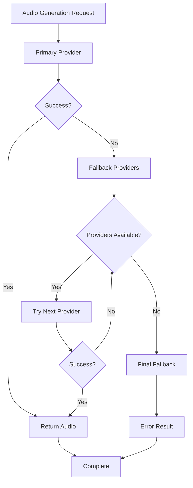

**Diagram sources**
- [voice_service.py](file://src/voice_providers/voice_service.py#L136-L191)

### Voice Availability Handling

The system gracefully handles voice unavailability scenarios:

1. **API Failure**: Attempts to retrieve voice list, falls back to cached data
2. **Language Mismatch**: Uses fallback voices for unsupported languages
3. **Network Issues**: Implements retry logic with exponential backoff
4. **Rate Limiting**: Handles API rate limits with appropriate delays

**Section sources**
- [elevenlabs_client.py](file://src/elevenlabs_client.py#L43-L52)
- [elevenlabs_provider.py](file://src/voice_providers/elevenlabs_provider.py#L92-L102)

## Performance Optimization

The implementation incorporates several performance optimization strategies to ensure efficient operation and responsive user experiences.

### Caching Strategies

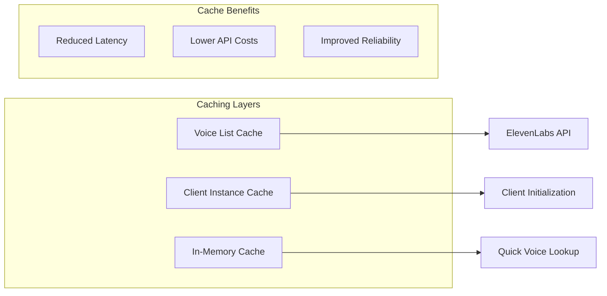

### Optimization Techniques

| Technique | Implementation | Benefit |
|-----------|----------------|---------|
| Lazy Loading | On-demand client initialization | Faster startup |
| Voice Caching | Store voice lists locally | Reduced API calls |
| Generator Processing | Stream audio generation | Memory efficiency |
| Connection Pooling | Reuse HTTP connections | Network efficiency |

**Section sources**
- [elevenlabs_client.py](file://src/elevenlabs_client.py#L32-L33)
- [elevenlabs_provider.py](file://src/voice_providers/elevenlabs_provider.py#L24-L25)

## Testing and Validation

The implementation includes comprehensive testing to ensure reliability and correctness across various scenarios.

### Test Coverage Areas

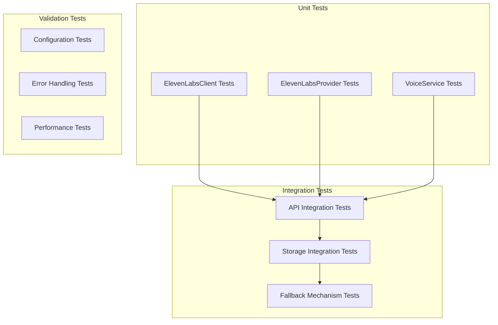

**Diagram sources**
- [test_voice_providers.py](file://test_voice_providers.py#L19-L213)

### Test Scenarios

The test suite covers critical functionality areas:

1. **Basic Functionality**: Voice selection and audio generation
2. **Error Handling**: API failures and network issues
3. **Fallback Mechanisms**: Alternative provider selection
4. **Configuration**: Environment variable handling
5. **Integration**: End-to-end audio pipeline testing

**Section sources**
- [test_voice_providers.py](file://test_voice_providers.py#L19-L213)

## Common Issues and Solutions

This section addresses frequently encountered issues and provides practical solutions for optimal implementation.

### Voice Availability Issues

**Problem**: Voice not found for specific language
**Solution**: 
- Verify language code format (ISO standards)
- Check fallback voice configuration
- Monitor ElevenLabs API updates

### Audio Quality Considerations

**Problem**: Poor audio quality or unnatural speech
**Solution**:
- Adjust voice settings parameters
- Use higher-quality voice models
- Optimize text preprocessing for pronunciation

### Performance Bottlenecks

**Problem**: Slow audio generation
**Solution**:
- Implement voice caching strategies
- Use asynchronous processing
- Optimize text chunking for large stories

### Multilingual Support Limitations

**Problem**: Limited language support
**Solution**:
- Leverage multilingual models for broader coverage
- Implement language detection and fallback
- Maintain comprehensive fallback voice library

### Storage and Retrieval Issues

**Problem**: Audio files not accessible
**Solution**:
- Verify Supabase bucket permissions
- Check file path construction
- Monitor storage quotas and limits

### API Rate Limiting

**Problem**: Excessive API calls causing rate limits
**Solution**:
- Implement request throttling
- Use voice caching effectively
- Monitor API usage metrics

**Section sources**
- [elevenlabs_client.py](file://src/elevenlabs_client.py#L54-L85)
- [supabase_client.py](file://src/supabase_client.py#L44-L100)