# External Service Clients

<cite>
**Referenced Files in This Document**
- [openrouter_client.py](file://src/openrouter_client.py)
- [elevenlabs_client.py](file://src/elevenlabs_client.py)
- [supabase_client.py](file://src/supabase_client.py)
- [base_provider.py](file://src/voice_providers/base_provider.py)
- [elevenlabs_provider.py](file://src/voice_providers/elevenlabs_provider.py)
- [provider_registry.py](file://src/voice_providers/provider_registry.py)
- [voice_service.py](file://src/voice_providers/voice_service.py)
- [value_objects.py](file://src/domain/value_objects.py)
- [models.py](file://src/models.py)
- [test_retry_functionality.py](file://test_retry_functionality.py)
- [test_supabase_client.py](file://test_supabase_client.py)
</cite>

## Table of Contents
1. [Introduction](#introduction)
2. [OpenRouterClient - AI Story Generation](#openrouterclient---ai-story-generation)
3. [ElevenLabsClient - Text-to-Speech](#elevenlabsclient---text-to-speech)
4. [SupabaseClient - Database and Storage Operations](#supabaseclient---database-and-storage-operations)
5. [Voice Provider Architecture](#voice-provider-architecture)
6. [Error Handling and Retry Mechanisms](#error-handling-and-retry-mechanisms)
7. [Authentication Patterns](#authentication-patterns)
8. [Performance Optimization](#performance-optimization)
9. [Common Issues and Solutions](#common-issues-and-solutions)
10. [Best Practices](#best-practices)

## Introduction

The Tale Generator application integrates three critical external service clients that handle AI story generation, text-to-speech conversion, and data persistence. These clients form the backbone of the application's AI-powered storytelling capabilities, providing robust error handling, retry mechanisms, and fallback strategies to ensure reliable operation under various conditions.

Each client implements industry-standard patterns for external service communication, including authentication, timeout management, logging, and graceful degradation when services become unavailable. The architecture emphasizes reliability and resilience through comprehensive error handling and automatic fallback mechanisms.

## OpenRouterClient - AI Story Generation

The OpenRouterClient serves as the primary interface for AI-powered story generation, leveraging multiple AI models through the OpenRouter API platform. It implements sophisticated retry mechanisms with exponential backoff and comprehensive response handling.

### Model Enumeration and Selection

The client defines a comprehensive enumeration of available AI models through the `OpenRouterModel` StrEnum class:

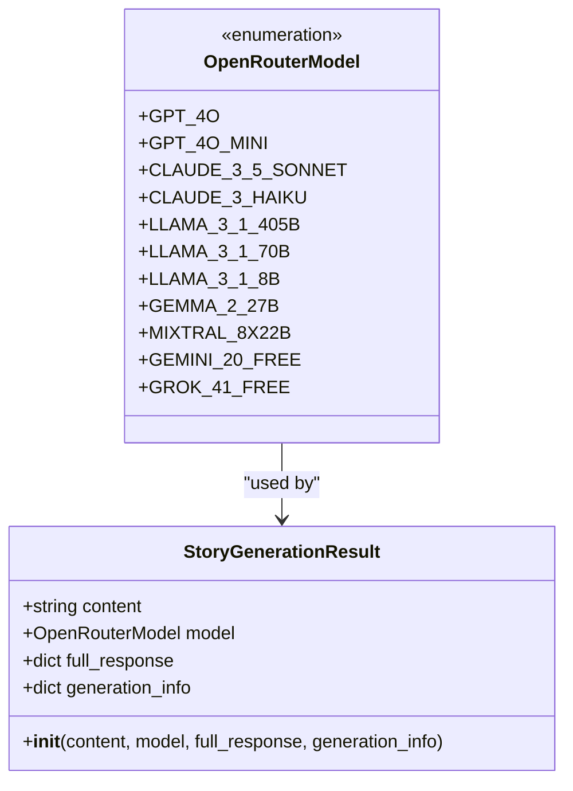

**Diagram sources**
- [openrouter_client.py](file://src/openrouter_client.py#L19-L31)
- [openrouter_client.py](file://src/openrouter_client.py#L34-L42)

### Authentication and Initialization

The client implements secure credential management through environment variable configuration:

| Configuration Parameter | Environment Variable | Purpose | Validation |
|------------------------|---------------------|---------|------------|
| API Key | `OPENROUTER_API_KEY` | Authentication token | Required, raises ValueError if missing |
| Base URL | Hardcoded | API endpoint | Fixed to `https://openrouter.ai/api/v1` |
| Timeout | Configurable | Request timeout | Default varies by operation |

### Retry Mechanism with Exponential Backoff

The `generate_story` method implements a sophisticated retry system with exponential backoff:

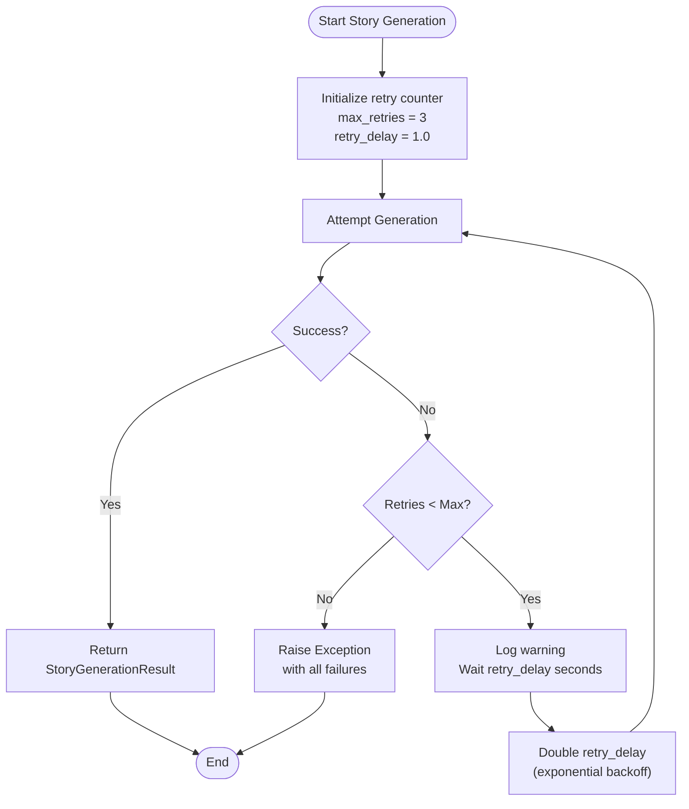

**Diagram sources**
- [openrouter_client.py](file://src/openrouter_client.py#L119-L161)

Key characteristics of the retry mechanism:
- **Maximum Attempts**: 4 total attempts (original + 3 retries)
- **Initial Delay**: 1.0 second
- **Backoff Strategy**: Exponential doubling of delay
- **Logging**: Comprehensive debug and warning logs
- **Exception Propagation**: Final exception raised after all retries exhausted

### Response Handling and Full Response Storage

The client captures comprehensive response data for analytics and debugging:

| Response Component | Storage Location | Purpose |
|-------------------|------------------|---------|
| Generated Content | `StoryGenerationResult.content` | Actual story text |
| Model Information | `StoryGenerationResult.model` | Used model identifier |
| Complete Response | `StoryGenerationResult.full_response` | Raw API response |
| Generation Info | `StoryGenerationResult.generation_info` | Additional metadata |

**Section sources**
- [openrouter_client.py](file://src/openrouter_client.py#L1-L161)

## ElevenLabsClient - Text-to-Speech

The ElevenLabsClient provides advanced text-to-speech capabilities with intelligent voice selection, multilingual support, and fallback strategies for optimal audio generation.

### Voice Selection by Language

The client implements sophisticated voice selection logic with fallback mechanisms:

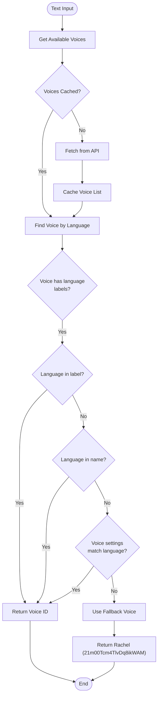

**Diagram sources**
- [elevenlabs_client.py](file://src/elevenlabs_client.py#L54-L85)

### Multilingual Model Usage

The client leverages ElevenLabs' multilingual capabilities effectively:

| Language | Voice Strategy | Model Used | Fallback Behavior |
|----------|---------------|------------|-------------------|
| English | Specific voice matching | `eleven_multilingual_v2` | Rachel voice |
| Russian | Multilingual model | `eleven_multilingual_v2` | Rachel voice |
| Other Languages | Language detection | `eleven_multilingual_v2` | Fallback to English |

### Voice Settings and Quality Control

The client maintains consistent audio quality through predefined voice settings:

| Setting | Value | Purpose |
|---------|-------|---------|
| Stability | 0.5 | Balanced speech consistency |
| Similarity Boost | 0.75 | Enhanced voice resemblance |
| Style | 0.0 | Natural speaking style |
| Speaker Boost | True | Improved vocal clarity |

### Error Handling and Logging

The ElevenLabsClient implements comprehensive error handling with detailed logging:

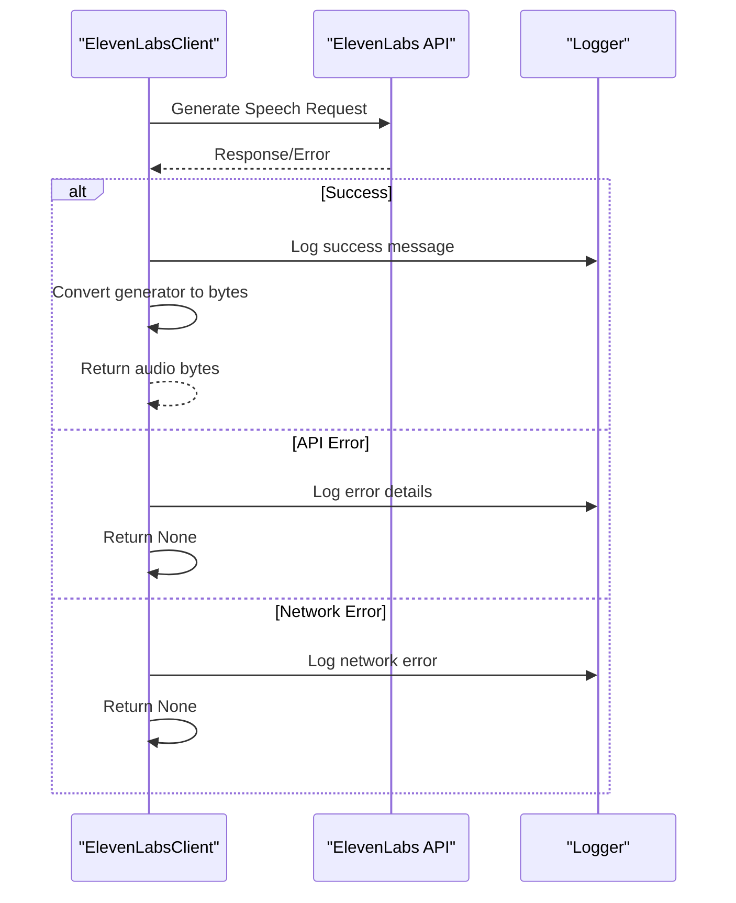

**Diagram sources**
- [elevenlabs_client.py](file://src/elevenlabs_client.py#L110-L133)

**Section sources**
- [elevenlabs_client.py](file://src/elevenlabs_client.py#L1-L133)

## SupabaseClient - Database and Storage Operations

The SupabaseClient provides comprehensive database and file storage capabilities with robust error handling and timeout management for reliable data persistence.

### Database Operations Architecture

The client handles multiple entity types with consistent patterns:

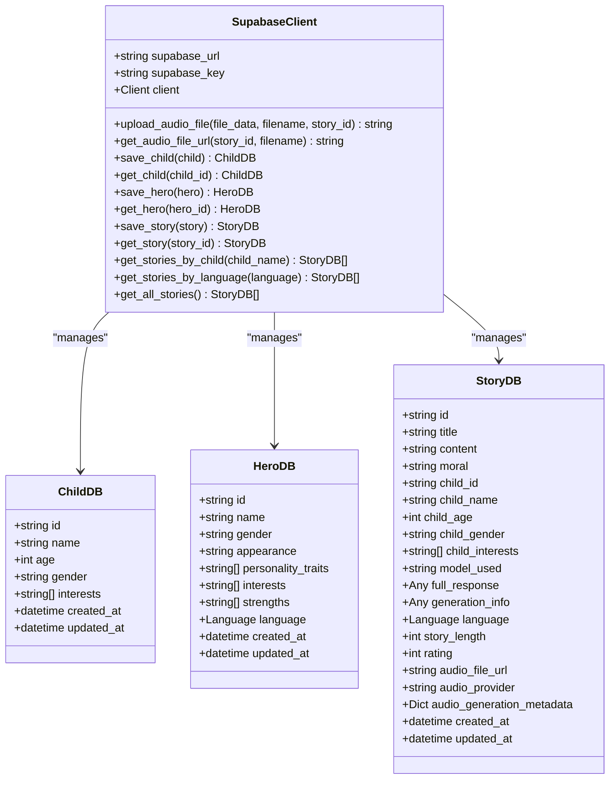

**Diagram sources**
- [supabase_client.py](file://src/supabase_client.py#L19-L800)
- [models.py](file://src/models.py#L65-L117)

### File Upload and Download Patterns

The client implements structured file management for audio storage:

| Operation | Method | Path Pattern | Content Type |
|-----------|--------|--------------|--------------|
| Upload | `upload_audio_file` | `stories/{story_id}/{filename}` | `audio/mpeg` |
| Download URL | `get_audio_file_url` | Same as upload path | N/A |

### Timeout Configuration

The client implements balanced timeout settings for different operations:

| Component | Timeout Value | Purpose |
|-----------|---------------|---------|
| PostgREST Client | 10 seconds | Database queries |
| Storage Client | 10 seconds | File operations |
| Schema | `tales` | Database schema |

### Error Handling Patterns

The client follows consistent error handling patterns across all operations:

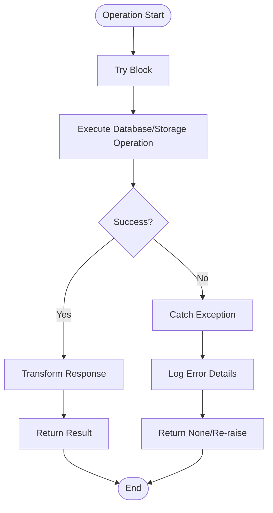

**Diagram sources**
- [supabase_client.py](file://src/supabase_client.py#L44-L81)

**Section sources**
- [supabase_client.py](file://src/supabase_client.py#L1-L914)

## Voice Provider Architecture

The voice provider system implements a flexible, extensible architecture for managing multiple text-to-speech providers with automatic fallback capabilities.

### Provider Interface Design

The base provider interface establishes standardized capabilities:

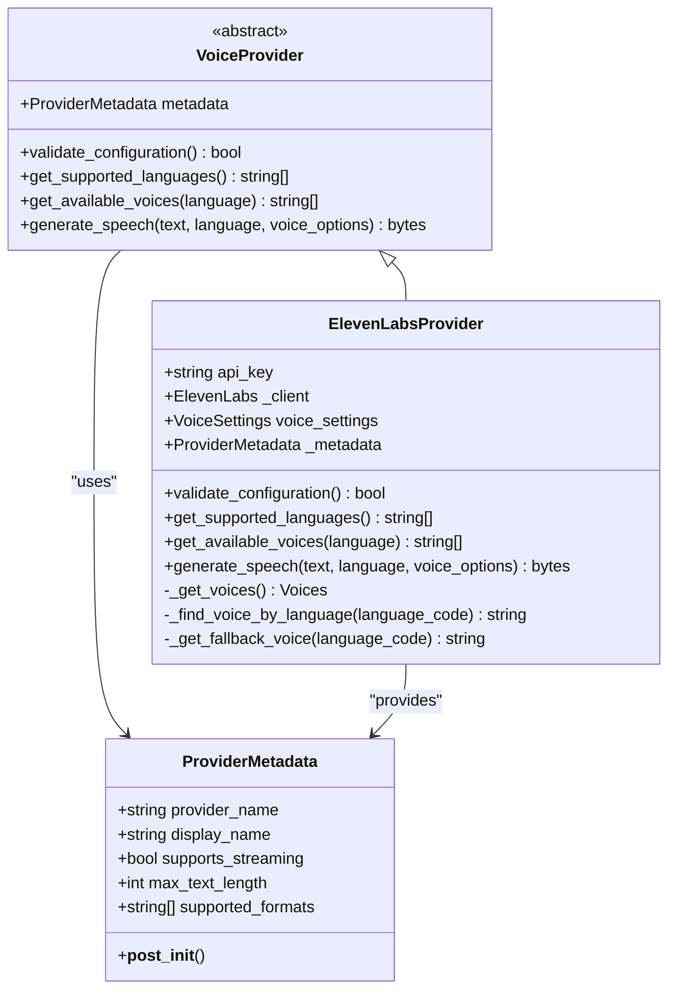

**Diagram sources**
- [base_provider.py](file://src/voice_providers/base_provider.py#L28-L97)
- [elevenlabs_provider.py](file://src/voice_providers/elevenlabs_provider.py#L18-L220)

### Provider Registry Management

The registry system manages provider lifecycle and automatic fallback:

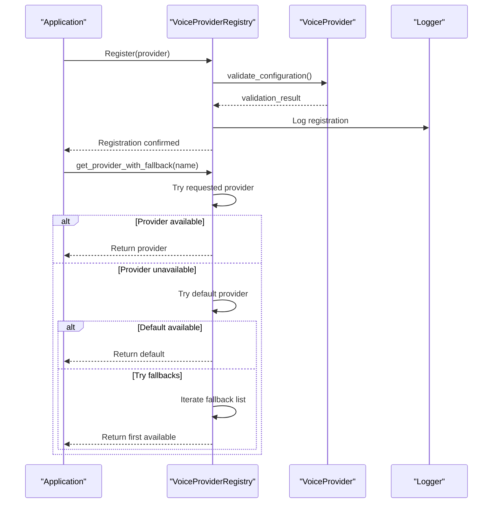

**Diagram sources**
- [provider_registry.py](file://src/voice_providers/provider_registry.py#L100-L140)

### Voice Service Facade

The voice service provides a unified interface for audio generation:

| Feature | Implementation | Purpose |
|---------|---------------|---------|
| Automatic Provider Selection | `get_provider_with_fallback()` | Ensures availability |
| Fallback Mechanism | `_try_fallback()` | Graceful degradation |
| Error Handling | Comprehensive try-catch blocks | Robust operation |
| Metadata Collection | Audio generation metrics | Performance monitoring |

**Section sources**
- [base_provider.py](file://src/voice_providers/base_provider.py#L1-L97)
- [elevenlabs_provider.py](file://src/voice_providers/elevenlabs_provider.py#L1-L220)
- [provider_registry.py](file://src/voice_providers/provider_registry.py#L1-L212)
- [voice_service.py](file://src/voice_providers/voice_service.py#L1-L236)

## Error Handling and Retry Mechanisms

The application implements comprehensive error handling strategies across all external service clients, ensuring robust operation under various failure conditions.

### OpenRouterClient Retry Strategy

The OpenRouterClient implements a sophisticated retry mechanism with exponential backoff:

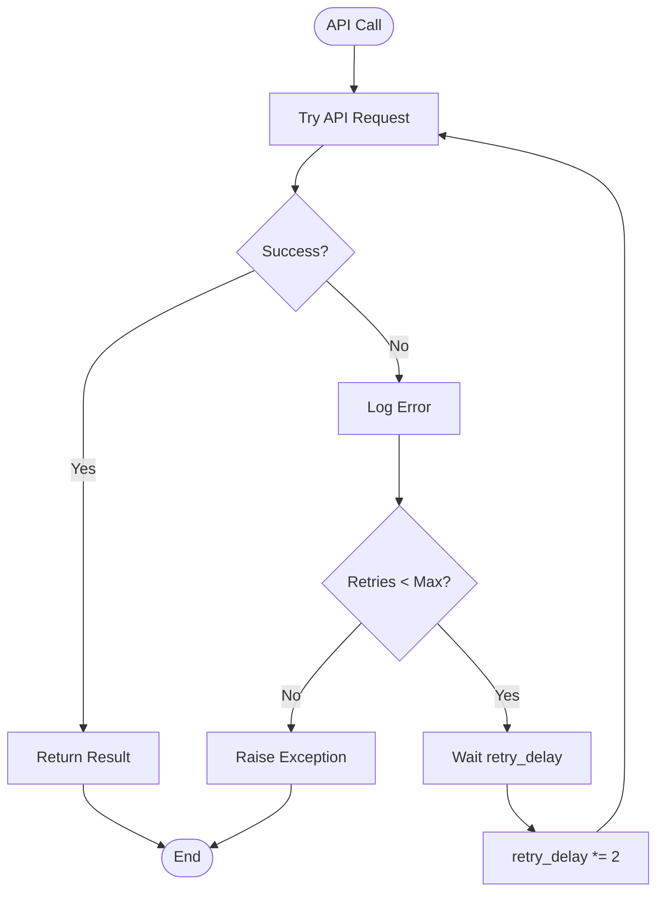

**Diagram sources**
- [openrouter_client.py](file://src/openrouter_client.py#L119-L161)

### ElevenLabsClient Error Recovery

The ElevenLabsClient implements multiple layers of error recovery:

| Error Type | Recovery Strategy | Fallback Action |
|------------|------------------|-----------------|
| API Unavailability | Voice cache fallback | Use cached voice list |
| Voice Selection Failure | Default voice fallback | Rachel voice (21m00Tcm4TlvDq8ikWAM) |
| Network Timeout | Immediate fallback | Return None with error log |
| Authentication Error | Configuration validation | Log warning and continue |

### SupabaseClient Resilience Patterns

The SupabaseClient implements resilient database operations:

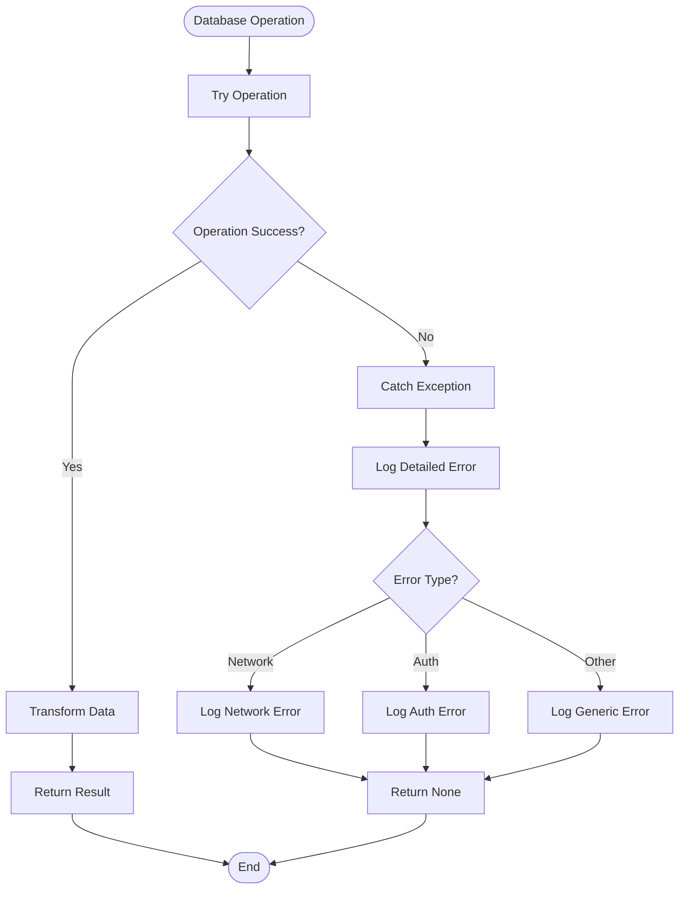

**Diagram sources**
- [supabase_client.py](file://src/supabase_client.py#L44-L81)

### Exception Propagation Patterns

The application follows consistent exception propagation patterns:

| Client | Error Type | Propagation Strategy |
|--------|------------|---------------------|
| OpenRouterClient | API errors | Raise after retries exhausted |
| ElevenLabsClient | Generation errors | Return None with error logging |
| SupabaseClient | Database errors | Return None or re-raise |

**Section sources**
- [openrouter_client.py](file://src/openrouter_client.py#L119-L161)
- [elevenlabs_client.py](file://src/elevenlabs_client.py#L110-L133)
- [supabase_client.py](file://src/supabase_client.py#L44-L81)

## Authentication Patterns

Each external service client implements secure authentication patterns tailored to the specific service requirements.

### OpenRouterClient Authentication

The OpenRouterClient uses API key authentication with environment variable management:

| Authentication Method | Implementation | Security Features |
|----------------------|----------------|-------------------|
| API Key | Bearer token in headers | Environment variable storage |
| Validation | Runtime verification | Required field checking |
| Error Handling | Clear error messages | Specific credential warnings |

### ElevenLabsClient Authentication

The ElevenLabsClient implements similar authentication patterns:

| Aspect | Implementation | Security Considerations |
|--------|---------------|------------------------|
| API Key Storage | Environment variables | Secure credential management |
| Client Initialization | Lazy loading | On-demand authentication |
| Error Detection | Exception handling | Graceful failure reporting |

### SupabaseClient Authentication

The SupabaseClient uses database credentials with schema isolation:

| Credential Type | Storage Method | Schema Isolation |
|----------------|----------------|------------------|
| URL | Environment variable | `tales` schema |
| Key | Environment variable | Access control |
| Validation | Constructor validation | Early failure detection |

### Credential Management Best Practices

The application implements several credential management best practices:

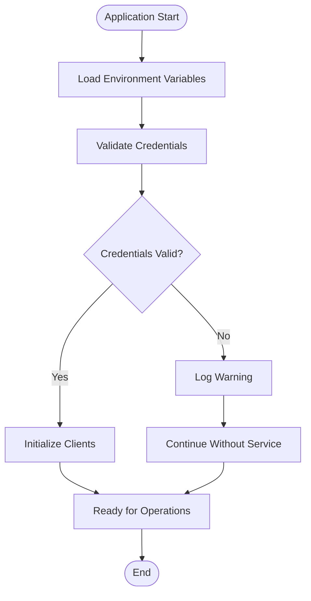

**Section sources**
- [openrouter_client.py](file://src/openrouter_client.py#L47-L64)
- [elevenlabs_client.py](file://src/elevenlabs_client.py#L19-L31)
- [supabase_client.py](file://src/supabase_client.py#L22-L42)

## Performance Optimization

The external service clients implement several performance optimization strategies to minimize latency and maximize throughput.

### Caching Strategies

| Client | Cache Type | Implementation | Benefits |
|--------|-----------|----------------|----------|
| ElevenLabsClient | Voice List Cache | `_voices` instance variable | Reduced API calls |
| ElevenLabsProvider | Voice Cache | Lazy-loaded client | Faster initialization |
| SupabaseClient | Connection Pooling | Built-in Supabase client | Efficient resource usage |

### Connection Management

The clients implement efficient connection management patterns:

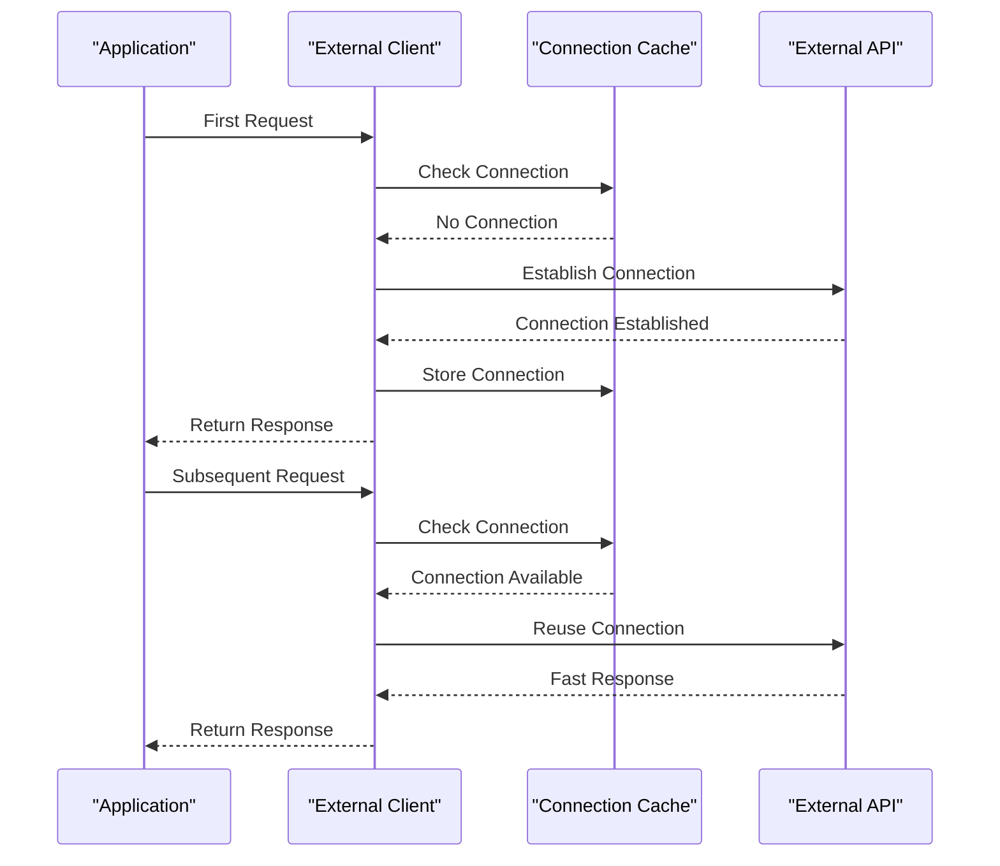

### Timeout Optimization

The clients implement balanced timeout configurations:

| Client | Operation Type | Timeout | Rationale |
|--------|---------------|---------|-----------|
| OpenRouterClient | Chat completion | Variable | Model-dependent |
| ElevenLabsClient | Speech generation | Default | Provider-specific |
| SupabaseClient | Database operations | 10 seconds | Balanced performance |
| SupabaseClient | Storage operations | 10 seconds | File transfer efficiency |

### Concurrent Operation Patterns

The voice provider system enables concurrent operations through the registry:

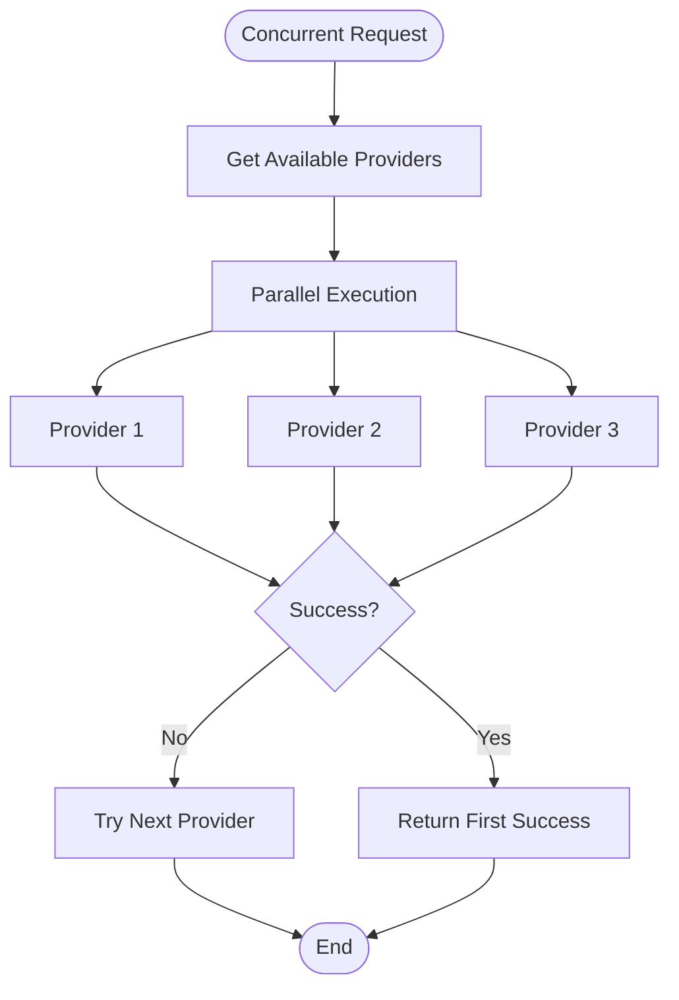

**Section sources**
- [elevenlabs_client.py](file://src/elevenlabs_client.py#L32-L52)
- [provider_registry.py](file://src/voice_providers/provider_registry.py#L100-L140)

## Common Issues and Solutions

This section addresses frequently encountered issues and provides practical solutions for each external service client.

### OpenRouterClient Issues

| Issue | Symptoms | Solution | Prevention |
|-------|----------|----------|------------|
| Rate Limiting | 429 HTTP errors | Implement exponential backoff | Monitor usage patterns |
| API Key Issues | Authentication failures | Verify environment variables | Use credential validation |
| Network Timeouts | Request timeouts | Increase timeout values | Implement retry logic |
| Model Availability | Model not found errors | Use fallback models | Check model availability |

### ElevenLabsClient Issues

| Issue | Symptoms | Solution | Prevention |
|-------|----------|----------|------------|
| Voice Selection Failures | Default voice usage | Implement fallback logic | Cache voice lists |
| Multilingual Model Issues | Incorrect language handling | Verify language codes | Test with sample texts |
| Audio Quality Problems | Poor audio output | Adjust voice settings | Test with different voices |
| API Quota Exceeded | Generation failures | Implement usage limits | Monitor quota usage |

### SupabaseClient Issues

| Issue | Symptoms | Solution | Prevention |
|-------|----------|----------|------------|
| Connection Timeouts | Slow database operations | Optimize queries | Use indexing |
| Storage Upload Failures | File upload errors | Implement retry logic | Check file sizes |
| Authentication Errors | Access denied | Verify credentials | Regular credential rotation |
| Schema Mismatches | Type conversion errors | Validate data types | Use strict typing |

### General Cross-Cutting Issues

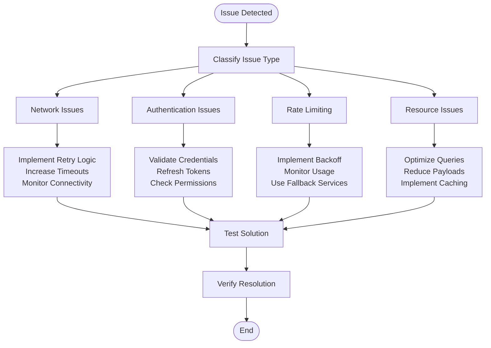

### Troubleshooting Checklist

For each client, implement the following troubleshooting steps:

| Step | OpenRouterClient | ElevenLabsClient | SupabaseClient |
|------|------------------|------------------|----------------|
| 1 | Check API key validity | Verify voice availability | Confirm database connectivity |
| 2 | Review rate limits | Test voice selection | Validate schema permissions |
| 3 | Monitor network connectivity | Check audio quality | Review query performance |
| 4 | Enable debug logging | Verify fallback behavior | Check storage permissions |
| 5 | Test with minimal requests | Validate language support | Monitor transaction logs |

**Section sources**
- [openrouter_client.py](file://src/openrouter_client.py#L119-L161)
- [elevenlabs_client.py](file://src/elevenlabs_client.py#L54-L85)
- [supabase_client.py](file://src/supabase_client.py#L22-L42)

## Best Practices

This section outlines recommended practices for working with the external service clients to ensure reliable, maintainable, and performant applications.

### Error Handling Best Practices

| Practice | Implementation | Benefits |
|----------|---------------|----------|
| Comprehensive Logging | Structured log messages with context | Better debugging and monitoring |
| Graceful Degradation | Fallback mechanisms for failures | Improved user experience |
| Exception Classification | Distinct error types for different issues | More targeted error handling |
| Retry Logic | Exponential backoff with jitter | Reduced load on external services |

### Performance Best Practices

| Practice | Implementation | Benefits |
|----------|---------------|----------|
| Connection Pooling | Reuse connections where possible | Reduced overhead |
| Caching | Cache frequently accessed data | Improved response times |
| Async Operations | Non-blocking I/O where applicable | Better concurrency |
| Monitoring | Track performance metrics | Proactive issue detection |

### Security Best Practices

| Practice | Implementation | Benefits |
|----------|---------------|----------|
| Credential Management | Environment variables and secrets management | Secure credential storage |
| Input Validation | Sanitize and validate all inputs | Protection against injection attacks |
| Rate Limiting | Implement client-side rate limiting | Protection against abuse |
| Audit Logging | Log all external service interactions | Security monitoring |

### Testing Best Practices

| Practice | Implementation | Benefits |
|----------|---------------|----------|
| Mock Services | Test with mocked external clients | Reliable, fast testing |
| Integration Tests | Test end-to-end workflows | Real-world validation |
| Error Simulation | Test error conditions explicitly | Robust error handling |
| Performance Testing | Measure response times under load | Capacity planning |

### Monitoring and Observability

Implement comprehensive monitoring for each client:

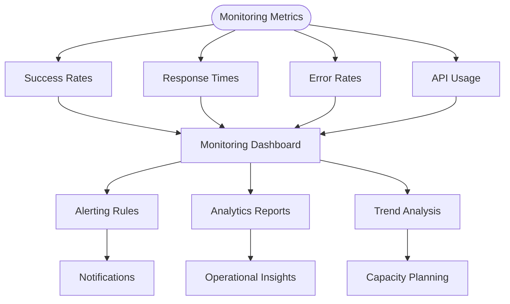

### Maintenance and Updates

Regular maintenance tasks for external service clients:

| Task | Frequency | Purpose |
|------|-----------|---------|
| Credential Rotation | Monthly | Security best practice |
| Dependency Updates | Quarterly | Security and feature updates |
| Performance Review | Monthly | Optimization opportunities |
| Error Analysis | Weekly | Issue identification and resolution |

These best practices ensure that the external service clients operate reliably, securely, and efficiently while maintaining high standards for code quality and operational excellence.