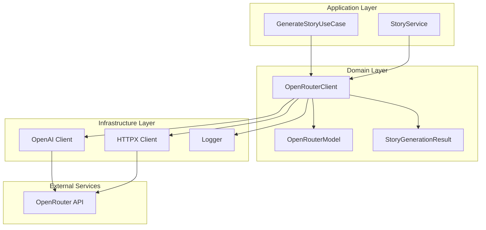
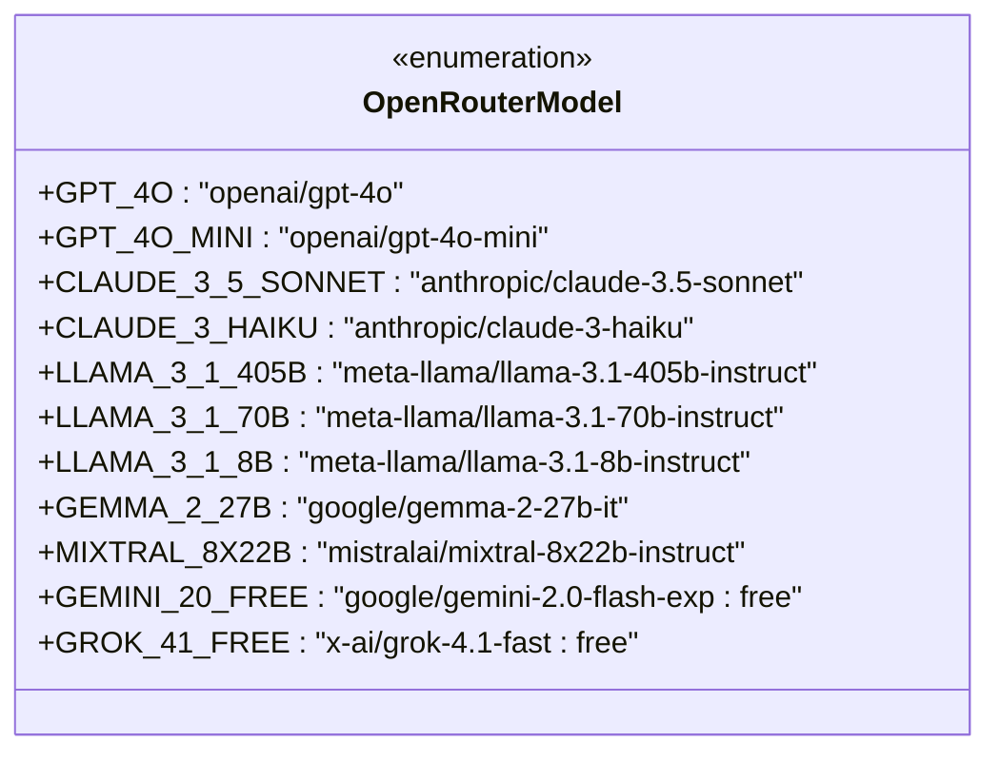
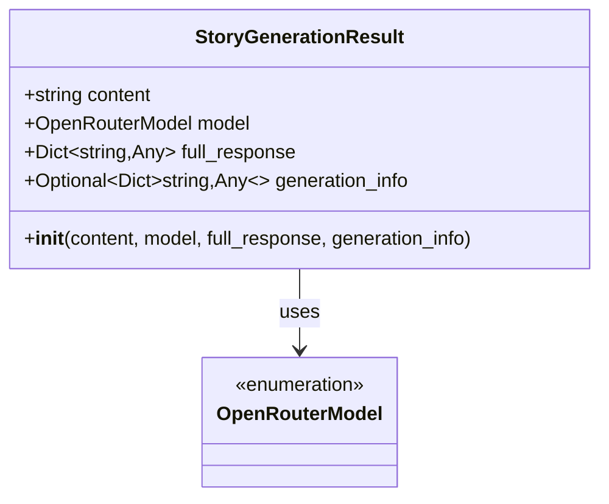
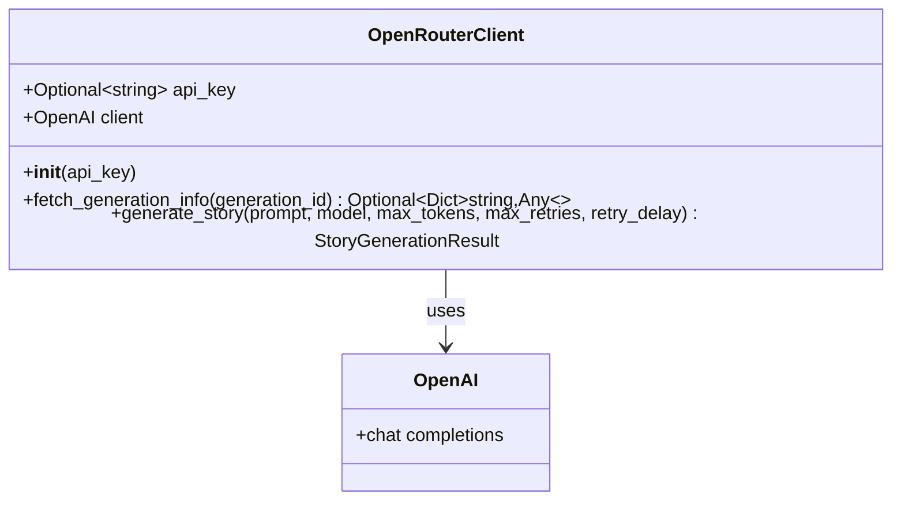
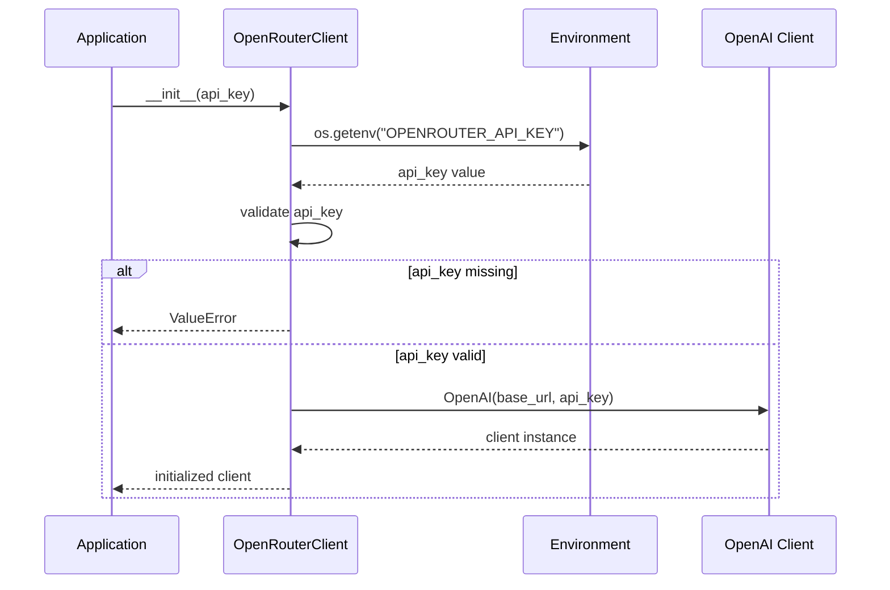
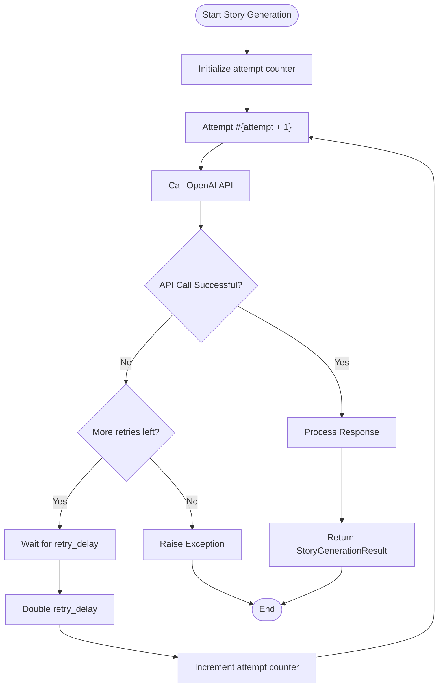
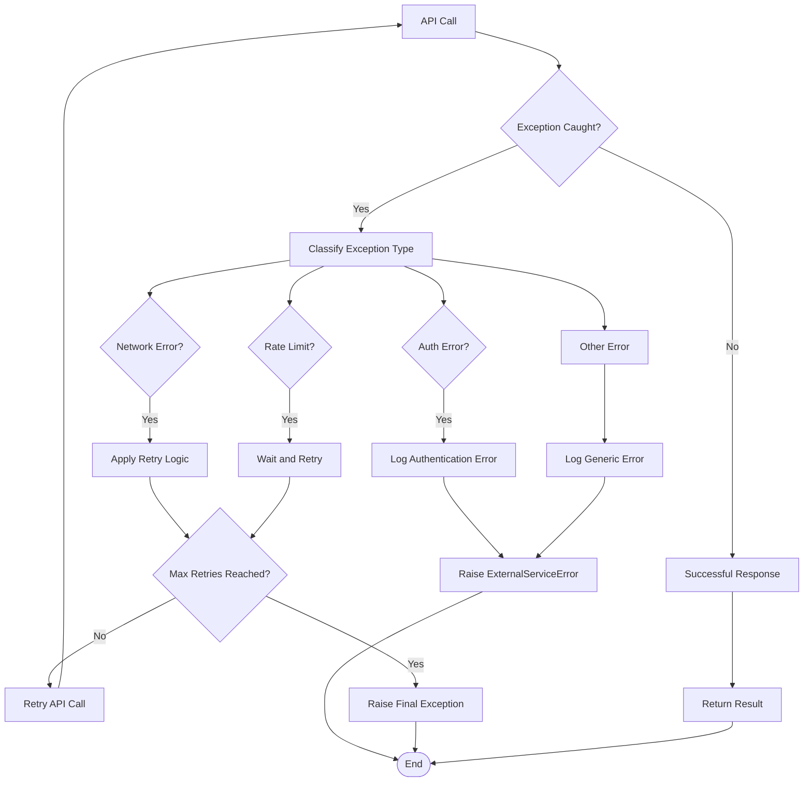
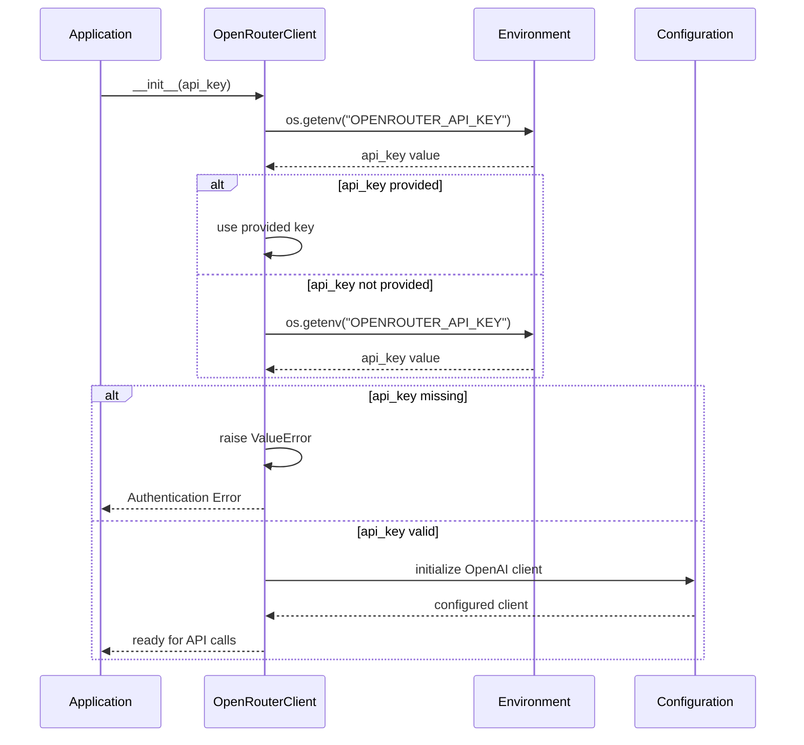
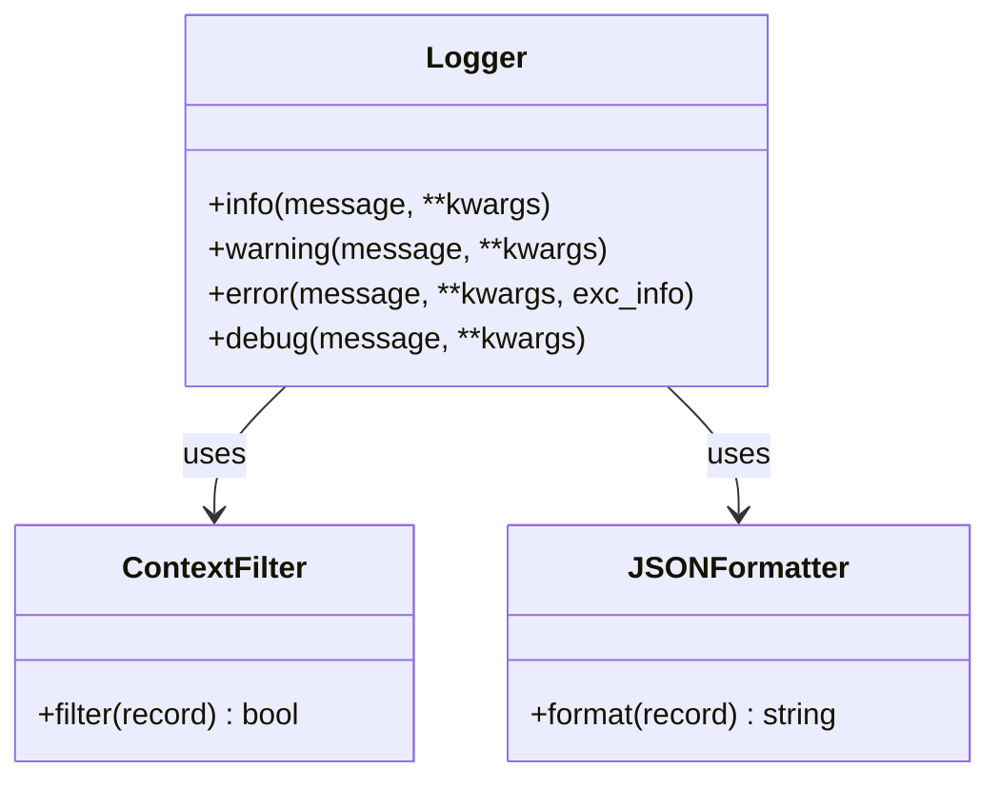
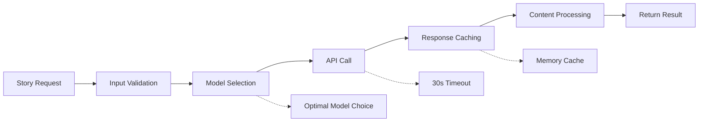

# OpenRouter Client Implementation

<cite>
**Referenced Files in This Document**
- [openrouter_client.py](file://src/openrouter_client.py)
- [test_retry_functionality.py](file://test_retry_functionality.py)
- [generate_story.py](file://src/application/use_cases/generate_story.py)
- [story_service.py](file://src/domain/services/story_service.py)
- [settings.py](file://src/infrastructure/config/settings.py)
- [logging.py](file://src/core/logging.py)
- [exceptions.py](file://src/core/exceptions.py)
- [routes.py](file://src/api/routes.py)
</cite>

## Table of Contents
1. [Introduction](#introduction)
2. [Architecture Overview](#architecture-overview)
3. [OpenRouterModel Enumeration](#openroutermodel-enumeration)
4. [StoryGenerationResult Class](#storygenerationresult-class)
5. [OpenRouterClient Implementation](#openrouterclient-implementation)
6. [Retry Mechanism](#retry-mechanism)
7. [Error Handling Strategies](#error-handling-strategies)
8. [Authentication Pattern](#authentication-pattern)
9. [Logging Practices](#logging-practices)
10. [Integration Examples](#integration-examples)
11. [Performance Optimization](#performance-optimization)
12. [Common Issues and Solutions](#common-issues-and-solutions)
13. [Best Practices](#best-practices)

## Introduction

The OpenRouterClient is a sophisticated AI service client designed for the Tale Generator application, providing seamless integration with OpenRouter's API to generate high-quality children's stories. Built with robust error handling, retry mechanisms, and comprehensive logging, it serves as the primary interface for AI-powered story generation while maintaining reliability and performance standards.

The client supports multiple AI models from leading providers including OpenAI, Anthropic, Meta, Google, and others, enabling flexible story generation with configurable parameters for content quality, length, and model selection.

## Architecture Overview

The OpenRouterClient follows a layered architecture pattern that separates concerns between API communication, result processing, and error handling:



**Diagram sources**
- [openrouter_client.py](file://src/openrouter_client.py#L44-L161)
- [generate_story.py](file://src/application/use_cases/generate_story.py#L21-L208)

**Section sources**
- [openrouter_client.py](file://src/openrouter_client.py#L1-L161)
- [generate_story.py](file://src/application/use_cases/generate_story.py#L1-L208)

## OpenRouterModel Enumeration

The OpenRouterModel enumeration defines all available AI models supported by the OpenRouter platform, organized by provider and capability level:



**Diagram sources**
- [openrouter_client.py](file://src/openrouter_client.py#L19-L31)

### Model Categories

| Provider | Models | Use Cases | Performance |
|----------|--------|-----------|-------------|
| **OpenAI** | GPT-4o, GPT-4o Mini | High-quality creative writing, complex narratives | Excellent |
| **Anthropic** | Claude 3.5 Sonnet, Claude 3 Haiku | Balanced creativity and coherence | Very Good |
| **Meta** | Llama 3.1 405B, 70B, 8B | Cost-effective generation, educational content | Good |
| **Google** | Gemini 2.0 Flash, Gemma 2 27B | Multilingual support, creative tasks | Good |
| **Mistral** | Mixtral 8x22B | Specialized instruction following | Good |
| **xAI** | Grok 4.1 | Experimental models, fast inference | Good |

**Section sources**
- [openrouter_client.py](file://src/openrouter_client.py#L19-L31)

## StoryGenerationResult Class

The StoryGenerationResult class encapsulates the complete output of a story generation request, providing comprehensive information about the generated content and the API response:



**Diagram sources**
- [openrouter_client.py](file://src/openrouter_client.py#L34-L42)

### Result Structure

| Property | Type | Description | Purpose |
|----------|------|-------------|---------|
| `content` | `string` | Generated story text | Primary output for story consumption |
| `model` | `OpenRouterModel` | Used AI model identifier | Tracking and analytics |
| `full_response` | `Dict[str, Any]` | Complete API response | Debugging and analysis |
| `generation_info` | `Optional[Dict[str, Any]]` | Additional generation metadata | Extended analytics |

**Section sources**
- [openrouter_client.py](file://src/openrouter_client.py#L34-L42)

## OpenRouterClient Implementation

The OpenRouterClient class provides a robust interface for interacting with the OpenRouter API, featuring comprehensive initialization, authentication, and API communication capabilities:



**Diagram sources**
- [openrouter_client.py](file://src/openrouter_client.py#L44-L161)

### Initialization Process

The client initialization follows a secure pattern with environment variable loading and validation:



**Diagram sources**
- [openrouter_client.py](file://src/openrouter_client.py#L47-L64)

**Section sources**
- [openrouter_client.py](file://src/openrouter_client.py#L44-L64)

## Retry Mechanism

The OpenRouterClient implements a sophisticated retry mechanism with exponential backoff to handle transient API failures and ensure reliable story generation:



**Diagram sources**
- [openrouter_client.py](file://src/openrouter_client.py#L119-L161)

### Retry Configuration Parameters

| Parameter | Default Value | Description | Impact |
|-----------|---------------|-------------|---------|
| `max_retries` | 3 | Maximum retry attempts | Higher values increase success probability |
| `retry_delay` | 1.0 | Initial delay in seconds | Controls initial wait time |
| `exponential_backoff` | 2.0 | Backoff multiplier | Reduces consecutive failure impact |

### Retry Behavior

The retry mechanism implements the following strategy:
1. **Initial Attempt**: Execute API call with default parameters
2. **Failure Detection**: Catch all exceptions during API communication
3. **Delay Calculation**: Apply exponential backoff (delay × 2)
4. **Retry Decision**: Continue until max_retries reached
5. **Final Failure**: Raise exception with accumulated error information

**Section sources**
- [openrouter_client.py](file://src/openrouter_client.py#L99-L161)

## Error Handling Strategies

The OpenRouterClient employs comprehensive error handling strategies to manage various failure scenarios gracefully:



**Diagram sources**
- [openrouter_client.py](file://src/openrouter_client.py#L119-L161)

### Error Categories

| Error Type | Handling Strategy | Recovery Action |
|------------|-------------------|-----------------|
| **Network Timeout** | Automatic retry with exponential backoff | Wait and retry with increased delay |
| **Rate Limiting** | Exponential backoff with jitter | Wait until rate limit resets |
| **Authentication Failure** | Immediate failure with detailed logging | Verify API key configuration |
| **Invalid Request** | Fail fast with validation error | Log request details for debugging |
| **API Unavailable** | Retry with circuit breaker pattern | Progressive delay increases |

**Section sources**
- [openrouter_client.py](file://src/openrouter_client.py#L119-L161)

## Authentication Pattern

The OpenRouterClient implements a secure authentication pattern using environment variables and configuration validation:



**Diagram sources**
- [openrouter_client.py](file://src/openrouter_client.py#L47-L64)

### Authentication Security Features

| Feature | Implementation | Security Benefit |
|---------|----------------|------------------|
| **Environment Variables** | `os.getenv()` with fallback | Separates credentials from code |
| **Validation** | Mandatory API key check | Prevents runtime authentication errors |
| **Secure Storage** | External configuration files | Reduces exposure risk |
| **Base URL Configuration** | Hardcoded secure endpoint | Prevents endpoint manipulation |

**Section sources**
- [openrouter_client.py](file://src/openrouter_client.py#L47-L64)

## Logging Practices

The OpenRouterClient implements comprehensive logging practices using structured log messages and context-aware logging:



**Diagram sources**
- [logging.py](file://src/core/logging.py#L14-L180)

### Logging Levels and Patterns

| Level | Usage Pattern | Example Message | Context Information |
|-------|---------------|-----------------|-------------------|
| **DEBUG** | Operation details | `"Attempting to generate story with model {model}"` | Model, attempt count |
| **INFO** | Successful operations | `"Successfully generated story with model {model}"` | Model, content length |
| **WARNING** | Recoverable failures | `"Attempt {attempt} failed: {error}. Retrying..."` | Error details, retry info |
| **ERROR** | Critical failures | `"All {attempts} attempts failed. Last error: {error}"` | Complete error chain |

### Structured Logging Features

The logging system provides:
- **Request ID Tracking**: Unique identifiers for correlation
- **JSON Formatting**: Machine-readable log output
- **Context Injection**: Automatic request context addition
- **Exception Details**: Comprehensive error stack traces

**Section sources**
- [openrouter_client.py](file://src/openrouter_client.py#L16-L161)
- [logging.py](file://src/core/logging.py#L1-L180)

## Integration Examples

The OpenRouterClient integrates seamlessly with the application's use cases and services, providing flexible story generation capabilities:

### Basic Usage Example

```python
# Initialize client with automatic API key detection
client = OpenRouterClient()

# Generate story with default parameters
result = client.generate_story(
    prompt="Write a story about a magical forest adventure",
    model=OpenRouterModel.GPT_4O_MINI,
    max_tokens=1000,
    max_retries=3,
    retry_delay=1.0
)

# Access generated content
print(f"Generated story: {result.content}")
print(f"Model used: {result.model.value}")
```

### Advanced Usage with Custom Configuration

```python
# Integration with application settings
from src.infrastructure.config.settings import get_settings

settings = get_settings()
client = OpenRouterClient(api_key=settings.ai_service.api_key)

# Generate story with application-specific parameters
result = client.generate_story(
    prompt=prompt_text,
    model=OpenRouterModel(settings.ai_service.default_model),
    max_tokens=settings.ai_service.max_tokens,
    max_retries=settings.ai_service.max_retries,
    retry_delay=settings.ai_service.retry_delay
)
```

### Error Handling Integration

```python
try:
    result = client.generate_story(prompt, max_retries=5)
    # Process successful result
except Exception as e:
    # Handle generation failure
    logger.error(f"Story generation failed: {str(e)}")
    # Implement fallback strategy
```

**Section sources**
- [test_retry_functionality.py](file://test_retry_functionality.py#L1-L52)
- [generate_story.py](file://src/application/use_cases/generate_story.py#L80-L82)

## Performance Optimization

The OpenRouterClient implements several performance optimization strategies to minimize latency and maximize throughput:

### Optimization Strategies

| Strategy | Implementation | Performance Gain |
|----------|----------------|------------------|
| **Connection Pooling** | Reuse HTTP connections | Reduced connection overhead |
| **Timeout Configuration** | 30-second API timeouts | Prevents hanging requests |
| **Exponential Backoff** | Progressive retry delays | Reduces server load |
| **Model Selection** | Optimal model for task | Balanced quality vs speed |
| **Token Limits** | Configurable max_tokens | Predictable response times |

### Latency Minimization Techniques



### Performance Monitoring

Key metrics tracked for performance optimization:
- **API Response Time**: Average and percentile response times
- **Success Rate**: Percentage of successful generations
- **Retry Frequency**: Number of retries per request
- **Model Performance**: Response times by model type

**Section sources**
- [openrouter_client.py](file://src/openrouter_client.py#L100-L105)
- [settings.py](file://src/infrastructure/config/settings.py#L42-L62)

## Common Issues and Solutions

### Rate Limiting Issues

**Problem**: API requests being throttled or rejected due to rate limits.

**Solution**: 
- Implement exponential backoff with jitter
- Monitor rate limit headers in API responses
- Use appropriate model selection for load balancing

### Model Availability Issues

**Problem**: Specific models becoming temporarily unavailable.

**Solution**:
- Implement fallback model selection
- Monitor model availability through health checks
- Configure multiple models for redundancy

### Network Connectivity Issues

**Problem**: Intermittent network failures affecting API calls.

**Solution**:
- Increase retry attempts for unstable networks
- Implement circuit breaker pattern
- Use connection pooling for persistent connections

### Response Parsing Issues

**Problem**: Unexpected API response formats causing parsing errors.

**Solution**:
- Implement comprehensive response validation
- Use structured data models for API responses
- Log full API responses for debugging

### Authentication Problems

**Problem**: API key configuration issues or expired keys.

**Solution**:
- Validate API key format and permissions
- Implement automatic key rotation
- Monitor authentication failures

**Section sources**
- [openrouter_client.py](file://src/openrouter_client.py#L119-L161)
- [exceptions.py](file://src/core/exceptions.py#L128-L155)

## Best Practices

### Configuration Management

1. **Environment Variables**: Store API keys in environment variables
2. **Default Values**: Provide sensible defaults for all parameters
3. **Validation**: Validate configuration at startup
4. **Documentation**: Document all configuration options clearly

### Error Handling

1. **Graceful Degradation**: Implement fallback strategies
2. **Comprehensive Logging**: Log all errors with context
3. **User-Friendly Messages**: Provide meaningful error messages
4. **Monitoring**: Track error rates and patterns

### Performance

1. **Connection Reuse**: Use connection pooling
2. **Timeout Management**: Set appropriate timeouts
3. **Caching**: Cache frequently accessed data
4. **Load Balancing**: Distribute requests across models

### Security

1. **Credential Protection**: Never hardcode secrets
2. **HTTPS Only**: Use secure connections
3. **Access Control**: Implement proper authentication
4. **Audit Logging**: Log all API interactions

### Testing

1. **Unit Tests**: Test individual components
2. **Integration Tests**: Test API interactions
3. **Mock Services**: Use mocks for external dependencies
4. **Error Scenarios**: Test failure conditions

**Section sources**
- [openrouter_client.py](file://src/openrouter_client.py#L1-L161)
- [test_retry_functionality.py](file://test_retry_functionality.py#L1-L52)