# Supabase Client Implementation

<cite>
**Referenced Files in This Document**
- [src/supabase_client.py](file://src/supabase_client.py)
- [src/infrastructure/persistence/models.py](file://src/infrastructure/persistence/models.py)
- [src/domain/entities.py](file://src/domain/entities.py)
- [src/domain/repositories/base.py](file://src/domain/repositories/base.py)
- [src/domain/repositories/story_repository.py](file://src/domain/repositories/story_repository.py)
- [src/domain/repositories/child_repository.py](file://src/domain/repositories/child_repository.py)
- [src/domain/repositories/hero_repository.py](file://src/domain/repositories/hero_repository.py)
- [src/domain/value_objects.py](file://src/domain/value_objects.py)
- [src/application/dto.py](file://src/application/dto.py)
- [src/infrastructure/config/settings.py](file://src/infrastructure/config/settings.py)
- [test_supabase_client.py](file://test_supabase_client.py)
- [supabase/migrations/001_create_stories_table.sql](file://supabase/migrations/001_create_stories_table.sql)
- [supabase/migrations/005_create_children_table.sql](file://supabase/migrations/005_create_children_table.sql)
- [supabase/migrations/002_add_model_info_to_stories.sql](file://supabase/migrations/002_add_model_info_to_stories.sql)
</cite>

## Table of Contents
1. [Introduction](#introduction)
2. [Architecture Overview](#architecture-overview)
3. [Initialization and Authentication](#initialization-and-authentication)
4. [Database Schema Configuration](#database-schema-configuration)
5. [CRUD Operations](#crud-operations)
6. [Audio File Management](#audio-file-management)
7. [Query Methods](#query-methods)
8. [Data Serialization and Mapping](#data-serialization-and-mapping)
9. [Error Handling and Performance](#error-handling-and-performance)
10. [Common Issues and Solutions](#common-issues-and-solutions)
11. [Performance Optimization](#performance-optimization)
12. [Testing and Validation](#testing-and-validation)

## Introduction

The SupabaseClient serves as the primary interface for database operations in the Tale Generator application, providing comprehensive CRUD functionality for managing stories, children, and heroes. Built on top of the Supabase Python client library, it implements a robust abstraction layer that handles data serialization, authentication, and error management while maintaining clean separation between domain entities and database models.

The client operates within a layered architecture that separates concerns between the presentation layer (API routes), application layer (use cases), domain layer (entities and value objects), and infrastructure layer (persistence). This design ensures maintainability, testability, and scalability of the database operations.

## Architecture Overview

The SupabaseClient follows a repository pattern implementation with explicit mapping between domain entities and database models. The architecture consists of several key layers:

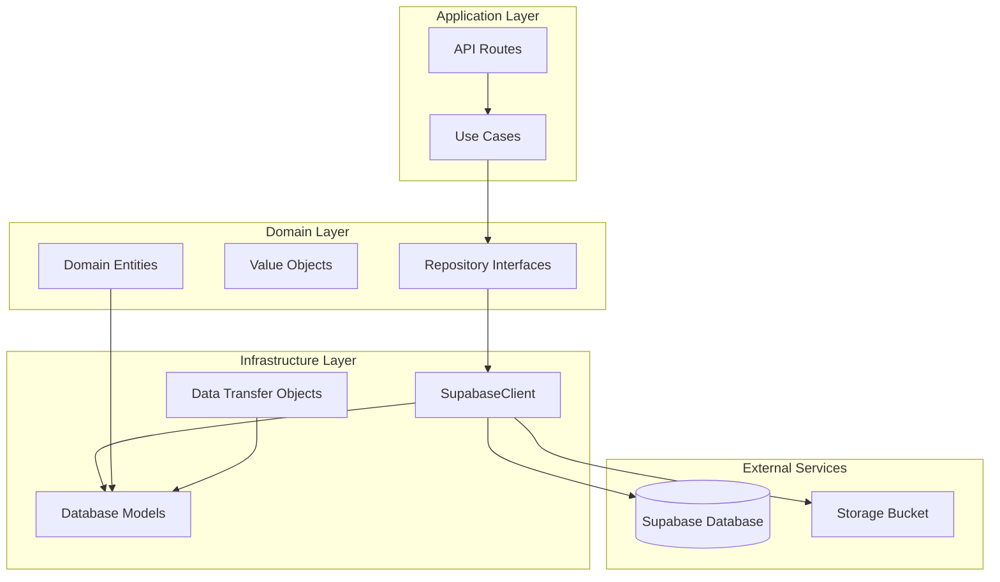

**Diagram sources**
- [src/supabase_client.py](file://src/supabase_client.py#L19-L43)
- [src/domain/repositories/base.py](file://src/domain/repositories/base.py#L9-L56)
- [src/infrastructure/persistence/models.py](file://src/infrastructure/persistence/models.py#L8-L55)

**Section sources**
- [src/supabase_client.py](file://src/supabase_client.py#L1-L43)
- [src/domain/repositories/base.py](file://src/domain/repositories/base.py#L1-L56)

## Initialization and Authentication

The SupabaseClient initializes with environment-based configuration and establishes secure connections to the Supabase platform. The initialization process involves several critical steps:

### Environment Configuration

The client relies on two essential environment variables for authentication:

- `SUPABASE_URL`: The endpoint URL for the Supabase project
- `SUPABASE_KEY`: The API key for authentication

These credentials are loaded using the `dotenv` library and validated during initialization to prevent runtime errors.

### Client Configuration

The Supabase client is configured with specific timeout settings and schema specification:

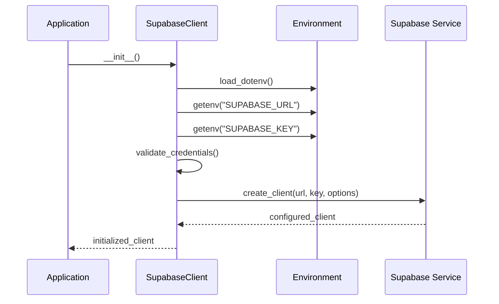

**Diagram sources**
- [src/supabase_client.py](file://src/supabase_client.py#L22-L42)
- [src/infrastructure/config/settings.py](file://src/infrastructure/config/settings.py#L16-L30)

### Timeout Settings

The client implements configurable timeout settings for optimal performance:

- **PostgREST Client Timeout**: 10 seconds for database operations
- **Storage Client Timeout**: 10 seconds for file operations
- **Schema Specification**: Explicitly targets the 'tales' schema

**Section sources**
- [src/supabase_client.py](file://src/supabase_client.py#L22-L42)
- [src/infrastructure/config/settings.py](file://src/infrastructure/config/settings.py#L26-L30)

## Database Schema Configuration

The application operates within the 'tales' schema, which provides logical separation from other potential schemas in the Supabase project. The schema contains three primary tables with carefully designed relationships:

### Table Structure Overview

| Table | Purpose | Key Relationships |
|-------|---------|-------------------|
| `stories` | Stores generated stories with child metadata | References `children` table via `child_id` |
| `children` | Maintains child profiles and preferences | Linked to multiple stories |
| `heroes` | Contains hero profiles for story generation | Supports multilingual content |

### Stories Table Schema

The stories table includes comprehensive metadata for tracking story generation and user interactions:

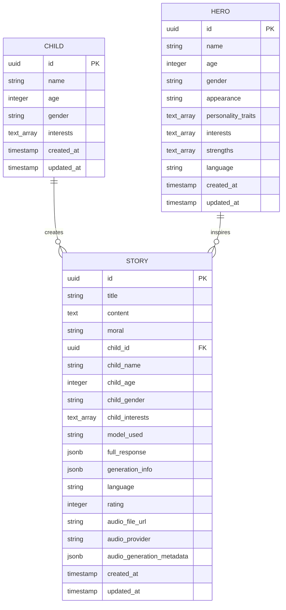

**Diagram sources**
- [supabase/migrations/001_create_stories_table.sql](file://supabase/migrations/001_create_stories_table.sql#L1-L44)
- [supabase/migrations/005_create_children_table.sql](file://supabase/migrations/005_create_children_table.sql#L1-L47)

**Section sources**
- [supabase/migrations/001_create_stories_table.sql](file://supabase/migrations/001_create_stories_table.sql#L1-L44)
- [supabase/migrations/005_create_children_table.sql](file://supabase/migrations/005_create_children_table.sql#L1-L47)

## CRUD Operations

The SupabaseClient provides comprehensive CRUD operations for each entity type, with automatic data serialization and deserialization between domain entities and database models.

### Story Operations

Story management encompasses creation, retrieval, updates, and deletion with support for complex queries:

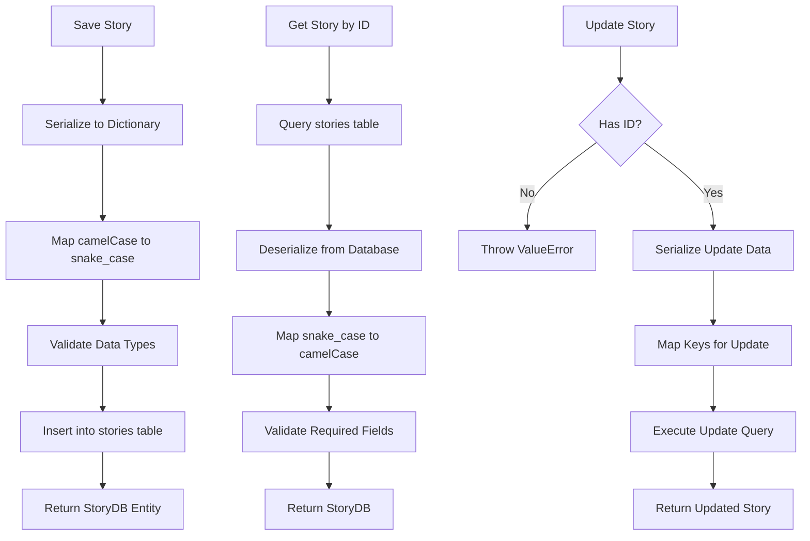

**Diagram sources**
- [src/supabase_client.py](file://src/supabase_client.py#L525-L594)
- [src/supabase_client.py](file://src/supabase_client.py#L595-L639)

### Child Operations

Child profile management supports both creation and retrieval with specialized query methods:

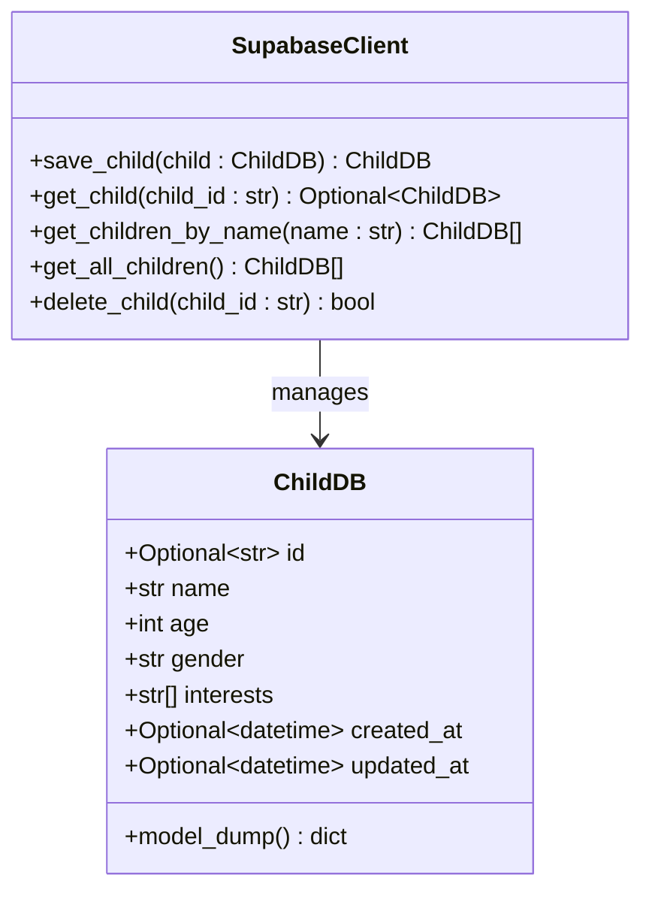

**Diagram sources**
- [src/infrastructure/persistence/models.py](file://src/infrastructure/persistence/models.py#L8-L17)
- [src/supabase_client.py](file://src/supabase_client.py#L102-L160)

### Hero Operations

Hero management includes comprehensive CRUD operations with support for multilingual content:

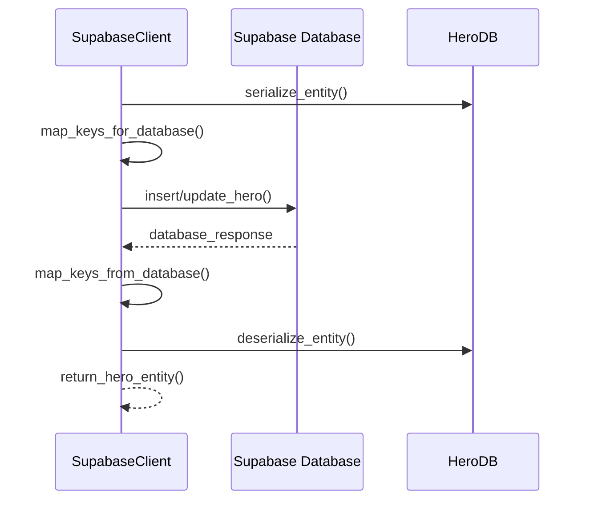

**Diagram sources**
- [src/supabase_client.py](file://src/supabase_client.py#L266-L328)
- [src/supabase_client.py](file://src/supabase_client.py#L330-L367)

**Section sources**
- [src/supabase_client.py](file://src/supabase_client.py#L102-L328)
- [src/infrastructure/persistence/models.py](file://src/infrastructure/persistence/models.py#L8-L55)

## Audio File Management

The SupabaseClient provides specialized functionality for managing audio files through Supabase's storage capabilities, enabling seamless integration of story narrations.

### Upload Audio Files

The `upload_audio_file` method handles the complete process of storing audio files with proper content-type headers:

```mermaid
flowchart TD
StartUpload[Start Upload] --> ValidateParams[Validate Parameters]
ValidateParams --> CreatePath[Create File Path<br/>stories/{story_id}/{filename}]
CreatePath --> UploadFile[Upload to Storage Bucket]
UploadFile --> CheckResponse{Upload Successful?}
CheckResponse --> |No| LogError[Log Error & Return None]
CheckResponse --> |Yes| GetPublicURL[Get Public URL]
GetPublicURL --> LogSuccess[Log Success Message]
LogSuccess --> ReturnURL[Return Public URL]
```

**Diagram sources**
- [src/supabase_client.py](file://src/supabase_client.py#L44-L81)

### Storage Bucket Configuration

Audio files are organized in a structured hierarchy within the 'tales' storage bucket:

- **Path Structure**: `stories/{story_id}/{filename}`
- **Content-Type**: Automatically set to `audio/mpeg`
- **Access Control**: Public URLs for easy playback integration

### Retrieve Audio Files

The `get_audio_file_url` method provides simple access to stored audio files:

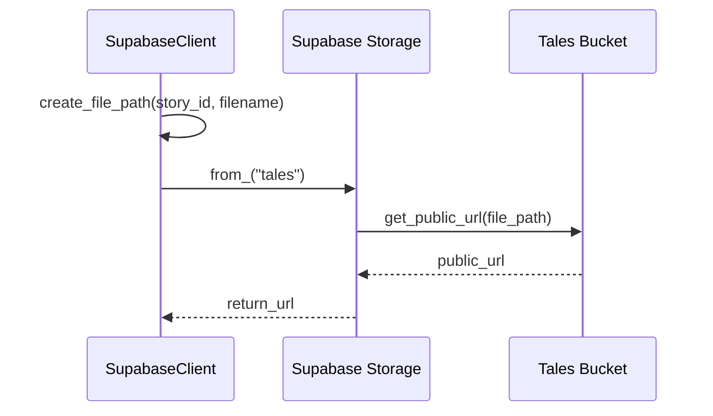

**Diagram sources**
- [src/supabase_client.py](file://src/supabase_client.py#L83-L100)

**Section sources**
- [src/supabase_client.py](file://src/supabase_client.py#L44-L100)

## Query Methods

The SupabaseClient implements sophisticated query methods for retrieving data based on various criteria, supporting both simple and complex filtering scenarios.

### Story Query Methods

Multiple query patterns are available for story retrieval:

| Method | Purpose | Parameters | Return Type |
|--------|---------|------------|-------------|
| `get_story` | Single story by ID | `story_id: str` | `Optional[StoryDB]` |
| `get_stories_by_child` | Stories by child name | `child_name: str` | `List[StoryDB]` |
| `get_stories_by_child_id` | Stories by child ID | `child_id: str` | `List[StoryDB]` |
| `get_stories_by_language` | Stories by language | `language: str` | `List[StoryDB]` |
| `get_all_stories` | All stories | None | `List[StoryDB]` |

### Child Query Methods

Child profile queries support flexible retrieval patterns:

| Method | Purpose | Parameters | Return Type |
|--------|---------|------------|-------------|
| `get_child` | Single child by ID | `child_id: str` | `Optional[ChildDB]` |
| `get_children_by_name` | Children by name | `name: str` | `List[ChildDB]` |
| `get_all_children` | All children | None | `List[ChildDB]` |

### Hero Query Methods

Hero retrieval supports both name-based and language-based queries:

| Method | Purpose | Parameters | Return Type |
|--------|---------|------------|-------------|
| `get_hero` | Single hero by ID | `hero_id: str` | `Optional[HeroDB]` |
| `get_heroes_by_name` | Heroes by name | `name: str` | `List[HeroDB]` |
| `get_all_heroes` | All heroes | None | `List[HeroDB]` |

**Section sources**
- [src/supabase_client.py](file://src/supabase_client.py#L595-L822)
- [src/supabase_client.py](file://src/supabase_client.py#L160-L264)

## Data Serialization and Mapping

The SupabaseClient implements a sophisticated data mapping system that handles the conversion between Python domain entities and Supabase database models, ensuring proper field name translation and data type validation.

### Key Mapping Strategy

The client uses explicit key mapping dictionaries to convert between camelCase Python field names and snake_case database column names:

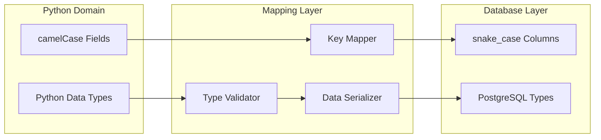

**Diagram sources**
- [src/supabase_client.py](file://src/supabase_client.py#L116-L138)
- [src/supabase_client.py](file://src/supabase_client.py#L279-L297)

### Date and Time Handling

The mapping system includes special handling for datetime objects:

- **Serialization**: Converts datetime objects to ISO format strings
- **Deserialization**: Preserves datetime objects when available
- **Null Handling**: Properly manages null values in optional datetime fields

### Enum and Special Type Handling

Complex data types receive specialized treatment:

- **Language Enums**: Converted to string values using `.value` property
- **List Types**: Preserved as arrays in PostgreSQL
- **JSON Fields**: Handled automatically by Supabase for complex data structures

### Validation and Error Handling

Each mapping operation includes validation to ensure data integrity:

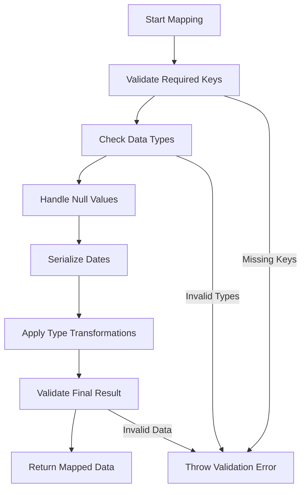

**Diagram sources**
- [src/supabase_client.py](file://src/supabase_client.py#L116-L138)
- [src/supabase_client.py](file://src/supabase_client.py#L279-L307)

**Section sources**
- [src/supabase_client.py](file://src/supabase_client.py#L116-L138)
- [src/supabase_client.py](file://src/supabase_client.py#L279-L307)

## Error Handling and Performance

The SupabaseClient implements comprehensive error handling and performance optimization strategies to ensure reliable operation under various conditions.

### Error Handling Strategy

The client employs multiple layers of error handling:

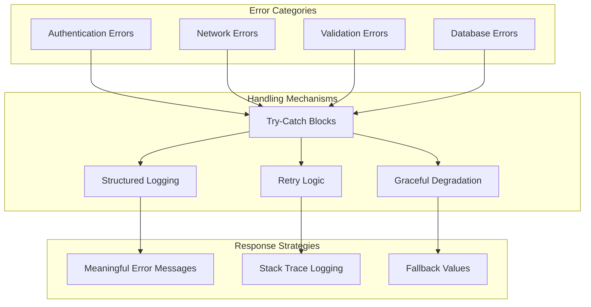

**Diagram sources**
- [src/supabase_client.py](file://src/supabase_client.py#L79-L81)
- [src/supabase_client.py](file://src/supabase_client.py#L157-L159)

### Timeout Configuration

The client implements strategic timeout settings for different operation types:

- **Database Operations**: 10-second timeout for PostgREST queries
- **Storage Operations**: 10-second timeout for file uploads/downloads
- **Connection Pooling**: Automatic management through Supabase client

### Performance Monitoring

Built-in logging provides visibility into operation performance:

- **Operation Timing**: Logs duration of each database operation
- **Error Rates**: Tracks failure rates for different operation types
- **Resource Usage**: Monitors memory and CPU impact of database operations

**Section sources**
- [src/supabase_client.py](file://src/supabase_client.py#L38-L42)
- [src/supabase_client.py](file://src/supabase_client.py#L79-L81)

## Common Issues and Solutions

Understanding common issues and their solutions helps developers effectively troubleshoot and maintain the SupabaseClient implementation.

### Data Serialization Issues

**Problem**: Mismatch between domain entity fields and database column names
**Solution**: Verify key mapping dictionaries are complete and accurate

**Problem**: DateTime serialization failures
**Solution**: Ensure datetime objects are properly handled in mapping functions

**Problem**: Enum serialization errors
**Solution**: Implement proper `.value` property access for enum types

### Connection and Authentication Issues

**Problem**: Missing or invalid SUPABASE_URL or SUPABASE_KEY
**Solution**: Verify environment variables are correctly set and accessible

**Problem**: Network connectivity issues
**Solution**: Implement retry logic with exponential backoff for transient failures

**Problem**: Rate limiting or quota exceeded
**Solution**: Monitor operation frequency and implement client-side throttling

### Storage Permission Issues

**Problem**: Audio file upload failures
**Solution**: Verify storage bucket permissions and public access settings

**Problem**: File access denied errors
**Solution**: Check storage policy configurations and authentication requirements

### Query Performance Issues

**Problem**: Slow query execution
**Solution**: Review database indexes and optimize query patterns

**Problem**: Memory usage spikes during bulk operations
**Solution**: Implement pagination for large result sets

**Section sources**
- [src/supabase_client.py](file://src/supabase_client.py#L27-L31)
- [src/supabase_client.py](file://src/supabase_client.py#L79-L81)

## Performance Optimization

The SupabaseClient incorporates several performance optimization strategies to ensure efficient database operations at scale.

### Batch Operation Strategies

For bulk operations, the client supports efficient batch processing:

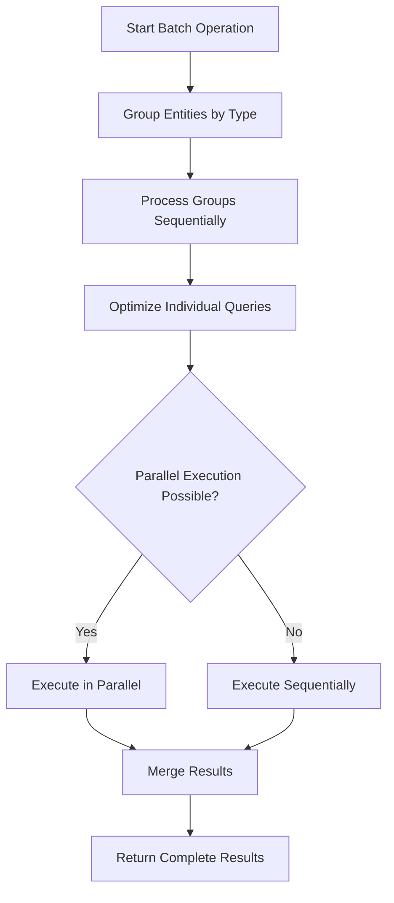

### Index Optimization

The database schema includes strategically placed indexes for optimal query performance:

- **Stories Table**: Indexes on `child_name`, `created_at`, `moral`, and `language`
- **Children Table**: Indexes on `name`, `age`, and `gender`
- **Heroes Table**: Indexes on `name` and `language`

### Caching Strategies

While not implemented in the current client, recommended caching approaches include:

- **Entity Caching**: Cache frequently accessed entities in memory
- **Query Result Caching**: Store query results for repeated requests
- **Metadata Caching**: Cache schema information and configuration data

### Connection Pooling

The Supabase client automatically manages connection pooling:

- **Automatic Pool Management**: Handles connection reuse efficiently
- **Timeout Configuration**: Prevents hanging connections
- **Resource Cleanup**: Ensures proper connection disposal

**Section sources**
- [supabase/migrations/001_create_stories_table.sql](file://supabase/migrations/001_create_stories_table.sql#L16-L19)
- [supabase/migrations/005_create_children_table.sql](file://supabase/migrations/005_create_children_table.sql#L12-L16)

## Testing and Validation

The SupabaseClient includes comprehensive testing capabilities to ensure reliability and correctness of database operations.

### Unit Testing Framework

The testing framework validates core functionality:

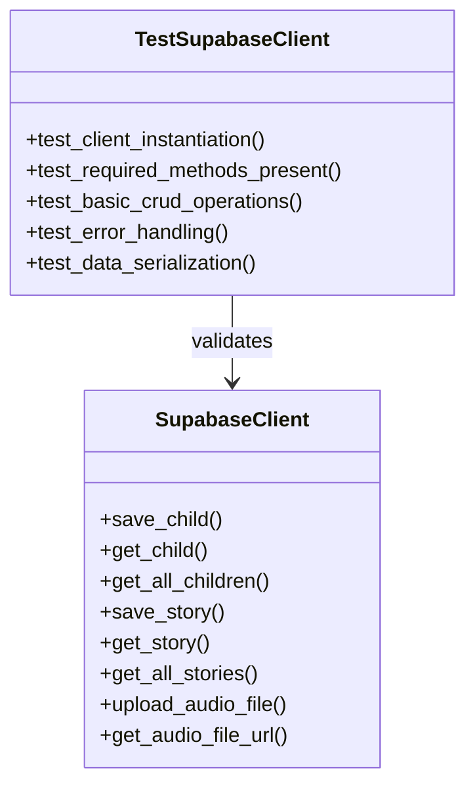

**Diagram sources**
- [test_supabase_client.py](file://test_supabase_client.py#L5-L43)

### Validation Criteria

The test suite verifies:

- **Client Instantiation**: Validates proper initialization with environment variables
- **Method Availability**: Ensures all expected methods are present
- **Basic CRUD Operations**: Tests fundamental create, read, update, delete functionality
- **Error Conditions**: Verifies appropriate error handling for invalid operations

### Integration Testing

Recommended integration testing approaches include:

- **End-to-End Workflows**: Test complete user journeys through database operations
- **Concurrent Access**: Validate thread safety and concurrent operation handling
- **Data Integrity**: Verify data consistency across multiple operations
- **Performance Benchmarks**: Establish baseline performance metrics

**Section sources**
- [test_supabase_client.py](file://test_supabase_client.py#L1-L43)