# Infrastructure Layer

<cite>
**Referenced Files in This Document**
- [src/supabase_client.py](file://src/supabase_client.py)
- [src/elevenlabs_client.py](file://src/elevenlabs_client.py)
- [src/openrouter_client.py](file://src/openrouter_client.py)
- [src/infrastructure/persistence/models.py](file://src/infrastructure/persistence/models.py)
- [src/domain/repositories/base.py](file://src/domain/repositories/base.py)
- [src/domain/repositories/story_repository.py](file://src/domain/repositories/story_repository.py)
- [src/domain/repositories/child_repository.py](file://src/domain/repositories/child_repository.py)
- [src/voice_providers/base_provider.py](file://src/voice_providers/base_provider.py)
- [src/voice_providers/provider_registry.py](file://src/voice_providers/provider_registry.py)
- [src/voice_providers/voice_service.py](file://src/voice_providers/voice_service.py)
- [src/voice_providers/elevenlabs_provider.py](file://src/voice_providers/elevenlabs_provider.py)
- [src/infrastructure/config/settings.py](file://src/infrastructure/config/settings.py)
- [src/core/constants.py](file://src/core/constants.py)
- [supabase/migrations/README.md](file://supabase/migrations/README.md)
- [REFACTORING_COMPLETE.md](file://REFACTORING_COMPLETE.md)
</cite>

## Table of Contents
1. [Introduction](#introduction)
2. [Architecture Overview](#architecture-overview)
3. [External Service Integrations](#external-service-integrations)
4. [Database Persistence Layer](#database-persistence-layer)
5. [Configuration Management](#configuration-management)
6. [Voice Provider Infrastructure](#voice-provider-infrastructure)
7. [Error Handling and Resilience](#error-handling-and-resilience)
8. [Database Schema Evolution](#database-schema-evolution)
9. [Production Readiness](#production-readiness)
10. [Troubleshooting Guide](#troubleshooting-guide)
11. [Performance Optimization](#performance-optimization)

## Introduction

The Infrastructure Layer of the Tale Generator application serves as the foundation for all external integrations and persistent storage. This layer implements the domain interfaces defined in the Domain Layer while providing concrete implementations for database persistence, AI service communication, and voice generation capabilities. The infrastructure layer follows clean architecture principles, maintaining clear separation between external concerns and business logic.

The layer is built around several key responsibilities:
- **External Service Integration**: Managing connections to AI APIs (OpenRouter), voice synthesis services (ElevenLabs), and database systems (Supabase)
- **Repository Implementations**: Concrete implementations of domain repository interfaces using Supabase models
- **Configuration Management**: Type-safe settings management using Pydantic
- **Voice Provider Plugin Architecture**: Extensible audio generation system with fallback capabilities
- **Database Schema Evolution**: Managed migrations for database schema updates

## Architecture Overview

The Infrastructure Layer follows a layered architecture pattern that separates external concerns from business logic:

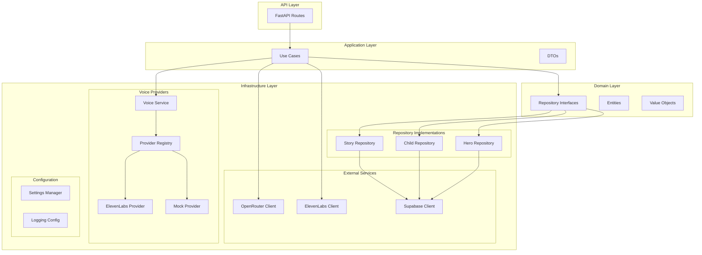

**Diagram sources**
- [src/domain/repositories/base.py](file://src/domain/repositories/base.py#L1-L56)
- [src/supabase_client.py](file://src/supabase_client.py#L1-L914)
- [src/voice_providers/provider_registry.py](file://src/voice_providers/provider_registry.py#L1-L212)

**Section sources**
- [REFACTORING_COMPLETE.md](file://REFACTORING_COMPLETE.md#L107-L136)

## External Service Integrations

### OpenRouter API Client

The OpenRouter client provides intelligent retry mechanisms and comprehensive error handling for AI model interactions:

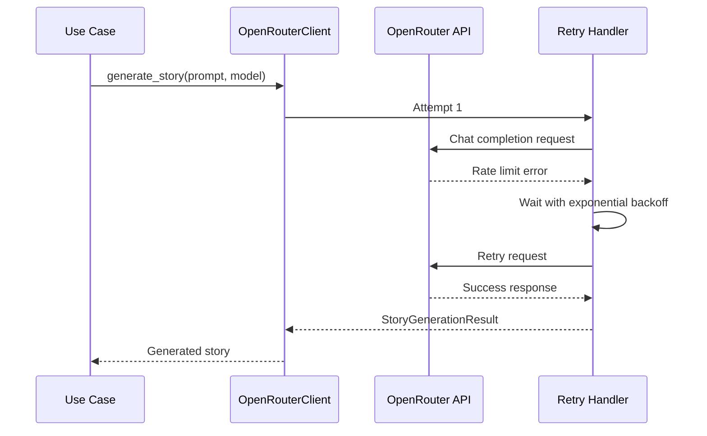

**Diagram sources**
- [src/openrouter_client.py](file://src/openrouter_client.py#L99-L161)

Key features include:
- **Intelligent Retry Logic**: Exponential backoff with configurable retry attempts
- **Model Abstraction**: Support for multiple AI models through enum-based selection
- **Generation Info Tracking**: Detailed metadata about API usage and costs
- **Timeout Management**: Configurable timeouts for external API calls

### ElevenLabs API Client

The ElevenLabs client handles text-to-speech generation with language-aware voice selection:

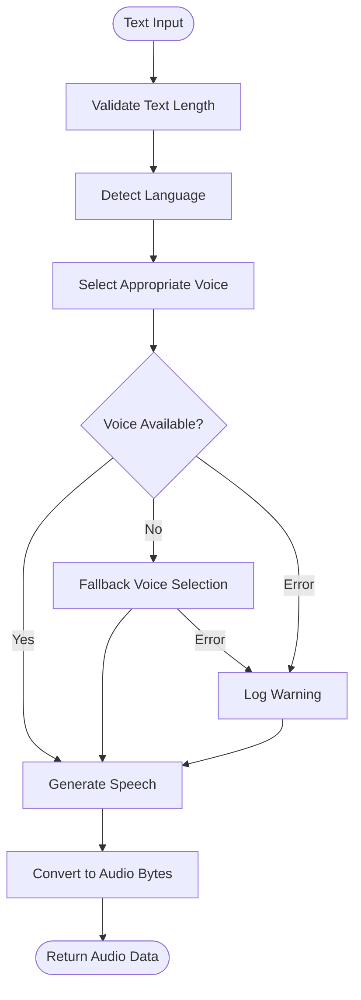

**Diagram sources**
- [src/elevenlabs_client.py](file://src/elevenlabs_client.py#L54-L133)

**Section sources**
- [src/openrouter_client.py](file://src/openrouter_client.py#L1-L161)
- [src/elevenlabs_client.py](file://src/elevenlabs_client.py#L1-L133)

## Database Persistence Layer

### Repository Pattern Implementation

The infrastructure layer implements domain repository interfaces using Supabase as the underlying database:

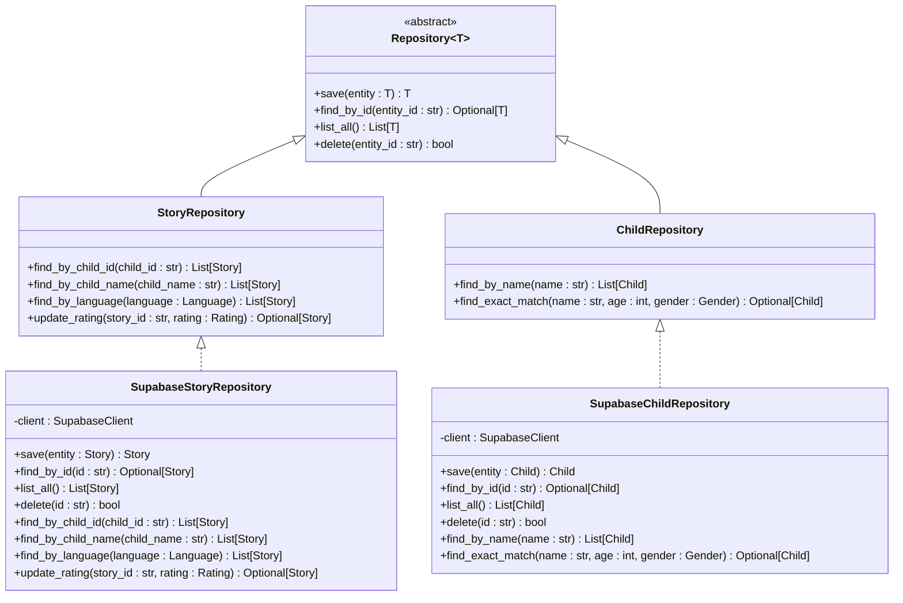

**Diagram sources**
- [src/domain/repositories/base.py](file://src/domain/repositories/base.py#L8-L56)
- [src/domain/repositories/story_repository.py](file://src/domain/repositories/story_repository.py#L10-L61)
- [src/domain/repositories/child_repository.py](file://src/domain/repositories/child_repository.py#L10-L38)

### Supabase Model Integration

The infrastructure defines database models that map to Supabase tables:

| Model | Purpose | Key Fields | Relationships |
|-------|---------|------------|---------------|
| `ChildDB` | Child profile storage | `id`, `name`, `age`, `gender`, `interests` | One-to-many with Stories |
| `HeroDB` | Character profile storage | `id`, `name`, `gender`, `appearance`, `personality_traits` | One-to-many with Stories |
| `StoryDB` | Story content and metadata | `id`, `title`, `content`, `moral`, `child_id`, `language` | Many-to-one with Children/Heroes |

**Section sources**
- [src/infrastructure/persistence/models.py](file://src/infrastructure/persistence/models.py#L1-L55)
- [src/domain/repositories/story_repository.py](file://src/domain/repositories/story_repository.py#L1-L61)
- [src/domain/repositories/child_repository.py](file://src/domain/repositories/child_repository.py#L1-L38)

## Configuration Management

### Pydantic Settings Architecture

The configuration system uses Pydantic Settings for type-safe, environment-variable-based configuration:

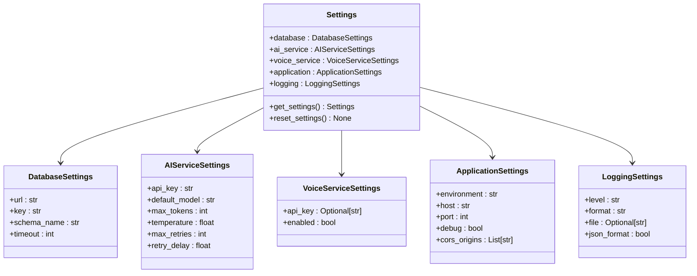

**Diagram sources**
- [src/infrastructure/config/settings.py](file://src/infrastructure/config/settings.py#L117-L169)

### Environment Variable Management

Configuration is managed through environment variables with sensible defaults:

| Category | Environment Variables | Purpose |
|----------|----------------------|---------|
| Database | `SUPABASE_URL`, `SUPABASE_KEY` | Supabase connection details |
| AI Service | `OPENROUTER_API_KEY` | OpenRouter API authentication |
| Voice Service | `ELEVENLABS_API_KEY` | ElevenLabs API authentication |
| Application | `ENVIRONMENT`, `PORT` | Runtime configuration |
| Logging | `LOG_LEVEL`, `LOG_FORMAT` | Logging behavior |

**Section sources**
- [src/infrastructure/config/settings.py](file://src/infrastructure/config/settings.py#L1-L169)
- [src/core/constants.py](file://src/core/constants.py#L1-L38)

## Voice Provider Infrastructure

### Plugin Architecture

The voice provider system implements a plugin architecture enabling extensible audio generation:

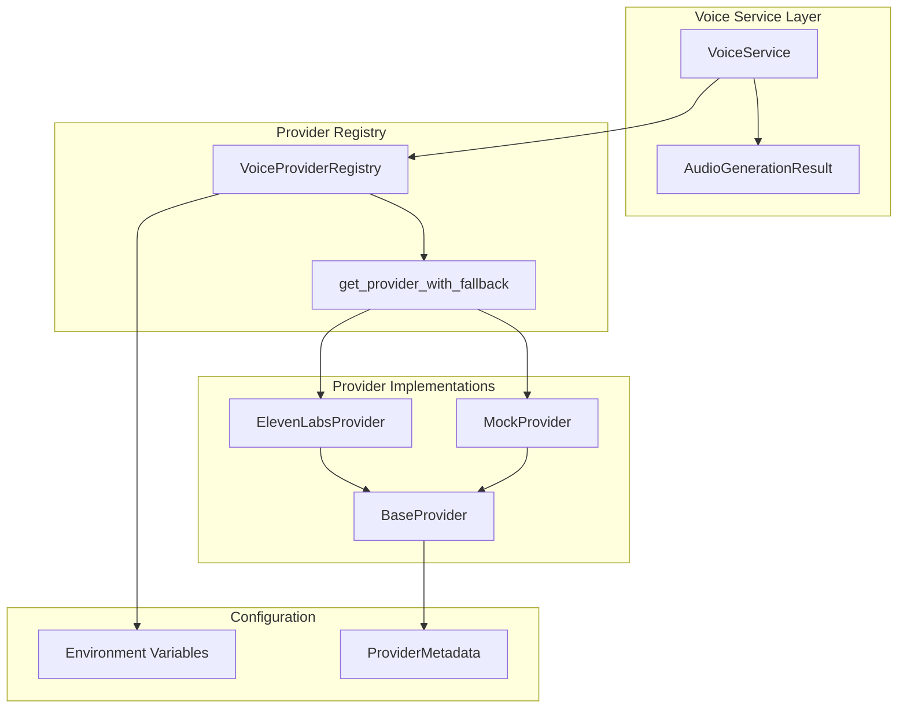

**Diagram sources**
- [src/voice_providers/voice_service.py](file://src/voice_providers/voice_service.py#L25-L236)
- [src/voice_providers/provider_registry.py](file://src/voice_providers/provider_registry.py#L12-L212)

### Provider Capabilities

Each voice provider implements the base provider interface with specific capabilities:

| Provider | Streaming | Max Text Length | Supported Formats | Languages |
|----------|-----------|-----------------|-------------------|-----------|
| ElevenLabs | ✓ | 5000 chars | MP3, PCM | 12+ languages |
| Mock | ✗ | Unlimited | MP3 | N/A |

### Fallback Strategy

The provider registry implements sophisticated fallback logic:

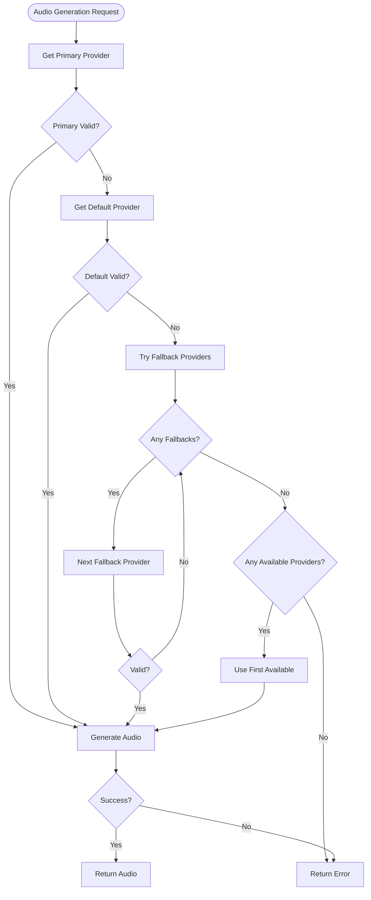

**Diagram sources**
- [src/voice_providers/provider_registry.py](file://src/voice_providers/provider_registry.py#L100-L140)

**Section sources**
- [src/voice_providers/base_provider.py](file://src/voice_providers/base_provider.py#L1-L97)
- [src/voice_providers/provider_registry.py](file://src/voice_providers/provider_registry.py#L1-L212)
- [src/voice_providers/voice_service.py](file://src/voice_providers/voice_service.py#L1-L236)
- [src/voice_providers/elevenlabs_provider.py](file://src/voice_providers/elevenlabs_provider.py#L1-L220)

## Error Handling and Resilience

### Retry Mechanisms

The infrastructure implements multiple layers of retry logic:

| Component | Retry Strategy | Max Attempts | Backoff |
|-----------|---------------|--------------|---------|
| OpenRouter Client | Exponential backoff | 3 | 1s → 2s → 4s |
| ElevenLabs Client | Immediate retry | 1 | N/A |
| Supabase Client | Connection timeout | N/A | 10s |

### Error Classification

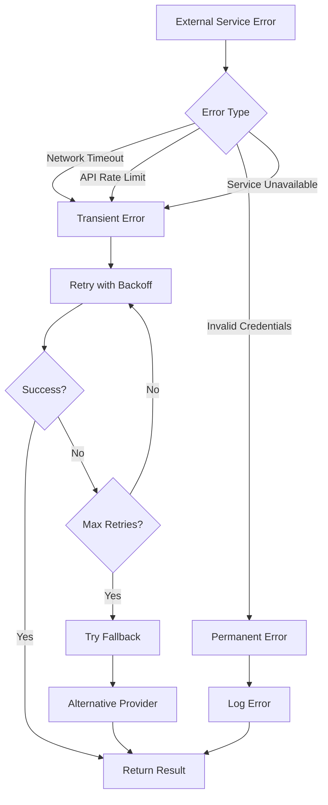

### Connection Timeouts

External service clients implement configurable timeouts:

- **Database**: 10-second timeout for all operations
- **AI Services**: 30-second timeout for generation requests
- **Voice Services**: 15-second timeout for speech generation

**Section sources**
- [src/openrouter_client.py](file://src/openrouter_client.py#L119-L161)
- [src/supabase_client.py](file://src/supabase_client.py#L33-L42)

## Database Schema Evolution

### Migration System

The application uses a structured migration system for database schema evolution:

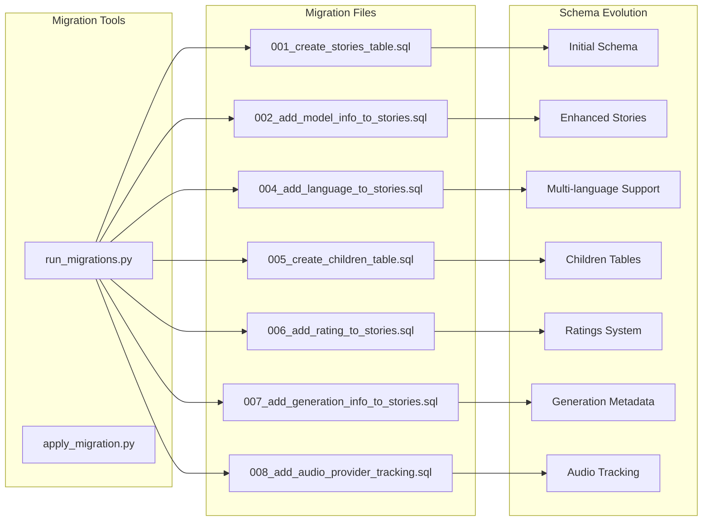

**Diagram sources**
- [supabase/migrations/README.md](file://supabase/migrations/README.md#L1-L50)

### Migration Best Practices

The migration system follows these principles:
- **Version Control**: Each migration is versioned and reversible
- **Incremental Changes**: Small, focused changes minimize risk
- **Data Preservation**: Data migrations preserve existing records
- **Testing Support**: Migrations can be tested independently

**Section sources**
- [supabase/migrations/README.md](file://supabase/migrations/README.md#L1-L50)

## Production Readiness

### Clean Integration Boundaries

The infrastructure layer maintains strict separation between domains:

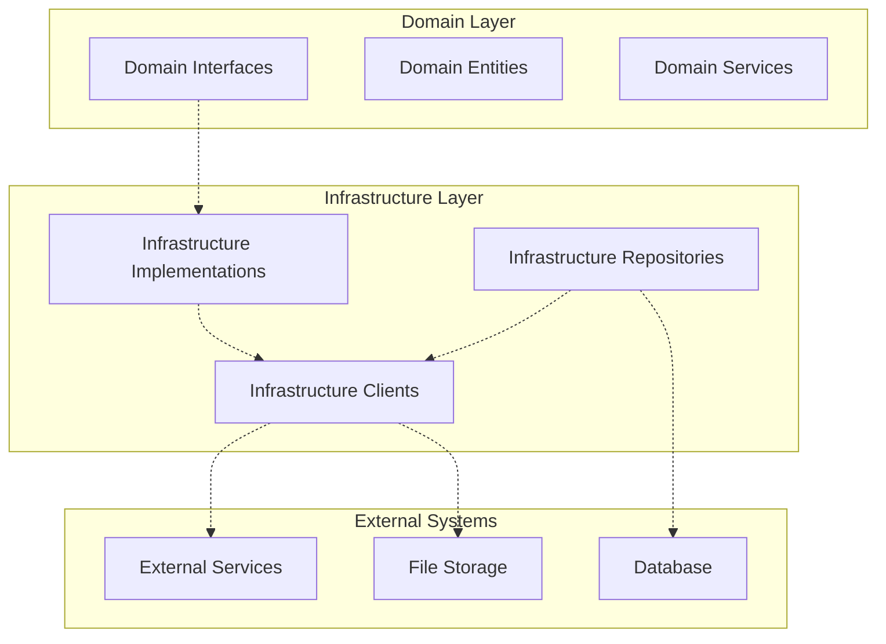

### Quality Assurance

The infrastructure layer incorporates multiple quality assurance measures:

- **Type Safety**: Complete type hints throughout
- **Validation**: Pydantic validation for all inputs
- **Logging**: Structured logging with correlation IDs
- **Monitoring**: Health checks and metrics collection
- **Testing**: Comprehensive unit and integration tests

**Section sources**
- [REFACTORING_COMPLETE.md](file://REFACTORING_COMPLETE.md#L1-L421)

## Troubleshooting Guide

### Common Issues and Solutions

#### Connection Timeouts

**Symptoms**: Requests hang or fail with timeout errors
**Causes**: Network latency, external service overload, incorrect timeout configuration
**Solutions**:
- Verify network connectivity to external services
- Check external service status pages
- Adjust timeout values in configuration
- Implement circuit breaker pattern for external calls

#### Provider Failures

**Symptoms**: Voice generation fails consistently
**Causes**: API key issues, quota exceeded, service unavailable
**Solutions**:
- Verify API keys are correctly configured
- Check service quotas and billing
- Enable fallback providers in configuration
- Monitor service health indicators

#### Database Connection Issues

**Symptoms**: Database operations fail or hang
**Causes**: Connection pool exhaustion, schema mismatches, permission issues
**Solutions**:
- Verify database credentials and connectivity
- Check connection pool configuration
- Run database migrations
- Review database logs for errors

### Debugging Strategies

#### Enable Debug Logging

```python
import logging
logging.getLogger("tale_generator").setLevel(logging.DEBUG)
```

#### Monitor External Service Health

```python
# Check provider availability
providers = voice_service.get_available_providers()
print(f"Available providers: {providers}")

# Test individual providers
for provider_name in providers:
    provider = registry.get_provider(provider_name)
    if provider.validate_configuration():
        print(f"{provider_name} is healthy")
```

#### Database Connectivity Testing

```python
# Test Supabase connection
try:
    client = SupabaseClient()
    # Test basic operations
    client.get_all_stories()
    print("Database connection successful")
except Exception as e:
    print(f"Database connection failed: {e}")
```

## Performance Optimization

### Caching Strategies

The infrastructure layer supports various caching approaches:

#### Client-Side Caching
- **Voice Provider Lists**: Cache available voices to reduce API calls
- **Language Detection**: Cache language detection results
- **Model Information**: Cache AI model capabilities

#### Database Caching
- **Connection Pooling**: Reuse database connections
- **Query Result Caching**: Cache frequently accessed data
- **Schema Metadata**: Cache table structure information

### Async Operations

The architecture supports asynchronous operations where appropriate:

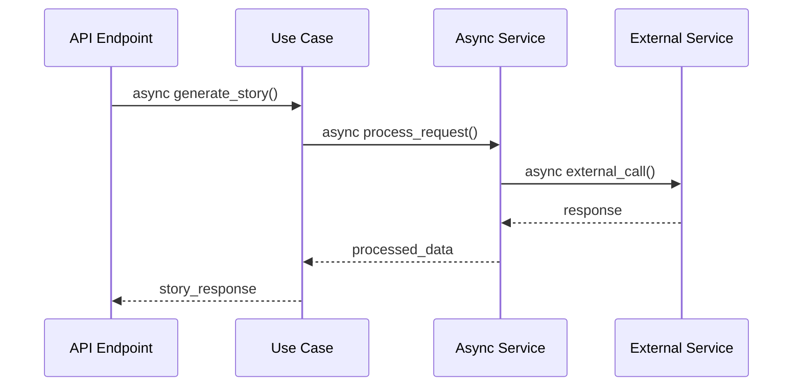

### Monitoring and Metrics

Key performance indicators to monitor:

| Metric | Purpose | Threshold |
|--------|---------|-----------|
| API Response Time | External service performance | < 5s |
| Database Query Time | Database performance | < 2s |
| Voice Generation Time | Audio processing performance | < 30s |
| Error Rate | System reliability | < 1% |
| Provider Availability | Service health | > 95% |

### Optimization Tips

1. **Connection Management**: Use connection pooling for database and external services
2. **Batch Operations**: Group multiple database operations when possible
3. **Async Processing**: Use async patterns for I/O-bound operations
4. **Resource Cleanup**: Properly close connections and resources
5. **Monitoring**: Implement comprehensive monitoring and alerting

**Section sources**
- [src/core/constants.py](file://src/core/constants.py#L28-L38)