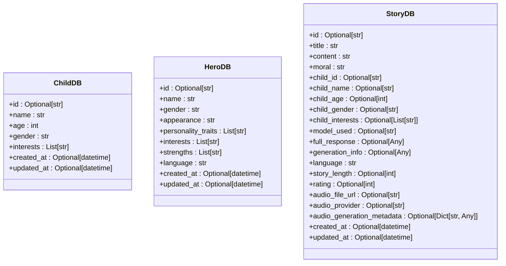
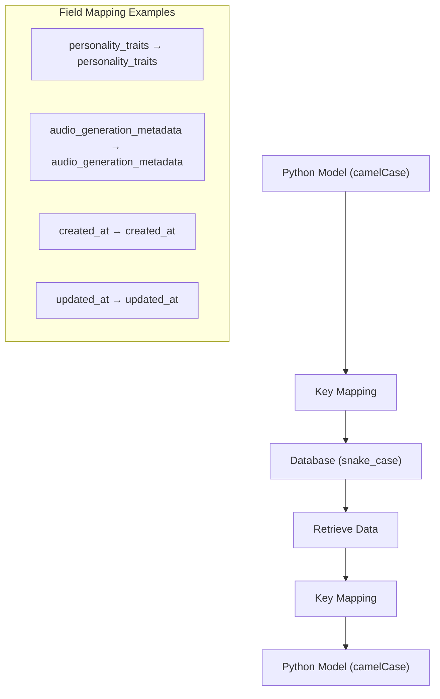
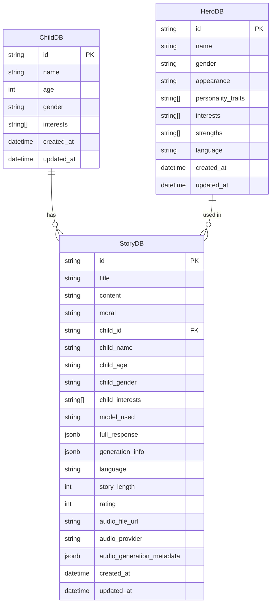

# Data Models

<cite>
**Referenced Files in This Document**   
- [models.py](file://src/infrastructure/persistence/models.py)
- [entities.py](file://src/domain/entities.py)
- [value_objects.py](file://src/domain/value_objects.py)
- [supabase_client.py](file://src/supabase_client.py)
- [001_create_stories_table.sql](file://supabase/migrations/001_create_stories_table.sql)
- [005_create_children_table.sql](file://supabase/migrations/005_create_children_table.sql)
- [008_add_audio_provider_tracking.sql](file://supabase/migrations/008_add_audio_provider_tracking.sql)
- [dto.py](file://src/application/dto.py)
</cite>

## Table of Contents
1. [Introduction](#introduction)
2. [Core Data Models](#core-data-models)
3. [Model Field Definitions](#model-field-definitions)
4. [Data Validation and Pydantic Usage](#data-validation-and-pydantic-usage)
5. [Database Mapping Strategy](#database-mapping-strategy)
6. [Model Relationships and Dependencies](#model-relationships-and-dependencies)
7. [Extending Models and Backward Compatibility](#extending-models-and-backward-compatibility)
8. [Usage Examples](#usage-examples)

## Introduction
This document provides comprehensive documentation for the Tale Generator application's persistence layer data models. The system uses Pydantic BaseModel classes to define database models for child profiles, hero characters, and generated stories. These models serve as the interface between the application logic and the PostgreSQL database via Supabase, ensuring data validation, serialization, and proper type handling. The models are designed with optional fields for database-generated values like IDs and timestamps, while implementing a clear mapping strategy between Python's camelCase naming convention and PostgreSQL's snake_case convention.

**Section sources**
- [models.py](file://src/infrastructure/persistence/models.py#L1-L54)

## Core Data Models
The Tale Generator application implements three primary data models in the persistence layer: ChildDB, HeroDB, and StoryDB. These models are defined in the models.py file and extend Pydantic's BaseModel for data validation and serialization. The ChildDB model stores child profile information including name, age, gender, and interests. The HeroDB model represents hero characters used in stories, containing attributes like name, appearance, personality traits, and language. The StoryDB model persists generated stories with comprehensive metadata including title, content, moral, language, rating, and audio information. All models include optional ID fields and timestamp fields (created_at, updated_at) that are populated by the database.

**Diagram sources**
- [models.py](file://src/infrastructure/persistence/models.py#L8-L54)

**Section sources**
- [models.py](file://src/infrastructure/persistence/models.py#L8-L54)

## Model Field Definitions
Each data model contains specific fields with defined data types and constraints. The ChildDB model includes fields for child identification and profile information: id (Optional[str]), name (str), age (int), gender (str), interests (List[str]), and timestamps. The HeroDB model contains hero-specific attributes: id (Optional[str]), name (str), gender (str), appearance (str), personality_traits (List[str]), interests (List[str]), strengths (List[str]), language (str), and timestamps. The StoryDB model has comprehensive story metadata: id (Optional[str]), title (str), content (str), moral (str), child relationship fields (child_id, child_name, etc.), generation metadata (model_used, full_response), language (str), story_length (Optional[int]), rating (Optional[int]), audio information (audio_file_url, audio_provider, audio_generation_metadata), and timestamps. All ID and timestamp fields are optional to accommodate database generation.

**Section sources**
- [models.py](file://src/infrastructure/persistence/models.py#L8-L54)

## Data Validation and Pydantic Usage
The data models leverage Pydantic BaseModel for robust data validation and serialization. By extending BaseModel, the models automatically validate field types and provide serialization methods like model_dump(). The models use Optional type hints for fields that are populated by the database (IDs, timestamps), allowing these fields to be None during model instantiation. Pydantic's validation ensures that required fields like name, age, and interests in ChildDB are present and of the correct type. The models are used throughout the application for data validation when saving to or retrieving from the database, ensuring data integrity. The integration with Pydantic also facilitates JSON serialization for API responses and database operations.

**Section sources**
- [models.py](file://src/infrastructure/persistence/models.py#L3-L54)
- [supabase_client.py](file://src/supabase_client.py#L113)
- [dto.py](file://src/application/dto.py#L4)

## Database Mapping Strategy
The application implements a deliberate mapping strategy between Python's camelCase naming convention and PostgreSQL's snake_case convention. When persisting data to the database, the application maps camelCase field names from the Pydantic models to snake_case column names in PostgreSQL. This mapping is handled in the Supabase client methods, which convert model attributes to database columns using explicit key mappings. For example, the Python field "personality_traits" maps to the database column "personality_traits", while "audio_generation_metadata" maps directly to the same snake_case column name. This strategy maintains Python coding standards while adhering to PostgreSQL naming conventions. The mapping also handles datetime serialization, converting Python datetime objects to ISO format strings for database storage.

**Diagram sources**
- [supabase_client.py](file://src/supabase_client.py#L117-L125)
- [supabase_client.py](file://src/supabase_client.py#L281-L291)

**Section sources**
- [supabase_client.py](file://src/supabase_client.py#L112-L137)
- [supabase_client.py](file://src/supabase_client.py#L277-L302)

## Model Relationships and Dependencies
The data models exhibit clear relationships and dependencies that reflect the application's domain logic. The StoryDB model has a direct relationship with ChildDB through the child_id field, establishing a foreign key relationship in the database. This relationship allows stories to be associated with specific child profiles while maintaining referential integrity. The StoryDB model also incorporates denormalized child data (child_name, child_age, etc.) to optimize read performance and ensure story persistence even if the original child profile is modified or deleted. The HeroDB model stands as an independent entity, providing predefined hero characters that can be referenced in story generation. The migration files show the evolution of these relationships, with the child_id column added to stories in migration 005, establishing the formal relationship between children and stories.

**Diagram sources**
- [models.py](file://src/infrastructure/persistence/models.py#L8-L54)
- [005_create_children_table.sql](file://supabase/migrations/005_create_children_table.sql#L18-L19)

**Section sources**
- [models.py](file://src/infrastructure/persistence/models.py#L8-L54)
- [005_create_children_table.sql](file://supabase/migrations/005_create_children_table.sql#L1-L47)

## Extending Models and Backward Compatibility
The data models are designed to support extension while maintaining backward compatibility. The incremental migration strategy demonstrated in the supabase/migrations directory shows how new fields can be added to existing tables without disrupting existing data. For example, the audio_provider and audio_generation_metadata fields were added to the stories table in migration 008 to support voice provider tracking. The use of Optional type hints for non-essential fields allows new attributes to be introduced without requiring immediate population of existing records. When extending models, developers should follow the pattern of creating new migration files that add columns with appropriate constraints and default values. The Pydantic models should be updated to include new fields with Optional type hints if the field is not required, ensuring that existing data can be properly deserialized even when new fields are absent.

**Section sources**
- [models.py](file://src/infrastructure/persistence/models.py#L32-L54)
- [008_add_audio_provider_tracking.sql](file://supabase/migrations/008_add_audio_provider_tracking.sql#L1-L24)

## Usage Examples
The data models are instantiated and used throughout the application for database operations. When creating a new child profile, a ChildDB instance is created with required fields (name, age, gender, interests) and saved via the Supabase client, which handles ID generation and timestamp population. Similarly, hero characters are instantiated as HeroDB objects and persisted to the database. Story generation results are captured in StoryDB instances that include all relevant metadata before being saved. The models are also used when retrieving data from the database, with the Supabase client mapping database records back to model instances. The Pydantic model_dump() method is used to convert model instances to dictionaries for database operations, while the ** unpacking operator reconstructs models from database records.

**Section sources**
- [supabase_client.py](file://src/supabase_client.py#L113)
- [supabase_client.py](file://src/supabase_client.py#L153)
- [populate_heroes.py](file://src/populate_heroes.py#L38)