# Database Client

<cite>
**Referenced Files in This Document**
- [supabase_client.py](file://src/supabase_client.py)
- [models.py](file://src/models.py)
- [infrastructure/persistence/models.py](file://src/infrastructure/persistence/models.py)
- [domain/entities.py](file://src/domain/entities.py)
- [domain/repositories/base.py](file://src/domain/repositories/base.py)
- [test_supabase_client.py](file://test_supabase_client.py)
- [test_supabase_connection.py](file://test_supabase_connection.py)
- [settings.py](file://src/infrastructure/config/settings.py)
- [README.md](file://README.md)
</cite>

## Table of Contents
1. [Introduction](#introduction)
2. [Architecture Overview](#architecture-overview)
3. [Environment Configuration](#environment-configuration)
4. [Core Database Operations](#core-database-operations)
5. [Key Mapping Strategy](#key-mapping-strategy)
6. [Error Handling and Exception Management](#error-handling-and-exception-management)
7. [Specialized Query Methods](#specialized-query-methods)
8. [Audio File Management](#audio-file-management)
9. [Connection Management](#connection-management)
10. [Performance Considerations](#performance-considerations)
11. [Usage Patterns and Best Practices](#usage-patterns-and-best-practices)
12. [Troubleshooting Guide](#troubleshooting-guide)

## Introduction

The SupabaseClient is a comprehensive database abstraction layer that provides seamless integration with Supabase for the Tale Generator application. It serves as the primary interface for all database operations, handling CRUD operations for ChildDB, HeroDB, and StoryDB models while managing the translation between Python's camelCase naming convention and PostgreSQL's snake_case schema.

The client implements robust error handling, connection management, and specialized query functionality to support the application's requirements for story generation, child management, and audio file storage. It operates within the 'tales' schema and provides transaction-safe operations with comprehensive logging and exception wrapping.

## Architecture Overview

The SupabaseClient follows a layered architecture pattern that separates concerns between database operations, data modeling, and application logic:

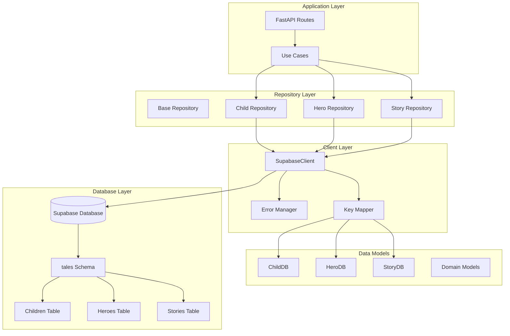

**Diagram sources**
- [supabase_client.py](file://src/supabase_client.py#L19-L42)
- [domain/repositories/base.py](file://src/domain/repositories/base.py#L9-L56)

**Section sources**
- [supabase_client.py](file://src/supabase_client.py#L19-L42)
- [domain/repositories/base.py](file://src/domain/repositories/base.py#L9-L56)

## Environment Configuration

The SupabaseClient relies on environment variables for secure credential management and configuration. The client automatically loads these variables using Python's dotenv library and validates their presence during initialization.

### Required Environment Variables

| Variable | Purpose | Example Value | Security Level |
|----------|---------|---------------|----------------|
| `SUPABASE_URL` | Supabase project endpoint | `https://your-project.supabase.co` | High |
| `SUPABASE_KEY` | API authentication key | `eyJhbGciOiJIUzI1NiIs...` | High |

### Configuration Implementation

The client initializes with specific timeout and schema configurations:

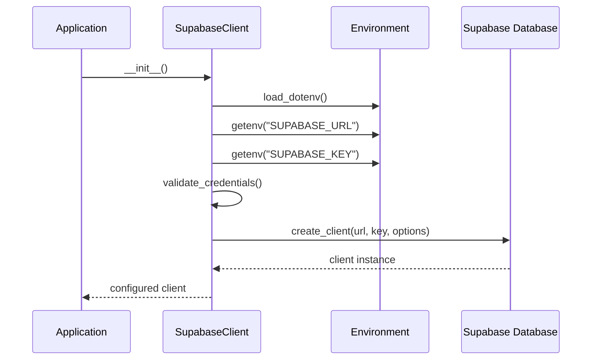

**Diagram sources**
- [supabase_client.py](file://src/supabase_client.py#L22-L42)
- [settings.py](file://src/infrastructure/config/settings.py#L16-L29)

### Schema Configuration

The client specifically targets the 'tales' schema, which contains the application's core tables:

- **children**: Stores child profiles with personalization data
- **heroes**: Contains hero profiles for story generation
- **stories**: Holds generated stories with metadata and audio references

**Section sources**
- [supabase_client.py](file://src/supabase_client.py#L22-L42)
- [settings.py](file://src/infrastructure/config/settings.py#L16-L29)

## Core Database Operations

The SupabaseClient provides comprehensive CRUD operations for all three primary data models, each with specialized handling for data transformation, validation, and error management.

### ChildDB Operations

ChildDB operations handle the creation, retrieval, and management of child profiles used for story personalization:

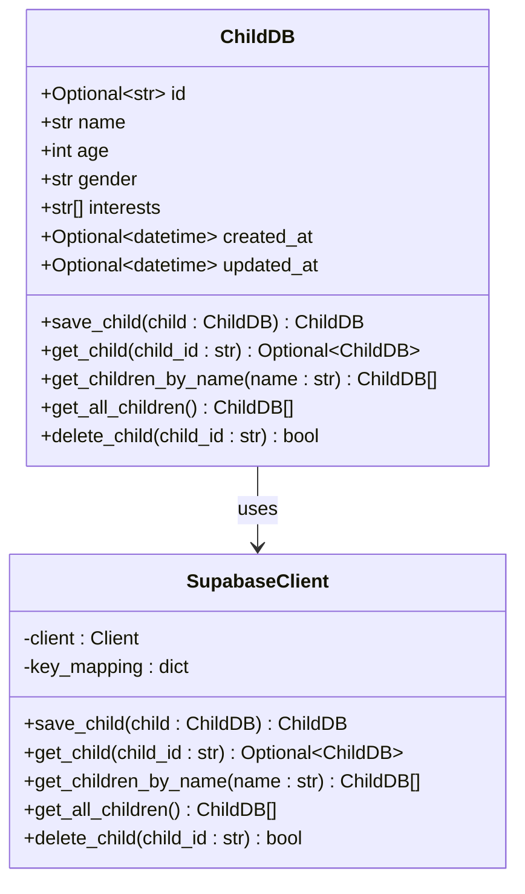

**Diagram sources**
- [supabase_client.py](file://src/supabase_client.py#L102-L158)
- [models.py](file://src/models.py#L65-L74)

### HeroDB Operations

HeroDB operations manage hero profiles for story generation, including language-specific handling:

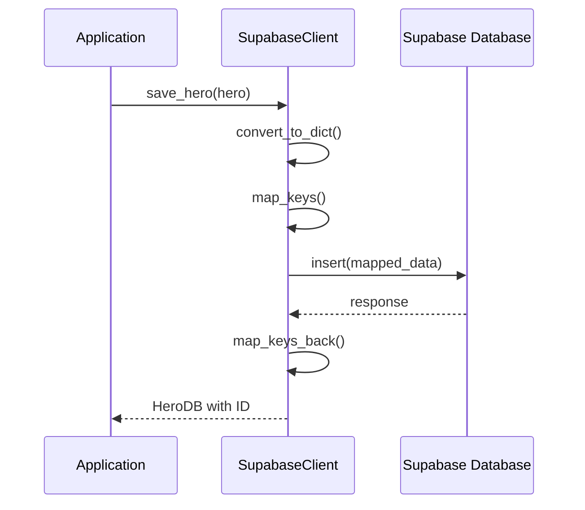

**Diagram sources**
- [supabase_client.py](file://src/supabase_client.py#L266-L328)
- [supabase_client.py](file://src/supabase_client.py#L445-L508)

### StoryDB Operations

StoryDB operations handle the most complex data model, supporting full-text search, filtering, and rating functionality:

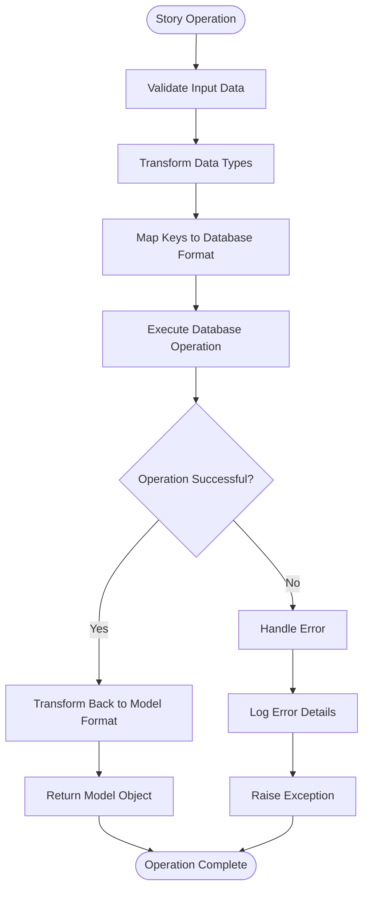

**Diagram sources**
- [supabase_client.py](file://src/supabase_client.py#L534-L592)
- [supabase_client.py](file://src/supabase_client.py#L595-L640)

**Section sources**
- [supabase_client.py](file://src/supabase_client.py#L102-L158)
- [supabase_client.py](file://src/supabase_client.py#L266-L328)
- [supabase_client.py](file://src/supabase_client.py#L534-L592)

## Key Mapping Strategy

The SupabaseClient implements a sophisticated key mapping system that handles the conversion between Python's camelCase naming convention and PostgreSQL's snake_case schema. This ensures seamless data flow between the application layer and database while maintaining type safety and data integrity.

### Mapping Implementation

The key mapping system uses predefined dictionaries for each model, ensuring consistent transformation across all operations:

| Python Field | Database Field | Transformation Type | Validation |
|--------------|----------------|-------------------|------------|
| `name` | `name` | Identity | Required |
| `age` | `age` | Identity | Integer Range |
| `gender` | `gender` | Identity | Enum Validation |
| `interests` | `interests` | Array | Non-empty |
| `created_at` | `created_at` | DateTime | ISO Format |
| `updated_at` | `updated_at` | DateTime | ISO Format |
| `language` | `language` | Enum/String | Language Codes |

### Data Type Transformation

The client handles complex data type transformations, particularly for datetime objects and enum values:

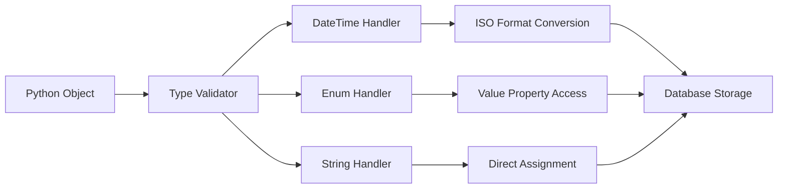

**Diagram sources**
- [supabase_client.py](file://src/supabase_client.py#L130-L136)
- [supabase_client.py](file://src/supabase_client.py#L304-L306)

### Specialized Handling for Enums

The client provides special handling for Language enums, converting between enum objects and their string values:

- **HeroDB Language**: Handles Language enum serialization
- **StoryDB Language**: Manages language code storage
- **Consistency**: Ensures uniform representation across operations

**Section sources**
- [supabase_client.py](file://src/supabase_client.py#L115-L158)
- [supabase_client.py](file://src/supabase_client.py#L279-L308)
- [supabase_client.py](file://src/supabase_client.py#L540-L572)

## Error Handling and Exception Management

The SupabaseClient implements a comprehensive error handling strategy that provides meaningful feedback while maintaining security and operational reliability. The error management system wraps database exceptions with contextual information and logs detailed error traces.

### Exception Wrapping Strategy

The client employs a consistent approach to exception handling across all operations:

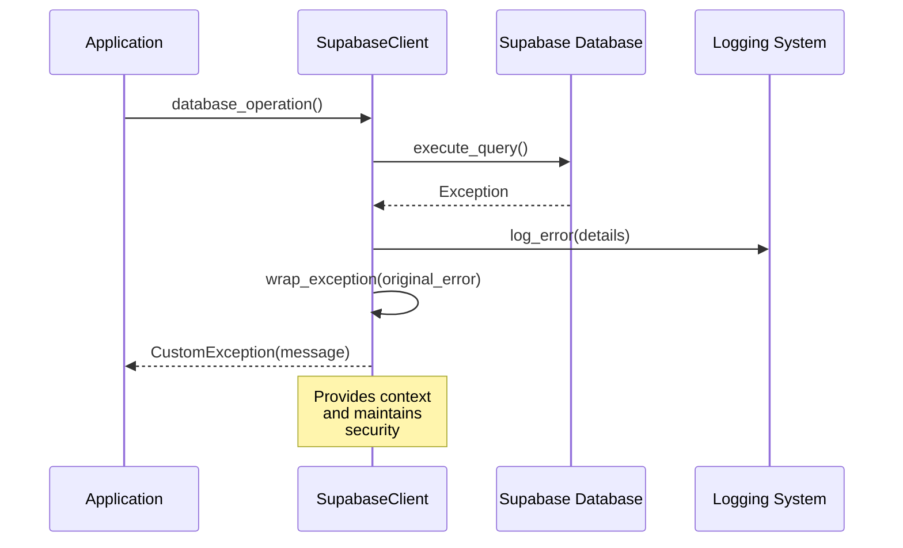

**Diagram sources**
- [supabase_client.py](file://src/supabase_client.py#L157-L158)
- [supabase_client.py](file://src/supabase_client.py#L327-L328)

### Error Categories and Responses

The client handles several categories of errors with specific response strategies:

| Error Category | Handling Strategy | Response Type | Logging Level |
|----------------|------------------|---------------|---------------|
| Authentication | Immediate failure | ValueError | ERROR |
| Connection | Retry with timeout | TimeoutException | WARN |
| Data Validation | Sanitized error | ValidationError | ERROR |
| Business Logic | Contextual message | CustomException | INFO |
| Network Issues | Graceful degradation | ConnectionError | WARN |

### Logging Integration

Each operation includes comprehensive logging with structured data:

- **Operation Context**: Method name and parameters
- **Error Details**: Original exception and stack trace
- **Security**: Sensitive data redacted
- **Performance**: Execution timing information

**Section sources**
- [supabase_client.py](file://src/supabase_client.py#L157-L158)
- [supabase_client.py](file://src/supabase_client.py#L327-L328)
- [supabase_client.py](file://src/supabase_client.py#L833-L845)

## Specialized Query Methods

The SupabaseClient provides several specialized query methods that go beyond basic CRUD operations, offering optimized access patterns for common application scenarios.

### Child Name-Based Queries

The `get_children_by_name` method enables efficient retrieval of children by name, supporting both exact matches and partial searches:

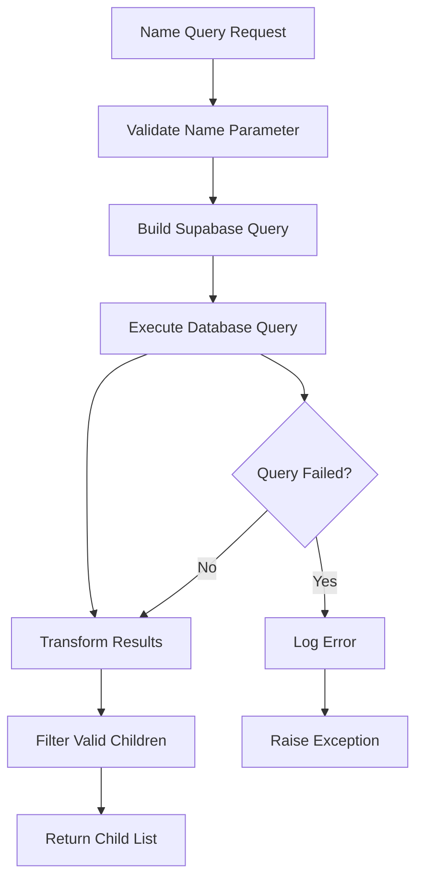

**Diagram sources**
- [supabase_client.py](file://src/supabase_client.py#L195-L230)

### Story Retrieval Methods

The client provides multiple story retrieval strategies optimized for different use cases:

| Method | Purpose | Filtering Criteria | Performance Notes |
|--------|---------|-------------------|-------------------|
| `get_stories_by_child` | Child-specific stories | Child name exact match | Index-friendly |
| `get_stories_by_child_id` | ID-based retrieval | Child ID exact match | Primary key access |
| `get_stories_by_language` | Language filtering | Language code match | Efficient indexing |
| `get_all_stories` | Complete catalog | No filters | Full table scan |

### Advanced Query Patterns

The client supports complex query patterns through Supabase's query builder:

- **Chained Conditions**: Multiple WHERE clauses
- **Sorting Options**: Order by creation date, rating, etc.
- **Pagination Support**: Offset and limit parameters
- **Full-Text Search**: Text-based content searching

**Section sources**
- [supabase_client.py](file://src/supabase_client.py#L195-L230)
- [supabase_client.py](file://src/supabase_client.py#L642-L732)
- [supabase_client.py](file://src/supabase_client.py#L777-L822)

## Audio File Management

The SupabaseClient includes comprehensive audio file management capabilities, enabling the storage and retrieval of generated story audio files within the Supabase storage system.

### Storage Architecture

Audio files are organized in a hierarchical structure within the 'tales' storage bucket:

```
stories/
├── {story_id}/
│   ├── {filename}.mp3
│   └── {filename}_backup.mp3
└── {another_story_id}/
    └── {filename}.mp3
```

### Upload Process

The audio upload process involves multiple steps for security and reliability:

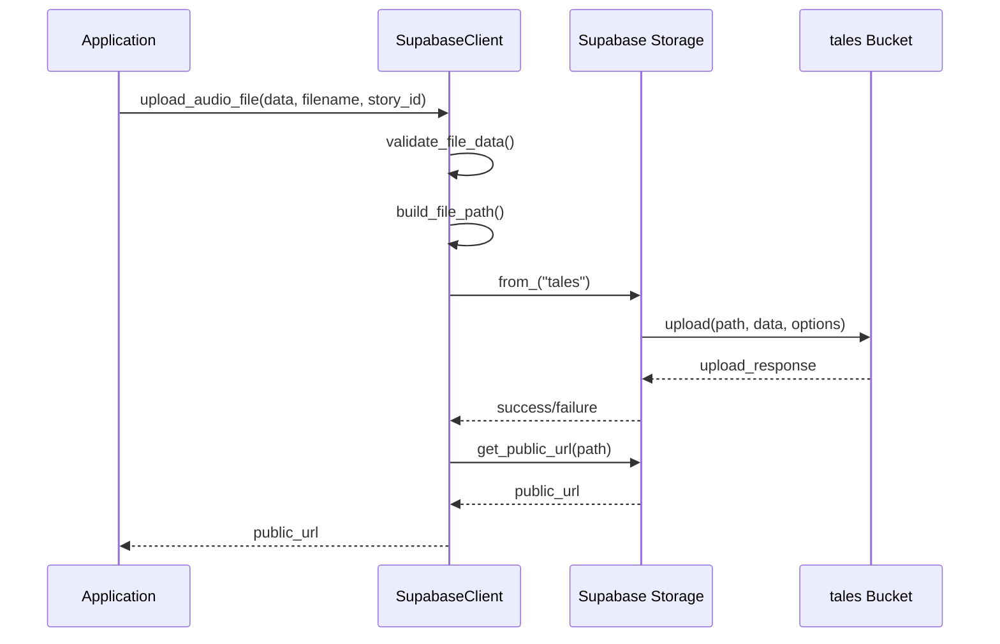

**Diagram sources**
- [supabase_client.py](file://src/supabase_client.py#L44-L78)

### URL Generation and Security

The client generates public URLs for audio files while maintaining security controls:

- **Public Access**: Generated URLs provide public access to audio files
- **Path Structure**: Hierarchical organization prevents conflicts
- **Content Type**: Proper MIME type specification (audio/mpeg)
- **Expiration**: URLs remain valid for configured duration

### Error Handling for Audio Operations

Audio operations include specific error handling for network and storage issues:

- **Upload Failures**: Network timeouts and storage quota exceeded
- **URL Generation**: Path not found or access denied
- **Validation**: File format and size verification
- **Cleanup**: Automatic cleanup of failed uploads

**Section sources**
- [supabase_client.py](file://src/supabase_client.py#L44-L78)
- [supabase_client.py](file://src/supabase_client.py#L83-L100)

## Connection Management

The SupabaseClient implements robust connection management strategies that ensure reliable database access while optimizing performance and resource utilization.

### Client Initialization

The client establishes connections with specific configuration parameters:

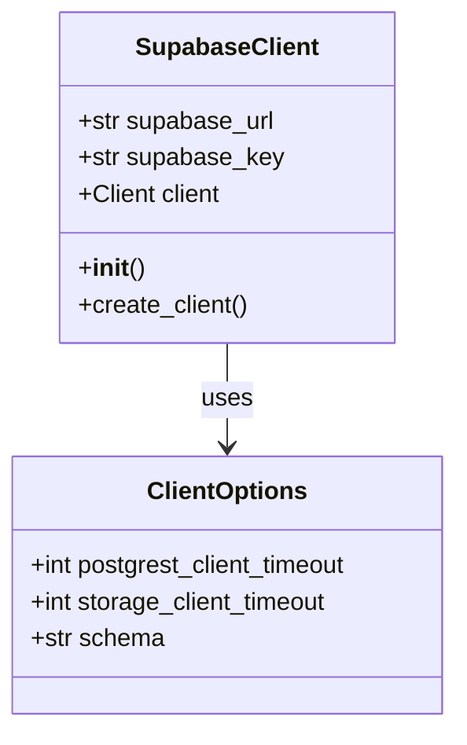

**Diagram sources**
- [supabase_client.py](file://src/supabase_client.py#L33-L42)

### Timeout Configuration

The client uses conservative timeout settings to balance reliability and performance:

| Component | Timeout Setting | Rationale |
|-----------|----------------|-----------|
| PostgREST Client | 10 seconds | Prevents hanging queries |
| Storage Client | 10 seconds | Handles audio file operations |
| Schema Selection | tales | Explicit schema targeting |

### Connection Validation

The client performs immediate validation of database connectivity:

- **Credential Verification**: Validates URL and API key presence
- **Schema Access**: Confirms access to 'tales' schema
- **Network Connectivity**: Tests basic database reachability
- **Error Reporting**: Provides clear failure messages

### Resource Management

The client manages resources efficiently:

- **Single Instance**: Uses singleton pattern for connection reuse
- **Lazy Loading**: Defers connection establishment until needed
- **Graceful Shutdown**: Proper cleanup of database connections
- **Memory Efficiency**: Minimal memory footprint for operations

**Section sources**
- [supabase_client.py](file://src/supabase_client.py#L22-L42)

## Performance Considerations

The SupabaseClient incorporates several performance optimization strategies to ensure efficient database operations and responsive application behavior.

### Query Optimization Strategies

The client implements several query optimization techniques:

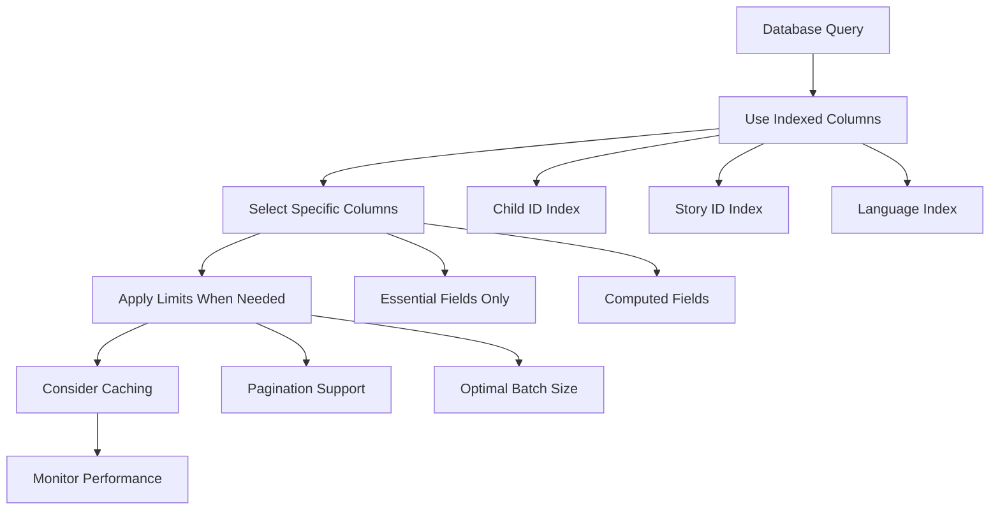

### Index Recommendations

Based on the client's query patterns, the following indexes are recommended:

| Table | Column | Type | Purpose |
|-------|--------|------|---------|
| children | id | Primary Key | Fast ID lookups |
| children | name | Index | Name-based searches |
| heroes | id | Primary Key | Fast ID lookups |
| heroes | name | Index | Name-based searches |
| stories | id | Primary Key | Fast ID lookups |
| stories | child_name | Index | Child-based queries |
| stories | language | Index | Language filtering |
| stories | child_id | Index | ID-based queries |

### Memory Management

The client optimizes memory usage through:

- **Streaming Results**: Large result sets are processed in chunks
- **Object Reuse**: Database objects are reused when possible
- **Garbage Collection**: Proper cleanup of temporary objects
- **Batch Operations**: Grouping multiple operations for efficiency

### Transaction Safety

The client ensures transaction safety through:

- **Atomic Operations**: Each database operation is atomic
- **Consistency Checks**: Data integrity validation
- **Rollback Support**: Automatic rollback on failures
- **Concurrency Control**: Proper handling of concurrent access

**Section sources**
- [supabase_client.py](file://src/supabase_client.py#L33-L42)

## Usage Patterns and Best Practices

The SupabaseClient supports several usage patterns that promote maintainable and efficient database operations.

### Basic CRUD Operations Pattern

The standard pattern for database operations follows a consistent structure:

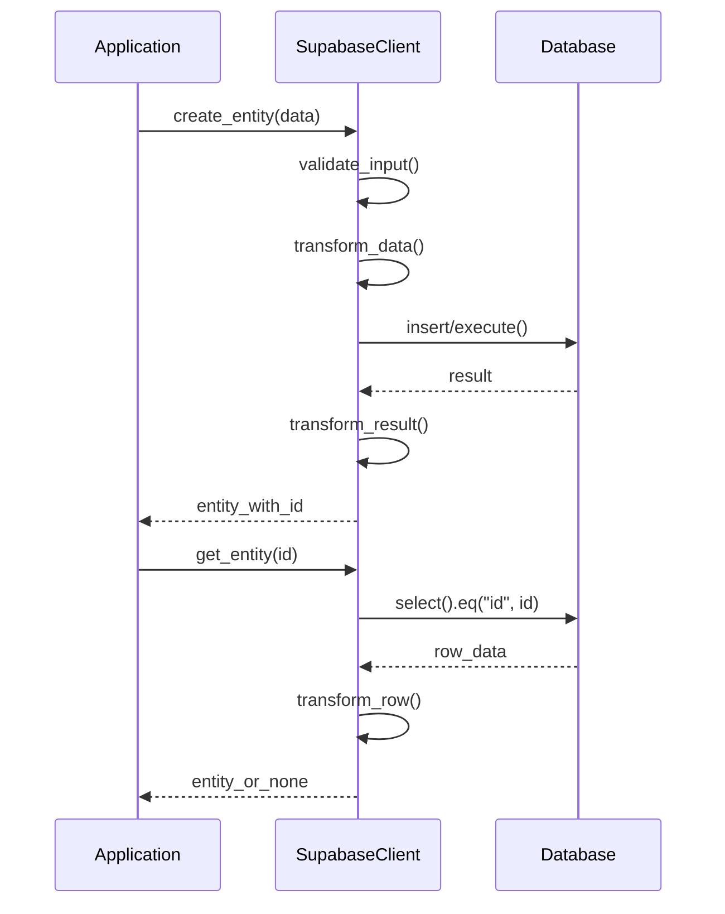

**Diagram sources**
- [supabase_client.py](file://src/supabase_client.py#L102-L158)
- [supabase_client.py](file://src/supabase_client.py#L160-L194)

### Error Handling Best Practices

Applications using the SupabaseClient should follow these error handling guidelines:

- **Specific Exception Handling**: Catch and handle specific exception types
- **Logging Integration**: Log all database operations and errors
- **User-Friendly Messages**: Provide meaningful error messages to users
- **Retry Logic**: Implement appropriate retry mechanisms for transient failures

### Connection Pooling and Reuse

To optimize performance:

- **Singleton Pattern**: Use a single client instance throughout the application
- **Connection Sharing**: Share connections between operations
- **Resource Cleanup**: Ensure proper cleanup of database resources
- **Monitoring**: Track connection health and performance metrics

### Data Validation Patterns

The client enforces data validation at multiple levels:

- **Input Validation**: Validate data before database operations
- **Type Checking**: Ensure proper data types for database columns
- **Range Validation**: Check numeric ranges and constraints
- **Format Validation**: Verify string formats and patterns

**Section sources**
- [test_supabase_client.py](file://test_supabase_client.py#L5-L43)
- [test_supabase_connection.py](file://test_supabase_connection.py#L7-L54)

## Troubleshooting Guide

This section provides solutions for common issues encountered when working with the SupabaseClient.

### Common Connection Issues

| Problem | Symptoms | Solution |
|---------|----------|----------|
| Missing Credentials | ValueError during initialization | Set SUPABASE_URL and SUPABASE_KEY environment variables |
| Network Connectivity | Connection timeout errors | Verify internet connection and Supabase project status |
| Schema Access | Permission denied errors | Confirm 'tales' schema access and permissions |
| Authentication Failure | 401 Unauthorized responses | Verify API key validity and permissions |

### Database Operation Failures

Common database operation issues and their resolutions:

- **Serialization Errors**: Ensure proper data type conversion
- **Constraint Violations**: Validate data against database constraints
- **Timeout Errors**: Increase timeout values for complex operations
- **Duplicate Key Errors**: Implement proper conflict resolution

### Audio File Upload Issues

Problems with audio file operations:

- **Upload Failures**: Check file size limits and format support
- **URL Generation Errors**: Verify file path construction
- **Storage Quota Exceeded**: Monitor storage usage and implement cleanup
- **Network Timeouts**: Implement retry logic for network operations

### Performance Troubleshooting

Performance-related issues:

- **Slow Queries**: Analyze query execution plans and add indexes
- **High Memory Usage**: Optimize batch sizes and result processing
- **Connection Pool Exhaustion**: Implement proper connection management
- **Network Latency**: Consider geographic proximity to Supabase region

### Debugging Techniques

Effective debugging approaches:

- **Enable Logging**: Set appropriate log levels for detailed tracing
- **Monitor Queries**: Use Supabase dashboard to monitor query performance
- **Validate Data**: Check data integrity and transformation logic
- **Test Isolation**: Isolate operations to identify specific issues

**Section sources**
- [test_supabase_client.py](file://test_supabase_client.py#L36-L40)
- [test_supabase_connection.py](file://test_supabase_connection.py#L50-L54)