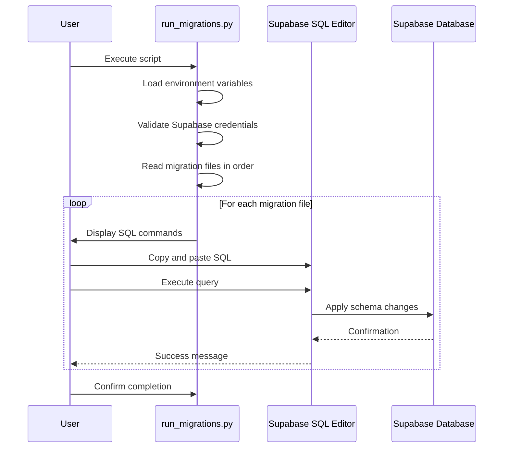
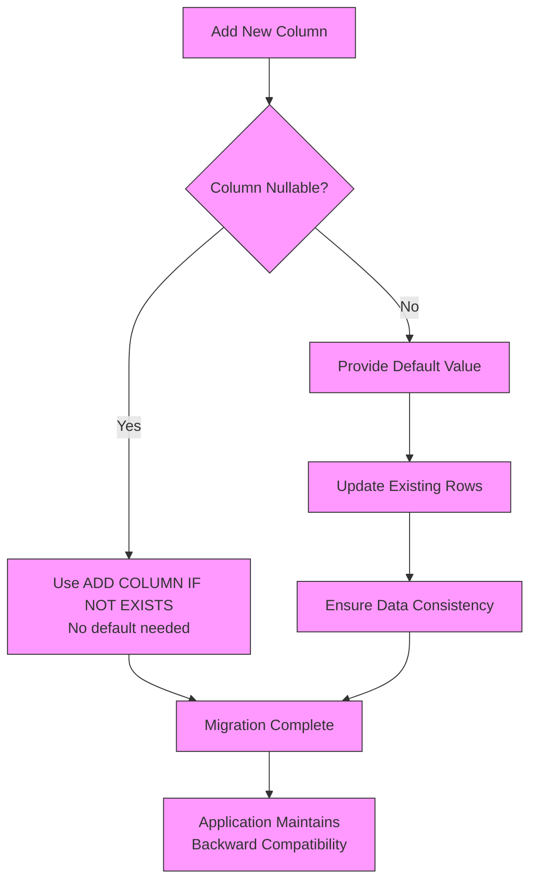

# Migration Management

<cite>
**Referenced Files in This Document**   
- [001_create_stories_table.sql](file://supabase/migrations/001_create_stories_table.sql)
- [002_add_model_info_to_stories.sql](file://supabase/migrations/002_add_model_info_to_stories.sql)
- [004_add_language_to_stories.sql](file://supabase/migrations/004_add_language_to_stories.sql)
- [005_create_children_table.sql](file://supabase/migrations/005_create_children_table.sql)
- [006_add_rating_to_stories.sql](file://supabase/migrations/006_add_rating_to_stories.sql)
- [007_add_generation_info_to_stories.sql](file://supabase/migrations/007_add_generation_info_to_stories.sql)
- [008_add_audio_provider_tracking.sql](file://supabase/migrations/008_add_audio_provider_tracking.sql)
- [run_migrations.py](file://src/run_migrations.py)
- [models.py](file://src/models.py)
- [apply_migration.py](file://apply_migration.py)
- [populate_stories.py](file://populate_stories.py)
</cite>

## Table of Contents
1. [Introduction](#introduction)
2. [Migration File Overview](#migration-file-overview)
3. [Migration Execution Strategy](#migration-execution-strategy)
4. [Schema Evolution Analysis](#schema-evolution-analysis)
5. [Backward Compatibility Approach](#backward-compatibility-approach)
6. [Migration Best Practices](#migration-best-practices)
7. [Model-Schema Synchronization](#model-schema-synchronization)
8. [Troubleshooting Common Issues](#troubleshooting-common-issues)
9. [Conclusion](#conclusion)

## Introduction

The database migration strategy for the Tale Generator application utilizes Supabase migrations to manage incremental schema evolution. This documentation details the migration process from initial table creation through to advanced feature additions, focusing on the stories table evolution. The migrations follow a structured approach to ensure data integrity, backward compatibility, and seamless integration with the application's Python models. The strategy enables the application to evolve its data schema while maintaining production stability and supporting new features such as model tracking, language support, rating systems, and audio provider integration.

**Section sources**
- [001_create_stories_table.sql](file://supabase/migrations/001_create_stories_table.sql)
- [run_migrations.py](file://src/run_migrations.py)

## Migration File Overview

The migration files are organized in the supabase/migrations directory and follow a sequential numbering convention (001_, 002_, etc.) to ensure proper execution order. Each migration file addresses a specific schema change, allowing for incremental evolution of the database structure. The naming convention uses descriptive prefixes that indicate the purpose of each migration, making it easy to understand the intent of each script. The migrations are designed to be idempotent through the use of IF NOT EXISTS and IF NOT EXISTS clauses, preventing errors when migrations are reapplied. This approach enables reliable deployment across different environments (development, staging, production) while maintaining schema consistency.

```mermaid
flowchart TD
A["Migration File: 001_create_stories_table.sql"] --> B["Migration File: 002_add_model_info_to_stories.sql"]
B --> C["Migration File: 004_add_language_to_stories.sql"]
C --> D["Migration File: 005_create_children_table.sql"]
D --> E["Migration File: 006_add_rating_to_stories.sql"]
E --> F["Migration File: 007_add_generation_info_to_stories.sql"]
F --> G["Migration File: 008_add_audio_provider_tracking.sql"]
style A fill:#f9f,stroke:#333
style B fill:#f9f,stroke:#333
style C fill:#f9f,stroke:#333
style D fill:#f9f,stroke:#333
style E fill:#f9f,stroke:#333
style F fill:#f9f,stroke:#333
style G fill:#f9f,stroke:#333
subgraph "Migration Execution Order"
A
B
C
D
E
F
G
end
```



**Diagram sources**
- [001_create_stories_table.sql](file://supabase/migrations/001_create_stories_table.sql)
- [002_add_model_info_to_stories.sql](file://supabase/migrations/002_add_model_info_to_stories.sql)
- [004_add_language_to_stories.sql](file://supabase/migrations/004_add_language_to_stories.sql)
- [005_create_children_table.sql](file://supabase/migrations/005_create_children_table.sql)
- [006_add_rating_to_stories.sql](file://supabase/migrations/006_add_rating_to_stories.sql)
- [007_add_generation_info_to_stories.sql](file://supabase/migrations/007_add_generation_info_to_stories.sql)
- [008_add_audio_provider_tracking.sql](file://supabase/migrations/008_add_audio_provider_tracking.sql)

**Section sources**
- [001_create_stories_table.sql](file://supabase/migrations/001_create_stories_table.sql)
- [002_add_model_info_to_stories.sql](file://supabase/migrations/002_add_model_info_to_stories.sql)
- [004_add_language_to_stories.sql](file://supabase/migrations/004_add_language_to_stories.sql)
- [005_create_children_table.sql](file://supabase/migrations/005_create_children_table.sql)
- [006_add_rating_to_stories.sql](file://supabase/migrations/006_add_rating_to_stories.sql)
- [007_add_generation_info_to_stories.sql](file://supabase/migrations/007_add_generation_info_to_stories.sql)
- [008_add_audio_provider_tracking.sql](file://supabase/migrations/008_add_audio_provider_tracking.sql)

## Migration Execution Strategy

The migration execution strategy combines automated scripting with manual oversight to ensure reliable deployment. The run_migrations.py script orchestrates the migration process by reading migration files in numerical order and displaying the SQL commands that need to be executed in the Supabase SQL editor. This approach acknowledges the limitation of the Supabase Python client, which does not support direct execution of raw SQL commands, and provides clear instructions for manual execution. The script validates environment variables, establishes a connection to Supabase, and processes migration files in the correct sequence. For each migration, it reads the SQL content and presents it to the user for manual execution in the Supabase dashboard. This hybrid approach ensures that migrations are applied consistently while maintaining visibility into the exact changes being made to the database schema.



**Diagram sources**
- [run_migrations.py](file://src/run_migrations.py)
- [apply_migration.py](file://apply_migration.py)

**Section sources**
- [run_migrations.py](file://src/run_migrations.py)
- [apply_migration.py](file://apply_migration.py)

## Schema Evolution Analysis

The schema evolution of the stories table demonstrates a thoughtful, incremental approach to database design. Starting with the foundational 001_create_stories_table.sql migration, the schema has evolved to support increasingly sophisticated features. The initial migration establishes the core structure with essential fields for story content, child information, and metadata. Subsequent migrations systematically enhance this foundation by adding model information tracking, language support, rating capabilities, generation metadata, and audio provider tracking. Each migration addresses a specific functional requirement while maintaining the integrity of existing data. The evolution reflects the application's growing complexity, from basic story generation to supporting multiple languages, tracking AI model usage, collecting user feedback through ratings, and integrating with voice providers for audio generation.

```mermaid
classDiagram
class StoriesTable {
+id UUID
+title TEXT
+content TEXT
+moral TEXT
+child_name TEXT
+child_age INTEGER
+child_gender TEXT
+child_interests TEXT[]
+created_at TIMESTAMP
+updated_at TIMESTAMP
+model_used TEXT
+full_response JSONB
+language TEXT
+rating INTEGER
+generation_info JSONB
+audio_provider TEXT
+audio_generation_metadata JSONB
+child_id UUID
}
class ChildrenTable {
+id UUID
+name TEXT
+age INTEGER
+gender TEXT
+interests TEXT[]
+created_at TIMESTAMP
+updated_at TIMESTAMP
}
StoriesTable --> ChildrenTable : "child_id references children.id"
note right of StoriesTable
Evolved through migrations :
1. Initial creation (001)
2. Model info added (002)
3. Language support (004)
4. Rating system (006)
5. Generation info (007)
6. Audio tracking (008)
end note
```

**Diagram sources**
- [001_create_stories_table.sql](file://supabase/migrations/001_create_stories_table.sql)
- [002_add_model_info_to_stories.sql](file://supabase/migrations/002_add_model_info_to_stories.sql)
- [004_add_language_to_stories.sql](file://supabase/migrations/004_add_language_to_stories.sql)
- [005_create_children_table.sql](file://supabase/migrations/005_create_children_table.sql)
- [006_add_rating_to_stories.sql](file://supabase/migrations/006_add_rating_to_stories.sql)
- [007_add_generation_info_to_stories.sql](file://supabase/migrations/007_add_generation_info_to_stories.sql)
- [008_add_audio_provider_tracking.sql](file://supabase/migrations/008_add_audio_provider_tracking.sql)

**Section sources**
- [001_create_stories_table.sql](file://supabase/migrations/001_create_stories_table.sql)
- [002_add_model_info_to_stories.sql](file://supabase/migrations/002_add_model_info_to_stories.sql)
- [004_add_language_to_stories.sql](file://supabase/migrations/004_add_language_to_stories.sql)
- [005_create_children_table.sql](file://supabase/migrations/005_create_children_table.sql)
- [006_add_rating_to_stories.sql](file://supabase/migrations/006_add_rating_to_stories.sql)
- [007_add_generation_info_to_stories.sql](file://supabase/migrations/007_add_generation_info_to_stories.sql)
- [008_add_audio_provider_tracking.sql](file://supabase/migrations/008_add_audio_provider_tracking.sql)

## Backward Compatibility Approach

The migration strategy prioritizes backward compatibility through careful column addition and default value management. When introducing new columns, the migrations use ADD COLUMN IF NOT EXISTS syntax to prevent errors if the column already exists. For non-nullable columns, default values are provided to ensure existing rows remain valid. The language column migration (004_add_language_to_stories.sql) exemplifies this approach by setting a default value of 'en' and updating existing rows to maintain consistency. The rating system migration (006_add_rating_to_stories.sql) uses a nullable INTEGER field with constraints (CHECK rating BETWEEN 1 AND 10) to allow gradual adoption without disrupting existing functionality. The use of JSONB columns for flexible data storage (full_response, generation_info, audio_generation_metadata) enables schema evolution without requiring frequent structural changes. This approach allows the application to deploy new features incrementally while maintaining compatibility with older code versions.



**Diagram sources**
- [004_add_language_to_stories.sql](file://supabase/migrations/004_add_language_to_stories.sql)
- [006_add_rating_to_stories.sql](file://supabase/migrations/006_add_rating_to_stories.sql)
- [007_add_generation_info_to_stories.sql](file://supabase/migrations/007_add_generation_info_to_stories.sql)

**Section sources**
- [004_add_language_to_stories.sql](file://supabase/migrations/004_add_language_to_stories.sql)
- [006_add_rating_to_stories.sql](file://supabase/migrations/006_add_rating_to_stories.sql)
- [007_add_generation_info_to_stories.sql](file://supabase/migrations/007_add_generation_info_to_stories.sql)

## Migration Best Practices

The migration implementation follows several best practices to ensure reliability and maintainability. Each migration file is designed to be idempotent, using IF NOT EXISTS clauses to prevent errors when reapplied. The scripts include appropriate indexes for new columns to maintain query performance as the schema evolves. Row Level Security (RLS) policies are consistently applied to ensure data protection across all tables. The migration files include descriptive comments that explain the purpose of each change, aiding future maintenance. The use of transactions (implied by the SQL execution context) ensures that each migration is applied atomically. The incremental approach, with each migration addressing a single concern, makes it easier to troubleshoot issues and understand the evolution of the schema. Additionally, the migration strategy includes post-migration data updates when necessary, such as setting default values for existing rows.

```mermaid
flowchart TD
A["Best Practice: Idempotency"] --> A1["Use IF NOT EXISTS clauses"]
A --> A2["Avoid duplicate object creation"]
B["Best Practice: Performance"] --> B1["Create indexes for new columns"]
B --> B2["Consider query patterns"]
C["Best Practice: Security"] --> C1["Enable RLS on all tables"]
C --> C2["Define appropriate policies"]
D["Best Practice: Documentation"] --> D1["Add descriptive comments"]
D --> D2["Explain migration purpose"]
E["Best Practice: Atomicity"] --> E1["Each migration as single unit"]
E --> E2["Use transactions"]
F["Best Practice: Incremental Changes"] --> F1["One concern per migration"]
F --> F2["Easy to review and test"]
style A fill:#f9f,stroke:#333
style B fill:#f9f,stroke:#333
style C fill:#f9f,stroke:#333
style D fill:#f9f,stroke:#333
style E fill:#f9f,stroke:#333
style F fill:#f9f,stroke:#333
```



**Diagram sources**
- [001_create_stories_table.sql](file://supabase/migrations/001_create_stories_table.sql)
- [005_create_children_table.sql](file://supabase/migrations/005_create_children_table.sql)
- [008_add_audio_provider_tracking.sql](file://supabase/migrations/008_add_audio_provider_tracking.sql)

**Section sources**
- [001_create_stories_table.sql](file://supabase/migrations/001_create_stories_table.sql)
- [002_add_model_info_to_stories.sql](file://supabase/migrations/002_add_model_info_to_stories.sql)
- [004_add_language_to_stories.sql](file://supabase/migrations/004_add_language_to_stories.sql)
- [005_create_children_table.sql](file://supabase/migrations/005_create_children_table.sql)
- [006_add_rating_to_stories.sql](file://supabase/migrations/006_add_rating_to_stories.sql)
- [007_add_generation_info_to_stories.sql](file://supabase/migrations/007_add_generation_info_to_stories.sql)
- [008_add_audio_provider_tracking.sql](file://supabase/migrations/008_add_audio_provider_tracking.sql)

## Model-Schema Synchronization

The application maintains synchronization between the database schema and Python models through a deliberate design approach. The StoryDB model in models.py reflects all fields present in the stories table, including those added through migrations. The model uses Optional type hints for fields that were added after the initial table creation, accurately representing their nullable nature in the database. The Pydantic BaseModel base class provides validation that aligns with database constraints, such as the rating field's bounds (1-10). The migration process is designed to be coordinated with model updates, ensuring that schema changes are accompanied by corresponding model modifications. The populate_stories.py script demonstrates this synchronization by using the StoryDB model to create and save stories, validating that the model and schema are compatible. This tight integration ensures data integrity across the application stack.

```mermaid
classDiagram
class StoryDB {
+id : Optional[str]
+title : str
+content : str
+moral : str
+child_id : Optional[str]
+child_name : Optional[str]
+child_age : Optional[int]
+child_gender : Optional[str]
+child_interests : Optional[List[str]]
+model_used : Optional[str]
+full_response : Optional[Any]
+generation_info : Optional[Any]
+language : Language
+story_length : Optional[int]
+rating : Optional[int]
+audio_file_url : Optional[str]
+audio_provider : Optional[str]
+audio_generation_metadata : Optional[Dict[str, Any]]
+created_at : Optional[datetime]
+updated_at : Optional[datetime]
}
class Language {
+ENGLISH : str
+RUSSIAN : str
}
class StoriesTable {
+id UUID
+title TEXT
+content TEXT
+moral TEXT
+child_id UUID
+child_name TEXT
+child_age INTEGER
+child_gender TEXT
+child_interests TEXT[]
+model_used TEXT
+full_response JSONB
+generation_info JSONB
+language TEXT
+story_length INTEGER
+rating INTEGER
+audio_file_url TEXT
+audio_provider TEXT
+audio_generation_metadata JSONB
+created_at TIMESTAMP
+updated_at TIMESTAMP
}
StoryDB --> StoriesTable : "Maps to"
Language --> StoriesTable : "language field"
note right of StoryDB
Synchronized with database schema
Optional fields match nullable columns
Validation aligns with constraints
end note
```

**Diagram sources**
- [models.py](file://src/models.py)
- [001_create_stories_table.sql](file://supabase/migrations/001_create_stories_table.sql)
- [008_add_audio_provider_tracking.sql](file://supabase/migrations/008_add_audio_provider_tracking.sql)

**Section sources**
- [models.py](file://src/models.py)
- [populate_stories.py](file://populate_stories.py)

## Troubleshooting Common Issues

Common migration issues and their solutions include handling execution failures, schema conflicts, and synchronization problems. If a migration fails to execute, the first step is to verify the Supabase credentials and connection. For syntax errors in SQL, review the migration file in the Supabase SQL editor, which provides syntax highlighting and error feedback. When encountering "column already exists" errors, this typically indicates a migration was applied twice; the IF NOT EXISTS clause should prevent this, but manual verification of the current schema may be necessary. For RLS policy conflicts, ensure that the policies defined in the migration match the application's security requirements. If model-schema mismatches occur, verify that the Python models have been updated to reflect recent schema changes. Network timeouts during migration can be addressed by increasing the client timeout values in the connection configuration. Always backup the database before applying migrations in production environments.

**Section sources**
- [run_migrations.py](file://src/run_migrations.py)
- [apply_migration.py](file://apply_migration.py)
- [001_create_stories_table.sql](file://supabase/migrations/001_create_stories_table.sql)

## Conclusion

The Supabase migration strategy for the Tale Generator application provides a robust framework for incremental schema evolution. By following a structured approach with sequentially numbered migration files, the system enables reliable database changes while maintaining backward compatibility. The strategy effectively balances automation with manual oversight, acknowledging the limitations of the Supabase Python client while providing clear execution pathways. The evolution of the stories table demonstrates how new features can be integrated through targeted migrations that enhance functionality without disrupting existing data. The synchronization between database schema and Python models ensures data integrity across the application stack. By adhering to best practices such as idempotency, proper indexing, and comprehensive documentation, the migration system supports the application's growth and adaptation to new requirements.